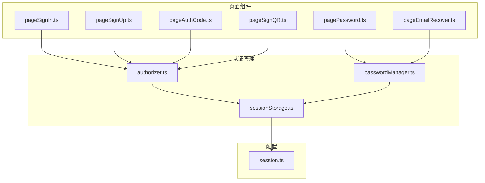
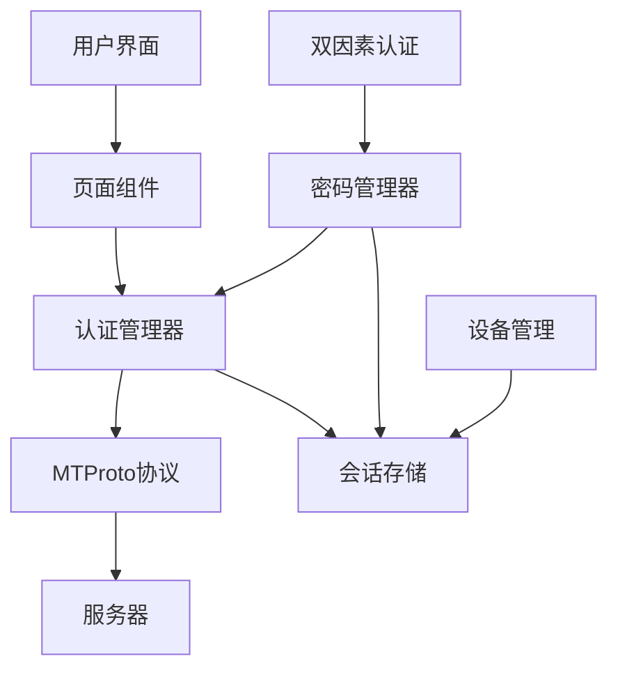
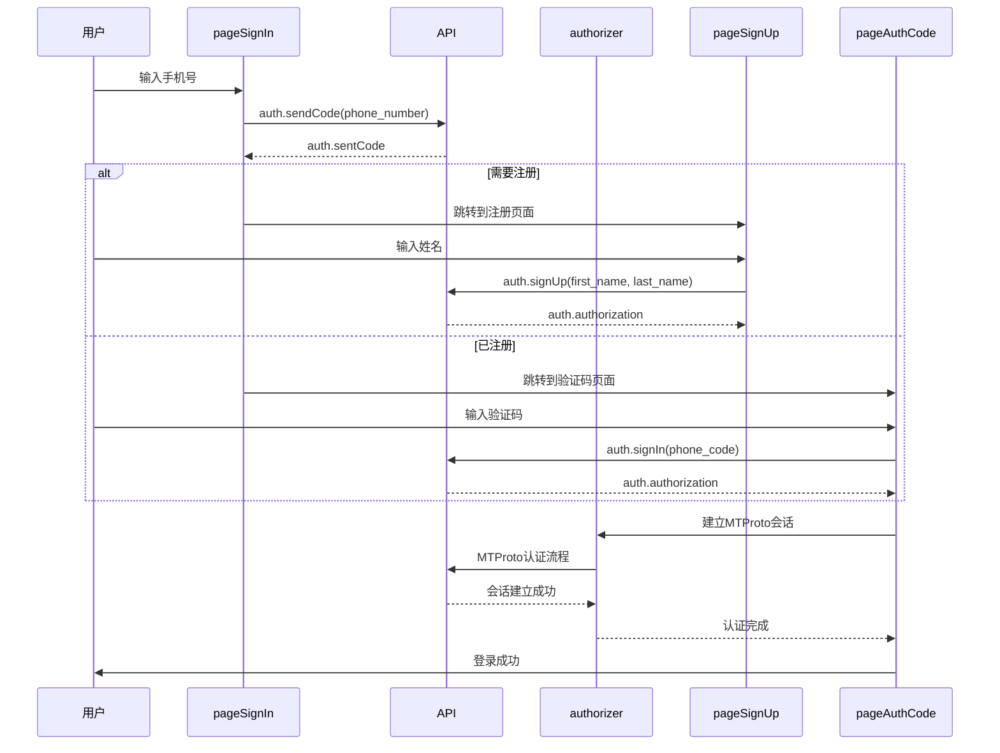
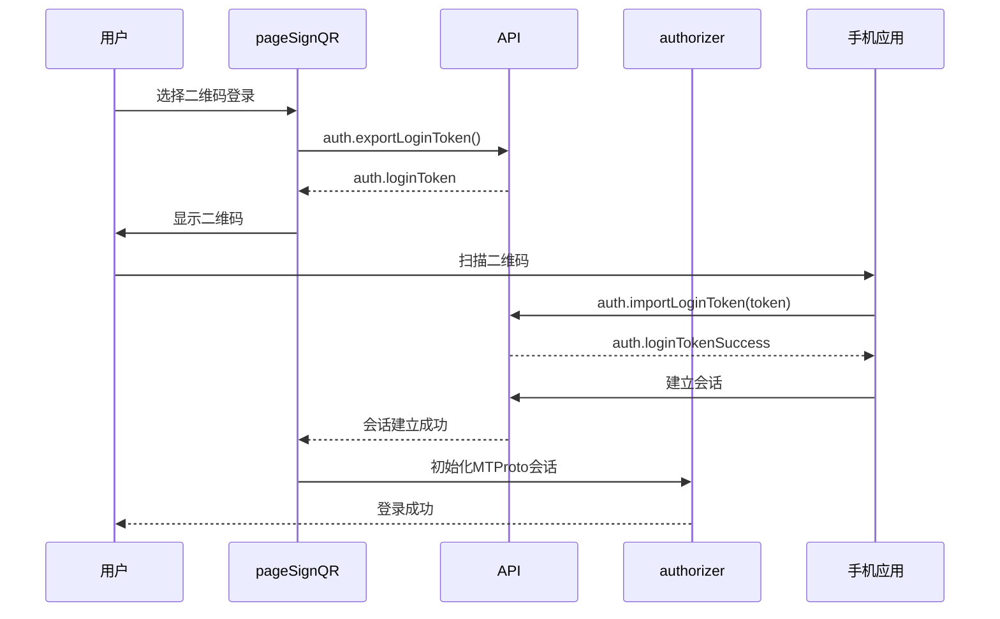
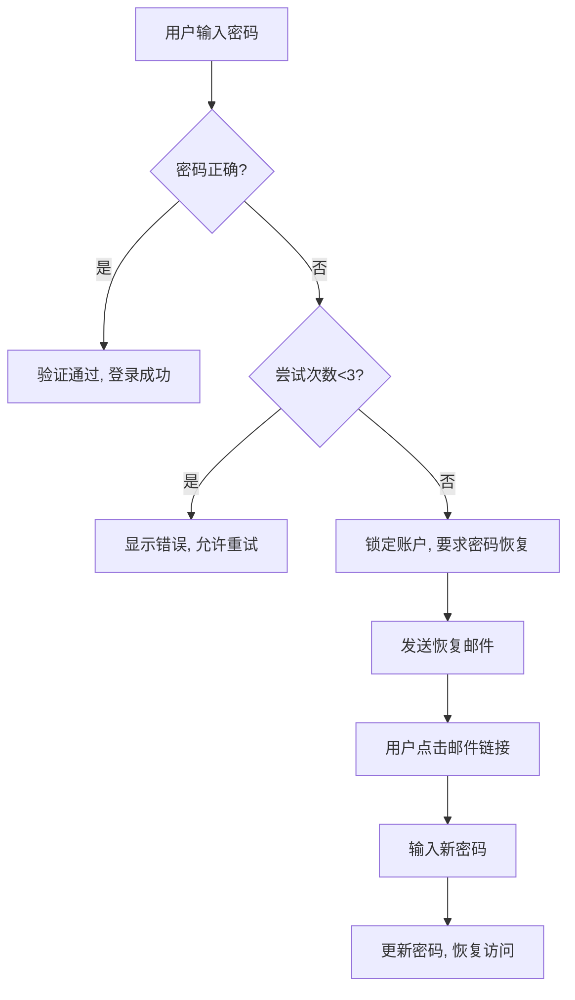
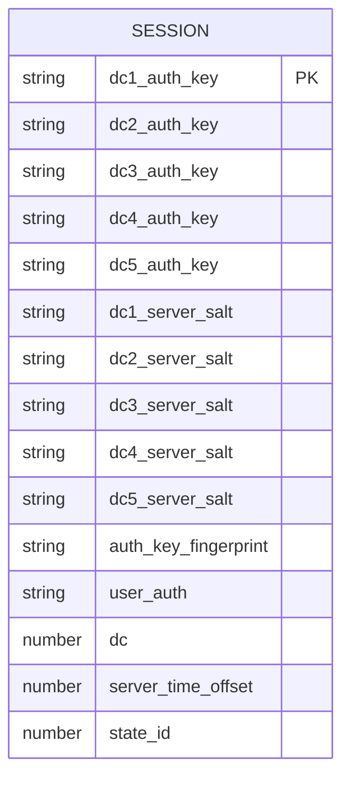
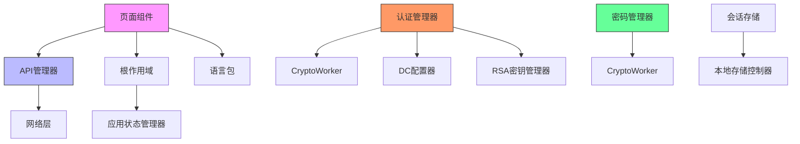

# 认证API

<cite>
**本文档引用的文件**   
- [loginPage.ts](file://src/pages/loginPage.ts)
- [pageSignIn.ts](file://src/pages/pageSignIn.ts)
- [pageSignUp.ts](file://src/pages/pageSignUp.ts)
- [pageAuthCode.ts](file://src/pages/pageAuthCode.ts)
- [pageSignQR.ts](file://src/pages/pageSignQR.ts)
- [pagePassword.ts](file://src/pages/pagePassword.ts)
- [pageEmailRecover.ts](file://src/pages/pageEmailRecover.ts)
- [authorizer.ts](file://src/lib/mtproto/authorizer.ts)
- [passwordManager.ts](file://src/lib/mtproto/passwordManager.ts)
- [sessionStorage.ts](file://src/lib/sessionStorage.ts)
- [session.ts](file://src/config/databases/session.ts)
</cite>

## 目录
1. [简介](#简介)
2. [项目结构](#项目结构)
3. [核心组件](#核心组件)
4. [架构概述](#架构概述)
5. [详细组件分析](#详细组件分析)
6. [依赖分析](#依赖分析)
7. [性能考虑](#性能考虑)
8. [故障排除指南](#故障排除指南)
9. [结论](#结论)
10. [附录](#附录)（如有必要）

## 简介
本文档全面记录了认证API的详细信息，包括登录、注册、密码验证等认证流程的API接口。文档描述了会话管理和令牌刷新机制，说明了双因素认证和设备管理的实现方式。同时提供了手机号验证、二维码登录和密码恢复的完整流程说明，解释了安全凭证存储和传输的加密策略，并包含认证错误处理和安全最佳实践指南。

## 项目结构
项目结构清晰地组织了认证相关的组件和页面。核心认证功能分布在`src/pages`目录下的多个页面组件中，包括登录、注册、验证码输入、密码验证等。认证状态管理和会话存储在`src/lib`目录下实现，而UI组件则位于`src/components`目录中。

**图表来源**
- [pageSignIn.ts](file://src/pages/pageSignIn.ts)
- [pageSignUp.ts](file://src/pages/pageSignUp.ts)
- [pageAuthCode.ts](file://src/pages/pageAuthCode.ts)
- [pageSignQR.ts](file://src/pages/pageSignQR.ts)
- [pagePassword.ts](file://src/pages/pagePassword.ts)
- [pageEmailRecover.ts](file://src/pages/pageEmailRecover.ts)
- [authorizer.ts](file://src/lib/mtproto/authorizer.ts)
- [passwordManager.ts](file://src/lib/mtproto/passwordManager.ts)
- [sessionStorage.ts](file://src/lib/sessionStorage.ts)
- [session.ts](file://src/config/databases/session.ts)

**章节来源**
- [src/pages](file://src/pages)
- [src/lib](file://src/lib)
- [src/components](file://src/components)

## 核心组件
认证系统的核心组件包括登录页面、注册页面、验证码页面、二维码登录页面、密码验证页面和邮箱恢复页面。这些组件共同构成了完整的用户认证流程。认证管理器负责处理MTProto协议的认证过程，包括密钥交换和会话建立。密码管理器处理双因素认证相关的操作，包括密码验证和恢复。

**章节来源**
- [pageSignIn.ts](file://src/pages/pageSignIn.ts#L1-L294)
- [pageSignUp.ts](file://src/pages/pageSignUp.ts#L1-L173)
- [authorizer.ts](file://src/lib/mtproto/authorizer.ts#L1-L662)
- [passwordManager.ts](file://src/lib/mtproto/passwordManager.ts#L1-L121)

## 架构概述
认证系统的架构基于MTProto协议，采用分层设计。前端页面组件负责用户交互，认证管理器处理协议级别的认证流程，会话存储管理器负责持久化会话数据。整个系统通过事件驱动的方式进行通信，确保各组件之间的松耦合。

**图表来源**
- [authorizer.ts](file://src/lib/mtproto/authorizer.ts#L1-L662)
- [passwordManager.ts](file://src/lib/mtproto/passwordManager.ts#L1-L121)
- [sessionStorage.ts](file://src/lib/sessionStorage.ts#L1-L83)

## 详细组件分析
### 登录和注册流程分析
登录和注册流程通过一系列页面组件实现，从手机号输入开始，经过验证码验证，最终完成认证。系统支持多种登录方式，包括短信验证码、应用内通知、电话呼叫和邮箱验证。

#### 登录流程序列图

**图表来源**
- [pageSignIn.ts](file://src/pages/pageSignIn.ts#L1-L294)
- [pageSignUp.ts](file://src/pages/pageSignUp.ts#L1-L173)
- [pageAuthCode.ts](file://src/pages/pageAuthCode.ts#L1-L328)
- [authorizer.ts](file://src/lib/mtproto/authorizer.ts#L1-L662)

#### 二维码登录流程

**图表来源**
- [pageSignQR.ts](file://src/pages/pageSignQR.ts#L1-L249)
- [authorizer.ts](file://src/lib/mtproto/authorizer.ts#L1-L662)

### 双因素认证分析
双因素认证通过密码管理器实现，支持密码验证、密码恢复和邮箱验证等功能。

#### 密码验证流程

**图表来源**
- [pagePassword.ts](file://src/pages/pagePassword.ts#L1-L232)
- [passwordManager.ts](file://src/lib/mtproto/passwordManager.ts#L1-L121)

### 会话管理和令牌刷新机制
会话管理通过本地存储实现，包括会话密钥、服务器盐值和时间偏移等信息的持久化存储。

#### 会话数据结构

**图表来源**
- [sessionStorage.ts](file://src/lib/sessionStorage.ts#L1-L83)
- [session.ts](file://src/config/databases/session.ts#L1-L18)

## 依赖分析
认证系统依赖于多个核心组件和外部库。主要依赖关系包括：

**图表来源**
- [authorizer.ts](file://src/lib/mtproto/authorizer.ts#L1-L662)
- [passwordManager.ts](file://src/lib/mtproto/passwordManager.ts#L1-L121)
- [sessionStorage.ts](file://src/lib/sessionStorage.ts#L1-L83)

**章节来源**
- [authorizer.ts](file://src/lib/mtproto/authorizer.ts#L1-L662)
- [passwordManager.ts](file://src/lib/mtproto/passwordManager.ts#L1-L121)
- [sessionStorage.ts](file://src/lib/sessionStorage.ts#L1-L83)

## 性能考虑
认证系统的性能主要受网络延迟和加密计算的影响。系统通过以下方式优化性能：
- 使用WebSocket传输替代HTTPS，减少连接建立时间
- 预加载Lottie动画资源，提高用户体验
- 缓存认证结果，避免重复的网络请求
- 使用Web Workers进行加密计算，避免阻塞主线程

## 故障排除指南
### 常见认证错误
| 错误类型 | 原因 | 解决方案 |
|--------|-----|--------|
| PHONE_NUMBER_INVALID | 手机号码格式不正确 | 检查号码格式，确保包含国家代码 |
| PHONE_CODE_EXPIRED | 验证码已过期 | 请求新的验证码 |
| PHONE_CODE_INVALID | 验证码不正确 | 重新输入正确的验证码 |
| SESSION_PASSWORD_NEEDED | 需要双因素认证密码 | 输入正确的2FA密码 |
| PASSWORD_HASH_INVALID | 密码不正确 | 检查密码并重试，或使用密码恢复功能 |

### 安全最佳实践
1. **密码策略**：强制使用强密码，包含大小写字母、数字和特殊字符
2. **会话管理**：定期刷新会话密钥，限制会话生命周期
3. **传输安全**：始终使用加密连接传输认证数据
4. **错误处理**：提供模糊的错误信息，防止信息泄露
5. **日志记录**：记录认证尝试，便于安全审计

**章节来源**
- [pageAuthCode.ts](file://src/pages/pageAuthCode.ts#L1-L328)
- [pagePassword.ts](file://src/pages/pagePassword.ts#L1-L232)
- [authorizer.ts](file://src/lib/mtproto/authorizer.ts#L1-L662)

## 结论
本文档详细描述了认证API的各个方面，包括登录、注册、双因素认证、会话管理等核心功能。系统基于MTProto协议实现安全的端到端认证，通过分层架构确保代码的可维护性和可扩展性。建议在实际部署时遵循文档中的安全最佳实践，确保用户数据的安全性。

## 附录
### API端点参考
- `auth.sendCode`：发送登录验证码
- `auth.signIn`：使用验证码登录
- `auth.signUp`：注册新账户
- `auth.exportLoginToken`：导出登录令牌（用于二维码登录）
- `auth.importLoginToken`：导入登录令牌
- `account.getPassword`：获取双因素认证状态
- `account.updatePasswordSettings`：更新密码设置
- `auth.checkPassword`：验证双因素认证密码
- `auth.requestPasswordRecovery`：请求密码恢复
- `auth.recoverPassword`：恢复密码

### 加密策略
系统使用以下加密技术确保认证安全：
- **RSA加密**：用于保护密钥交换过程
- **AES加密**：用于加密传输的数据
- **SHA-256哈希**：用于密码和密钥的哈希计算
- **SRP协议**：用于安全的密码验证
- **Diffie-Hellman密钥交换**：用于建立安全会话