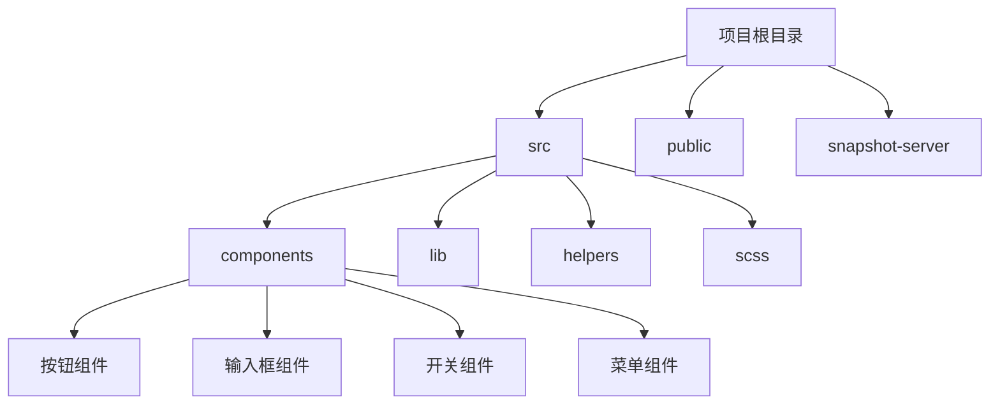
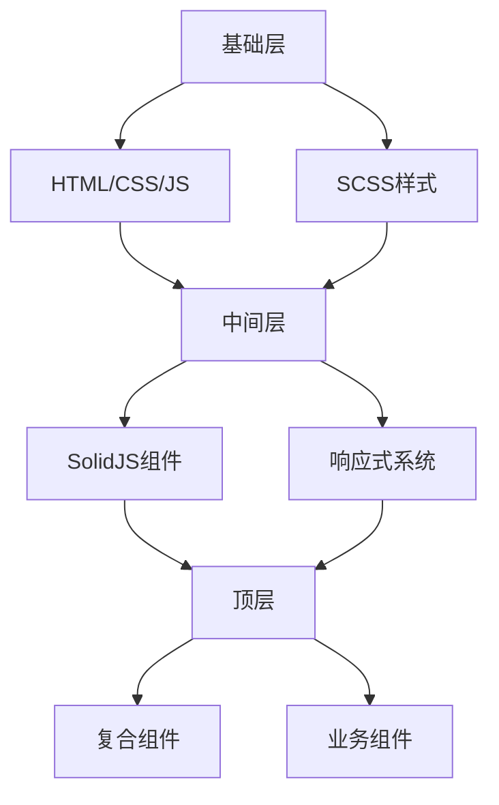
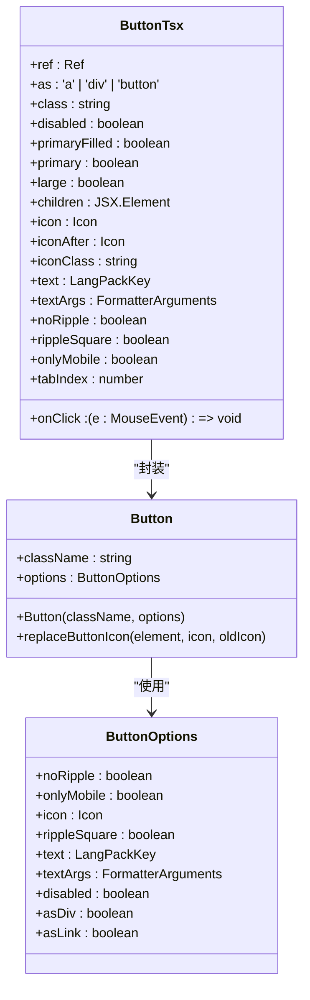
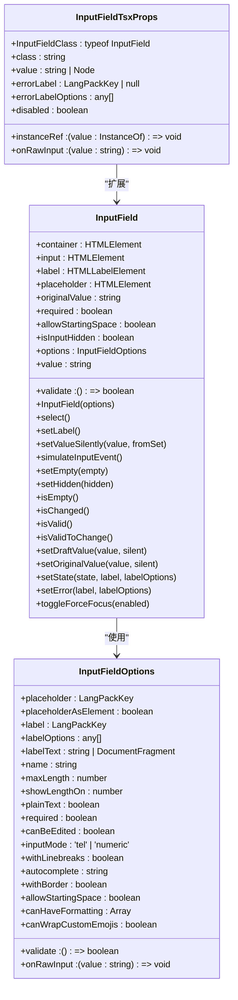
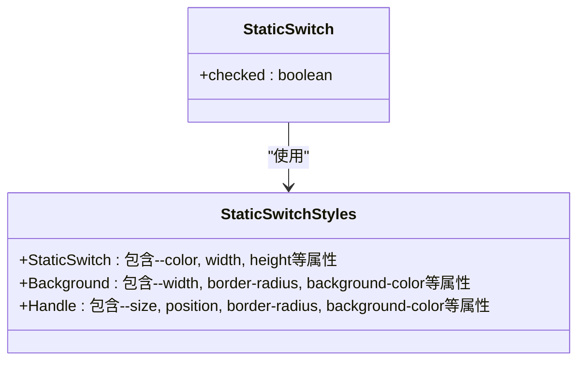
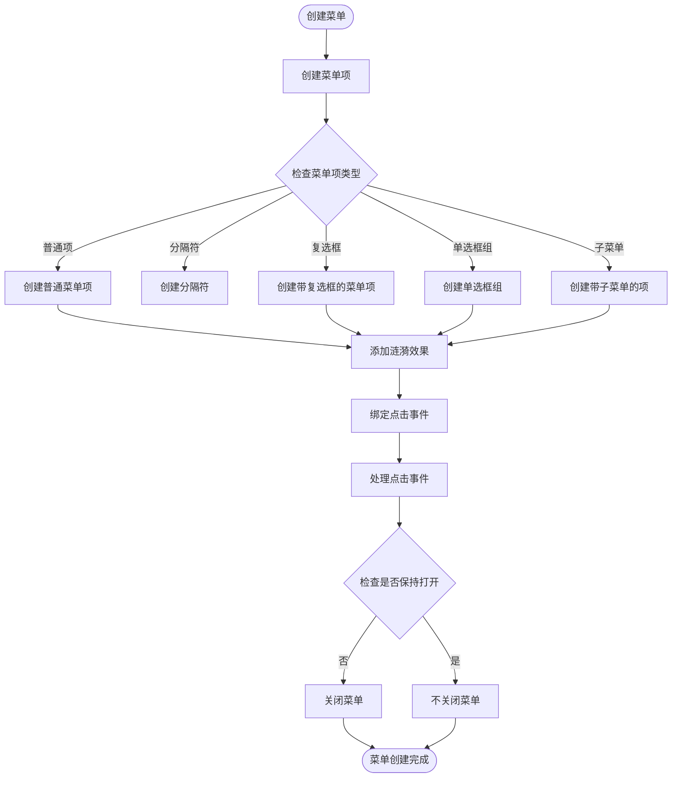
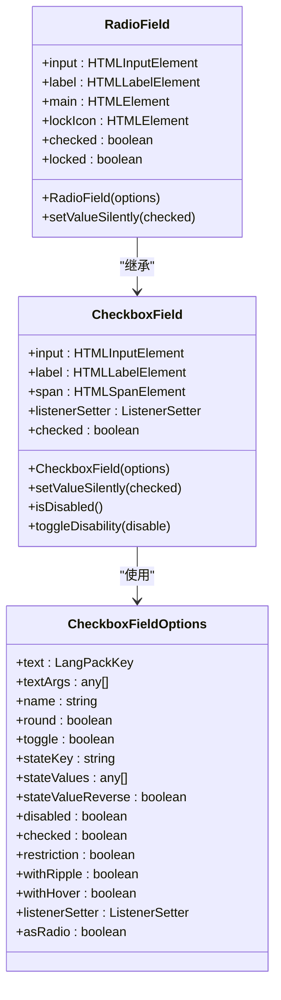
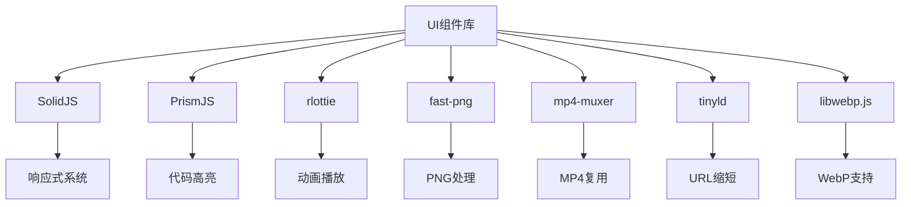

# UI组件库

<cite>
**本文档引用的文件**
- [button.ts](file://src/components/button.ts)
- [buttonTsx.tsx](file://src/components/buttonTsx.tsx)
- [inputField.ts](file://src/components/inputField.ts)
- [inputFieldTsx.tsx](file://src/components/inputFieldTsx.tsx)
- [staticSwitch.tsx](file://src/components/staticSwitch.tsx)
- [staticSwitch.module.scss](file://src/components/staticSwitch.module.scss)
- [buttonMenu.ts](file://src/components/buttonMenu.ts)
- [checkboxField.ts](file://src/components/checkboxField.ts)
- [radioField.ts](file://src/components/radioField.ts)
- [icon.ts](file://src/components/icon.ts)
- [README.md](file://README.md)
- [package.json](file://package.json)
</cite>

## 目录
1. [简介](#简介)
2. [项目结构](#项目结构)
3. [核心组件](#核心组件)
4. [架构概述](#架构概述)
5. [详细组件分析](#详细组件分析)
6. [依赖分析](#依赖分析)
7. [性能考虑](#性能考虑)
8. [故障排除指南](#故障排除指南)
9. [结论](#结论)

## 简介
本项目是一个基于Webogram改进的Telegram Web客户端，提供了一套完整的UI组件库。该组件库遵循现代化的前端开发实践，使用SolidJS框架构建，支持响应式设计和跨浏览器兼容性。组件库的设计注重可复用性、可访问性和性能优化，为开发者提供了丰富的UI组件选择。

## 项目结构
项目采用模块化的目录结构，主要分为以下几个部分：
- `src/components`：包含所有UI组件的实现
- `src/lib`：包含核心业务逻辑和工具库
- `src/helpers`：包含各种辅助函数和工具
- `src/scss`：包含样式相关的SCSS文件
- `public`：包含静态资源文件

**图表来源**
- [src/components](file://src/components)

**章节来源**
- [README.md](file://README.md#L1-L88)

## 核心组件
UI组件库包含多种可复用的UI组件，主要包括按钮、输入框、开关、复选框、单选框等基础组件，以及更复杂的菜单、弹窗等复合组件。这些组件都遵循一致的设计原则和使用规范，确保了UI的一致性和可维护性。

**章节来源**
- [src/components/button.ts](file://src/components/button.ts#L1-L60)
- [src/components/inputField.ts](file://src/components/inputField.ts#L1-L800)

## 架构概述
组件库采用分层架构设计，底层是基础的HTML/CSS/JavaScript实现，中间层是基于SolidJS的响应式组件封装，顶层是各种复合组件和业务组件。这种分层设计使得组件既保持了良好的性能，又具有很好的可扩展性和可维护性。

**图表来源**
- [package.json](file://package.json#L1-L76)
- [src/components](file://src/components)

## 详细组件分析

### 按钮组件分析
按钮组件是UI中最常用的交互元素之一，提供了多种样式和状态的变体。

#### 按钮组件类图

**图表来源**
- [src/components/button.ts](file://src/components/button.ts#L1-L60)
- [src/components/buttonTsx.tsx](file://src/components/buttonTsx.tsx#L1-L74)

**章节来源**
- [src/components/button.ts](file://src/components/button.ts#L1-L60)
- [src/components/buttonTsx.tsx](file://src/components/buttonTsx.tsx#L1-L74)

### 输入框组件分析
输入框组件提供了丰富的功能，包括占位符、标签、验证、长度限制等。

#### 输入框组件类图

**图表来源**
- [src/components/inputField.ts](file://src/components/inputField.ts#L1-L800)
- [src/components/inputFieldTsx.tsx](file://src/components/inputFieldTsx.tsx#L1-L74)

**章节来源**
- [src/components/inputField.ts](file://src/components/inputField.ts#L1-L800)
- [src/components/inputFieldTsx.tsx](file://src/components/inputFieldTsx.tsx#L1-L74)

### 开关组件分析
开关组件提供了一个简单的开关控件，用于在两种状态之间切换。

#### 开关组件样式分析

**图表来源**
- [src/components/staticSwitch.tsx](file://src/components/staticSwitch.tsx#L1-L19)
- [src/components/staticSwitch.module.scss](file://src/components/staticSwitch.module.scss#L1-L60)

**章节来源**
- [src/components/staticSwitch.tsx](file://src/components/staticSwitch.tsx#L1-L19)
- [src/components/staticSwitch.module.scss](file://src/components/staticSwitch.module.scss#L1-L60)

### 菜单组件分析
菜单组件提供了一个可扩展的菜单系统，支持嵌套菜单和各种菜单项类型。

#### 菜单组件工作流程

**图表来源**
- [src/components/buttonMenu.ts](file://src/components/buttonMenu.ts#L1-L291)

**章节来源**
- [src/components/buttonMenu.ts](file://src/components/buttonMenu.ts#L1-L291)

### 复选框和单选框组件分析
复选框和单选框组件提供了表单选择控件的实现。

#### 复选框和单选框组件类图

**图表来源**
- [src/components/checkboxField.ts](file://src/components/checkboxField.ts#L1-L196)
- [src/components/radioField.ts](file://src/components/radioField.ts#L1-L114)

**章节来源**
- [src/components/checkboxField.ts](file://src/components/checkboxField.ts#L1-L196)
- [src/components/radioField.ts](file://src/components/radioField.ts#L1-L114)

## 依赖分析
组件库依赖于多个第三方库和框架，主要包括：

**图表来源**
- [package.json](file://package.json#L26-L73)
- [README.md](file://README.md#L47-L62)

**章节来源**
- [package.json](file://package.json#L1-L76)
- [README.md](file://README.md#L47-L62)

## 性能考虑
组件库在设计时充分考虑了性能因素，采用了多种优化策略：

1. **虚拟列表**：对于长列表，使用虚拟列表技术只渲染可见区域的元素
2. **懒加载**：对于图片和动画资源，采用懒加载策略
3. **事件委托**：对于大量相似元素的事件处理，使用事件委托减少事件监听器数量
4. **防抖和节流**：对于频繁触发的事件，使用防抖和节流技术优化性能
5. **CSS动画**：优先使用CSS动画而不是JavaScript动画，利用硬件加速
6. **资源预加载**：对于关键资源，提前预加载以减少等待时间

## 故障排除指南
在使用UI组件库时可能会遇到一些常见问题，以下是一些解决方案：

**章节来源**
- [README.md](file://README.md#L63-L74)

## 结论
本UI组件库提供了一套完整、高效、可复用的UI组件，支持现代化的Web开发需求。通过合理的架构设计和性能优化，组件库能够在保证功能丰富性的同时提供良好的用户体验。未来可以进一步完善文档、增加更多组件类型、优化主题定制能力，使组件库更加完善和易用。