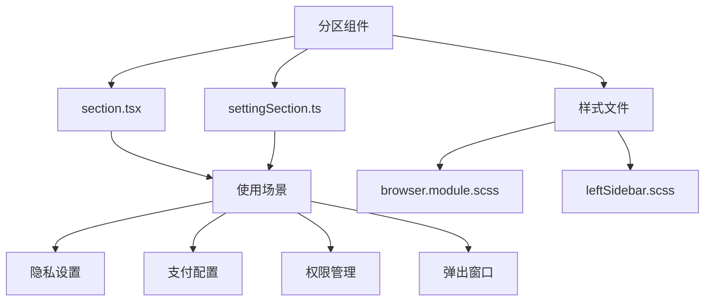
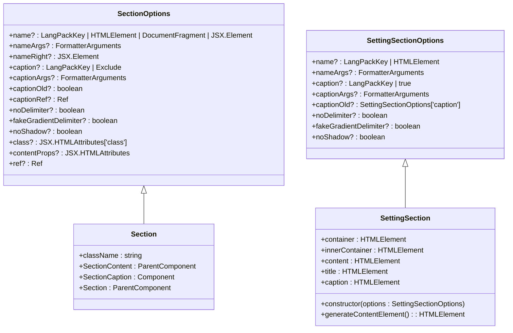
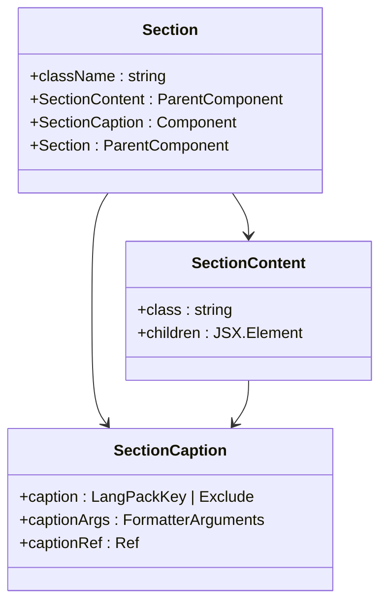
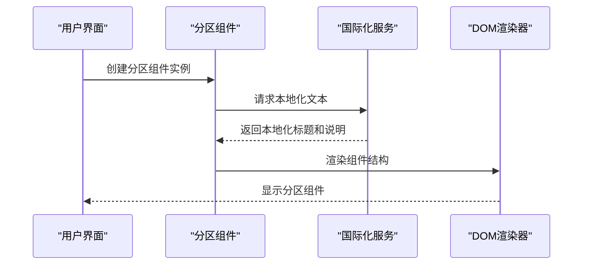
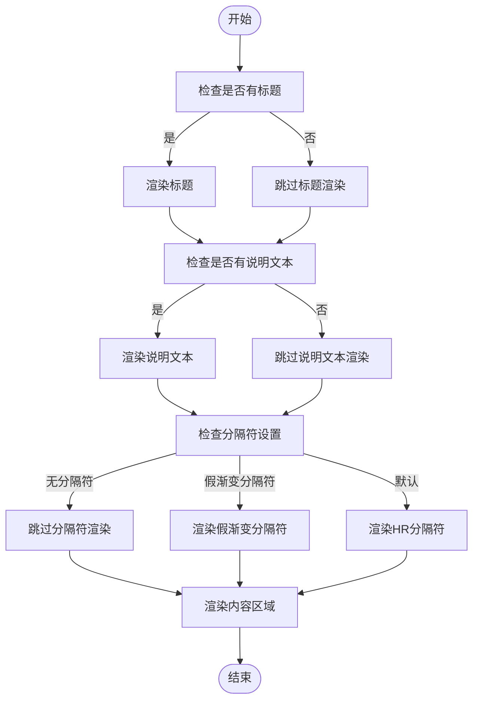
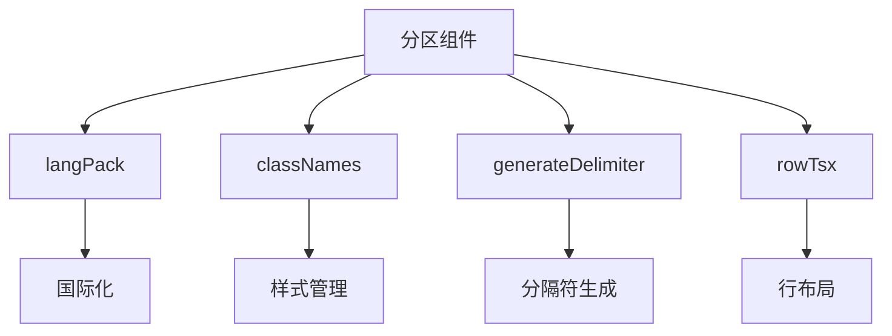

# 分区组件

<cite>
**本文档中引用的文件**  
- [section.tsx](file://src/components/section.tsx)
- [settingSection.ts](file://src/components/settingSection.ts)
- [rowTsx.tsx](file://src/components/rowTsx.tsx)
- [optionsSection.tsx](file://src/components/sidebarLeft/tabs/privacy/messages/optionsSection.tsx)
- [paidSettingsSection.tsx](file://src/components/sidebarLeft/tabs/privacy/messages/paidSettingsSection.tsx)
- [chargeForMessasgesSection.tsx](file://src/components/sidebarRight/tabs/groupPermissions/chargeForMessasgesSection.tsx)
- [browser.module.scss](file://src/components/browser.module.scss)
- [leftSidebar.scss](file://src/scss/partials/_leftSidebar.scss)
</cite>

## 目录
1. [简介](#简介)
2. [项目结构](#项目结构)
3. [核心组件](#核心组件)
4. [架构概述](#架构概述)
5. [详细组件分析](#详细组件分析)
6. [依赖分析](#依赖分析)
7. [性能考虑](#性能考虑)
8. [故障排除指南](#故障排除指南)
9. [结论](#结论)

## 简介
分区组件是Telegram Web客户端中用于组织用户界面内容的核心布局组件。它提供了一种结构化的方式来分组和展示设置页面、配置面板和其他界面区域中的相关功能。该组件支持标题、说明文本、分隔符和阴影等视觉元素，以增强用户体验和界面清晰度。分区组件在隐私设置、支付配置、权限管理等多个场景中被广泛使用，为用户提供直观的导航和信息组织方式。

## 项目结构
分区组件主要位于`src/components`目录下，其核心实现文件为`section.tsx`，同时存在一个基于类的实现`settingSection.ts`。该组件在多个子系统中被引用，包括左侧边栏的隐私设置、右侧边栏的群组权限管理以及弹出窗口中的各种配置面板。分区组件与行组件（Row）紧密配合，共同构建出层次分明的用户界面。

**Diagram sources**
- [section.tsx](file://src/components/section.tsx)
- [settingSection.ts](file://src/components/settingSection.ts)
- [browser.module.scss](file://src/components/browser.module.scss)
- [leftSidebar.scss](file://src/scss/partials/_leftSidebar.scss)

**Section sources**
- [section.tsx](file://src/components/section.tsx)
- [settingSection.ts](file://src/components/settingSection.ts)

## 核心组件
分区组件的核心功能是提供一个可复用的容器，用于组织和展示UI内容。它支持多种配置选项，包括标题、说明文本、分隔符、阴影效果等。组件采用SolidJS框架实现，利用其响应式特性确保界面更新的高效性。分区组件通过`SectionOptions`接口定义了所有可用的配置属性，允许开发者根据具体需求定制外观和行为。

**Section sources**
- [section.tsx](file://src/components/section.tsx#L11-L26)
- [settingSection.ts](file://src/components/settingSection.ts#L11-L22)

## 架构概述
分区组件的架构设计体现了模块化和可复用性的原则。它由一个主容器、内容区域、标题和说明文本等部分组成。组件通过CSS类名控制样式，支持多种视觉变体，如无阴影、无分隔符等。在实现上，组件区分了函数式组件（section.tsx）和类式组件（settingSection.ts）两种形式，以适应不同的使用场景和编程范式。

**Diagram sources**
- [section.tsx](file://src/components/section.tsx#L11-L26)
- [settingSection.ts](file://src/components/settingSection.ts#L11-L22)

## 详细组件分析

### 分区组件分析
分区组件通过`section.tsx`文件实现，采用SolidJS的函数式组件模式。组件支持丰富的布局属性，包括标题、说明文本、右侧元素、分隔符和阴影效果。通过`name`和`caption`属性，组件能够显示本地化的标题和说明文本，支持动态参数注入。`noDelimiter`和`noShadow`属性允许控制分隔符和阴影的显示，以适应不同的设计需求。

#### 对象导向组件：

**Diagram sources**
- [section.tsx](file://src/components/section.tsx#L28-L77)

#### API/服务组件：

**Diagram sources**
- [section.tsx](file://src/components/section.tsx)
- [langPack](file://src/lib/langPack)

#### 复杂逻辑组件：

**Diagram sources**
- [section.tsx](file://src/components/section.tsx#L45-L75)

**Section sources**
- [section.tsx](file://src/components/section.tsx#L1-L78)

### 设置分区分析
`settingSection.ts`提供了一个基于类的分区组件实现，主要用于需要更复杂状态管理的场景。与函数式组件不同，类式组件通过实例属性直接暴露DOM元素，便于外部代码进行操作。该组件在滚动容器中生成内容区域，支持动态添加内容，适用于需要程序化控制的界面场景。

**Section sources**
- [settingSection.ts](file://src/components/settingSection.ts#L25-L111)

## 依赖分析
分区组件依赖于多个核心模块，包括国际化服务（langPack）、字符串工具（classNames）和DOM生成工具（generateDelimiter）。这些依赖确保了组件的本地化支持、样式管理和结构完整性。组件与行组件（Row）形成紧密的组合关系，共同构建出复杂的用户界面布局。

**Diagram sources**
- [section.tsx](file://src/components/section.tsx#L8-L9)
- [rowTsx.tsx](file://src/components/rowTsx.tsx)

**Section sources**
- [section.tsx](file://src/components/section.tsx#L7-L26)
- [rowTsx.tsx](file://src/components/rowTsx.tsx#L1-L265)

## 性能考虑
分区组件的设计考虑了性能优化，通过SolidJS的响应式系统确保只有受影响的部分才会重新渲染。组件避免了不必要的DOM操作，利用虚拟DOM的特性提高渲染效率。对于大量分区的场景，建议结合虚拟列表技术，以减少内存占用和提高滚动性能。

## 故障排除指南
当分区组件显示异常时，应首先检查以下方面：确保必要的依赖模块已正确导入，验证本地化键名是否存在于语言包中，确认CSS类名未被意外覆盖。对于动态内容加载问题，检查`contentProps`是否正确传递，确保异步操作完成后才更新组件状态。

**Section sources**
- [section.tsx](file://src/components/section.tsx)
- [settingSection.ts](file://src/components/settingSection.ts)

## 结论
分区组件是Telegram Web客户端中不可或缺的UI构建块，它通过灵活的配置选项和清晰的结构设计，为各种设置和配置场景提供了统一的界面组织方式。组件的双重实现（函数式和类式）适应了不同的使用需求，而与行组件的协同工作则构建出了丰富多样的用户界面。随着应用功能的不断扩展，分区组件将继续发挥其在界面组织和用户体验优化中的关键作用。