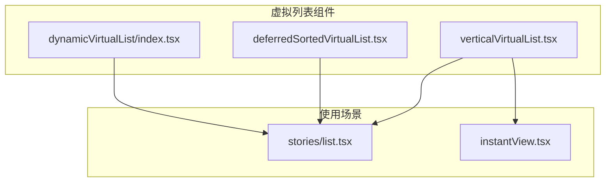
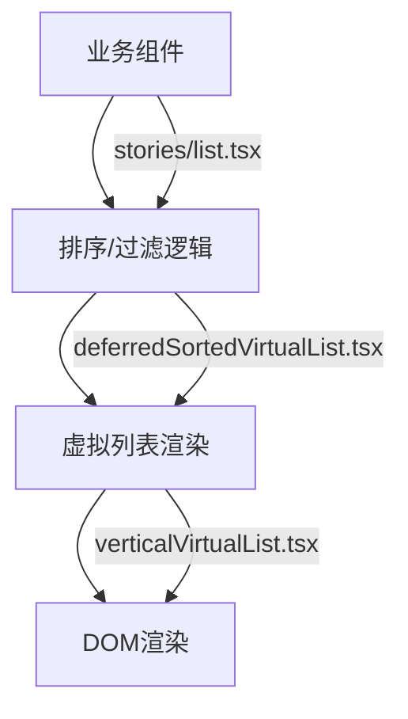
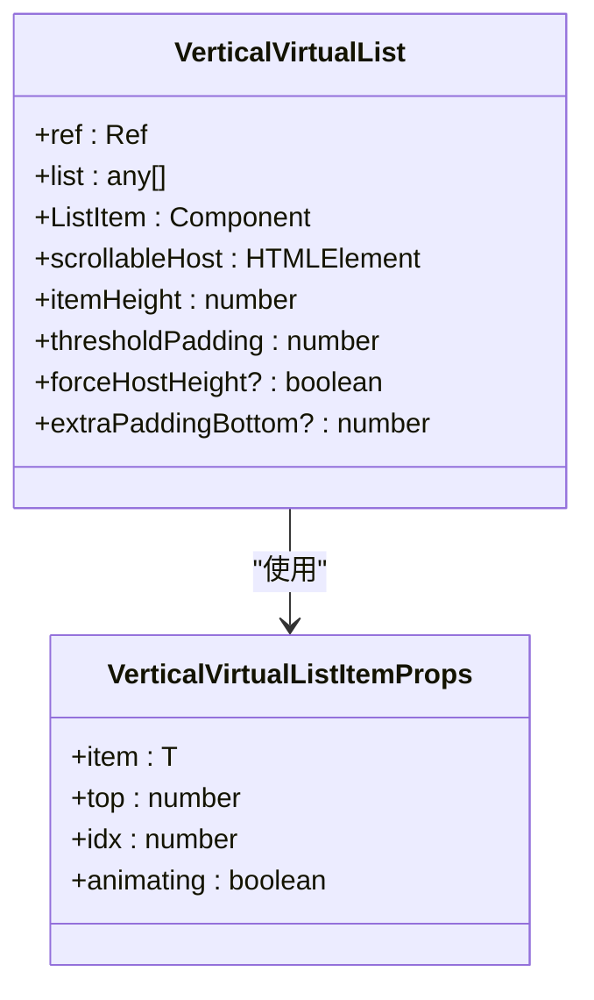
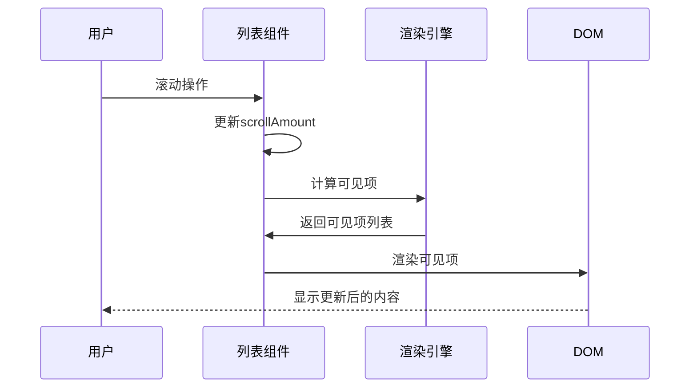
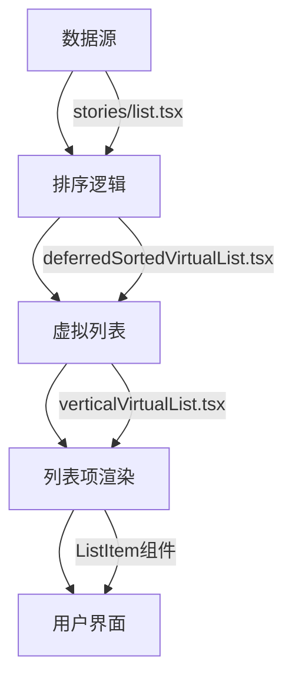
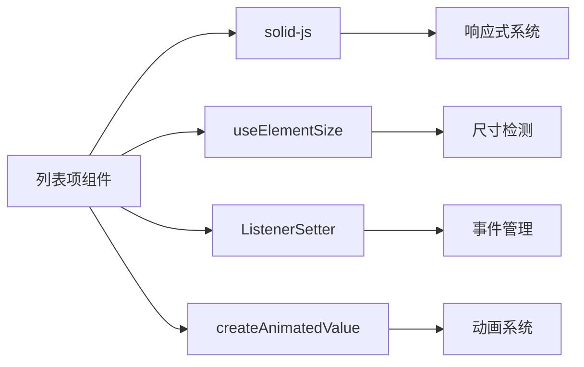

# 列表项组件

<cite>
**本文档中引用的文件**  
- [verticalVirtualList.tsx](file://src/components/verticalVirtualList.tsx)
- [deferredSortedVirtualList.tsx](file://src/components/deferredSortedVirtualList.tsx)
- [dynamicVirtualList/index.tsx](file://src/components/dynamicVirtualList/index.tsx)
- [stories/list.tsx](file://src/components/stories/list.tsx)
- [instantView.tsx](file://src/components/instantView.tsx)
</cite>

## 目录
1. [简介](#简介)
2. [项目结构](#项目结构)
3. [核心组件](#核心组件)
4. [架构概述](#架构概述)
5. [详细组件分析](#详细组件分析)
6. [依赖分析](#依赖分析)
7. [性能考虑](#性能考虑)
8. [故障排除指南](#故障排除指南)
9. [结论](#结论)

## 简介
列表项组件是用户界面中的基本构建块，用于在对话列表、联系人列表、故事列表等多种场景中展示信息。该组件支持丰富的布局结构、交互行为和状态样式，并可通过虚拟滚动实现高性能渲染。本文档详细说明了列表项组件的设计、实现和使用方式。

## 项目结构
列表项组件主要分布在 `src/components` 目录下，涉及多个虚拟列表实现和具体使用场景。核心的虚拟列表组件包括垂直虚拟列表、延迟排序虚拟列表和动态虚拟列表，它们共同构成了高效渲染的基础。

**Diagram sources**
- [verticalVirtualList.tsx](file://src/components/verticalVirtualList.tsx#L1-L188)
- [deferredSortedVirtualList.tsx](file://src/components/deferredSortedVirtualList.tsx#L1-L300)
- [dynamicVirtualList/index.tsx](file://src/components/dynamicVirtualList/index.tsx#L1-L300)

**Section sources**
- [verticalVirtualList.tsx](file://src/components/verticalVirtualList.tsx#L1-L188)
- [deferredSortedVirtualList.tsx](file://src/components/deferredSortedVirtualList.tsx#L1-L300)

## 核心组件
列表项组件的核心是 `VerticalVirtualList`，它通过虚拟滚动技术高效渲染大量列表项。组件接收列表数据、列表项渲染函数和滚动容器作为参数，仅渲染视口内的项目以优化性能。

**Section sources**
- [verticalVirtualList.tsx](file://src/components/verticalVirtualList.tsx#L8-L188)

## 架构概述
列表项组件采用分层架构设计，基础层为虚拟列表组件，中间层为排序和过滤逻辑，顶层为具体业务场景的实现。这种设计实现了关注点分离，提高了组件的可维护性和可复用性。

**Diagram sources**
- [stories/list.tsx](file://src/components/stories/list.tsx#L1-L400)
- [deferredSortedVirtualList.tsx](file://src/components/deferredSortedVirtualList.tsx#L1-L300)
- [verticalVirtualList.tsx](file://src/components/verticalVirtualList.tsx#L1-L188)

## 详细组件分析

### 垂直虚拟列表分析
`VerticalVirtualList` 组件是列表渲染的基础，它通过智能的可见性检测和动画控制，实现了流畅的滚动体验。

#### 类图

**Diagram sources**
- [verticalVirtualList.tsx](file://src/components/verticalVirtualList.tsx#L8-L188)

#### 交互流程

**Diagram sources**
- [verticalVirtualList.tsx](file://src/components/verticalVirtualList.tsx#L31-L107)

**Section sources**
- [verticalVirtualList.tsx](file://src/components/verticalVirtualList.tsx#L1-L188)

### 故事列表分析
故事列表组件展示了列表项在具体业务场景中的应用，它结合了虚拟列表和排序逻辑，实现了复杂的数据展示需求。

#### 数据流图

**Diagram sources**
- [stories/list.tsx](file://src/components/stories/list.tsx#L1-L400)
- [deferredSortedVirtualList.tsx](file://src/components/deferredSortedVirtualList.tsx#L1-L300)
- [verticalVirtualList.tsx](file://src/components/verticalVirtualList.tsx#L1-L188)

**Section sources**
- [stories/list.tsx](file://src/components/stories/list.tsx#L1-L400)

## 依赖分析
列表项组件依赖于多个核心模块，包括状态管理、DOM操作和动画系统。这些依赖关系确保了组件的高效运行和良好的用户体验。

**Diagram sources**
- [verticalVirtualList.tsx](file://src/components/verticalVirtualList.tsx#L1-L188)
- [hooks/useElementSize.ts](file://src/hooks/useElementSize.ts#L1-L50)
- [helpers/solid/createAnimatedValue.ts](file://src/helpers/solid/createAnimatedValue.ts#L1-L30)

**Section sources**
- [verticalVirtualList.tsx](file://src/components/verticalVirtualList.tsx#L1-L188)

## 性能考虑
列表项组件通过多种技术实现高性能渲染：
- 虚拟滚动：仅渲染视口内的项目
- 动画优化：智能判断是否需要动画
- 记忆化计算：避免重复计算
- 批量更新：减少DOM操作次数

这些优化策略确保了即使在处理大量数据时，用户界面也能保持流畅。

## 故障排除指南
当列表项组件出现问题时，可以参考以下常见问题的解决方案：

**Section sources**
- [verticalVirtualList.tsx](file://src/components/verticalVirtualList.tsx#L1-L188)
- [deferredSortedVirtualList.tsx](file://src/components/deferredSortedVirtualList.tsx#L1-L300)

## 结论
列表项组件通过精心设计的架构和多种优化技术，实现了高效、灵活的列表渲染能力。它不仅满足了基本的展示需求，还通过虚拟滚动和智能动画等特性，提供了优秀的用户体验。该组件的设计模式可以作为其他复杂UI组件的参考范例。