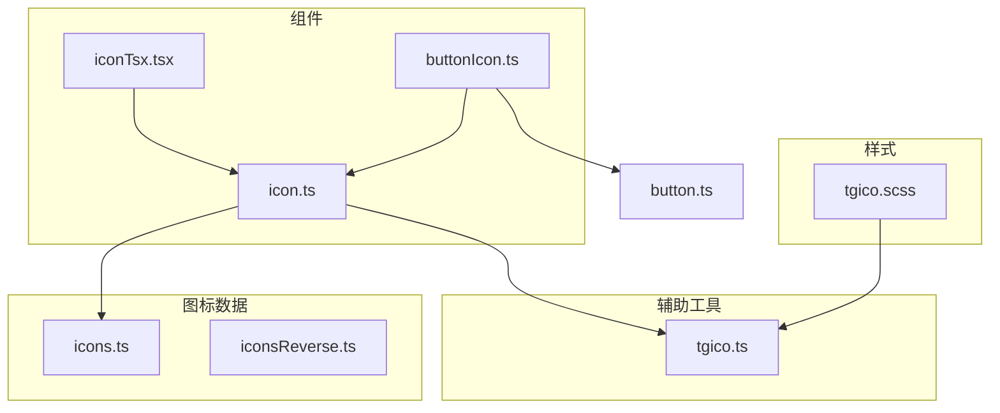
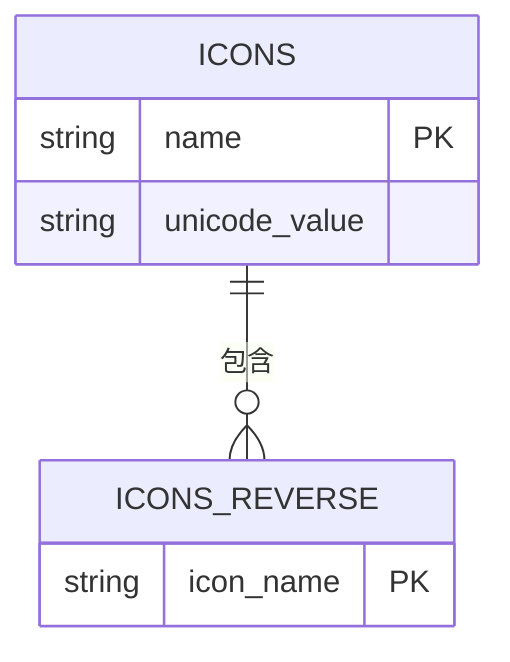
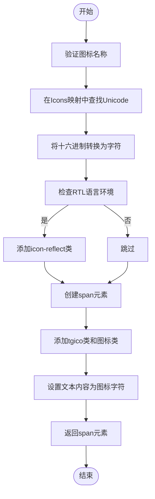
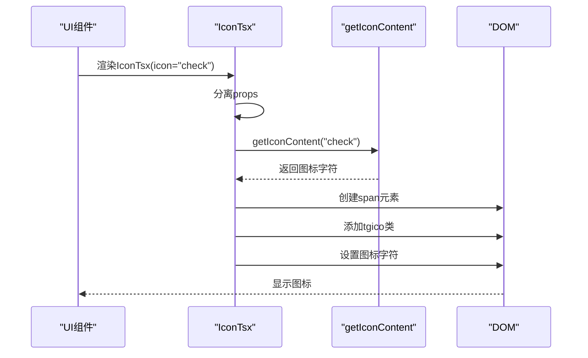
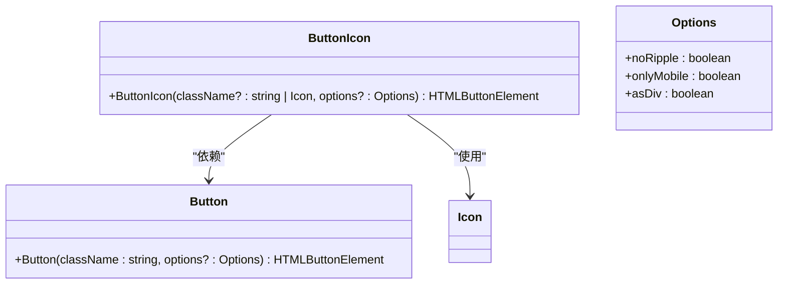
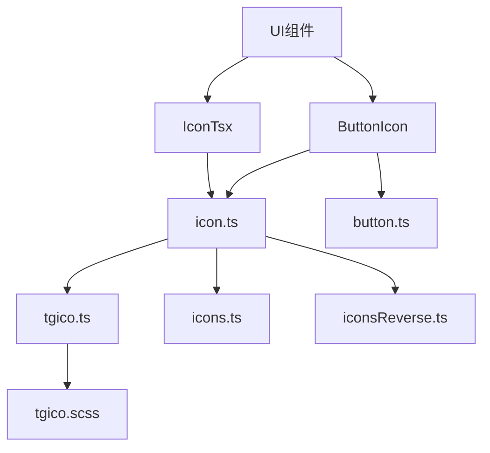

# 图标组件

<cite>
**本文档中引用的文件**  
- [icon.ts](file://src/components/icon.ts)
- [iconTsx.tsx](file://src/components/iconTsx.tsx)
- [tgico.ts](file://src/helpers/tgico.ts)
- [icons.ts](file://src/icons.ts)
- [iconsReverse.ts](file://src/iconsReverse.ts)
- [tgico.scss](file://src/scss/tgico.scss)
- [buttonIcon.ts](file://src/components/buttonIcon.ts)
- [button.ts](file://src/components/button.ts)
</cite>

## 目录
1. [简介](#简介)
2. [项目结构](#项目结构)
3. [核心组件](#核心组件)
4. [架构概述](#架构概述)
5. [详细组件分析](#详细组件分析)
6. [依赖分析](#依赖分析)
7. [性能考虑](#性能考虑)
8. [故障排除指南](#故障排除指南)
9. [结论](#结论)

## 简介
本文档详细介绍了基于 `tgico` 字体图标的图标组件实现机制。文档涵盖图标属性的使用方法、大小、颜色和旋转等视觉控制方式，以及在按钮、菜单项等UI组件中的集成方式。同时说明了图标字体的加载策略、SCSS变量扩展机制和性能优化建议。

## 项目结构
图标组件的实现分布在多个目录中，主要包括组件实现、图标映射数据和样式定义。



**Diagram sources**
- [icon.ts](file://src/components/icon.ts)
- [iconTsx.tsx](file://src/components/iconTsx.tsx)
- [tgico.ts](file://src/helpers/tgico.ts)
- [icons.ts](file://src/icons.ts)
- [iconsReverse.ts](file://src/iconsReverse.ts)
- [tgico.scss](file://src/scss/tgico.scss)
- [buttonIcon.ts](file://src/components/buttonIcon.ts)

**Section sources**
- [icon.ts](file://src/components/icon.ts)
- [iconTsx.tsx](file://src/components/iconTsx.tsx)
- [tgico.ts](file://src/helpers/tgico.ts)
- [icons.ts](file://src/icons.ts)
- [iconsReverse.ts](file://src/iconsReverse.ts)
- [tgico.scss](file://src/scss/tgico.scss)
- [buttonIcon.ts](file://src/components/buttonIcon.ts)

## 核心组件
图标组件系统由多个核心文件组成，实现了基于字体图标的渲染机制。系统通过映射图标名称到Unicode字符，利用自定义字体文件显示相应图标。

**Section sources**
- [icon.ts](file://src/components/icon.ts)
- [iconTsx.tsx](file://src/components/iconTsx.tsx)
- [icons.ts](file://src/icons.ts)

## 架构概述
图标组件采用分层架构设计，将图标数据、渲染逻辑和样式定义分离，实现了高内聚低耦合的设计模式。

```mermaid
classDiagram
class IconComponent {
+getIconContent(icon : Icon) string
+Icon(icon : Icon, ...classes : string[]) HTMLSpanElement
}
class IconTsxComponent {
+IconTsx(props : {icon : Icon} & JSX.HTMLAttributes<HTMLSpanElement>) JSX.Element
}
class TgicoHelper {
+TGICO_CLASS string
+tgico(icon : Icon) string[]
+_tgico(icon : Icon) string
+tgico_(icon : Icon) string
}
class IconData {
+Icons object
+IconsReverse Set~Icon~
}
IconComponent --> IconData : "使用"
IconComponent --> TgicoHelper : "使用"
IconTsxComponent --> IconComponent : "使用"
IconTsxComponent --> TgicoHelper : "使用"
```

**Diagram sources**
- [icon.ts](file://src/components/icon.ts)
- [iconTsx.tsx](file://src/components/iconTsx.tsx)
- [tgico.ts](file://src/helpers/tgico.ts)
- [icons.ts](file://src/icons.ts)
- [iconsReverse.ts](file://src/iconsReverse.ts)

## 详细组件分析

### 图标渲染机制分析
图标组件基于字体图标实现，通过将图标名称映射到特定的Unicode字符，利用自定义字体文件渲染图标。

#### 图标数据结构
系统通过 `icons.ts` 文件定义了所有可用图标的映射关系，每个图标名称对应一个十六进制的Unicode编码。



**Diagram sources**
- [icons.ts](file://src/icons.ts)
- [iconsReverse.ts](file://src/iconsReverse.ts)

#### 图标渲染流程
图标渲染过程涉及多个步骤，从图标名称到最终的DOM元素创建。



**Diagram sources**
- [icon.ts](file://src/components/icon.ts)
- [tgico.ts](file://src/helpers/tgico.ts)

**Section sources**
- [icon.ts](file://src/components/icon.ts)
- [tgico.ts](file://src/helpers/tgico.ts)

### SolidJS组件分析
对于SolidJS框架，系统提供了 `IconTsx` 组件，支持JSX语法的图标使用。



**Diagram sources**
- [iconTsx.tsx](file://src/components/iconTsx.tsx)
- [icon.ts](file://src/components/icon.ts)

**Section sources**
- [iconTsx.tsx](file://src/components/iconTsx.tsx)

### 按钮图标集成分析
系统提供了便捷的按钮图标集成方式，通过 `ButtonIcon` 工具函数简化图标按钮的创建。



**Diagram sources**
- [buttonIcon.ts](file://src/components/buttonIcon.ts)
- [button.ts](file://src/components/button.ts)
- [icon.ts](file://src/components/icon.ts)

**Section sources**
- [buttonIcon.ts](file://src/components/buttonIcon.ts)

## 依赖分析
图标组件系统与其他模块存在明确的依赖关系，形成了清晰的调用链。



**Diagram sources**
- [icon.ts](file://src/components/icon.ts)
- [iconTsx.tsx](file://src/components/iconTsx.tsx)
- [buttonIcon.ts](file://src/components/buttonIcon.ts)
- [button.ts](file://src/components/button.ts)
- [tgico.ts](file://src/helpers/tgico.ts)
- [icons.ts](file://src/icons.ts)
- [iconsReverse.ts](file://src/iconsReverse.ts)
- [tgico.scss](file://src/scss/tgico.scss)

**Section sources**
- [icon.ts](file://src/components/icon.ts)
- [iconTsx.tsx](file://src/components/iconTsx.tsx)
- [buttonIcon.ts](file://src/components/buttonIcon.ts)

## 性能考虑
图标组件系统在设计时考虑了性能优化，通过字体图标而非图像文件减少了HTTP请求，提高了渲染效率。

- 字体图标通过单个字体文件提供所有图标，减少了网络请求
- Unicode字符渲染比图像加载更快
- CSS类名缓存机制提高了DOM操作效率
- RTL语言环境的特殊处理优化了国际化支持

## 故障排除指南
当图标无法正常显示时，请检查以下常见问题：

**Section sources**
- [icon.ts](file://src/components/icon.ts)
- [tgico.scss](file://src/scss/tgico.scss)
- [icons.ts](file://src/icons.ts)

## 结论
图标组件系统通过基于 `tgico` 字体图标的实现机制，提供了高效、灵活的图标渲染方案。系统支持多种使用方式，包括直接DOM操作和SolidJS组件，并通过清晰的架构设计实现了良好的可维护性。通过SCSS变量和字体文件的结合，系统还支持图标的扩展和定制，满足了不同场景的需求。