# 基础组件

<cite>
**本文档中引用的文件**  
- [button.ts](file://src/components/button.ts)
- [icon.ts](file://src/components/icon.ts)
- [badge.tsx](file://src/components/badge.tsx)
- [ripple.ts](file://src/components/ripple.ts)
- [tooltip.tsx](file://src/components/tooltip.tsx)
- [avatarNew.tsx](file://src/components/avatarNew.tsx)
- [peerTitle.ts](file://src/components/peerTitle.ts)
- [row.ts](file://src/components/row.ts)
- [section.tsx](file://src/components/section.tsx)
- [buttonIcon.ts](file://src/components/buttonIcon.ts)
- [buttonTsx.tsx](file://src/components/buttonTsx.tsx)
- [buttonIconTsx.tsx](file://src/components/buttonIconTsx.tsx)
- [buttonMenu.ts](file://src/components/buttonMenu.ts)
- [buttonMenuSelect.tsx](file://src/components/buttonMenuSelect.tsx)
- [buttonMenuToggle.ts](file://src/components/buttonMenuToggle.ts)
</cite>

## 目录
1. [简介](#简介)
2. [按钮组件](#按钮组件)
3. [图标组件](#图标组件)
4. [徽章组件](#徽章组件)
5. [波纹效果组件](#波纹效果组件)
6. [工具提示组件](#工具提示组件)
7. [头像组件](#头像组件)
8. [标题组件](#标题组件)
9. [列表项组件](#列表项组件)
10. [分区组件](#分区组件)
11. [组件组合模式](#组件组合模式)
12. [无障碍访问实现](#无障碍访问实现)
13. [主题继承与样式定制](#主题继承与样式定制)
14. [性能优化建议](#性能优化建议)

## 简介
本文档详细介绍了项目中的基础UI组件，包括按钮、图标、徽章、波纹效果、工具提示、头像、标题、列表项和分区等核心元素。文档涵盖了每个组件的属性、事件处理、样式定制选项、响应式行为以及实际使用示例。同时，文档还说明了组件之间的组合使用模式、无障碍访问实现、主题继承机制和性能优化建议。

## 按钮组件

按钮组件提供了多种创建和定制按钮的方式，支持文本、图标、禁用状态和涟漪效果等特性。组件分为函数式和JSX两种实现方式，分别适用于不同的使用场景。

### 函数式按钮组件
函数式按钮组件通过`Button`函数创建，支持多种配置选项：

**属性说明**
- `className`: 按钮的CSS类名
- `noRipple`: 是否禁用涟漪效果
- `onlyMobile`: 是否仅在移动设备显示
- `icon`: 图标名称
- `rippleSquare`: 是否使用方形涟漪效果
- `text`: 文本语言包键名
- `textArgs`: 文本参数
- `disabled`: 是否禁用
- `asDiv`: 是否使用div元素
- `asLink`: 是否使用链接元素

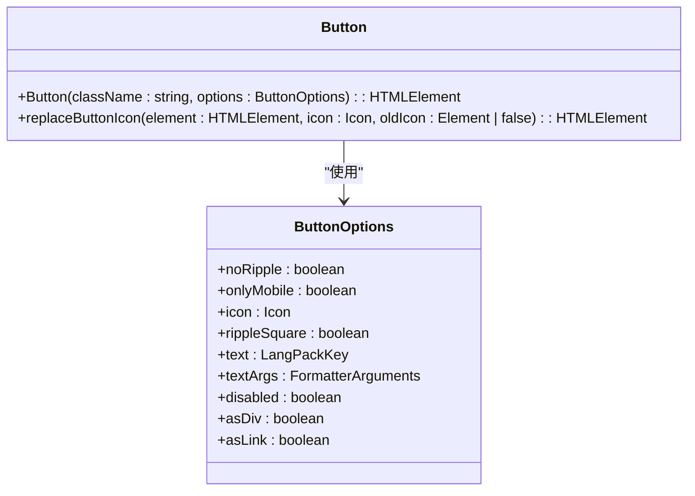

**Diagram sources**
- [button.ts](file://src/components/button.ts#L11-L21)

**Section sources**
- [button.ts](file://src/components/button.ts#L23-L60)

### JSX按钮组件
JSX按钮组件通过`Button`组件创建，提供了更丰富的属性和更直观的使用方式：

**属性说明**
- `ref`: 元素引用
- `as`: 元素类型（a、div、button）
- `class`: CSS类名
- `disabled`: 是否禁用
- `primaryFilled`: 是否为主要填充按钮
- `primary`: 是否为主要按钮
- `large`: 是否为大尺寸按钮
- `children`: 子元素
- `icon`: 图标
- `iconAfter`: 后置图标
- `iconClass`: 图标CSS类名
- `onClick`: 点击事件处理函数
- `text`: 文本语言包键名
- `textArgs`: 文本参数
- `noRipple`: 是否禁用涟漪效果
- `rippleSquare`: 是否使用方形涟漪效果
- `onlyMobile`: 是否仅在移动设备显示
- `tabIndex`: tab索引

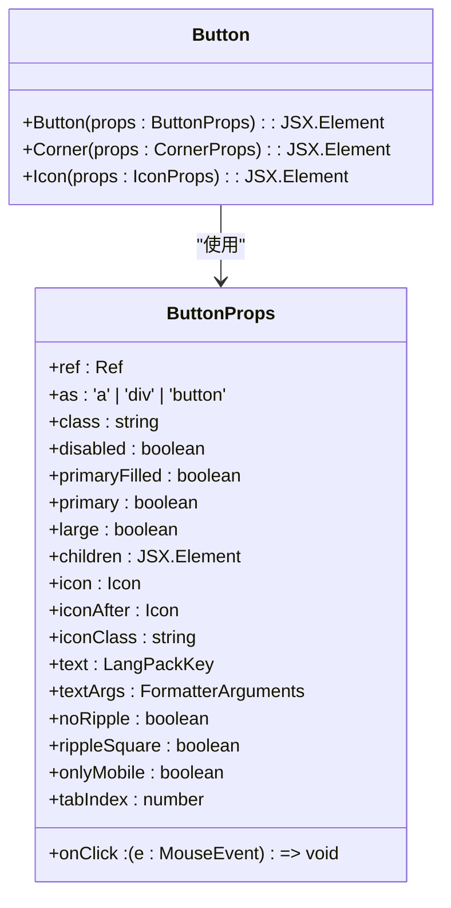

**Diagram sources**
- [buttonTsx.tsx](file://src/components/buttonTsx.tsx#L7-L26)

**Section sources**
- [buttonTsx.tsx](file://src/components/buttonTsx.tsx#L7-L74)

### 按钮图标组件
按钮图标组件提供了创建带图标的按钮的便捷方式：

**属性说明**
- `className`: 类名，可包含图标名称
- `noRipple`: 是否禁用涟漪效果
- `onlyMobile`: 是否仅在移动设备显示
- `asDiv`: 是否使用div元素

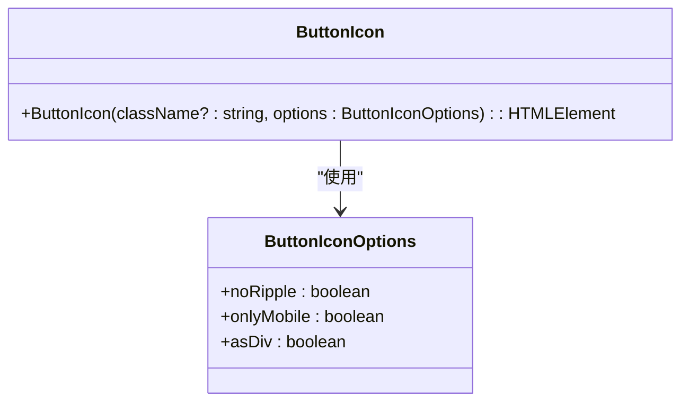

**Diagram sources**
- [buttonIcon.ts](file://src/components/buttonIcon.ts#L9-L17)

**Section sources**
- [buttonIcon.ts](file://src/components/buttonIcon.ts#L9-L20)

### 按钮菜单组件
按钮菜单组件提供了创建下拉菜单的功能，支持多种菜单项类型和交互行为：

**属性说明**
- `id`: 菜单项ID
- `icon`: 图标名称
- `iconElement`: 图标元素
- `emptyIcon`: 是否显示空图标占位符
- `iconDoc`: 文档图标
- `avatarInfo`: 头像信息
- `danger`: 是否为危险操作
- `new`: 是否为新功能
- `className`: CSS类名
- `text`: 文本语言包键名
- `textArgs`: 文本参数
- `regularText`: 常规文本
- `onClick`: 点击事件处理函数
- `checkForClose`: 关闭检查函数
- `element`: 自定义元素
- `textElement`: 文本元素
- `options`: 点击事件选项
- `checkboxField`: 复选框字段
- `noCheckboxClickListener`: 是否禁用复选框点击监听器
- `keepOpen`: 是否保持打开状态
- `separator`: 分隔符
- `separatorDown`: 下方分隔符
- `multiline`: 是否多行
- `secondary`: 是否为次要项
- `loadPromise`: 加载Promise
- `waitForAnimation`: 是否等待动画
- `radioGroup`: 单选组
- `inner`: 内部菜单
- `dispose`: 清理函数
- `onOpen`: 打开回调
- `onClose`: 关闭回调

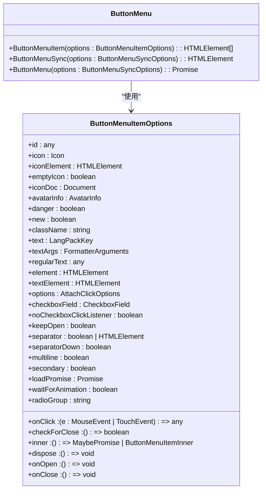

**Diagram sources**
- [buttonMenu.ts](file://src/components/buttonMenu.ts#L34-L67)

**Section sources**
- [buttonMenu.ts](file://src/components/buttonMenu.ts#L73-L291)

## 图标组件

图标组件提供了创建和管理图标的统一方式，支持图标内容获取和CSS类名生成。

### 图标实现
图标组件通过`Icon`函数创建，使用字体图标系统：

**属性说明**
- `icon`: 图标名称
- `classes`: CSS类名数组

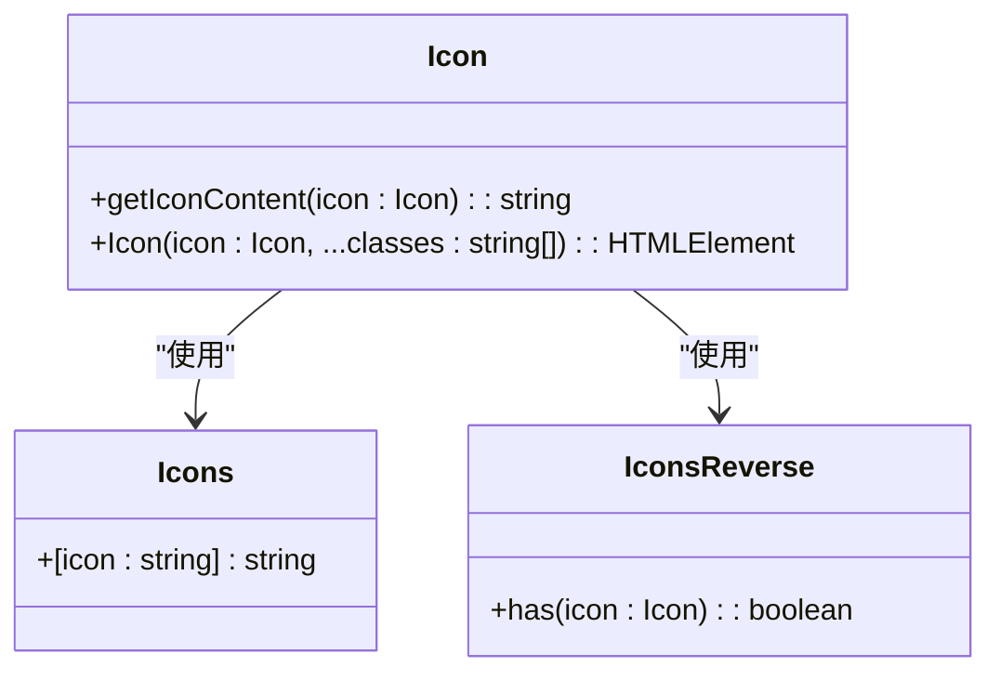

**Diagram sources**
- [icon.ts](file://src/components/icon.ts#L6-L19)

**Section sources**
- [icon.ts](file://src/components/icon.ts#L1-L20)

## 徽章组件

徽章组件提供了创建状态指示器的功能，支持多种尺寸、颜色和内容。

### 徽章实现
徽章组件通过`Badge`组件创建，使用SolidJS的动态组件功能：

**属性说明**
- `tag`: HTML标签（span或div）
- `size`: 尺寸
- `color`: 颜色
- `children`: 子元素
- `class`: CSS类名

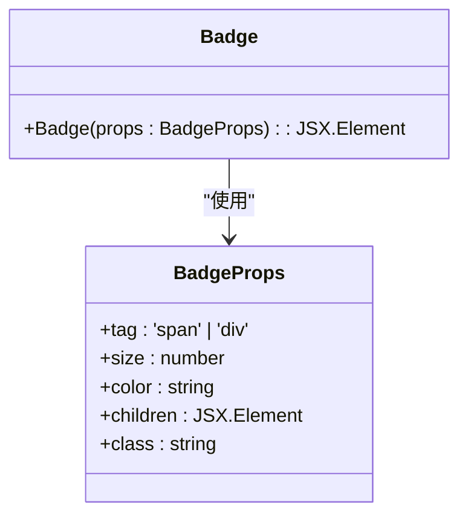

**Diagram sources**
- [badge.tsx](file://src/components/badge.tsx#L5-L11)

**Section sources**
- [badge.tsx](file://src/components/badge.tsx#L1-L27)

## 波纹效果组件

波纹效果组件提供了创建Material Design风格的点击反馈效果，支持触摸和鼠标事件。

### 波纹实现
波纹效果通过`ripple`函数添加到元素上：

**属性说明**
- `elem`: 目标元素
- `prepend`: 是否前置添加
- `callback`: 回调函数
- `onEnd`: 结束回调
- `attachListenerTo`: 事件监听器附加元素

```mermaid
classDiagram
class RippleOptions {
+elem : HTMLElement
+prepend : boolean | 'no'
+callback : (id : number) => Promise<boolean | void>
+onEnd : (id : number) => void
+attachListenerTo : HTMLElement
}
class Ripple {
+ripple(elem : HTMLElement, accessor? : Accessor<boolean>, prepend? : boolean | 'no') : any
+_ripple(options : RippleOptions) : {dispose : () => void, element : HTMLElement}
}
Ripple --> RippleOptions : "使用"
```

**Diagram sources**
- [ripple.ts](file://src/components/ripple.ts#L28-L248)

**Section sources**
- [ripple.ts](file://src/components/ripple.ts#L28-L268)

## 工具提示组件

工具提示组件提供了创建浮动提示的功能，支持多种位置和样式。

### 工具提示实现
工具提示通过`showTooltip`函数创建：

**属性说明**
- `element`: 触发元素
- `class`: CSS类名
- `container`: 容器元素
- `vertical`: 垂直位置（top或bottom）
- `textElement`: 文本元素
- `subtitleElement`: 副标题元素
- `paddingX`: 水平内边距
- `offsetY`: 垂直偏移
- `centerVertically`: 是否垂直居中
- `onClose`: 关闭回调
- `icon`: 图标
- `auto`: 是否自动关闭
- `mountOn`: 挂载元素
- `relative`: 是否相对定位
- `lighter`: 是否浅色模式
- `rightElement`: 右侧元素
- `useOverlay`: 是否使用覆盖层

```mermaid
classDiagram
class TooltipOptions {
+element : HTMLElement
+class : string
+container : HTMLElement
+vertical : 'top' | 'bottom'
+textElement : HTMLElement
+subtitleElement : HTMLElement
+rightElement : JSX.Element
+paddingX : number
+offsetY : number
+centerVertically : boolean
+onClose : () => void
+icon : Icon
+auto : boolean
+mountOn : HTMLElement
+relative : boolean
+lighter : boolean
+useOverlay : boolean
}
class Tooltip {
+showTooltip(options : TooltipOptions) : {close : () => void}
}
Tooltip --> TooltipOptions : "使用"
```

**Diagram sources**
- [tooltip.tsx](file://src/components/tooltip.tsx#L35-L53)

**Section sources**
- [tooltip.tsx](file://src/components/tooltip.tsx#L17-L164)

## 头像组件

头像组件提供了创建用户头像的功能，支持图片、缩写和故事状态显示。

### 头像实现
头像组件通过`AvatarNew`函数创建：

**属性说明**
- `accountNumber`: 账户编号
- `peerId`: 用户ID
- `threadId`: 话题ID
- `isDialog`: 是否为对话
- `isBig`: 是否为大尺寸
- `isSubscribed`: 是否已订阅
- `peerTitle`: 用户标题
- `lazyLoadQueue`: 懒加载队列
- `wrapOptions`: 包装选项
- `withStories`: 是否显示故事
- `storyId`: 故事ID
- `useCache`: 是否使用缓存
- `size`: 尺寸
- `props`: HTML属性
- `storyColors`: 故事颜色
- `peer`: 用户对象
- `isStoryFolded`: 故事是否折叠
- `processImageOnLoad`: 图片加载后处理
- `meAsNotes`: 我的笔记模式
- `asAllChats`: 所有聊天模式
- `onStoriesStatus`: 故事状态回调
- `class`: CSS类名

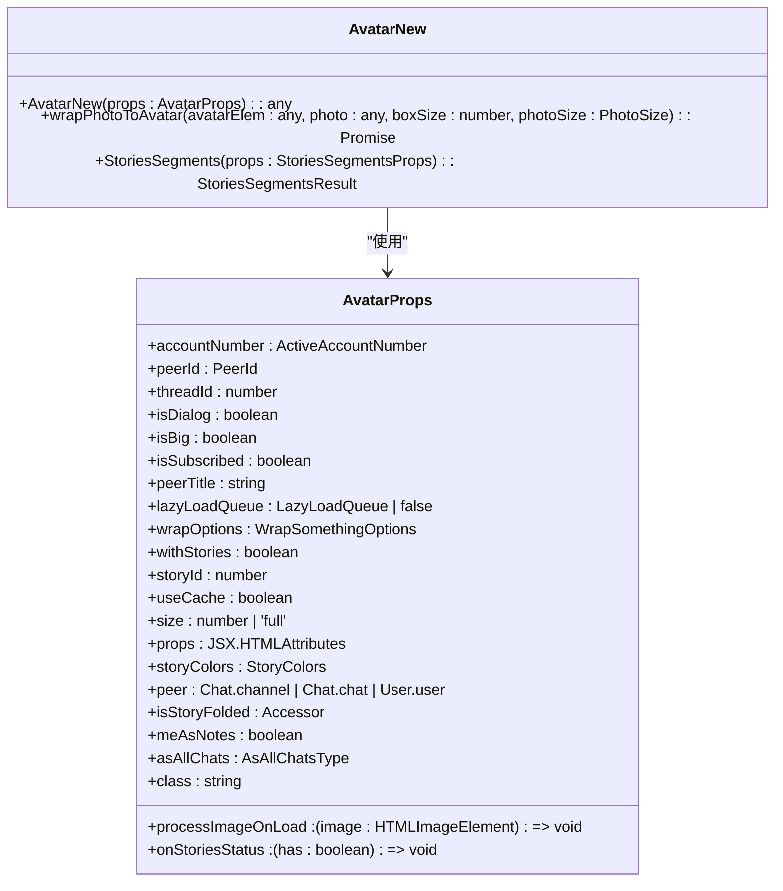

**Diagram sources**
- [avatarNew.tsx](file://src/components/avatarNew.tsx#L318-L341)

**Section sources**
- [avatarNew.tsx](file://src/components/avatarNew.tsx#L1-L800)

## 标题组件

标题组件提供了创建用户标题的功能，支持图标、状态和格式化显示。

### 标题实现
标题组件通过`PeerTitle`类创建：

**属性说明**
- `peerId`: 用户ID
- `fromName`: 来源名称
- `plainText`: 是否纯文本
- `onlyFirstName`: 是否仅显示名字
- `username`: 是否显示用户名
- `dialog`: 是否为对话
- `limitSymbols`: 符号限制
- `withIcons`: 是否显示图标
- `withPremiumIcon`: 是否显示高级图标
- `clickableEmojiStatus`: 表情状态是否可点击
- `threadId`: 话题ID
- `meAsNotes`: 我的笔记模式
- `iconsColor`: 图标颜色
- `asAllChats`: 所有聊天模式
- `wrapOptions`: 包装选项

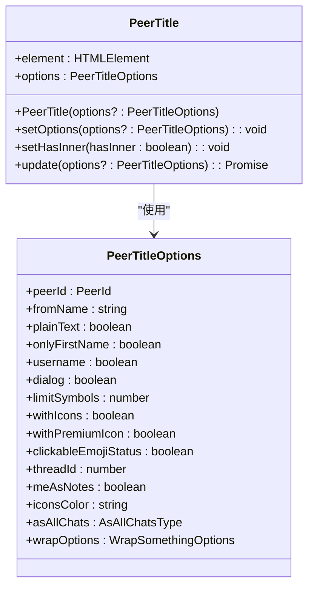

**Diagram sources**
- [peerTitle.ts](file://src/components/peerTitle.ts#L22-L38)

**Section sources**
- [peerTitle.ts](file://src/components/peerTitle.ts#L68-L224)

## 列表项组件

列表项组件提供了创建列表项的功能，支持图标、复选框、单选框和点击事件。

### 列表项实现
列表项组件通过`Row`类创建：

**属性说明**
- `icon`: 图标
- `iconClasses`: 图标CSS类名
- `subtitle`: 副标题
- `subtitleLangKey`: 副标题语言包键名
- `subtitleLangArgs`: 副标题参数
- `subtitleRight`: 右侧副标题
- `radioField`: 单选框字段
- `checkboxField`: 复选框字段
- `checkboxFieldOptions`: 复选框字段选项
- `withCheckboxSubtitle`: 是否使用复选框副标题
- `title`: 标题
- `titleLangKey`: 标题语言包键名
- `titleLangArgs`: 标题参数
- `titleRight`: 右侧标题
- `titleRightSecondary`: 次要右侧标题
- `clickable`: 是否可点击
- `navigationTab`: 导航标签
- `havePadding`: 是否有内边距
- `noRipple`: 是否禁用涟漪效果
- `noWrap`: 是否不换行
- `listenerSetter`: 事件监听器设置器
- `buttonRight`: 右侧按钮
- `buttonRightLangKey`: 右侧按钮语言包键名
- `rightContent`: 右侧内容
- `rightTextContent`: 右侧文本内容
- `asLink`: 是否为链接
- `contextMenu`: 上下文菜单
- `asLabel`: 是否为标签
- `checkboxKeys`: 复选框键名

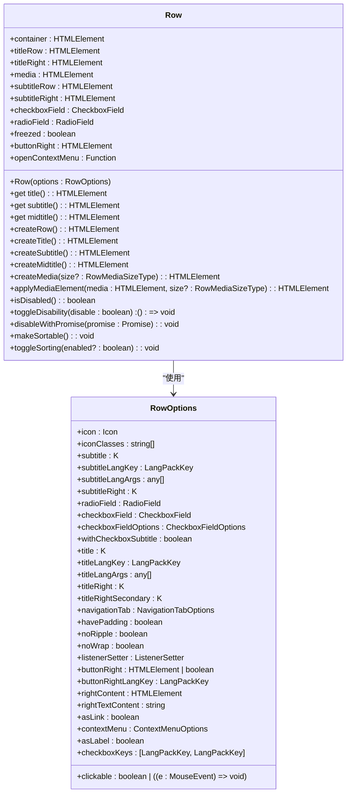

**Diagram sources**
- [row.ts](file://src/components/row.ts#L63-L98)

**Section sources**
- [row.ts](file://src/components/row.ts#L41-L432)

## 分区组件

分区组件提供了创建内容分区的功能，支持标题、副标题和分隔符。

### 分区实现
分区组件通过`Section`组件创建：

**属性说明**
- `name`: 名称
- `nameArgs`: 名称参数
- `nameRight`: 右侧名称
- `caption`: 副标题
- `captionArgs`: 副标题参数
- `captionOld`: 旧式副标题
- `captionRef`: 副标题引用
- `noDelimiter`: 无分隔符
- `fakeGradientDelimiter`: 伪渐变分隔符
- `noShadow`: 无阴影
- `class`: CSS类名
- `contentProps`: 内容属性
- `ref`: 引用

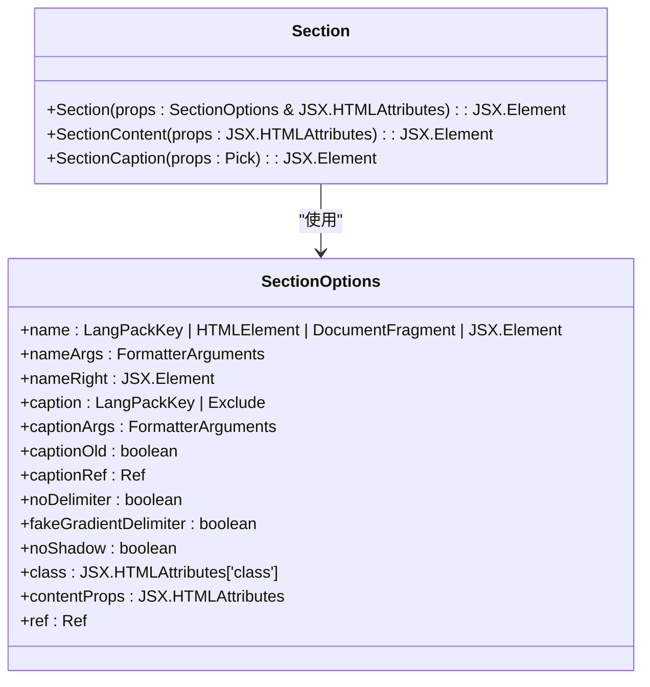

**Diagram sources**
- [section.tsx](file://src/components/section.tsx#L12-L26)

**Section sources**
- [section.tsx](file://src/components/section.tsx#L1-L78)

## 组件组合模式

基础组件之间可以进行多种组合使用，以创建更复杂的UI元素。

### 按钮与图标组合
按钮组件可以与图标组件结合使用，创建带图标的按钮：

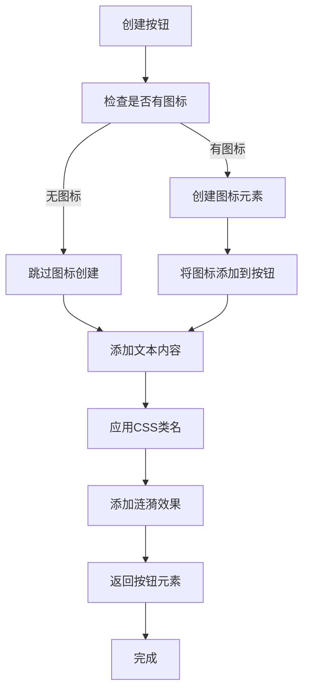

**Diagram sources**
- [button.ts](file://src/components/button.ts#L23-L60)
- [icon.ts](file://src/components/icon.ts#L10-L19)

### 徽章与头像组合
徽章组件可以与头像组件结合使用，创建带状态指示的头像：

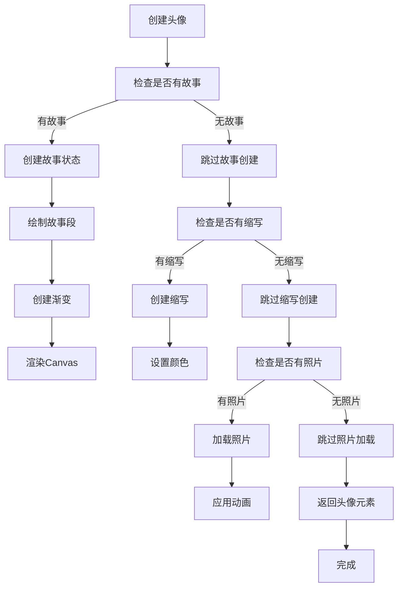

**Diagram sources**
- [avatarNew.tsx](file://src/components/avatarNew.tsx#L318-L341)
- [badge.tsx](file://src/components/badge.tsx#L5-L11)

## 无障碍访问实现

基础组件实现了完整的无障碍访问支持，包括ARIA属性和键盘导航。

### ARIA属性实现
组件通过ARIA属性提供语义化信息：

- 按钮组件使用`role="button"`和`aria-disabled`属性
- 工具提示组件使用`aria-describedby`属性
- 复选框和单选框使用`role="checkbox"`和`role="radio"`属性
- 列表项使用`role="listitem"`属性

### 键盘导航支持
组件支持标准键盘导航：

- Tab键在可交互元素间移动焦点
- Enter和Space键激活按钮和链接
- 方向键在菜单项间移动
- Esc键关闭弹出层和菜单

```mermaid
sequenceDiagram
participant User as "用户"
participant Browser as "浏览器"
participant Component as "组件"
User->>Browser : 按下Tab键
Browser->>Component : 移动焦点到下一个可聚焦元素
Component->>Component : 更新视觉焦点指示器
Component-->>Browser : 确认焦点移动
User->>Browser : 按下Enter键
Browser->>Component : 触发点击事件
Component->>Component : 执行点击处理逻辑
Component-->>Browser : 确认事件处理
User->>Browser : 按下Esc键
Browser->>Component : 触发关闭事件
Component->>Component : 执行关闭逻辑
Component-->>Browser : 确认关闭操作
**Diagram sources**
- [button.ts](file : //src/components/button.ts#L23-L60)
- [buttonMenu.ts](file : //src/components/buttonMenu.ts#L73-L291)
- [tooltip.tsx](file : //src/components/tooltip.tsx#L17-L164)
```

**Section sources**
- [button.ts](file://src/components/button.ts#L23-L60)
- [buttonMenu.ts](file://src/components/buttonMenu.ts#L73-L291)
- [tooltip.tsx](file://src/components/tooltip.tsx#L17-L164)

## 主题继承与样式定制

基础组件支持主题继承和样式定制，通过SCSS变量和CSS类名实现。

### 主题继承机制
组件通过CSS变量继承主题：

- 使用`customProperties.getProperty()`获取主题变量
- 支持深色和浅色主题切换
- 通过`useIsNightTheme()`钩子检测当前主题

### SCSS变量覆盖
组件样式通过SCSS变量定义，允许覆盖：

- 颜色变量：`$primary-color`, `$secondary-color`
- 尺寸变量：`$button-size`, `$icon-size`
- 动画变量：`$animation-duration`, `$easing-function`
- 间距变量：`$spacing-unit`, `$border-radius`

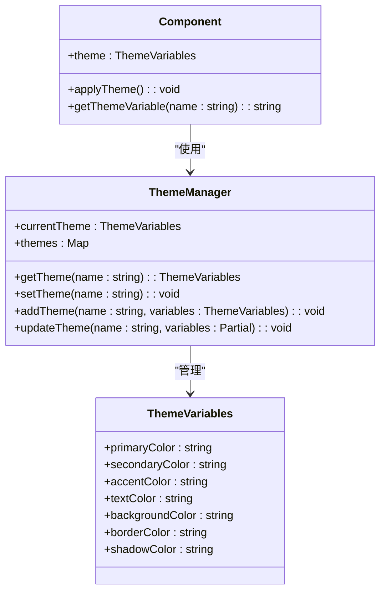

**Diagram sources**
- [avatarNew.tsx](file://src/components/avatarNew.tsx#L120-L142)
- [helpers/dom/customProperties.ts](file://src/helpers/dom/customProperties.ts)
- [hooks/useIsNightTheme.ts](file://src/hooks/useIsNightTheme.ts)

**Section sources**
- [avatarNew.tsx](file://src/components/avatarNew.tsx#L120-L142)

## 性能优化建议

为确保基础组件的高性能，建议采用以下优化策略。

### 图标懒加载
对于大量图标的场景，使用懒加载策略：

- 使用`LazyLoadQueue`管理图标加载
- 只在可视区域内加载图标
- 预加载临近区域的图标
- 缓存已加载的图标

### 动画帧率控制
优化动画性能，确保流畅的用户体验：

- 使用`requestAnimationFrame`进行动画
- 限制动画帧率在60fps
- 使用CSS硬件加速属性
- 避免在动画中进行重排和重绘

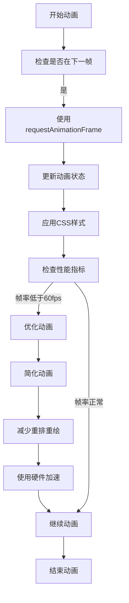

**Diagram sources**
- [helpers/schedulers.ts](file://src/helpers/schedulers.ts)
- [helpers/lazyLoadQueue.ts](file://src/helpers/lazyLoadQueue.ts)
- [components/ripple.ts](file://src/components/ripple.ts#L11-L12)

**Section sources**
- [helpers/schedulers.ts](file://src/helpers/schedulers.ts)
- [helpers/lazyLoadQueue.ts](file://src/helpers/lazyLoadQueue.ts)
- [components/ripple.ts](file://src/components/ripple.ts#L11-L12)