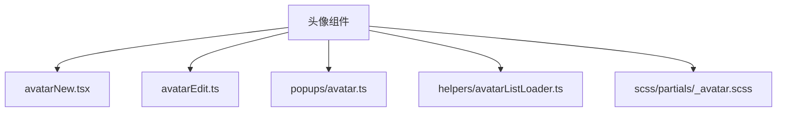
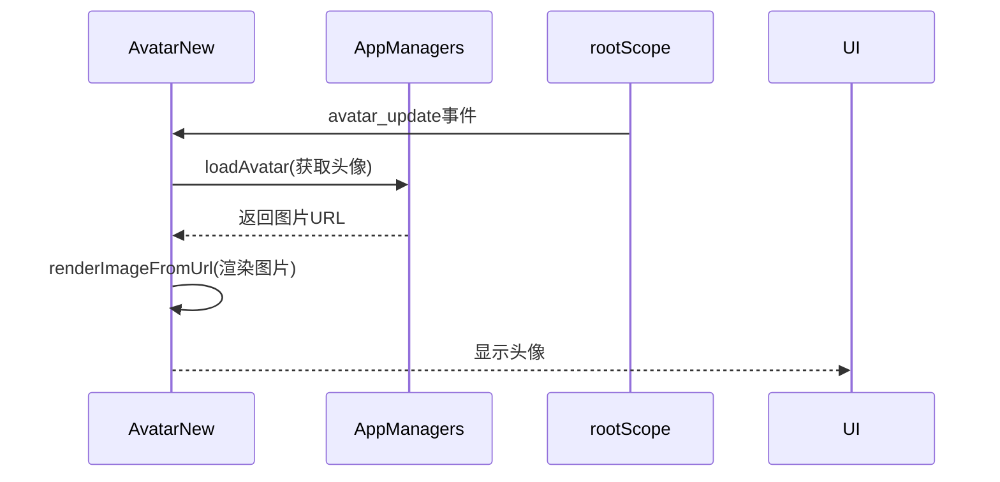
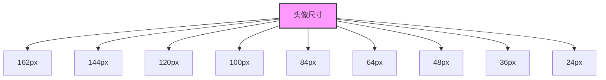
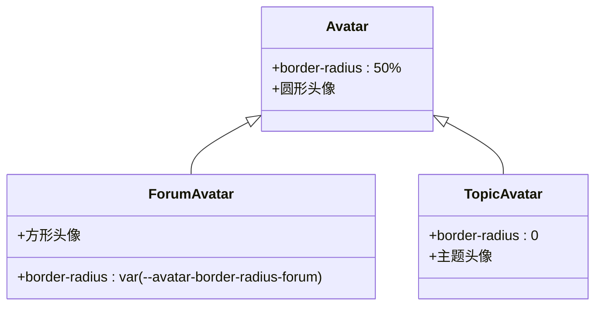
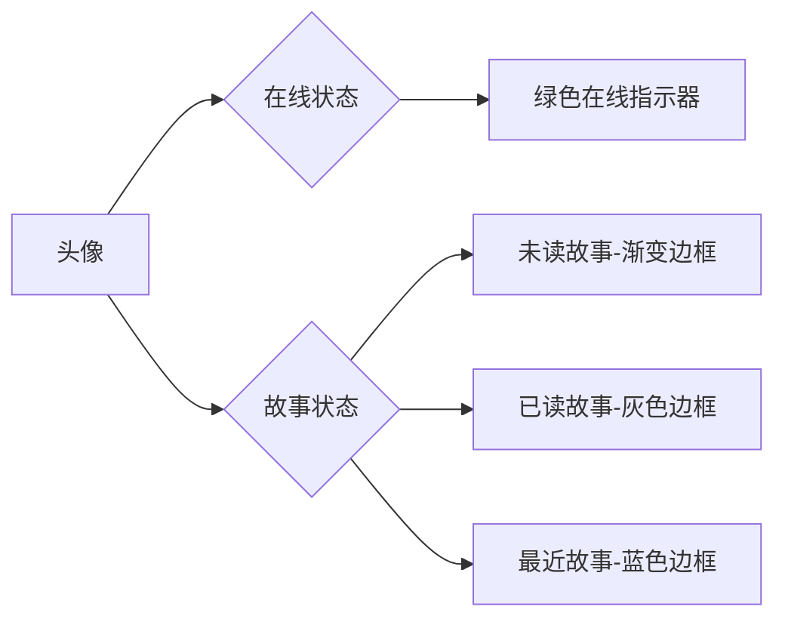
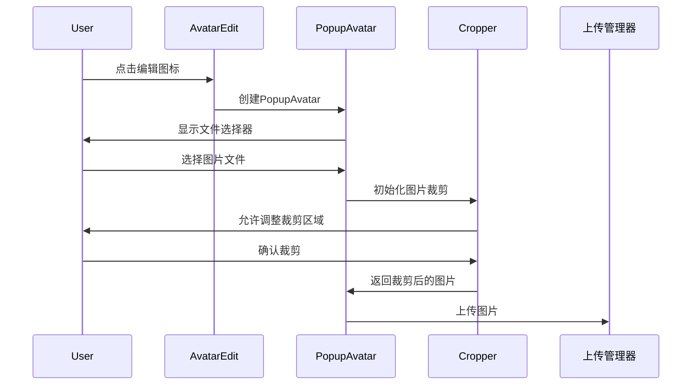
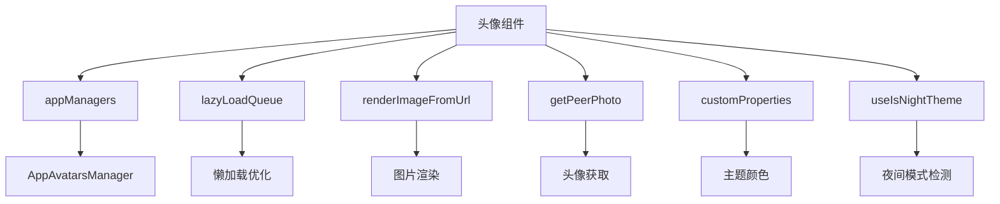
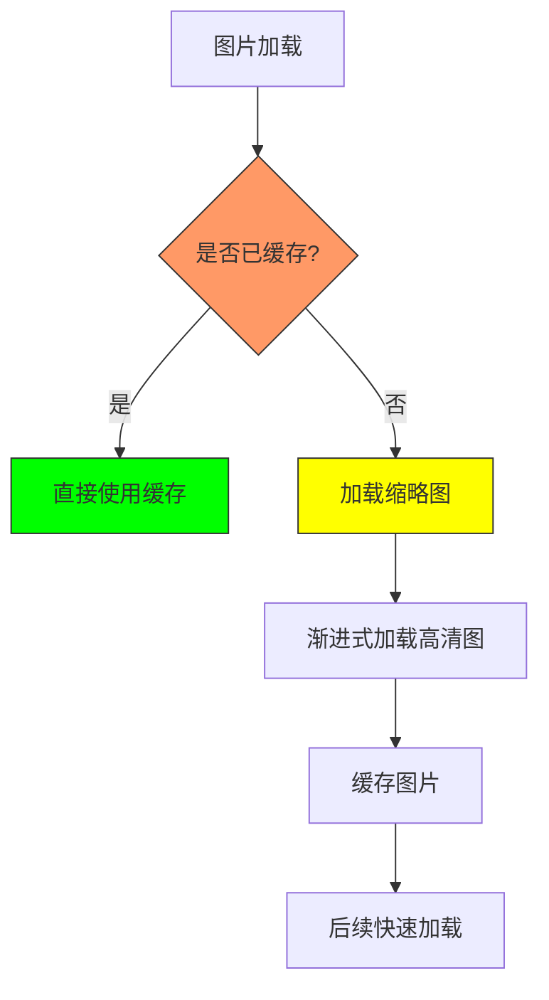
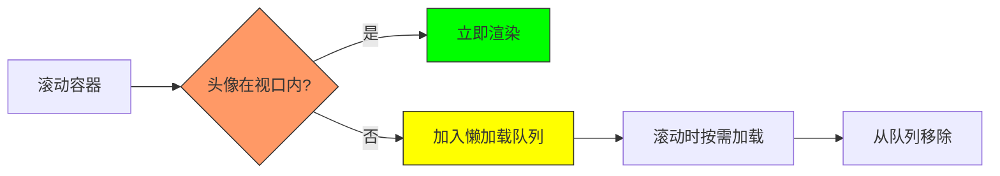

# 头像组件

<cite>
**本文档引用的文件**
- [avatarNew.tsx](file://src/components/avatarNew.tsx)
- [avatarEdit.ts](file://src/components/avatarEdit.ts)
- [avatar.ts](file://src/components/popups/avatar.ts)
- [avatarListLoader.ts](file://src/helpers/avatarListLoader.ts)
- [_avatar.scss](file://src/scss/partials/_avatar.scss)
</cite>

## 目录
1. [简介](#简介)
2. [项目结构](#项目结构)
3. [核心组件](#核心组件)
4. [架构概述](#架构概述)
5. [详细组件分析](#详细组件分析)
6. [依赖分析](#依赖分析)
7. [性能考虑](#性能考虑)
8. [故障排除指南](#故障排除指南)
9. [结论](#结论)

## 简介
头像组件是Telegram Web客户端中用于显示用户、群组和频道形象的核心UI元素。该组件支持多种尺寸变体、形状样式（圆形、方形）和状态指示（在线、离线）。它通过高效的图片缓存策略和懒加载机制确保了高性能的用户体验。本文档详细说明了头像组件的实现机制、可用属性、使用示例以及性能优化方法。

## 项目结构
头像组件的实现分布在多个文件中，主要包含核心组件、编辑功能、弹窗管理和辅助工具。组件采用模块化设计，分离了显示逻辑、事件处理和样式定义。

**图源**
- [avatarNew.tsx](file://src/components/avatarNew.tsx)
- [avatarEdit.ts](file://src/components/avatarEdit.ts)
- [avatar.ts](file://src/components/popups/avatar.ts)
- [avatarListLoader.ts](file://src/helpers/avatarListLoader.ts)
- [_avatar.scss](file://src/scss/partials/_avatar.scss)

**节源**
- [avatarNew.tsx](file://src/components/avatarNew.tsx)
- [avatarEdit.ts](file://src/components/avatarEdit.ts)
- [avatar.ts](file://src/components/popups/avatar.ts)
- [avatarListLoader.ts](file://src/helpers/avatarListLoader.ts)
- [_avatar.scss](file://src/scss/partials/_avatar.scss)

## 核心组件
头像组件的核心实现位于`avatarNew.tsx`文件中，使用SolidJS框架构建。组件支持动态渲染用户头像、群组头像和频道头像，并能根据不同的状态（如在线、故事更新）进行视觉反馈。通过`lazyLoadQueue`机制，组件实现了高效的懒加载，确保在滚动列表中性能优越。

**节源**
- [avatarNew.tsx](file://src/components/avatarNew.tsx)

## 架构概述
头像组件采用分层架构设计，将数据获取、状态管理和UI渲染分离。组件通过事件监听器响应头像更新、故事状态变化等事件，并重新渲染相应的UI元素。图片加载采用渐进式加载策略，先显示缩略图再加载高清图，提升用户体验。

**图源**
- [avatarNew.tsx](file://src/components/avatarNew.tsx)
- [appManagers](file://src/lib/appManagers/)

**节源**
- [avatarNew.tsx](file://src/components/avatarNew.tsx)

## 详细组件分析

### 头像组件分析
头像组件支持多种尺寸变体和形状样式，能够根据不同的使用场景灵活配置。组件通过CSS变量和类名控制外观，支持圆形、方形和论坛专用的圆角矩形。

#### 属性定义
头像组件支持以下主要属性：

| 属性 | 类型 | 描述 |
|------|------|------|
| peerId | PeerId | 用户、群组或频道的唯一标识符 |
| size | number \| 'full' | 头像尺寸，支持预定义的多种尺寸 |
| isBig | boolean | 是否使用大尺寸头像 |
| withStories | boolean | 是否显示故事状态指示 |
| peerTitle | string | 当没有图片时显示的缩写字母 |
| lazyLoadQueue | LazyLoadQueue | 懒加载队列，用于优化滚动性能 |
| isForum | boolean | 是否为论坛头像（方形） |
| isTopic | boolean | 是否为主题头像 |
| isSubscribed | boolean | 是否显示订阅星标 |

**节源**
- [avatarNew.tsx](file://src/components/avatarNew.tsx)

#### 尺寸变体
头像组件支持多种预定义尺寸，通过CSS类名实现：

**图源**
- [_avatar.scss](file://src/scss/partials/_avatar.scss)

**节源**
- [_avatar.scss](file://src/scss/partials/_avatar.scss)

#### 形状样式
头像组件支持三种主要形状样式：

**图源**
- [_avatar.scss](file://src/scss/partials/_avatar.scss)

**节源**
- [_avatar.scss](file://src/scss/partials/_avatar.scss)

#### 状态指示
头像组件支持在线状态和故事状态的视觉指示：

**图源**
- [avatarNew.tsx](file://src/components/avatarNew.tsx)
- [_avatar.scss](file://src/scss/partials/_avatar.scss)

**节源**
- [avatarNew.tsx](file://src/components/avatarNew.tsx)
- [_avatar.scss](file://src/scss/partials/_avatar.scss)

### 编辑功能分析
头像编辑功能允许用户上传和裁剪头像图片，通过弹窗界面提供友好的用户体验。

**图源**
- [avatarEdit.ts](file://src/components/avatarEdit.ts)
- [avatar.ts](file://src/components/popups/avatar.ts)

**节源**
- [avatarEdit.ts](file://src/components/avatarEdit.ts)
- [avatar.ts](file://src/components/popups/avatar.ts)

## 依赖分析
头像组件依赖于多个核心模块和工具类，形成了完整的功能链。

**图源**
- [avatarNew.tsx](file://src/components/avatarNew.tsx)
- [appManagers](file://src/lib/appManagers/)
- [helpers](file://src/helpers/)

**节源**
- [avatarNew.tsx](file://src/components/avatarNew.tsx)

## 性能考虑
头像组件通过多种机制优化性能，确保在大量头像显示时仍能保持流畅的用户体验。

### 图片缓存策略
组件实现了多层图片缓存策略：

**图源**
- [avatarNew.tsx](file://src/components/avatarNew.tsx)

**节源**
- [avatarNew.tsx](file://src/components/avatarNew.tsx)

### 懒加载机制
组件通过`lazyLoadQueue`实现虚拟滚动优化：

**图源**
- [avatarNew.tsx](file://src/components/avatarNew.tsx)

**节源**
- [avatarNew.tsx](file://src/components/avatarNew.tsx)

## 故障排除指南
### 常见问题及解决方案

| 问题 | 可能原因 | 解决方案 |
|------|----------|----------|
| 头像不显示 | 图片加载失败 | 检查网络连接和图片URL |
| 缩略图不显示 | stripped_thumb为空 | 确保服务器返回缩略图数据 |
| 懒加载不工作 | lazyLoadQueue未正确配置 | 检查队列初始化和滚动事件绑定 |
| 故事状态不更新 | 事件监听器未注册 | 确认rootScope事件监听器已添加 |
| 颜色显示异常 | 主题变量未定义 | 检查CSS自定义属性定义 |

**节源**
- [avatarNew.tsx](file://src/components/avatarNew.tsx)

## 结论
头像组件是一个功能丰富、性能优越的UI组件，通过模块化设计和高效的优化策略，为Telegram Web客户端提供了可靠的头像显示解决方案。组件支持多种尺寸、形状和状态指示，能够满足不同场景的需求。通过图片缓存和懒加载机制，确保了在大规模使用时的性能表现。未来可以进一步优化图片压缩算法和增加更多自定义选项，提升用户体验。