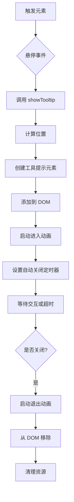
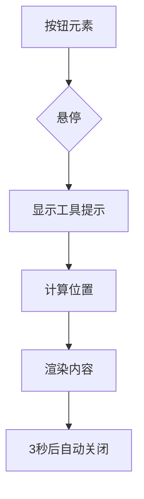
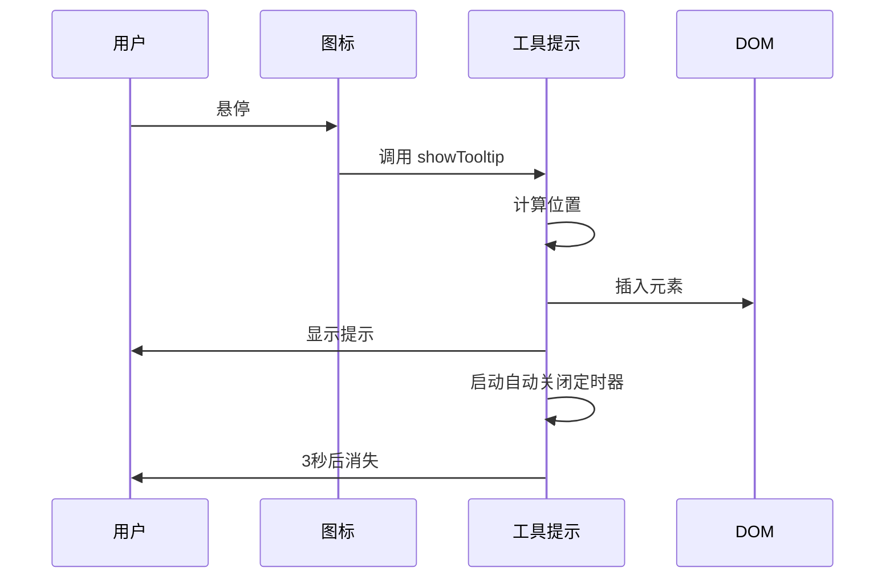
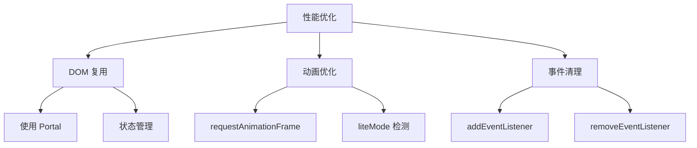

# 工具提示

<cite>
**本文档中引用的文件**  
- [tooltip.tsx](file://src/components/tooltip.tsx)
- [\_tooltip.scss](file://src/scss/partials/_tooltip.scss)
- [overlayClickHandler.ts](file://src/helpers/overlayClickHandler.ts)
- [singleTransition.ts](file://src/components/singleTransition.ts)
- [addToFolderDropdownMenu/hooks.tsx](file://src/components/addToFolderDropdownMenu/hooks.tsx)
- [priceChangedTooltip.tsx](file://src/components/chat/priceChangedInterceptor/priceChangedTooltip.tsx)
- [similarChannels.tsx](file://src/components/chat/similarChannels.tsx)
</cite>

## 目录
1. [简介](#简介)
2. [核心实现](#核心实现)
3. [可用属性](#可用属性)
4. [使用示例](#使用示例)
5. [无障碍访问](#无障碍访问)
6. [性能优化](#性能优化)
7. [定位算法](#定位算法)
8. [结论](#结论)

## 简介
工具提示组件用于在用户悬停于界面元素上时显示额外信息。该组件采用 SolidJS 框架构建，支持灵活的定位策略、自动关闭机制和视觉动画效果。工具提示通过动态计算位置确保在视口内可见，并使用过渡动画提供流畅的用户体验。

**Section sources**
- [tooltip.tsx](file://src/components/tooltip.tsx)

## 核心实现
工具提示组件通过 `showTooltip` 函数实现，该函数接收配置对象并返回包含 `close` 方法的对象以控制工具提示的关闭。组件使用 SolidJS 的 `createRoot` 创建独立的响应式上下文，确保不会影响外部状态。

工具提示的显示基于悬停触发机制，通过 `OverlayClickHandler` 处理点击外部区域关闭的行为。组件使用 `Portal` 将工具提示渲染到指定容器（默认为 `document.body`），避免 zIndex 冲突和布局干扰。

视觉效果通过 CSS 类的添加和移除配合 `SetTransition` 实现平滑的进入和退出动画。工具提示在创建后会自动在 3 秒后关闭，除非设置 `auto: false`。



**Diagram sources**
- [tooltip.tsx](file://src/components/tooltip.tsx)
- [singleTransition.ts](file://src/components/singleTransition.ts)

**Section sources**
- [tooltip.tsx](file://src/components/tooltip.tsx)
- [overlayClickHandler.ts](file://src/helpers/overlayClickHandler.ts)
- [singleTransition.ts](file://src/components/singleTransition.ts)

## 可用属性
工具提示组件支持以下配置属性：

| 属性 | 类型 | 默认值 | 描述 |
|------|------|--------|------|
| element | HTMLElement | 必需 | 触发工具提示显示的元素 |
| class | string | undefined | 自定义 CSS 类名 |
| container | HTMLElement | element.parentElement | 容器元素，用于计算布局约束 |
| vertical | 'top' \| 'bottom' | 必需 | 工具提示相对于触发元素的垂直位置 |
| textElement | HTMLElement | undefined | 主要文本内容 |
| subtitleElement | HTMLElement | undefined | 副标题内容 |
| paddingX | number | 0 | 水平内边距 |
| offsetY | number | 0 | 垂直偏移量 |
| centerVertically | boolean | false | 是否垂直居中对齐 |
| onClose | () => void | undefined | 关闭时的回调函数 |
| icon | Icon | undefined | 前置图标 |
| auto | boolean | undefined | 是否自动关闭 |
| mountOn | HTMLElement | document.body | 挂载容器 |
| relative | boolean | false | 是否使用相对定位 |
| lighter | boolean | false | 在深色背景上使用较浅样式 |
| rightElement | JSX.Element | undefined | 右侧操作元素（如按钮） |
| useOverlay | boolean | mountOn === document.body | 是否使用遮罩层 |

**Section sources**
- [tooltip.tsx](file://src/components/tooltip.tsx)

## 使用示例
### 基本按钮工具提示


**Section sources**
- [tooltip.tsx](file://src/components/tooltip.tsx)

### 图标工具提示
在图标上添加工具提示的实现方式与按钮类似，但通常需要更精确的位置计算以确保用户体验。



**Diagram sources**
- [tooltip.tsx](file://src/components/tooltip.tsx)

**Section sources**
- [tooltip.tsx](file://src/components/tooltip.tsx)

### 复杂 UI 元素
对于复杂的 UI 元素，如文件夹下拉菜单，工具提示可用于提供操作提示：

```typescript
const {showHint, closeAndDisableTooltip} = useTooltipHint({pivot: () => infoIcon});
```

此示例中，`useTooltipHint` Hook 用于管理提示的显示逻辑，包括延迟显示和防止重复触发。

**Section sources**
- [addToFolderDropdownMenu/hooks.tsx](file://src/components/addToFolderDropdownMenu/hooks.tsx)

## 无障碍访问
工具提示组件通过以下方式确保屏幕阅读器用户能够获取信息：
- 使用语义化的 HTML 结构
- 确保所有交互元素具有适当的 tabIndex
- 通过 ARIA 属性增强可访问性
- 保证键盘导航的完整性

虽然当前实现主要依赖视觉提示，但可以通过添加 `aria-describedby` 属性将工具提示内容关联到触发元素，从而提升无障碍体验。

**Section sources**
- [tooltip.tsx](file://src/components/tooltip.tsx)

## 性能优化
工具提示组件采用了多项性能优化措施：

### 避免频繁创建销毁
组件使用一次性创建和复用的策略，通过 SolidJS 的响应式系统管理状态，避免不必要的 DOM 操作。每个工具提示实例在显示期间保持在 DOM 中，仅通过 CSS 类控制可见性。

### 动画优化
使用 `requestAnimationFrame` 和 CSS 过渡结合的方式实现流畅动画，同时通过 `liteMode` 检测设备性能，必要时降级为即时显示/隐藏。

### 事件管理
通过 `OverlayClickHandler` 集中管理事件监听器，确保在组件销毁时正确清理事件，防止内存泄漏。



**Diagram sources**
- [tooltip.tsx](file://src/components/tooltip.tsx)
- [singleTransition.ts](file://src/components/singleTransition.ts)
- [overlayClickHandler.ts](file://src/helpers/overlayClickHandler.ts)

**Section sources**
- [tooltip.tsx](file://src/components/tooltip.tsx)
- [singleTransition.ts](file://src/components/singleTransition.ts)
- [overlayClickHandler.ts](file://src/helpers/overlayClickHandler.ts)

## 定位算法
工具提示的定位算法确保提示内容始终在容器边界内可见：

1. 获取容器和触发元素的边界矩形
2. 计算最大宽度限制
3. 确定水平位置，确保不超出容器边界
4. 计算垂直位置，根据 `vertical` 属性决定在上方或下方显示
5. 调整凹口位置与触发元素对齐

关键计算逻辑：
- 水平位置通过 `clamp` 函数限制在最小和最大 X 坐标之间
- 垂直位置考虑元素尺寸和偏移量
- 凹口位置通过 `--notch-offset` CSS 变量动态设置

**Section sources**
- [tooltip.tsx](file://src/components/tooltip.tsx)

## 结论
工具提示组件提供了一个灵活、高性能的解决方案，用于在 Web 应用中显示上下文信息。通过 SolidJS 的响应式系统和精心设计的定位算法，组件能够在各种场景下提供一致的用户体验。建议在使用时考虑无障碍访问需求，适当添加 ARIA 属性以确保所有用户都能获取关键信息。