# 徽章组件

<cite>
**本文档引用的文件**
- [badge.tsx](file://src/components/badge.tsx)
- [_badge.scss](file://src/scss/partials/_badge.scss)
- [createBadge.ts](file://src/helpers/createBadge.ts)
- [setBadgeContent.ts](file://src/helpers/setBadgeContent.ts)
- [starGiftBadge.tsx](file://src/components/stargifts/stargiftBadge.tsx)
- [stargiftBadge.module.scss](file://src/components/stargifts/stargiftBadge.module.scss)
- [starGift.tsx](file://src/components/chat/bubbles/starGift.tsx)
- [starGift.module.scss](file://src/components/chat/bubbles/starGift.module.scss)
- [input.ts](file://src/components/chat/input.ts)
</cite>

## 目录
1. [简介](#简介)
2. [项目结构](#项目结构)
3. [核心组件](#核心组件)
4. [架构概述](#架构概述)
5. [详细组件分析](#详细组件分析)
6. [依赖分析](#依赖分析)
7. [性能考虑](#性能考虑)
8. [故障排除指南](#故障排除指南)
9. [结论](#结论)

## 简介
徽章组件是用户界面中的重要视觉元素，用于显示未读计数、状态指示和特殊标识等信息。本文档详细说明了徽章组件的实现方式，包括其视觉样式、位置定位、动画效果以及与其他UI元素的组合使用。文档还涵盖了徽章组件的动态更新机制和性能优化策略。

## 项目结构
徽章组件在项目中分布在多个位置，主要包含基础徽章组件和特殊用途的徽章组件。基础徽章组件提供通用的样式和功能，而特殊徽章组件则针对特定场景进行定制化设计。

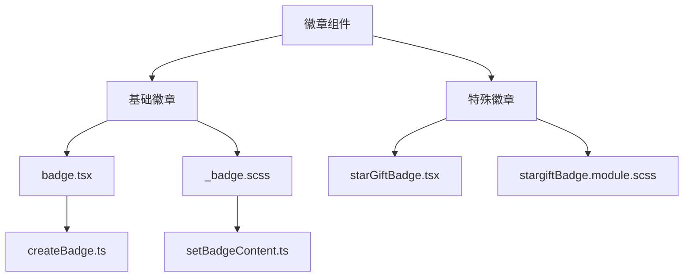

**图示来源**
- [badge.tsx](file://src/components/badge.tsx)
- [_badge.scss](file://src/scss/partials/_badge.scss)
- [starGiftBadge.tsx](file://src/components/stargifts/stargiftBadge.tsx)
- [stargiftBadge.module.scss](file://src/components/stargifts/stargiftBadge.module.scss)

**本节来源**
- [src/components](file://src/components)
- [src/scss/partials](file://src/scss/partials)
- [src/helpers](file://src/helpers)

## 核心组件
徽章组件的核心实现包括基础徽章组件和特殊徽章组件。基础徽章组件通过Solid.js的Dynamic组件实现，支持灵活的标签类型、尺寸和颜色配置。特殊徽章组件如星标徽章则针对特定业务场景进行了定制化设计。

**本节来源**
- [badge.tsx](file://src/components/badge.tsx)
- [starGiftBadge.tsx](file://src/components/stargifts/stargiftBadge.tsx)

## 架构概述
徽章组件采用分层架构设计，分为基础层和应用层。基础层提供通用的徽章样式和功能，应用层则根据具体需求进行扩展和定制。这种设计模式提高了组件的复用性和可维护性。

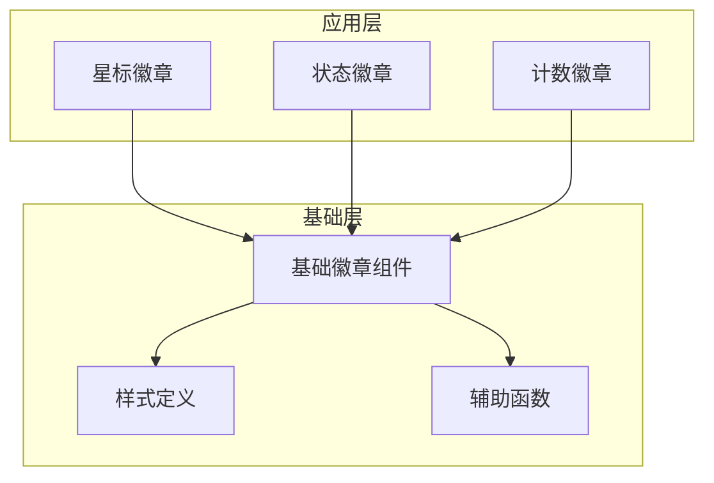

**图示来源**
- [badge.tsx](file://src/components/badge.tsx)
- [starGiftBadge.tsx](file://src/components/stargifts/stargiftBadge.tsx)
- [_badge.scss](file://src/scss/partials/_badge.scss)

## 详细组件分析

### 基础徽章组件分析
基础徽章组件是整个徽章系统的核心，提供了基本的样式和功能支持。

#### 组件实现
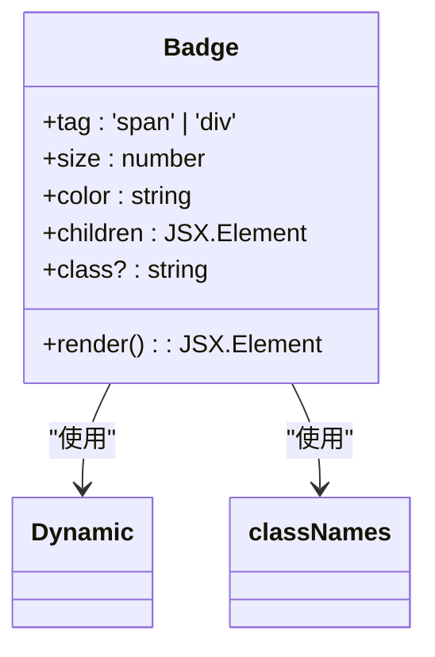

**图示来源**
- [badge.tsx](file://src/components/badge.tsx#L5-L27)

#### 样式定义
```mermaid
classDiagram
class BadgeStyles {
+--size : 1.375rem
+--padding : .4375rem
+border-radius : calc(var(--size) / 2)
+font-weight : var(--font-weight-bold)
+color : var(--badge-text-color)
+font-size : .875rem
+text-align : center
+height : var(--size)
+min-width : var(--size)
+line-height : var(--size)
+padding : 0 var(--padding)
}
BadgeStyles --> AnimationLevel : "包含"
AnimationLevel --> Transition : "transition : background-color .2s ease-in-out"
```

**图示来源**
- [_badge.scss](file://src/scss/partials/_badge.scss#L7-L57)

#### 辅助函数
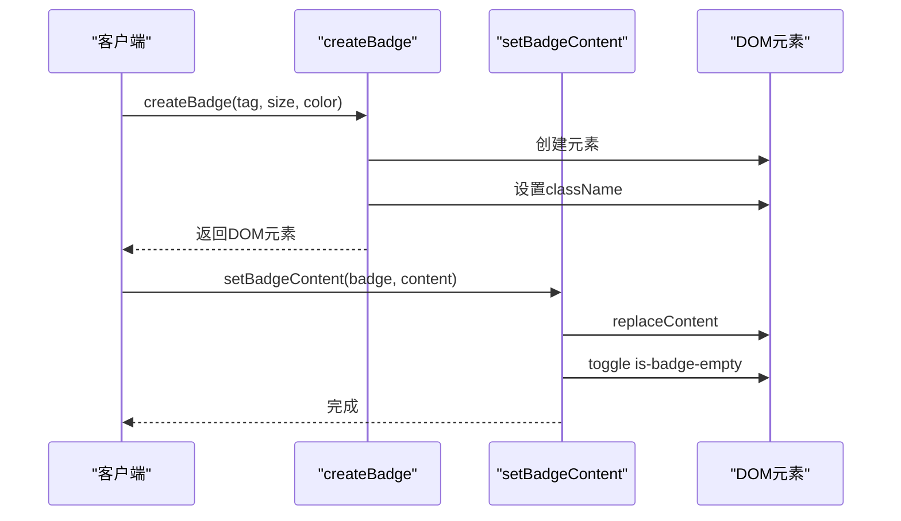

**图示来源**
- [createBadge.ts](file://src/helpers/createBadge.ts#L1-L6)
- [setBadgeContent.ts](file://src/helpers/setBadgeContent.ts#L1-L7)

**本节来源**
- [badge.tsx](file://src/components/badge.tsx)
- [_badge.scss](file://src/scss/partials/_badge.scss)
- [createBadge.ts](file://src/helpers/createBadge.ts)
- [setBadgeContent.ts](file://src/helpers/setBadgeContent.ts)

### 星标徽章组件分析
星标徽章组件是针对特定业务场景的定制化徽章实现。

#### 组件实现
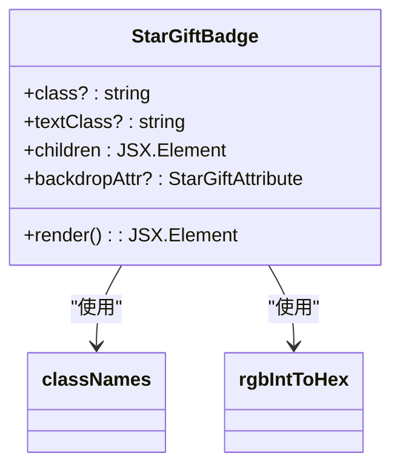

**图示来源**
- [stargiftBadge.tsx](file://src/components/stargifts/stargiftBadge.tsx#L7-L28)

#### 样式定义
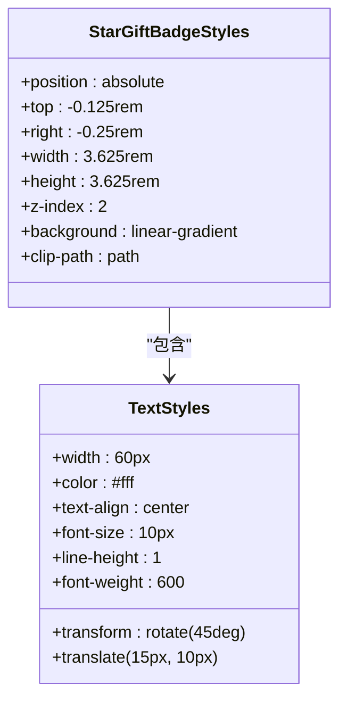

**图示来源**
- [stargiftBadge.module.scss](file://src/components/stargifts/stargiftBadge.module.scss#L1-L21)

#### 使用示例
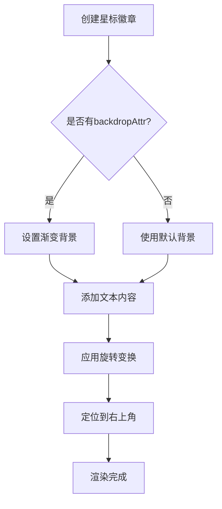

**图示来源**
- [starGift.tsx](file://src/components/chat/bubbles/starGift.tsx#L110-L118)

**本节来源**
- [stargiftBadge.tsx](file://src/components/stargifts/stargiftBadge.tsx)
- [stargiftBadge.module.scss](file://src/components/stargifts/stargiftBadge.module.scss)
- [starGift.tsx](file://src/components/chat/bubbles/starGift.tsx)

### 组合使用示例
徽章组件可以与其他UI元素组合使用，创建丰富的用户界面。

#### 与头像组合
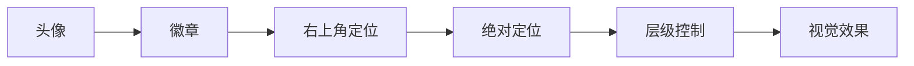

**图示来源**
- [starGift.tsx](file://src/components/chat/bubbles/starGift.tsx#L140-L142)

#### 与按钮组合
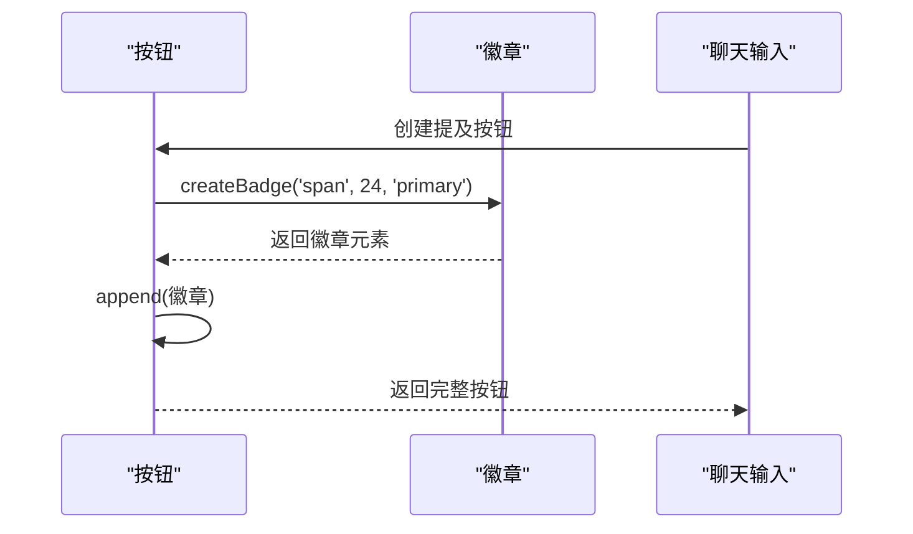

**图示来源**
- [input.ts](file://src/components/chat/input.ts#L729-L731)

**本节来源**
- [starGift.tsx](file://src/components/chat/bubbles/starGift.tsx)
- [input.ts](file://src/components/chat/input.ts)

## 依赖分析
徽章组件的实现依赖于多个辅助函数和样式系统，形成了清晰的依赖关系。

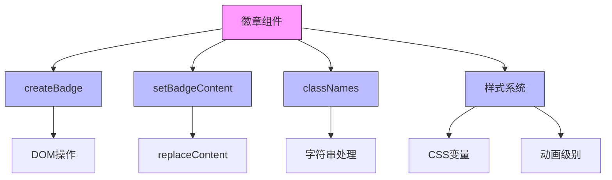

**图示来源**
- [package.json](file://package.json)
- [tsconfig.json](file://tsconfig.json)

**本节来源**
- [src/components](file://src/components)
- [src/helpers](file://src/helpers)
- [src/scss](file://src/scss)

## 性能考虑
徽章组件在设计时考虑了性能优化，避免不必要的重渲染。

### 动态更新机制
徽章组件通过专门的辅助函数进行内容更新，确保只在必要时修改DOM。

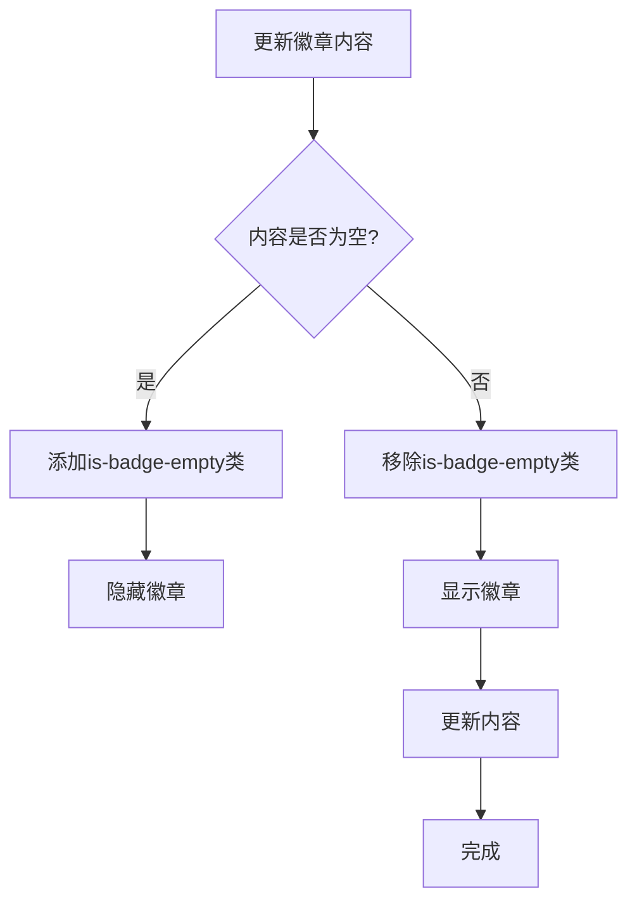

**图示来源**
- [setBadgeContent.ts](file://src/helpers/setBadgeContent.ts#L5)

### 优化策略
1. **类名切换**：使用`classList.toggle`而不是直接修改`className`
2. **内容替换**：使用`replaceContent`函数确保高效的内容更新
3. **条件渲染**：通过`is-badge-empty`类控制徽章的显示隐藏
4. **样式继承**：利用CSS变量实现样式的统一管理和高效更新

**本节来源**
- [setBadgeContent.ts](file://src/helpers/setBadgeContent.ts)
- [_badge.scss](file://src/scss/partials/_badge.scss)

## 故障排除指南
在使用徽章组件时可能会遇到一些常见问题，以下是解决方案。

### 徽章不显示
- 检查`children`属性是否为空，空内容的徽章会被隐藏
- 确认`is-badge-empty`类是否正确应用
- 检查CSS样式是否正确加载

### 位置错位
- 确认父元素的`position`属性是否设置为`relative`或`absolute`
- 检查`z-index`值是否足够高
- 验证定位属性（top、right、bottom、left）是否正确

### 样式异常
- 检查主题变量是否正确设置
- 确认CSS模块是否正确导入
- 验证类名是否冲突

**本节来源**
- [badge.tsx](file://src/components/badge.tsx)
- [_badge.scss](file://src/scss/partials/_badge.scss)

## 结论
徽章组件通过灵活的设计和高效的实现，为应用程序提供了强大的视觉指示功能。组件采用分层架构，既保证了基础功能的稳定性，又支持针对特定场景的定制化需求。通过合理的性能优化策略，确保了在频繁更新场景下的流畅体验。