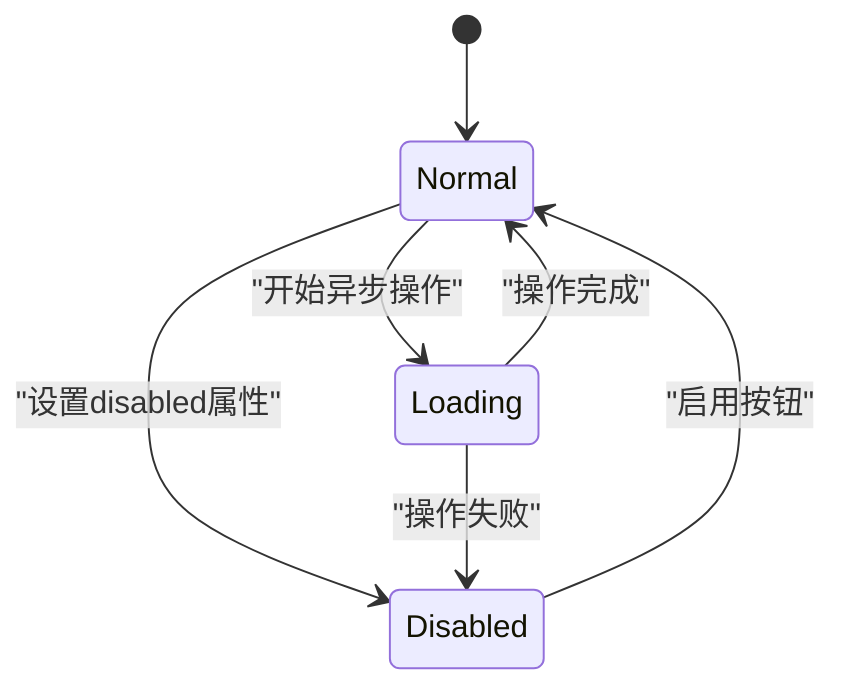
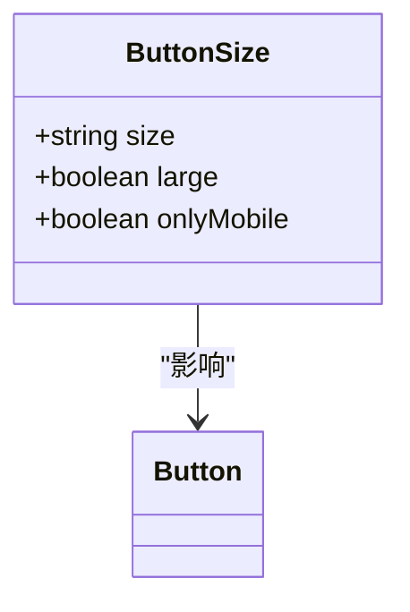
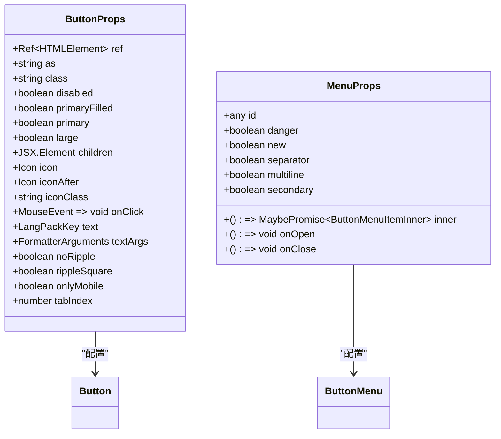
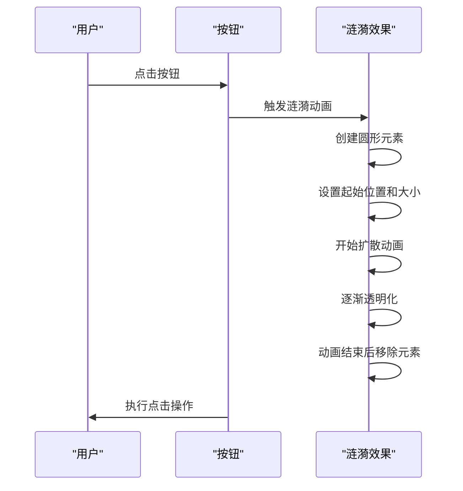
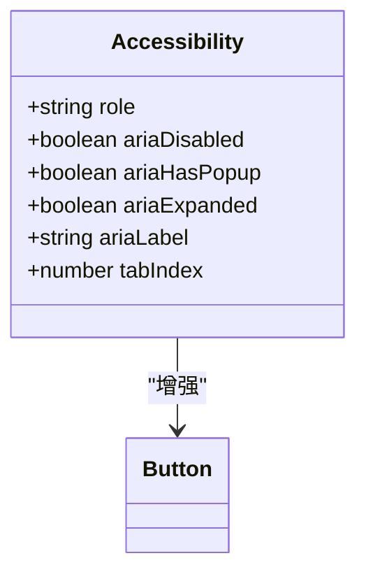
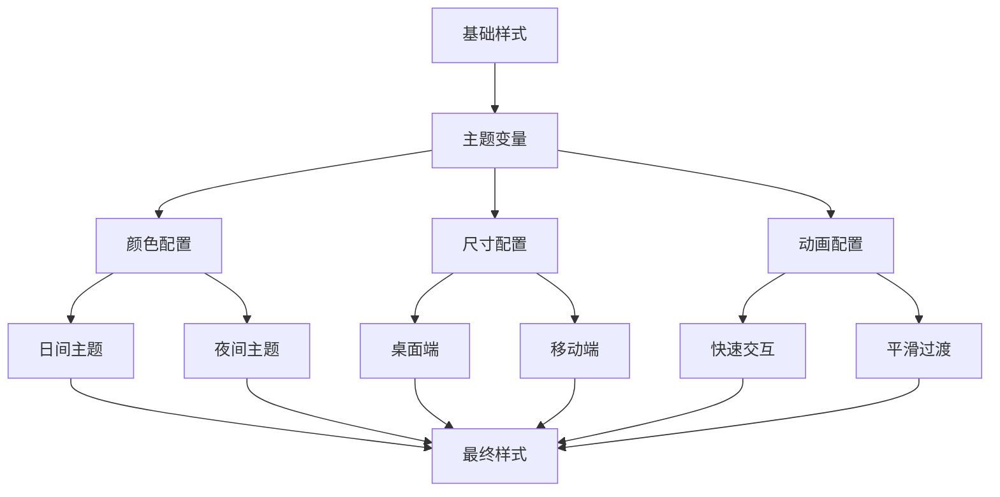
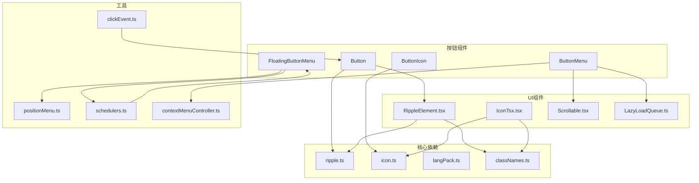

# 按钮组件

<cite>
**本文档中引用的文件**  
- [button.ts](file://src/components/button.ts)
- [buttonTsx.tsx](file://src/components/buttonTsx.tsx)
- [buttonIcon.ts](file://src/components/buttonIcon.ts)
- [buttonIconTsx.tsx](file://src/components/buttonIconTsx.tsx)
- [buttonMenu.ts](file://src/components/buttonMenu.ts)
- [buttonMenuSelect.tsx](file://src/components/buttonMenuSelect.tsx)
- [floatingButtonMenu.ts](file://src/components/floatingButtonMenu.ts)
- [ripple.ts](file://src/components/ripple.ts)
- [rippleElement.tsx](file://src/components/rippleElement.tsx)
- [style.scss](file://src/scss/style.scss)
- [button.scss](file://src/scss/partials/_button.scss)
</cite>

## 目录
1. [简介](#简介)
2. [按钮类型](#按钮类型)
3. [按钮状态](#按钮状态)
4. [尺寸变体](#尺寸变体)
5. [可用Props](#可用props)
6. [代码示例](#代码示例)
7. [涟漪效果集成](#涟漪效果集成)
8. [无障碍访问实现](#无障碍访问实现)
9. [SCSS主题定制指南](#scss主题定制指南)
10. [依赖分析](#依赖分析)

## 简介
按钮组件是用户界面中的核心交互元素，用于触发各种操作和导航功能。本组件支持多种类型、状态和尺寸，具有高度可定制性，能够满足不同场景下的设计需求。通过丰富的props配置和灵活的样式系统，开发者可以轻松创建符合应用风格的按钮。

**Section sources**
- [button.ts](file://src/components/button.ts#L1-L60)
- [buttonTsx.tsx](file://src/components/buttonTsx.tsx#L1-L74)

## 按钮类型
按钮组件支持多种类型，包括普通按钮、图标按钮、菜单按钮和浮动操作按钮等。每种类型都有其特定的使用场景和视觉特征。

### 普通按钮
普通按钮是最基本的按钮类型，通常包含文本标签，用于执行主要操作。

### 图标按钮
图标按钮使用图标代替或补充文本，适用于空间有限的界面区域。

### 菜单按钮
菜单按钮用于显示下拉菜单，包含多个可选项，支持复杂的交互逻辑。

### 浮动操作按钮
浮动操作按钮（FAB）是圆形按钮，通常位于界面的右下角，用于执行主要或频繁使用的操作。

```mermaid
classDiagram
class Button {
+string className
+boolean noRipple
+boolean onlyMobile
+Icon icon
+boolean rippleSquare
+LangPackKey text
+FormatterArguments textArgs
+boolean disabled
+boolean asDiv
+boolean asLink
+ButtonOptions options
}
class ButtonIcon {
+string className
+Partial~{noRipple : true, onlyMobile : true, asDiv : boolean}~ options
}
class ButtonMenu {
+ButtonMenuItemOptions buttons
+ListenerSetter listenerSetter
+RadioGroups radioGroups
}
class FloatingButtonMenu {
+HTMLElement element
+keyof HTMLElementEventMap triggerEvent
+string direction
+number level
+[number, number] offset
+() => HTMLElement | Promise~HTMLElement~ createMenu
+() => boolean canOpen
+() => void onClose
}
Button --> ButtonIcon : "继承"
Button --> ButtonMenu : "组合"
Button --> FloatingButtonMenu : "组合"
```

**Diagram sources**
- [button.ts](file://src/components/button.ts#L11-L21)
- [buttonIcon.ts](file://src/components/buttonIcon.ts#L9-L17)
- [buttonMenu.ts](file://src/components/buttonMenu.ts#L34-L67)
- [floatingButtonMenu.ts](file://src/components/floatingButtonMenu.ts#L5-L14)

## 按钮状态
按钮组件支持多种状态，包括正常、禁用和加载中状态，以提供清晰的用户反馈。

### 正常状态
正常状态是按钮的默认状态，表示按钮可点击并准备执行操作。

### 禁用状态
禁用状态表示按钮当前不可用，通常用于防止用户在特定条件下执行操作。

### 加载中状态
加载中状态表示按钮正在处理异步操作，通常通过视觉变化（如旋转图标）来指示加载进度。



**Diagram sources**
- [button.ts](file://src/components/button.ts#L18-L19)
- [buttonTsx.tsx](file://src/components/buttonTsx.tsx#L11-L12)

## 尺寸变体
按钮组件提供多种尺寸变体，以适应不同的布局需求和设计规范。

### 默认尺寸
默认尺寸适用于大多数常规场景，提供良好的可读性和点击区域。

### 大尺寸
大尺寸按钮用于强调重要操作，提供更大的点击区域和视觉权重。

### 移动端专用尺寸
移动端专用尺寸针对触摸屏设备优化，确保在小屏幕上易于操作。



**Diagram sources**
- [buttonTsx.tsx](file://src/components/buttonTsx.tsx#L14-L15)
- [button.scss](file://src/scss/partials/_button.scss#L100-L150)

## 可用Props
按钮组件提供丰富的props配置选项，允许开发者自定义按钮的行为和外观。

### 核心Props
- `ref`: 元素引用
- `as`: 元素类型（a、div、button）
- `class`: CSS类名
- `disabled`: 是否禁用
- `primaryFilled`: 是否为主填充样式
- `primary`: 是否为主样式
- `large`: 是否为大尺寸
- `children`: 子元素
- `icon`: 图标
- `iconAfter`: 后置图标
- `iconClass`: 图标类名
- `onClick`: 点击事件处理器
- `text`: 文本键
- `textArgs`: 文本参数
- `noRipple`: 是否禁用涟漪效果
- `rippleSquare`: 是否为方形涟漪
- `onlyMobile`: 是否仅在移动端显示
- `tabIndex`: 选项卡索引

### 菜单相关Props
- `id`: 项目ID
- `danger`: 是否为危险操作
- `new`: 是否为新项目
- `separator`: 是否显示分隔符
- `multiline`: 是否多行
- `secondary`: 是否为次要项目
- `inner`: 内部菜单
- `onOpen`: 打开回调
- `onClose`: 关闭回调



**Diagram sources**
- [buttonTsx.tsx](file://src/components/buttonTsx.tsx#L7-L26)
- [buttonMenu.ts](file://src/components/buttonMenu.ts#L34-L67)

## 代码示例
以下代码示例展示了如何创建不同类型的按钮。

### 文本按钮
```jsx
<Button primaryFilled={true} text="ButtonText" onClick={handleClick} />
```

### 图标按钮
```jsx
<Button.Icon icon="search" onClick={handleSearch} />
```

### 带下拉菜单的按钮
```jsx
<ButtonMenuSelect
  value={selectedOptions}
  onValueChange={setSelectedOptions}
  options={menuOptions}
  renderOption={({option, chosen}) => (
    <div class="menu-item">
      <span>{option.name}</span>
      {chosen && <IconTsx icon="check" />}
    </div>
  )}
  optionKey={option => option.id}
  optionSearchText={option => option.name}
  direction="bottom-start"
>
  <Button text="SelectOptions" />
</ButtonMenuSelect>
```

### 浮动操作按钮
```jsx
const {open, close} = createButtonMenuSelect({
  value: [],
  onValueChange: setSelectedOptions,
  options: fabOptions,
  renderOption: ({option}) => (
    <div class="fab-item">{option.label}</div>
  ),
  optionKey: option => option.id,
  direction: 'top-end'
});

<Button.Icon icon="add" onClick={(e) => open(e.currentTarget)} />
```

**Section sources**
- [buttonTsx.tsx](file://src/components/buttonTsx.tsx#L27-L48)
- [buttonMenuSelect.tsx](file://src/components/buttonMenuSelect.tsx#L231-L321)
- [floatingButtonMenu.ts](file://src/components/floatingButtonMenu.ts#L16-L77)

## 涟漪效果集成
按钮组件集成了涟漪效果，提供直观的点击反馈。涟漪效果通过RippleElement组件实现，支持自定义配置。

### 实现机制
涟漪效果通过在按钮内部创建一个圆形元素来实现，该元素从点击点向外扩散并逐渐消失。效果的持续时间和动画曲线可以通过CSS变量进行配置。

### 配置选项
- `noRipple`: 禁用涟漪效果
- `rippleSquare`: 使用方形涟漪而非圆形
- `--ripple-duration`: 涟漪动画持续时间
- `--ripple-start-scale`: 涟漪起始缩放比例
- `--ripple-end-scale`: 涟漪结束缩放比例



**Diagram sources**
- [ripple.ts](file://src/components/ripple.ts#L27-L268)
- [rippleElement.tsx](file://src/components/rippleElement.tsx#L7-L39)
- [button.scss](file://src/scss/partials/_button.scss#L200-L250)

## 无障碍访问实现
按钮组件遵循无障碍访问最佳实践，确保所有用户都能有效使用。

### 键盘焦点管理
按钮组件支持键盘导航，用户可以通过Tab键在不同按钮间切换焦点。焦点状态通过CSS伪类`:focus`进行视觉指示。

### ARIA角色定义
组件正确使用ARIA属性，提供语义化信息：
- `role="button"`: 明确元素的按钮角色
- `aria-disabled`: 指示按钮的禁用状态
- `aria-haspopup`: 指示按钮是否打开弹出窗口
- `aria-expanded`: 指示菜单的展开状态

### 屏幕阅读器支持
文本按钮使用i18n国际化系统，确保屏幕阅读器能正确读取按钮文本。图标按钮提供适当的`aria-label`属性，描述图标的功能。



**Diagram sources**
- [buttonTsx.tsx](file://src/components/buttonTsx.tsx#L25-L26)
- [button.scss](file://src/scss/partials/_button.scss#L300-L350)

## SCSS主题定制指南
通过SCSS变量系统，开发者可以轻松定制按钮的外观，实现品牌一致性。

### 主题变量
按钮样式通过一系列SCSS变量控制，主要变量定义在`variables.scss`和`_button.scss`文件中。

#### 颜色变量
- `--primary-color`: 主要颜色
- `--secondary-color`: 次要颜色
- `--danger-color`: 危险操作颜色
- `--light-primary-color`: 主要颜色的浅色版本
- `--dark-primary-color`: 主要颜色的深色版本

#### 尺寸变量
- `--btn-padding`: 按钮内边距
- `--btn-font-size`: 按钮字体大小
- `--btn-border-radius`: 按钮边框半径
- `--btn-large-scale`: 大尺寸按钮缩放比例

#### 动画变量
- `--ripple-duration`: 涟漪动画持续时间
- `--btn-transition`: 按钮状态过渡时间
- `--hover-alpha`: 悬停状态透明度

### 自定义方法
要自定义按钮外观，可以通过覆盖SCSS变量来实现：

```scss
// 自定义主题
:root {
  --primary-color: #ff6b6b;
  --secondary-color: #4ecdc4;
  --danger-color: #ff4757;
  --btn-border-radius: 12px;
  --btn-transition: 0.3s ease;
}

// 移动端特定样式
@media (max-width: 768px) {
  :root {
    --btn-font-size: 18px;
    --btn-padding: 12px 24px;
  }
}
```

### 响应式设计
按钮组件支持响应式设计，通过媒体查询和CSS变量，可以为不同设备尺寸提供优化的用户体验。



**Diagram sources**
- [variables.scss](file://src/scss/variables.scss)
- [style.scss](file://src/scss/style.scss)
- [button.scss](file://src/scss/partials/_button.scss)

## 依赖分析
按钮组件依赖于多个其他组件和工具，形成了一个完整的交互系统。

### 核心依赖
- `ripple.ts`: 提供涟漪效果功能
- `icon.ts`: 管理图标显示
- `langPack.ts`: 处理国际化文本
- `classNames.ts`: 管理CSS类名

### UI组件依赖
- `RippleElement.tsx`: 封装涟漪效果的SolidJS组件
- `IconTsx.tsx`: SolidJS图标组件
- `Scrollable.tsx`: 支持可滚动内容
- `LazyLoadQueue.ts`: 优化性能的延迟加载队列

### 工具依赖
- `clickEvent.ts`: 统一处理点击事件
- `positionMenu.ts`: 精确定位下拉菜单
- `schedulers.ts`: 管理动画帧和异步操作
- `contextMenuController.ts`: 控制上下文菜单的显示和隐藏



**Diagram sources**
- [button.ts](file://src/components/button.ts)
- [buttonTsx.tsx](file://src/components/buttonTsx.tsx)
- [buttonMenu.ts](file://src/components/buttonMenu.ts)
- [floatingButtonMenu.ts](file://src/components/floatingButtonMenu.ts)
- [ripple.ts](file://src/components/ripple.ts)
- [rippleElement.tsx](file://src/components/rippleElement.tsx)