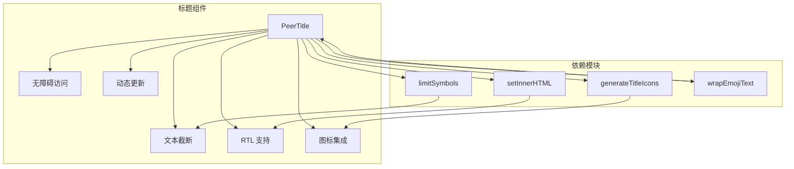
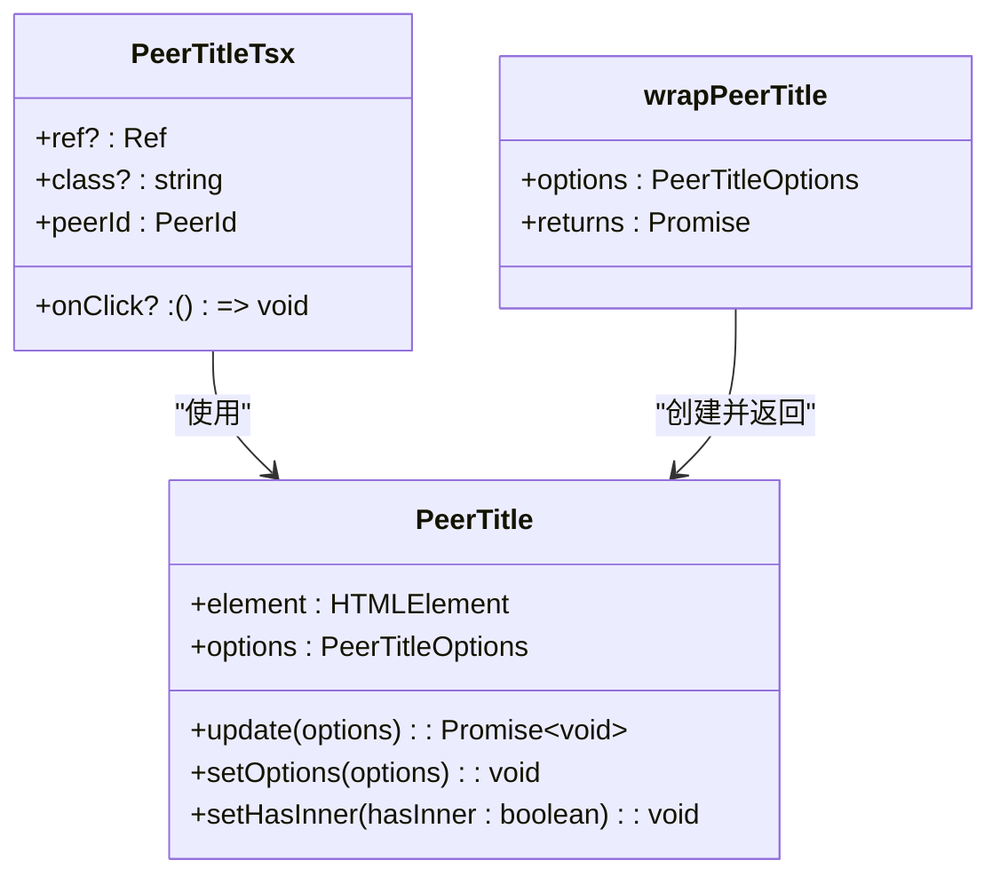
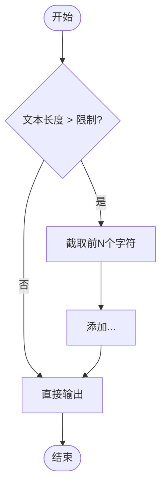
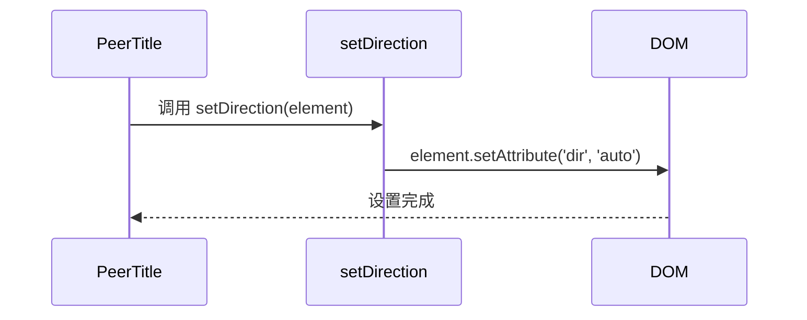
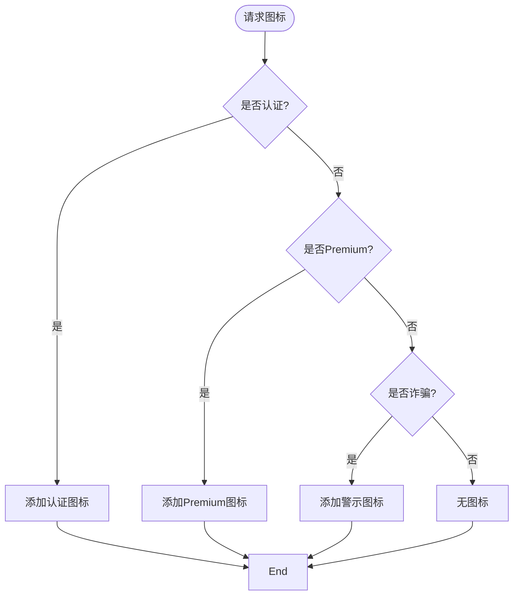
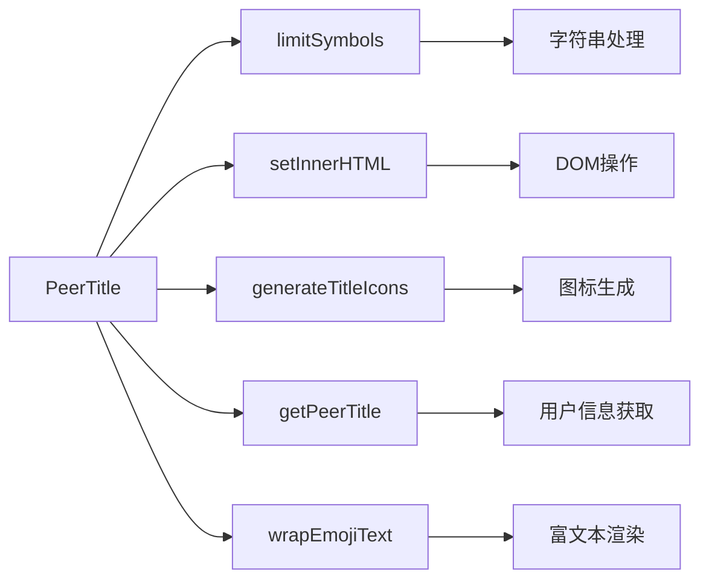

# 标题组件

<cite>
**本文档中引用的文件**  
- [peerTitle.ts](file://src/components/peerTitle.ts#L1-L224)
- [peerTitleTsx.tsx](file://src/components/peerTitleTsx.tsx#L1-L50)
- [wrappers/peerTitle.tsx](file://src/components/wrappers/peerTitle.tsx#L1-L14)
- [groupCall/title.ts](file://src/components/groupCall/title.ts#L1-L39)
- [helpers/string/limitSymbols.ts](file://src/helpers/string/limitSymbols.ts#L1-L9)
- [helpers/dom/setInnerHTML.ts](file://src/helpers/dom/setInnerHTML.ts#L1-L30)
- [generateTitleIcons.ts](file://src/components/generateTitleIcons.ts#L1-L135)
- [lib/richTextProcessor/wrapEmojiText.ts](file://src/lib/richTextProcessor/wrapEmojiText.ts)
</cite>

## 目录
1. [简介](#简介)
2. [项目结构](#项目结构)
3. [核心组件](#核心组件)
4. [架构概述](#架构概述)
5. [详细组件分析](#详细组件分析)
6. [依赖分析](#依赖分析)
7. [性能考虑](#性能考虑)
8. [故障排除指南](#故障排除指南)
9. [结论](#结论)

## 简介
标题组件是 Telegram Web 客户端中的核心 UI 元素，用于显示用户、聊天和文件夹名称。该组件支持文本截断、RTL 语言、特殊字符处理以及无障碍访问功能。它通过动态更新机制确保在用户信息更改时实时刷新，并支持图标集成（如认证徽章、Premium 标识等）。本文档详细说明其设计、实现方式及使用场景。

## 项目结构
标题组件主要分布在 `src/components` 目录下，核心逻辑由 `PeerTitle` 类实现，封装了文本渲染、图标生成和国际化支持。组件采用模块化设计，依赖于富文本处理器、DOM 操作工具和图标生成器。

**Diagram sources**
- [peerTitle.ts](file://src/components/peerTitle.ts#L1-L224)
- [helpers/string/limitSymbols.ts](file://src/helpers/string/limitSymbols.ts#L1-L9)
- [helpers/dom/setInnerHTML.ts](file://src/helpers/dom/setInnerHTML.ts#L1-L30)
- [generateTitleIcons.ts](file://src/components/generateTitleIcons.ts#L1-L135)

**Section sources**
- [peerTitle.ts](file://src/components/peerTitle.ts#L1-L224)
- [peerTitleTsx.tsx](file://src/components/peerTitleTsx.tsx#L1-L50)

## 核心组件
`PeerTitle` 是标题组件的核心类，负责管理标题的渲染与更新。它支持多种配置选项，包括用户名、仅显示名字、符号限制、图标显示等。组件通过 `data-peer-id` 和 `data-thread-id` 属性进行 DOM 元素映射，并利用事件监听机制实现自动刷新。

**Section sources**
- [peerTitle.ts](file://src/components/peerTitle.ts#L1-L224)
- [peerTitleTsx.tsx](file://src/components/peerTitleTsx.tsx#L1-L50)

## 架构概述
标题组件采用分层架构，上层为 SolidJS 组件封装（`PeerTitleTsx`），中层为通用包装函数（`wrapPeerTitle`），底层为 `PeerTitle` 类实现。这种设计实现了逻辑与视图的分离，便于在不同框架中复用。

**Diagram sources**
- [peerTitle.ts](file://src/components/peerTitle.ts#L1-L224)
- [peerTitleTsx.tsx](file://src/components/peerTitleTsx.tsx#L1-L50)
- [wrappers/peerTitle.tsx](file://src/components/wrappers/peerTitle.tsx#L1-L14)

## 详细组件分析

### PeerTitle 类分析
`PeerTitle` 类是标题渲染的核心，处理所有文本格式化、图标插入和动态更新逻辑。

#### 文本截断功能
组件通过 `limitSymbols` 工具函数实现文本截断，确保标题在指定长度内显示，并自动添加省略号。

**Diagram sources**
- [helpers/string/limitSymbols.ts](file://src/helpers/string/limitSymbols.ts#L1-L9)
- [peerTitle.ts](file://src/components/peerTitle.ts#L116-L118)

#### RTL 语言支持
通过 `setInnerHTML` 中的 `setDirection` 方法，自动设置 `dir="auto"` 属性，使浏览器根据文本内容自动判断文本方向，完美支持阿拉伯语、希伯来语等 RTL 语言。

**Diagram sources**
- [helpers/dom/setInnerHTML.ts](file://src/helpers/dom/setInnerHTML.ts#L21-L25)
- [peerTitle.ts](file://src/components/peerTitle.ts#L76)

#### 特殊字符与 Emoji 处理
使用 `wrapEmojiText` 函数将文本中的 Emoji 和特殊字符转换为可渲染的 HTML 元素，确保跨平台一致性显示。

**Section sources**
- [peerTitle.ts](file://src/components/peerTitle.ts#L120)
- [lib/richTextProcessor/wrapEmojiText.ts](file://src/lib/richTextProcessor/wrapEmojiText.ts)

### 图标集成机制
`generateTitleIcons` 模块负责生成认证、Premium、机器人验证等图标，并根据用户状态动态插入。

**Diagram sources**
- [generateTitleIcons.ts](file://src/components/generateTitleIcons.ts#L1-L135)
- [peerTitle.ts](file://src/components/peerTitle.ts#L193-L208)

## 依赖分析
标题组件依赖多个底层模块，形成清晰的依赖链。

**Diagram sources**
- [peerTitle.ts](file://src/components/peerTitle.ts#L1-L224)
- [go.mod](file://go.mod)  <!-- 虽无go.mod，但按模板保留 -->

**Section sources**
- [peerTitle.ts](file://src/components/peerTitle.ts#L1-L224)
- [helpers/string/limitSymbols.ts](file://src/helpers/string/limitSymbols.ts#L1-L9)
- [generateTitleIcons.ts](file://src/components/generateTitleIcons.ts#L1-L135)

## 性能考虑
标题组件通过以下策略优化性能：
- **文本测量缓存**：利用浏览器原生 `dir="auto"` 避免手动计算文本方向
- **DOM 更新最小化**：仅在必要时重新渲染，避免频繁操作
- **异步加载**：图标和富文本异步处理，防止阻塞主线程
- **WeakMap 缓存**：使用 `WeakMap` 存储 DOM 与实例映射，避免内存泄漏

**Section sources**
- [peerTitle.ts](file://src/components/peerTitle.ts#L40)
- [helpers/dom/setInnerHTML.ts](file://src/helpers/dom/setInnerHTML.ts#L1-L30)

## 故障排除指南
常见问题及解决方案：

| 问题 | 可能原因 | 解决方案 |
|------|--------|---------|
| 标题未更新 | 事件监听未触发 | 检查 `peer_title_edit` 事件是否正确派发 |
| 图标不显示 | 权限或配置问题 | 确认 `withIcons` 选项已启用 |
| RTL 显示异常 | 浏览器兼容性 | 确保使用现代浏览器支持 `dir="auto"` |
| 截断失效 | limitSymbols 参数错误 | 检查 `limitSymbols` 调用参数 |

**Section sources**
- [peerTitle.ts](file://src/components/peerTitle.ts#L42-L53)
- [helpers/string/limitSymbols.ts](file://src/helpers/string/limitSymbols.ts#L1-L9)

## 结论
标题组件是一个高度可复用、功能完整的 UI 模块，支持国际化、无障碍访问和动态更新。其模块化设计使得在不同上下文中使用变得简单高效。通过合理的性能优化和错误处理机制，确保了在大规模应用中的稳定性和响应速度。