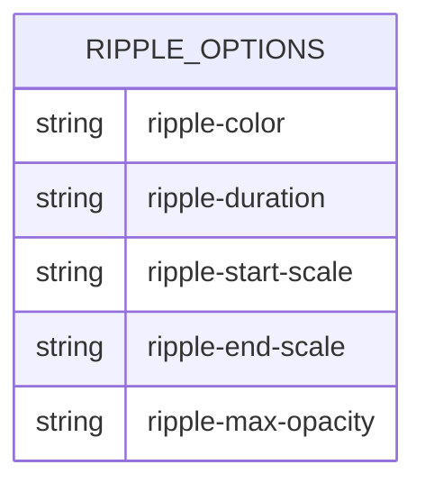
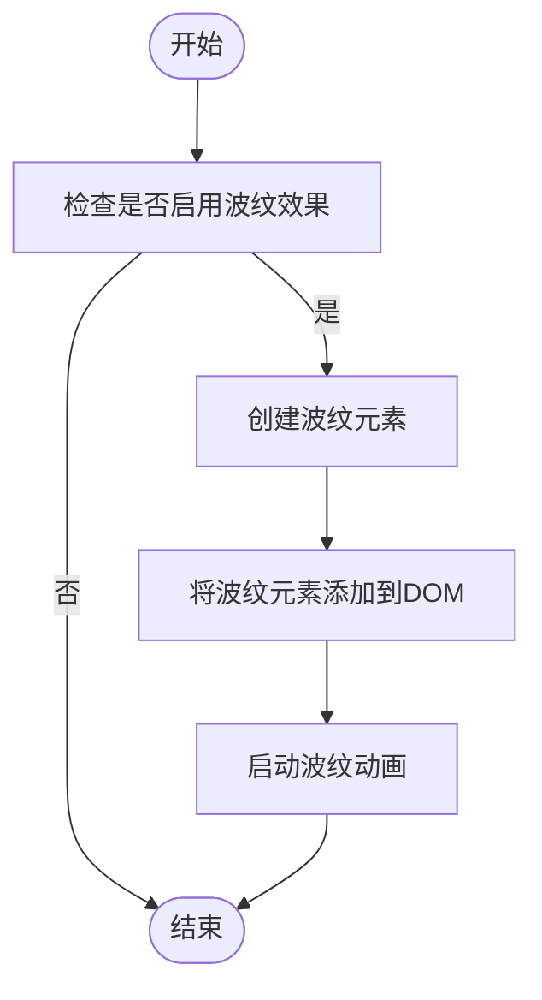
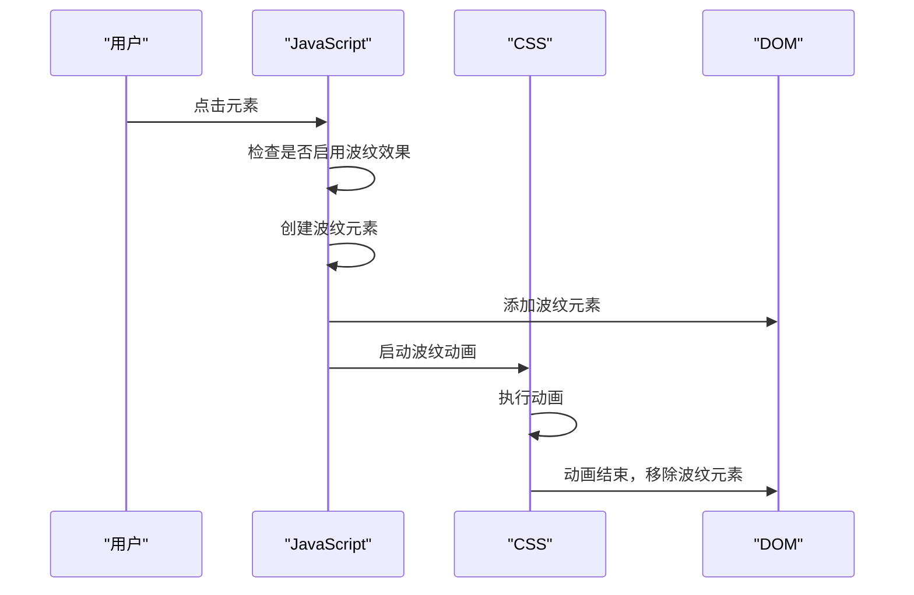

# 波纹效果

<cite>
**本文档引用的文件**   
- [ripple.ts](file://src/components/ripple.ts)
- [rippleTsx.tsx](file://src/components/rippleTsx.tsx)
- [rippleElement.tsx](file://src/components/rippleElement.tsx)
- [_ripple.scss](file://src/scss/partials/_ripple.scss)
- [button.ts](file://src/components/button.ts)
- [buttonIconTsx.tsx](file://src/components/buttonIconTsx.tsx)
- [liteMode.ts](file://src/helpers/liteMode.ts)
</cite>

## 目录
1. [简介](#简介)
2. [核心组件](#核心组件)
3. [实现机制](#实现机制)
4. [配置选项](#配置选项)
5. [应用方式](#应用方式)
6. [性能优化](#性能优化)
7. [结论](#结论)

## 简介
波纹效果是一种基于CSS动画和JavaScript事件处理的视觉反馈机制，广泛应用于按钮、列表项等可点击元素上。该效果通过在用户点击时从点击点向外扩散的动画，提供直观的交互反馈。本文档详细解释了波纹效果的实现机制、配置选项、应用方式以及性能优化措施。

## 核心组件

波纹效果的核心组件包括JavaScript逻辑和CSS样式。JavaScript负责处理点击事件并动态创建波纹元素，而CSS则定义了波纹的动画效果和视觉样式。

**Section sources**
- [ripple.ts](file://src/components/ripple.ts#L1-L268)
- [_ripple.scss](file://src/scss/partials/_ripple.scss#L1-L84)

## 实现机制

波纹效果的实现机制结合了CSS动画和JavaScript事件处理。当用户点击一个可点击元素时，JavaScript会捕获点击事件，并在元素内部创建一个波纹元素。该波纹元素通过CSS动画从点击点向外扩散，形成波纹效果。

```mermaid
classDiagram
class Ripple {
+_ripple(elem : HTMLElement, prepend : boolean | 'no', callback : (id : number) => Promise<boolean | void>, onEnd : (id : number) => void, attachListenerTo = elem)
+ripple(elem : HTMLElement, accessor? : Accessor<boolean>, prepend? : boolean | 'no')
}
class RippleTsx {
+Ripple(props : RippleProps)
}
class RippleElement {
+RippleElement<T extends ValidComponent>(props : DynamicProps<T> & {noRipple? : boolean, rippleSquare? : boolean})
}
Ripple --> RippleTsx : "使用"
Ripple --> RippleElement : "使用"
```

**Diagram sources **
- [ripple.ts](file://src/components/ripple.ts#L1-L268)
- [rippleTsx.tsx](file://src/components/rippleTsx.tsx#L1-L21)
- [rippleElement.tsx](file://src/components/rippleElement.tsx#L1-L39)

## 配置选项

波纹效果提供了多种配置选项，包括波纹颜色、持续时间和扩散速度。这些选项可以通过CSS自定义属性进行配置。



**Diagram sources **
- [_ripple.scss](file://src/scss/partials/_ripple.scss#L53-L83)

## 应用方式

波纹效果可以应用于各种可点击元素，如按钮、列表项等。通过在元素上添加相应的类名或使用JavaScript函数，可以轻松地为元素添加波纹效果。



**Diagram sources **
- [ripple.ts](file://src/components/ripple.ts#L27-L247)
- [button.ts](file://src/components/button.ts#L23-L60)
- [buttonIconTsx.tsx](file://src/components/buttonIconTsx.tsx#L6-L24)

## 性能优化

为了确保波纹效果的流畅性，采取了多种性能优化措施。这些措施包括动画帧率控制和DOM元素复用策略。通过使用`requestAnimationFrame`和`fastRaf`，确保动画在合适的时机执行，避免不必要的重绘和重排。



**Diagram sources **
- [ripple.ts](file://src/components/ripple.ts#L116-L167)
- [liteMode.ts](file://src/helpers/liteMode.ts#L17-L23)

## 结论

波纹效果通过结合CSS动画和JavaScript事件处理，为用户提供直观的交互反馈。通过合理的配置选项和性能优化措施，可以确保波纹效果在各种设备上流畅运行。本文档详细介绍了波纹效果的实现机制、配置选项、应用方式以及性能优化措施，为开发者提供了全面的参考。