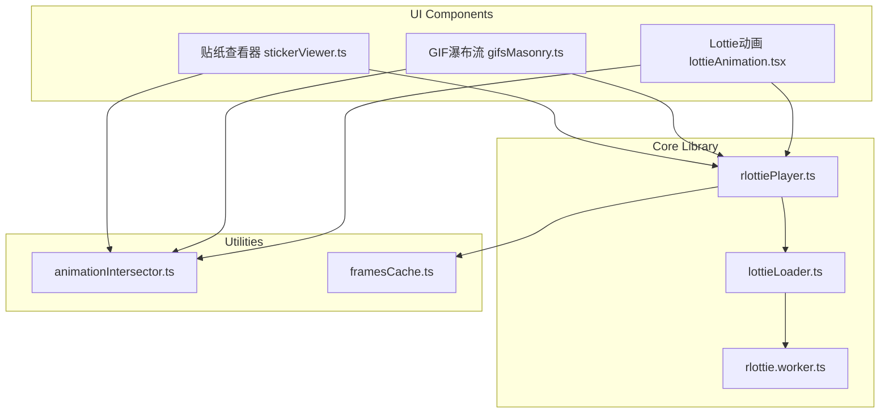
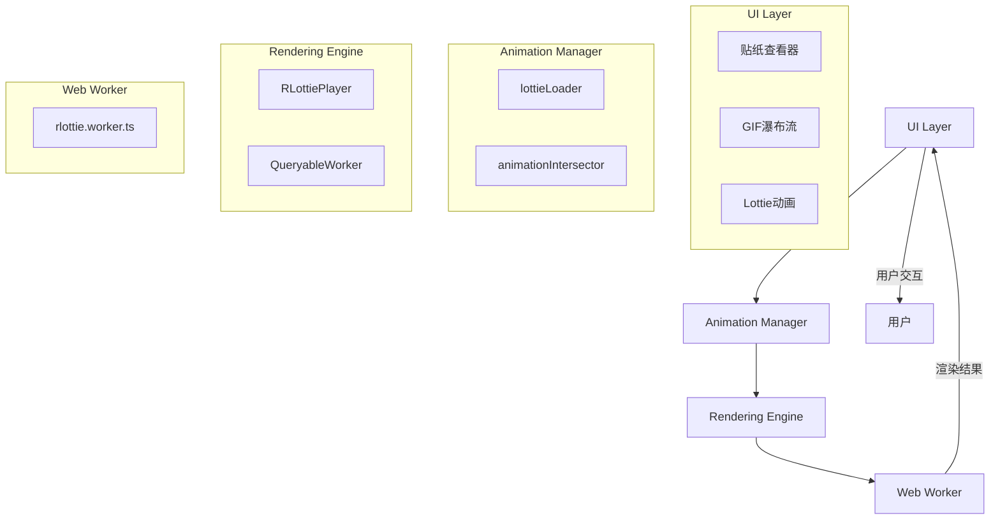
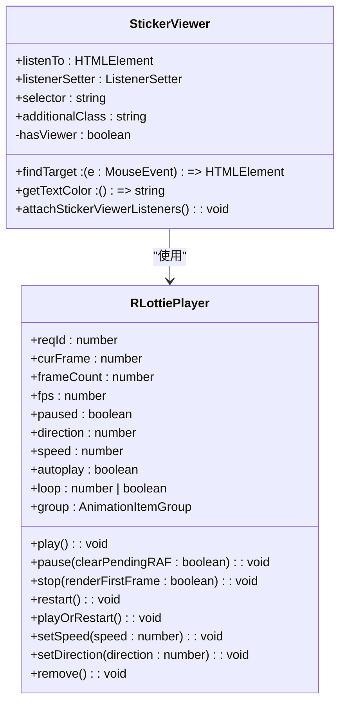
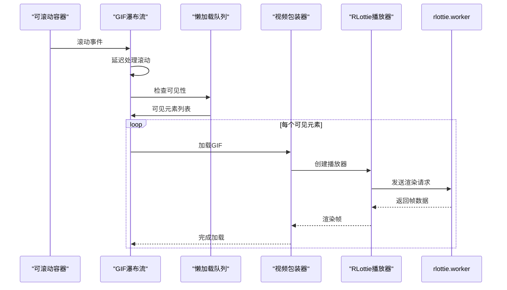
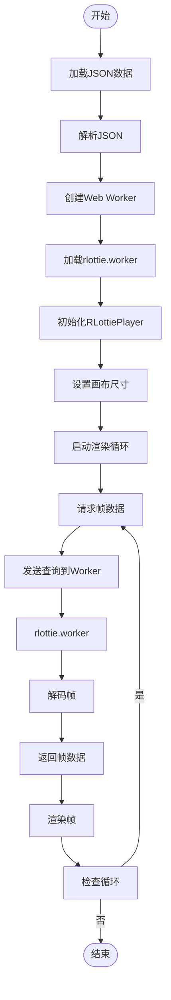
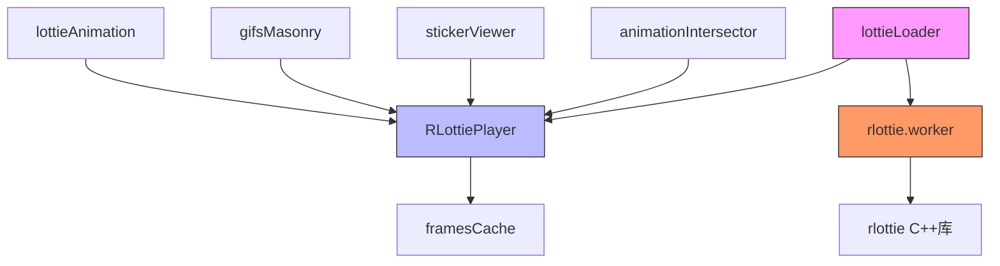

# 动画组件

<cite>
**本文档中引用的文件**   
- [stickerViewer.ts](file://src/components/stickerViewer.ts)
- [gifsMasonry.ts](file://src/components/gifsMasonry.ts)
- [lottieAnimation.tsx](file://src/components/lottieAnimation.tsx)
- [rlottiePlayer.ts](file://src/lib/rlottie/rlottiePlayer.ts)
- [lottieLoader.ts](file://src/lib/rlottie/lottieLoader.ts)
- [rlottie.worker.ts](file://src/lib/rlottie/rlottie.worker.ts)
- [animationIntersector.ts](file://src/components/animationIntersector.ts)
- [_stickerViewer.scss](file://src/scss/partials/_stickerViewer.scss)
- [_gifsMasonry.scss](file://src/scss/partials/_gifsMasonry.scss)
- [lottieAnimation-Bh8Z3Bb3.css](file://public/lottieAnimation-Bh8Z3Bb3.css)
</cite>

## 目录
1. [简介](#简介)
2. [项目结构](#项目结构)
3. [核心组件](#核心组件)
4. [架构概述](#架构概述)
5. [详细组件分析](#详细组件分析)
6. [依赖分析](#依赖分析)
7. [性能考虑](#性能考虑)
8. [故障排除指南](#故障排除指南)
9. [结论](#结论)

## 简介
本文档全面介绍了动画组件的架构设计和实现机制，重点涵盖贴纸查看器（stickerViewer）、GIF瀑布流（gifsMasonry）和Lottie动画（lottieAnimation）三大核心功能。文档详细说明了这些组件的动画播放机制、布局算法、渲染流程以及性能优化策略，为开发者提供了深入的技术参考和最佳实践指导。

## 项目结构
动画组件主要分布在`src/components`和`src/lib/rlottie`目录下，采用模块化设计，各组件职责明确，相互协作。核心文件包括`stickerViewer.ts`、`gifsMasonry.ts`和`lottieAnimation.tsx`，它们分别负责贴纸、GIF和Lottie动画的展示逻辑。底层渲染由`rlottie`库提供支持，通过Web Worker实现高性能的动画解码和渲染。

**Diagram sources**
- [stickerViewer.ts](file://src/components/stickerViewer.ts)
- [gifsMasonry.ts](file://src/components/gifsMasonry.ts)
- [lottieAnimation.tsx](file://src/components/lottieAnimation.tsx)
- [rlottiePlayer.ts](file://src/lib/rlottie/rlottiePlayer.ts)
- [lottieLoader.ts](file://src/lib/rlottie/lottieLoader.ts)
- [rlottie.worker.ts](file://src/lib/rlottie/rlottie.worker.ts)
- [animationIntersector.ts](file://src/components/animationIntersector.ts)

**Section sources**
- [stickerViewer.ts](file://src/components/stickerViewer.ts)
- [gifsMasonry.ts](file://src/components/gifsMasonry.ts)
- [lottieAnimation.tsx](file://src/components/lottieAnimation.tsx)

## 核心组件

本文档的核心组件包括贴纸查看器（stickerViewer）、GIF瀑布流（gifsMasonry）和Lottie动画（lottieAnimation）。贴纸查看器提供鼠标悬停预览功能，GIF瀑布流实现高效的网格布局和懒加载，Lottie动画组件则负责JSON格式动画的解析和渲染。这些组件共同构成了应用的动画生态系统，为用户提供流畅的视觉体验。

**Section sources**
- [stickerViewer.ts](file://src/components/stickerViewer.ts)
- [gifsMasonry.ts](file://src/components/gifsMasonry.ts)
- [lottieAnimation.tsx](file://src/components/lottieAnimation.tsx)

## 架构概述

动画组件采用分层架构设计，上层为UI组件，中层为动画管理器，底层为渲染引擎。UI组件负责用户交互和DOM操作，动画管理器协调动画的播放和生命周期，渲染引擎在Web Worker中执行耗时的解码和渲染任务。这种架构有效分离了关注点，提高了代码的可维护性和性能。

**Diagram sources**
- [lottieLoader.ts](file://src/lib/rlottie/lottieLoader.ts)
- [animationIntersector.ts](file://src/components/animationIntersector.ts)
- [rlottiePlayer.ts](file://src/lib/rlottie/rlottiePlayer.ts)
- [rlottie.worker.ts](file://src/lib/rlottie/rlottie.worker.ts)

## 详细组件分析

### 贴纸查看器分析
贴纸查看器组件实现了鼠标悬停预览贴纸动画的功能。当用户将鼠标悬停在贴纸上时，组件会创建一个放大的预览窗口，并从当前播放位置开始播放动画。该组件通过`animationIntersector`管理动画的播放状态，确保只有可见的动画才会被渲染，从而优化性能。

#### 对象导向组件：

**Diagram sources**
- [stickerViewer.ts](file://src/components/stickerViewer.ts)
- [rlottiePlayer.ts](file://src/lib/rlottie/rlottiePlayer.ts)

### GIF瀑布流分析
GIF瀑布流组件实现了高效的网格布局和懒加载机制。它根据容器宽度自适应计算列数，并通过`LazyLoadQueueRepeat2`实现滚动时的按需加载。组件在滚动时会延迟处理，避免频繁触发重排和重绘，从而保证滚动的流畅性。

#### API/服务组件：

**Diagram sources**
- [gifsMasonry.ts](file://src/components/gifsMasonry.ts)
- [lazyLoadQueueRepeat2.ts](file://src/components/lazyLoadQueueRepeat2.ts)
- [wrapVideo.ts](file://src/components/wrappers/video.ts)
- [rlottiePlayer.ts](file://src/lib/rlottie/rlottiePlayer.ts)

### Lottie动画分析
Lottie动画组件负责解析JSON格式的动画数据并在Canvas上渲染。它通过Web Worker将计算密集型的解码任务移出主线程，避免阻塞UI。组件支持颜色替换、帧率控制和缓存策略，确保动画播放的流畅性和一致性。

#### 复杂逻辑组件：

**Diagram sources**
- [lottieAnimation.tsx](file://src/components/lottieAnimation.tsx)
- [lottieLoader.ts](file://src/lib/rlottie/lottieLoader.ts)
- [rlottiePlayer.ts](file://src/lib/rlottie/rlottiePlayer.ts)
- [rlottie.worker.ts](file://src/lib/rlottie/rlottie.worker.ts)

**Section sources**
- [stickerViewer.ts](file://src/components/stickerViewer.ts)
- [gifsMasonry.ts](file://src/components/gifsMasonry.ts)
- [lottieAnimation.tsx](file://src/components/lottieAnimation.tsx)
- [rlottiePlayer.ts](file://src/lib/rlottie/rlottiePlayer.ts)
- [lottieLoader.ts](file://src/lib/rlottie/lottieLoader.ts)

## 依赖分析

动画组件之间存在复杂的依赖关系，通过`lottieLoader`进行统一管理和协调。`animationIntersector`负责监控动画的可见性，控制播放状态。Web Worker提供独立的渲染线程，确保主线程的流畅性。这种依赖结构实现了关注点分离，提高了系统的可维护性和扩展性。

**Diagram sources**
- [lottieLoader.ts](file://src/lib/rlottie/lottieLoader.ts)
- [rlottiePlayer.ts](file://src/lib/rlottie/rlottiePlayer.ts)
- [rlottie.worker.ts](file://src/lib/rlottie/rlottie.worker.ts)
- [animationIntersector.ts](file://src/components/animationIntersector.ts)

**Section sources**
- [lottieLoader.ts](file://src/lib/rlottie/lottieLoader.ts)
- [rlottiePlayer.ts](file://src/lib/rlottie/rlottiePlayer.ts)
- [rlottie.worker.ts](file://src/lib/rlottie/rlottie.worker.ts)
- [animationIntersector.ts](file://src/components/animationIntersector.ts)

## 性能考虑

动画组件在设计时充分考虑了性能优化。通过Web Worker将计算密集型任务移出主线程，避免阻塞UI。采用帧缓存策略，对频繁使用的帧进行缓存，减少重复解码。利用`animationIntersector`监控动画可见性，只渲染可见区域的动画，大幅降低渲染开销。此外，组件还实现了智能的帧率控制，根据设备性能和网络状况动态调整播放速度。

## 故障排除指南

### 动画卡顿问题
动画卡顿通常由主线程阻塞或渲染开销过大引起。首先检查是否有耗时的JavaScript操作阻塞主线程。其次，确认是否启用了Web Worker，确保解码任务在独立线程中执行。最后，检查帧缓存策略是否有效，避免重复解码同一帧。

**Section sources**
- [rlottiePlayer.ts](file://src/lib/rlottie/rlottiePlayer.ts)
- [lottieLoader.ts](file://src/lib/rlottie/lottieLoader.ts)

### 内存泄漏问题
内存泄漏可能由未正确清理的动画实例引起。确保在组件销毁时调用`remove()`方法，释放相关资源。检查`lottieLoader`中的播放器引用，确认无内存泄漏。使用浏览器的内存分析工具监控内存使用情况，定位泄漏点。

**Section sources**
- [rlottiePlayer.ts](file://src/lib/rlottie/rlottiePlayer.ts)
- [lottieLoader.ts](file://src/lib/rlottie/lottieLoader.ts)

## 结论

本文档详细介绍了动画组件的架构设计和实现细节。通过分层架构和Web Worker技术，组件实现了高性能的动画播放。贴纸查看器、GIF瀑布流和Lottie动画各司其职，共同为用户提供流畅的视觉体验。未来可进一步优化缓存策略，引入更智能的预加载机制，提升用户体验。