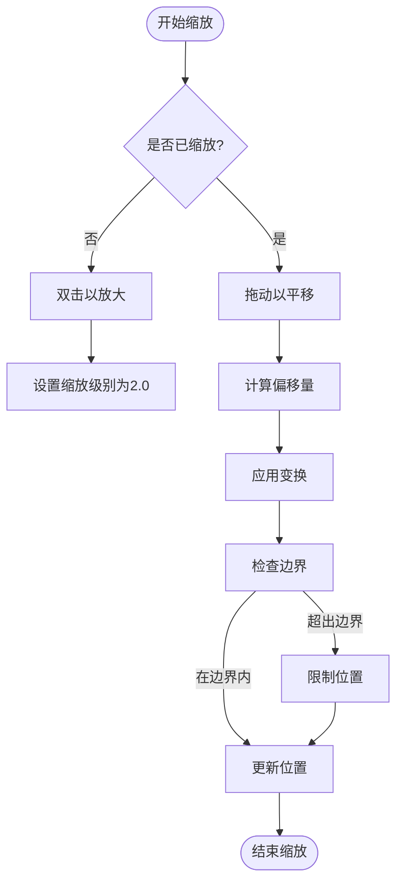
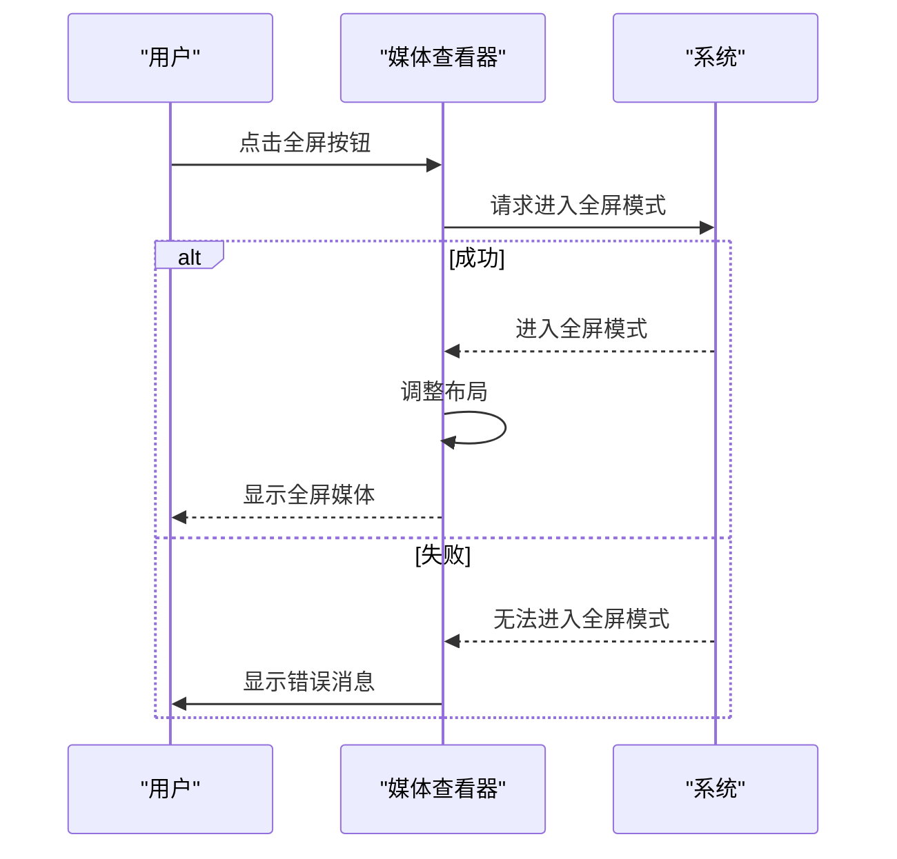
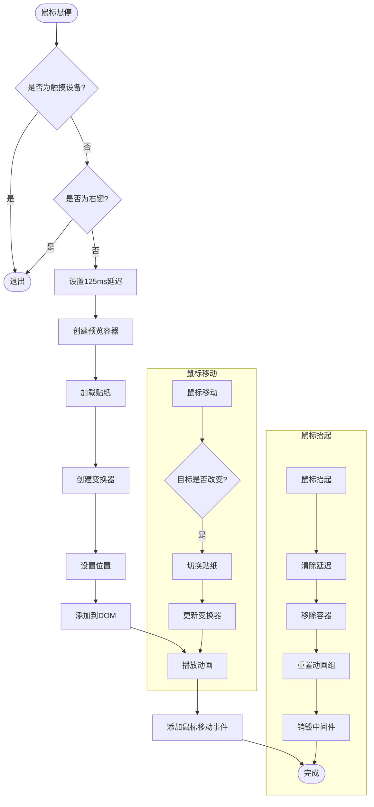
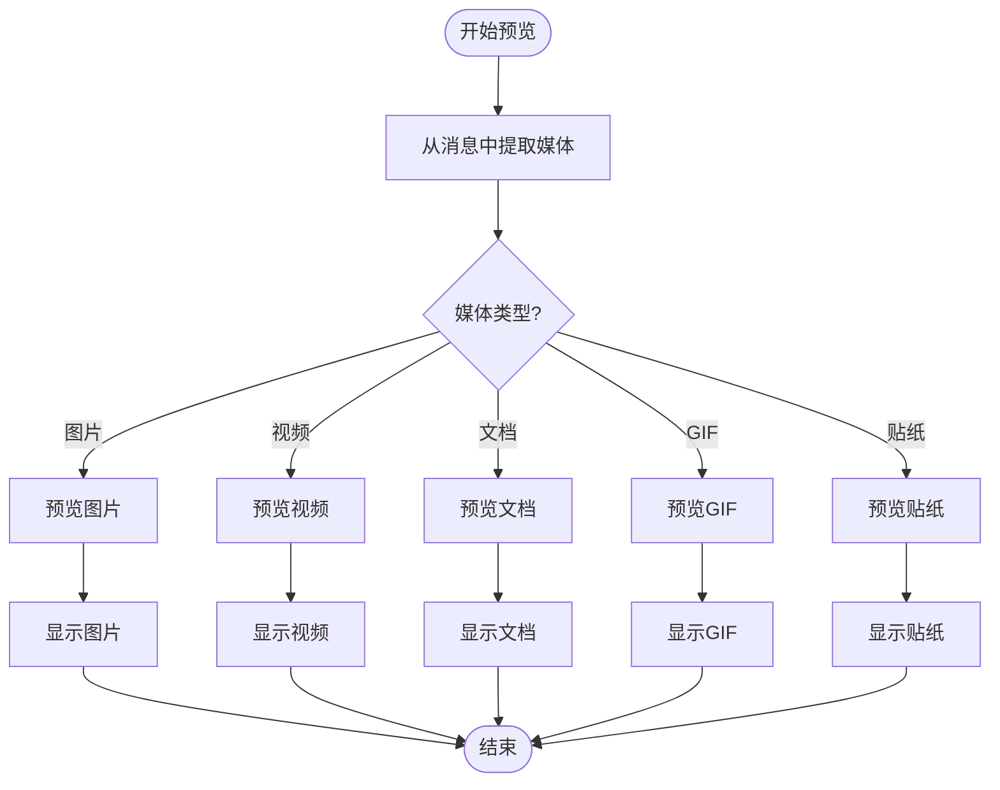
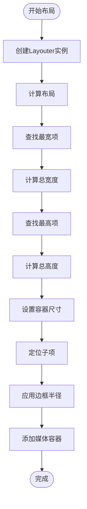
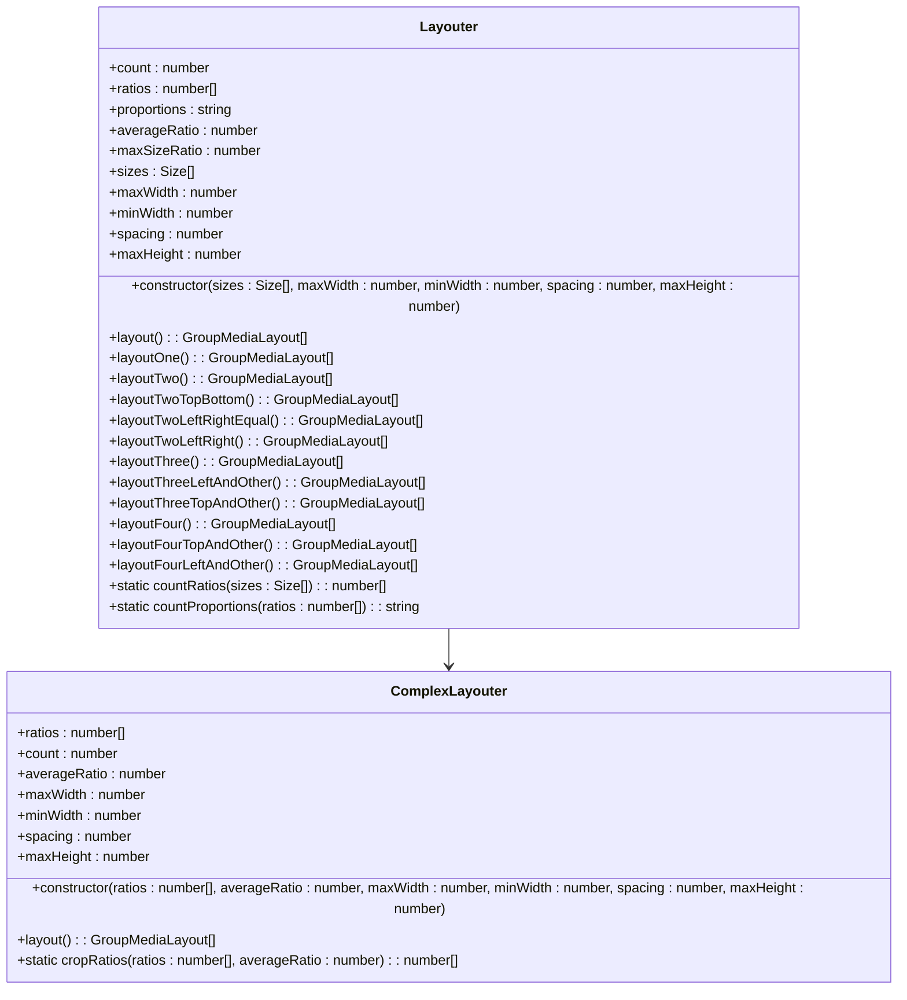
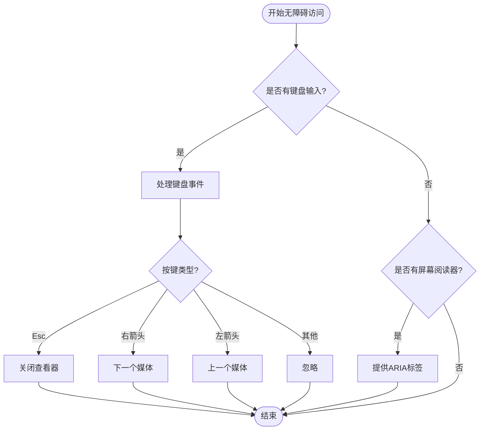
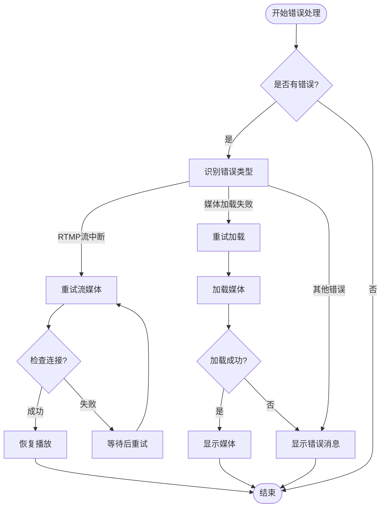

# 媒体展示

<cite>
**本文档引用的文件**   
- [appMediaViewer.ts](file://src/components/appMediaViewer.ts)
- [appMediaViewerBase.ts](file://src/components/appMediaViewerBase.ts)
- [appMediaViewerRtmp.ts](file://src/components/appMediaViewerRtmp.ts)
- [stickerViewer.ts](file://src/components/stickerViewer.ts)
- [gifsMasonry.ts](file://src/components/gifsMasonry.ts)
- [lottieAnimation.tsx](file://src/components/lottieAnimation.tsx)
- [mediaProgressLine.ts](file://src/components/mediaProgressLine.ts)
- [prepareAlbum.ts](file://src/components/prepareAlbum.ts)
- [groupedLayout.ts](file://src/components/groupedLayout.ts)
- [lottieLoader.ts](file://src/lib/rlottie/lottieLoader.ts)
- [rlottiePlayer.ts](file://src/lib/rlottie/rlottiePlayer.ts)
</cite>

## 目录
1. [简介](#简介)
2. [媒体查看器架构](#媒体查看器架构)
3. [缩放与导航](#缩放与导航)
4. [全屏模式](#全屏模式)
5. [RTMP流媒体支持](#rtmp流媒体支持)
6. [贴纸查看器](#贴纸查看器)
7. [GIF瀑布流](#gif瀑布流)
8. [Lottie动画](#lottie动画)
9. [媒体预览机制](#媒体预览机制)
10. [媒体进度条](#媒体进度条)
11. [专辑预览](#专辑预览)
12. [分组布局](#分组布局)
13. [无障碍访问](#无障碍访问)
14. [错误恢复与兼容性](#错误恢复与兼容性)

## 简介

本文档全面介绍了Web Telegram客户端中的媒体展示功能。系统涵盖了媒体查看器（appMediaViewer）的架构和实现，包括缩放、导航、全屏模式和RTMP流媒体支持。文档详细说明了贴纸查看器（stickerViewer）的动画播放和交互逻辑，描述了GIF瀑布流（gifsMasonry）的布局算法和懒加载机制，讲解了Lottie动画（lottieAnimation）的渲染流程和性能优化技巧。此外，文档还说明了不同类型媒体（视频、图片、文档）的预览和播放机制，涵盖了媒体进度条（mediaProgressLine）、专辑预览（prepareAlbum）和分组布局（groupedLayout）的实现。最后，文档提供了无障碍访问指南，包括键盘导航和屏幕阅读器支持，并记录了错误恢复策略和兼容性处理方案。

## 媒体查看器架构

媒体查看器系统采用分层架构设计，核心组件包括`AppMediaViewer`、`AppMediaViewerBase`和`AppMediaViewerRtmp`。`AppMediaViewerBase`作为基类，提供了媒体查看器的核心功能，包括缩放、导航、全屏模式等。`AppMediaViewer`继承自`AppMediaViewerBase`，实现了具体的媒体查看功能，支持图片、视频和文档的查看。`AppMediaViewerRtmp`专门用于处理RTMP流媒体，提供了直播流的播放和管理功能。

```mermaid
classDiagram
class AppMediaViewerBase {
+wholeDiv : HTMLElement
+overlaysDiv : HTMLElement
+author : AuthorInfo
+content : ContentElements
+buttons : ButtonElements
+topbar : HTMLElement
+moversContainer : HTMLElement
+setMoverPromise : Promise~void~
+setMoverAnimationPromise : Promise~void~
+lazyLoadQueue : LazyLoadQueueBase
+videoPlayer : VideoPlayer
+zoomElements : ZoomElements
+transform : Transform
+isZooming : boolean
+isGesturingNow : boolean
+isZoomingNow : boolean
+draggingType : 'wheel' | 'touchmove' | 'mousemove'
+initialContentRect : DOMRect
+live : boolean
+ctrlKeyDown : boolean
+releaseSingleMedia : Function
+navigationItem : NavigationItem
+managers : AppManagers
+swipeHandler : SwipeHandler
+closing : boolean
+lastTransform : Transform
+lastZoomCenter : {x : number, y : number}
+lastDragOffset : {x : number, y : number}
+lastDragDelta : {x : number, y : number}
+lastGestureTime : number
+clampZoomDebounced : DebouncedFunction
+ignoreNextClick : boolean
+middlewareHelper : MiddlewareHelper
+overlayActive : boolean
+videoTimestamps : VideoTimestamp[]
+target : TargetType
+setTarget(value : TargetType) : void
+constructor(listLoader : ListLoader, topButtons : Array<keyof AppMediaViewerBase>, extraHeightPadding : number)
+setListeners() : void
+onSwipeFirst(e? : MouseEvent | TouchEvent | WheelEvent) : void
+onSwipeReset(e? : Event) : void
+onZoom(details : ZoomDetails) : void
+changeZoomByPosition(x : number, y : number, scale : number) : void
+setTransform(transform : Transform) : void
+calculateScaleOffset(options : {x : number, y : number, scale : number}) : {scaleOffsetX : number, scaleOffsetY : number}
+toggleZoom(enable? : boolean) : void
+addZoomStep(add : boolean) : void
+resetZoom() : void
+changeZoom(value : number) : void
+addZoom(value : number) : void
+getZoomBounce() : number
+calculateOffsetBoundaries(transform : Transform, offsetTop : number) : [Transform, boolean, boolean]
+getZoomBoundaries(scale : number, offsetTop : number) : {minX : number, maxX : number, minY : number, maxY : number}
+setZoomValue(value : number) : void
+setBtnMenuToggle(buttons : ButtonMenuItemOptions[]) : void
+close(e? : MouseEvent) : Promise~void~
+removeGlobalListeners() : void
+setNewMover() : HTMLElement
+setMoverToTarget(target : HTMLElement, closing : boolean, fromRight : number) : Promise~{onAnimationEnd : Promise~void~}~
+_openMedia(options : OpenMediaOptions) : Promise~void~
+openMedia(options : OpenMediaOptions) : Promise~void~
+setAuthorInfo(fromId : number, timestamp : number) : void
+setMedia(media : MyPhoto | MyDocument, timestamp : number, fromId : PeerId, message : MyMessage, index? : number) : void
+setCaption(message : MyMessage) : void
+removeTimestamps() : void
+saveTimestamps(messageContent : HTMLElement, loadPromises : Promise~any~[]) : Promise~void~
+extractTimestampText(element : Element) : string
+setSearchContext(context : MediaSearchContext) : AppMediaViewer
+openMedia(options : OpenMediaOptions) : Promise~void~
+static isMediaCompatibleForDocumentViewer(media : MyPhoto | MyDocument) : boolean
}
class AppMediaViewer {
+listLoader : SearchListLoader~AppMediaViewerTargetType~
+btnMenuForward : ButtonMenuItemOptionsVerifiable
+btnMenuDownload : ButtonMenuItemOptionsVerifiable
+btnMenuDelete : ButtonMenuItemOptionsVerifiable
+searchContext : MediaSearchContext
+local : boolean
+sponsored : boolean
+constructor(local? : boolean, sponsored? : boolean)
+setListeners() : void
+onPrevClick(target : AppMediaViewerTargetType) : Promise~void~
+onNextClick(target : AppMediaViewerTargetType) : Promise~void~
+onDeleteClick() : void
+onForwardClick() : void
+onAuthorClick(e : MouseEvent) : Promise~void~
+onDownloadClick(_ : any, docId? : DocId) : Promise~void~
+setCaption(message : MyMessage) : void
+removeTimestamps() : void
+saveTimestamps(messageContent : HTMLElement, loadPromises : Promise~any~[]) : Promise~void~
+extractTimestampText(element : Element) : string
+setSearchContext(context : MediaSearchContext) : AppMediaViewer
+openMedia(options : OpenMediaOptions) : Promise~void~
+static isMediaCompatibleForDocumentViewer(media : MyPhoto | MyDocument) : boolean
}
class AppMediaViewerRtmp {
+peerId : PeerId
+listenerSetter : ListenerSetter
+retryTimeout : number
+retryTempId : number
+rejoinInterval : number
+preloaderRtmp : ProgressivePreloader
+preloaderTemplate : HTMLElement
+shareUrl : string
+adminPanel : HTMLDivElement
+disposeSolid : () => void
+constructor(shareUrl : string)
+setListeners() : void
+onForward() : Promise~void~
+openMedia(params : {peerId : PeerId, isAdmin : boolean}) : Promise~void~
+rejoin() : void
+toggleAdminPanel(visible : boolean) : void
+showLoader() : void
+retryLoadStream(video : HTMLVideoElement, reason : string) : void
+leaveCall(discard : boolean) : Promise~void~
+close(e? : MouseEvent, end? : boolean) : Promise~void~
+static closeActivePip(end? : boolean) : void
+static getShareUrl(chatId : ChatId) : Promise~string~
}
AppMediaViewerBase <|-- AppMediaViewer
AppMediaViewerBase <|-- AppMediaViewerRtmp
```

**Diagram sources**
- [appMediaViewerBase.ts](file://src/components/appMediaViewerBase.ts)
- [appMediaViewer.ts](file://src/components/appMediaViewer.ts)
- [appMediaViewerRtmp.ts](file://src/components/appMediaViewerRtmp.ts)

**Section sources**
- [appMediaViewerBase.ts](file://src/components/appMediaViewerBase.ts#L1-L2224)
- [appMediaViewer.ts](file://src/components/appMediaViewer.ts#L1-L448)
- [appMediaViewerRtmp.ts](file://src/components/appMediaViewerRtmp.ts#L1-L456)

## 缩放与导航

媒体查看器提供了强大的缩放和导航功能，支持鼠标滚轮、触摸手势和键盘操作。缩放功能通过`AppMediaViewerBase`类中的`zoomElements`对象实现，包含缩放按钮和范围选择器。用户可以通过点击缩放按钮或拖动范围选择器来调整缩放级别。



**Diagram sources**
- [appMediaViewerBase.ts](file://src/components/appMediaViewerBase.ts#L154-L159)

**Section sources**
- [appMediaViewerBase.ts](file://src/components/appMediaViewerBase.ts#L649-L744)

## 全屏模式

媒体查看器支持全屏模式，用户可以通过点击全屏按钮或使用快捷键F11进入全屏模式。全屏模式下，媒体查看器会占据整个屏幕，提供沉浸式的观看体验。



**Diagram sources**
- [appMediaViewerBase.ts](file://src/components/appMediaViewerBase.ts#L43-L44)

**Section sources**
- [appMediaViewerBase.ts](file://src/components/appMediaViewerBase.ts#L751-L799)

## RTMP流媒体支持

RTMP流媒体支持由`AppMediaViewerRtmp`类实现，专门用于处理直播流的播放和管理。该类继承自`AppMediaViewerBase`，并添加了RTMP特定的功能，如流媒体URL处理、重连机制和管理员面板。

```mermaid
classDiagram
class AppMediaViewerRtmp {
+peerId : PeerId
+listenerSetter : ListenerSetter
+retryTimeout : number
+retryTempId : number
+rejoinInterval : number
+preloaderRtmp : ProgressivePreloader
+preloaderTemplate : HTMLElement
+shareUrl : string
+adminPanel : HTMLDivElement
+disposeSolid : () => void
+constructor(shareUrl : string)
+setListeners() : void
+onForward() : Promise~void~
+openMedia(params : {peerId : PeerId, isAdmin : boolean}) : Promise~void~
+rejoin() : void
+toggleAdminPanel(visible : boolean) : void
+showLoader() : void
+retryLoadStream(video : HTMLVideoElement, reason : string) : void
+leaveCall(discard : boolean) : Promise~void~
+close(e? : MouseEvent, end? : boolean) : Promise~void~
+static closeActivePip(end? : boolean) : void
+static getShareUrl(chatId : ChatId) : Promise~string~
}
class RTMP_STATE {
+IDLE : string
+CONNECTING : string
+PLAYING : string
+BUFFERING : string
+ENDED : string
}
class rtmpCallsController {
+currentCall : RTMPCall
+joinCall(chatId : ChatId) : Promise~void~
+leaveCall(discard : boolean) : Promise~void~
+rejoinCall() : Promise~void~
+isCurrentCallDead(checkJoined : boolean) : Promise~'dead' | 'dying' | 'alive'~
}
AppMediaViewerRtmp --> RTMP_STATE
AppMediaViewerRtmp --> rtmpCallsController
```

**Diagram sources**
- [appMediaViewerRtmp.ts](file://src/components/appMediaViewerRtmp.ts)
- [rtmpState.ts](file://src/lib/calls/rtmpState.ts)
- [rtmpCallsController.ts](file://src/lib/calls/rtmpCallsController.ts)

**Section sources**
- [appMediaViewerRtmp.ts](file://src/components/appMediaViewerRtmp.ts#L1-L456)

## 贴纸查看器

贴纸查看器（stickerViewer）实现了鼠标悬停时的贴纸预览功能。当用户将鼠标悬停在贴纸或GIF上时，查看器会显示一个放大的预览，包括动画效果和相关元数据。



**Diagram sources**
- [stickerViewer.ts](file://src/components/stickerViewer.ts)

**Section sources**
- [stickerViewer.ts](file://src/components/stickerViewer.ts#L1-L393)

## GIF瀑布流

GIF瀑布流（gifsMasonry）实现了GIF的网格布局和懒加载机制。该组件使用`LazyLoadQueueRepeat2`来管理GIF的加载，确保只有可见的GIF才会被加载和播放。

```mermaid
classDiagram
class GifsMasonry {
+lazyLoadQueue : LazyLoadQueueRepeat2
+scrollPromise : CancellablePromise~void~
+timeout : number
+managers : AppManagers
+middlewareHelper : MiddlewareHelper
+map : Map~DocId, HTMLElement~
+element : HTMLElement
+group : AnimationItemGroup
+scrollable : Scrollable
+constructor(element : HTMLElement, group : AnimationItemGroup, scrollable : Scrollable, attach : boolean)
+onScroll() : void
+attach() : void
+detach() : void
+clear() : void
+processVisibleDiv(div : HTMLElement) : void
+processInvisibleDiv(div : HTMLElement) : Promise~void~
+addBatch(docs : MyDocument[]) : void
+update(docs : MyDocument[]) : void
+add(doc : MyDocument, appendTo : HTMLElement) : void
+delete(docId : DocId) : void
}
class LazyLoadQueueRepeat2 {
+intersector : IntersectionObserver
+queue : {div : HTMLElement, load : Function}[]
+observe(item : {div : HTMLElement, load : Function}) : void
+unobserve(div : HTMLElement) : void
+clear() : void
}
GifsMasonry --> LazyLoadQueueRepeat2
```

**Diagram sources**
- [gifsMasonry.ts](file://src/components/gifsMasonry.ts)
- [lazyLoadQueueRepeat2.ts](file://src/components/lazyLoadQueueRepeat2.ts)

**Section sources**
- [gifsMasonry.ts](file://src/components/gifsMasonry.ts#L1-L211)

## Lottie动画

Lottie动画（lottieAnimation）组件负责加载和播放Lottie动画文件。该组件使用`lottieLoader`来管理动画的加载和缓存，确保动画的高效播放。

```mermaid
classDiagram
class LottieAnimation {
+lottieLoader : LottieLoader
+class : string
+name : LottieAssetName
+size : number
+needRaf : boolean
+restartOnClick : boolean
+rlottieOptions : Partial~RLottieOptions~
+onPromise : (promise : Promise~RLottiePlayer~) => void
+div : HTMLDivElement
+animationPromise : Promise~RLottiePlayer~
+cleanup : boolean
+loadAnimation() : void
+createRenderEffect(loadAnimation) : void
+onCleanup() : void
}
class LottieLoader {
+loadPromise : Promise~void~
+loaded : boolean
+workersLimit : number
+players : {[reqId : number] : RLottiePlayer}
+playersByCacheName : {[cacheName : string] : Set~RLottiePlayer~}
+workers : QueryableWorker[]
+curWorkerNum : number
+log : Logger
+constructor()
+getAnimation(element : HTMLElement) : RLottiePlayer
+loadLottieWorkers() : Promise~void~
+makeAssetUrl(name : LottieAssetName) : string
+loadAnimationAsAsset(params : Omit~RLottieOptions, 'animationData' | 'name'~, name : LottieAssetName) : Promise~RLottiePlayer~
+loadAnimationDataFromURL(url : string, method : 'json' | 'blob') : Promise~Blob | any~
+loadAnimationFromURLManually(name : LottieAssetName) : Promise~(params : Omit~RLottieOptions, 'animationData'~) => Promise~RLottiePlayer~~
+loadAnimationFromURL(params : Omit~RLottieOptions, 'animationData'~, url : string) : Promise~RLottiePlayer~
+loadAnimationFromURLNext(blob : Blob, params : Omit~RLottieOptions, 'animationData'~, url : string) : Promise~RLottiePlayer~
+waitForFirstFrame(player : RLottiePlayer) : Promise~RLottiePlayer~
+loadAnimationWorker(params : RLottieOptions) : Promise~RLottiePlayer~
+onPlayerLoaded(reqId : number, frameCount : number, fps : number) : void
+onFrame(reqId : number, frameNo : number, frame : Uint8ClampedArray | ImageBitmap) : void
+onPlayerError(reqId : number, error : Error) : void
+onDestroy(reqId : number) : void
+destroyWorkers() : void
+initPlayer(el : RLottiePlayer['el'], options : RLottieOptions) : RLottiePlayer
}
class RLottiePlayer {
+reqId : number
+curFrame : number
+frameCount : number
+fps : number
+skipDelta : number
+name : string
+cacheName : string
+toneIndex : number
+worker : QueryableWorker
+width : number
+height : number
+el : HTMLElement[]
+canvas : HTMLCanvasElement[]
+contexts : CanvasRenderingContext2D[]
+paused : boolean
+direction : number
+speed : number
+autoplay : boolean
+_autoplay : boolean
+loop : number | boolean
+_loop : RLottiePlayer['loop']
+group : AnimationItemGroup
+liteModeKey : LiteModeKey
+frInterval : number
+frThen : number
+rafId : number
+cache : FramesCacheItem
+imageData : ImageData
+clamped : Uint8ClampedArray
+cachingDelta : number
+initFrame : number
+color : RLottieOptions['color']
+textColor : RLottieOptions['textColor']
+minFrame : number
+maxFrame : number
+playedTimes : number
+currentMethod : RLottiePlayer['mainLoopForwards'] | RLottiePlayer['mainLoopBackwards']
+frameListener : (currentFrame : number) => void
+skipFirstFrameRendering : boolean
+playToFrameOnFrameCallback : (frameNo : number) => void
+overrideRender : (frame : ImageData | HTMLCanvasElement | ImageBitmap) => void
+renderedFirstFrame : boolean
+raw : boolean
+constructor(options : {el : RLottiePlayer['el'], worker : QueryableWorker, options : RLottieOptions})
+setSize(width : number, height : number) : void
+clearCache() : void
+sendQuery(args : any[], transfer? : Transferable[]) : void
+loadFromData(data : RLottieOptions['animationData']) : void
+play() : void
+pause(clearPendingRAF : boolean) : void
+resetCurrentFrame() : number
+stop(renderFirstFrame : boolean) : void
+restart() : void
+playOrRestart() : void
+setSpeed(speed : number) : void
+setDirection(direction : number) : void
+remove() : void
+applyColor(context : CanvasRenderingContext2D) : void
+applyColorForAllContexts() : void
+renderFrame2(frame : Uint8ClampedArray | HTMLCanvasElement | ImageBitmap, frameNo : number) : void
+renderFrame(frame : Parameters~RLottiePlayer['renderFrame2']~[0], frameNo : number) : void
+requestFrame(frameNo : number) : void
+onLap() : boolean
+mainLoopForwards() : boolean
+mainLoopBackwards() : boolean
+setMainLoop() : void
+playPart(options : {from : number, to : number, callback? : () => void}) : void
+playToFrame(options : {frame : number, speed? : number, direction? : number, callback? : () => void}) : void
+setColor(color : RLottieColor | string, renderIfPaused : boolean) : void
+setMinMax(minFrame : number, maxFrame : number) : void
+onLoad(frameCount : number, fps : number) : Promise~void~
}
LottieAnimation --> LottieLoader
LottieLoader --> RLottiePlayer
```

**Diagram sources**
- [lottieAnimation.tsx](file://src/components/lottieAnimation.tsx)
- [lottieLoader.ts](file://src/lib/rlottie/lottieLoader.ts)
- [rlottiePlayer.ts](file://src/lib/rlottie/rlottiePlayer.ts)

**Section sources**
- [lottieAnimation.tsx](file://src/components/lottieAnimation.tsx#L1-L72)
- [lottieLoader.ts](file://src/lib/rlottie/lottieLoader.ts#L1-L343)
- [rlottiePlayer.ts](file://src/lib/rlottie/rlottiePlayer.ts#L1-L730)

## 媒体预览机制

媒体预览机制涵盖了不同类型媒体（视频、图片、文档）的预览和播放。系统通过`getMediaFromMessage`函数从消息中提取媒体信息，并根据媒体类型调用相应的预览组件。



**Diagram sources**
- [appMediaViewer.ts](file://src/components/appMediaViewer.ts#L85-L93)

**Section sources**
- [appMediaViewer.ts](file://src/components/appMediaViewer.ts#L1-L448)

## 媒体进度条

媒体进度条（mediaProgressLine）组件提供了视频播放进度的可视化表示。该组件支持时间戳跳转、加载进度显示和鼠标悬停提示。

```mermaid
classDiagram
class MediaProgressLine {
+filledContainer : HTMLDivElement
+filledLoad : HTMLDivElement
+currentTimeInfoElement : HTMLDivElement
+currentTimeElement : HTMLDivElement
+currentSegmentElement : HTMLDivElement
+progressRAF : number
+media : HTMLMediaElement
+streamable : boolean
+static svgClipPathIdSeed : number
+usedClipPathId : number
+clipPathSvg : SVGSVGElement
+segments : VideoTimestampSegment[]
+options : {withTransition? : boolean, useTransform? : boolean, onSeekStart? : () => void, onSeekEnd? : () => void, onTimeUpdate? : (time : number) => void, videoTimestamps? : VideoTimestamp[]}
+constructor(options : {withTransition? : boolean, useTransform? : boolean, onSeekStart? : () => void, onSeekEnd? : () => void, onTimeUpdate? : (time : number) => void, videoTimestamps? : VideoTimestamp[]})
+setMedia(options : {media : HTMLMediaElement, streamable? : boolean, duration? : number}) : void
+unobserveResize : () => void
+initResizeObserver() : void
+activeSegmentIdx : number | null
+hoverRAF : number
+onHover(e : MouseEvent) : void
+onPointerOut() : void
+toggleSegment(idx : number, active : boolean) : void
+wrapProgressLinesInContainer() : void
+clearTimeAndSegment() : void
+updateTimeAndSegment(x : number, width : number) : void
+setTimestampsClipPath() : void
+getTimestampSegments(totalWidth : number) : VideoTimestampSegment[]
+removeClipPathFromDOM() : void
+onLoadedData() : void
+onEnded() : void
+onPlay() : void
+onTimeUpdate() : void
+onProgress(e : Event) : void
+scrub(e : GrabEvent) : number
+snapScrubValue(value : number) : number
+setLoadProgress() : void
+setSeekMax(duration? : number) : void
+setProgress() : void
+setListeners() : void
+removeListeners() : void
+cleanup() : void
}
class RangeSelector {
+container : HTMLDivElement
+seek : HTMLInputElement
+filled : HTMLDivElement
+step : number
+min : number
+max : number
+withTransition : boolean
+useTransform : boolean
+onSeekStart : () => void
+onSeekEnd : () => void
+onTimeUpdate : (time : number) => void
+videoTimestamps : VideoTimestamp[]
+constructor(options : {step : number, min : number, max : number, withTransition? : boolean, useTransform? : boolean}, initialValue : number)
+setSeekMax(duration? : number) : void
+setListeners() : void
+setHandlers(handlers : {onMouseDown : () => void, onMouseUp : (e : GrabEvent) => void}) : void
+setProgress(value : number) : void
+removeListeners() : void
}
MediaProgressLine --> RangeSelector
```

**Diagram sources**
- [mediaProgressLine.ts](file://src/components/mediaProgressLine.ts)
- [rangeSelector.ts](file://src/components/rangeSelector.ts)

**Section sources**
- [mediaProgressLine.ts](file://src/components/mediaProgressLine.ts#L1-L457)

## 专辑预览

专辑预览（prepareAlbum）功能通过`prepareAlbum`函数实现，该函数根据媒体项的尺寸和容器大小计算布局。布局算法考虑了最大宽度、最小宽度、间距和最大高度等参数。



**Diagram sources**
- [prepareAlbum.ts](file://src/components/prepareAlbum.ts)

**Section sources**
- [prepareAlbum.ts](file://src/components/prepareAlbum.ts#L1-L89)

## 分组布局

分组布局（groupedLayout）系统实现了复杂的媒体分组布局算法。该系统根据媒体项的数量和比例选择不同的布局策略，包括单个、两个、三个和四个项目的布局。



**Diagram sources**
- [groupedLayout.ts](file://src/components/groupedLayout.ts)

**Section sources**
- [groupedLayout.ts](file://src/components/groupedLayout.ts#L1-L450)

## 无障碍访问

媒体查看器系统提供了完善的无障碍访问支持，包括键盘导航和屏幕阅读器兼容性。用户可以通过键盘快捷键（如箭头键、Esc键）进行导航和操作。



**Diagram sources**
- [appMediaViewerBase.ts](file://src/components/appMediaViewerBase.ts#L330-L340)

**Section sources**
- [appMediaViewerBase.ts](file://src/components/appMediaViewerBase.ts#L751-L799)

## 错误恢复与兼容性

系统实现了完善的错误恢复策略和兼容性处理方案，确保在各种设备和浏览器环境下都能正常工作。错误恢复机制包括RTMP流媒体的自动重连、媒体加载失败的重试等。



**Diagram sources**
- [appMediaViewerRtmp.ts](file://src/components/appMediaViewerRtmp.ts#L321-L397)

**Section sources**
- [appMediaViewerRtmp.ts](file://src/components/appMediaViewerRtmp.ts#L1-L456)