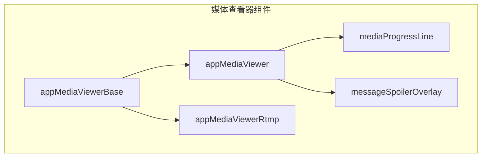
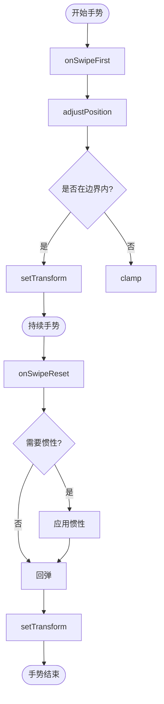
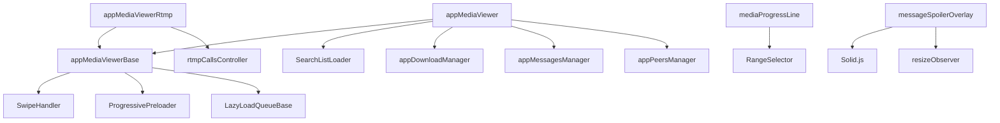

# 媒体查看器

<cite>
**本文档引用的文件**   
- [appMediaViewerBase.ts](file://src/components/appMediaViewerBase.ts)
- [appMediaViewer.ts](file://src/components/appMediaViewer.ts)
- [appMediaViewerNew.ts](file://src/components/appMediaViewerNew.ts)
- [appMediaViewerRtmp.ts](file://src/components/appMediaViewerRtmp.ts)
- [mediaProgressLine.ts](file://src/components/mediaProgressLine.ts)
- [messageSpoilerOverlay/index.tsx](file://src/components/messageSpoilerOverlay/index.tsx)
</cite>

## 目录
1. [简介](#简介)
2. [项目结构](#项目结构)
3. [核心组件](#核心组件)
4. [架构概述](#架构概述)
5. [详细组件分析](#详细组件分析)
6. [依赖分析](#依赖分析)
7. [性能考虑](#性能考虑)
8. [故障排除指南](#故障排除指南)
9. [结论](#结论)

## 简介
媒体查看器是用于在Web应用中查看和管理媒体内容的核心组件。它提供了一个功能丰富的界面，支持图片、视频、文档等多种媒体类型的查看，并集成了缩放、平移、旋转等交互功能。查看器基于继承架构设计，以`appMediaViewerBase`作为基类，`appMediaViewer`和`appMediaViewerNew`作为具体实现，而`appMediaViewerRtmp`则专门用于处理RTMP流媒体。查看器还支持媒体进度条、媒体遮罩等高级功能，为用户提供流畅的媒体浏览体验。

## 项目结构
媒体查看器相关的代码文件位于`src/components/`目录下，主要包含以下几个核心文件：
- `appMediaViewerBase.ts`: 媒体查看器的基类，定义了通用的架构、生命周期管理和交互逻辑。
- `appMediaViewer.ts`: 继承自`appMediaViewerBase`，实现了针对聊天消息中媒体内容的查看功能。
- `appMediaViewerNew.ts`: 一个被注释掉的旧版本媒体查看器实现，包含了一些实验性的功能。
- `appMediaViewerRtmp.ts`: 专门用于处理RTMP实时流媒体播放的查看器。
- `mediaProgressLine.ts`: 媒体进度条组件，用于显示和控制媒体播放进度。
- `messageSpoilerOverlay/index.tsx`: 媒体遮罩（Spoiler）的视觉效果实现。



**Diagram sources**
- [appMediaViewerBase.ts](file://src/components/appMediaViewerBase.ts)
- [appMediaViewer.ts](file://src/components/appMediaViewer.ts)
- [appMediaViewerRtmp.ts](file://src/components/appMediaViewerRtmp.ts)
- [mediaProgressLine.ts](file://src/components/mediaProgressLine.ts)
- [messageSpoilerOverlay/index.tsx](file://src/components/messageSpoilerOverlay/index.tsx)

**Section sources**
- [appMediaViewerBase.ts](file://src/components/appMediaViewerBase.ts)
- [appMediaViewer.ts](file://src/components/appMediaViewer.ts)
- [appMediaViewerNew.ts](file://src/components/appMediaViewerNew.ts)
- [appMediaViewerRtmp.ts](file://src/components/appMediaViewerRtmp.ts)
- [mediaProgressLine.ts](file://src/components/mediaProgressLine.ts)
- [messageSpoilerOverlay/index.tsx](file://src/components/messageSpoilerOverlay/index.tsx)

## 核心组件

媒体查看器的核心由基类`appMediaViewerBase`和其具体实现`appMediaViewer`、`appMediaViewerRtmp`构成。`appMediaViewerBase`提供了查看器的骨架，包括UI元素的创建、事件监听、缩放平移逻辑和生命周期管理。`appMediaViewer`在此基础上，针对聊天消息的媒体内容，实现了加载、导航和用户交互功能。`appMediaViewerRtmp`则专注于实时流媒体的播放，处理连接、重连和缓冲等复杂状态。

**Section sources**
- [appMediaViewerBase.ts](file://src/components/appMediaViewerBase.ts#L1-L2224)
- [appMediaViewer.ts](file://src/components/appMediaViewer.ts#L1-L448)
- [appMediaViewerRtmp.ts](file://src/components/appMediaViewerRtmp.ts#L1-L456)

## 架构概述

媒体查看器采用面向对象的继承架构。`appMediaViewerBase`作为抽象基类，封装了所有查看器共有的功能，如UI布局、手势处理（通过`SwipeHandler`）、缩放逻辑和动画过渡。具体的查看器类（如`appMediaViewer`）继承此基类，并根据特定需求（如消息媒体、RTMP流）实现或重写特定方法。这种设计实现了代码复用和功能扩展。

```mermaid
classDiagram
class AppMediaViewerBase {
+wholeDiv : HTMLElement
+overlaysDiv : HTMLElement
+content : {[k in 'main' | 'container' | 'media' | 'mover'] : HTMLElement}
+buttons : {[k in 'download' | 'close' | 'prev' | 'next'] : HTMLElement}
+setMoverToTarget(target : HTMLElement, closing : boolean, fromRight : number)
+setListeners()
+onSwipeFirst()
+onSwipeReset()
+onZoom()
+setTransform(transform : Transform)
+close()
}
class AppMediaViewer {
+listLoader : SearchListLoader
+openMedia(params : OpenMediaParams)
+onPrevClick(target : TargetType)
+onNextClick(target : TargetType)
+onDownloadClick(e : any, docId? : DocId)
}
class AppMediaViewerRtmp {
+openMedia(params : {peerId : PeerId, isAdmin : boolean})
+retryLoadStream(video : HTMLVideoElement, reason : string)
+close(e? : MouseEvent, end? : boolean)
}
AppMediaViewerBase <|-- AppMediaViewer
AppMediaViewerBase <|-- AppMediaViewerRtmp
```

**Diagram sources**
- [appMediaViewerBase.ts](file://src/components/appMediaViewerBase.ts#L99-L1599)
- [appMediaViewer.ts](file://src/components/appMediaViewer.ts#L70-L447)
- [appMediaViewerRtmp.ts](file://src/components/appMediaViewerRtmp.ts#L31-L455)

## 详细组件分析

### appMediaViewerBase 分析
`appMediaViewerBase`是整个媒体查看器系统的基石。它负责创建和管理查看器的DOM结构，包括主容器、内容区域、顶部工具栏、导航按钮和预加载器。其核心功能是处理用户交互，特别是缩放和平移。

#### 缩放与平移实现
查看器的缩放和平移功能通过`SwipeHandler`和`onZoom`、`onSwipeFirst`、`onSwipeReset`等方法实现。当用户进行双指缩放或双击时，`onZoom`方法会被调用，它根据缩放因子计算新的缩放比例和位置偏移，确保缩放中心点保持不变。`calculateScaleOffset`方法用于计算为了保持缩放中心点不变所需的偏移量。平移操作则通过`onSwipeFirst`和`onSwipeReset`处理，`onSwipeFirst`记录起始位置，`onSwipeReset`在手势结束时应用惯性效果，并通过`calculateOffsetBoundaries`方法将内容限制在可视区域内。



**Diagram sources**
- [appMediaViewerBase.ts](file://src/components/appMediaViewerBase.ts#L416-L604)
- [appMediaViewerBase.ts](file://src/components/appMediaViewerBase.ts#L690-L708)
- [appMediaViewerBase.ts](file://src/components/appMediaViewerBase.ts#L508-L549)

#### 生命周期管理
查看器的生命周期由`openMedia`和`close`方法管理。`openMedia`方法负责加载指定的媒体内容，设置作者信息，并触发动画过渡。`close`方法则负责清理资源，包括移除事件监听器、清除预加载器、重置状态，并执行关闭动画。`setMoverToTarget`方法是动画的核心，它通过创建一个“移动器”（mover）元素来模拟从缩略图到全屏查看的动画效果。

**Section sources**
- [appMediaViewerBase.ts](file://src/components/appMediaViewerBase.ts#L928-L1367)
- [appMediaViewerBase.ts](file://src/components/appMediaViewerBase.ts#L751-L798)

### appMediaViewer 分析
`appMediaViewer`是`appMediaViewerBase`的一个具体实现，专门用于查看聊天消息中的媒体。它使用`SearchListLoader`来管理媒体列表的加载和导航。

#### 与聊天组件的集成
该查看器通过`setSearchContext`方法接收一个`MediaSearchContext`，这个上下文包含了搜索媒体所需的所有信息，如对等方ID、消息过滤器等。`openMedia`方法利用这些信息从消息管理器中获取完整的媒体消息，并设置查看器的UI，包括作者头像、名称、日期和可选的媒体说明文字（caption）。`onPrevClick`和`onNextClick`方法处理前后导航，通过`listLoader`加载相邻的媒体。

#### 媒体类型渲染
查看器能够处理图片、视频和文档。对于图片和视频，它会直接加载并显示。对于文档，它会检查`isMediaCompatibleForDocumentViewer`来判断是否可以直接预览。`onDownloadClick`方法处理下载逻辑，支持不同质量的下载选项。

**Section sources**
- [appMediaViewer.ts](file://src/components/appMediaViewer.ts#L70-L447)

### appMediaViewerRtmp 分析
`appMediaViewerRtmp`专为RTMP实时流媒体设计。它不依赖`SearchListLoader`，因为流媒体是实时的，没有固定的列表。

#### RTMP流媒体支持
该查看器通过`rtmpCallsController`加入指定聊天的RTMP呼叫。`openMedia`方法是其核心，它负责连接到流媒体源。`setupPlayer`回调函数用于配置视频播放器，添加直播特有的菜单项，如选择输出设备、开始/停止录制和结束直播。`retryLoadStream`方法实现了强大的重连机制，当流媒体中断时，它会自动尝试重新连接，确保播放的连续性。

#### 实时播放机制
播放器通过`getRtmpStreamUrl`获取流媒体URL并设置到`<video>`元素。`showLoader`方法在缓冲时显示加载指示器。`onCanPlay`和`onBuffering`回调用于管理播放状态和UI更新。`leaveCall`方法在关闭查看器时优雅地离开RTMP呼叫。

**Section sources**
- [appMediaViewerRtmp.ts](file://src/components/appMediaViewerRtmp.ts#L31-L455)

### mediaProgressLine 分析
`mediaProgressLine`组件为视频播放器提供了一个可交互的进度条。

#### 同步更新策略
该组件通过监听`HTMLMediaElement`的`timeupdate`、`play`、`pause`等事件，实时更新进度条的填充宽度。`setProgress`方法根据媒体的`currentTime`和`duration`计算进度百分比。`setLoadProgress`方法则通过检查`buffered`属性来显示已缓冲的媒体范围。

#### 用户交互反馈
用户可以通过拖动进度条来跳转到视频的任意位置。`scrub`方法处理拖动事件，并调用`setCurrentTime`来设置媒体的播放时间。`snapScrubValue`方法实现了“吸附”功能，当用户拖动到某个时间戳附近时，进度条会自动吸附到该时间戳，方便用户快速定位到视频中的关键片段。

**Section sources**
- [mediaProgressLine.ts](file://src/components/mediaProgressLine.ts#L26-L456)

### messageSpoilerOverlay 分析
`messageSpoilerOverlay`组件实现了媒体遮罩（Spoiler）的视觉效果。

#### 视觉效果实现
该组件使用`Solid.js`和`<canvas>`元素来实现一个动态的“揭开”效果。当用户点击被遮罩的文字时，会从点击点为中心，以粒子扩散的形式逐渐显示被遮罩的内容。`drawImageFromSource`函数负责将原始内容绘制到离屏画布上，然后通过`globalCompositeOperation`（源叠加）和`destination-out`（目标外）操作，结合一个动态变化的圆形遮罩，实现揭开效果。

#### 性能优化方案
为了优化性能，该组件使用了`DotRenderer`进行动画渲染，并通过`observeResize`监听容器大小变化。`createMiddleware`用于管理组件的生命周期，确保在组件销毁时正确清理资源。`debounce`函数用于防抖，避免在快速调整窗口大小时频繁触发重绘。

**Section sources**
- [messageSpoilerOverlay/index.tsx](file://src/components/messageSpoilerOverlay/index.tsx#L1-L441)

## 依赖分析

媒体查看器系统依赖于多个核心模块和工具类。



**Diagram sources**
- [appMediaViewer.ts](file://src/components/appMediaViewer.ts#L25-L28)
- [appMediaViewerRtmp.ts](file://src/components/appMediaViewerRtmp.ts#L6-L7)
- [appMediaViewerBase.ts](file://src/components/appMediaViewerBase.ts#L25-L26)
- [mediaProgressLine.ts](file://src/components/mediaProgressLine.ts#L15)
- [messageSpoilerOverlay/index.tsx](file://src/components/messageSpoilerOverlay/index.tsx#L2-L3)

## 性能考虑

媒体查看器在设计时考虑了性能优化：
1.  **懒加载**: 使用`LazyLoadQueueBase`来延迟加载非当前查看的媒体，减少内存占用。
2.  **资源管理**: 在`close`方法中，会主动移除事件监听器、销毁中间件并清除定时器，防止内存泄漏。
3.  **动画优化**: 使用`requestAnimationFrame`进行动画渲染，并在适当的时候使用`doubleRaf`确保DOM更新完成。
4.  **防抖**: 对频繁触发的事件（如窗口大小调整、鼠标移动）使用`debounce`进行防抖处理。
5.  **Canvas优化**: 在`messageSpoilerOverlay`中，使用离屏Canvas进行复杂的绘制操作，然后一次性绘制到主Canvas上，减少重绘开销。

## 故障排除指南

- **媒体无法加载**: 检查网络连接，确认媒体URL是否正确。对于文档，检查其MIME类型是否受支持。
- **缩放/平移卡顿**: 可能是由于媒体文件过大。检查`appMediaViewerBase`中的`setFullAspect`和`setAttachmentSize`逻辑，确保缩略图尺寸合理。
- **RTMP流断开**: 查看`appMediaViewerRtmp`的`retryLoadStream`方法，确认重连逻辑是否正常工作。检查服务端日志是否有错误。
- **遮罩效果不显示**: 确保`messageSpoilerOverlay`的`update`方法被正确调用，且`spanRects`被正确计算。检查浏览器是否支持Canvas API。

**Section sources**
- [appMediaViewerBase.ts](file://src/components/appMediaViewerBase.ts#L751-L798)
- [appMediaViewerRtmp.ts](file://src/components/appMediaViewerRtmp.ts#L321-L397)

## 结论

媒体查看器是一个功能强大且架构清晰的组件。它通过基类`appMediaViewerBase`提供了通用的查看器功能，如动画、缩放和事件处理。`appMediaViewer`和`appMediaViewerRtmp`两个子类分别针对静态媒体和实时流媒体进行了专门的优化和功能扩展。系统还集成了`mediaProgressLine`和`messageSpoilerOverlay`等高级UI组件，极大地提升了用户体验。整体设计遵循了模块化和可扩展的原则，便于维护和功能迭代。