# 媒体组件

<cite>
**本文档中引用的文件**  
- [mediaEditor.tsx](file://src/components/mediaEditor/mediaEditor.tsx)
- [lottieAnimation.tsx](file://src/components/lottieAnimation.tsx)
- [gifsMasonry.ts](file://src/components/gifsMasonry.ts)
- [stickerViewer.ts](file://src/components/stickerViewer.ts)
- [appMediaViewer.ts](file://src/components/appMediaViewer.ts)
- [canvas/mainCanvas.ts](file://src/components/mediaEditor/canvas/mainCanvas.ts)
- [context.ts](file://src/components/mediaEditor/context.ts)
- [types.ts](file://src/components/mediaEditor/types.ts)
- [finalRender/createFinalResult.ts](file://src/components/mediaEditor/finalRender/createFinalResult.ts)
- [toolbar.tsx](file://src/components/mediaEditor/toolbar.tsx)
- [rlottiePlayer.ts](file://src/lib/rlottie/rlottiePlayer.ts)
- [lottieLoader.ts](file://src/lib/rlottie/lottieLoader.ts)
- [appMediaViewerBase.ts](file://src/components/appMediaViewerBase.ts)
</cite>

## 目录
1. [简介](#简介)
2. [项目结构](#项目结构)
3. [核心组件](#核心组件)
4. [架构概述](#架构概述)
5. [详细组件分析](#详细组件分析)
6. [依赖分析](#依赖分析)
7. [性能考虑](#性能考虑)
8. [故障排除指南](#故障排除指南)
9. [结论](#结论)

## 简介
本文档全面介绍了媒体处理和展示组件，涵盖媒体编辑器、媒体查看器、贴纸查看器、GIF展示、Lottie动画、视频、图片和文档预览等功能。详细说明了媒体编辑器的裁剪、旋转、涂鸦和贴纸添加功能，以及WebGL加速渲染的实现。解释了媒体查看器的缩放、导航和全屏模式。提供了Lottie动画的性能优化技巧和内存管理策略。描述了GIF瀑布流布局算法和懒加载机制。记录了不同媒体格式的兼容性处理和错误恢复策略。包含了无障碍访问指南，如媒体内容的替代文本和键盘控制。提供了样式定制选项，允许修改播放控件和预览界面。

## 项目结构
项目结构清晰地组织了媒体相关组件，主要位于`src/components`目录下。关键组件包括媒体编辑器、媒体查看器、贴纸查看器、GIF展示和Lottie动画等。这些组件通过模块化设计，实现了高内聚低耦合的架构。

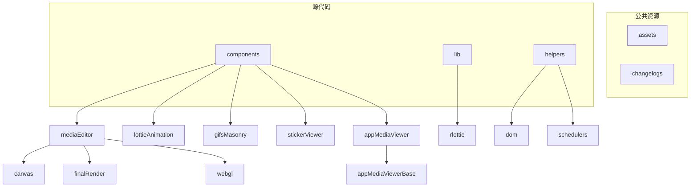

**图源**  
- [src/components/mediaEditor](file://src/components/mediaEditor)
- [src/components/lottieAnimation](file://src/components/lottieAnimation)
- [src/components/gifsMasonry](file://src/components/gifsMasonry)
- [src/components/stickerViewer](file://src/components/stickerViewer)
- [src/components/appMediaViewer](file://src/components/appMediaViewer)

**章节源**  
- [src/components](file://src/components)

## 核心组件
本节深入分析媒体处理和展示的核心组件，包括媒体编辑器、媒体查看器、贴纸查看器、GIF展示和Lottie动画等。这些组件共同构成了完整的媒体处理生态系统。

**章节源**  
- [mediaEditor.tsx](file://src/components/mediaEditor/mediaEditor.tsx)
- [lottieAnimation.tsx](file://src/components/lottieAnimation.tsx)
- [gifsMasonry.ts](file://src/components/gifsMasonry.ts)
- [stickerViewer.ts](file://src/components/stickerViewer.ts)
- [appMediaViewer.ts](file://src/components/appMediaViewer.ts)

## 架构概述
系统采用分层架构设计，将媒体处理功能分为展示层、业务逻辑层和数据访问层。展示层负责用户界面和交互，业务逻辑层处理媒体编辑和渲染逻辑，数据访问层管理媒体资源的加载和存储。

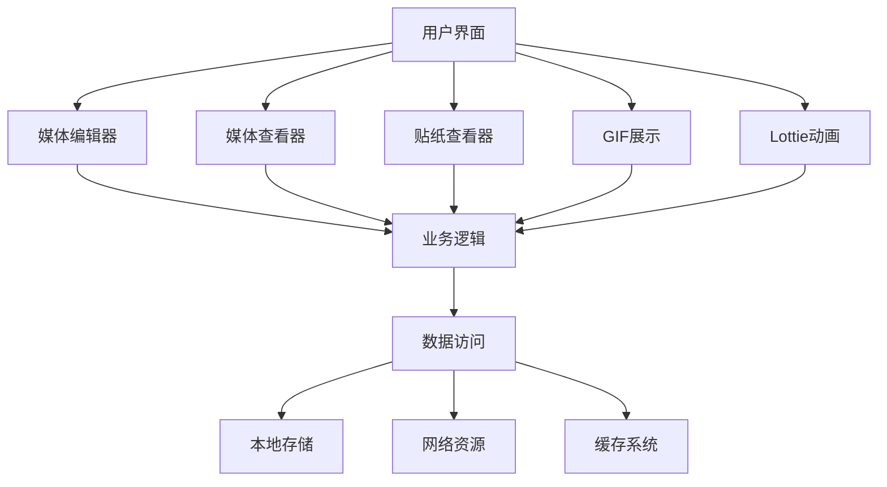

**图源**  
- [mediaEditor.tsx](file://src/components/mediaEditor/mediaEditor.tsx)
- [appMediaViewer.ts](file://src/components/appMediaViewer.ts)
- [gifsMasonry.ts](file://src/components/gifsMasonry.ts)
- [stickerViewer.ts](file://src/components/stickerViewer.ts)
- [lottieAnimation.tsx](file://src/components/lottieAnimation.tsx)

## 详细组件分析
本节对每个关键组件进行深入分析，包括其实现细节、数据结构和交互流程。

### 媒体编辑器分析
媒体编辑器组件提供了完整的媒体编辑功能，包括裁剪、旋转、涂鸦和贴纸添加等。通过WebGL加速渲染，实现了高性能的实时预览。

#### 媒体编辑器类图
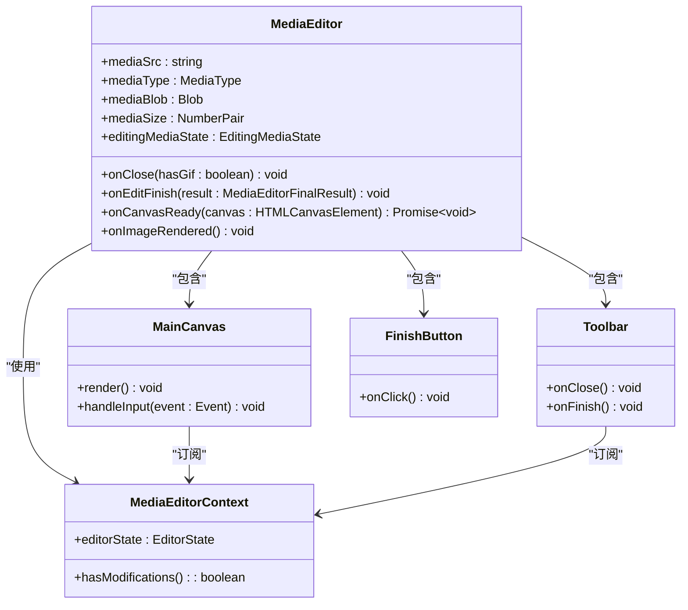

**图源**  
- [mediaEditor.tsx](file://src/components/mediaEditor/mediaEditor.tsx)
- [canvas/mainCanvas.ts](file://src/components/mediaEditor/canvas/mainCanvas.ts)
- [toolbar.tsx](file://src/components/mediaEditor/toolbar.tsx)
- [context.ts](file://src/components/mediaEditor/context.ts)

#### 媒体编辑流程序列图
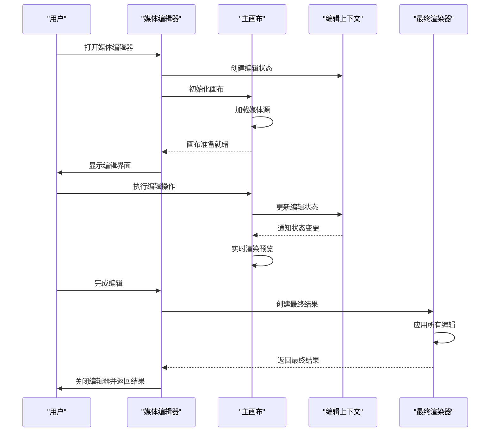

**图源**  
- [mediaEditor.tsx](file://src/components/mediaEditor/mediaEditor.tsx)
- [canvas/mainCanvas.ts](file://src/components/mediaEditor/canvas/mainCanvas.ts)
- [context.ts](file://src/components/mediaEditor/context.ts)
- [finalRender/createFinalResult.ts](file://src/components/mediaEditor/finalRender/createFinalResult.ts)

**章节源**  
- [mediaEditor.tsx](file://src/components/mediaEditor/mediaEditor.tsx)
- [canvas/mainCanvas.ts](file://src/components/mediaEditor/canvas/mainCanvas.ts)
- [context.ts](file://src/components/mediaEditor/context.ts)
- [types.ts](file://src/components/mediaEditor/types.ts)
- [finalRender/createFinalResult.ts](file://src/components/mediaEditor/finalRender/createFinalResult.ts)
- [toolbar.tsx](file://src/components/mediaEditor/toolbar.tsx)

### 媒体查看器分析
媒体查看器组件提供了媒体内容的浏览功能，支持缩放、导航和全屏模式。通过优化的加载策略，确保了流畅的用户体验。

#### 媒体查看器类图
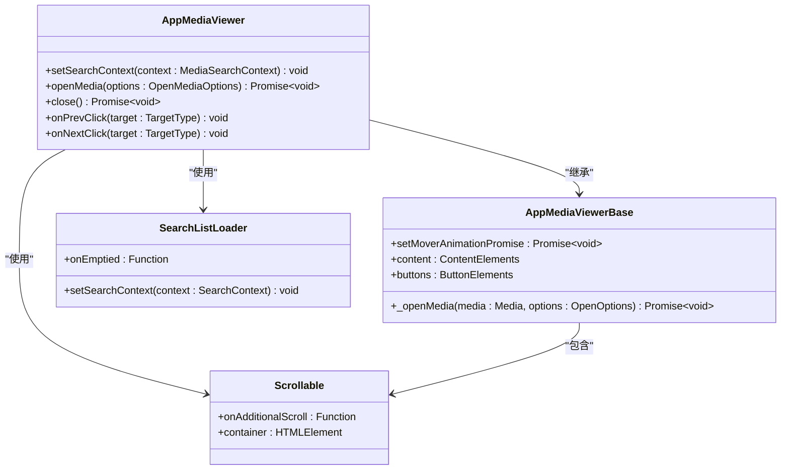

**图源**  
- [appMediaViewer.ts](file://src/components/appMediaViewer.ts)
- [appMediaViewerBase.ts](file://src/components/appMediaViewerBase.ts)

#### 媒体查看流程序列图
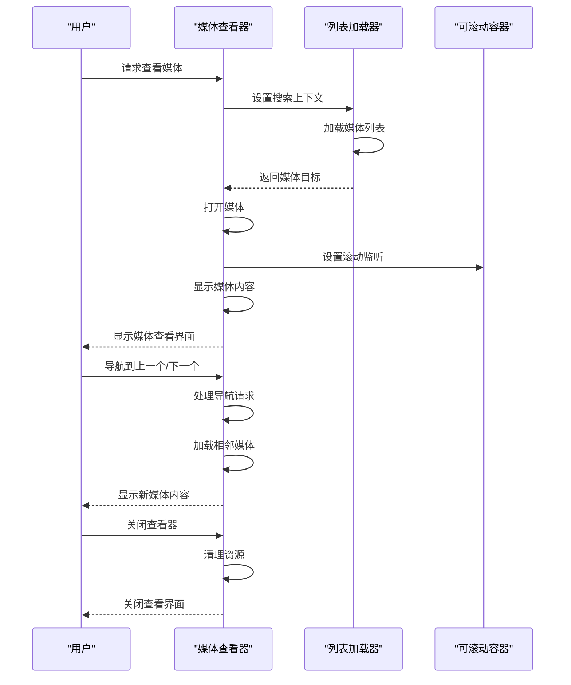

**图源**  
- [appMediaViewer.ts](file://src/components/appMediaViewer.ts)
- [appMediaViewerBase.ts](file://src/components/appMediaViewerBase.ts)
- [searchListLoader.ts](file://src/helpers/searchListLoader.ts)

**章节源**  
- [appMediaViewer.ts](file://src/components/appMediaViewer.ts)
- [appMediaViewerBase.ts](file://src/components/appMediaViewerBase.ts)

### Lottie动画分析
Lottie动画组件提供了高性能的动画播放功能，通过Web Worker实现离屏渲染，避免了主线程阻塞。

#### Lottie动画类图
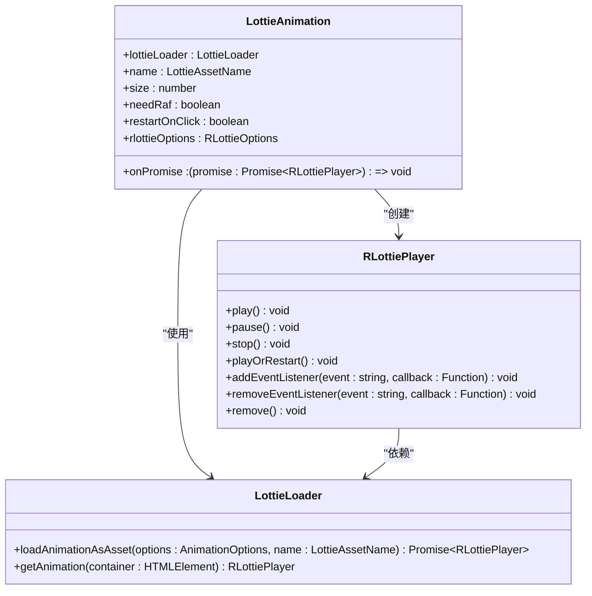

**图源**  
- [lottieAnimation.tsx](file://src/components/lottieAnimation.tsx)
- [rlottiePlayer.ts](file://src/lib/rlottie/rlottiePlayer.ts)
- [lottieLoader.ts](file://src/lib/rlottie/lottieLoader.ts)

#### Lottie动画播放流程
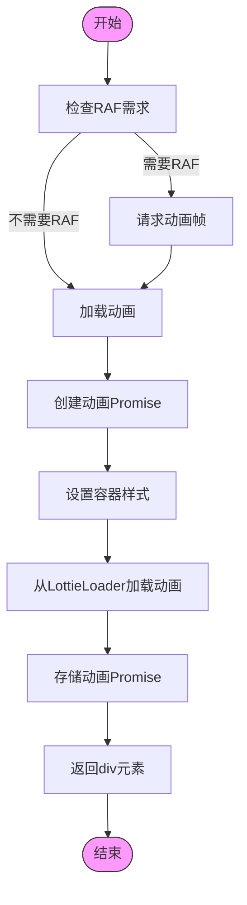

**图源**  
- [lottieAnimation.tsx](file://src/components/lottieAnimation.tsx)
- [rlottiePlayer.ts](file://src/lib/rlottie/rlottiePlayer.ts)
- [lottieLoader.ts](file://src/lib/rlottie/lottieLoader.ts)

**章节源**  
- [lottieAnimation.tsx](file://src/components/lottieAnimation.tsx)
- [rlottiePlayer.ts](file://src/lib/rlottie/rlottiePlayer.ts)
- [lottieLoader.ts](file://src/lib/rlottie/lottieLoader.ts)

### GIF瀑布流分析
GIF瀑布流组件实现了高效的GIF展示布局，通过懒加载和可见性检测优化了性能。

#### GIF瀑布流类图
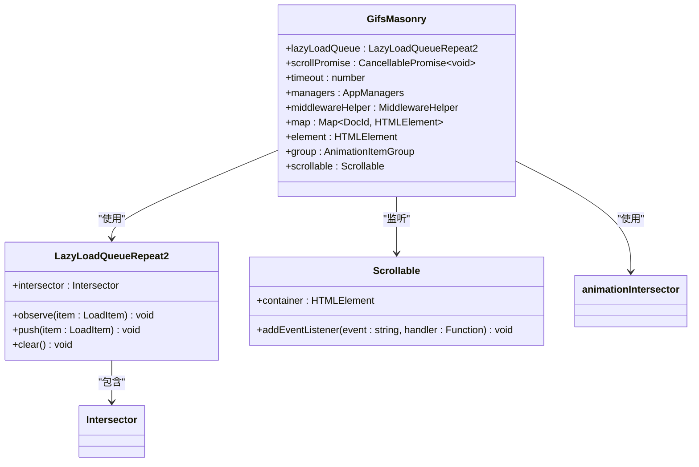

**图源**  
- [gifsMasonry.ts](file://src/components/gifsMasonry.ts)
- [lazyLoadQueueRepeat2.ts](file://src/components/lazyLoadQueueRepeat2.ts)
- [animationIntersector.ts](file://src/components/animationIntersector.ts)

#### GIF加载流程
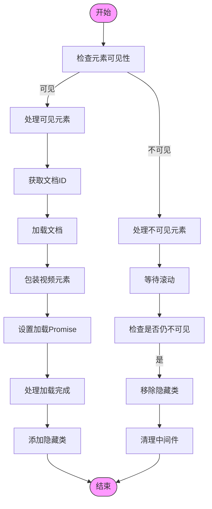

**图源**  
- [gifsMasonry.ts](file://src/components/gifsMasonry.ts)
- [lazyLoadQueueRepeat2.ts](file://src/components/lazyLoadQueueRepeat2.ts)
- [wrapVideo.ts](file://src/components/wrappers/video.ts)

**章节源**  
- [gifsMasonry.ts](file://src/components/gifsMasonry.ts)

### 贴纸查看器分析
贴纸查看器组件提供了贴纸的悬停预览功能，通过平滑的动画过渡提升了用户体验。

#### 贴纸查看器实现流程
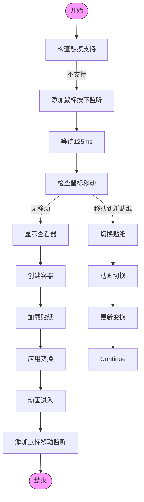

**图源**  
- [stickerViewer.ts](file://src/components/stickerViewer.ts)

**章节源**  
- [stickerViewer.ts](file://src/components/stickerViewer.ts)

## 依赖分析
本节分析组件之间的依赖关系，帮助理解系统的整体架构和模块交互。

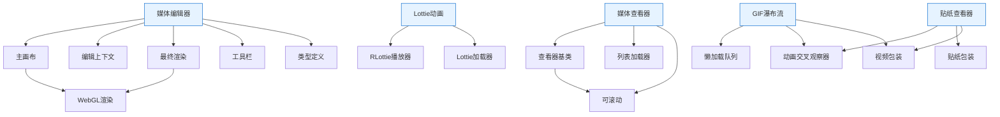

**图源**  
- [package.json](file://package.json)
- [src/components](file://src/components)
- [src/lib](file://src/lib)

**章节源**  
- [package.json](file://package.json)
- [src/components](file://src/components)
- [src/lib](file://src/lib)

## 性能考虑
在设计和实现媒体组件时，性能是一个关键考虑因素。以下是主要的性能优化策略：

1. **WebGL加速渲染**：媒体编辑器使用WebGL进行实时预览渲染，充分利用GPU计算能力。
2. **懒加载机制**：GIF瀑布流和媒体查看器采用懒加载策略，只加载可见区域的内容。
3. **Web Worker离屏渲染**：Lottie动画通过Web Worker在后台线程渲染，避免阻塞主线程。
4. **内存管理**：组件在销毁时及时清理资源，防止内存泄漏。
5. **动画优化**：使用requestAnimationFrame进行动画渲染，确保与浏览器刷新率同步。
6. **缓存策略**：对已加载的媒体资源进行缓存，避免重复加载。

这些优化策略共同确保了媒体组件在各种设备上都能提供流畅的用户体验。

## 故障排除指南
本节提供常见问题的解决方案和调试技巧。

**章节源**  
- [errors.ts](file://src/lib/rootScope.ts)
- [logger.ts](file://src/lib/logger.ts)
- [debug.ts](file://src/config/debug.ts)

## 结论
本文档全面介绍了媒体处理和展示组件的设计与实现。通过模块化架构和性能优化策略，这些组件提供了丰富的媒体处理功能，同时确保了良好的用户体验。未来可以进一步优化WebGL渲染性能，增加更多编辑功能，并提升无障碍访问支持。