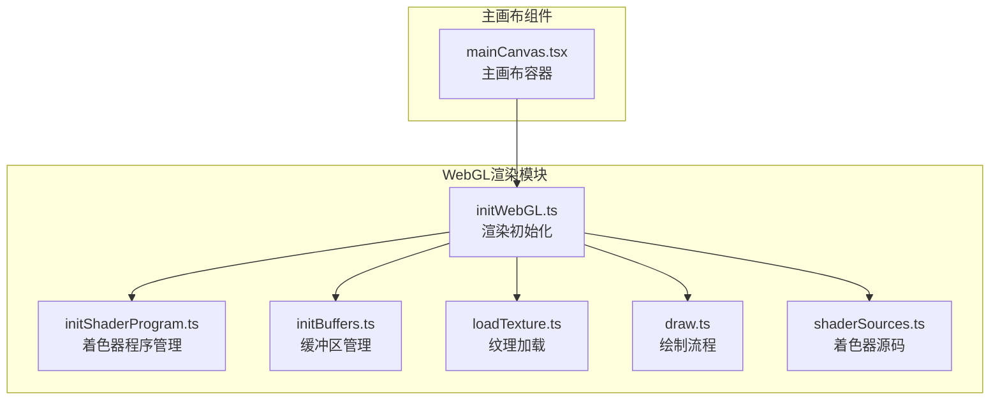
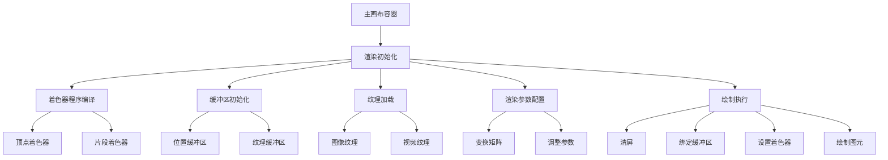
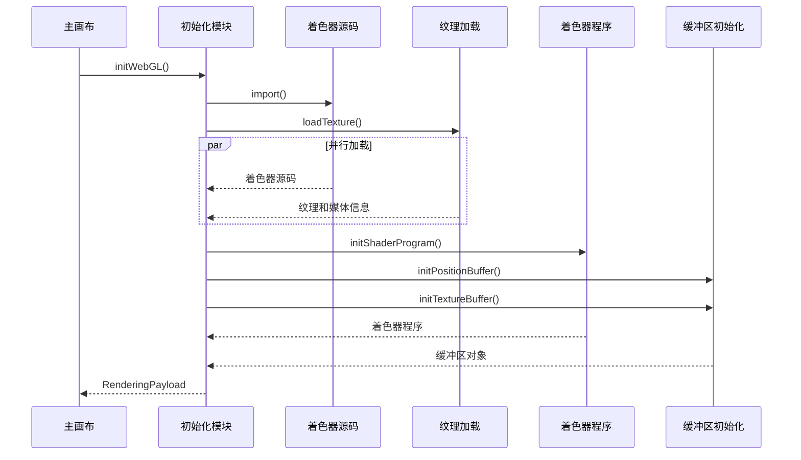
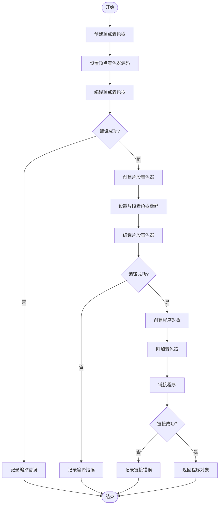
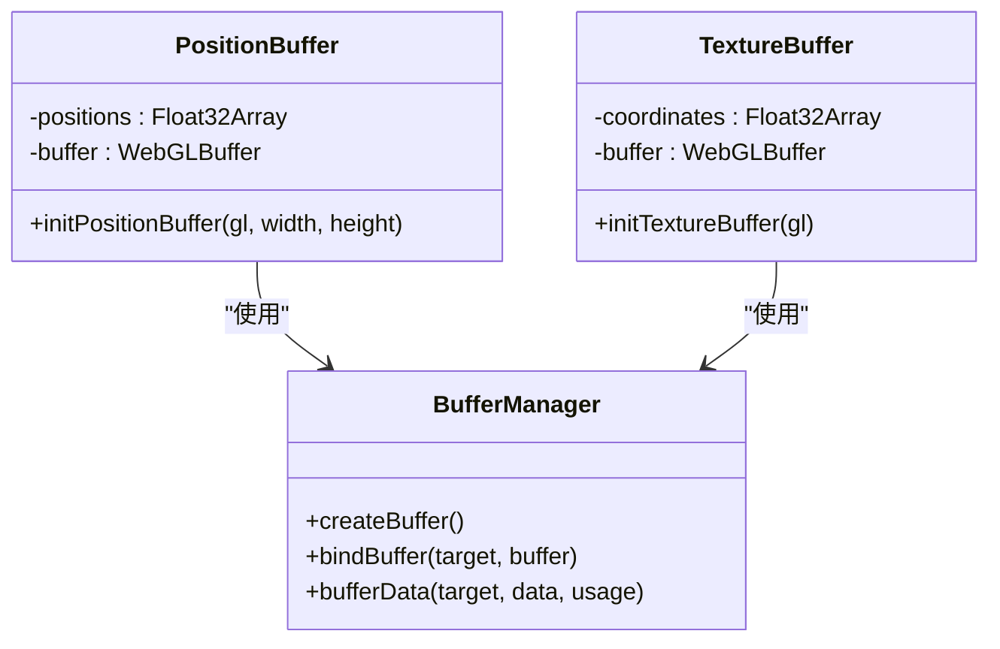
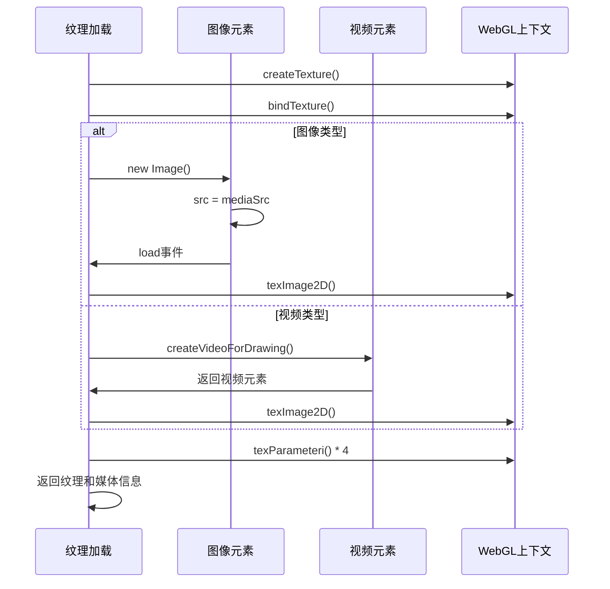
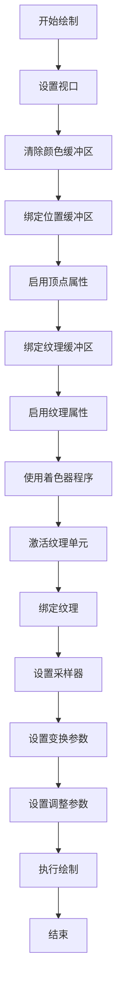
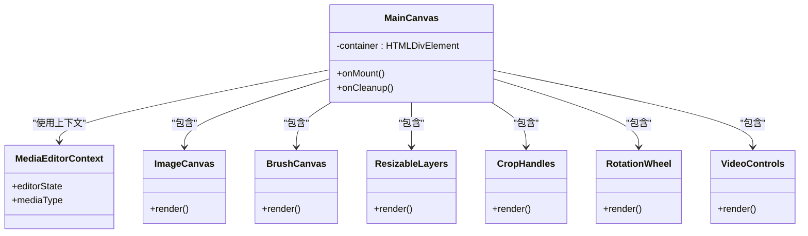
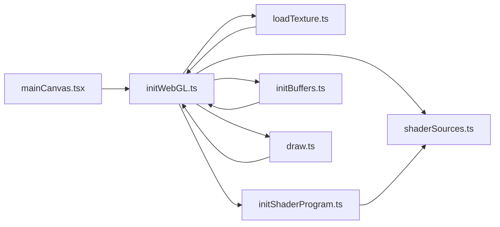

# WebGL渲染

<cite>
**本文档中引用的文件**   
- [initWebGL.ts](file://src/components/mediaEditor/webgl/initWebGL.ts)
- [initShaderProgram.ts](file://src/components/mediaEditor/webgl/initShaderProgram.ts)
- [initBuffers.ts](file://src/components/mediaEditor/webgl/initBuffers.ts)
- [loadTexture.ts](file://src/components/mediaEditor/webgl/loadTexture.ts)
- [draw.ts](file://src/components/mediaEditor/webgl/draw.ts)
- [shaderSources.ts](file://src/components/mediaEditor/webgl/shaderSources.ts)
- [mainCanvas.tsx](file://src/components/mediaEditor/canvas/mainCanvas.tsx)
</cite>

## 目录
1. [简介](#简介)
2. [项目结构](#项目结构)
3. [核心组件](#核心组件)
4. [架构概述](#架构概述)
5. [详细组件分析](#详细组件分析)
6. [依赖分析](#依赖分析)
7. [性能考虑](#性能考虑)
8. [故障排除指南](#故障排除指南)
9. [结论](#结论)

## 简介
本文档详细介绍了WebGL渲染系统的设计与实现，重点涵盖WebGL渲染管道的初始化流程、着色器程序的编译与链接、缓冲区初始化、纹理加载机制、图像绘制流程以及主画布的架构设计。文档还提供了性能优化建议和错误处理机制。

## 项目结构
WebGL渲染系统位于`src/components/mediaEditor/webgl`目录下，包含多个核心模块，每个模块负责渲染管道中的特定功能。系统通过模块化设计实现了高内聚低耦合的架构。



**图源**
- [initWebGL.ts](file://src/components/mediaEditor/webgl/initWebGL.ts)
- [mainCanvas.tsx](file://src/components/mediaEditor/canvas/mainCanvas.tsx)

**章节源**
- [initWebGL.ts](file://src/components/mediaEditor/webgl/initWebGL.ts)
- [mainCanvas.tsx](file://src/components/mediaEditor/canvas/mainCanvas.tsx)

## 核心组件
WebGL渲染系统由多个核心组件构成，包括渲染上下文初始化、着色器程序管理、缓冲区管理、纹理加载和绘制流程。这些组件协同工作，实现高效的图形渲染。

**章节源**
- [initWebGL.ts](file://src/components/mediaEditor/webgl/initWebGL.ts)
- [initShaderProgram.ts](file://src/components/mediaEditor/webgl/initShaderProgram.ts)
- [initBuffers.ts](file://src/components/mediaEditor/webgl/initBuffers.ts)

## 架构概述
WebGL渲染系统的架构采用分层设计，从底层的WebGL上下文管理到上层的绘制流程，各层职责分明。系统通过异步加载和并行处理优化性能。



**图源**
- [initWebGL.ts](file://src/components/mediaEditor/webgl/initWebGL.ts)
- [draw.ts](file://src/components/mediaEditor/webgl/draw.ts)

## 详细组件分析

### 渲染初始化分析
渲染初始化模块负责创建WebGL上下文、加载着色器程序、初始化缓冲区和加载纹理。该模块采用异步编程模式，确保资源的高效加载。



**图源**
- [initWebGL.ts](file://src/components/mediaEditor/webgl/initWebGL.ts)
- [loadTexture.ts](file://src/components/mediaEditor/webgl/loadTexture.ts)

**章节源**
- [initWebGL.ts](file://src/components/mediaEditor/webgl/initWebGL.ts#L21-L57)
- [loadTexture.ts](file://src/components/mediaEditor/webgl/loadTexture.ts#L29-L68)

### 着色器程序编译分析
着色器程序编译模块负责将顶点着色器和片段着色器源码编译成WebGL程序对象。该模块包含完整的错误处理机制，确保编译过程的可靠性。



**图源**
- [initShaderProgram.ts](file://src/components/mediaEditor/webgl/initShaderProgram.ts)
- [shaderSources.ts](file://src/components/mediaEditor/webgl/shaderSources.ts)

**章节源**
- [initShaderProgram.ts](file://src/components/mediaEditor/webgl/initShaderProgram.ts#L3-L34)
- [shaderSources.ts](file://src/components/mediaEditor/webgl/shaderSources.ts#L1-L331)

### 缓冲区初始化分析
缓冲区初始化模块负责创建和配置顶点缓冲区和纹理缓冲区。这些缓冲区存储了图形渲染所需的数据，是WebGL渲染管道的基础。



**图源**
- [initBuffers.ts](file://src/components/mediaEditor/webgl/initBuffers.ts)
- [initWebGL.ts](file://src/components/mediaEditor/webgl/initWebGL.ts)

**章节源**
- [initBuffers.ts](file://src/components/mediaEditor/webgl/initBuffers.ts#L1-L20)
- [initWebGL.ts](file://src/components/mediaEditor/webgl/initWebGL.ts#L29-L32)

### 纹理加载机制分析
纹理加载模块负责加载图像和视频资源，并将其转换为WebGL纹理对象。该模块支持多种媒体类型，并包含异步加载和错误处理机制。



**图源**
- [loadTexture.ts](file://src/components/mediaEditor/webgl/loadTexture.ts)
- [initWebGL.ts](file://src/components/mediaEditor/webgl/initWebGL.ts)

**章节源**
- [loadTexture.ts](file://src/components/mediaEditor/webgl/loadTexture.ts#L29-L68)
- [initWebGL.ts](file://src/components/mediaEditor/webgl/initWebGL.ts#L22-L25)

### 绘制流程分析
绘制流程模块负责执行实际的图形渲染操作。该模块配置渲染状态、绑定资源、设置着色器参数并执行绘制命令。



**图源**
- [draw.ts](file://src/components/mediaEditor/webgl/draw.ts)
- [initWebGL.ts](file://src/components/mediaEditor/webgl/initWebGL.ts)

**章节源**
- [draw.ts](file://src/components/mediaEditor/webgl/draw.ts#L15-L56)
- [initWebGL.ts](file://src/components/mediaEditor/webgl/initWebGL.ts#L34-L55)

### 着色器源码设计分析
着色器源码模块包含顶点着色器和片段着色器的GLSL代码。这些着色器实现了复杂的图形效果，包括变换、调整和滤镜。

```mermaid
erDiagram
VERTEX_SHADER {
string precision
attribute vec2 aVertexPosition
attribute vec2 aTextureCoord
uniform float uAngle
uniform float uScale
uniform vec2 uFlip
uniform vec2 uImageSize
uniform vec2 uResolution
uniform vec2 uTranslation
varying vec2 vTextureCoord
}
FRAGMENT_SHADER {
string precision
varying vec2 vTextureCoord
uniform sampler2D uSampler
uniform vec2 uImageSize
uniform vec2 uResolution
uniform float uEnhance
uniform float uSaturation
uniform float uBrightness
uniform float uContrast
uniform float uWarmth
uniform float uFade
uniform float uShadows
uniform float uHighlights
uniform float uVignette
uniform float uGrain
uniform float uSharpen
}
VERTEX_SHADER ||--o{ FRAGMENT_SHADER : "传递纹理坐标"
```

**图源**
- [shaderSources.ts](file://src/components/mediaEditor/webgl/shaderSources.ts)
- [draw.ts](file://src/components/mediaEditor/webgl/draw.ts)

**章节源**
- [shaderSources.ts](file://src/components/mediaEditor/webgl/shaderSources.ts#L1-L331)
- [draw.ts](file://src/components/mediaEditor/webgl/draw.ts#L42-L52)

### 主画布架构分析
主画布组件是WebGL渲染系统的容器，负责协调各个子组件并管理用户交互。该组件采用响应式编程模式，确保UI的实时更新。



**图源**
- [mainCanvas.tsx](file://src/components/mediaEditor/canvas/mainCanvas.tsx)
- [initWebGL.ts](file://src/components/mediaEditor/webgl/initWebGL.ts)

**章节源**
- [mainCanvas.tsx](file://src/components/mediaEditor/canvas/mainCanvas.tsx#L1-L54)
- [initWebGL.ts](file://src/components/mediaEditor/webgl/initWebGL.ts#L9-L19)

## 依赖分析
WebGL渲染系统各组件之间存在明确的依赖关系。初始化模块依赖于着色器源码、纹理加载和缓冲区初始化模块，而绘制模块依赖于初始化模块的输出。



**图源**
- [initWebGL.ts](file://src/components/mediaEditor/webgl/initWebGL.ts)
- [mainCanvas.tsx](file://src/components/mediaEditor/canvas/mainCanvas.tsx)

**章节源**
- [initWebGL.ts](file://src/components/mediaEditor/webgl/initWebGL.ts#L5-L8)
- [mainCanvas.tsx](file://src/components/mediaEditor/canvas/mainCanvas.tsx#L4-L13)

## 性能考虑
WebGL渲染系统在设计时充分考虑了性能优化。系统采用批处理绘制调用、合理的内存管理策略和异步资源加载来提高渲染效率。

- **批处理绘制调用**：通过合并多个绘制操作减少WebGL状态切换开销
- **内存管理**：及时释放不再使用的WebGL资源，避免内存泄漏
- **异步加载**：并行加载着色器源码和纹理资源，减少初始化时间
- **缓冲区重用**：重复使用已创建的缓冲区对象，减少GPU内存分配
- **纹理压缩**：使用适当的纹理格式和压缩技术减少内存占用

## 故障排除指南
当WebGL渲染系统出现问题时，可以按照以下步骤进行排查：

**章节源**
- [initShaderProgram.ts](file://src/components/mediaEditor/webgl/initShaderProgram.ts#L12-L14)
- [loadTexture.ts](file://src/components/mediaEditor/webgl/loadTexture.ts#L39-L41)

1. **检查WebGL上下文**：确保浏览器支持WebGL并正确创建了渲染上下文
2. **验证着色器编译**：查看控制台日志，检查着色器编译和链接是否成功
3. **确认资源加载**：确保图像和视频资源能够正确加载
4. **检查缓冲区配置**：验证顶点和纹理缓冲区的数据是否正确
5. **调试绘制参数**：检查变换矩阵和调整参数的设置是否正确

## 结论
WebGL渲染系统通过模块化设计实现了高效、可靠的图形渲染功能。系统各组件职责分明，通过清晰的接口进行通信。通过采用异步编程、批处理和合理的内存管理策略，系统在性能和用户体验之间取得了良好平衡。未来可以进一步优化着色器算法和增加更多图形效果。