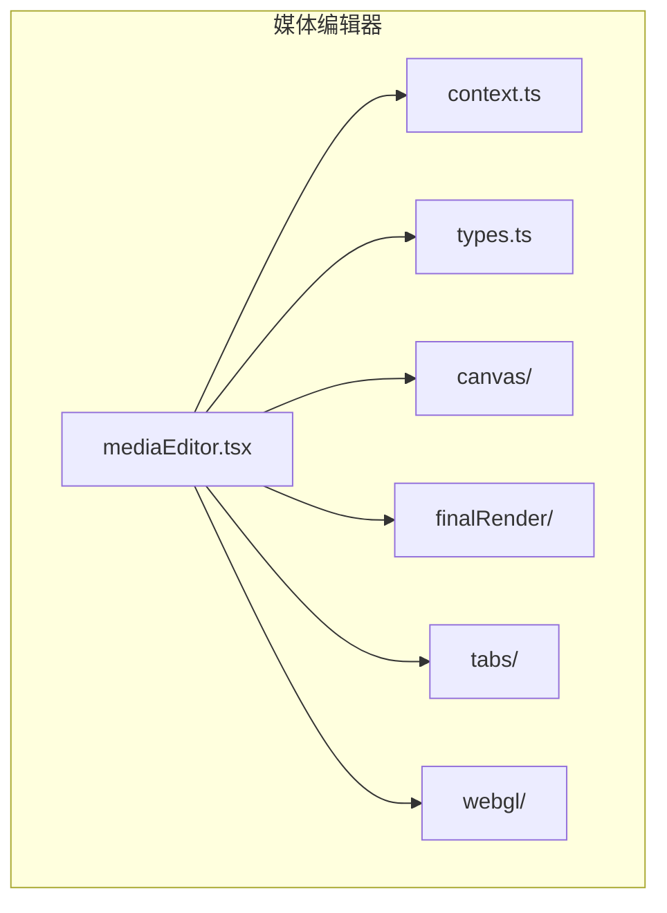
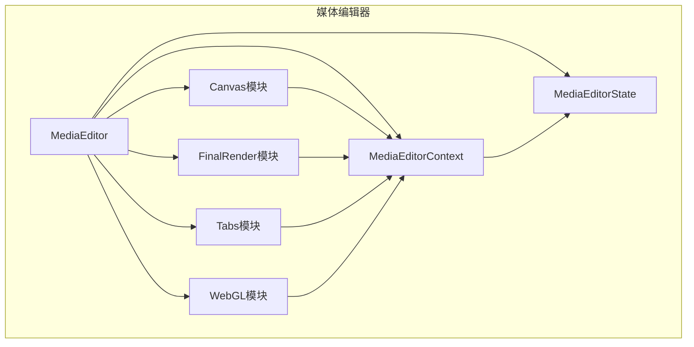
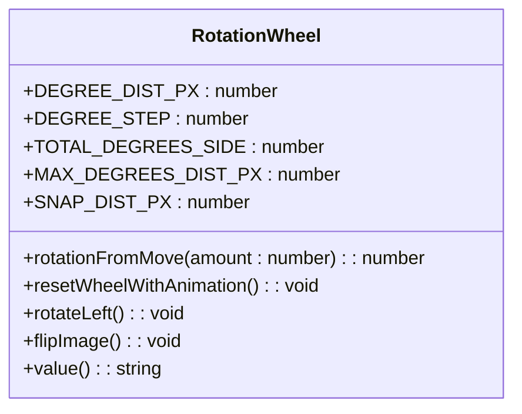
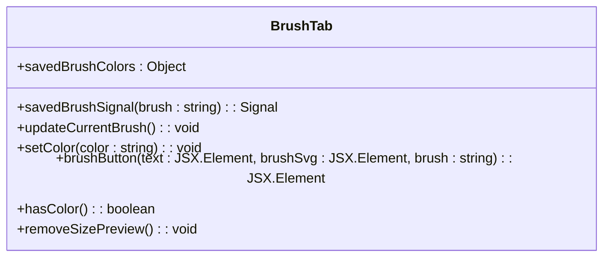
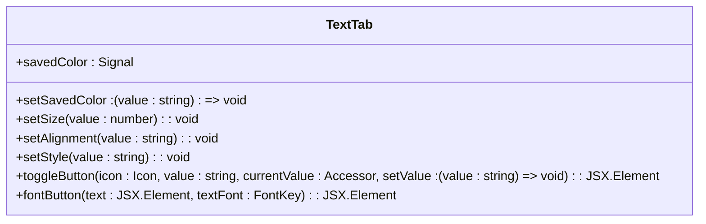
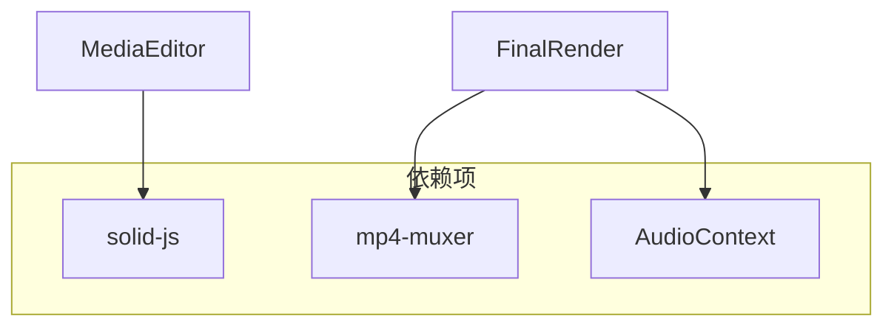

# 媒体编辑

<cite>
**本文档中引用的文件**  
- [mediaEditor.tsx](file://src/components/mediaEditor/mediaEditor.tsx)
- [context.ts](file://src/components/mediaEditor/context.ts)
- [types.ts](file://src/components/mediaEditor/types.ts)
- [initWebGL.ts](file://src/components/mediaEditor/webgl/initWebGL.ts)
- [initShaderProgram.ts](file://src/components/mediaEditor/webgl/initShaderProgram.ts)
- [loadTexture.ts](file://src/components/mediaEditor/webgl/loadTexture.ts)
- [cropTab.tsx](file://src/components/mediaEditor/tabs/cropTab.tsx)
- [rotationWheel.tsx](file://src/components/mediaEditor/canvas/rotationWheel.tsx)
- [brushTab.tsx](file://src/components/mediaEditor/tabs/brushTab.tsx)
- [stickersTab.tsx](file://src/components/mediaEditor/tabs/stickersTab.tsx)
- [textTab.tsx](file://src/components/mediaEditor/tabs/textTab.tsx)
- [renderToActualVideo.ts](file://src/components/mediaEditor/finalRender/renderToActualVideo.ts)
- [renderToImage.ts](file://src/components/mediaEditor/finalRender/renderToImage.ts)
- [renderToVideoGIF.ts](file://src/components/mediaEditor/finalRender/renderToVideoGIF.ts)
</cite>

## 目录
1. [简介](#简介)
2. [项目结构](#项目结构)
3. [核心组件](#核心组件)
4. [架构概述](#架构概述)
5. [详细组件分析](#详细组件分析)
6. [依赖分析](#依赖分析)
7. [性能考虑](#性能考虑)
8. [故障排除指南](#故障排除指南)
9. [结论](#结论)

## 简介
本文档详细介绍了媒体编辑器的架构设计和实现细节，涵盖了画布渲染、视频控件、WebGL加速等核心技术。文档深入解析了各个编辑功能模块，包括裁剪、旋转、涂鸦、贴纸和文本的实现原理。同时，文档还解释了WebGL渲染管道的初始化、着色器程序和纹理加载机制，以及最终渲染流程，包括视频编码、图像生成和GIF生成。此外，文档提供了性能优化建议和错误处理策略。

## 项目结构
媒体编辑功能主要位于`src/components/mediaEditor`目录下，该目录包含了多个子模块，分别负责不同的功能。主要的子模块包括`canvas`、`finalRender`、`tabs`和`webgl`。`canvas`模块负责画布的渲染和交互，`finalRender`模块负责最终的渲染和输出，`tabs`模块负责各个编辑功能的用户界面，`webgl`模块负责WebGL相关的渲染和加速。



**图源**
- [mediaEditor.tsx](file://src/components/mediaEditor/mediaEditor.tsx)
- [context.ts](file://src/components/mediaEditor/context.ts)
- [types.ts](file://src/components/mediaEditor/types.ts)

**节源**
- [mediaEditor.tsx](file://src/components/mediaEditor/mediaEditor.tsx)
- [context.ts](file://src/components/mediaEditor/context.ts)
- [types.ts](file://src/components/mediaEditor/types.ts)

## 核心组件
媒体编辑器的核心组件包括`MediaEditor`、`MediaEditorContext`和`MediaEditorState`。`MediaEditor`是媒体编辑器的主组件，负责初始化和管理编辑器的各个部分。`MediaEditorContext`提供了编辑器的上下文，包括当前的编辑状态和操作。`MediaEditorState`定义了编辑器的状态，包括当前的标签、图像大小、画布大小等。

**节源**
- [mediaEditor.tsx](file://src/components/mediaEditor/mediaEditor.tsx)
- [context.ts](file://src/components/mediaEditor/context.ts)
- [types.ts](file://src/components/mediaEditor/types.ts)

## 架构概述
媒体编辑器的架构设计采用了模块化的方式，各个模块之间通过明确的接口进行通信。`MediaEditor`组件作为入口点，初始化并管理其他模块。`context.ts`文件定义了编辑器的上下文，`types.ts`文件定义了编辑器的状态和类型。`canvas`模块负责画布的渲染和交互，`finalRender`模块负责最终的渲染和输出，`tabs`模块负责各个编辑功能的用户界面，`webgl`模块负责WebGL相关的渲染和加速。



**图源**
- [mediaEditor.tsx](file://src/components/mediaEditor/mediaEditor.tsx)
- [context.ts](file://src/components/mediaEditor/context.ts)
- [types.ts](file://src/components/mediaEditor/types.ts)

## 详细组件分析
### 裁剪模块分析
裁剪模块允许用户调整媒体的宽高比。用户可以选择预设的宽高比，如1:1、3:2、4:3等，也可以选择自由裁剪。裁剪模块通过`cropTab.tsx`文件实现，该文件定义了裁剪界面的UI和交互逻辑。

```mermaid
classDiagram
class CropTab {
+ratioRects : Object
+ratioIcon(ratio : string, rotated? : boolean) : JSX.Element
+Item(props : MediaEditorLargeButtonProps & {icon : JSX.Element, text : JSX.Element}) : JSX.Element
+onRatioClick(ratio? : string) : void
}
```

**图源**
- [cropTab.tsx](file://src/components/mediaEditor/tabs/cropTab.tsx)

**节源**
- [cropTab.tsx](file://src/components/mediaEditor/tabs/cropTab.tsx)

### 旋转模块分析
旋转模块允许用户旋转媒体。用户可以通过拖动旋转轮来调整旋转角度，也可以通过点击按钮来快速旋转90度。旋转模块通过`rotationWheel.tsx`文件实现，该文件定义了旋转轮的UI和交互逻辑。



**图源**
- [rotationWheel.tsx](file://src/components/mediaEditor/canvas/rotationWheel.tsx)

**节源**
- [rotationWheel.tsx](file://src/components/mediaEditor/canvas/rotationWheel.tsx)

### 涂鸦模块分析
涂鸦模块允许用户在媒体上绘制。用户可以选择不同的画笔类型，如笔、箭头、刷子、霓虹灯等，也可以调整画笔的颜色和大小。涂鸦模块通过`brushTab.tsx`文件实现，该文件定义了涂鸦界面的UI和交互逻辑。



**图源**
- [brushTab.tsx](file://src/components/mediaEditor/tabs/brushTab.tsx)

**节源**
- [brushTab.tsx](file://src/components/mediaEditor/tabs/brushTab.tsx)

### 贴纸模块分析
贴纸模块允许用户在媒体上添加贴纸。用户可以从最近使用的贴纸、贴纸集或搜索结果中选择贴纸。贴纸模块通过`stickersTab.tsx`文件实现，该文件定义了贴纸界面的UI和交互逻辑。

```mermaid
classDiagram
class StickersTab {
+recentStickers : Resource
+stickerSets : Resource
+filteredStickers : Signal
+search : Signal
+group : Signal
+activeSet : Signal
+scrolling : Signal
+intersectionObserver : Signal
+recentLabel : Signal
+lazyLoadQueue : LazyLoadQueue
+stickerRenderer : SuperStickerRenderer
+onStickerSetThumbClick(id : string) : void
+StickerSetThumb(props : {set : StickerSet.stickerSet}) : JSX.Element
+Sticker(props : {doc : Document.document}) : JSX.Element
+StickerSetLabel(props : {set : StickerSet.stickerSet}) : JSX.Element
+StickerSetSection(props : {set : StickerSet.stickerSet}) : JSX.Element
+ThumbList() : JSX.Element
}
```

**图源**
- [stickersTab.tsx](file://src/components/mediaEditor/tabs/stickersTab.tsx)

**节源**
- [stickersTab.tsx](file://src/components/mediaEditor/tabs/stickersTab.tsx)

### 文本模块分析
文本模块允许用户在媒体上添加文本。用户可以选择不同的字体、对齐方式、样式和颜色，也可以调整文本的大小。文本模块通过`textTab.tsx`文件实现，该文件定义了文本界面的UI和交互逻辑。



**图源**
- [textTab.tsx](file://src/components/mediaEditor/tabs/textTab.tsx)

**节源**
- [textTab.tsx](file://src/components/mediaEditor/tabs/textTab.tsx)

## 依赖分析
媒体编辑器依赖于多个外部库和模块，包括`solid-js`、`mp4-muxer`、`AudioContext`等。这些依赖项通过`package.json`文件进行管理。`solid-js`用于构建用户界面，`mp4-muxer`用于视频编码，`AudioContext`用于音频处理。



**图源**
- [package.json](file://package.json)

**节源**
- [package.json](file://package.json)

## 性能考虑
为了提高性能，媒体编辑器采用了多种优化策略。首先，使用WebGL进行渲染，利用GPU加速图形处理。其次，通过`requestVideoFrameCallback` API来同步视频帧的渲染，确保渲染的流畅性。此外，通过`cancellablePromise`和`deferredPromise`来管理异步操作，避免不必要的计算和内存占用。

**节源**
- [initWebGL.ts](file://src/components/mediaEditor/webgl/initWebGL.ts)
- [renderToActualVideo.ts](file://src/components/mediaEditor/finalRender/renderToActualVideo.ts)

## 故障排除指南
在使用媒体编辑器时，可能会遇到一些常见问题。例如，视频渲染不流畅、贴纸加载失败等。对于视频渲染不流畅的问题，可以尝试降低视频的分辨率或帧率。对于贴纸加载失败的问题，可以检查网络连接或重新加载贴纸集。

**节源**
- [renderToActualVideo.ts](file://src/components/mediaEditor/finalRender/renderToActualVideo.ts)
- [stickersTab.tsx](file://src/components/mediaEditor/tabs/stickersTab.tsx)

## 结论
本文档详细介绍了媒体编辑器的架构设计和实现细节，涵盖了画布渲染、视频控件、WebGL加速等核心技术。通过模块化的设计，媒体编辑器能够高效地处理各种媒体编辑任务。未来，可以进一步优化性能，增加更多的编辑功能，提升用户体验。