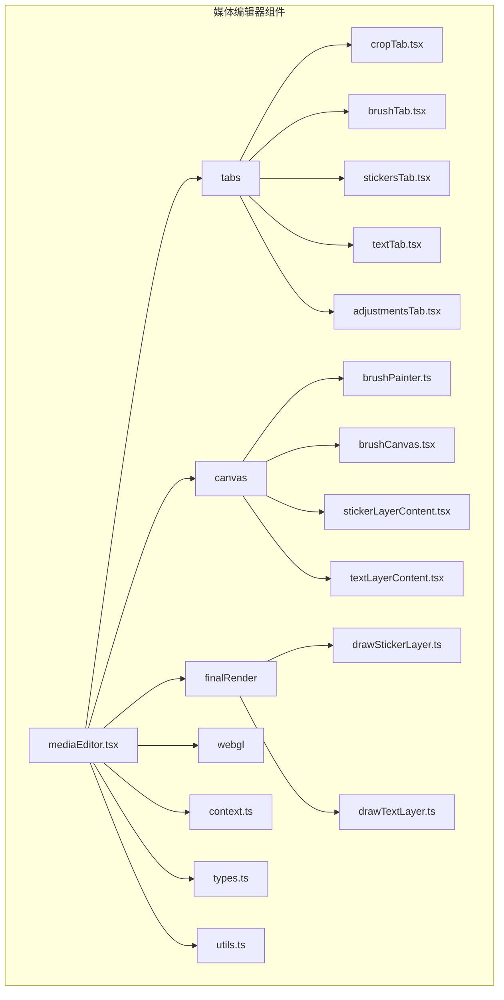
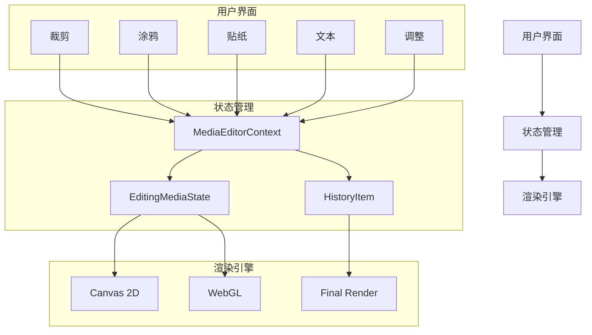
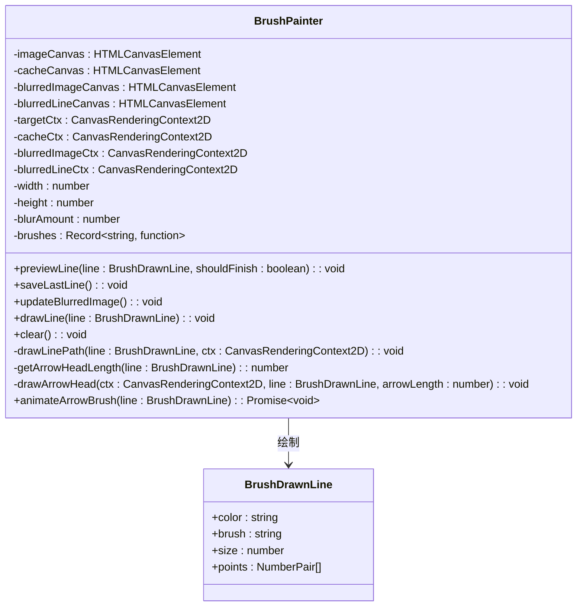
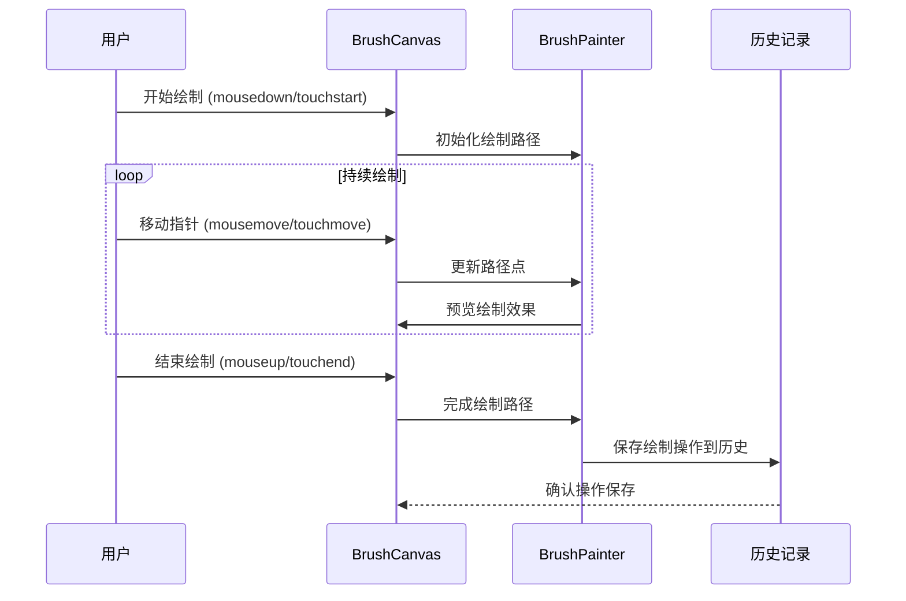
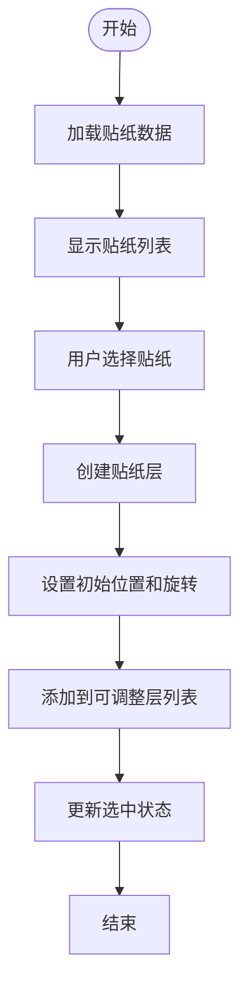
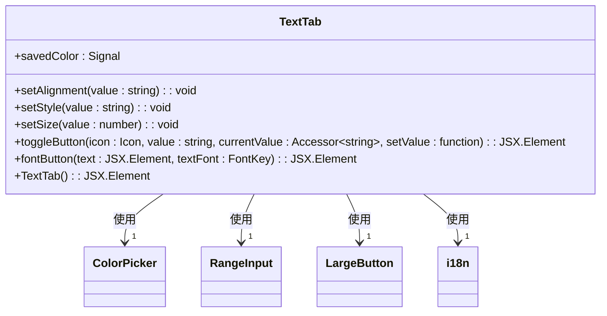
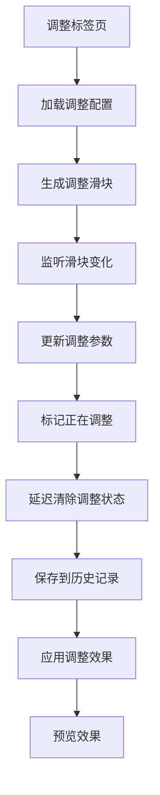
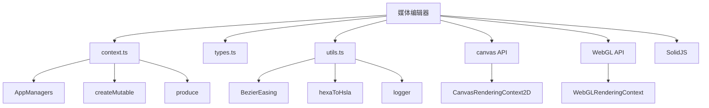

# 编辑功能

<cite>
**本文档中引用的文件**   
- [cropTab.tsx](file://src/components/mediaEditor/tabs/cropTab.tsx)
- [brushTab.tsx](file://src/components/mediaEditor/tabs/brushTab.tsx)
- [stickersTab.tsx](file://src/components/mediaEditor/tabs/stickersTab.tsx)
- [textTab.tsx](file://src/components/mediaEditor/tabs/textTab.tsx)
- [adjustmentsTab.tsx](file://src/components/mediaEditor/tabs/adjustmentsTab.tsx)
- [brushPainter.ts](file://src/components/mediaEditor/canvas/brushPainter.ts)
- [brushCanvas.tsx](file://src/components/mediaEditor/canvas/brushCanvas.tsx)
- [context.ts](file://src/components/mediaEditor/context.ts)
- [types.ts](file://src/components/mediaEditor/types.ts)
- [stickerLayerContent.tsx](file://src/components/mediaEditor/canvas/stickerLayerContent.tsx)
- [textLayerContent.tsx](file://src/components/mediaEditor/canvas/textLayerContent.tsx)
- [drawStickerLayer.ts](file://src/components/mediaEditor/finalRender/drawStickerLayer.ts)
- [drawTextLayer.ts](file://src/components/mediaEditor/finalRender/drawTextLayer.ts)
- [mediaEditor.tsx](file://src/components/mediaEditor/mediaEditor.tsx)
- [tabs.tsx](file://src/components/mediaEditor/tabs/tabs.tsx)
- [utils.ts](file://src/components/mediaEditor/utils.ts)
</cite>

## 目录
1. [简介](#简介)
2. [项目结构](#项目结构)
3. [核心组件](#核心组件)
4. [架构概述](#架构概述)
5. [详细组件分析](#详细组件分析)
6. [依赖分析](#依赖分析)
7. [性能考虑](#性能考虑)
8. [故障排除指南](#故障排除指南)
9. [结论](#结论)

## 简介
本文档深入讲解了媒体编辑功能模块的实现原理和用户交互设计。重点分析了裁剪、涂鸦、贴纸、文本和调整等编辑功能的组件结构、状态管理和事件处理机制。文档详细说明了画笔工具的实现细节，包括笔刷大小调节、颜色选择和绘制算法。同时描述了贴纸功能的加载、定位和缩放机制，以及文本编辑的输入处理、字体选择和样式应用。最后提供了各功能模块之间的协调机制和数据共享方式，并包含实际使用示例和最佳实践建议。

## 项目结构
媒体编辑功能模块位于 `src/components/mediaEditor/` 目录下，采用模块化设计，将不同功能分离到独立的组件中。该模块主要由以下几个子目录构成：`canvas`（画布相关功能）、`finalRender`（最终渲染逻辑）、`tabs`（各个编辑功能标签页）、`webgl`（WebGL渲染支持）以及核心工具和状态管理文件。



**图表来源**
- [mediaEditor.tsx](file://src/components/mediaEditor/mediaEditor.tsx)
- [cropTab.tsx](file://src/components/mediaEditor/tabs/cropTab.tsx)
- [brushTab.tsx](file://src/components/mediaEditor/tabs/brushTab.tsx)
- [stickersTab.tsx](file://src/components/mediaEditor/tabs/stickersTab.tsx)
- [textTab.tsx](file://src/components/mediaEditor/tabs/textTab.tsx)
- [adjustmentsTab.tsx](file://src/components/mediaEditor/tabs/adjustmentsTab.tsx)

**章节来源**
- [mediaEditor.tsx](file://src/components/mediaEditor/mediaEditor.tsx)
- [tabs.tsx](file://src/components/mediaEditor/tabs/tabs.tsx)

## 核心组件
媒体编辑器的核心功能由多个独立的标签页组件构成，每个组件负责特定的编辑任务。这些组件通过共享的状态管理机制（`context.ts`）进行协调，确保用户操作的一致性和数据同步。核心组件包括裁剪、涂鸦、贴纸、文本和调整功能，它们共同构成了完整的媒体编辑体验。

**章节来源**
- [context.ts](file://src/components/mediaEditor/context.ts)
- [types.ts](file://src/components/mediaEditor/types.ts)
- [utils.ts](file://src/components/mediaEditor/utils.ts)

## 架构概述
媒体编辑器采用基于上下文（Context）的状态管理模式，通过 `MediaEditorContext` 提供全局状态和操作方法。整个架构分为用户界面层、状态管理层和渲染层。用户界面层由各个功能标签页组成，状态管理层负责维护编辑状态和历史记录，渲染层则处理最终的图像和视频合成。



**图表来源**
- [context.ts](file://src/components/mediaEditor/context.ts)
- [mediaEditor.tsx](file://src/components/mediaEditor/mediaEditor.tsx)
- [brushCanvas.tsx](file://src/components/mediaEditor/canvas/brushCanvas.tsx)

## 详细组件分析
本节将深入分析各个编辑功能模块的实现细节，包括其组件结构、状态管理和事件处理机制。

### 裁剪功能分析
裁剪功能允许用户调整媒体的宽高比。该功能通过 `cropTab.tsx` 组件实现，提供了多种预设的宽高比选项，如1:1、3:2、4:3等。用户可以通过点击相应的按钮来选择不同的裁剪比例。

```mermaid
classDiagram
class CropTab {
+ratioRects : Object
+ratioIcon(ratio : string, rotated? : boolean) : JSX.Element
+Item(props : MediaEditorLargeButtonProps & {icon : JSX.Element, text : JSX.Element}) : JSX.Element
+CropTab() : JSX.Element
}
CropTab --> "1" MediaEditorLargeButton : 使用
CropTab --> "1" IconTsx : 使用
CropTab --> "1" i18n : 使用
```

**图表来源**
- [cropTab.tsx](file://src/components/mediaEditor/tabs/cropTab.tsx)
- [largeButton.tsx](file://src/components/mediaEditor/largeButton.tsx)

**章节来源**
- [cropTab.tsx](file://src/components/mediaEditor/tabs/cropTab.tsx)

### 涂鸦功能分析
涂鸦功能是媒体编辑器中最复杂的部分之一，它允许用户在媒体上进行自由绘制。该功能由 `brushTab.tsx` 和 `brushCanvas.tsx` 组件协同工作实现。

#### 画笔工具实现
画笔工具的实现细节主要集中在 `brushPainter.ts` 文件中。该类负责处理所有与画笔相关的绘制操作，包括线条绘制、箭头绘制、模糊效果和橡皮擦功能。



**图表来源**
- [brushPainter.ts](file://src/components/mediaEditor/canvas/brushPainter.ts)
- [types.ts](file://src/components/mediaEditor/types.ts)

#### 涂鸦画布交互
涂鸦画布的用户交互由 `brushCanvas.tsx` 组件处理。该组件监听鼠标和触摸事件，将用户的绘制动作转换为画笔路径，并实时预览绘制效果。



**图表来源**
- [brushCanvas.tsx](file://src/components/mediaEditor/canvas/brushCanvas.tsx)
- [brushPainter.ts](file://src/components/mediaEditor/canvas/brushPainter.ts)
- [context.ts](file://src/components/mediaEditor/context.ts)

**章节来源**
- [brushTab.tsx](file://src/components/mediaEditor/tabs/brushTab.tsx)
- [brushCanvas.tsx](file://src/components/mediaEditor/canvas/brushCanvas.tsx)
- [brushPainter.ts](file://src/components/mediaEditor/canvas/brushPainter.ts)

### 贴纸功能分析
贴纸功能允许用户在媒体上添加动态或静态贴纸。该功能通过 `stickersTab.tsx` 组件实现，提供了最近使用、表情分组和贴纸集等多种浏览方式。



**图表来源**
- [stickersTab.tsx](file://src/components/mediaEditor/tabs/stickersTab.tsx)
- [stickerLayerContent.tsx](file://src/components/mediaEditor/canvas/stickerLayerContent.tsx)

**章节来源**
- [stickersTab.tsx](file://src/components/mediaEditor/tabs/stickersTab.tsx)
- [stickerLayerContent.tsx](file://src/components/mediaEditor/canvas/stickerLayerContent.tsx)

### 文本功能分析
文本功能允许用户在媒体上添加可编辑的文本。该功能通过 `textTab.tsx` 组件实现，提供了颜色选择、对齐方式、字体样式和大小调节等功能。



**图表来源**
- [textTab.tsx](file://src/components/mediaEditor/tabs/textTab.tsx)
- [colorPicker.tsx](file://src/components/mediaEditor/colorPicker.tsx)
- [rangeInput.tsx](file://src/components/mediaEditor/rangeInput.tsx)

**章节来源**
- [textTab.tsx](file://src/components/mediaEditor/tabs/textTab.tsx)
- [textLayerContent.tsx](file://src/components/mediaEditor/canvas/textLayerContent.tsx)

### 调整功能分析
调整功能允许用户对媒体进行各种参数调整，如亮度、对比度、饱和度等。该功能通过 `adjustmentsTab.tsx` 组件实现，使用配置驱动的方式动态生成调整选项。



**图表来源**
- [adjustmentsTab.tsx](file://src/components/mediaEditor/tabs/adjustmentsTab.tsx)
- [adjustments.ts](file://src/components/mediaEditor/adjustments.ts)

**章节来源**
- [adjustmentsTab.tsx](file://src/components/mediaEditor/tabs/adjustmentsTab.tsx)

## 依赖分析
媒体编辑器模块依赖于多个内部和外部组件。内部依赖包括 `context.ts` 提供的状态管理、`types.ts` 定义的数据结构和 `utils.ts` 提供的工具函数。外部依赖包括 SolidJS 框架、Canvas 2D API 和 WebGL API。



**图表来源**
- [context.ts](file://src/components/mediaEditor/context.ts)
- [utils.ts](file://src/components/mediaEditor/utils.ts)
- [brushCanvas.tsx](file://src/components/mediaEditor/canvas/brushCanvas.tsx)

**章节来源**
- [context.ts](file://src/components/mediaEditor/context.ts)
- [utils.ts](file://src/components/mediaEditor/utils.ts)
- [brushCanvas.tsx](file://src/components/mediaEditor/canvas/brushCanvas.tsx)

## 性能考虑
媒体编辑器在设计时充分考虑了性能因素。对于涂鸦功能，采用了双缓冲技术（cacheCanvas）来提高绘制性能。对于贴纸和文本功能，使用了虚拟DOM和惰性加载技术来减少不必要的重绘。在最终渲染阶段，通过WebGL进行图像处理，充分利用GPU加速。

**章节来源**
- [brushCanvas.tsx](file://src/components/mediaEditor/canvas/brushCanvas.tsx)
- [stickerLayerContent.tsx](file://src/components/mediaEditor/canvas/stickerLayerContent.tsx)
- [textLayerContent.tsx](file://src/components/mediaEditor/canvas/textLayerContent.tsx)

## 故障排除指南
当遇到媒体编辑器问题时，可以按照以下步骤进行排查：
1. 检查浏览器是否支持必要的API（Canvas、WebGL）
2. 确认媒体文件格式是否被支持
3. 查看控制台是否有JavaScript错误
4. 检查内存使用情况，避免因大文件导致内存溢出
5. 确认网络连接稳定，特别是加载远程贴纸时

**章节来源**
- [context.ts](file://src/components/mediaEditor/context.ts)
- [brushCanvas.tsx](file://src/components/mediaEditor/canvas/brushCanvas.tsx)
- [utils.ts](file://src/components/mediaEditor/utils.ts)

## 结论
媒体编辑器模块通过模块化设计和高效的状态管理，实现了丰富的编辑功能。各个功能模块之间通过共享上下文进行协调，确保了用户体验的一致性。通过合理利用Canvas 2D和WebGL技术，既保证了功能的丰富性，又兼顾了性能表现。未来可以进一步优化移动设备上的触摸体验，并增加更多创意编辑工具。