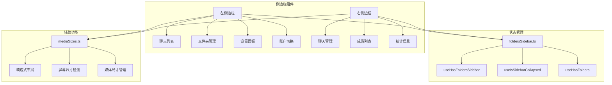
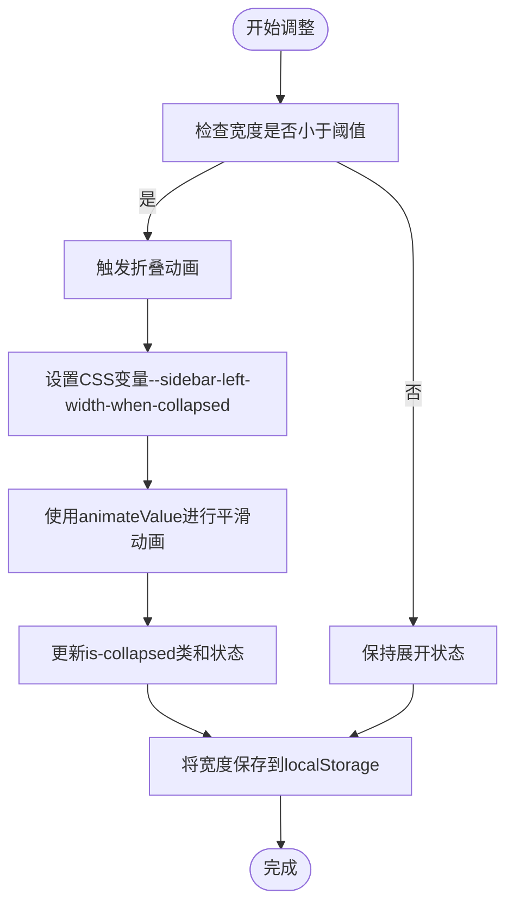
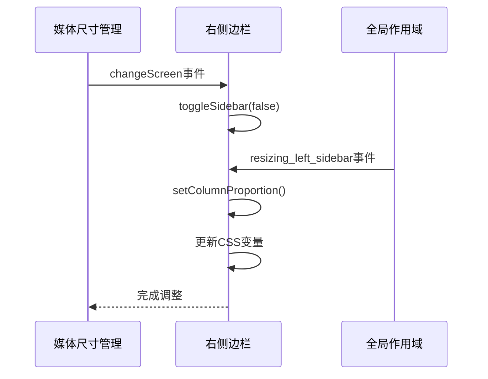
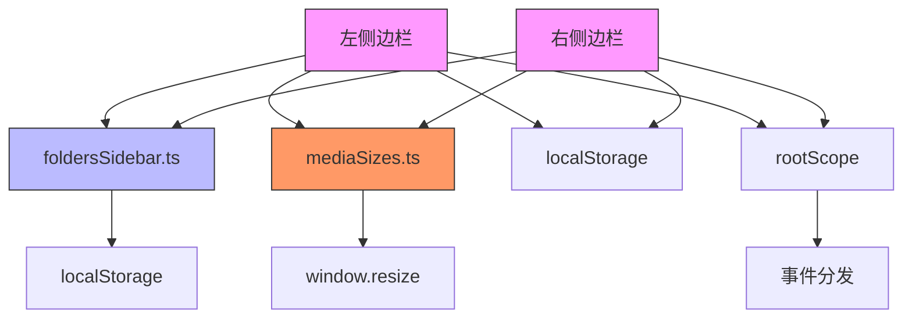

# 侧边栏

<cite>
**本文档中引用的文件**  
- [index.ts](file://src/components/sidebarLeft/index.ts)
- [index.ts](file://src/components/sidebarRight/index.ts)
- [constants.ts](file://src/components/sidebarLeft/constants.ts)
- [foldersSidebarContent/index.tsx](file://src/components/sidebarLeft/foldersSidebarContent/index.tsx)
- [foldersSidebar.ts](file://src/stores/foldersSidebar.ts)
- [mediaSizes.ts](file://src/helpers/mediaSizes.ts)
</cite>

## 目录
1. [简介](#简介)
2. [项目结构](#项目结构)
3. [核心组件](#核心组件)
4. [架构概述](#架构概述)
5. [详细组件分析](#详细组件分析)
6. [依赖分析](#依赖分析)
7. [性能考虑](#性能考虑)
8. [故障排除指南](#故障排除指南)
9. [结论](#结论)

## 简介
本文档全面介绍了Telegram Web应用中的侧边栏组件，包括左侧和右侧侧边栏的架构设计。文档详细说明了聊天列表、文件夹管理、设置面板和上下文信息展示功能，以及侧边栏的折叠/展开动画实现。还解释了左侧边栏的账户切换、聊天过滤和文件夹管理功能，以及右侧边栏的聊天管理、成员列表和统计信息展示功能。提供了侧边栏状态管理的实现细节，包括展开状态、选中项和滚动位置的持久化。记录了无障碍访问支持，如键盘导航、焦点管理和屏幕阅读器兼容性。包含了自定义主题和外观的配置选项，以及响应式布局在不同屏幕尺寸下的行为。

## 项目结构
侧边栏功能主要分布在`src/components/sidebarLeft`和`src/components/sidebarRight`目录中。左侧边栏包含聊天列表、文件夹管理、设置面板等功能，而右侧边栏主要负责聊天管理、成员列表和统计信息展示。状态管理通过`src/stores/foldersSidebar.ts`中的信号（signals）实现，动画和响应式行为由`src/helpers/mediaSizes.ts`控制。



**Diagram sources**  
- [index.ts](file://src/components/sidebarLeft/index.ts)
- [index.ts](file://src/components/sidebarRight/index.ts)
- [foldersSidebar.ts](file://src/stores/foldersSidebar.ts)
- [mediaSizes.ts](file://src/helpers/mediaSizes.ts)

**Section sources**
- [index.ts](file://src/components/sidebarLeft/index.ts)
- [index.ts](file://src/components/sidebarRight/index.ts)
- [foldersSidebar.ts](file://src/stores/foldersSidebar.ts)
- [mediaSizes.ts](file://src/helpers/mediaSizes.ts)

## 核心组件
侧边栏的核心组件包括左侧边栏的`AppSidebarLeft`类和右侧边栏的`AppSidebarRight`类。这些组件通过`SidebarSlider`基类实现滑动和导航功能。左侧边栏管理聊天列表、文件夹和设置，而右侧边栏处理聊天相关的详细信息展示。状态持久化通过localStorage实现，动画效果使用CSS变换和过渡。

**Section sources**
- [index.ts](file://src/components/sidebarLeft/index.ts)
- [index.ts](file://src/components/sidebarRight/index.ts)

## 架构概述
侧边栏架构采用模块化设计，左侧和右侧边栏分别独立实现但共享状态管理机制。左侧边栏提供主要导航功能，包括聊天列表、文件夹管理和设置访问。右侧边栏作为上下文面板，显示当前聊天的详细信息。两者通过全局状态(store)和事件系统进行通信，确保状态同步和响应式更新。

```mermaid
graph LR
A[左侧边栏] < --> B[全局状态]
C[右侧边栏] < --> B
D[媒体尺寸管理] --> A
D --> C
E[文件夹管理] --> A
F[聊天管理] --> C
B --> G[UI更新]
style A fill:#f9f,stroke:#333
style C fill:#f9f,stroke:#333
style B fill:#bbf,stroke:#333
style D fill:#f96,stroke:#333
```

**Diagram sources**  
- [index.ts](file://src/components/sidebarLeft/index.ts)
- [index.ts](file://src/components/sidebarRight/index.ts)
- [foldersSidebar.ts](file://src/stores/foldersSidebar.ts)
- [mediaSizes.ts](file://src/helpers/mediaSizes.ts)

## 详细组件分析

### 左侧边栏分析
左侧边栏是应用的主要导航区域，包含聊天列表、文件夹管理和设置访问功能。它实现了复杂的折叠/展开动画，通过CSS变量和JavaScript协同工作。侧边栏宽度可调整，最小宽度为308px，最大为420px，当宽度低于阈值时自动折叠。

#### 折叠/展开动画实现


**Diagram sources**  
- [index.ts](file://src/components/sidebarLeft/index.ts)
- [constants.ts](file://src/components/sidebarLeft/constants.ts)

#### 文件夹管理功能
左侧边栏的文件夹管理功能允许用户创建、编辑和删除聊天文件夹。通过`foldersSidebarContent`组件实现，支持拖拽排序和右键菜单操作。文件夹状态通过`useHasFoldersSidebar`和`useIsSidebarCollapsed`信号进行管理。

```mermaid
classDiagram
class FoldersSidebarContent {
+filters : MyDialogFilter[]
+isFiltersInited : boolean
+notificationsElement : HTMLElement
+hydrateFilters(filters) : void
+updateOrAddFolder(filter) : Promise~void~
+deleteFolder(filterId) : Promise~void~
+updateItemsOrder(order) : Promise~void~
+setSelectedFolder(folderId) : Promise~boolean~
}
class FolderItem {
+id : number
+icon : string
+notifications : number
+chatsCount : number
+name : string
+onClick() : void
}
FoldersSidebarContent --> FolderItem : "包含"
FoldersSidebarContent --> "Event Listeners" : "监听"
"Event Listeners" --> FoldersSidebarContent : "dialog_flush"
"Event Listeners" --> FoldersSidebarContent : "folder_unread"
"Event Listeners" --> FoldersSidebarContent : "filter_update"
"Event Listeners" --> FoldersSidebarContent : "filter_delete"
"Event Listeners" --> FoldersSidebarContent : "filter_order"
```

**Diagram sources**  
- [foldersSidebarContent/index.tsx](file://src/components/sidebarLeft/foldersSidebarContent/index.tsx)
- [foldersSidebar.ts](file://src/stores/foldersSidebar.ts)

### 右侧边栏分析
右侧边栏作为上下文面板，主要显示当前聊天的详细信息，如共享媒体、成员列表和聊天统计。它根据屏幕尺寸自动调整显示状态，在中等屏幕尺寸下会自动隐藏。

#### 显示/隐藏逻辑


**Diagram sources**  
- [index.ts](file://src/components/sidebarRight/index.ts)
- [mediaSizes.ts](file://src/helpers/mediaSizes.ts)

## 依赖分析
侧边栏组件依赖于多个核心模块，包括状态管理、媒体尺寸检测和事件系统。这些依赖关系确保了组件的响应式行为和状态持久化。



**Diagram sources**  
- [index.ts](file://src/components/sidebarLeft/index.ts)
- [index.ts](file://src/components/sidebarRight/index.ts)
- [foldersSidebar.ts](file://src/stores/foldersSidebar.ts)
- [mediaSizes.ts](file://src/helpers/mediaSizes.ts)

**Section sources**
- [index.ts](file://src/components/sidebarLeft/index.ts)
- [index.ts](file://src/components/sidebarRight/index.ts)
- [foldersSidebar.ts](file://src/stores/foldersSidebar.ts)
- [mediaSizes.ts](file://src/helpers/mediaSizes.ts)

## 性能考虑
侧边栏实现考虑了多个性能优化点。动画使用requestAnimationFrame确保流畅，状态更新采用节流(throttle)避免频繁存储。媒体查询通过MediaSizes类集中管理，减少重复计算。折叠/展开动画使用CSS变量而非直接操作样式，利用浏览器的优化机制。

**Section sources**
- [index.ts](file://src/components/sidebarLeft/index.ts)
- [index.ts](file://src/components/sidebarRight/index.ts)
- [mediaSizes.ts](file://src/helpers/mediaSizes.ts)

## 故障排除指南
常见问题包括侧边栏无法正确折叠、文件夹显示异常和响应式布局失效。检查localStorage中的侧边栏宽度设置，验证MediaSizes的屏幕尺寸检测是否准确，确认事件监听器是否正常工作。对于动画问题，检查CSS变量设置和animateValue函数的调用。

**Section sources**
- [index.ts](file://src/components/sidebarLeft/index.ts)
- [index.ts](file://src/components/sidebarRight/index.ts)
- [mediaSizes.ts](file://src/helpers/mediaSizes.ts)

## 结论
侧边栏组件通过模块化设计和响应式架构，提供了灵活的用户界面。左侧边栏作为主要导航区域，右侧边栏作为上下文面板，两者协同工作提供完整的用户体验。状态管理、动画效果和响应式行为的实现展示了现代Web应用开发的最佳实践。