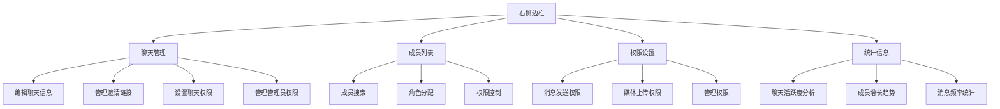
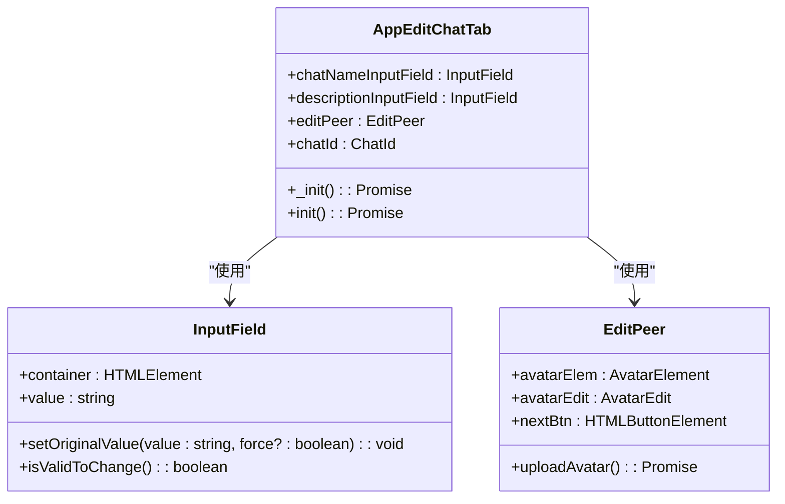
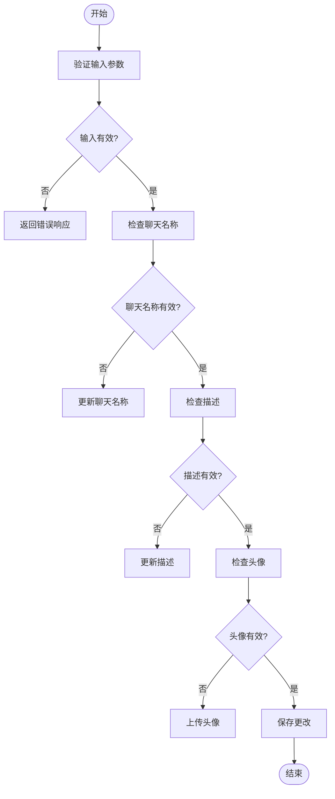
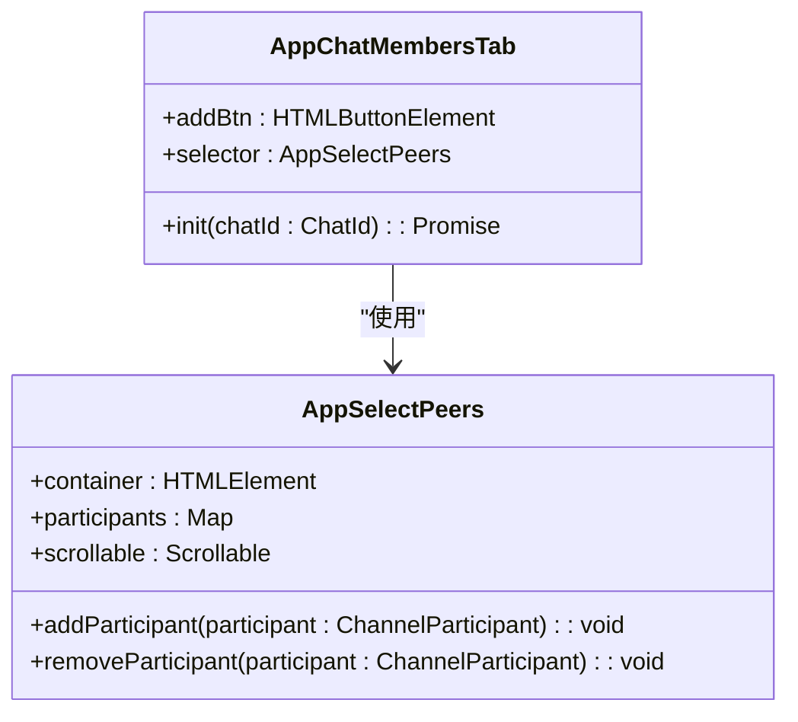
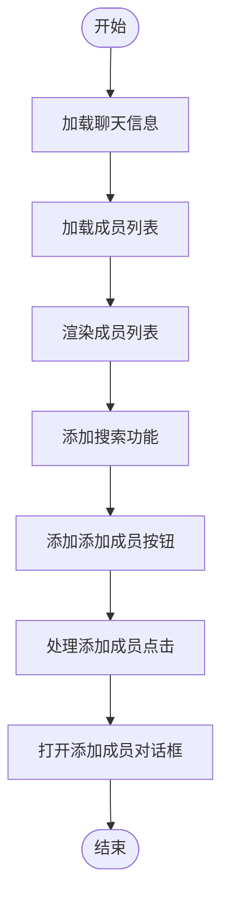
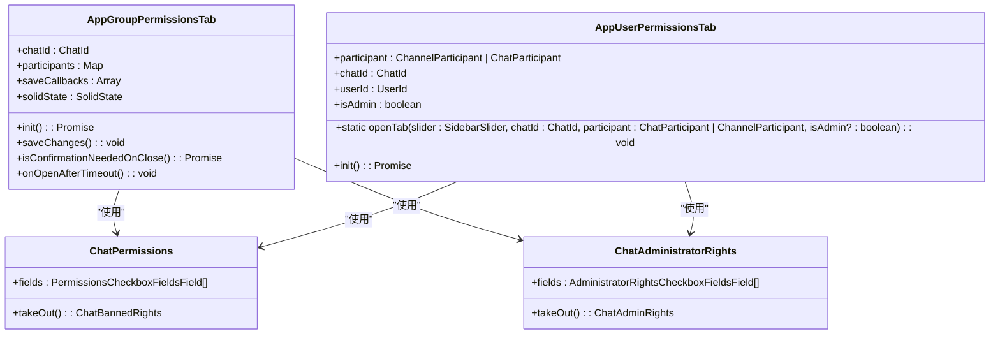
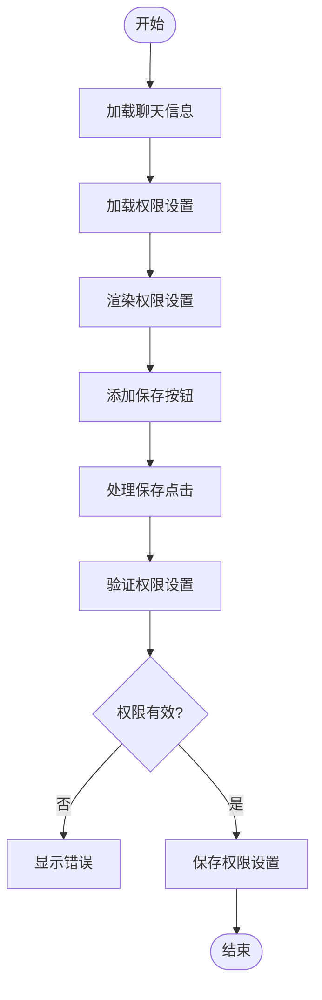
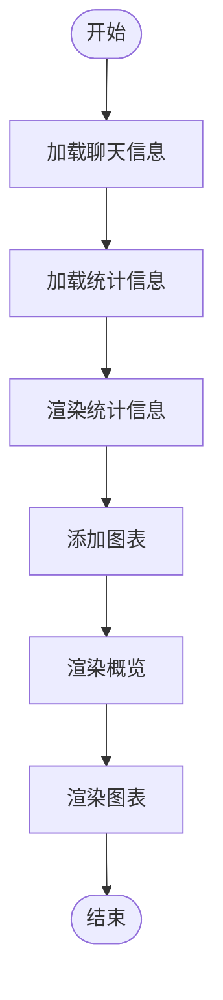
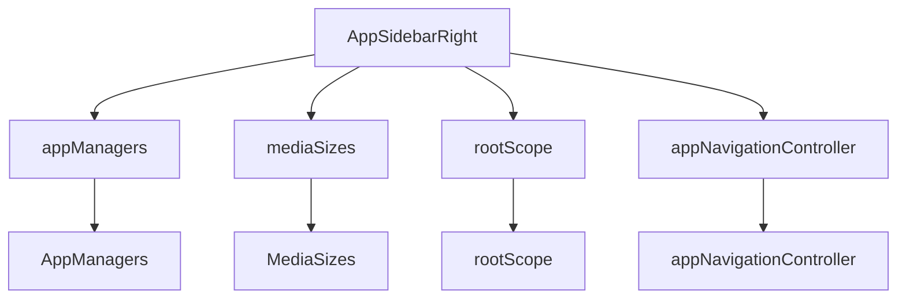

# 右侧边栏

<cite>
**本文档引用的文件**
- [index.ts](file://src/components/sidebarRight/index.ts)
- [editChat.ts](file://src/components/sidebarRight/tabs/editChat.ts)
- [chatMembers.ts](file://src/components/sidebarRight/tabs/chatMembers.ts)
- [groupPermissions/index.ts](file://src/components/sidebarRight/tabs/groupPermissions/index.ts)
- [userPermissions.ts](file://src/components/sidebarRight/tabs/userPermissions.ts)
- [chatInviteLinks.ts](file://src/components/sidebarRight/tabs/chatInviteLinks.ts)
- [statistics.tsx](file://src/components/sidebarRight/tabs/statistics.tsx)
- [mediaSizes.ts](file://src/helpers/mediaSizes.ts)
- [canFocus.ts](file://src/helpers/dom/canFocus.ts)
- [attachListNavigation.ts](file://src/helpers/dom/attachListNavigation.ts)
</cite>

## 目录
1. [简介](#简介)
2. [项目结构](#项目结构)
3. [核心组件](#核心组件)
4. [架构概述](#架构概述)
5. [详细组件分析](#详细组件分析)
6. [依赖分析](#依赖分析)
7. [性能考虑](#性能考虑)
8. [故障排除指南](#故障排除指南)
9. [结论](#结论)

## 简介
右侧边栏是应用程序中的一个关键功能区域，提供了对聊天管理、成员列表、权限设置和统计信息的全面访问。它允许用户编辑聊天信息、管理邀请链接、配置聊天权限、管理管理员权限、查看成员列表、分配角色以及查看详细的统计信息。本文档将深入分析右侧边栏的架构设计、实现细节和功能特性。

## 项目结构
右侧边栏的代码位于 `src/components/sidebarRight` 目录中，采用模块化设计，每个功能都有独立的组件文件。主要组件包括聊天管理、成员列表、权限设置和统计信息展示。这些组件通过事件系统和状态管理进行通信，确保了功能的独立性和可维护性。



**Diagram sources**
- [index.ts](file://src/components/sidebarRight/index.ts)
- [editChat.ts](file://src/components/sidebarRight/tabs/editChat.ts)
- [chatMembers.ts](file://src/components/sidebarRight/tabs/chatMembers.ts)
- [groupPermissions/index.ts](file://src/components/sidebarRight/tabs/groupPermissions/index.ts)
- [userPermissions.ts](file://src/components/sidebarRight/tabs/userPermissions.ts)
- [chatInviteLinks.ts](file://src/components/sidebarRight/tabs/chatInviteLinks.ts)
- [statistics.tsx](file://src/components/sidebarRight/tabs/statistics.tsx)

**Section sources**
- [index.ts](file://src/components/sidebarRight/index.ts#L1-L216)

## 核心组件
右侧边栏的核心组件包括聊天管理、成员列表、权限设置和统计信息展示。这些组件通过事件系统和状态管理进行通信，确保了功能的独立性和可维护性。

**Section sources**
- [index.ts](file://src/components/sidebarRight/index.ts#L1-L216)
- [editChat.ts](file://src/components/sidebarRight/tabs/editChat.ts#L1-L741)
- [chatMembers.ts](file://src/components/sidebarRight/tabs/chatMembers.ts#L1-L121)
- [groupPermissions/index.ts](file://src/components/sidebarRight/tabs/groupPermissions/index.ts#L1-L718)
- [userPermissions.ts](file://src/components/sidebarRight/tabs/userPermissions.ts#L1-L281)
- [chatInviteLinks.ts](file://src/components/sidebarRight/tabs/chatInviteLinks.ts#L1-L666)
- [statistics.tsx](file://src/components/sidebarRight/tabs/statistics.tsx#L1-L1066)

## 架构概述
右侧边栏的架构设计遵循模块化原则，每个功能都有独立的组件文件。这些组件通过事件系统和状态管理进行通信，确保了功能的独立性和可维护性。主要组件包括聊天管理、成员列表、权限设置和统计信息展示。

```mermaid
classDiagram
class AppSidebarRight {
+RIGHT_COLUMN_ACTIVE_CLASSNAME : string
+isColumnProportionSet : boolean
+sharedMediaTab : AppSharedMediaTab
+construct(managers : AppManagers) : void
+createSharedMediaTab() : AppSharedMediaTab
+replaceSharedMediaTab(tab? : AppSharedMediaTab) : void
+onCloseTab(id : number, animate : boolean, isNavigation? : boolean) : void
+setColumnProportion() : number
+hide() : void
+toggleSidebar(enable? : boolean, animate? : boolean) : Promise<void>
}
class AppEditChatTab {
+chatNameInputField : InputField
+descriptionInputField : InputField
+editPeer : EditPeer
+chatId : ChatId
+_init() : Promise<void>
+init() : Promise<void>
}
class AppChatMembersTab {
+addBtn : HTMLButtonElement
+selector : AppSelectPeers
+init(chatId : ChatId) : Promise<void>
}
class AppGroupPermissionsTab {
+chatId : ChatId
+participants : Map<PeerId, ChannelParticipant.channelParticipantBanned>
+saveCallbacks : Array<NoneToVoidFunction>
+solidState : SolidState
+init() : Promise<void>
+saveChanges() : void
+isConfirmationNeededOnClose() : Promise<void>
+onOpenAfterTimeout() : void
}
class AppUserPermissionsTab {
+participant : ChannelParticipant | ChatParticipant
+chatId : ChatId
+userId : UserId
+isAdmin : boolean
+static openTab(slider : SidebarSlider, chatId : ChatId, participant : ChatParticipant | ChannelParticipant, isAdmin? : boolean) : void
+init() : Promise<void>
}
class AppChatInviteLinksTab {
+chatId : ChatId
+adminId : UserId
+menuButtons : ButtonMenuItemOptionsVerifiable[]
+actions : {revokeLink : () => void, deleteLink : () => void, editLink : () => void}
+static getInitArgs(chatId : ChatId, adminId? : UserId) : Promise<any>
+init({chatId, adminId, p} : {chatId : ChatId, adminId? : UserId, p? : any}) : Promise<void>
}
class AppStatisticsTab {
+chatId : ChatId
+mid : number
+storyId : number
+stats : StatsBroadcastStats | StatsMegagroupStats | StatsMessageStats | StatsStoryStats
+messages : Map<number, Message.message>
+stories : Map<number, StoryItem.storyItem>
+dcId : DcId
+openPromise : CancellablePromise<void>
+isBroadcast : boolean
+isMegagroup : boolean
+isMessage : boolean
+isStory : boolean
+onOpenAfterTimeout() : void
+_construct(recentPosts : {container : HTMLElement, postInteractionCounters : PostInteractionCounters}[], topPosters : {container : HTMLElement, peerId : PeerId}[], topAdmins : {container : HTMLElement, peerId : PeerId}[], topInviters : {container : HTMLElement, peerId : PeerId}[], publicForwards : Accessor<LoadableList>, currentPost : (typeof recentPosts)[0]) : JSX.Element
+renderRecentPost(postInteractionCounters : PostInteractionCounters, peerId? : PeerId, message? : Message.message, storyItem? : StoryItem.storyItem, noLabels? : boolean) : Promise<{container : HTMLElement, postInteractionCounters : PostInteractionCounters}>
+renderPeer(peer : StatsGroupTopPoster | StatsGroupTopAdmin | StatsGroupTopInviter | Message.message) : Promise<{container : HTMLElement, peerId : PeerId}>
+renderPublicForward(publicForward : PublicForward) : Promise<{container : HTMLElement, postInteractionCounters : PostInteractionCounters}>
}
AppSidebarRight --> AppEditChatTab : "包含"
AppSidebarRight --> AppChatMembersTab : "包含"
AppSidebarRight --> AppGroupPermissionsTab : "包含"
AppSidebarRight --> AppUserPermissionsTab : "包含"
AppSidebarRight --> AppChatInviteLinksTab : "包含"
AppSidebarRight --> AppStatisticsTab : "包含"
```

**Diagram sources**
- [index.ts](file://src/components/sidebarRight/index.ts#L1-L216)
- [editChat.ts](file://src/components/sidebarRight/tabs/editChat.ts#L1-L741)
- [chatMembers.ts](file://src/components/sidebarRight/tabs/chatMembers.ts#L1-L121)
- [groupPermissions/index.ts](file://src/components/sidebarRight/tabs/groupPermissions/index.ts#L1-L718)
- [userPermissions.ts](file://src/components/sidebarRight/tabs/userPermissions.ts#L1-L281)
- [chatInviteLinks.ts](file://src/components/sidebarRight/tabs/chatInviteLinks.ts#L1-L666)
- [statistics.tsx](file://src/components/sidebarRight/tabs/statistics.tsx#L1-L1066)

## 详细组件分析

### 聊天管理分析
聊天管理功能允许用户编辑聊天信息、管理邀请链接、设置聊天权限和管理管理员权限。这些功能通过 `AppEditChatTab` 组件实现，该组件提供了丰富的用户界面和交互逻辑。

#### 聊天管理类图


**Diagram sources**
- [editChat.ts](file://src/components/sidebarRight/tabs/editChat.ts#L1-L741)

#### 聊天管理流程图


**Diagram sources**
- [editChat.ts](file://src/components/sidebarRight/tabs/editChat.ts#L1-L741)

**Section sources**
- [editChat.ts](file://src/components/sidebarRight/tabs/editChat.ts#L1-L741)

### 成员列表分析
成员列表功能允许用户查看和管理聊天成员，包括成员搜索、角色分配和权限控制。这些功能通过 `AppChatMembersTab` 组件实现，该组件提供了高效的成员列表渲染和交互逻辑。

#### 成员列表类图


**Diagram sources**
- [chatMembers.ts](file://src/components/sidebarRight/tabs/chatMembers.ts#L1-L121)

#### 成员列表流程图


**Diagram sources**
- [chatMembers.ts](file://src/components/sidebarRight/tabs/chatMembers.ts#L1-L121)

**Section sources**
- [chatMembers.ts](file://src/components/sidebarRight/tabs/chatMembers.ts#L1-L121)

### 权限设置分析
权限设置功能允许用户配置消息发送权限、媒体上传权限和管理权限。这些功能通过 `AppGroupPermissionsTab` 和 `AppUserPermissionsTab` 组件实现，提供了灵活的权限管理界面。

#### 权限设置类图


**Diagram sources**
- [groupPermissions/index.ts](file://src/components/sidebarRight/tabs/groupPermissions/index.ts#L1-L718)
- [userPermissions.ts](file://src/components/sidebarRight/tabs/userPermissions.ts#L1-L281)

#### 权限设置流程图


**Diagram sources**
- [groupPermissions/index.ts](file://src/components/sidebarRight/tabs/groupPermissions/index.ts#L1-L718)
- [userPermissions.ts](file://src/components/sidebarRight/tabs/userPermissions.ts#L1-L281)

**Section sources**
- [groupPermissions/index.ts](file://src/components/sidebarRight/tabs/groupPermissions/index.ts#L1-L718)
- [userPermissions.ts](file://src/components/sidebarRight/tabs/userPermissions.ts#L1-L281)

### 统计信息分析
统计信息功能允许用户查看聊天活跃度分析、成员增长趋势和消息频率统计。这些功能通过 `AppStatisticsTab` 组件实现，提供了丰富的图表和数据可视化。

#### 统计信息类图
```mermaid
classDiagram
class AppStatisticsTab {
+chatId : ChatId
+mid : number
+storyId : number
+stats : StatsBroadcastStats | StatsMegagroupStats | StatsMessageStats | StatsStoryStats
+messages : Map<number, Message.message>
+stories : Map<number, StoryItem.storyItem>
+dcId : DcId
+openPromise : CancellablePromise<void>
+isBroadcast : boolean
+isMegagroup : boolean
+isMessage : boolean
+isStory : boolean
+onOpenAfterTimeout() : void
+_construct(recentPosts : {container : HTMLElement, postInteractionCounters : PostInteractionCounters}[], topPosters : {container : HTMLElement, peerId : PeerId}[], topAdmins : {container : HTMLElement, peerId : PeerId}[], topInviters : {container : HTMLElement, peerId : PeerId}[], publicForwards : Accessor<LoadableList>, currentPost : (typeof recentPosts)[0]) : JSX.Element
+renderRecentPost(postInteractionCounters : PostInteractionCounters, peerId? : PeerId, message? : Message.message, storyItem? : StoryItem.storyItem, noLabels? : boolean) : Promise<{container : HTMLElement, postInteractionCounters : PostInteractionCounters}>
+renderPeer(peer : StatsGroupTopPoster | StatsGroupTopAdmin | StatsGroupTopInviter | Message.message) : Promise<{container : HTMLElement, peerId : PeerId}>
+renderPublicForward(publicForward : PublicForward) : Promise<{container : HTMLElement, postInteractionCounters : PostInteractionCounters}>
}
class TChart {
+render(options : TChartOptions) : TChartInstance
}
class StatisticsOverviewItem {
+value : StatsAbsValueAndPrev | StatsPercentValue
+title : LangPackKey
+includeZeroValue? : boolean
+describePercentage? : boolean
}
AppStatisticsTab --> TChart : "使用"
AppStatisticsTab --> StatisticsOverviewItem : "使用"
```

**Diagram sources**
- [statistics.tsx](file://src/components/sidebarRight/tabs/statistics.tsx#L1-L1066)

#### 统计信息流程图


**Diagram sources**
- [statistics.tsx](file://src/components/sidebarRight/tabs/statistics.tsx#L1-L1066)

**Section sources**
- [statistics.tsx](file://src/components/sidebarRight/tabs/statistics.tsx#L1-L1066)

## 依赖分析
右侧边栏的组件依赖于多个核心模块和工具，包括 `appManagers`、`mediaSizes`、`rootScope` 和 `appNavigationController`。这些依赖确保了组件的功能完整性和交互性。



**Diagram sources**
- [index.ts](file://src/components/sidebarRight/index.ts#L1-L216)

**Section sources**
- [index.ts](file://src/components/sidebarRight/index.ts#L1-L216)

## 性能考虑
右侧边栏的设计考虑了性能优化，包括懒加载、虚拟滚动和状态管理。这些优化确保了在处理大量数据时的流畅性和响应性。

**Section sources**
- [index.ts](file://src/components/sidebarRight/index.ts#L1-L216)
- [editChat.ts](file://src/components/sidebarRight/tabs/editChat.ts#L1-L741)
- [chatMembers.ts](file://src/components/sidebarRight/tabs/chatMembers.ts#L1-L121)
- [groupPermissions/index.ts](file://src/components/sidebarRight/tabs/groupPermissions/index.ts#L1-L718)
- [userPermissions.ts](file://src/components/sidebarRight/tabs/userPermissions.ts#L1-L281)
- [chatInviteLinks.ts](file://src/components/sidebarRight/tabs/chatInviteLinks.ts#L1-L666)
- [statistics.tsx](file://src/components/sidebarRight/tabs/statistics.tsx#L1-L1066)

## 故障排除指南
在使用右侧边栏时，可能会遇到一些常见问题，如组件加载失败、权限设置不生效等。以下是一些常见的故障排除步骤：

1. **检查网络连接**：确保网络连接正常，避免因网络问题导致组件加载失败。
2. **清除缓存**：清除浏览器缓存，重新加载页面。
3. **检查权限**：确保当前用户具有足够的权限进行相关操作。
4. **查看日志**：查看浏览器控制台日志，查找错误信息。

**Section sources**
- [index.ts](file://src/components/sidebarRight/index.ts#L1-L216)
- [editChat.ts](file://src/components/sidebarRight/tabs/editChat.ts#L1-L741)
- [chatMembers.ts](file://src/components/sidebarRight/tabs/chatMembers.ts#L1-L121)
- [groupPermissions/index.ts](file://src/components/sidebarRight/tabs/groupPermissions/index.ts#L1-L718)
- [userPermissions.ts](file://src/components/sidebarRight/tabs/userPermissions.ts#L1-L281)
- [chatInviteLinks.ts](file://src/components/sidebarRight/tabs/chatInviteLinks.ts#L1-L666)
- [statistics.tsx](file://src/components/sidebarRight/tabs/statistics.tsx#L1-L1066)

## 结论
右侧边栏是一个功能丰富且设计精良的组件，提供了对聊天管理、成员列表、权限设置和统计信息的全面访问。通过模块化设计和高效的性能优化，右侧边栏确保了用户在使用过程中的流畅体验。本文档详细介绍了右侧边栏的架构设计、实现细节和功能特性，为开发者提供了全面的参考。