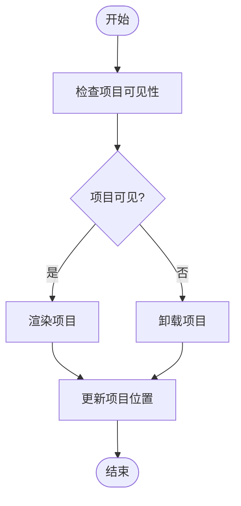
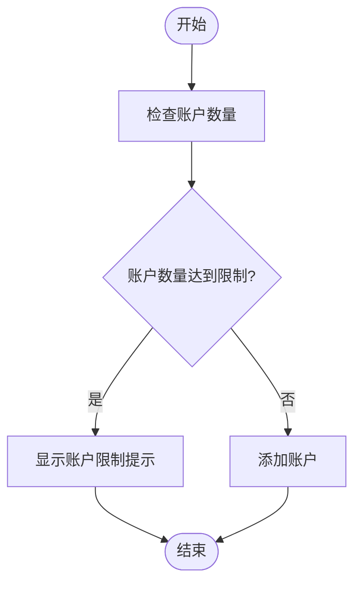
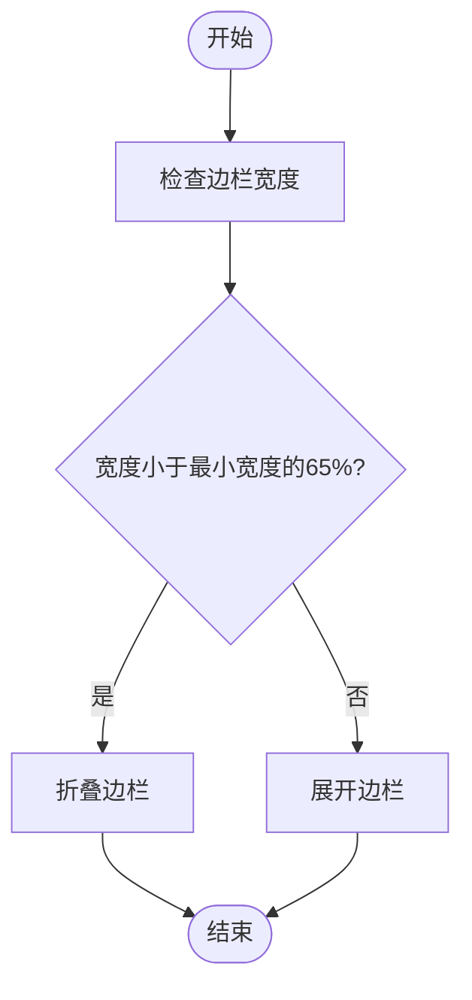

# 左侧边栏

<cite>
**本文档引用的文件**
- [index.ts](file://src/components/sidebarLeft/index.ts)
- [foldersSidebarContent/index.tsx](file://src/components/sidebarLeft/foldersSidebarContent/index.tsx)
- [tabs/settings.ts](file://src/components/sidebarLeft/tabs/settings.ts)
- [tabs/chatFolders.ts](file://src/components/sidebarLeft/tabs/chatFolders.ts)
- [dynamicVirtualList/index.tsx](file://src/components/dynamicVirtualList/index.tsx)
- [sortedDialogList.ts](file://src/components/sortedDialogList.ts)
- [appDialogsManager.ts](file://src/lib/appManagers/appDialogsManager.ts)
- [foldersSidebar.ts](file://src/stores/foldersSidebar.ts)
- [accountController.ts](file://src/lib/accounts/accountController.ts)
- [changeAccount.ts](file://src/lib/accounts/changeAccount.ts)
- [accountsLimitPopupContent.tsx](file://src/components/sidebarLeft/accountsLimitPopupContent.tsx)
- [constants.ts](file://src/components/sidebarLeft/constants.ts)
- [privacyAndSecurity.ts](file://src/components/sidebarLeft/tabs/privacyAndSecurity.ts)
- [notifications.tsx](file://src/components/sidebarLeft/tabs/notifications.tsx)
- [dataAndStorage.ts](file://src/components/sidebarLeft/tabs/dataAndStorage.ts)
</cite>

## 目录
1. [架构设计](#架构设计)
2. [聊天列表](#聊天列表)
3. [文件夹管理](#文件夹管理)
4. [账户切换](#账户切换)
5. [设置面板](#设置面板)
6. [状态管理](#状态管理)
7. [无障碍访问](#无障碍访问)
8. [响应式布局](#响应式布局)

## 架构设计

左侧边栏是应用程序的核心导航组件，负责管理聊天列表、文件夹、账户切换和设置导航。它由 `AppSidebarLeft` 类实现，继承自 `SidebarSlider`，提供了丰富的功能和交互。

**Section sources**
- [index.ts](file://src/components/sidebarLeft/index.ts#L113-L145)

## 聊天列表

聊天列表是左侧边栏的核心功能，用于显示用户的对话列表。它使用虚拟滚动技术来优化性能，只渲染可见区域的聊天项。

### 虚拟滚动实现

聊天列表使用 `DynamicVirtualList` 组件来实现虚拟滚动。该组件通过动态加载和卸载聊天项来优化性能，确保在处理大量聊天时仍能保持流畅的滚动体验。

**Diagram sources**
- [dynamicVirtualList/index.tsx](file://src/components/dynamicVirtualList/index.tsx#L1-L388)
- [sortedDialogList.ts](file://src/components/sortedDialogList.ts#L60-L178)

### 性能优化

聊天列表通过以下方式优化性能：
- **动态加载**：只加载当前可见区域的聊天项。
- **缓存高度**：缓存每个聊天项的高度，避免重复计算。
- **批量更新**：批量更新聊天项的位置，减少重绘次数。

**Section sources**
- [dynamicVirtualList/index.tsx](file://src/components/dynamicVirtualList/index.tsx#L1-L388)
- [sortedDialogList.ts](file://src/components/sortedDialogList.ts#L60-L178)

### 滚动位置持久化

聊天列表的滚动位置通过 `useScrollTop` 钩子进行持久化。当用户离开聊天列表并返回时，滚动位置会被恢复到之前的状态。

**Section sources**
- [hooks/useScrollTop.ts](file://src/hooks/useScrollTop.ts)

## 文件夹管理

文件夹管理功能允许用户创建和管理自定义文件夹，以便更好地组织聊天。

### 自定义文件夹创建

用户可以通过点击“新建文件夹”按钮来创建自定义文件夹。每个文件夹可以包含多个聊天，并且可以设置不同的过滤规则。

**Section sources**
- [tabs/chatFolders.ts](file://src/components/sidebarLeft/tabs/chatFolders.ts#L238-L244)

### 聊天分配

用户可以将聊天分配到不同的文件夹中。文件夹管理器会根据用户的设置自动将聊天分配到相应的文件夹。

**Section sources**
- [foldersSidebarContent/index.tsx](file://src/components/sidebarLeft/foldersSidebarContent/index.tsx#L274-L334)

### 过滤规则配置

用户可以为每个文件夹配置过滤规则，例如包含或排除特定的聊天类型。这些规则可以帮助用户更精确地管理聊天。

**Section sources**
- [tabs/chatFolders.ts](file://src/components/sidebarLeft/tabs/chatFolders.ts#L379-L413)

## 账户切换

账户切换功能允许用户在多个账户之间切换，方便管理不同的身份。

### 多账户支持

应用程序支持最多4个账户。用户可以通过点击“添加账户”按钮来添加新的账户。

**Section sources**
- [accountController.ts](file://src/lib/accounts/accountController.ts#L16-L20)

### 账户限制提示

当用户尝试添加超过免费账户限制的账户时，会显示账户限制提示。用户可以选择升级到高级账户以解除限制。

**Diagram sources**
- [accountsLimitPopupContent.tsx](file://src/components/sidebarLeft/accountsLimitPopupContent.tsx#L1-L33)
- [index.ts](file://src/components/sidebarLeft/index.ts#L659-L666)

### 账户信息展示

账户切换菜单中会显示当前账户的信息，包括账户名称和头像。用户可以点击账户信息来切换到其他账户。

**Section sources**
- [index.ts](file://src/components/sidebarLeft/index.ts#L784-L799)

## 设置面板

设置面板提供了多种设置选项，包括隐私与安全、通知、数据和存储、语言等。

### 隐私与安全

隐私与安全设置允许用户管理账户的隐私设置，例如谁可以看到他们的在线状态、谁可以给他们发送消息等。

**Section sources**
- [tabs/privacyAndSecurity.ts](file://src/components/sidebarLeft/tabs/privacyAndSecurity.ts#L51-L200)

### 通知

通知设置允许用户管理不同类型的通知，例如桌面通知、推送通知等。

**Section sources**
- [tabs/notifications.tsx](file://src/components/sidebarLeft/tabs/notifications.tsx#L1-L200)

### 数据和存储

数据和存储设置允许用户管理自动下载设置，例如自动下载照片、视频和文件的大小限制。

**Section sources**
- [tabs/dataAndStorage.ts](file://src/components/sidebarLeft/tabs/dataAndStorage.ts#L1-L184)

### 语言

语言设置允许用户选择应用程序的语言。

**Section sources**
- [tabs/language.tsx](file://src/components/sidebarLeft/tabs/language.tsx)

## 状态管理

左侧边栏的状态管理包括展开/折叠状态、选中标签页和滚动位置的持久化。

### 展开/折叠状态

左侧边栏的展开/折叠状态通过 `useIsSidebarCollapsed` 钩子进行管理。当用户调整边栏宽度时，如果宽度小于最小宽度的65%，边栏会自动折叠。

**Diagram sources**
- [constants.ts](file://src/components/sidebarLeft/constants.ts#L1-L4)
- [foldersSidebar.ts](file://src/stores/foldersSidebar.ts#L27-L34)

### 选中标签页

选中标签页的状态通过 `selectedFolderId` 信号进行管理。当用户点击某个文件夹时，该文件夹会被选中，并且聊天列表会显示该文件夹中的聊天。

**Section sources**
- [foldersSidebarContent/index.tsx](file://src/components/sidebarLeft/foldersSidebarContent/index.tsx#L50-L51)

### 滚动位置持久化

滚动位置的持久化通过 `useScrollTop` 钩子实现。当用户离开聊天列表并返回时，滚动位置会被恢复到之前的状态。

**Section sources**
- [hooks/useScrollTop.ts](file://src/hooks/useScrollTop.ts)

## 无障碍访问

左侧边栏支持无障碍访问，包括键盘导航、焦点管理和屏幕阅读器兼容性。

### 键盘导航

用户可以通过键盘导航来操作左侧边栏。例如，使用 `Ctrl+F` 快捷键可以快速聚焦到搜索框。

**Section sources**
- [index.ts](file://src/components/sidebarLeft/index.ts#L378-L381)

### 焦点管理

左侧边栏通过 `useFocus` 钩子管理焦点。当用户打开或关闭某个功能时，焦点会自动移动到相应的位置。

**Section sources**
- [hooks/useFocus.ts](file://src/hooks/useFocus.ts)

### 屏幕阅读器兼容性

左侧边栏的每个元素都具有适当的 `aria-label` 属性，以确保屏幕阅读器能够正确读取内容。

**Section sources**
- [components/row.ts](file://src/components/row.ts)

## 响应式布局

左侧边栏的响应式布局确保在不同屏幕尺寸下都能正常显示。

### 不同屏幕尺寸下的行为

- **小屏幕**：边栏会自动折叠，用户可以通过点击按钮来展开。
- **大屏幕**：边栏保持展开状态，用户可以通过拖动边框来调整宽度。

**Section sources**
- [constants.ts](file://src/components/sidebarLeft/constants.ts#L1-L4)
- [foldersSidebar.ts](file://src/stores/foldersSidebar.ts#L36-L55)

### 与主聊天界面的交互逻辑

左侧边栏与主聊天界面通过 `appImManager` 进行交互。当用户在左侧边栏中选择一个聊天时，主聊天界面会显示该聊天的内容。

**Section sources**
- [appDialogsManager.ts](file://src/lib/appManagers/appDialogsManager.ts#L117-L200)