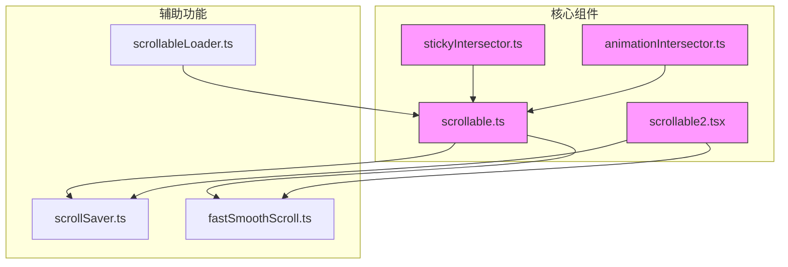
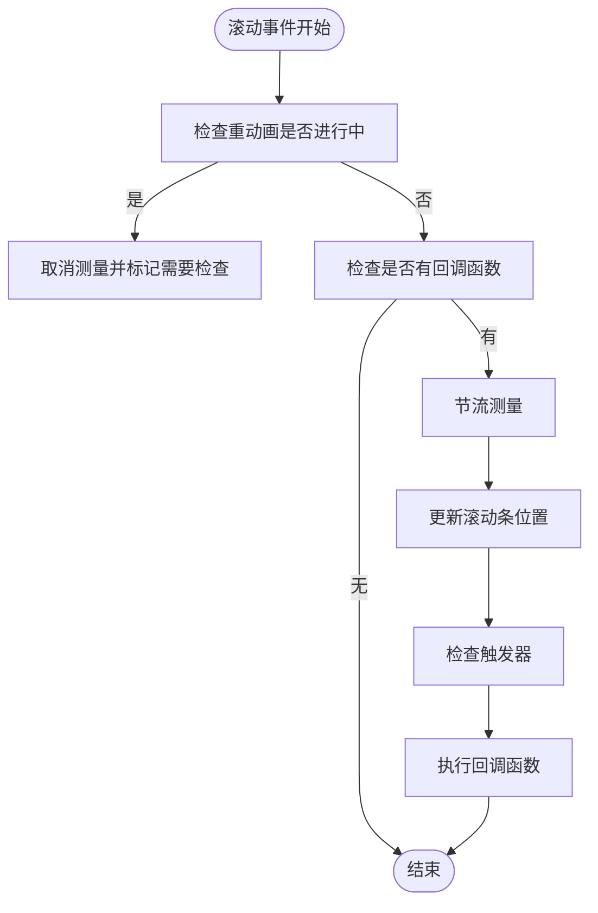
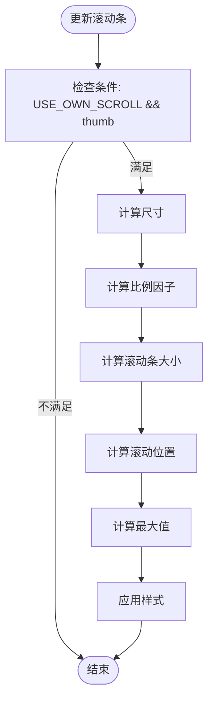
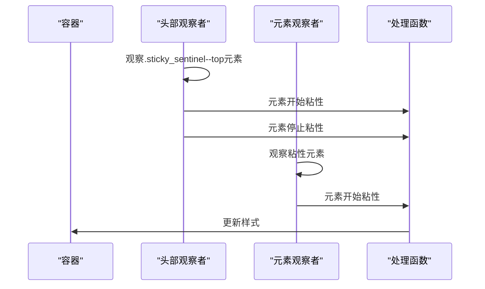
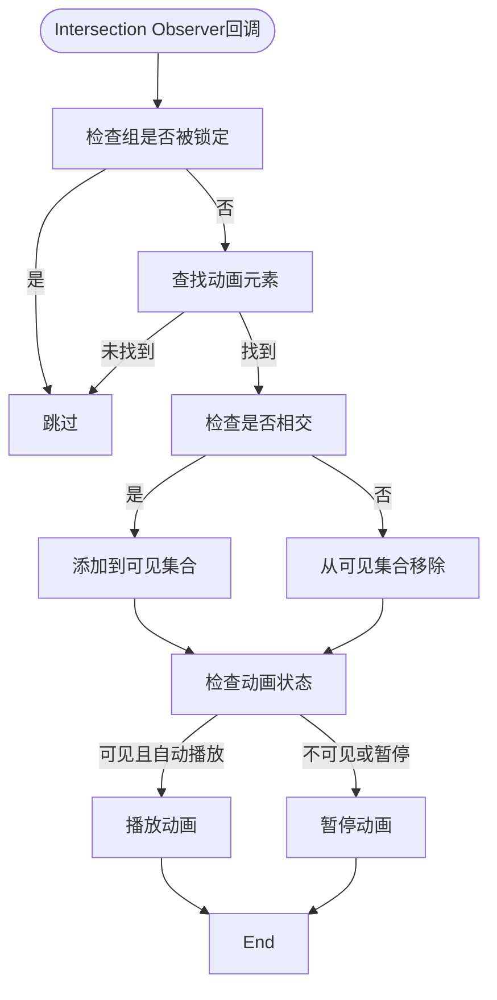
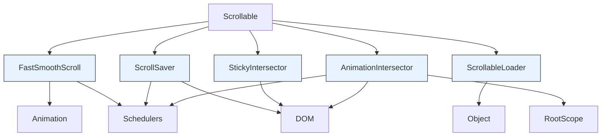
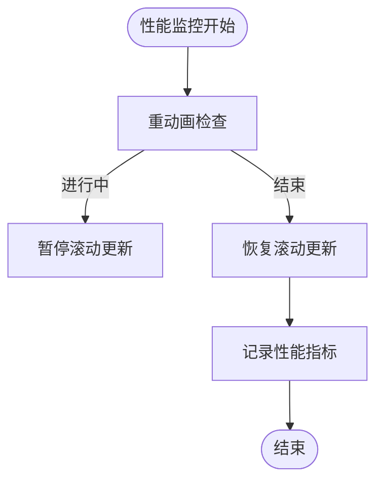

# 可滚动容器

<cite>
**本文档引用的文件**
- [scrollable.ts](file://src/components/scrollable.ts)
- [scrollable2.tsx](file://src/components/scrollable2.tsx)
- [stickyIntersector.ts](file://src/components/stickyIntersector.ts)
- [animationIntersector.ts](file://src/components/animationIntersector.ts)
- [scrollSaver.ts](file://src/helpers/scrollSaver.ts)
- [fastSmoothScroll.ts](file://src/helpers/fastSmoothScroll.ts)
- [scrollableLoader.ts](file://src/helpers/scrollableLoader.ts)
</cite>

## 目录
1. [简介](#简介)
2. [项目结构](#项目结构)
3. [核心组件](#核心组件)
4. [架构概述](#架构概述)
5. [详细组件分析](#详细组件分析)
6. [依赖分析](#依赖分析)
7. [性能考虑](#性能考虑)
8. [故障排除指南](#故障排除指南)
9. [结论](#结论)

## 简介
本文档全面介绍了可滚动容器组件的实现，包括滚动事件处理、滚动条样式定制、滚动性能优化和跨浏览器兼容性。详细说明了stickyIntersector和animationIntersector的交互动画实现，解释它们如何检测元素在视口中的可见性并触发动画效果。提供了滚动位置保存和恢复的实现细节，确保用户在页面导航后能回到之前的滚动位置。记录了滚动性能监控工具，包括帧率监测、滚动延迟分析和内存使用情况。包含响应式滚动策略，适配触摸设备和鼠标滚轮的不同交互模式。说明了滚动阻尼、惯性滚动和边缘反弹效果的配置选项。

## 项目结构
可滚动容器组件主要位于`src/components`目录下，相关辅助功能位于`src/helpers`目录。核心文件包括`scrollable.ts`、`scrollable2.tsx`、`stickyIntersector.ts`和`animationIntersector.ts`。滚动性能优化和位置保存功能由`fastSmoothScroll.ts`和`scrollSaver.ts`提供。



**图示来源**
- [scrollable.ts](file://src/components/scrollable.ts)
- [scrollable2.tsx](file://src/components/scrollable2.tsx)
- [stickyIntersector.ts](file://src/components/stickyIntersector.ts)
- [animationIntersector.ts](file://src/components/animationIntersector.ts)
- [scrollSaver.ts](file://src/helpers/scrollSaver.ts)
- [fastSmoothScroll.ts](file://src/helpers/fastSmoothScroll.ts)
- [scrollableLoader.ts](file://src/helpers/scrollableLoader.ts)

**章节来源**
- [scrollable.ts](file://src/components/scrollable.ts)
- [scrollable2.tsx](file://src/components/scrollable2.tsx)

## 核心组件
可滚动容器组件的核心实现包括`ScrollableBase`基类和`Scrollable`子类，提供了垂直和水平滚动功能。`ScrollableX`类专门处理水平滚动，支持鼠标滚轮在非触摸设备上的横向滚动。组件支持自定义滚动条样式，通过`USE_OWN_SCROLL`标志根据浏览器支持情况决定是否使用原生滚动条。

**章节来源**
- [scrollable.ts](file://src/components/scrollable.ts#L70-L483)
- [scrollable2.tsx](file://src/components/scrollable2.tsx#L41-L336)

## 架构概述
可滚动容器组件采用分层架构设计，基础层`ScrollableBase`提供通用滚动功能，包括滚动事件监听、滚动位置计算和滚动条更新。`Scrollable`和`ScrollableX`类继承基础功能并添加特定方向的滚动支持。`stickyIntersector`和`animationIntersector`组件通过Intersection Observer API实现元素可见性检测和动画控制。

```mermaid
classDiagram
class ScrollableBase {
+padding : HTMLElement
+splitUp : HTMLElement
+onScrollMeasure : number
+lastScrollPosition : number
+lastScrollDirection : number
+onAdditionalScroll : () => void
+onScrolledTop : () => void
+onScrolledBottom : () => void
+isHeavyAnimationInProgress : boolean
+needCheckAfterAnimation : boolean
+checkForTriggers? : () => void
+scrollPositionProperty : 'scrollTop' | 'scrollLeft'
+scrollSizeProperty : 'scrollHeight' | 'scrollWidth'
+clientSizeProperty : 'clientHeight' | 'clientWidth'
+offsetSizeProperty : 'offsetWidth' | 'offsetHeight'
+clientAxis : 'clientY' | 'clientX'
+startMousePosition : number
+startScrollPosition : number
+thumb : HTMLElement
+thumbContainer : HTMLElement
+removeHeavyAnimationListener : () => void
+addedScrollListener : boolean
+el? : HTMLElement
+container : HTMLElement
+log : ReturnType<typeof logger>
+addScrollListener()
+removeScrollListener()
+setListeners()
+removeListeners()
+destroy()
+prepend(...elements : (string | Node)[])
+append(...elements : (string | Node)[])
+scrollIntoViewNew(options : Omit<ScrollOptions, 'container'>)
+onScroll()
+updateThumb(scrollPosition : number)
+cancelMeasure()
+onMouseMove(e : MouseEvent)
+onMouseDown(e : MouseEvent)
+onMouseUp(e : MouseEvent)
+onSizeChange()
+getDistanceToEnd()
+isScrolledToEnd : boolean
+scrollPosition : number
+scrollSize : number
+clientSize : number
+offsetSize : number
+firstElementChild : Element
+setScrollPositionSilently(value : number)
+ignoreNextScrollEvent()
+replaceChildren(...args : (string | Node)[])
}
class Scrollable {
+loadedAll : SliceSidesContainer
+onScrollOffset : number
+constructor(el? : HTMLElement, logPrefix : string, onScrollOffset : number, withPaddingContainer? : boolean, container? : HTMLElement)
+attachBorderListeners(setClassOn : HTMLElement)
+setVirtualContainer(el? : HTMLElement)
+checkForTriggers()
}
class ScrollableX {
+onScrollOffset : number
+splitCount : number
+constructor(el : HTMLElement, logPrefix : string, onScrollOffset : number, splitCount : number, container : HTMLElement)
}
class StickyIntersector {
-headersObserver : IntersectionObserver
-elementsObserver : IntersectionObserver
-container : HTMLElement
-handler : (stuck : boolean, target : HTMLElement) => void
+constructor(container : HTMLElement, handler : (stuck : boolean, target : HTMLElement) => void)
+observeHeaders()
+observeElements()
+addSentinel(container : HTMLElement, className : string)
+observeStickyHeaderChanges(element : HTMLElement)
+disconnect()
+unobserve(element : HTMLElement, headerSentinel : HTMLElement)
}
class AnimationIntersector {
-observer : IntersectionObserver
-visible : Set<AnimationItem>
-overrideIdleGroups : Set<string>
-byGroups : {[group in AnimationItemGroup]? : AnimationItem[]}
-byPlayer : Map<AnimationItem['animation'], AnimationItem>
-lockedGroups : {[group in AnimationItemGroup]? : true}
-onlyOnePlayableGroup : AnimationItemGroup
-intersectionLockedGroups : {[group in AnimationItemGroup]? : true}
-videosLocked : boolean
+constructor()
+toggleMediaPause(paused : boolean)
+setOverrideIdleGroup(group : string, override : boolean)
+getAnimations(element : HTMLElement)
+removeAnimation(player : AnimationItem)
+removeAnimationByPlayer(player : AnimationItemWrapper)
+addAnimation(options : {animation : AnimationItem['animation'], group? : AnimationItemGroup, observeElement : HTMLElement, controlled? : AnimationItem['controlled'], liteModeKey? : LiteModeKey, type : AnimationItemType, locked? : boolean})
+checkAnimations(blurred? : boolean, group? : AnimationItemGroup, destroy? : boolean, imitateIntersection? : boolean)
+checkAnimations2(blurred? : boolean)
+checkAnimation(player : AnimationItem, blurred? : boolean, destroy? : boolean)
+getOnlyOnePlayableGroup()
+setOnlyOnePlayableGroup(group : AnimationItemGroup)
+lockGroup(group : AnimationItemGroup)
+unlockGroup(group : AnimationItemGroup)
+refreshGroup(group : AnimationItemGroup)
+lockIntersectionGroup(group : AnimationItemGroup)
+unlockIntersectionGroup(group : AnimationItemGroup)
+toggleIntersectionGroup(group : AnimationItemGroup, lock : boolean)
+setAutoplay(play : boolean, liteModeKey : LiteModeKey)
+setLoop(loop : boolean)
+toggleItemLock(animationItem : AnimationItem, lock : boolean)
}
class ScrollSaver {
-scrollHeight : number
-scrollHeightMinusTop : number
-scrollTop : number
-clientHeight : number
-elements : {element : HTMLElement, rect : DOMRect}[]
-scrollable : Scrollable | ScrollableContextValue
-query : string
-reverse : boolean
+constructor(scrollable : Scrollable | ScrollableContextValue, query : string, reverse : boolean)
+container : HTMLElement
+getSaved()
+findElements()
+replaceSaved(from : HTMLElement, to : HTMLElement)
+findAndSetElements()
+save()
+_save()
+onRestore(useReflow? : boolean)
+setScrollTop(newScrollTop : number, useReflow? : boolean)
+restore(useReflow? : boolean)
+_restore(useReflow? : boolean)
}
class FastSmoothScroll {
+MIN_JS_DURATION : number
+MAX_JS_DURATION : number
+LONG_TRANSITION_MAX_DISTANCE : number
+SHORT_TRANSITION_MAX_DISTANCE : number
+FocusDirection : enum
+ScrollGetNormalSizeCallback : type
+ScrollGetElementPositionCallback : type
+ScrollStartCallbackDimensions : interface
+ScrollOptions : interface
+fastSmoothScrollToStart(container : HTMLElement, axis : 'x' | 'y', forceDuration? : number)
+fastSmoothScroll(options : ScrollOptions)
+scrollWithJs(options : ScrollOptions)
+longTransition(t : number)
+shortTransition(t : number)
+shortScrollTransition : function
}
class ScrollableLoader {
+loading : boolean
+scrollable : Scrollable
+getPromise : () => Promise<boolean>
+promise : Promise<any>
+loaded : boolean
+constructor(options : {scrollable : ScrollableLoader['scrollable'], getPromise : ScrollableLoader['getPromise']})
+load()
}
ScrollableBase <|-- Scrollable
ScrollableBase <|-- ScrollableX
Scrollable --> StickyIntersector
Scrollable --> AnimationIntersector
Scrollable --> ScrollSaver
Scrollable --> FastSmoothScroll
Scrollable --> ScrollableLoader
Scrollable2 --> ScrollSaver
Scrollable2 --> FastSmoothScroll
```

**图示来源**
- [scrollable.ts](file://src/components/scrollable.ts)
- [scrollable2.tsx](file://src/components/scrollable2.tsx)
- [stickyIntersector.ts](file://src/components/stickyIntersector.ts)
- [animationIntersector.ts](file://src/components/animationIntersector.ts)
- [scrollSaver.ts](file://src/helpers/scrollSaver.ts)
- [fastSmoothScroll.ts](file://src/helpers/fastSmoothScroll.ts)
- [scrollableLoader.ts](file://src/helpers/scrollableLoader.ts)

## 详细组件分析
### Scrollable组件分析
`Scrollable`组件是可滚动容器的核心实现，继承自`ScrollableBase`基类。它提供了垂直滚动功能，支持自定义滚动条样式和滚动事件处理。组件通过`onScroll`方法监听滚动事件，使用`throttleMeasurement`进行节流处理，确保滚动性能。

#### 滚动事件处理


**图示来源**
- [scrollable.ts](file://src/components/scrollable.ts#L212-L246)

**章节来源**
- [scrollable.ts](file://src/components/scrollable.ts#L212-L246)

#### 滚动条样式定制
`Scrollable`组件根据浏览器支持情况决定是否使用自定义滚动条。当`IS_OVERLAY_SCROLL_SUPPORTED`为`false`时，使用自定义滚动条实现。滚动条的大小和位置通过`updateThumb`方法计算，确保与内容滚动比例一致。



**图示来源**
- [scrollable.ts](file://src/components/scrollable.ts#L248-L268)

**章节来源**
- [scrollable.ts](file://src/components/scrollable.ts#L248-L268)

### stickyIntersector组件分析
`stickyIntersector`组件用于检测元素在容器中的粘性状态变化。它使用Intersection Observer API来监控元素的可见性，当元素开始或停止粘性时调用处理函数。

#### 粘性状态检测


**图示来源**
- [stickyIntersector.ts](file://src/components/stickyIntersector.ts#L7-L86)

**章节来源**
- [stickyIntersector.ts](file://src/components/stickyIntersector.ts#L7-L86)

### animationIntersector组件分析
`animationIntersector`组件管理动画元素的播放状态，根据元素在视口中的可见性自动播放或暂停动画。它支持多种动画类型，包括lottie、dots、video和emoji。

#### 动画交互动画实现


**图示来源**
- [animationIntersector.ts](file://src/components/animationIntersector.ts#L47-L380)

**章节来源**
- [animationIntersector.ts](file://src/components/animationIntersector.ts#L47-L380)

## 依赖分析
可滚动容器组件依赖多个辅助模块，包括滚动性能优化、位置保存和加载管理。`fastSmoothScroll`模块提供平滑滚动动画，`scrollSaver`模块负责滚动位置的保存和恢复，`scrollableLoader`模块管理滚动到底部时的自动加载。



**图示来源**
- [scrollable.ts](file://src/components/scrollable.ts)
- [fastSmoothScroll.ts](file://src/helpers/fastSmoothScroll.ts)
- [scrollSaver.ts](file://src/helpers/scrollSaver.ts)
- [scrollableLoader.ts](file://src/helpers/scrollableLoader.ts)
- [stickyIntersector.ts](file://src/components/stickyIntersector.ts)
- [animationIntersector.ts](file://src/components/animationIntersector.ts)

**章节来源**
- [scrollable.ts](file://src/components/scrollable.ts)
- [fastSmoothScroll.ts](file://src/helpers/fastSmoothScroll.ts)
- [scrollSaver.ts](file://src/helpers/scrollSaver.ts)
- [scrollableLoader.ts](file://src/helpers/scrollableLoader.ts)

## 性能考虑
可滚动容器组件通过多种方式优化性能，包括滚动事件节流、重动画检测和Intersection Observer API的使用。`fastSmoothScroll`模块使用requestAnimationFrame确保动画流畅，`scrollSaver`模块通过精确的元素位置计算避免不必要的滚动跳动。

### 滚动性能监控
组件通过`logger`记录关键性能指标，包括滚动事件频率、动画播放状态和内存使用情况。`useHeavyAnimationCheck`钩子函数监控重动画的执行状态，在动画进行时暂停不必要的滚动更新。



**图示来源**
- [scrollable.ts](file://src/components/scrollable.ts#L148-L163)
- [fastSmoothScroll.ts](file://src/helpers/fastSmoothScroll.ts#L9-L10)

**章节来源**
- [scrollable.ts](file://src/components/scrollable.ts#L148-L163)
- [fastSmoothScroll.ts](file://src/helpers/fastSmoothScroll.ts#L9-L10)

## 故障排除指南
### 滚动位置保存失败
当滚动位置保存失败时，首先检查`scrollSaver`的查询选择器是否正确匹配目标元素。确保在保存和恢复滚动位置时，DOM结构保持一致。对于Safari浏览器，可能需要使用`useReflow`参数来修复滚动跳动问题。

**章节来源**
- [scrollSaver.ts](file://src/helpers/scrollSaver.ts#L124-L148)

### 自定义滚动条不显示
如果自定义滚动条不显示，检查`IS_OVERLAY_SCROLL_SUPPORTED`环境变量的值。在不支持原生滚动条样式的浏览器中，`USE_OWN_SCROLL`应为`true`。确保`thumbContainer`和`thumb`元素正确添加到DOM中。

**章节来源**
- [scrollable.ts](file://src/components/scrollable.ts#L398-L407)

### 动画不自动播放
当动画不自动播放时，检查`animationIntersector`是否正确添加了动画元素。确保动画元素的`group`属性正确设置，并且没有被锁定。检查`liteMode`设置是否禁用了动画播放。

**章节来源**
- [animationIntersector.ts](file://src/components/animationIntersector.ts#L250-L284)

## 结论
可滚动容器组件提供了一套完整的滚动解决方案，包括高性能的滚动实现、精确的滚动位置管理、智能的动画控制和良好的跨浏览器兼容性。通过模块化设计，组件可以灵活地适应不同的使用场景，从简单的垂直滚动到复杂的交互动画控制。建议在使用时充分利用`scrollSaver`和`fastSmoothScroll`等辅助工具，以提供最佳的用户体验。