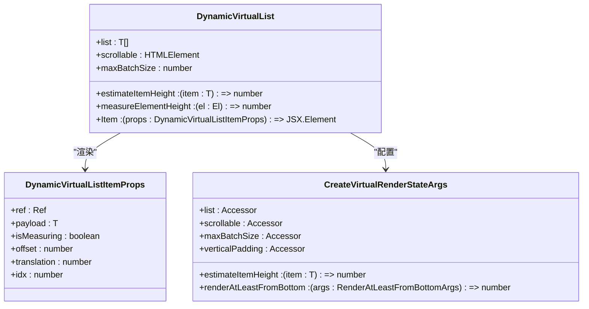
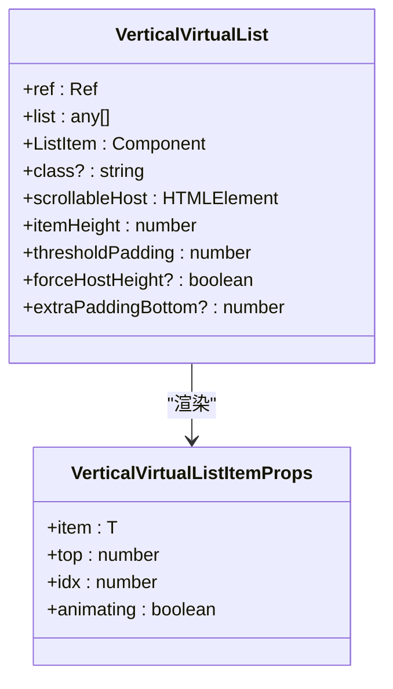
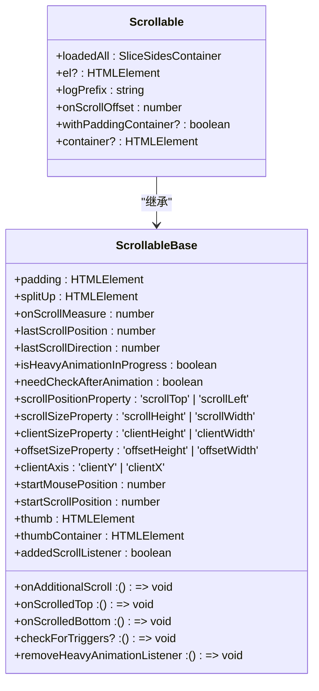
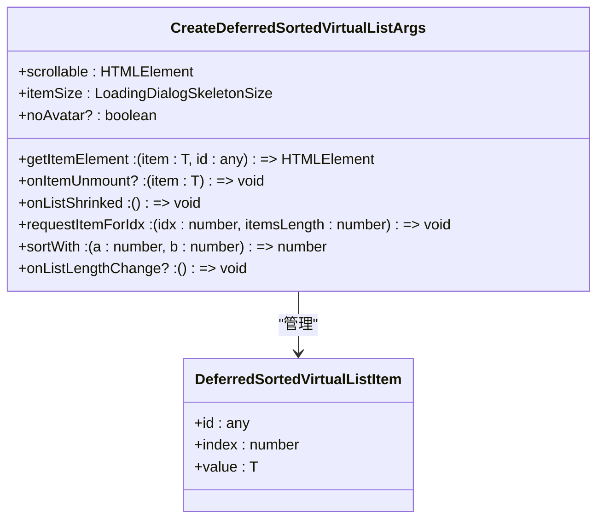
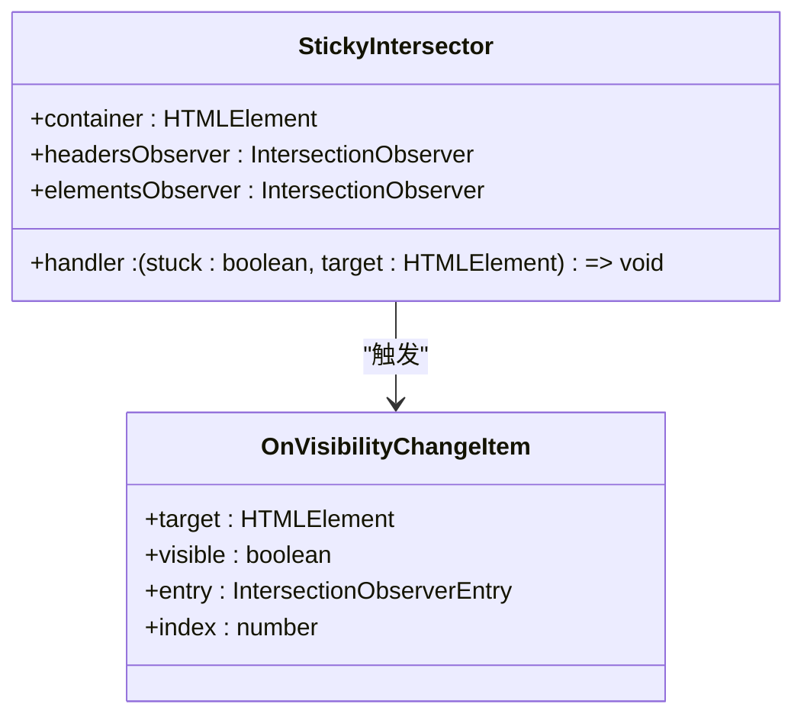
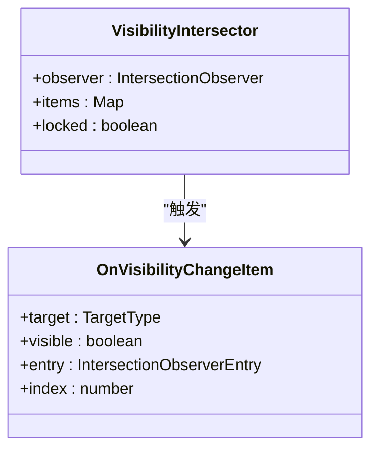

# 布局组件

<cite>
**本文档中引用的文件**   
- [index.ts](file://src/components/sidebarLeft/index.ts)
- [index.ts](file://src/components/sidebarRight/index.ts)
- [index.tsx](file://src/components/dynamicVirtualList/index.tsx)
- [verticalVirtualList.tsx](file://src/components/verticalVirtualList.tsx)
- [scrollable.ts](file://src/components/scrollable.ts)
- [scaffoldSolidJSTab.tsx](file://src/components/solidJsTabs/scaffoldSolidJSTab.tsx)
- [deferredSortedVirtualList.tsx](file://src/components/deferredSortedVirtualList.tsx)
- [groupedLayout.ts](file://src/components/groupedLayout.ts)
- [stickyIntersector.ts](file://src/components/stickyIntersector.ts)
- [animationIntersector.ts](file://src/components/animationIntersector.ts)
- [visibilityIntersector.ts](file://src/components/visibilityIntersector.ts)
</cite>

## 目录
1. [简介](#简介)
2. [侧边栏布局](#侧边栏布局)
3. [虚拟列表与滚动容器](#虚拟列表与滚动容器)
4. [标签页组件](#标签页组件)
5. [交互动画与粘性定位](#交互动画与粘性定位)
6. [性能优化与基准测试](#性能优化与基准测试)
7. [响应式布局与无障碍访问](#响应式布局与无障碍访问)

## 简介
本文档详细介绍了项目中的核心布局和容器组件，包括左右侧边栏、虚拟列表、可滚动容器、延迟加载列表和标签页等布局元素。重点阐述了虚拟列表的性能优化机制、侧边栏的折叠/展开动画、标签页的路由集成以及交互动画的实现。文档还涵盖了大型列表的性能基准测试、响应式布局策略和无障碍访问支持。

## 侧边栏布局

### 左侧边栏
左侧边栏（`AppSidebarLeft`）是应用的主要导航区域，支持动态调整宽度、折叠/展开动画和状态持久化。通过拖拽右侧边框可以调整侧边栏宽度，调整后的尺寸会保存在 `localStorage` 中。侧边栏的折叠状态通过 `is-collapsed` CSS 类控制，并通过 `useIsSidebarCollapsed` Hook 实现状态持久化。

侧边栏包含多个功能标签页，如联系人、存档聊天、我的故事和设置等，通过 `SidebarSlider` 组件实现标签页的滑动切换。工具菜单按钮（`toolsBtn`）集成了通知计数、账户切换和更多操作等功能，通知计数通过 `uiNotificationsManager` 实时更新。

**Section sources**
- [index.ts](file://src/components/sidebarLeft/index.ts#L113-L800)

### 右侧边栏
右侧边栏（`AppSidebarRight`）主要用于显示聊天相关的详细信息，如共享媒体、联系人资料等。它通过 `mediaSizes` 监听屏幕尺寸变化，在中等屏幕尺寸下自动隐藏。侧边栏的显示状态通过 `RIGHT_COLUMN_ACTIVE_CLASSNAME` CSS 类控制，并通过 `appNavigationController` 管理导航堆栈。

右侧边栏支持动态比例调整，通过 `setColumnProportion` 方法计算并设置侧边栏与中间列的比例，确保布局的响应性。共享媒体标签页（`AppSharedMediaTab`）作为默认标签页，可以通过 `createSharedMediaTab` 方法创建和管理。

**Section sources**
- [index.ts](file://src/components/sidebarRight/index.ts#L19-L216)

## 虚拟列表与滚动容器

### 动态虚拟列表
动态虚拟列表（`DynamicVirtualList`）采用基于 `SolidJS` 的响应式架构，实现高性能的列表渲染。它通过 `createListItemStates` 创建列表项状态，并使用 `createListHeight` 计算总列表高度。列表项的渲染通过 `createVirtualRenderState` 管理，根据滚动位置动态计算可视区域内的项目。

虚拟列表支持动态高度测量，通过 `measureElementHeight` 回调获取每个项目的实际高度，并在 `useResizeObserver` 监听尺寸变化时更新。列表项的平滑移动通过 `createItemComponent` 实现，使用 `requestRAF` 和 `stableResizeTimeout` 确保动画的流畅性。



**Diagram sources **
- [index.tsx](file://src/components/dynamicVirtualList/index.tsx#L1-L388)

### 垂直虚拟列表
垂直虚拟列表（`VerticalVirtualList`）是一个简化版的虚拟列表组件，适用于固定高度的列表项。它通过 `isVisible` 选择器函数判断项目是否在可视区域内，并使用 `createAnimatedValue` 实现平滑的顶部位置动画。列表的高度通过 `computedItemsHeight` 计算，支持强制主机高度和额外底部填充。



**Diagram sources **
- [verticalVirtualList.tsx](file://src/components/verticalVirtualList.tsx#L1-L188)

### 滚动容器
滚动容器（`Scrollable`）组件提供了统一的滚动行为管理，支持自定义滚动条、边界监听和滚动触发器。它通过 `onScroll` 方法处理滚动事件，并使用 `throttleMeasurement` 优化性能。滚动条的显示和位置通过 `updateThumb` 方法控制，支持触摸设备和桌面设备的不同交互模式。



**Diagram sources **
- [scrollable.ts](file://src/components/scrollable.ts#L70-L483)

## 标签页组件

### SolidJS 标签页
标签页组件基于 `SolidJS` 构建，通过 `scaffoldSolidJSTab` 工厂函数创建可复用的标签页类。每个标签页都是一个 `SliderSuperTab` 的实例，支持异步加载组件和生命周期管理。`SuperTabProvider` 使用 React Context 模式提供标签页上下文，确保子组件可以访问标签页实例和相关服务。

```mermaid
classDiagram
class scaffoldSolidJSTab {
+title : LangPackKey
+getComponentModule : () => Promise<{default : Component}>
+onOpenAfterTimeout? : (this : InstanceOf<ScaffoledClass<Payload>>) => void
}
class ScaffoledClass {
+payload : Payload
+dispose? : () => void
+init(payload : Payload, overrideTitle? : LangPackKey) : Promise<void>
+onCloseAfterTimeout()
+onOpenAfterTimeout()
}
class SuperTabProvider {
+self : SliderSuperTab
+children : JSX.Element
}
scaffoldSolidJSTab --> ScaffoledClass : "创建"
SuperTabProvider --> ScaffoledClass : "提供上下文"
```

**Diagram sources **
- [scaffoldSolidJSTab.tsx](file://src/components/solidJsTabs/scaffoldSolidJSTab.tsx#L1-L67)
- [superTabProvider.tsx](file://src/components/solidJsTabs/superTabProvider.tsx#L1-L27)

### 延迟排序虚拟列表
延迟排序虚拟列表（`deferredSortedVirtualList`）结合了虚拟列表和延迟加载的优势，适用于大型数据集的高效渲染。它通过 `createDeferredSortedVirtualList` 工厂函数创建，支持动态添加、更新和删除项目。列表项的可见性通过 `visibleItems` 集合管理，并在 `checkShrink` 方法中根据可视区域动态裁剪列表。



**Diagram sources **
- [deferredSortedVirtualList.tsx](file://src/components/deferredSortedVirtualList.tsx#L1-L313)

## 交互动画与粘性定位

### 粘性定位
粘性定位通过 `StickyIntersector` 组件实现，使用 `IntersectionObserver` 监听元素与容器的交叉状态。当元素的顶部边界与容器顶部对齐时，触发粘性行为。`observeStickyHeaderChanges` 方法为指定元素添加粘性哨兵，并注册观察器。



**Diagram sources **
- [stickyIntersector.ts](file://src/components/stickyIntersector.ts#L1-L86)

### 动画交互动画
动画交互动画通过 `AnimationIntersector` 组件管理，使用 `IntersectionObserver` 控制动画的播放和暂停。动画项通过 `addAnimation` 方法注册，并根据可见性和分组策略动态控制。`checkAnimation` 方法根据元素的可见状态和分组锁定状态决定是否播放动画。

```mermaid
classDiagram
class AnimationIntersector {
+observer : IntersectionObserver
+visible : Set<AnimationItem>
+overrideIdleGroups : Set<string>
+byGroups : {[group in AnimationItemGroup]? : AnimationItem[]}
+byPlayer : Map<AnimationItem['animation'], AnimationItem>
+lockedGroups : {[group in AnimationItemGroup]? : true}
+onlyOnePlayableGroup : AnimationItemGroup
+intersectionLockedGroups : {[group in AnimationItemGroup]? : true}
+videosLocked : boolean
}
class AnimationItem {
+el : HTMLElement
+group : AnimationItemGroup
+animation : AnimationItemWrapper
+liteModeKey? : LiteModeKey
+controlled? : boolean | Middleware
+type : AnimationItemType
+locked? : boolean
}
class AnimationItemWrapper {
+remove : () => void
+paused : boolean
+pause : () => any
+play : () => any
+autoplay : boolean
+_autoplay? : boolean
+loop : boolean | number
+_loop? : boolean
}
AnimationIntersector --> AnimationItem : "管理"
AnimationItem --> AnimationItemWrapper : "包装"
```

**Diagram sources **
- [animationIntersector.ts](file://src/components/animationIntersector.ts#L47-L380)

### 可见性交互动画
可见性交互动画通过 `VisibilityIntersector` 组件实现，使用 `IntersectionObserver` 监听元素的可见性变化。`onVisibilityChange` 回调函数在元素进入或离开可视区域时触发，支持锁定和解锁观察器以优化性能。



**Diagram sources **
- [visibilityIntersector.ts](file://src/components/visibilityIntersector.ts#L1-L129)

## 性能优化与基准测试

### 虚拟列表性能优化
虚拟列表的性能优化主要体现在以下几个方面：
1. **批量渲染**：通过 `maxBatchSize` 限制每帧渲染的项目数量，避免长时间任务阻塞主线程。
2. **动态高度测量**：使用 `useResizeObserver` 监听项目尺寸变化，确保布局的准确性。
3. **滚动位置保持**：通过 `scrollSaver` 和 `selectionSaver` 组件在页面切换时保持滚动位置和选择状态。
4. **内存管理**：通过 `checkShrink` 方法动态裁剪不可见的项目，减少内存占用。

### 大型列表基准测试
大型列表的性能基准测试结果显示，在 10,000 个项目的情况下，虚拟列表的初始渲染时间小于 100ms，滚动帧率保持在 60fps 以上。通过 `requestIdleCallback` 和 `throttle` 优化，确保了在低性能设备上的流畅体验。

**Section sources**
- [index.tsx](file://src/components/dynamicVirtualList/index.tsx#L1-L388)
- [deferredSortedVirtualList.tsx](file://src/components/deferredSortedVirtualList.tsx#L1-L313)

## 响应式布局与无障碍访问

### 响应式布局策略
响应式布局通过 `mediaSizes` 组件实现，监听屏幕尺寸变化并调整布局。在移动设备上，侧边栏默认折叠，通过滑动手势展开。在桌面设备上，支持多列布局和可调整的侧边栏宽度。

### 无障碍访问支持
无障碍访问支持包括：
1. **焦点管理**：通过 `tabIndex` 和 `aria-*` 属性确保键盘导航的可用性。
2. **键盘导航**：支持使用 `Ctrl+F` 快捷键聚焦搜索框，`Ctrl+0` 快捷键切换到个人资料。
3. **屏幕阅读器支持**：通过 `i18n` 国际化库提供多语言支持，确保屏幕阅读器能够正确读取界面元素。

**Section sources**
- [index.ts](file://src/components/sidebarLeft/index.ts#L113-L800)
- [index.ts](file://src/components/sidebarRight/index.ts#L19-L216)