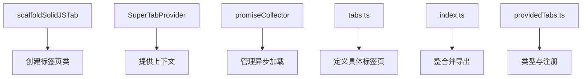
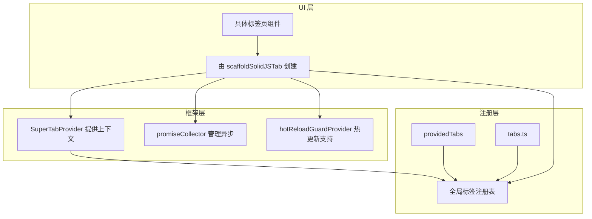
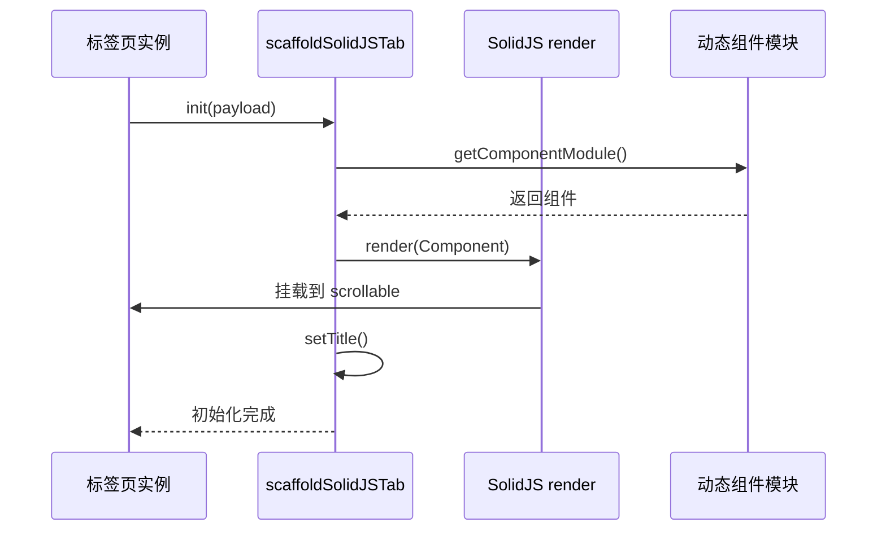
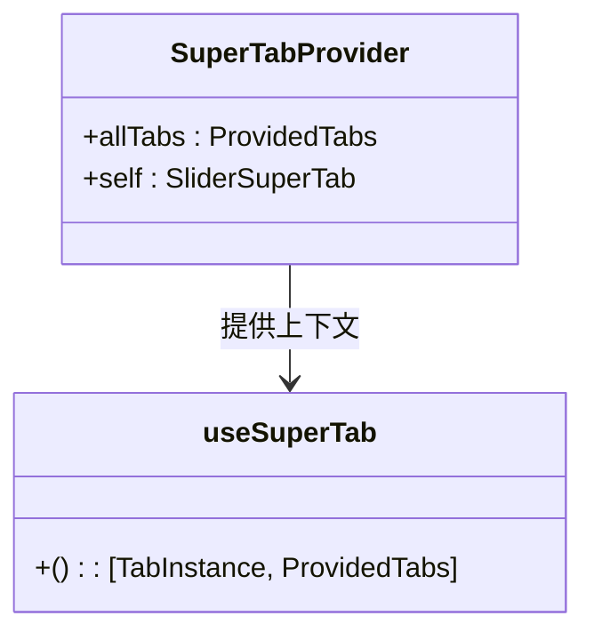
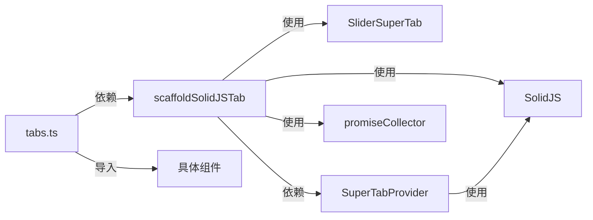

# 标签页

<cite>
**本文档中引用的文件**  
- [index.ts](file://src/components/solidJsTabs/index.ts)
- [tabs.ts](file://src/components/solidJsTabs/tabs.ts)
- [scaffoldSolidJSTab.tsx](file://src/components/solidJsTabs/scaffoldSolidJSTab.tsx)
- [superTabProvider.tsx](file://src/components/solidJsTabs/superTabProvider.tsx)
- [providedTabs.ts](file://src/components/solidJsTabs/providedTabs.ts)
- [promiseCollector.tsx](file://src/components/solidJsTabs/promiseCollector.tsx)
- [hotReloadGuardProvider.tsx](file://src/lib/solidjs/hotReloadGuardProvider.tsx)
</cite>

## 目录
1. [简介](#简介)
2. [项目结构](#项目结构)
3. [核心组件](#核心组件)
4. [架构概述](#架构概述)
5. [详细组件分析](#详细组件分析)
6. [依赖分析](#依赖分析)
7. [性能考虑](#性能考虑)
8. [故障排除指南](#故障排除指南)
9. [结论](#结论)

## 简介
本文档深入解析了基于 SolidJS 的标签页组件（solidJsTabs）在项目中的实现机制。该组件系统支持标签页的动态渲染、状态管理、内容懒加载、路由集成以及可访问性特性。文档将详细说明其设计模式、核心功能实现、内存优化策略以及与其他页面类型（如聊天、设置、媒体）的集成方式。

## 项目结构
标签页相关组件位于 `src/components/solidJsTabs/` 目录下，采用模块化设计，各文件职责分明：

- `index.ts`：主入口文件，导出所有标签页和提供者
- `tabs.ts`：定义具体标签页实例
- `scaffoldSolidJSTab.tsx`：核心工厂函数，用于创建 SolidJS 标签页
- `superTabProvider.tsx`：上下文提供者，为标签页提供依赖注入
- `providedTabs.ts`：类型定义和标签页注册表
- `promiseCollector.tsx`：异步操作管理工具



**图示来源**
- [scaffoldSolidJSTab.tsx](file://src/components/solidJsTabs/scaffoldSolidJSTab.tsx#L1-L67)
- [superTabProvider.tsx](file://src/components/solidJsTabs/superTabProvider.tsx#L1-L27)
- [promiseCollector.tsx](file://src/components/solidJsTabs/promiseCollector.tsx#L1-L40)
- [tabs.ts](file://src/components/solidJsTabs/tabs.ts#L1-L77)
- [providedTabs.ts](file://src/components/solidJsTabs/providedTabs.ts#L1-L28)

**章节来源**
- [src/components/solidJsTabs/](file://src/components/solidJsTabs/)

## 核心组件
solidJsTabs 组件系统基于 SolidJS 框架构建，通过 `scaffoldSolidJSTab` 工厂函数创建可复用的标签页类。每个标签页通过动态导入（`getComponentModule`）实现懒加载，确保按需加载组件代码。`SuperTabProvider` 使用 SolidJS 的上下文机制为标签页提供运行时依赖，如当前标签实例和全局标签注册表。

**章节来源**
- [scaffoldSolidJSTab.tsx](file://src/components/solidJsTabs/scaffoldSolidJSTab.tsx#L1-L67)
- [superTabProvider.tsx](file://src/components/solidJsTabs/superTabProvider.tsx#L1-L27)

## 架构概述
整个标签页系统采用分层架构设计，结合了工厂模式、依赖注入和上下文管理：



**图示来源**
- [scaffoldSolidJSTab.tsx](file://src/components/solidJsTabs/scaffoldSolidJSTab.tsx#L1-L67)
- [superTabProvider.tsx](file://src/components/solidJsTabs/superTabProvider.tsx#L1-L27)
- [providedTabs.ts](file://src/components/solidJsTabs/providedTabs.ts#L1-L28)
- [hotReloadGuardProvider.tsx](file://src/lib/solidjs/hotReloadGuardProvider.tsx#L1-L123)

## 详细组件分析

### 标签页渲染机制
标签页的渲染通过 `scaffoldSolidJSTab` 函数实现，该函数返回一个继承自 `SliderSuperTab` 的类。在 `init` 方法中，使用 SolidJS 的 `render` 函数将组件挂载到 DOM 中，并通过动态导入加载实际的 UI 组件。



**图示来源**
- [scaffoldSolidJSTab.tsx](file://src/components/solidJsTabs/scaffoldSolidJSTab.tsx#L22-L67)

### 状态管理与依赖注入
系统使用 `SuperTabProvider` 作为上下文提供者，将当前标签实例和全局标签注册表注入到组件树中。子组件可通过 `useSuperTab` Hook 获取这些依赖。



**图示来源**
- [superTabProvider.tsx](file://src/components/solidJsTabs/superTabProvider.tsx#L1-L27)

### 内容懒加载与内存优化
标签页内容采用动态导入实现懒加载，仅在标签被打开时加载对应模块。通过 `PromiseCollector` 收集初始化过程中的异步操作，确保所有资源加载完成后再显示内容。在 `onCloseAfterTimeout` 中调用 `dispose` 清理资源，防止内存泄漏。

```mermaid
flowchart TD
A[打开标签页] --> B[调用 init()]
B --> C[动态导入组件]
C --> D[创建 PromiseCollector]
D --> E[渲染组件]
E --> F[等待所有异步完成]
F --> G[显示内容]
H[关闭标签页] --> I[调用 dispose()]
I --> J[清理资源]
```

**图示来源**
- [scaffoldSolidJSTab.tsx](file://src/components/solidJsTabs/scaffoldSolidJSTab.tsx#L38-L55)
- [promiseCollector.tsx](file://src/components/solidJsTabs/promiseCollector.tsx#L1-L40)

## 依赖分析
标签页系统依赖多个核心模块：



**图示来源**
- [scaffoldSolidJSTab.tsx](file://src/components/solidJsTabs/scaffoldSolidJSTab.tsx#L1-L67)
- [superTabProvider.tsx](file://src/components/solidJsTabs/superTabProvider.tsx#L1-L27)
- [tabs.ts](file://src/components/solidJsTabs/tabs.ts#L1-L77)

**章节来源**
- [scaffoldSolidJSTab.tsx](file://src/components/solidJsTabs/scaffoldSolidJSTab.tsx#L1-L67)
- [superTabProvider.tsx](file://src/components/solidJsTabs/superTabProvider.tsx#L1-L27)
- [tabs.ts](file://src/components/solidJsTabs/tabs.ts#L1-L77)

## 性能考虑
系统通过以下方式优化性能：
- **懒加载**：仅在需要时加载组件代码
- **资源清理**：关闭标签时清理渲染器和事件监听
- **异步协调**：使用 PromiseCollector 确保初始化完整性
- **上下文隔离**：每个标签页拥有独立的上下文，避免状态污染

## 故障排除指南
常见问题及解决方案：

**章节来源**
- [scaffoldSolidJSTab.tsx](file://src/components/solidJsTabs/scaffoldSolidJSTab.tsx#L57-L64)
- [promiseCollector.tsx](file://src/components/solidJsTabs/promiseCollector.tsx#L23-L37)

## 结论
solidJsTabs 组件系统通过 SolidJS 的响应式特性，结合工厂模式和依赖注入，实现了高效、可扩展的标签页管理机制。其懒加载策略、资源清理机制和上下文管理为复杂应用提供了稳定的多页面导航解决方案。