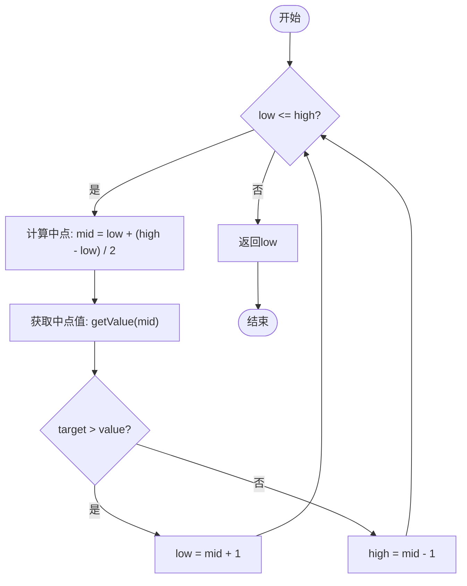
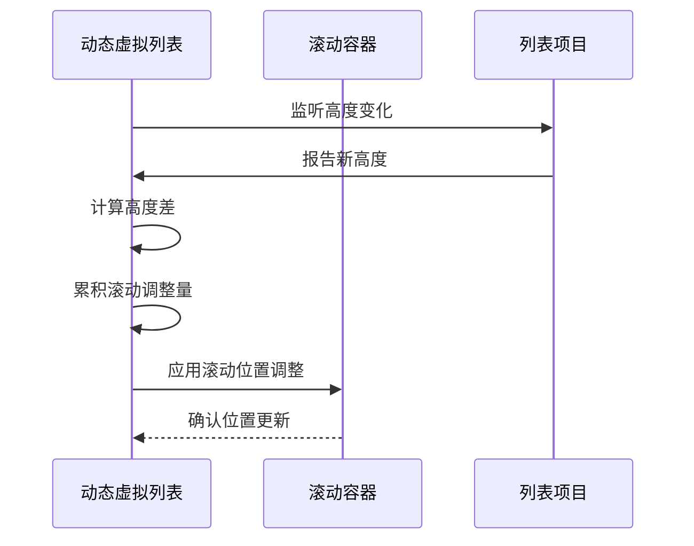
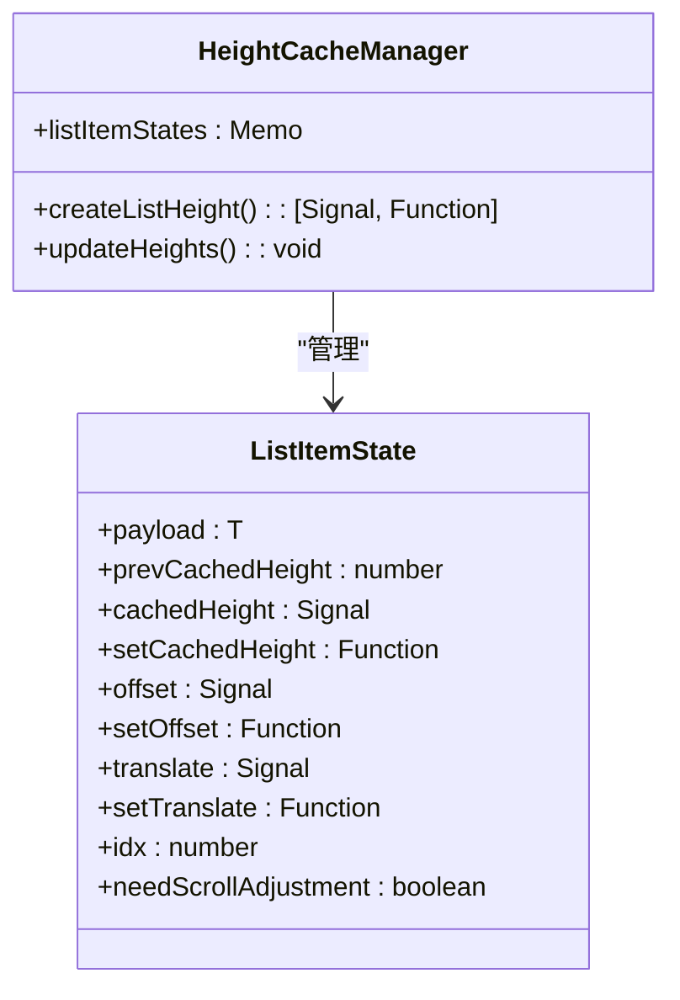
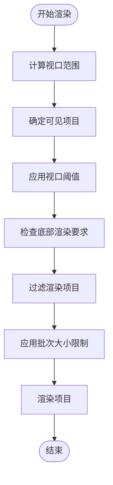
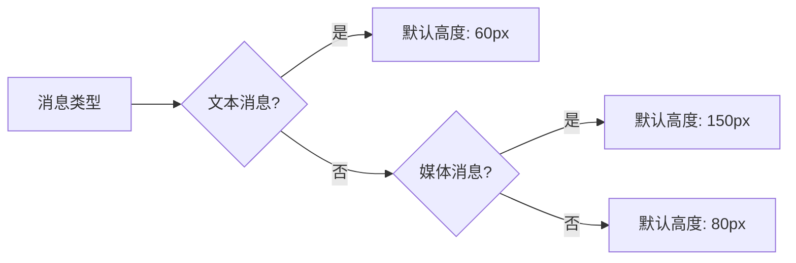
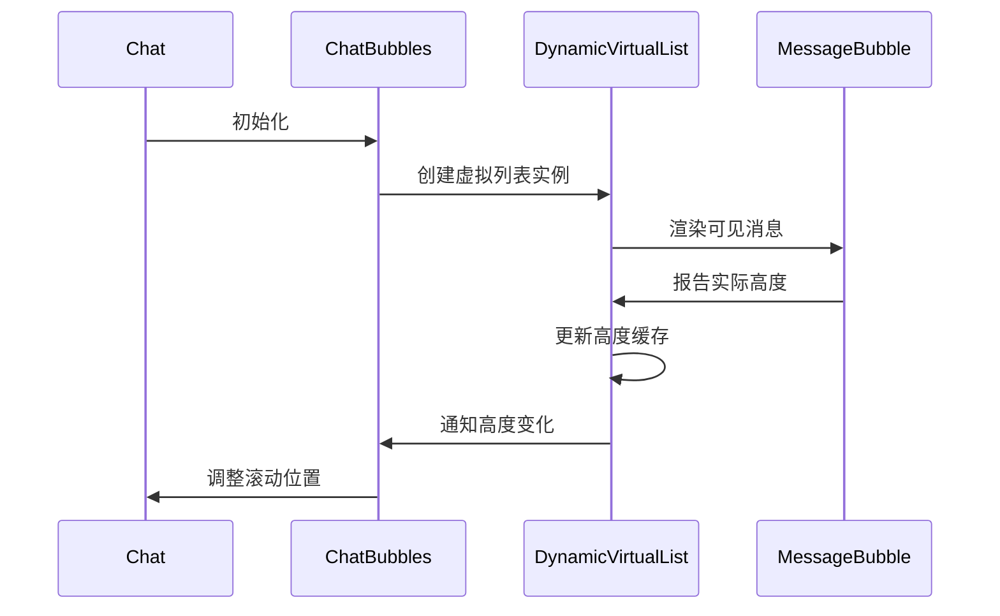
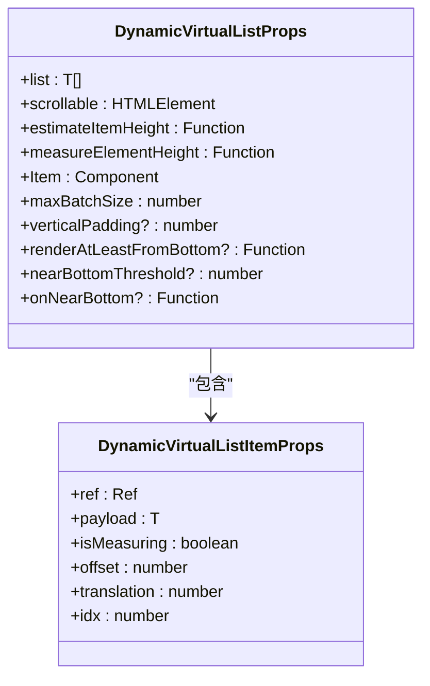
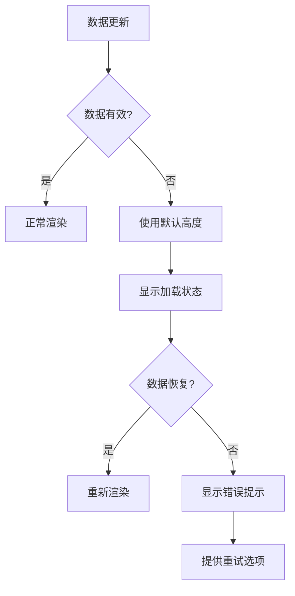

# 动态虚拟列表

<cite>
**本文档中引用的文件**  
- [index.tsx](file://src/components/dynamicVirtualList/index.tsx)
- [lowerBound.ts](file://src/components/dynamicVirtualList/lowerBound.ts)
- [styles.module.scss](file://src/components/dynamicVirtualList/styles.module.scss)
- [useElementSize.ts](file://src/hooks/useElementSize.ts)
- [useScrollTop.ts](file://src/hooks/useScrollTop.ts)
- [useResizeObserver.ts](file://src/hooks/useResizeObserver.ts)
- [chat.ts](file://src/components/chat/chat.ts)
- [bubbles.ts](file://src/components/chat/bubbles.ts)
</cite>

## 目录
1. [介绍](#介绍)
2. [核心实现机制](#核心实现机制)
3. [滚动位置保持策略](#滚动位置保持策略)
4. [动态高度缓存机制](#动态高度缓存机制)
5. [渲染窗口管理](#渲染窗口管理)
6. [性能优化技巧](#性能优化技巧)
7. [实际应用示例](#实际应用示例)
8. [组件Props接口](#组件props接口)
9. [错误边界处理](#错误边界处理)
10. [结论](#结论)

## 介绍

动态虚拟列表组件是一种高性能的列表渲染解决方案，专为处理大量数据而设计。该组件通过虚拟化技术只渲染可见区域的项目，从而显著提升滚动性能和内存效率。其核心优势在于能够高效处理动态高度的项目，特别适用于聊天应用中消息气泡高度不一的场景。

**Section sources**
- [index.tsx](file://src/components/dynamicVirtualList/index.tsx#L1-L388)

## 核心实现机制

动态虚拟列表的核心是`lowerBound`算法，它实现了O(log n)的查找性能。该算法采用二分查找策略，在已排序的偏移量数组中快速定位可见项的起始位置。

**Diagram sources**
- [lowerBound.ts](file://src/components/dynamicVirtualList/lowerBound.ts#L3-L27)

该算法通过以下步骤实现高效查找：
1. 初始化搜索范围的上下界
2. 计算中点位置
3. 比较目标值与中点值
4. 根据比较结果调整搜索范围
5. 重复直到找到目标位置

这种二分查找策略确保了在大型数据集中的查找操作始终保持对数时间复杂度。

**Section sources**
- [lowerBound.ts](file://src/components/dynamicVirtualList/lowerBound.ts#L3-L27)
- [index.tsx](file://src/components/dynamicVirtualList/index.tsx#L195-L203)

## 滚动位置保持策略

动态虚拟列表通过精确的滚动位置计算和调整机制，确保用户滚动体验的连续性。当项目高度发生变化时，组件会自动计算高度差并相应调整滚动位置。

**Diagram sources**
- [index.tsx](file://src/components/dynamicVirtualList/index.tsx#L174-L182)
- [index.tsx](file://src/components/dynamicVirtualList/index.tsx#L237-L238)

关键实现细节包括：
- 使用`scrollTopAdjustment`变量累积所有项目高度变化的总和
- 在渲染周期结束时一次性应用滚动位置调整
- 通过`scrollAdjustmentThreshold`避免微小调整导致的抖动

**Section sources**
- [index.tsx](file://src/components/dynamicVirtualList/index.tsx#L174-L182)
- [index.tsx](file://src/components/dynamicVirtualList/index.tsx#L237-L238)

## 动态高度缓存机制

组件实现了高效的动态高度缓存系统，能够准确跟踪每个项目的实际高度并及时更新。

**Diagram sources**
- [index.tsx](file://src/components/dynamicVirtualList/index.tsx#L74-L85)
- [index.tsx](file://src/components/dynamicVirtualList/index.tsx#L99-L118)

缓存机制的关键特性：
- 每个项目状态包含`cachedHeight`信号，用于存储测量高度
- `prevCachedHeight`用于记录前一次的高度值，便于计算变化量
- 高度更新在`createComputed`中批量处理，确保性能最优

**Section sources**
- [index.tsx](file://src/components/dynamicVirtualList/index.tsx#L70-L85)
- [index.tsx](file://src/components/dynamicVirtualList/index.tsx#L100-L118)

## 渲染窗口管理

动态虚拟列表通过智能的渲染窗口管理策略，只渲染视口内及附近需要显示的项目。

**Diagram sources**
- [index.tsx](file://src/components/dynamicVirtualList/index.tsx#L187-L233)

渲染窗口管理的关键参数：
- `viewportThreshold`: 视口扩展阈值，确保滚动时平滑过渡
- `maxBatchSize`: 最大渲染批次大小，控制单次渲染的项目数量
- `renderAtLeastFromBottom`: 底部渲染保证，确保底部内容始终可见

**Section sources**
- [index.tsx](file://src/components/dynamicVirtualList/index.tsx#L64-L66)
- [index.tsx](file://src/components/dynamicVirtualList/index.tsx#L187-L233)

## 性能优化技巧

### itemSize估算

合理的itemSize估算是确保良好用户体验的关键。建议根据内容类型设置合理的默认高度：

**Diagram sources**
- [index.tsx](file://src/components/dynamicVirtualList/index.tsx#L46-L47)

### 缓冲区大小配置

缓冲区大小直接影响滚动流畅度和内存使用：

- **小缓冲区**（50-100px）：内存占用少，但快速滚动时可能出现白屏
- **中等缓冲区**（200-300px）：平衡内存和性能，推荐使用
- **大缓冲区**（500px+）：滚动最流畅，但内存占用高

### 渲染批次控制

通过`maxBatchSize`参数控制单次渲染的项目数量：

- 小批次（5-10）：响应更快，但可能影响滚动流畅度
- 中等批次（15-20）：推荐值，平衡性能和流畅度
- 大批次（30+）：减少渲染次数，但单次渲染时间较长

**Section sources**
- [index.tsx](file://src/components/dynamicVirtualList/index.tsx#L49-L50)
- [index.tsx](file://src/components/dynamicVirtualList/index.tsx#L134-L135)

## 实际应用示例

在聊天列表中的集成示例展示了如何处理消息气泡的动态高度和异步内容加载。

**Diagram sources**
- [bubbles.ts](file://src/components/chat/bubbles.ts#L594-L595)
- [chat.ts](file://src/components/chat/chat.ts#L103-L104)

关键集成点：
- `ChatBubbles`类通过`constructBubbles`方法初始化虚拟列表
- 消息气泡组件使用`measureElementHeight`回调报告实际高度
- 滚动容器的高度通过`--height` CSS变量动态更新

**Section sources**
- [bubbles.ts](file://src/components/chat/bubbles.ts#L594-L595)
- [chat.ts](file://src/components/chat/chat.ts#L103-L104)

## 组件Props接口

动态虚拟列表组件提供了一套完整的Props接口，支持灵活的配置和定制。

**Diagram sources**
- [index.tsx](file://src/components/dynamicVirtualList/index.tsx#L43-L62)
- [index.tsx](file://src/components/dynamicVirtualList/index.tsx#L30-L37)

主要Props说明：
- `list`: 数据源数组
- `scrollable`: 滚动容器元素
- `estimateItemHeight`: 项目高度估算函数
- `measureElementHeight`: 实际高度测量函数
- `Item`: 项目渲染组件
- `maxBatchSize`: 最大渲染批次大小

**Section sources**
- [index.tsx](file://src/components/dynamicVirtualList/index.tsx#L43-L62)

## 错误边界处理

组件通过多层次的错误处理机制确保在数据异常时的用户体验。

**Diagram sources**
- [index.tsx](file://src/components/dynamicVirtualList/index.tsx#L105-L108)

错误处理策略：
- 对无效数据使用`estimateItemHeight`作为回退方案
- 通过`isMeasuring`状态管理加载过程的UI表现
- 在高度测量失败时保持布局稳定性

**Section sources**
- [index.tsx](file://src/components/dynamicVirtualList/index.tsx#L105-L108)
- [index.tsx](file://src/components/dynamicVirtualList/index.tsx#L372-L373)

## 结论

动态虚拟列表组件通过`lowerBound`算法实现了O(log n)的高效查找性能，结合智能的滚动位置保持、动态高度缓存和渲染窗口管理，为处理大量动态高度项目提供了卓越的解决方案。其灵活的Props接口和完善的错误处理机制使其能够轻松集成到各种应用场景中，特别是在聊天应用等需要处理复杂消息布局的场景下表现出色。

通过合理的性能优化配置，开发者可以在内存使用和用户体验之间找到最佳平衡点，为用户提供流畅的滚动体验。