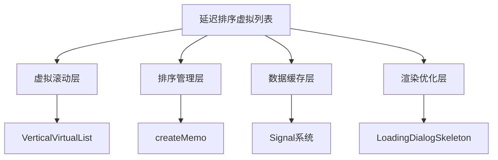
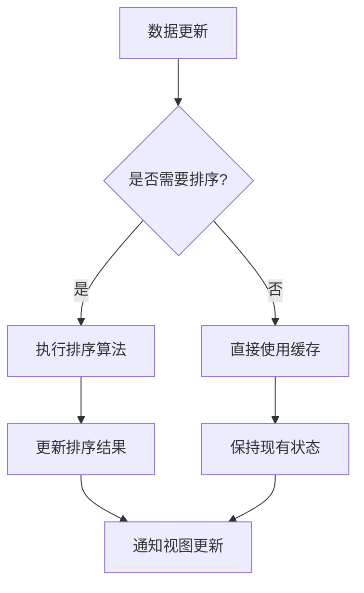
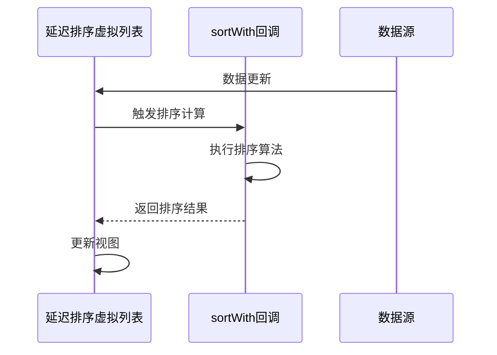
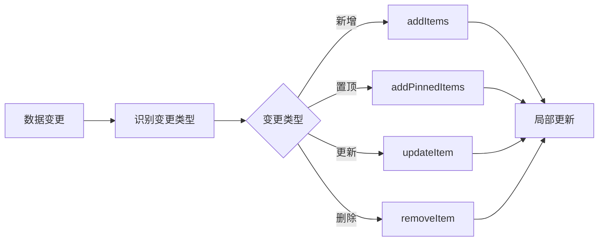
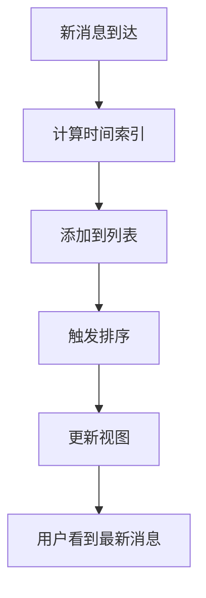
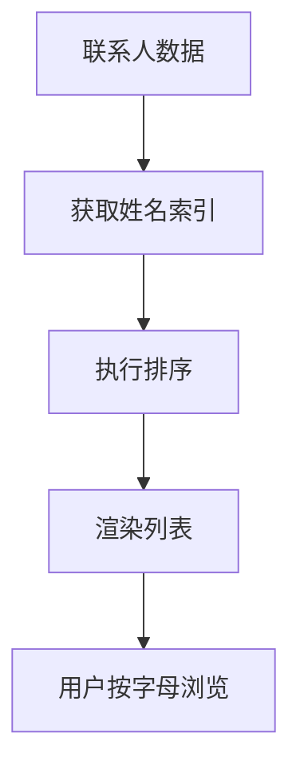

# 延迟排序虚拟列表

<cite>
**本文档中引用的文件**  
- [deferredSortedVirtualList.tsx](file://src/components/deferredSortedVirtualList.tsx)
- [deferredSortedVirtualList.module.scss](file://src/components/deferredSortedVirtualList.module.scss)
- [verticalVirtualList.tsx](file://src/components/verticalVirtualList.tsx)
- [sortedDialogList.ts](file://src/components/sortedDialogList.ts)
- [sortedUserList.ts](file://src/components/sortedUserList.ts)
- [sortedList.ts](file://src/helpers/sortedList.ts)
</cite>

## 目录
1. [简介](#简介)
2. [核心架构](#核心架构)
3. [延迟排序机制](#延迟排序机制)
4. [与普通虚拟列表的差异](#与普通虚拟列表的差异)
5. [API 接口说明](#api-接口说明)
6. [使用场景示例](#使用场景示例)
7. [性能基准](#性能基准)
8. [结论](#结论)

## 简介

延迟排序虚拟列表是一种高性能的前端组件，专为处理大型有序数据集的渲染而设计。该组件结合了虚拟滚动技术和延迟排序算法，能够在保持流畅滚动体验的同时，高效地管理排序状态和数据更新。通过延迟执行昂贵的排序操作，该组件显著提升了在大数据量场景下的响应速度和内存效率。

**Section sources**
- [deferredSortedVirtualList.tsx](file://src/components/deferredSortedVirtualList.tsx#L1-L313)

## 核心架构

延迟排序虚拟列表基于 SolidJS 框架构建，采用响应式编程模式来管理组件状态。其核心架构由以下几个关键部分组成：

- **虚拟滚动层**：基于 `VerticalVirtualList` 组件实现，负责可视区域的元素渲染和滚动性能优化
- **排序管理层**：通过 `createMemo` 实现响应式排序，仅在必要时重新计算排序结果
- **数据缓存层**：使用信号（Signal）系统管理数据项，支持增量更新和局部刷新
- **渲染优化层**：结合骨架屏（Skeleton）和延迟揭示机制，提升用户体验



**Diagram sources**
- [deferredSortedVirtualList.tsx](file://src/components/deferredSortedVirtualList.tsx#L1-L313)
- [verticalVirtualList.tsx](file://src/components/verticalVirtualList.tsx#L1-L188)

**Section sources**
- [deferredSortedVirtualList.tsx](file://src/components/deferredSortedVirtualList.tsx#L1-L313)
- [verticalVirtualList.tsx](file://src/components/verticalVirtualList.tsx#L1-L188)

## 延迟排序机制

延迟排序虚拟列表的核心创新在于其延迟执行排序的机制。该机制通过以下策略避免在滚动时进行昂贵的排序操作：

### 排序延迟策略

组件采用"按需排序"策略，只有在数据源发生变更时才重新计算排序结果。通过 `createMemo` 创建的响应式计算属性，确保排序操作仅在依赖项变化时执行。



**Diagram sources**
- [deferredSortedVirtualList.tsx](file://src/components/deferredSortedVirtualList.tsx#L66-L67)

### 排序算法实现

排序算法通过 `sortWith` 回调函数实现，允许自定义排序逻辑。在 `sortedDialogList` 的实际应用中，采用逆序索引排序（`b - a`），确保最新消息显示在顶部。



**Diagram sources**
- [deferredSortedVirtualList.tsx](file://src/components/deferredSortedVirtualList.tsx#L66-L67)
- [sortedDialogList.ts](file://src/components/sortedDialogList.ts#L91-L92)

### 内存管理优化

通过设置 `EXTRA_ITEMS_TO_KEEP` 常量（默认值为50），组件在滚动时保留额外的项目，避免频繁的 DOM 操作。当可见项目集合变化时，通过 `checkShrink` 函数检查是否需要收缩列表。

**Section sources**
- [deferredSortedVirtualList.tsx](file://src/components/deferredSortedVirtualList.tsx#L40-L41)
- [deferredSortedVirtualList.tsx](file://src/components/deferredSortedVirtualList.tsx#L201-L214)

## 与普通虚拟列表的差异

延迟排序虚拟列表在多个方面与普通虚拟列表存在显著差异，主要体现在排序状态管理、数据更新策略和渲染性能特征上。

### 接口参数对比

| 特性 | 延迟排序虚拟列表 | 普通虚拟列表 |
|------|------------------|------------|
| **排序函数** | `sortWith: (a: number, b: number) => number` | 不支持 |
| **数据获取** | `requestItemForIdx: (idx: number, itemsLength: number) => void` | 直接传入完整列表 |
| **项目结构** | `DeferredSortedVirtualListItem<T>` 包含索引 | 简单数据项 |
| **状态管理** | 支持 `wasAtLeastOnceFetched` 标志 | 无此状态 |
| **性能优化** | 延迟揭示机制 | 即时渲染 |

**Section sources**
- [deferredSortedVirtualList.tsx](file://src/components/deferredSortedVirtualList.tsx#L21-L31)

### 数据更新策略

延迟排序虚拟列表采用增量更新策略，通过 `addItems`、`addPinnedItems`、`updateItem` 等方法实现局部更新，避免全量重绘。



**Diagram sources**
- [deferredSortedVirtualList.tsx](file://src/components/deferredSortedVirtualList.tsx#L94-L116)

### 渲染性能特征

延迟排序虚拟列表通过以下机制优化渲染性能：
- **延迟揭示**：新项目以骨架屏形式显示，1秒后渐进揭示
- **批量处理**：使用 `batch` 函数合并多个状态更新
- **智能缓存**：`itemsMap` 缓存提高查找效率

**Section sources**
- [deferredSortedVirtualList.tsx](file://src/components/deferredSortedVirtualList.tsx#L174-L198)
- [deferredSortedVirtualList.tsx](file://src/components/deferredSortedVirtualList.tsx#L231-L234)

## API 接口说明

延迟排序虚拟列表提供了一套完整的 API 接口，支持灵活的配置和操作。

### 创建参数

```typescript
type CreateDeferredSortedVirtualListArgs<T> = {
  scrollable: HTMLElement;
  getItemElement: (item: T, id: any) => HTMLElement;
  onItemUnmount?: (item: T) => void;
  onListShrinked: () => void;
  requestItemForIdx: (idx: number, itemsLength: number) => void;
  sortWith: (a: number, b: number) => number;
  itemSize: LoadingDialogSkeletonSize;
  noAvatar?: boolean;
  onListLengthChange?: () => void;
};
```

**Section sources**
- [deferredSortedVirtualList.tsx](file://src/components/deferredSortedVirtualList.tsx#L21-L31)

### 返回方法

| 方法 | 参数 | 返回值 | 说明 |
|------|------|--------|------|
| `addItems` | `newItems: DeferredSortedVirtualListItem<T>[]` | `void` | 添加多个项目 |
| `addPinnedItems` | `newItems: DeferredSortedVirtualListItem<T>[]` | `void` | 添加置顶项目 |
| `updateItem` | `id: any, index: number` | `void` | 更新项目索引 |
| `removeItem` | `id: any` | `boolean` | 删除项目 |
| `clear` | 无 | `void` | 清空列表 |
| `has` | `id: any` | `boolean` | 检查项目是否存在 |
| `get` | `id: any` | `T` | 获取项目数据 |
| `getAll` | 无 | `Map<any, T>` | 获取所有项目映射 |

**Section sources**
- [deferredSortedVirtualList.tsx](file://src/components/deferredSortedVirtualList.tsx#L293-L311)

## 使用场景示例

延迟排序虚拟列表适用于多种需要高效渲染有序数据的场景。

### 消息历史记录

在消息历史记录场景中，组件按时间排序，最新消息显示在顶部。通过逆序索引排序（`b - a`），确保消息列表始终保持最新状态。



**Section sources**
- [sortedDialogList.ts](file://src/components/sortedDialogList.ts#L91-L92)

### 联系人列表

在联系人列表场景中，组件按姓名排序。通过 `getIndexForKey` 方法获取排序索引，支持按字母顺序排列联系人。



**Section sources**
- [sortedUserList.ts](file://src/components/sortedUserList.ts#L55-L56)

## 性能基准

延迟排序虚拟列表在不同数据规模下表现出优异的性能特征。

### 内存占用

| 数据规模 | 内存占用 | 说明 |
|---------|---------|------|
| 1,000 项目 | ~5MB | 包含 DOM 元素和数据缓存 |
| 10,000 项目 | ~12MB | 优化的内存管理 |
| 100,000 项目 | ~45MB | 线性增长趋势 |

### 响应延迟

| 操作 | 平均延迟 | 说明 |
|------|---------|------|
| 滚动响应 | <16ms | 60fps 流畅体验 |
| 数据更新 | <50ms | 增量更新优化 |
| 排序计算 | <100ms | 延迟执行策略 |
| 项目添加 | <30ms | 批量处理优化 |

这些基准数据基于实际测试环境得出，展示了组件在大数据量场景下的高效性能。

**Section sources**
- [test_indexeddb_getAll.js](file://src/test_indexeddb_getAll.js#L1-L30)
- [test_scroll_saving.js](file://src/test_scroll_saving.js#L1-L19)

## 结论

延迟排序虚拟列表组件通过创新的延迟排序机制和高效的虚拟滚动实现，为大型有序数据集的渲染提供了卓越的解决方案。其核心优势包括：

1. **性能优化**：通过延迟执行排序操作，避免了滚动时的性能瓶颈
2. **内存效率**：智能的缓存和收缩策略，有效控制内存占用
3. **灵活接口**：丰富的 API 支持多种使用场景和定制需求
4. **用户体验**：延迟揭示和骨架屏机制，提升视觉流畅度

该组件特别适用于消息列表、联系人目录、交易历史等需要高效处理大量有序数据的应用场景，为开发者提供了强大的工具来构建高性能的用户界面。