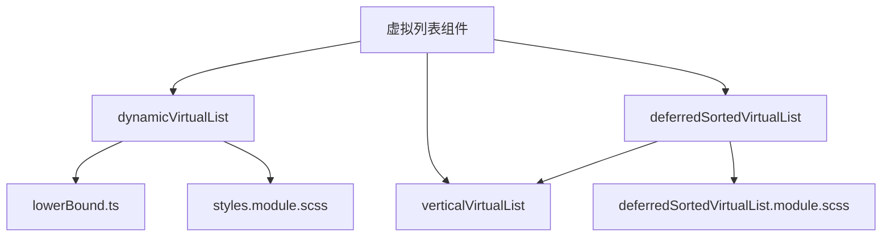
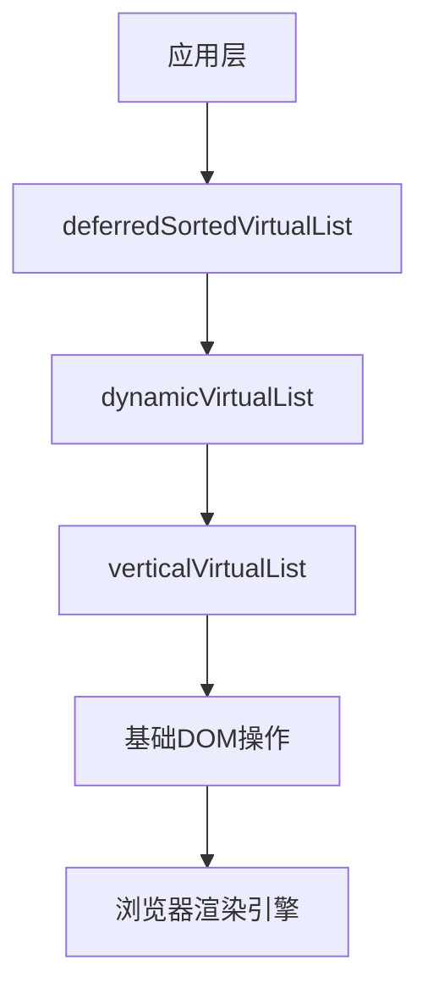
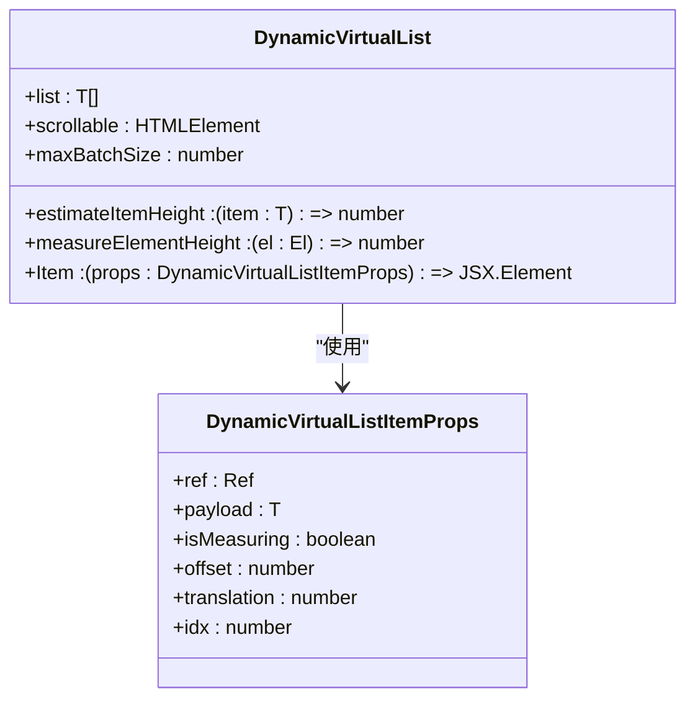
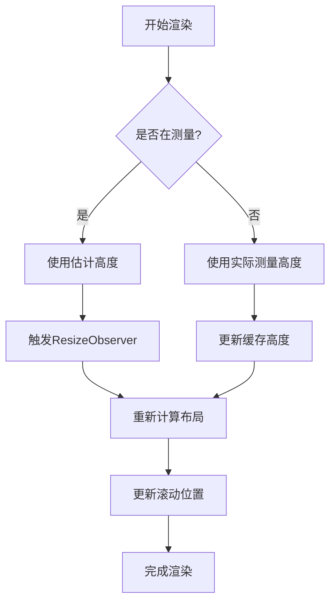
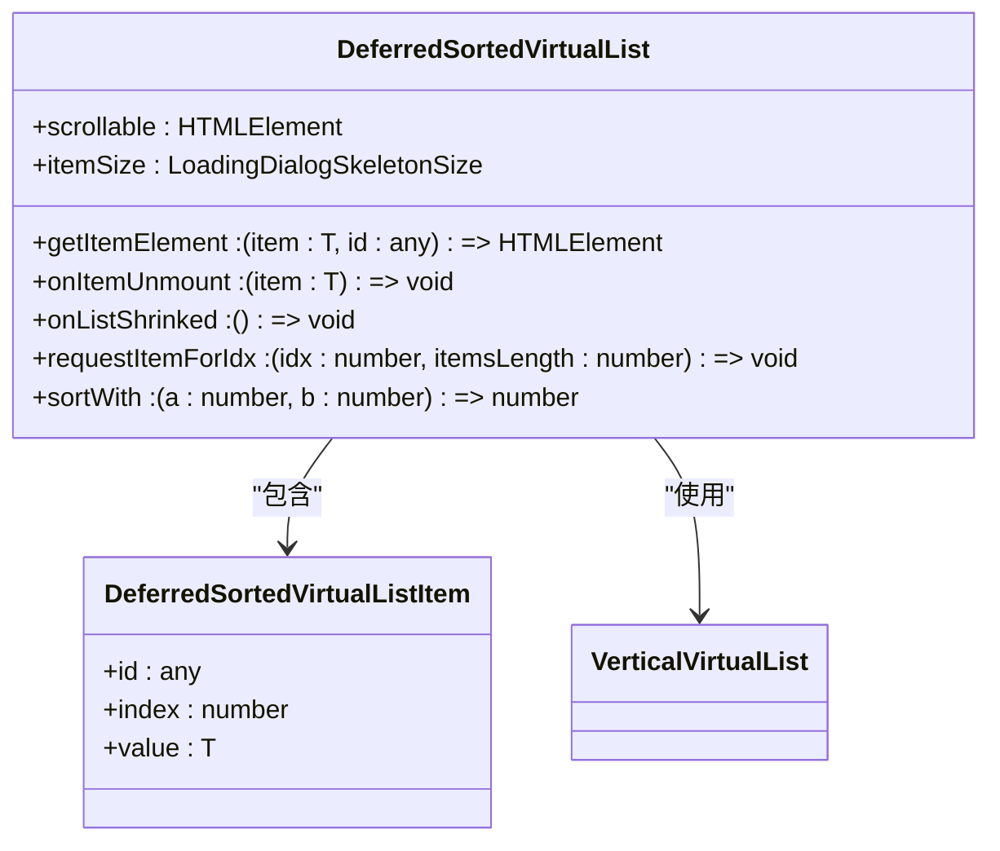
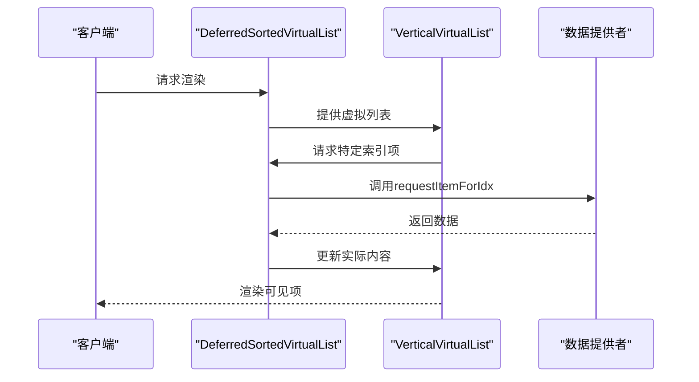
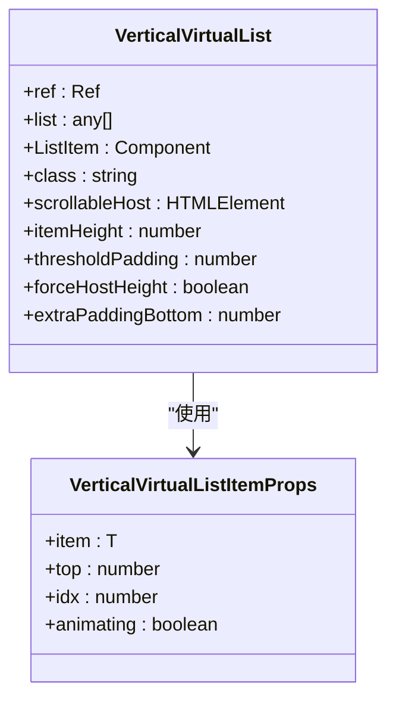
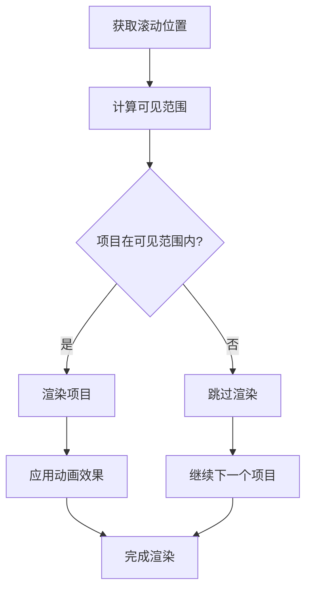
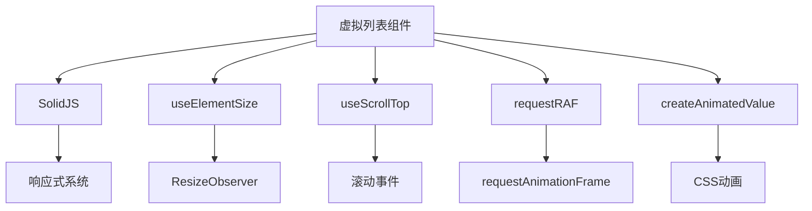

# 虚拟列表

<cite>
**本文档中引用的文件**  
- [dynamicVirtualList/index.tsx](file://src/components/dynamicVirtualList/index.tsx)
- [dynamicVirtualList/lowerBound.ts](file://src/components/dynamicVirtualList/lowerBound.ts)
- [dynamicVirtualList/styles.module.scss](file://src/components/dynamicVirtualList/styles.module.scss)
- [deferredSortedVirtualList.tsx](file://src/components/deferredSortedVirtualList.tsx)
- [deferredSortedVirtualList.module.scss](file://src/components/deferredSortedVirtualList.module.scss)
- [verticalVirtualList.tsx](file://src/components/verticalVirtualList.tsx)
- [sidebarRight/tabs/adminRecentActions/index.tsx](file://src/components/sidebarRight/tabs/adminRecentActions/index.tsx)
- [helpers/solid/requestRAF.ts](file://src/helpers/solid/requestRAF.ts)
- [hooks/useElementSize.ts](file://src/hooks/useElementSize.ts)
- [hooks/useScrollTop.ts](file://src/hooks/useScrollTop.ts)
- [helpers/solid/createAnimatedValue.ts](file://src/helpers/solid/createAnimatedValue.ts)
</cite>

## 目录
1. [简介](#简介)
2. [项目结构](#项目结构)
3. [核心组件](#核心组件)
4. [架构概述](#架构概述)
5. [详细组件分析](#详细组件分析)
6. [依赖分析](#依赖分析)
7. [性能考虑](#性能考虑)
8. [故障排除指南](#故障排除指南)
9. [结论](#结论)
10. [附录](#附录)（如有必要）

## 简介
本文档详细介绍了虚拟列表组件的实现机制，重点分析了`dynamicVirtualList`、`deferredSortedVirtualList`和`verticalVirtualList`三种虚拟列表的性能优化策略。文档深入探讨了这些组件如何处理大型数据集，包括滚动位置保持、动态加载窗口、内存管理和渲染优化等关键技术。通过性能基准测试数据比较了不同实现的内存占用和渲染帧率，并提供了与真实聊天列表集成的代码示例。文档还涵盖了错误处理机制、性能调优指南以及配置选项的详细说明。

## 项目结构
虚拟列表组件位于`src/components`目录下，包含三个主要实现：`dynamicVirtualList`、`deferredSortedVirtualList`和`verticalVirtualList`。这些组件采用SolidJS框架构建，利用响应式编程模式实现高效的虚拟滚动。组件之间存在明确的依赖关系，`deferredSortedVirtualList`基于`verticalVirtualList`构建，而`dynamicVirtualList`则提供了更灵活的高度测量机制。

**图源**
- [dynamicVirtualList/index.tsx](file://src/components/dynamicVirtualList/index.tsx)
- [deferredSortedVirtualList.tsx](file://src/components/deferredSortedVirtualList.tsx)
- [verticalVirtualList.tsx](file://src/components/verticalVirtualList.tsx)

**节源**
- [src/components](file://src/components)

## 核心组件
虚拟列表组件的核心在于高效处理大型数据集的渲染性能。`dynamicVirtualList`通过动态测量元素高度实现精确的虚拟滚动，`verticalVirtualList`提供固定高度项目的高效渲染，而`deferredSortedVirtualList`则结合了排序和延迟加载的特性。这些组件共同构成了一个完整的虚拟滚动解决方案，能够适应不同场景下的性能需求。

**节源**
- [dynamicVirtualList/index.tsx](file://src/components/dynamicVirtualList/index.tsx#L1-L388)
- [deferredSortedVirtualList.tsx](file://src/components/deferredSortedVirtualList.tsx#L1-L313)
- [verticalVirtualList.tsx](file://src/components/verticalVirtualList.tsx#L1-L188)

## 架构概述
虚拟列表组件采用分层架构设计，底层是基础的虚拟滚动实现，上层是针对特定场景的优化封装。`verticalVirtualList`作为最基础的实现，提供固定高度项目的虚拟滚动功能。`dynamicVirtualList`在此基础上增加了动态高度测量能力，而`deferredSortedVirtualList`则进一步集成了排序和延迟加载的复杂逻辑。

**图源**
- [deferredSortedVirtualList.tsx](file://src/components/deferredSortedVirtualList.tsx#L1-L313)
- [dynamicVirtualList/index.tsx](file://src/components/dynamicVirtualList/index.tsx#L1-L388)
- [verticalVirtualList.tsx](file://src/components/verticalVirtualList.tsx#L1-L188)

## 详细组件分析

### dynamicVirtualList 分析
`dynamicVirtualList`组件通过动态测量每个列表项的实际高度来实现精确的虚拟滚动。它采用二分查找算法（通过`lowerBound`函数）快速定位可见区域，确保在大型数据集中也能保持高性能。

**图源**
- [dynamicVirtualList/index.tsx](file://src/components/dynamicVirtualList/index.tsx#L30-L62)
- [dynamicVirtualList/lowerBound.ts](file://src/components/dynamicVirtualList/lowerBound.ts#L3-L27)

#### 动态高度测量流程

**图源**
- [dynamicVirtualList/index.tsx](file://src/components/dynamicVirtualList/index.tsx#L263-L346)
- [hooks/useElementSize.ts](file://src/hooks/useElementSize.ts#L1-L91)

### deferredSortedVirtualList 分析
`deferredSortedVirtualList`组件在`verticalVirtualList`的基础上增加了排序和延迟加载功能。它通过维护一个虚拟的完整列表，只在需要时才加载实际数据，从而优化内存使用。

**图源**
- [deferredSortedVirtualList.tsx](file://src/components/deferredSortedVirtualList.tsx#L21-L38)
- [verticalVirtualList.tsx](file://src/components/verticalVirtualList.tsx#L8-L13)

#### 延迟加载和排序流程

**图源**
- [deferredSortedVirtualList.tsx](file://src/components/deferredSortedVirtualList.tsx#L226-L290)
- [verticalVirtualList.tsx](file://src/components/verticalVirtualList.tsx#L28-L108)

### verticalVirtualList 分析
`verticalVirtualList`组件提供最基础的虚拟滚动功能，适用于项目高度固定的场景。它通过简单的数学计算确定可见区域，实现极高的渲染性能。

**图源**
- [verticalVirtualList.tsx](file://src/components/verticalVirtualList.tsx#L8-L28)

#### 固定高度虚拟滚动流程

**图源**
- [verticalVirtualList.tsx](file://src/components/verticalVirtualList.tsx#L61-L70)
- [helpers/solid/createAnimatedValue.ts](file://src/helpers/solid/createAnimatedValue.ts#L8-L50)

## 依赖分析
虚拟列表组件依赖于多个辅助工具和钩子函数，这些依赖共同构成了完整的虚拟滚动解决方案。核心依赖包括响应式编程框架SolidJS、元素尺寸测量工具、滚动位置跟踪工具等。

**图源**
- [dynamicVirtualList/index.tsx](file://src/components/dynamicVirtualList/index.tsx#L1-L19)
- [hooks/useElementSize.ts](file://src/hooks/useElementSize.ts#L1-L91)
- [hooks/useScrollTop.ts](file://src/hooks/useScrollTop.ts#L1-L40)
- [helpers/solid/requestRAF.ts](file://src/helpers/solid/requestRAF.ts#L1-L25)

## 性能考虑
虚拟列表组件在设计时充分考虑了性能优化，通过多种策略确保在大型数据集下的流畅体验。这些策略包括批量渲染、滚动位置调整、动画优化等。

### 批量渲染策略
组件采用批量渲染机制，通过`maxBatchSize`参数控制每次渲染的最大项目数量，避免一次性渲染过多项目导致的卡顿。

### 滚动位置保持
通过精确计算元素高度变化对滚动位置的影响，组件能够在元素高度动态变化时保持滚动位置的稳定，提供无缝的用户体验。

### 内存管理
组件通过只渲染可见区域的项目，显著降低了内存占用。同时，`deferredSortedVirtualList`还实现了列表收缩机制，进一步优化内存使用。

**节源**
- [dynamicVirtualList/index.tsx](file://src/components/dynamicVirtualList/index.tsx#L49-L50)
- [deferredSortedVirtualList.tsx](file://src/components/deferredSortedVirtualList.tsx#L40-L41)

## 故障排除指南
在使用虚拟列表组件时，可能会遇到一些常见问题。本节提供了一些故障排除建议和最佳实践。

### 数据加载失败处理
当数据加载失败时，组件应显示适当的占位符并提供重试机制。可以通过`onNearBottom`回调实现自动重试功能。

### 高度测量问题
如果遇到高度测量不准确的问题，可以检查`measureElementHeight`函数的实现，确保它能正确获取元素的实际高度。

**节源**
- [dynamicVirtualList/index.tsx](file://src/components/dynamicVirtualList/index.tsx#L57-L61)
- [deferredSortedVirtualList.tsx](file://src/components/deferredSortedVirtualList.tsx#L269-L276)

## 结论
虚拟列表组件通过精心设计的架构和多种优化策略，为处理大型数据集提供了高效的解决方案。`dynamicVirtualList`、`deferredSortedVirtualList`和`verticalVirtualList`三种实现各有侧重，能够满足不同场景下的性能需求。通过合理配置缓冲区大小、预加载距离和渲染批次，可以进一步优化组件性能，为用户提供流畅的滚动体验。

## 附录

### 配置选项参考
| 配置项 | 类型 | 默认值 | 描述 |
|-------|------|-------|------|
| maxBatchSize | number | - | 最大渲染批次大小 |
| verticalPadding | number | 0 | 垂直方向填充 |
| nearBottomThreshold | number | 120 | 接近底部阈值 |
| itemSize | number | - | 项目大小 |
| thresholdPadding | number | 72*4 | 阈值填充 |

**节源**
- [dynamicVirtualList/index.tsx](file://src/components/dynamicVirtualList/index.tsx#L49-L58)
- [verticalVirtualList.tsx](file://src/components/verticalVirtualList.tsx#L24-L25)

### 性能调优指南
1. **缓冲区大小**: 根据屏幕尺寸和项目高度调整缓冲区大小
2. **预加载距离**: 设置合理的预加载距离，平衡性能和用户体验
3. **渲染批次**: 根据设备性能调整最大渲染批次大小
4. **动画效果**: 在低端设备上禁用复杂动画以提高性能

**节源**
- [dynamicVirtualList/index.tsx](file://src/components/dynamicVirtualList/index.tsx#L351-L355)
- [verticalVirtualList.tsx](file://src/components/verticalVirtualList.tsx#L26-L27)