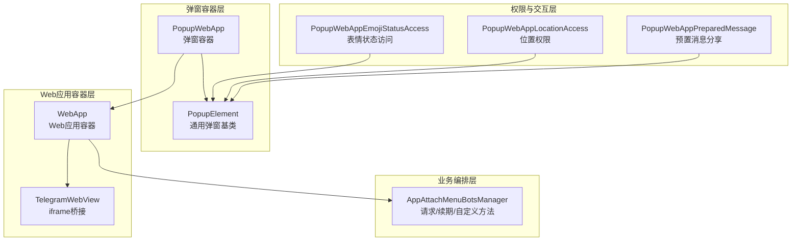
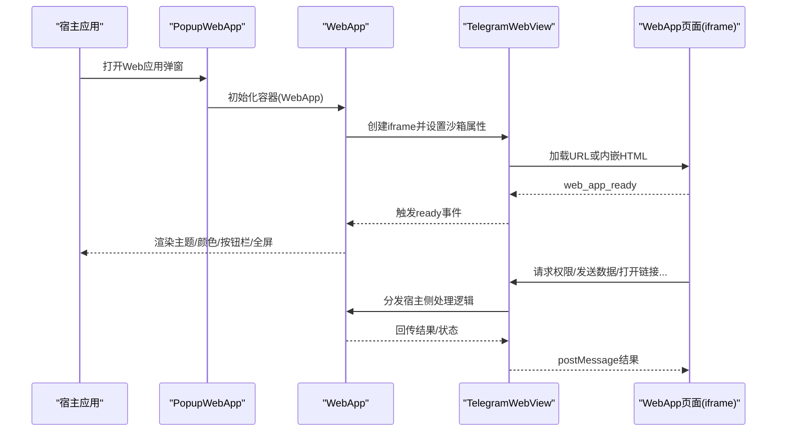
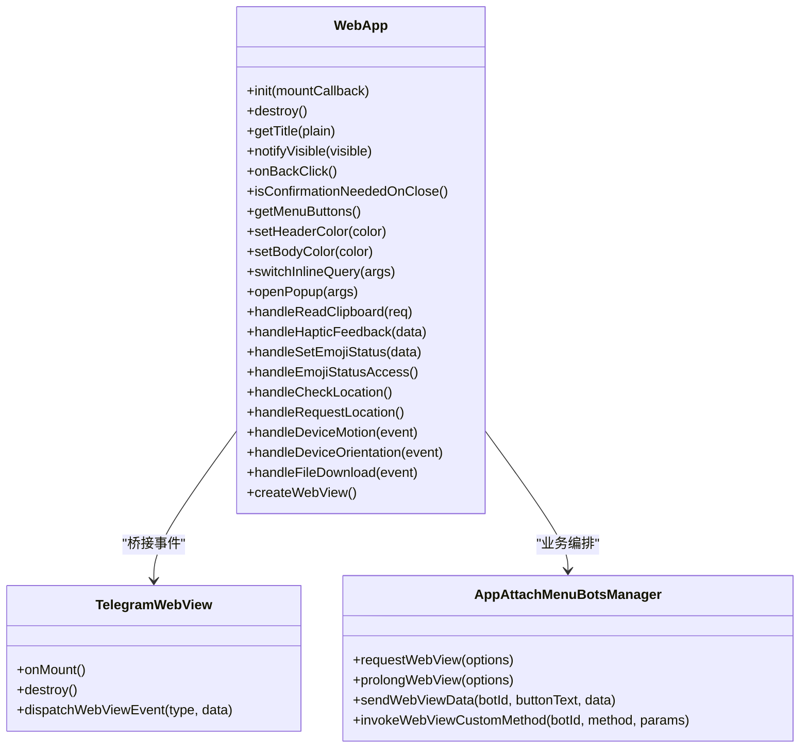
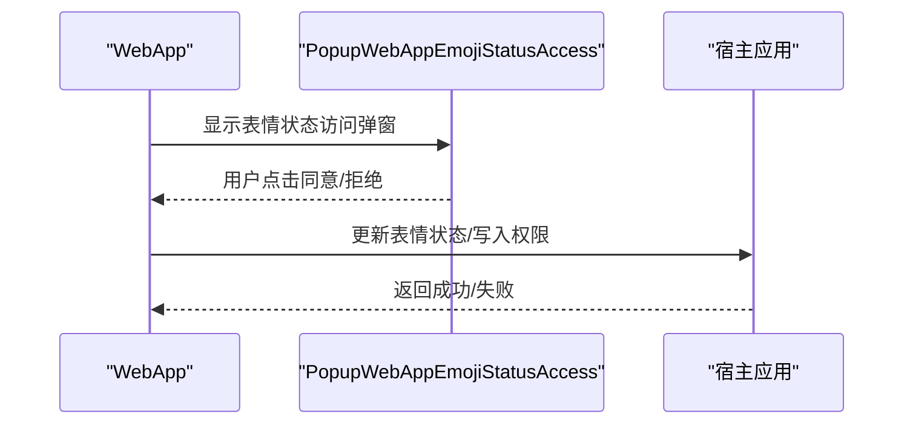
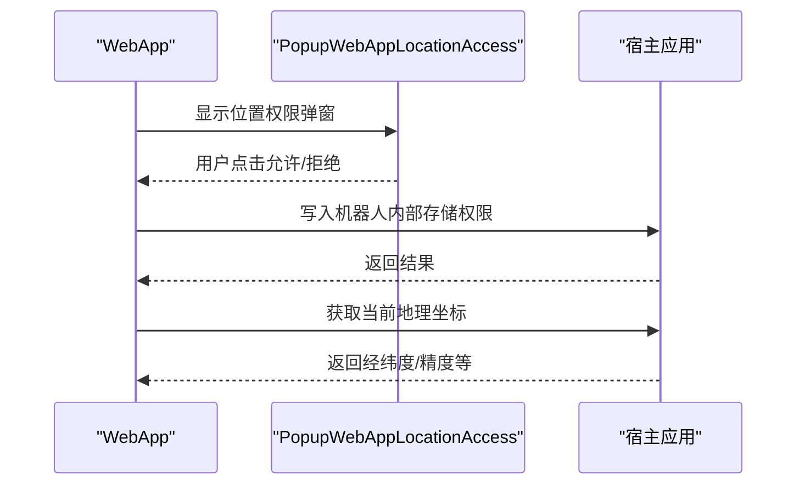
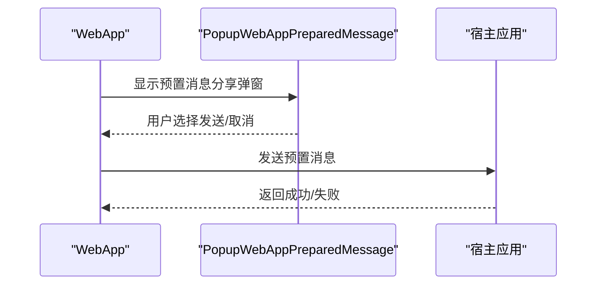
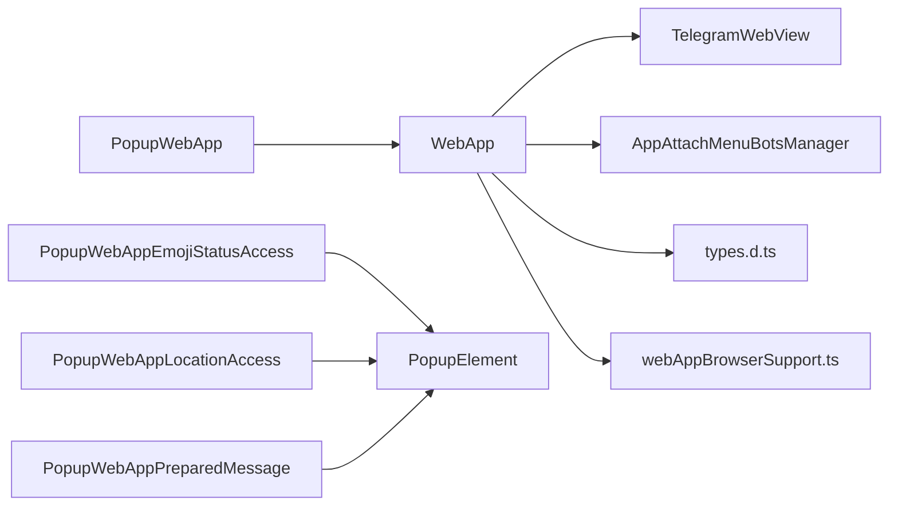

# Web应用弹窗

<cite>
**本文引用的文件**
- [src/components/webApp.tsx](file://src/components/webApp.tsx)
- [src/components/telegramWebView.ts](file://src/components/telegramWebView.ts)
- [src/components/popups/webApp.ts](file://src/components/popups/webApp.ts)
- [src/components/popups/webAppEmojiStatusAccess.tsx](file://src/components/popups/webAppEmojiStatusAccess.tsx)
- [src/components/popups/webAppLocationAccess.tsx](file://src/components/popups/webAppLocationAccess.tsx)
- [src/components/popups/webAppPreparedMessage.tsx](file://src/components/popups/webAppPreparedMessage.tsx)
- [src/lib/appManagers/appAttachMenuBotsManager.ts](file://src/lib/appManagers/appAttachMenuBotsManager.ts)
- [src/environment/webAppBrowserSupport.ts](file://src/environment/webAppBrowserSupport.ts)
- [src/types.d.ts](file://src/types.d.ts)
</cite>

## 目录
1. [简介](#简介)
2. [项目结构](#项目结构)
3. [核心组件](#核心组件)
4. [架构总览](#架构总览)
5. [详细组件分析](#详细组件分析)
6. [依赖关系分析](#依赖关系分析)
7. [性能考量](#性能考量)
8. [故障排查指南](#故障排查指南)
9. [结论](#结论)

## 简介
本文件围绕“Web应用弹窗”主题，系统梳理了Web应用容器的实现方式、沙箱安全策略、权限请求机制与消息通信协议，并深入分析Web应用与宿主应用之间的交互模式（如预置消息发送、表情状态访问、地理位置权限请求等）。文档以仓库源码为依据，结合可视化图示与分层讲解，帮助读者快速理解并高效使用该功能模块。

## 项目结构
Web应用弹窗由三层协作构成：
- 容器层：负责Web应用的生命周期、主题与颜色、全屏控制、按钮栏渲染与事件转发。
- 弹出层：封装弹窗容器，提供标题、菜单、关闭确认、遮罩与导航栈管理。
- 权限与交互层：封装各类权限弹窗（如表情状态、位置、预置消息分享）与宿主侧业务编排。

图表来源
- [src/components/popups/webApp.ts](file://src/components/popups/webApp.ts#L1-L67)
- [src/components/webApp.tsx](file://src/components/webApp.tsx#L74-L1340)
- [src/components/telegramWebView.ts](file://src/components/telegramWebView.ts#L1-L88)
- [src/components/popups/webAppEmojiStatusAccess.tsx](file://src/components/popups/webAppEmojiStatusAccess.tsx#L1-L156)
- [src/components/popups/webAppLocationAccess.tsx](file://src/components/popups/webAppLocationAccess.tsx#L1-L87)
- [src/components/popups/webAppPreparedMessage.tsx](file://src/components/popups/webAppPreparedMessage.tsx#L1-L279)
- [src/lib/appManagers/appAttachMenuBotsManager.ts](file://src/lib/appManagers/appAttachMenuBotsManager.ts#L161-L245)

章节来源
- [src/components/popups/webApp.ts](file://src/components/popups/webApp.ts#L1-L67)
- [src/components/webApp.tsx](file://src/components/webApp.tsx#L74-L1340)
- [src/components/telegramWebView.ts](file://src/components/telegramWebView.ts#L1-L88)

## 核心组件
- WebApp：Web应用容器，负责创建iframe、注入沙箱属性、监听宿主事件、派发WebApp事件、主题与颜色设置、全屏切换、按钮栏渲染、权限请求与业务编排。
- TelegramWebView：iframe桥接层，负责消息序列化/反序列化、事件派发与接收、HTML内嵌模式。
- PopupWebApp：弹窗容器，承载WebApp实例，提供标题、菜单、返回键状态、关闭确认与遮罩。
- 权限弹窗：表情状态访问、位置权限、预置消息分享等，用于用户授权与结果回传。
- AppAttachMenuBotsManager：请求WebApp地址、续期、发送数据、调用自定义方法等。

章节来源
- [src/components/webApp.tsx](file://src/components/webApp.tsx#L74-L1340)
- [src/components/telegramWebView.ts](file://src/components/telegramWebView.ts#L1-L88)
- [src/components/popups/webApp.ts](file://src/components/popups/webApp.ts#L1-L67)
- [src/lib/appManagers/appAttachMenuBotsManager.ts](file://src/lib/appManagers/appAttachMenuBotsManager.ts#L161-L245)

## 架构总览
Web应用弹窗采用“iframe沙箱 + 事件桥接”的架构，宿主通过TelegramWebView与iframe内的WebApp进行双向通信；WebApp内部根据权限与业务场景触发弹窗，完成用户授权与结果回传。

图表来源
- [src/components/webApp.tsx](file://src/components/webApp.tsx#L919-L1010)
- [src/components/telegramWebView.ts](file://src/components/telegramWebView.ts#L49-L88)

## 详细组件分析

### WebApp 容器
- 沙箱与安全
  - 使用沙箱属性集合，允许脚本、同源、弹窗、表单、模态框与用户激活存储访问，限制跨域资源与危险能力。
  - 允许传感器与地理位置等能力，但需用户授权与宿主侧二次确认。
- 生命周期与初始化
  - 生成主题参数、设置头部与背景色、插入图标与iframe、注册全屏变更事件、按需进入全屏。
  - 对于带查询ID的WebView，定时续期以保持会话有效。
- 事件桥接
  - 监听iframe_ready、web_app_ready、web_app_close、web_app_open_link、web_app_open_tg_link、web_app_open_invoice、web_app_request_theme、web_app_set_background_color、web_app_set_header_color、web_app_switch_inline_query、web_app_setup_main_button/secondary_button/back_button/settings_button、web_app_setup_closing_behavior、web_app_open_popup、web_app_open_scan_qr_popup、web_app_read_text_from_clipboard、web_app_request_write_access、web_app_request_phone、web_app_invoke_custom_method、web_app_biometry_get_info、web_app_trigger_haptic_feedback、web_app_set_bottom_bar_color、加速度计/陀螺仪/设备方向、home_screen、web_app_check_home_screen、web_app_set_emoji_status、web_app_request_emoji_status_access、web_app_check_location、web_app_request_location、web_app_open_location_settings、web_app_request_file_download、web_app_device_storage_*、web_app_secure_storage_*、web_app_request_fullscreen、web_app_exit_fullscreen、web_app_verify_age等。
- 主题与颜色
  - 主题参数来自宿主主题控制器，头部/背景色可按配置或键值设置。
- 全屏与安全区域
  - 监听全屏变化，向iframe回传安全区域信息。
- 菜单与按钮栏
  - 渲染底部主/次按钮与设置/重载/删除等菜单项，支持可见性与进度条状态。
- 权限与交互
  - 剪贴板读取、震动反馈、表情状态设置/访问、位置检查/请求、文件下载确认、设备存储读写、全屏切换、年龄验证等。

图表来源
- [src/components/webApp.tsx](file://src/components/webApp.tsx#L74-L1340)
- [src/components/telegramWebView.ts](file://src/components/telegramWebView.ts#L1-L88)
- [src/lib/appManagers/appAttachMenuBotsManager.ts](file://src/lib/appManagers/appAttachMenuBotsManager.ts#L161-L245)

章节来源
- [src/components/webApp.tsx](file://src/components/webApp.tsx#L55-L120)
- [src/components/webApp.tsx](file://src/components/webApp.tsx#L919-L1010)
- [src/components/webApp.tsx](file://src/components/webApp.tsx#L1232-L1340)

### TelegramWebView 桥接
- 负责iframe创建、沙箱与allow属性设置、加载回调、消息序列化与反序列化、事件派发与接收。
- 通过WeakMap维护iframe窗口到回调的映射，统一处理postMessage事件。

章节来源
- [src/components/telegramWebView.ts](file://src/components/telegramWebView.ts#L1-L88)

### 弹窗容器 PopupWebApp
- 将WebApp实例挂载到弹窗容器，提供标题、菜单按钮、返回键状态切换、关闭确认与遮罩。
- 在初始化完成后显示弹窗并设置浏览器宽度变量以适配布局。

章节来源
- [src/components/popups/webApp.ts](file://src/components/popups/webApp.ts#L1-L67)

### 权限弹窗与交互

#### 表情状态访问弹窗
- 功能：展示表情状态预览与说明，支持用户同意/拒绝；若无可用自定义表情，则使用默认表情集轮播。
- 流程：宿主侧发起请求，弹窗显示后等待用户选择；根据结果调用宿主侧更新表情状态或写入权限。

图表来源
- [src/components/webApp.tsx](file://src/components/webApp.tsx#L596-L678)
- [src/components/popups/webAppEmojiStatusAccess.tsx](file://src/components/popups/webAppEmojiStatusAccess.tsx#L1-L156)

章节来源
- [src/components/webApp.tsx](file://src/components/webApp.tsx#L596-L678)
- [src/components/popups/webAppEmojiStatusAccess.tsx](file://src/components/popups/webAppEmojiStatusAccess.tsx#L1-L156)

#### 地理位置权限弹窗
- 功能：提示用户是否允许Web应用获取当前位置；支持打开设置页查看/修改权限。
- 流程：宿主侧检查浏览器权限与机器人内部存储权限；若未授权则弹窗询问，用户同意后调用定位接口并回传坐标信息。

图表来源
- [src/components/webApp.tsx](file://src/components/webApp.tsx#L680-L745)
- [src/components/popups/webAppLocationAccess.tsx](file://src/components/popups/webAppLocationAccess.tsx#L1-L87)

章节来源
- [src/components/webApp.tsx](file://src/components/webApp.tsx#L680-L745)
- [src/components/popups/webAppLocationAccess.tsx](file://src/components/popups/webAppLocationAccess.tsx#L1-L87)

#### 预置消息分享弹窗
- 功能：展示预置消息内容（文本/媒体/文档），允许用户选择目标对话并发送。
- 流程：宿主侧拉取预置消息，弹窗渲染消息气泡；用户选择后调用发送接口并回传结果。

图表来源
- [src/components/webApp.tsx](file://src/components/webApp.tsx#L1164-L1188)
- [src/components/popups/webAppPreparedMessage.tsx](file://src/components/popups/webAppPreparedMessage.tsx#L1-L279)

章节来源
- [src/components/webApp.tsx](file://src/components/webApp.tsx#L1164-L1188)
- [src/components/popups/webAppPreparedMessage.tsx](file://src/components/popups/webAppPreparedMessage.tsx#L1-L279)

### 消息通信协议
- 事件类型与参数
  - 宿主向WebApp发送事件：如web_app_setup_main_button、web_app_setup_secondary_button、web_app_set_header_color、web_app_set_background_color、web_app_switch_inline_query、web_app_request_write_access、web_app_request_phone、web_app_invoke_custom_method、web_app_request_fullscreen、web_app_exit_fullscreen、web_app_request_file_download、web_app_device_storage_*、web_app_secure_storage_*、web_app_verify_age等。
  - WebApp向宿主回传事件：如main_button_pressed、secondary_button_pressed、popup_closed、clipboard_text_received、write_access_requested、phone_requested、custom_method_invoked、fullscreen_changed、content_safe_area_changed、prepared_message_sent、prepared_message_failed、location_checked、location_requested、emoji_status_set、emoji_status_failed、emoji_status_access_requested、device_orientation_changed、gyroscope_changed、accelerometer_changed等。
- 数据结构
  - 事件参数与返回值在类型声明中明确，便于静态校验与IDE提示。

章节来源
- [src/types.d.ts](file://src/types.d.ts#L190-L493)

## 依赖关系分析

图表来源
- [src/components/webApp.tsx](file://src/components/webApp.tsx#L74-L1340)
- [src/components/telegramWebView.ts](file://src/components/telegramWebView.ts#L1-L88)
- [src/lib/appManagers/appAttachMenuBotsManager.ts](file://src/lib/appManagers/appAttachMenuBotsManager.ts#L161-L245)
- [src/components/popups/webApp.ts](file://src/components/popups/webApp.ts#L1-L67)
- [src/components/popups/webAppEmojiStatusAccess.tsx](file://src/components/popups/webAppEmojiStatusAccess.tsx#L1-L156)
- [src/components/popups/webAppLocationAccess.tsx](file://src/components/popups/webAppLocationAccess.tsx#L1-L87)
- [src/components/popups/webAppPreparedMessage.tsx](file://src/components/popups/webAppPreparedMessage.tsx#L1-L279)
- [src/types.d.ts](file://src/types.d.ts#L190-L493)
- [src/environment/webAppBrowserSupport.ts](file://src/environment/webAppBrowserSupport.ts#L1-L5)

章节来源
- [src/components/webApp.tsx](file://src/components/webApp.tsx#L74-L1340)
- [src/components/telegramWebView.ts](file://src/components/telegramWebView.ts#L1-L88)
- [src/lib/appManagers/appAttachMenuBotsManager.ts](file://src/lib/appManagers/appAttachMenuBotsManager.ts#L161-L245)
- [src/components/popups/webApp.ts](file://src/components/popups/webApp.ts#L1-L67)
- [src/components/popups/webAppEmojiStatusAccess.tsx](file://src/components/popups/webAppEmojiStatusAccess.tsx#L1-L156)
- [src/components/popups/webAppLocationAccess.tsx](file://src/components/popups/webAppLocationAccess.tsx#L1-L87)
- [src/components/popups/webAppPreparedMessage.tsx](file://src/components/popups/webAppPreparedMessage.tsx#L1-L279)
- [src/types.d.ts](file://src/types.d.ts#L190-L493)
- [src/environment/webAppBrowserSupport.ts](file://src/environment/webAppBrowserSupport.ts#L1-L5)

## 性能考量
- 事件去抖与节流
  - 对频繁触发的权限弹窗与设备传感器事件，采用去抖策略避免重复弹窗与事件风暴。
- DOM与渲染
  - 按需渲染按钮栏与弹窗内容，减少不必要的DOM操作；全屏切换时仅更新必要样式与事件。
- 资源加载
  - 通过TelegramWebView延迟加载与透明过渡，提升首屏体验；对大文件下载提供手动下载回退方案。
- 会话续期
  - 对带查询ID的WebView定时续期，避免长时间无交互导致会话失效。
- 设备传感器
  - 对加速度计/陀螺仪/设备方向事件设置超时与频率控制，降低CPU占用。

章节来源
- [src/components/webApp.tsx](file://src/components/webApp.tsx#L491-L525)
- [src/components/webApp.tsx](file://src/components/webApp.tsx#L826-L842)
- [src/components/webApp.tsx](file://src/components/webApp.tsx#L1311-L1338)

## 故障排查指南
- 无法打开Web应用弹窗
  - 检查浏览器是否支持WebApp（触摸设备可能不支持），以及沙箱属性是否正确设置。
- 权限请求被拒
  - 检查浏览器权限状态与机器人内部存储权限；确认用户已明确授权。
- 位置权限无效
  - 确认已显示位置权限弹窗并记录用户选择；若拒绝则不会返回坐标。
- 文件下载失败
  - 确认服务器端校验通过；若跨域或受限，提供手动下载回退方案。
- 全屏失败
  - 检查浏览器全屏API支持与用户手势触发；宿主侧捕获错误并回传失败原因。
- 事件未到达
  - 检查postMessage序列化与弱映射是否正确；确认iframe内容页已正确监听并回传结果。

章节来源
- [src/environment/webAppBrowserSupport.ts](file://src/environment/webAppBrowserSupport.ts#L1-L5)
- [src/components/webApp.tsx](file://src/components/webApp.tsx#L919-L1010)
- [src/components/webApp.tsx](file://src/components/webApp.tsx#L1295-L1300)
- [src/components/webApp.tsx](file://src/components/webApp.tsx#L844-L917)

## 结论
该Web应用弹窗体系以TelegramWebView为核心桥接，结合WebApp容器与多种权限弹窗，实现了安全可控、交互丰富的Web应用体验。通过严格的沙箱策略、完善的事件协议与去抖/节流机制，既保证了安全性，也兼顾了性能与稳定性。开发者可基于现有框架扩展更多权限与交互场景，同时遵循宿主侧的权限与安全约束。