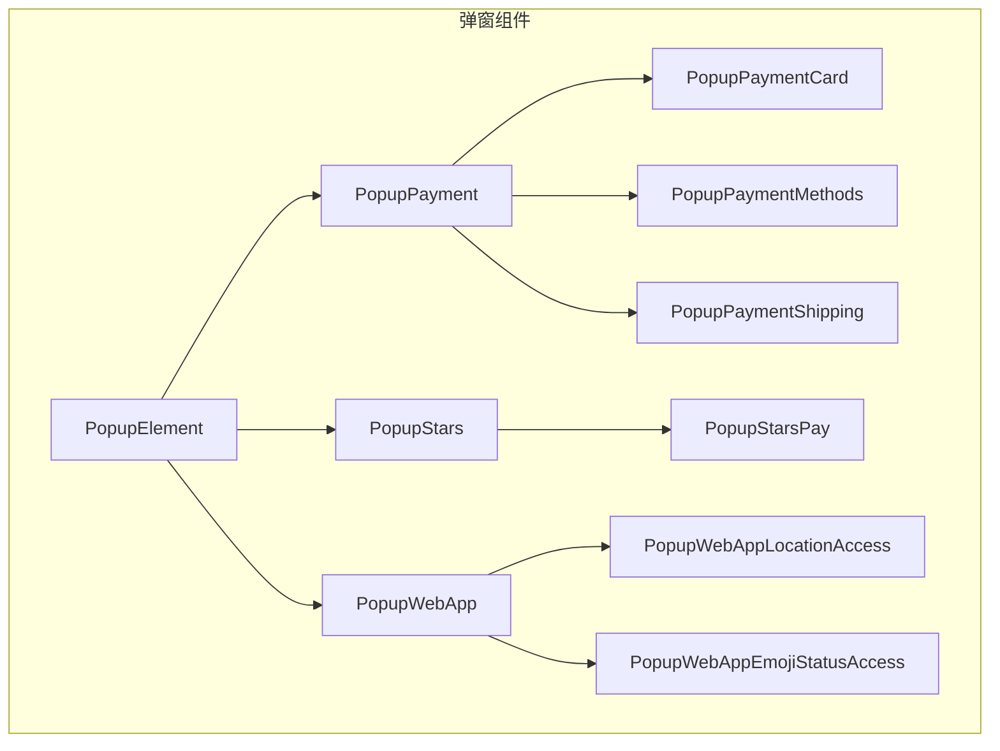
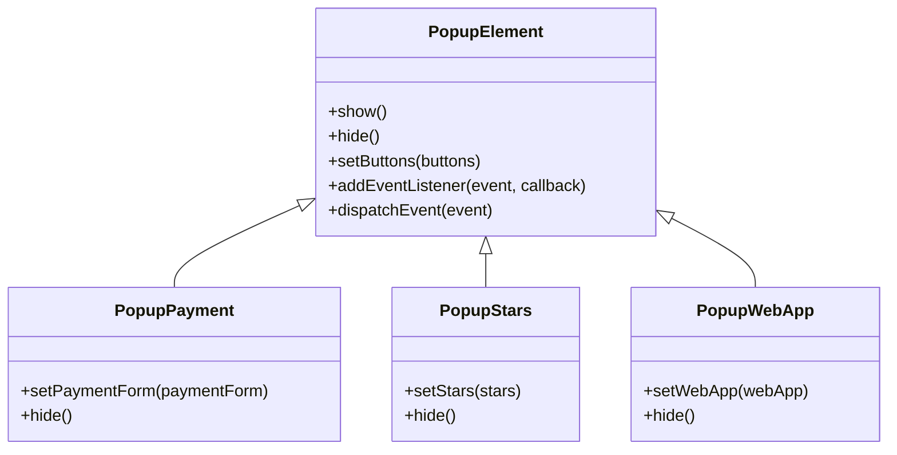
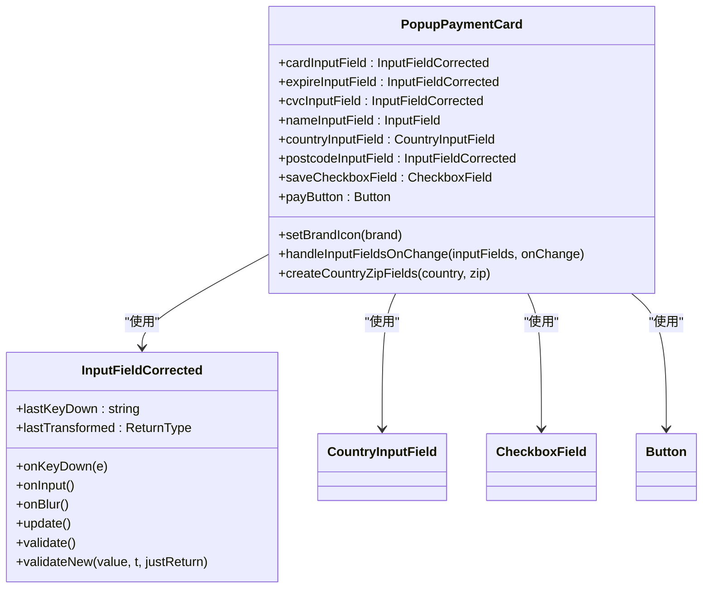
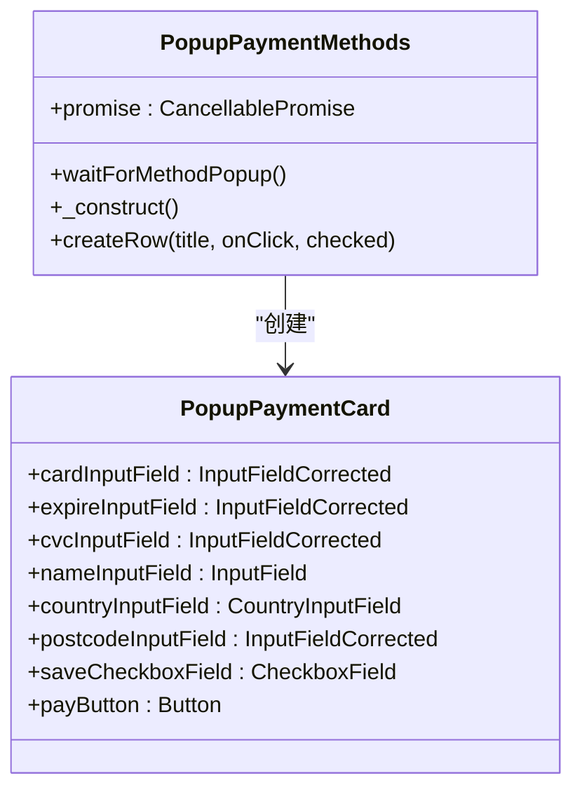
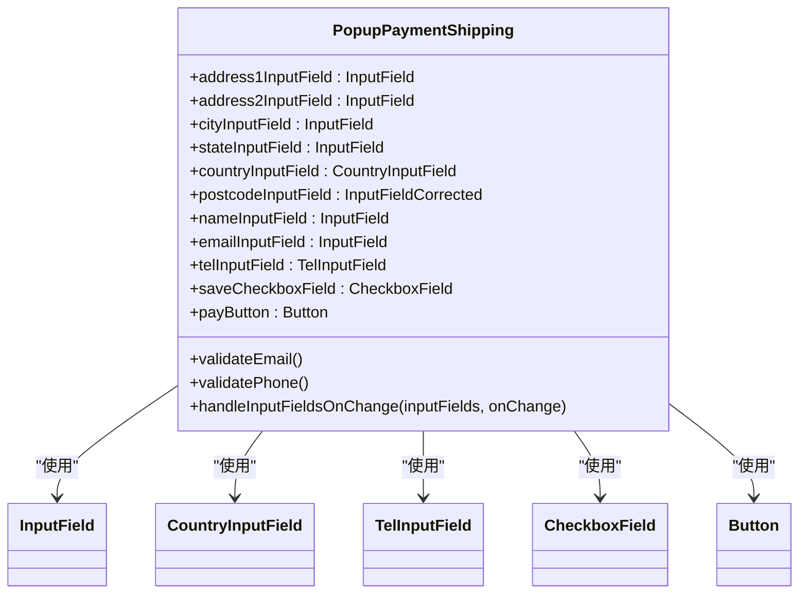
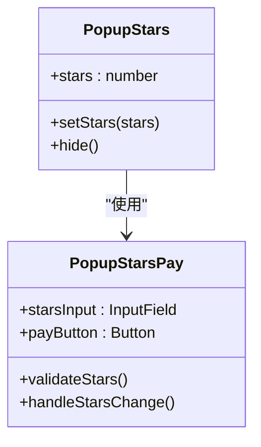
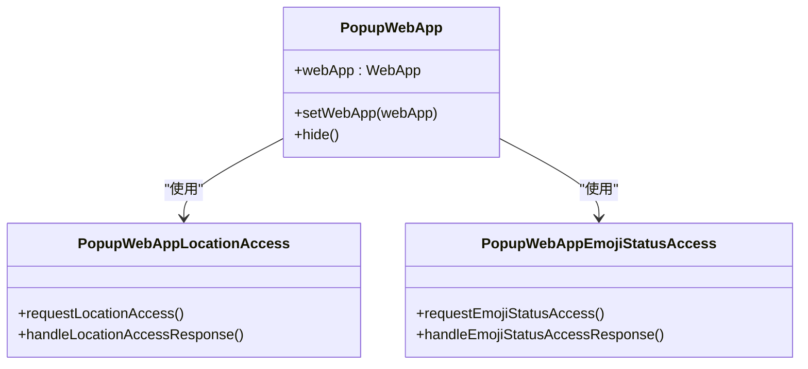
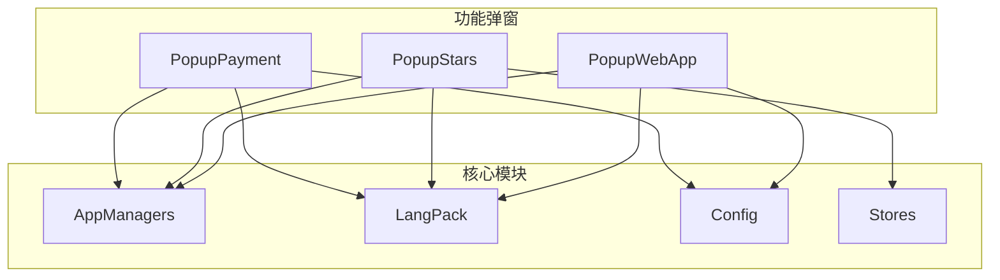

# 功能弹窗

<cite>
**本文档中引用的文件**  
- [payment.ts](file://src/components/popups/payment.ts)
- [paymentCard.ts](file://src/components/popups/paymentCard.ts)
- [paymentCardConfirmation.ts](file://src/components/popups/paymentCardConfirmation.ts)
- [paymentMethods.tsx](file://src/components/popups/paymentMethods.tsx)
- [paymentShipping.ts](file://src/components/popups/paymentShipping.ts)
- [paymentShippingMethods.ts](file://src/components/popups/paymentShippingMethods.ts)
- [stars.tsx](file://src/components/popups/stars.tsx)
- [starsPay.tsx](file://src/components/popups/starsPay.tsx)
- [webApp.ts](file://src/components/popups/webApp.ts)
- [index.ts](file://src/components/popups/index.ts)
- [indexTsx.tsx](file://src/components/popups/indexTsx.tsx)
- [config.ts](file://src/config/currencies.ts)
- [appManagers.ts](file://src/lib/appManagers/managers.ts)
- [langPack.ts](file://src/lib/langPack/index.ts)
- [stores.ts](file://src/stores/stars.ts)
</cite>

## 目录
1. [简介](#简介)
2. [项目结构](#项目结构)
3. [核心组件](#核心组件)
4. [架构概述](#架构概述)
5. [详细组件分析](#详细组件分析)
6. [依赖分析](#依赖分析)
7. [性能考虑](#性能考虑)
8. [故障排除指南](#故障排除指南)
9. [结论](#结论)

## 简介
本文档详细描述了Web应用中功能型弹窗的实现，重点涵盖支付流程相关的弹窗组件、Web应用容器的沙箱安全策略和消息通信协议，以及打赏、礼物、Stars虚拟货币和Star Gift等高级功能的弹窗实现。文档从代码库中提取具体的实现细节，包括支付表单的结构、Web应用的权限请求机制、礼物发送流程和虚拟商品交易逻辑，并提供性能优化建议，确保复杂功能弹窗的流畅用户体验。

## 项目结构
项目结构清晰地组织了功能弹窗相关的组件，主要位于`src/components/popups/`目录下。该目录包含了支付、打赏、礼物、Stars虚拟货币等高级功能的弹窗实现。核心弹窗基类`PopupElement`定义了弹窗的基本行为和生命周期，而具体的弹窗组件如`PopupPayment`、`PopupStars`等则继承自该基类并实现特定功能。

**Diagram sources**
- [index.ts](file://src/components/popups/index.ts)
- [payment.ts](file://src/components/popups/payment.ts)
- [stars.tsx](file://src/components/popups/stars.tsx)
- [webApp.ts](file://src/components/popups/webApp.ts)

**Section sources**
- [index.ts](file://src/components/popups/index.ts)
- [payment.ts](file://src/components/popups/payment.ts)
- [stars.tsx](file://src/components/popups/stars.tsx)
- [webApp.ts](file://src/components/popups/webApp.ts)

## 核心组件
核心组件包括`PopupElement`基类、`PopupPayment`支付弹窗、`PopupStars`打赏弹窗和`PopupWebApp` Web应用弹窗。这些组件通过继承和组合的方式，实现了复杂的功能弹窗系统。`PopupElement`提供了弹窗的通用功能，如显示、隐藏、按钮管理等；`PopupPayment`处理支付流程，包括支付卡信息、支付确认、支付方式选择、配送信息和支付验证；`PopupStars`处理打赏、礼物、Stars虚拟货币和Star Gift等高级功能；`PopupWebApp`处理Web应用容器的沙箱安全策略和消息通信协议。

**Section sources**
- [index.ts](file://src/components/popups/index.ts)
- [payment.ts](file://src/components/popups/payment.ts)
- [stars.tsx](file://src/components/popups/stars.tsx)
- [webApp.ts](file://src/components/popups/webApp.ts)

## 架构概述
功能弹窗系统的架构基于组件化设计，通过继承和组合的方式实现功能复用和扩展。`PopupElement`作为基类，定义了弹窗的基本行为和生命周期。具体的弹窗组件如`PopupPayment`、`PopupStars`等继承自`PopupElement`并实现特定功能。弹窗组件之间通过事件机制进行通信，确保了组件的解耦和灵活性。

**Diagram sources**
- [index.ts](file://src/components/popups/index.ts)
- [payment.ts](file://src/components/popups/payment.ts)
- [stars.tsx](file://src/components/popups/stars.tsx)
- [webApp.ts](file://src/components/popups/webApp.ts)

## 详细组件分析

### 支付弹窗分析
`PopupPayment`组件负责处理支付流程，包括支付界面、支付卡信息、支付确认、支付方式选择、配送信息和支付验证。该组件通过组合多个子组件（如`PopupPaymentCard`、`PopupPaymentMethods`、`PopupPaymentShipping`等）来实现完整的支付流程。

#### 支付卡信息组件

**Diagram sources**
- [paymentCard.ts](file://src/components/popups/paymentCard.ts)
- [payment.ts](file://src/components/popups/payment.ts)

#### 支付方式选择组件

**Diagram sources**
- [paymentMethods.tsx](file://src/components/popups/paymentMethods.tsx)
- [paymentCard.ts](file://src/components/popups/paymentCard.ts)

#### 配送信息组件

**Diagram sources**
- [paymentShipping.ts](file://src/components/popups/paymentShipping.ts)
- [payment.ts](file://src/components/popups/payment.ts)

### 打赏与虚拟货币弹窗分析
`PopupStars`组件负责处理打赏、礼物、Stars虚拟货币和Star Gift等高级功能。该组件通过与`PopupStarsPay`组件的组合，实现了打赏和虚拟商品交易的完整流程。

#### 打赏与虚拟货币组件

**Diagram sources**
- [stars.tsx](file://src/components/popups/stars.tsx)
- [starsPay.tsx](file://src/components/popups/starsPay.tsx)

### Web应用弹窗分析
`PopupWebApp`组件负责处理Web应用容器的沙箱安全策略和消息通信协议。该组件通过与`PopupWebAppLocationAccess`和`PopupWebAppEmojiStatusAccess`组件的组合，实现了Web应用的权限请求机制。

#### Web应用组件

**Diagram sources**
- [webApp.ts](file://src/components/popups/webApp.ts)
- [webAppLocationAccess.tsx](file://src/components/popups/webAppLocationAccess.tsx)
- [webAppEmojiStatusAccess.tsx](file://src/components/popups/webAppEmojiStatusAccess.tsx)

## 依赖分析
功能弹窗系统依赖于多个核心模块，包括支付管理器、应用管理器、语言包、配置和存储。这些模块通过依赖注入的方式提供给弹窗组件，确保了组件的解耦和可测试性。

**Diagram sources**
- [appManagers.ts](file://src/lib/appManagers/managers.ts)
- [langPack.ts](file://src/lib/langPack/index.ts)
- [config.ts](file://src/config/currencies.ts)
- [stores.ts](file://src/stores/stars.ts)

## 性能考虑
为了确保复杂功能弹窗的流畅用户体验，建议采取以下性能优化措施：
1. **懒加载**：对于不立即需要的组件，采用懒加载策略，减少初始加载时间。
2. **事件委托**：使用事件委托来减少事件监听器的数量，提高事件处理效率。
3. **虚拟滚动**：对于长列表，使用虚拟滚动技术，只渲染可见区域的元素。
4. **缓存**：对频繁访问的数据进行缓存，减少重复计算和网络请求。
5. **异步加载**：对于耗时的操作，采用异步加载，避免阻塞主线程。

## 故障排除指南
在使用功能弹窗时，可能会遇到以下常见问题：
1. **弹窗无法显示**：检查弹窗组件是否正确初始化，确保`show()`方法被调用。
2. **支付失败**：检查支付表单的输入是否正确，确保所有必填字段都已填写。
3. **Web应用权限请求失败**：检查Web应用的沙箱安全策略是否正确配置，确保权限请求被正确处理。
4. **打赏或礼物发送失败**：检查用户账户余额是否充足，确保交易逻辑正确执行。

**Section sources**
- [payment.ts](file://src/components/popups/payment.ts)
- [stars.tsx](file://src/components/popups/stars.tsx)
- [webApp.ts](file://src/components/popups/webApp.ts)

## 结论
本文档详细描述了功能型弹窗的实现，涵盖了支付流程、Web应用容器的沙箱安全策略和消息通信协议，以及打赏、礼物、Stars虚拟货币和Star Gift等高级功能。通过组件化设计和事件机制，实现了功能的复用和扩展，确保了系统的灵活性和可维护性。同时，提供了性能优化建议和故障排除指南，帮助开发者构建流畅、稳定的用户体验。