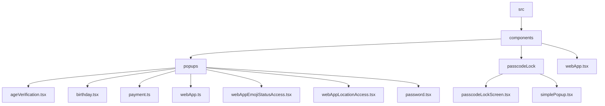
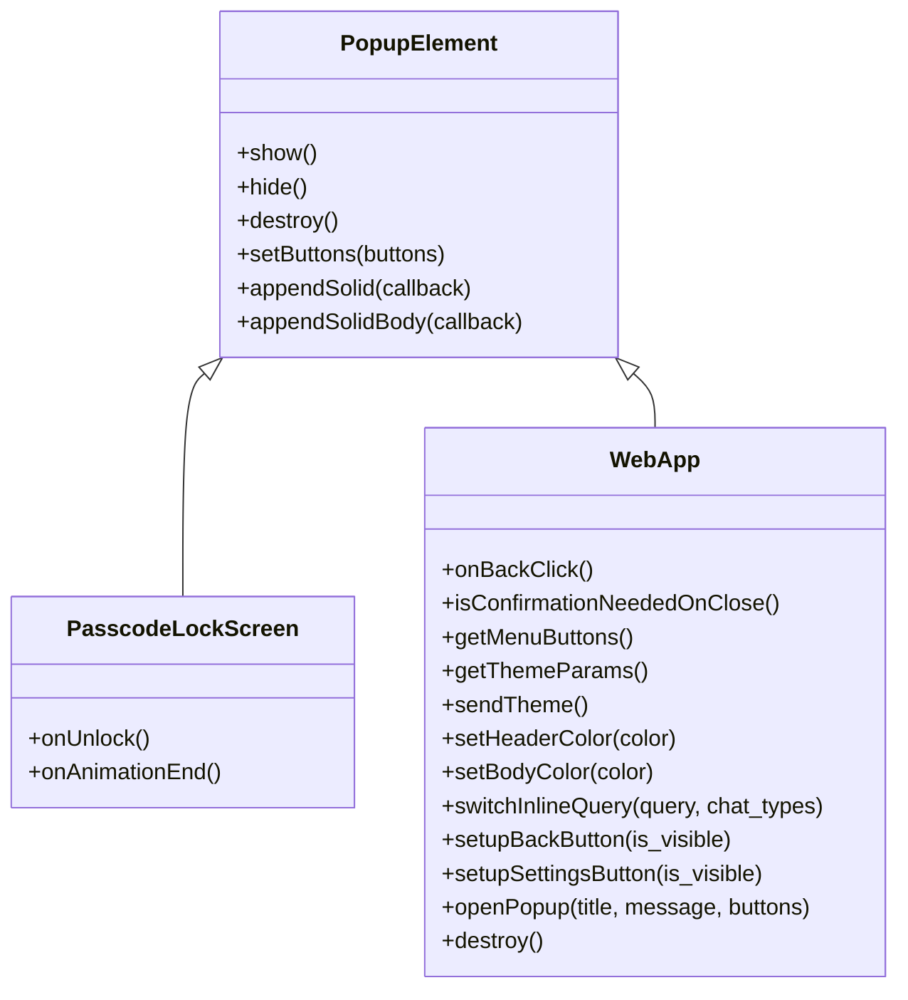
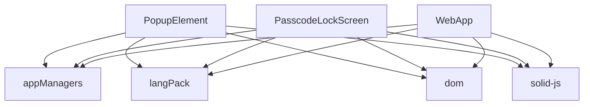

# 弹窗组件

<cite>
**本文档引用的文件**   
- [confirmationPopup.ts](file://src/components/confirmationPopup.ts)
- [index.ts](file://src/components/popups/index.ts)
- [indexTsx.tsx](file://src/components/popups/indexTsx.tsx)
- [ageVerification.tsx](file://src/components/popups/ageVerification.tsx)
- [birthday.tsx](file://src/components/popups/birthday.tsx)
- [payment.ts](file://src/components/popups/payment.ts)
- [webApp.ts](file://src/components/popups/webApp.ts)
- [webAppEmojiStatusAccess.tsx](file://src/components/popups/webAppEmojiStatusAccess.tsx)
- [webAppLocationAccess.tsx](file://src/components/popups/webAppLocationAccess.tsx)
- [password.tsx](file://src/components/popups/password.tsx)
- [passcodeLockScreen.tsx](file://src/components/passcodeLock/passcodeLockScreen.tsx)
- [simplePopup.tsx](file://src/components/passcodeLock/simplePopup.tsx)
- [webApp.tsx](file://src/components/webApp.tsx)
</cite>

## 目录
1. [简介](#简介)
2. [项目结构](#项目结构)
3. [核心组件](#核心组件)
4. [架构概述](#架构概述)
5. [详细组件分析](#详细组件分析)
6. [依赖分析](#依赖分析)
7. [性能考虑](#性能考虑)
8. [故障排除指南](#故障排除指南)
9. [结论](#结论)

## 简介
本文档详细介绍了弹窗和模态组件的实现，涵盖了通用弹窗、确认对话框、简单弹窗、年龄验证、生日设置、支付界面、Web应用容器和密码锁屏等组件。文档详细说明了弹窗的打开/关闭动画、遮罩层交互、焦点陷阱实现和键盘快捷键支持。同时，解释了不同弹窗类型的使用场景和设计规范，提供了嵌套弹窗的管理策略和z-index层级控制。文档还记录了密码锁屏的安全实现，包括生物识别集成和防暴力破解机制，描述了Web应用容器的沙箱安全策略和消息通信协议。此外，文档包含了无障碍访问支持，如屏幕阅读器通知和焦点管理，并提供了主题定制指南，允许修改弹窗外观和动画效果。

## 项目结构
项目结构清晰，主要组件位于`src/components`目录下。弹窗相关组件主要集中在`src/components/popups`和`src/components/passcodeLock`目录中。`src/components/popups`目录包含了各种弹窗组件，如`ageVerification.tsx`、`birthday.tsx`、`payment.ts`等。`src/components/passcodeLock`目录包含了密码锁屏相关的组件，如`passcodeLockScreen.tsx`和`simplePopup.tsx`。此外，`src/components/webApp.tsx`文件负责Web应用容器的实现。

**Diagram sources**
- [src/components/popups/ageVerification.tsx](file://src/components/popups/ageVerification.tsx)
- [src/components/popups/birthday.tsx](file://src/components/popups/birthday.tsx)
- [src/components/popups/payment.ts](file://src/components/popups/payment.ts)
- [src/components/popups/webApp.ts](file://src/components/popups/webApp.ts)
- [src/components/popups/webAppEmojiStatusAccess.tsx](file://src/components/popups/webAppEmojiStatusAccess.tsx)
- [src/components/popups/webAppLocationAccess.tsx](file://src/components/popups/webAppLocationAccess.tsx)
- [src/components/popups/password.tsx](file://src/components/popups/password.tsx)
- [src/components/passcodeLock/passcodeLockScreen.tsx](file://src/components/passcodeLock/passcodeLockScreen.tsx)
- [src/components/passcodeLock/simplePopup.tsx](file://src/components/passcodeLock/simplePopup.tsx)
- [src/components/webApp.tsx](file://src/components/webApp.tsx)

**Section sources**
- [src/components/popups/ageVerification.tsx](file://src/components/popups/ageVerification.tsx)
- [src/components/popups/birthday.tsx](file://src/components/popups/birthday.tsx)
- [src/components/popups/payment.ts](file://src/components/popups/payment.ts)
- [src/components/popups/webApp.ts](file://src/components/popups/webApp.ts)
- [src/components/popups/webAppEmojiStatusAccess.tsx](file://src/components/popups/webAppEmojiStatusAccess.tsx)
- [src/components/popups/webAppLocationAccess.tsx](file://src/components/popups/webAppLocationAccess.tsx)
- [src/components/popups/password.tsx](file://src/components/popups/password.tsx)
- [src/components/passcodeLock/passcodeLockScreen.tsx](file://src/components/passcodeLock/passcodeLockScreen.tsx)
- [src/components/passcodeLock/simplePopup.tsx](file://src/components/passcodeLock/simplePopup.tsx)
- [src/components/webApp.tsx](file://src/components/webApp.tsx)

## 核心组件
核心组件包括`PopupElement`、`PasscodeLockScreen`、`WebApp`等。`PopupElement`是所有弹窗组件的基础类，提供了弹窗的通用功能，如打开/关闭、遮罩层交互、焦点陷阱等。`PasscodeLockScreen`是密码锁屏组件，负责处理密码输入和验证。`WebApp`是Web应用容器组件，负责加载和管理Web应用。

**Section sources**
- [src/components/popups/index.ts](file://src/components/popups/index.ts)
- [src/components/passcodeLock/passcodeLockScreen.tsx](file://src/components/passcodeLock/passcodeLockScreen.tsx)
- [src/components/webApp.tsx](file://src/components/webApp.tsx)

## 架构概述
弹窗组件的架构基于`PopupElement`类，所有弹窗组件都继承自该类。`PopupElement`类提供了弹窗的通用功能，如打开/关闭、遮罩层交互、焦点陷阱等。`PasscodeLockScreen`和`WebApp`等具体组件通过继承`PopupElement`类来实现特定功能。`WebApp`组件通过`TelegramWebView`与Web应用进行通信，实现了沙箱安全策略和消息通信协议。

**Diagram sources**
- [src/components/popups/index.ts](file://src/components/popups/index.ts)
- [src/components/passcodeLock/passcodeLockScreen.tsx](file://src/components/passcodeLock/passcodeLockScreen.tsx)
- [src/components/webApp.tsx](file://src/components/webApp.tsx)

## 详细组件分析
### 通用弹窗组件
通用弹窗组件`PopupElement`提供了弹窗的通用功能，如打开/关闭、遮罩层交互、焦点陷阱等。`PopupElement`类通过`show()`和`hide()`方法控制弹窗的显示和隐藏，通过`setButtons()`方法设置弹窗的按钮，通过`appendSolid()`和`appendSolidBody()`方法添加内容。

**Section sources**
- [src/components/popups/index.ts](file://src/components/popups/index.ts)

### 确认对话框组件
确认对话框组件`confirmationPopup`继承自`PopupElement`类，提供了确认对话框的功能。`confirmationPopup`类通过`createPopup()`方法创建确认对话框，通过`addCancelButton()`方法添加取消按钮。

**Section sources**
- [src/components/confirmationPopup.ts](file://src/components/confirmationPopup.ts)

### 简单弹窗组件
简单弹窗组件`simplePopup`继承自`PopupElement`类，提供了简单弹窗的功能。`simplePopup`类通过`createPopup()`方法创建简单弹窗，通过`addCancelButton()`方法添加取消按钮。

**Section sources**
- [src/components/passcodeLock/simplePopup.tsx](file://src/components/passcodeLock/simplePopup.tsx)

### 年龄验证组件
年龄验证组件`AgeVerificationPopup`继承自`PopupElement`类，提供了年龄验证的功能。`AgeVerificationPopup`类通过`create()`方法创建年龄验证弹窗，通过`_construct()`方法构建弹窗内容。

**Section sources**
- [src/components/popups/ageVerification.tsx](file://src/components/popups/ageVerification.tsx)

### 生日设置组件
生日设置组件`showBirthdayPopup`提供了生日设置的功能。`showBirthdayPopup`函数通过`createPopup()`方法创建生日设置弹窗，通过`_construct()`方法构建弹窗内容。

**Section sources**
- [src/components/popups/birthday.tsx](file://src/components/popups/birthday.tsx)

### 支付界面组件
支付界面组件`PopupPayment`继承自`PopupElement`类，提供了支付界面的功能。`PopupPayment`类通过`setPaymentForm()`方法设置支付表单，通过`d()`方法处理支付逻辑。

**Section sources**
- [src/components/popups/payment.ts](file://src/components/popups/payment.ts)

### Web应用容器组件
Web应用容器组件`WebApp`继承自`PopupElement`类，提供了Web应用容器的功能。`WebApp`类通过`init()`方法初始化Web应用，通过`destroy()`方法销毁Web应用。

**Section sources**
- [src/components/webApp.tsx](file://src/components/webApp.tsx)

### 密码锁屏组件
密码锁屏组件`PasscodeLockScreen`继承自`PopupElement`类，提供了密码锁屏的功能。`PasscodeLockScreen`类通过`onUnlock()`方法处理解锁逻辑，通过`onAnimationEnd()`方法处理动画结束逻辑。

**Section sources**
- [src/components/passcodeLock/passcodeLockScreen.tsx](file://src/components/passcodeLock/passcodeLockScreen.tsx)

## 依赖分析
弹窗组件依赖于多个核心模块，如`appManagers`、`langPack`、`dom`等。`appManagers`模块提供了应用管理功能，`langPack`模块提供了多语言支持，`dom`模块提供了DOM操作功能。此外，弹窗组件还依赖于`solid-js`框架，用于实现响应式UI。

**Diagram sources**
- [src/components/popups/index.ts](file://src/components/popups/index.ts)
- [src/components/passcodeLock/passcodeLockScreen.tsx](file://src/components/passcodeLock/passcodeLockScreen.tsx)
- [src/components/webApp.tsx](file://src/components/webApp.tsx)

## 性能考虑
弹窗组件在性能方面进行了优化，如使用`requestAnimationFrame`进行动画处理，使用`debounce`和`throttle`进行事件处理，使用`lazy loading`进行资源加载。此外，弹窗组件还使用了`virtual DOM`技术，减少了DOM操作的开销。

## 故障排除指南
### 弹窗无法显示
检查`PopupElement`的`show()`方法是否被正确调用，检查`appManagers`模块是否正常工作。

### 弹窗无法隐藏
检查`PopupElement`的`hide()`方法是否被正确调用，检查`appManagers`模块是否正常工作。

### Web应用无法加载
检查`WebApp`的`init()`方法是否被正确调用，检查`TelegramWebView`是否正常工作。

**Section sources**
- [src/components/popups/index.ts](file://src/components/popups/index.ts)
- [src/components/passcodeLock/passcodeLockScreen.tsx](file://src/components/passcodeLock/passcodeLockScreen.tsx)
- [src/components/webApp.tsx](file://src/components/webApp.tsx)

## 结论
本文档详细介绍了弹窗和模态组件的实现，涵盖了通用弹窗、确认对话框、简单弹窗、年龄验证、生日设置、支付界面、Web应用容器和密码锁屏等组件。文档详细说明了弹窗的打开/关闭动画、遮罩层交互、焦点陷阱实现和键盘快捷键支持。同时，解释了不同弹窗类型的使用场景和设计规范，提供了嵌套弹窗的管理策略和z-index层级控制。文档还记录了密码锁屏的安全实现，包括生物识别集成和防暴力破解机制，描述了Web应用容器的沙箱安全策略和消息通信协议。此外，文档包含了无障碍访问支持，如屏幕阅读器通知和焦点管理，并提供了主题定制指南，允许修改弹窗外观和动画效果。