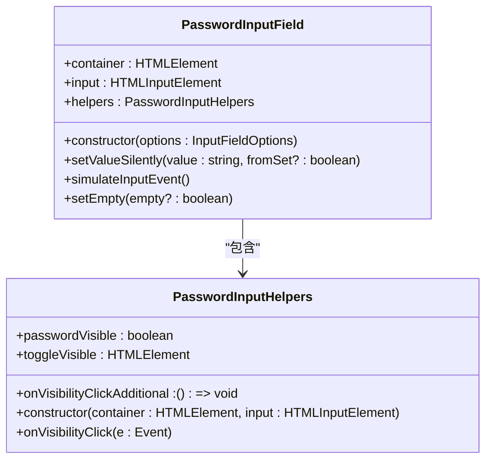
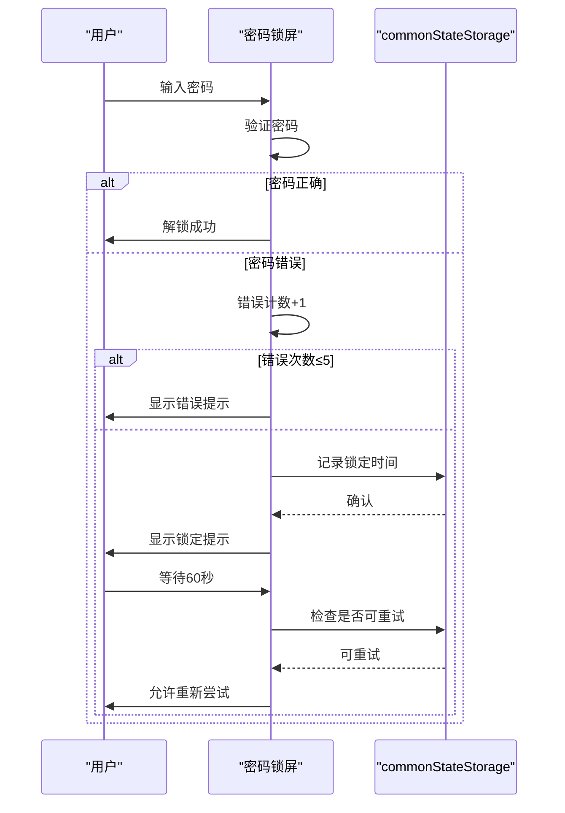
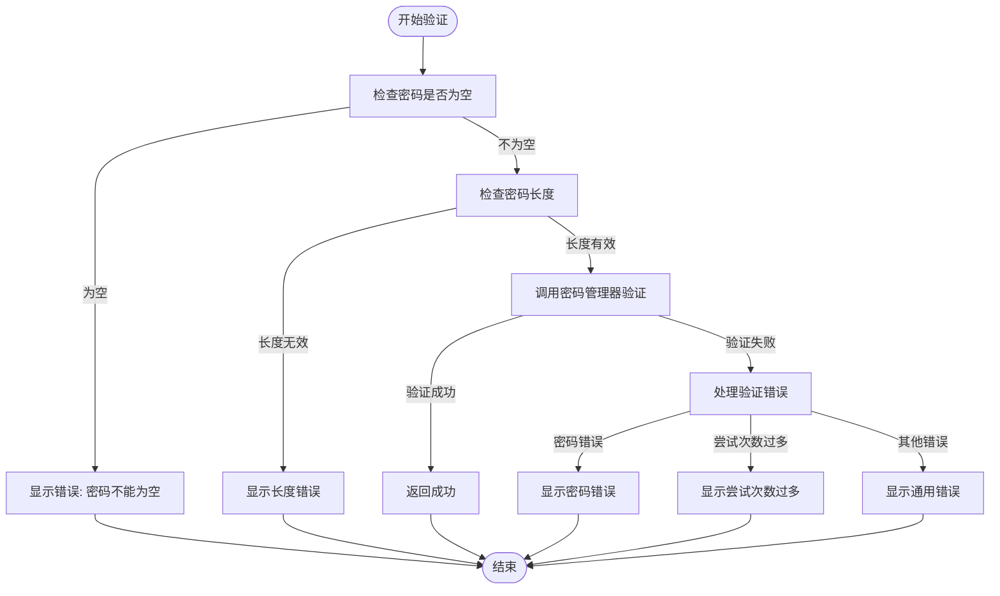
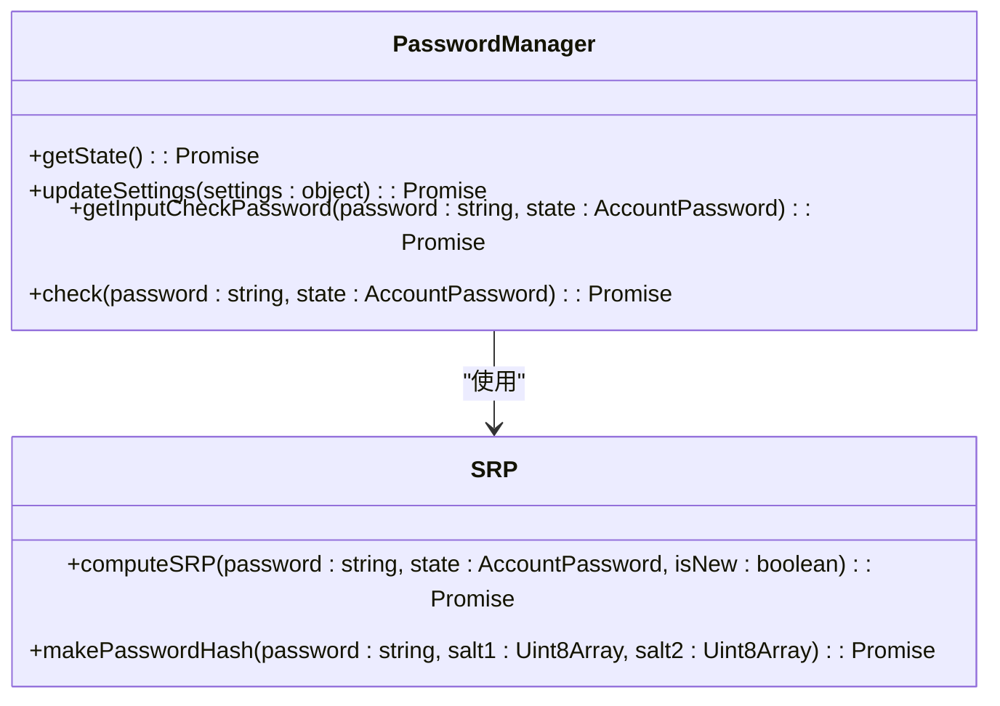
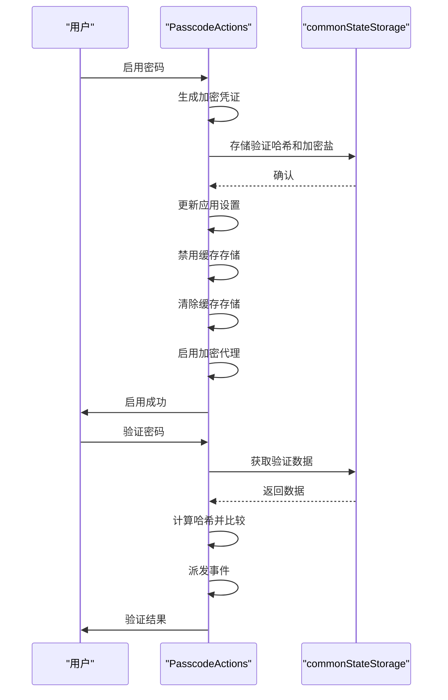

# 密码认证弹窗

<cite>
**本文档引用的文件**
- [password.tsx](file://src/components/popups/password.tsx)
- [passwordInputField.ts](file://src/components/passwordInputField.ts)
- [passcodeLockScreen.tsx](file://src/components/passcodeLock/passcodeLockScreen.tsx)
- [pagePassword.ts](file://src/pages/pagePassword.ts)
- [actions.ts](file://src/lib/passcode/actions.ts)
- [constants.ts](file://src/lib/passcode/constants.ts)
- [inputField.ts](file://src/components/inputField.ts)
- [mtproto/passwordManager.ts](file://src/lib/mtproto/passwordManager.ts)
- [srp.ts](file://src/lib/crypto/srp.ts)
- [commonStateStorage.ts](file://src/lib/commonStateStorage.ts)
</cite>

## 目录
1. [简介](#简介)
2. [密码输入组件实现](#密码输入组件实现)
3. [密码锁屏安全机制](#密码锁屏安全机制)
4. [表单验证与错误处理](#表单验证与错误处理)
5. [安全存储机制](#安全存储机制)
6. [无障碍访问指南](#无障碍访问指南)
7. [结论](#结论)

## 简介
密码认证弹窗是应用程序安全体系的核心组件，负责处理用户身份验证过程中的密码输入和验证。该系统实现了多层次的安全机制，包括密码输入掩码、防暴力破解、安全存储和用户界面反馈。密码认证系统不仅用于初始登录，还用于应用锁屏、敏感操作验证等场景，确保用户数据的安全性。

**Section sources**
- [password.tsx](file://src/components/popups/password.tsx#L1-L69)
- [passcodeLockScreen.tsx](file://src/components/passcodeLock/passcodeLockScreen.tsx#L1-L252)

## 密码输入组件实现

### 密码字段类型与输入掩码
密码输入组件实现了标准的密码字段类型，使用`type="password"`属性确保输入内容被掩码显示。组件通过`PasswordInputField`类封装了密码输入功能，提供了密码可见性切换功能，允许用户在需要时查看输入的密码内容。

**Diagram sources**
- [passwordInputField.ts](file://src/components/passwordInputField.ts#L1-L71)

### 用户界面反馈机制
密码输入组件提供了丰富的用户界面反馈，包括：
- **视觉反馈**：通过CSS类控制输入框的边框颜色，错误状态显示为红色，成功状态显示为绿色
- **标签反馈**：动态更新输入标签，显示错误信息或提示
- **交互反馈**：提供密码可见性切换按钮，使用眼睛图标表示当前状态

组件还实现了防止浏览器自动填充密码的机制，通过创建隐藏的密码输入字段来欺骗浏览器的自动填充功能，确保用户输入的安全性。

**Section sources**
- [passwordInputField.ts](file://src/components/passwordInputField.ts#L1-L71)
- [inputField.ts](file://src/components/inputField.ts#L363-L367)

## 密码锁屏安全机制

### 防暴力破解机制
密码锁屏实现了严格的防暴力破解机制，限制连续错误尝试次数。系统设置最大尝试次数为5次，超过限制后将锁定一段时间。

**Diagram sources**
- [passcodeLockScreen.tsx](file://src/components/passcodeLock/passcodeLockScreen.tsx#L38-L40)
- [actions.ts](file://src/lib/passcode/actions.ts#L81-L89)

### 密码错误处理流程
密码错误处理流程包括以下步骤：
1. 验证用户输入的密码
2. 如果密码错误，增加错误计数
3. 如果错误次数超过限制，设置锁定状态
4. 记录下次可尝试时间到`commonStateStorage`
5. 显示相应的错误信息给用户

系统使用`MAX_ATTEMPTS = 5`和`MAX_ATTEMPTS_TIMEOUT_SEC = 60`常量来控制尝试次数和锁定时间。

**Section sources**
- [passcodeLockScreen.tsx](file://src/components/passcodeLock/passcodeLockScreen.tsx#L141-L168)
- [constants.ts](file://src/lib/passcode/constants.ts#L1-L3)

## 表单验证与错误处理

### 表单验证逻辑
密码认证弹窗的表单验证逻辑包括：
- **必填验证**：检查密码字段是否为空
- **长度验证**：确保密码长度在有效范围内
- **格式验证**：通过密码管理器验证密码格式

**Diagram sources**
- [pagePassword.ts](file://src/pages/pagePassword.ts#L152-L155)
- [password.tsx](file://src/components/popups/password.tsx#L37-L44)

### 错误状态反馈
系统提供了详细的错误状态反馈机制，根据不同的错误类型显示相应的错误信息：
- `PASSWORD_HASH_INVALID`：密码错误
- `FLOOD_WAIT_`：尝试次数过多，需要等待
- 其他错误：通用错误信息

错误反馈通过`InputState.Error`状态和相应的错误标签实现，确保用户能够清楚地了解错误原因。

**Section sources**
- [password.tsx](file://src/components/popups/password.tsx#L37-L44)
- [inputField.ts](file://src/components/inputField.ts#L782-L797)

## 安全存储机制

### 密码哈希与验证
系统使用安全的密码哈希机制来存储和验证密码。密码哈希通过SRP（Secure Remote Password）协议实现，确保密码在传输和存储过程中的安全性。

**Diagram sources**
- [mtproto/passwordManager.ts](file://src/lib/mtproto/passwordManager.ts#L16-L97)
- [srp.ts](file://src/lib/crypto/srp.ts#L31-L166)

### 加密存储实现
系统使用加密存储机制来保护敏感数据。当启用密码锁屏时，相关数据会被加密存储在`commonStateStorage`中。

**Diagram sources**
- [actions.ts](file://src/lib/passcode/actions.ts#L42-L79)
- [commonStateStorage.ts](file://src/lib/commonStateStorage.ts)

## 无障碍访问指南
为了确保所有用户都能顺利使用密码认证功能，系统提供了以下无障碍访问特性：
- **键盘导航**：支持键盘操作，用户可以通过Tab键在界面元素间导航
- **屏幕阅读器支持**：使用适当的ARIA标签和语义化HTML元素
- **高对比度模式**：确保在不同主题下都有良好的可读性
- **清晰的错误信息**：提供明确的错误描述，帮助用户理解问题所在
- **可调节的输入区域**：确保输入框大小适合不同用户的需求

这些特性确保了即使在视觉或操作能力受限的情况下，用户也能顺利完成密码认证过程。

**Section sources**
- [passcodeLockScreen.tsx](file://src/components/passcodeLock/passcodeLockScreen.tsx#L89-L97)
- [inputField.ts](file://src/components/inputField.ts)

## 结论
密码认证弹窗系统实现了全面的安全机制，包括安全的密码输入、防暴力破解、加密存储和用户友好的界面反馈。系统通过多层次的验证和错误处理确保了用户认证过程的安全性和可靠性。同时，通过无障碍访问特性，确保了所有用户都能顺利使用该功能。整体设计遵循了现代安全最佳实践，为应用程序提供了坚实的安全基础。