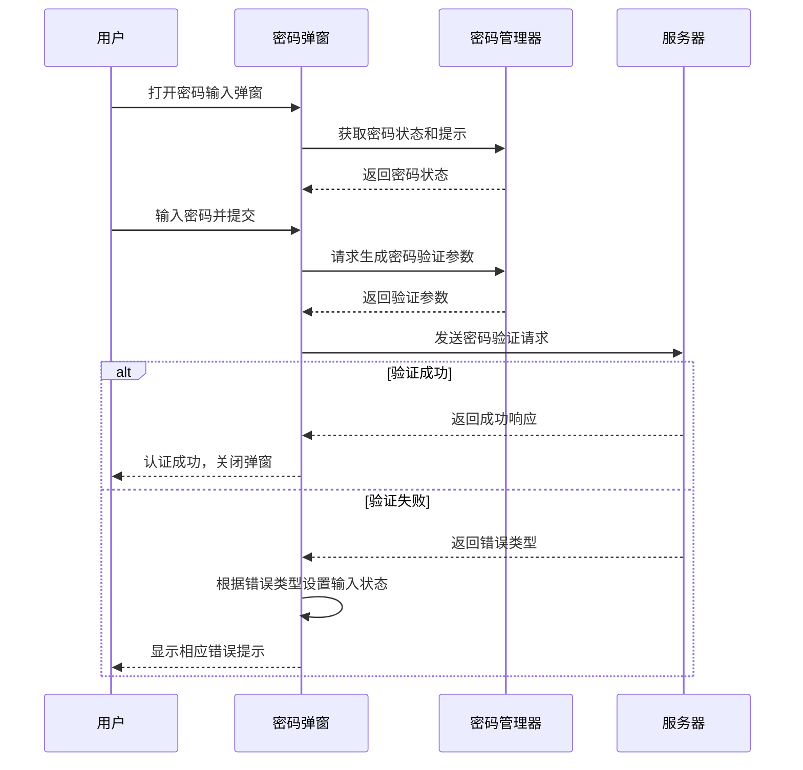
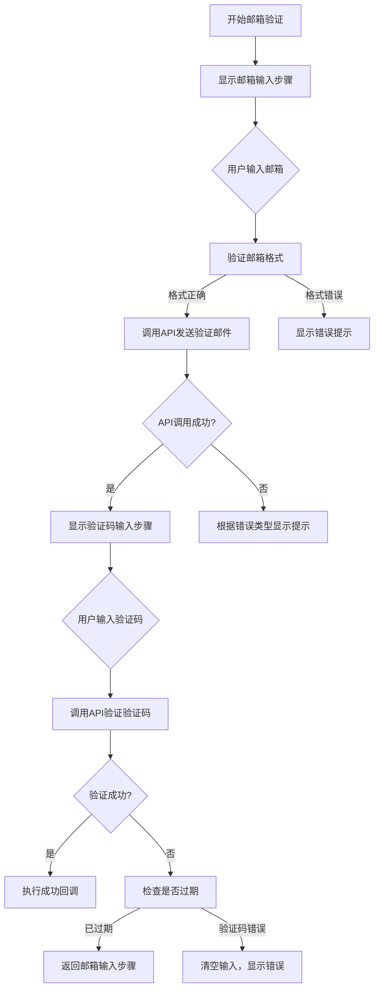
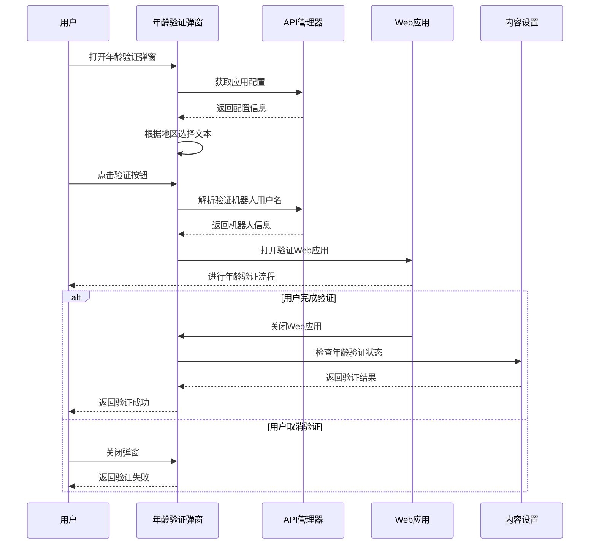
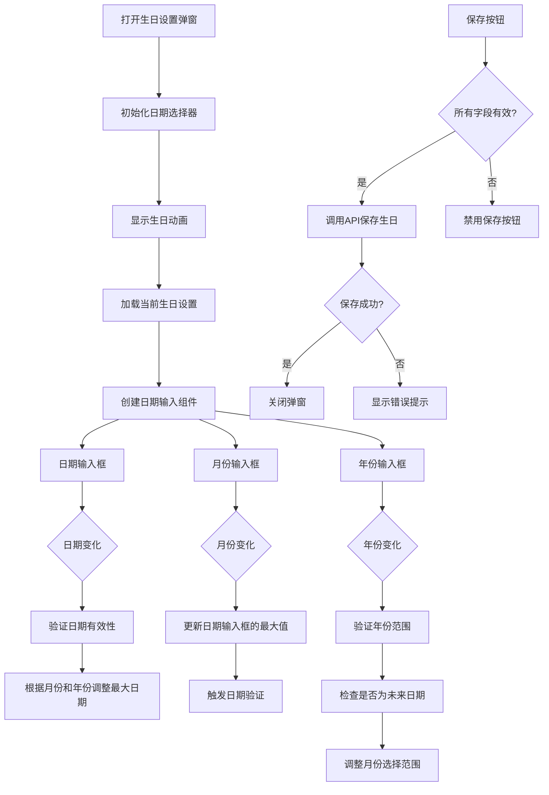
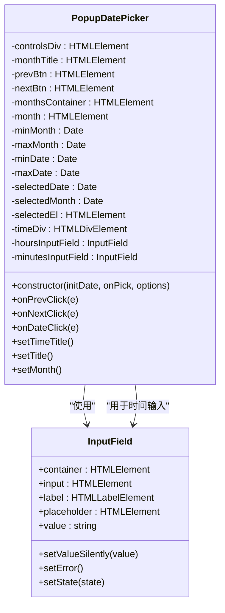
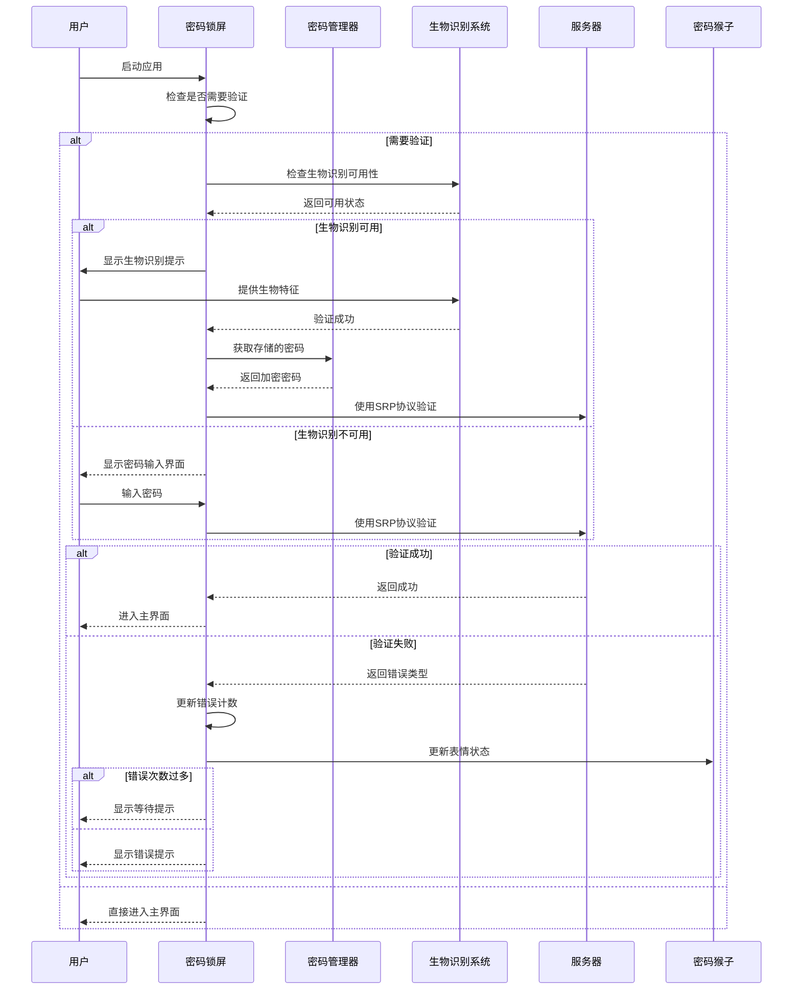
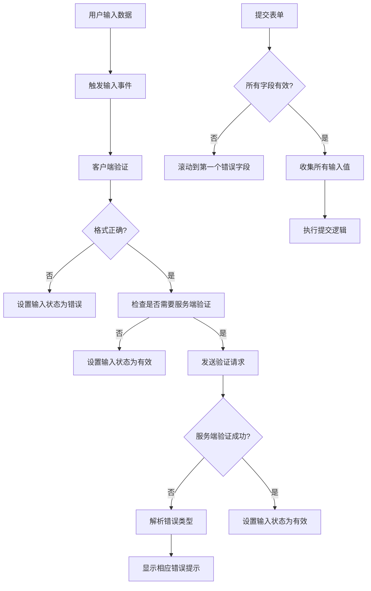

# 认证弹窗

<cite>
**本文档引用的文件**   
- [password.tsx](file://src/components/popups/password.tsx)
- [ageVerification.tsx](file://src/components/popups/ageVerification.tsx)
- [birthday.tsx](file://src/components/popups/birthday.tsx)
- [emailSetup.tsx](file://src/components/popups/emailSetup.tsx)
- [datePicker.ts](file://src/components/popups/datePicker.ts)
- [passcodeLockScreen.tsx](file://src/components/passcodeLock/passcodeLockScreen.tsx)
- [passwordMonkeyTsx.tsx](file://src/components/passcodeLock/passwordMonkeyTsx.tsx)
- [passwordInputField.ts](file://src/components/passwordInputField.ts)
- [inputField.ts](file://src/components/inputField.ts)
</cite>

## 目录
1. [简介](#简介)
2. [核心组件分析](#核心组件分析)
3. [密码输入弹窗](#密码输入弹窗)
4. [邮箱设置弹窗](#邮箱设置弹窗)
5. [年龄验证弹窗](#年龄验证弹窗)
6. [生日设置弹窗](#生日设置弹窗)
7. [日期选择器](#日期选择器)
8. [密码锁屏安全实现](#密码锁屏安全实现)
9. [表单验证与错误处理](#表单验证与错误处理)
10. [无障碍访问指南](#无障碍访问指南)

## 简介
本文档详细记录了认证相关弹窗的实现细节，重点涵盖密码输入、邮箱设置、年龄验证、生日设置和日期选择器等组件。文档深入分析了密码锁屏的安全实现机制，包括生物识别集成、防暴力破解机制和密码错误处理流程。同时，详细解释了认证弹窗的表单验证逻辑、错误状态反馈和用户输入处理方式。通过从代码库中提取具体的实现细节，本文档提供了输入字段类型、验证规则、安全存储机制和用户界面反馈的全面说明，并包含确保所有用户都能顺利使用认证功能的无障碍访问指南。

## 核心组件分析

认证系统由多个核心组件构成，这些组件协同工作以提供安全可靠的用户认证体验。系统主要包含密码输入、邮箱验证、年龄验证、生日设置和日期选择等功能模块。每个模块都实现了特定的认证需求，通过统一的弹窗框架进行展示和交互。组件之间通过清晰的接口进行通信，确保数据的安全传输和状态的正确管理。整个认证系统设计注重用户体验，同时严格遵循安全最佳实践，为用户提供既便捷又安全的认证流程。

**Section sources**
- [password.tsx](file://src/components/popups/password.tsx)
- [ageVerification.tsx](file://src/components/popups/ageVerification.tsx)
- [birthday.tsx](file://src/components/popups/birthday.tsx)
- [emailSetup.tsx](file://src/components/popups/emailSetup.tsx)
- [datePicker.ts](file://src/components/popups/datePicker.ts)

## 密码输入弹窗

密码输入弹窗是系统安全认证的核心组件，负责处理用户的密码验证流程。该组件通过`passwordPopup`函数实现，接受用户输入的密码并将其与系统存储的密码哈希进行比对。弹窗集成了密码强度提示功能，通过`state.hint`显示密码提示信息，帮助用户回忆其设置的密码。当用户输入密码后，系统会调用`rootScope.managers.passwordManager.getInputCheckPassword`方法生成密码验证参数，并通过安全通道发送到服务器进行验证。

在错误处理方面，系统实现了详细的错误反馈机制。当密码验证失败时，根据错误类型显示相应的提示信息：`PASSWORD_HASH_INVALID`表示密码错误，`FLOOD_WAIT_`前缀的错误表示尝试次数过多需要等待，其他错误则显示通用的错误提示。这种分级的错误处理策略既保证了安全性，又提供了良好的用户体验。弹窗还支持取消操作，允许用户在输入过程中取消认证流程。

**Diagram sources**
- [password.tsx](file://src/components/popups/password.tsx)
- [passwordInputField.ts](file://src/components/passwordInputField.ts)

**Section sources**
- [password.tsx](file://src/components/popups/password.tsx)
- [passwordInputField.ts](file://src/components/passwordInputField.ts)

## 邮箱设置弹窗

邮箱设置弹窗提供了一个两步验证流程，用于邮箱地址的验证和确认。该组件由`EnterEmailStep`和`EnterCodeStep`两个主要部分组成，通过`showEmailSetupPopup`函数协调展示。第一步是邮箱输入，用户在此输入其邮箱地址；第二步是验证码输入，系统会向用户邮箱发送验证码，用户需要输入收到的验证码完成验证。

在邮箱输入阶段，系统实现了实时验证功能。当用户输入内容时，会检查是否包含"@"符号，如果不符合邮箱格式要求，输入框会立即显示错误状态。提交邮箱后，系统调用`account.sendVerifyEmailCode` API发送验证邮件，并处理可能的错误情况：`EMAIL_INVALID`表示邮箱格式无效，`EMAIL_NOT_ALLOWED`表示邮箱被禁止使用，其他错误则显示通用错误提示。验证码输入阶段使用`CodeInputField`组件，提供专门的验证码输入界面，当用户输入完整验证码后自动提交验证。

**Diagram sources**
- [emailSetup.tsx](file://src/components/popups/emailSetup.tsx)

**Section sources**
- [emailSetup.tsx](file://src/components/popups/emailSetup.tsx)
- [inputField.ts](file://src/components/inputField.ts)

## 年龄验证弹窗

年龄验证弹窗用于验证用户是否达到特定地区的法定年龄要求。该组件通过`AgeVerificationPopup`类实现，根据用户所在地区显示不同的验证文本。当检测到用户位于英国（GB）时，会显示特定的英国版验证文本，其他地区则显示通用文本。这种区域化的内容适配确保了合规性要求的满足。

验证流程通过集成Web应用实现。当用户点击"验证"按钮时，系统会解析预设的验证机器人用户名（默认为"TelegramAge"），然后打开该机器人的Web应用进行详细的年龄验证流程。这种设计将复杂的验证逻辑委托给专门的Web应用处理，保持了主应用的简洁性。弹窗提供了清晰的关闭行为：如果用户在完成Web应用验证前关闭弹窗，则视为验证未通过；如果用户通过Web应用完成验证后关闭，则根据验证结果返回相应的状态。

**Diagram sources**
- [ageVerification.tsx](file://src/components/popups/ageVerification.tsx)

**Section sources**
- [ageVerification.tsx](file://src/components/popups/ageVerification.tsx)

## 生日设置弹窗

生日设置弹窗提供了一个直观的界面用于设置或修改用户的生日信息。该组件通过`showBirthdayPopup`函数实现，支持多种使用场景：设置自己的生日、为其他用户建议生日、从个人资料页面访问等。弹窗界面包含三个输入字段：日期、月份和年份，分别通过独立的输入框进行管理。

月份选择采用了下拉菜单的交互方式，用户点击月份输入框时会弹出包含所有月份的选项列表，选择后自动填充到输入框。日期和年份输入框实现了智能验证：日期范围会根据所选月份和年份自动调整（考虑闰年），年份输入限制在1900年至今，且不能选择未来的日期。对于隐私设置，弹窗提供了便捷的入口，用户可以点击链接直接跳转到生日隐私设置页面，无需离开当前界面。

**Diagram sources**
- [birthday.tsx](file://src/components/popups/birthday.tsx)

**Section sources**
- [birthday.tsx](file://src/components/popups/birthday.tsx)
- [inputField.ts](file://src/components/inputField.ts)

## 日期选择器

日期选择器组件提供了一个完整的日历界面，用于选择特定的日期和时间。该组件通过`PopupDatePicker`类实现，支持最小和最大日期限制、时间选择以及溢出月份显示等高级功能。界面由三个主要部分组成：顶部的月份导航控件、中间的日历网格和底部的时间输入区域。

月份导航包含前后切换按钮和当前月份标题，用户可以方便地在不同月份间切换。日历网格以标准的周为单位显示日期，当前选中的日期会高亮显示。对于超出最小或最大限制的日期，会以禁用状态呈现，防止用户选择无效日期。当启用时间选择功能时，底部会显示小时和分钟输入框，用户可以精确设置时间。输入验证确保小时值在0-23之间，分钟值在0-59之间，且输入格式正确。

**Diagram sources**
- [datePicker.ts](file://src/components/popups/datePicker.ts)
- [inputField.ts](file://src/components/inputField.ts)

**Section sources**
- [datePicker.ts](file://src/components/popups/datePicker.ts)

## 密码锁屏安全实现

密码锁屏安全实现包含多个层次的安全机制，确保设备和数据的安全。核心组件是`passcodeLockScreen`和`passwordMonkeyTsx`，它们共同提供了视觉反馈和交互功能。`PasswordMonkeyTsx`组件集成了一个动画猴子形象，根据用户输入密码的正确性改变其表情状态，提供直观的反馈。

系统实现了防暴力破解机制，当连续多次输入错误密码时，会触发`FLOOD_WAIT_`错误，强制用户等待一段时间后才能再次尝试。这种机制有效防止了自动化工具的暴力破解攻击。密码本身以安全的方式存储和验证，通过SRP（安全远程密码）协议进行验证，确保密码不会以明文形式在网络上传输。生物识别集成方面，系统可以与设备的指纹识别或面部识别功能结合，在验证生物特征后自动填充密码，提高便利性的同时保持安全性。

**Diagram sources**
- [passcodeLockScreen.tsx](file://src/components/passcodeLock/passcodeLockScreen.tsx)
- [passwordMonkeyTsx.tsx](file://src/components/passcodeLock/passwordMonkeyTsx.tsx)
- [passwordInputField.ts](file://src/components/passwordInputField.ts)

**Section sources**
- [passcodeLockScreen.tsx](file://src/components/passcodeLock/passcodeLockScreen.tsx)
- [passwordMonkeyTsx.tsx](file://src/components/passcodeLock/passwordMonkeyTsx.tsx)

## 表单验证与错误处理

表单验证与错误处理系统确保了用户输入数据的有效性和安全性。所有输入组件都继承自`InputField`基类，该类提供了统一的验证接口和状态管理。每个输入字段都有三种状态：中性（Neutral）、有效（Valid）和错误（Error），通过CSS类进行视觉区分。验证规则根据具体需求在各个子类中实现，如邮箱格式验证、密码强度验证、日期范围验证等。

错误处理采用分层策略，首先在客户端进行基本验证，如格式检查和范围限制，然后在服务端进行深度验证，如唯一性检查和安全策略验证。当验证失败时，系统会根据错误类型显示相应的本地化错误消息，帮助用户理解问题所在并进行修正。对于敏感操作，如密码修改或邮箱验证，系统还会要求二次确认，防止误操作导致账户安全风险。所有验证逻辑都设计为异步执行，确保用户界面的响应性。

**Diagram sources**
- [inputField.ts](file://src/components/inputField.ts)
- [password.tsx](file://src/components/popups/password.tsx)

**Section sources**
- [inputField.ts](file://src/components/inputField.ts)
- [password.tsx](file://src/components/popups/password.tsx)

## 无障碍访问指南

无障碍访问指南确保所有用户，包括残障人士，都能顺利使用认证功能。系统采用了多种无障碍设计原则，包括语义化HTML结构、键盘导航支持、屏幕阅读器兼容性和高对比度视觉设计。所有交互元素都具有清晰的标签和说明，确保屏幕阅读器能够准确传达其功能和状态。

对于键盘用户，系统实现了完整的键盘导航支持，用户可以通过Tab键在不同输入字段间切换，通过Enter键提交表单，通过Esc键关闭弹窗。焦点状态通过明显的视觉效果指示，帮助视觉障碍用户定位当前操作位置。对于动态内容更新，如错误提示的显示和隐藏，系统使用ARIA实时区域（aria-live）通知屏幕阅读器，确保用户能够及时获知状态变化。此外，所有图标和图像都提供了替代文本，确保信息的完整传达。

**Section sources**
- [inputField.ts](file://src/components/inputField.ts)
- [passwordInputField.ts](file://src/components/passwordInputField.ts)
- [popups/indexTsx.tsx](file://src/components/popups/indexTsx.tsx)