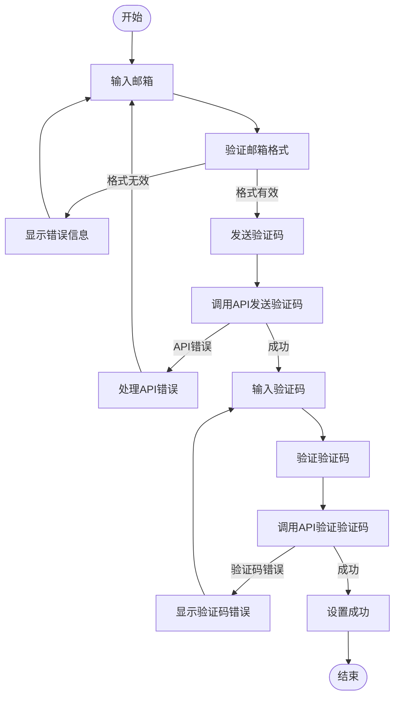
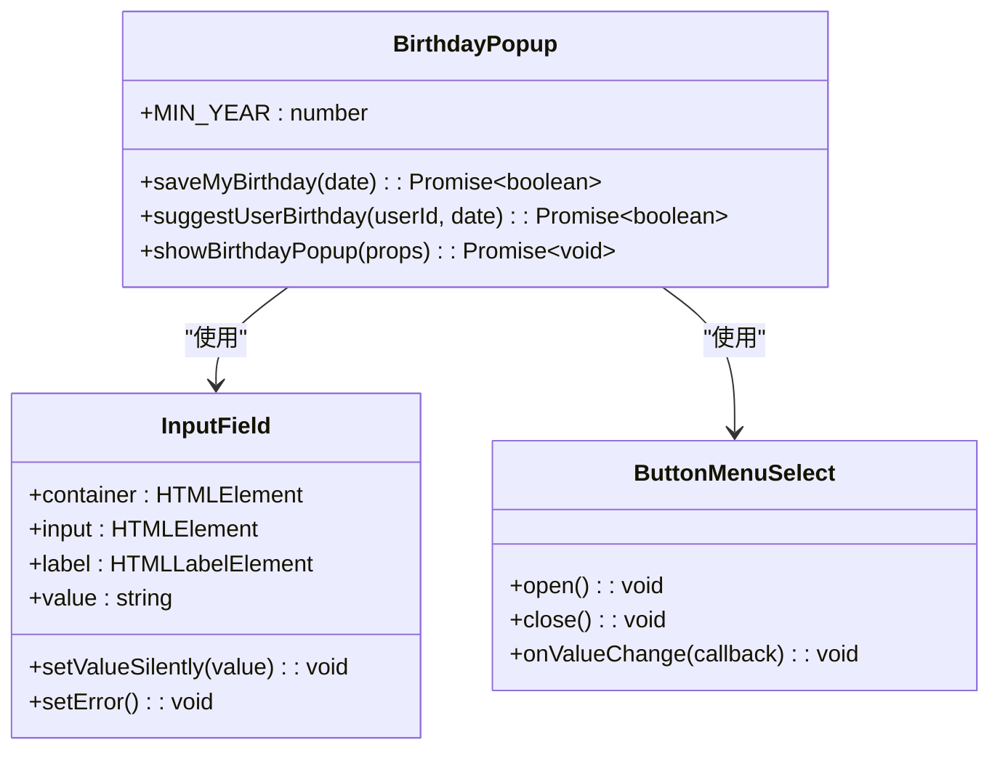
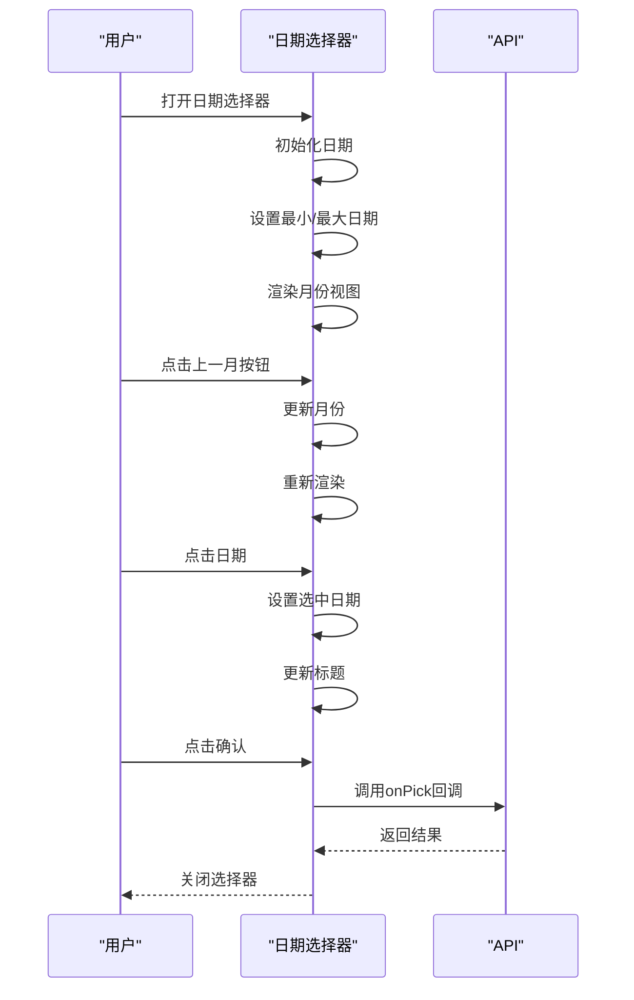
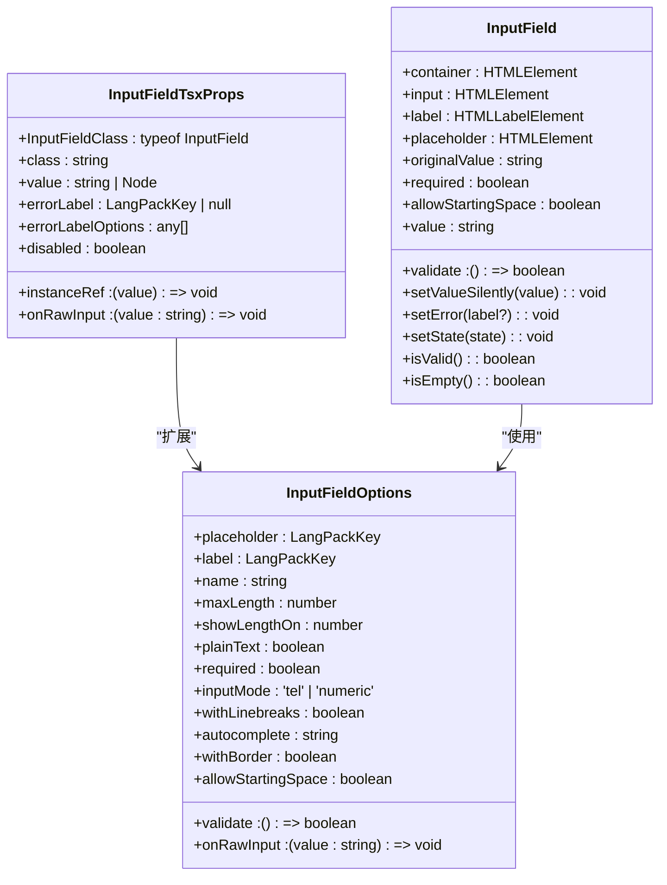
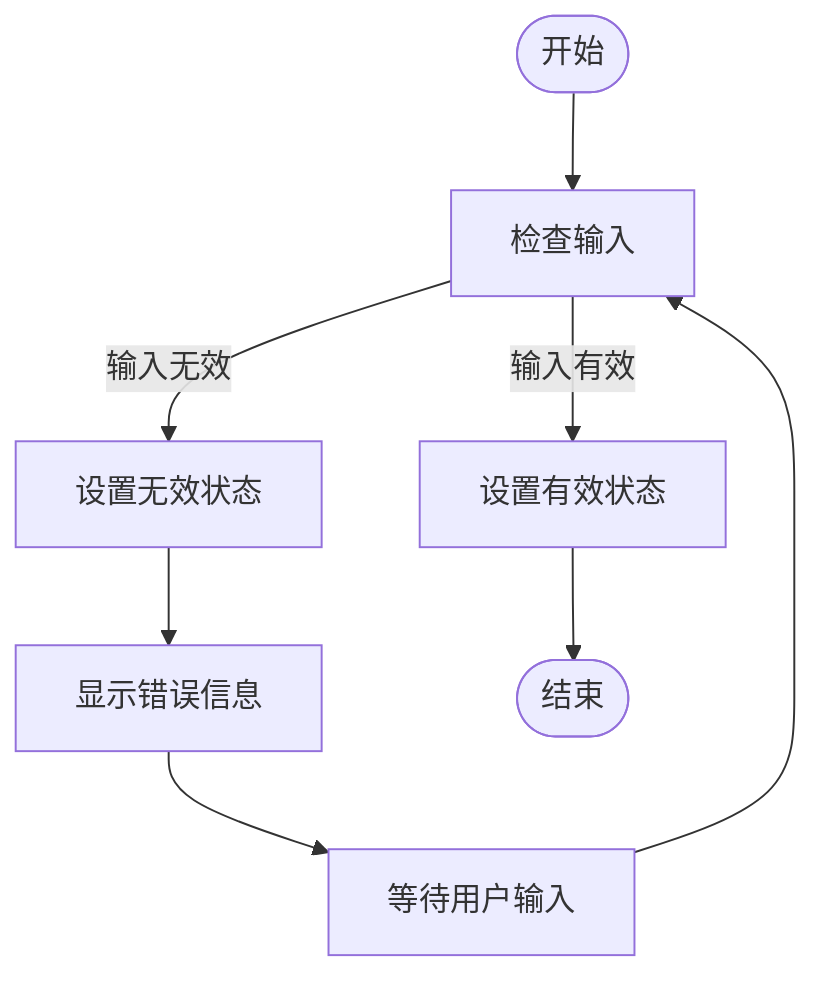
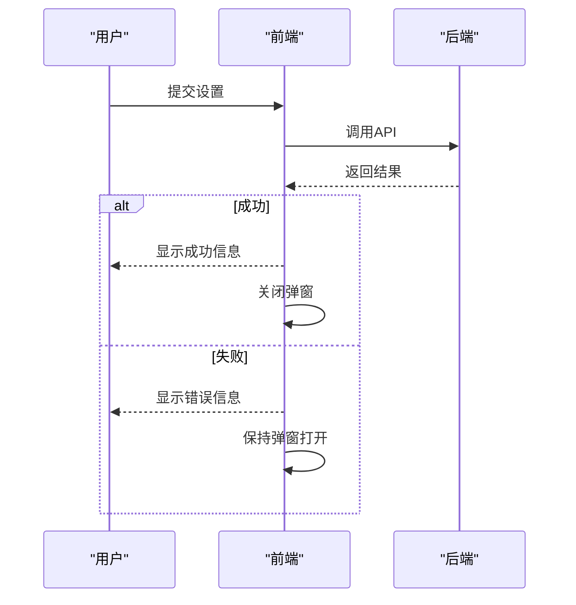
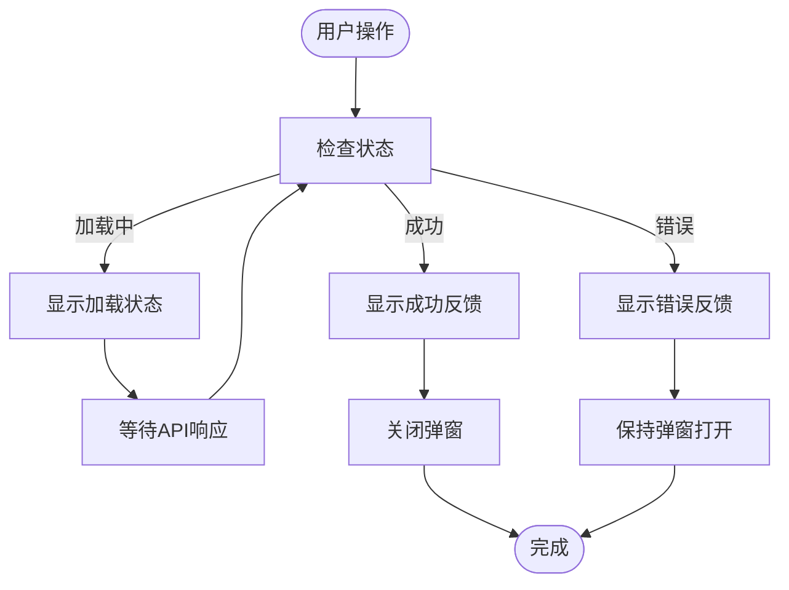

# 账户设置弹窗

<cite>
**本文档中引用的文件**  
- [emailSetup.tsx](file://src/components/popups/emailSetup.tsx)
- [birthday.tsx](file://src/components/popups/birthday.tsx)
- [datePicker.ts](file://src/components/popups/datePicker.ts)
- [inputFieldTsx.tsx](file://src/components/inputFieldTsx.tsx)
- [inputField.ts](file://src/components/inputField.ts)
</cite>

## 目录
1. [简介](#简介)
2. [核心组件分析](#核心组件分析)
3. [邮箱设置弹窗](#邮箱设置弹窗)
4. [生日设置弹窗](#生日设置弹窗)
5. [日期选择器组件](#日期选择器组件)
6. [表单输入字段](#表单输入字段)
7. [表单验证与错误处理](#表单验证与错误处理)
8. [数据持久化机制](#数据持久化机制)
9. [无障碍访问指南](#无障碍访问指南)
10. [用户界面反馈](#用户界面反馈)

## 简介
本文档详细记录了账户设置相关弹窗的实现，重点分析邮箱设置、生日设置和日期选择器等组件。文档涵盖了表单字段的类型、验证规则、数据持久化机制和用户界面反馈，深入解释了账户设置弹窗的表单验证逻辑、错误状态处理和用户输入流程。从代码库中提取了具体的实现细节，包括输入字段的约束条件、日期格式化规则和邮箱验证模式，并提供了无障碍访问指南。

## 核心组件分析

本文档分析的核心组件包括邮箱设置、生日设置和日期选择器，这些组件共同构成了账户设置功能的基础。这些组件使用SolidJS框架构建，具有响应式特性和良好的用户体验。

**Section sources**
- [emailSetup.tsx](file://src/components/popups/emailSetup.tsx#L1-L380)
- [birthday.tsx](file://src/components/popups/birthday.tsx#L1-L303)
- [datePicker.ts](file://src/components/popups/datePicker.ts#L1-L360)

## 邮箱设置弹窗

邮箱设置弹窗提供了两个步骤的设置流程：输入邮箱和输入验证码。该组件实现了完整的邮箱验证流程，包括前端验证和后端API调用。

**Diagram sources**
- [emailSetup.tsx](file://src/components/popups/emailSetup.tsx#L46-L274)

**Section sources**
- [emailSetup.tsx](file://src/components/popups/emailSetup.tsx#L1-L380)

## 生日设置弹窗

生日设置弹窗允许用户设置或修改生日信息。该组件提供了日期选择功能，包括日、月、年的选择，并实现了相应的验证逻辑。

**Diagram sources**
- [birthday.tsx](file://src/components/popups/birthday.tsx#L1-L303)

**Section sources**
- [birthday.tsx](file://src/components/popups/birthday.tsx#L1-L303)

## 日期选择器组件

日期选择器组件提供了一个完整的日历界面，允许用户选择特定的日期。该组件支持月份导航、日期选择和时间选择（可选）。

**Diagram sources**
- [datePicker.ts](file://src/components/popups/datePicker.ts#L1-L360)

**Section sources**
- [datePicker.ts](file://src/components/popups/datePicker.ts#L1-L360)

## 表单输入字段

表单输入字段组件提供了统一的输入界面，支持文本输入、标签显示和错误状态管理。该组件是构建各种表单的基础。

**Diagram sources**
- [inputField.ts](file://src/components/inputField.ts#L369-L390)
- [inputFieldTsx.tsx](file://src/components/inputFieldTsx.tsx#L8-L19)

**Section sources**
- [inputField.ts](file://src/components/inputField.ts#L1-L803)
- [inputFieldTsx.tsx](file://src/components/inputFieldTsx.tsx#L1-L74)

## 表单验证与错误处理

表单验证与错误处理机制确保了用户输入的数据符合要求，并提供了清晰的错误反馈。

### 邮箱验证规则
- 必须包含@符号
- 后端验证邮箱格式有效性
- 检查邮箱是否被允许使用

### 生日验证规则
- 年份不能小于1900年
- 年份不能大于当前年份
- 月份不能大于当前月份（当选择当前年份时）
- 日期不能超过该月的最大天数

### 错误状态处理
- 显示具体的错误信息
- 保持错误状态直到用户修正输入
- 避免在状态转换时出现闪烁

**Section sources**
- [emailSetup.tsx](file://src/components/popups/emailSetup.tsx#L59-L89)
- [birthday.tsx](file://src/components/popups/birthday.tsx#L110-L132)
- [inputField.ts](file://src/components/inputField.ts#L754-L758)

## 数据持久化机制

数据持久化机制通过API调用将用户设置保存到服务器，并处理可能的错误情况。

### 邮箱设置持久化
- 调用`account.sendVerifyEmailCode` API发送验证码
- 调用`account.verifyEmail` API验证验证码
- 成功后触发onSuccess回调

### 生日设置持久化
- 调用`appProfileManager.setMyBirthday` API设置生日
- 调用`appProfileManager.suggestUserBirthday` API建议用户生日
- 失败时显示错误提示

**Section sources**
- [emailSetup.tsx](file://src/components/popups/emailSetup.tsx#L65-L75)
- [birthday.tsx](file://src/components/popups/birthday.tsx#L31-L38)

## 无障碍访问指南

为了确保所有用户都能顺利完成账户设置，组件实现了以下无障碍访问特性：

1. **键盘导航支持**
   - 支持Tab键在输入字段间导航
   - 支持Enter键提交表单
   - 支持Escape键关闭弹窗

2. **屏幕阅读器兼容**
   - 使用语义化的HTML标签
   - 提供适当的ARIA属性
   - 确保所有交互元素都有清晰的标签

3. **视觉反馈**
   - 提供清晰的焦点指示
   - 使用颜色对比度确保可读性
   - 提供足够的点击区域

4. **错误信息可访问**
   - 错误信息与相关输入字段关联
   - 使用多种方式传达错误（颜色、图标、文本）
   - 确保错误信息可以被屏幕阅读器读取

**Section sources**
- [emailSetup.tsx](file://src/components/popups/emailSetup.tsx#L97-L102)
- [birthday.tsx](file://src/components/popups/birthday.tsx#L136-L137)
- [inputField.ts](file://src/components/inputField.ts#L507-L526)

## 用户界面反馈

用户界面反馈机制提供了即时的视觉和交互反馈，增强用户体验。

### 加载状态
- 在API调用期间显示加载状态
- 禁用相关按钮防止重复提交
- 使用动画效果表示加载过程

### 成功反馈
- 显示成功动画（Lottie动画）
- 自动关闭弹窗
- 触发成功回调

### 错误反馈
- 高亮显示错误字段
- 显示具体的错误信息
- 保持弹窗打开以便用户修正

**Section sources**
- [emailSetup.tsx](file://src/components/popups/emailSetup.tsx#L64-L69)
- [birthday.tsx](file://src/components/popups/birthday.tsx#L31-L38)
- [inputField.ts](file://src/components/inputField.ts#L795-L797)