# 通用弹窗

<cite>
**本文档引用的文件**  
- [index.ts](file://src/components/popups/index.ts)
- [indexTsx.tsx](file://src/components/popups/indexTsx.tsx)
- [confirmationPopup.ts](file://src/components/confirmationPopup.ts)
- [schedule.ts](file://src/components/popups/schedule.ts)
- [checklist.tsx](file://src/components/popups/checklist.tsx)
- [datePicker.ts](file://src/components/popups/datePicker.ts)
- [createPoll.ts](file://src/components/popups/createPoll.ts)
- [newMedia.ts](file://src/components/popups/newMedia.ts)
</cite>

## 目录
1. [简介](#简介)
2. [弹窗核心架构](#弹窗核心架构)
3. [动画与交互](#动画与交互)
4. [弹窗类型与使用场景](#弹窗类型与使用场景)
5. [嵌套弹窗与层级管理](#嵌套弹窗与层级管理)
6. [无障碍访问支持](#无障碍访问支持)
7. [主题与外观定制](#主题与外观定制)
8. [组件接口与事件机制](#组件接口与事件机制)
9. [结论](#结论)

## 简介

通用弹窗组件是Telegram Web客户端中用于展示模态对话框的核心UI组件。该组件提供了统一的弹窗管理机制，支持多种类型的弹窗（如确认对话框、日程安排、复选列表等），并具备完善的动画效果、键盘快捷键支持和无障碍访问功能。弹窗系统基于`PopupElement`基类构建，通过继承和组合的方式实现不同功能的弹窗，确保了代码的可维护性和扩展性。

**Section sources**
- [index.ts](file://src/components/popups/index.ts#L1-L493)

## 弹窗核心架构

### 基类设计

`PopupElement`是所有弹窗组件的基类，定义了弹窗的基本结构和行为。该类采用面向对象的设计模式，封装了弹窗的创建、显示、隐藏和销毁等生命周期方法。

```mermaid
classDiagram
class PopupElement {
+element : HTMLDivElement
+container : HTMLDivElement
+header : HTMLDivElement
+title : HTMLDivElement
+footer : HTMLElement
+btnClose : HTMLElement
+btnConfirm : HTMLButtonElement
+body : HTMLElement
+buttonsEl : HTMLElement
+show() : void
+hide() : void
+destroy() : void
+setButtons(buttons : PopupButton[]) : void
}
class PopupChecklist {
+chat : Chat
+editMessage? : Message
+focusItemId? : number
+appending? : boolean
+_construct(props : {appConfig : MTAppConfig}) : JSX.Element
}
class PopupSchedule {
+canSendWhenOnline : boolean
+isCustomButtonText : boolean
+setTimeTitle() : void
}
class PopupCreatePoll {
+questionInputField : InputField
+questions : HTMLElement
+scrollable : Scrollable
+send(force? : boolean) : Promise~void~
}
PopupElement <|-- PopupChecklist : "extends"
PopupElement <|-- PopupSchedule : "extends"
PopupElement <|-- PopupCreatePoll : "extends"
```

**Diagram sources**
- [index.ts](file://src/components/popups/index.ts#L80-L480)
- [checklist.tsx](file://src/components/popups/checklist.tsx#L25-L298)
- [schedule.ts](file://src/components/popups/schedule.ts#L35-L141)
- [createPoll.ts](file://src/components/popups/createPoll.ts#L31-L433)

### 组件结构

弹窗组件由多个部分组成，包括容器、头部、标题、关闭按钮、确认按钮、主体内容和底部按钮区域。这些部分通过CSS类名进行组织，确保了样式的一致性和可定制性。

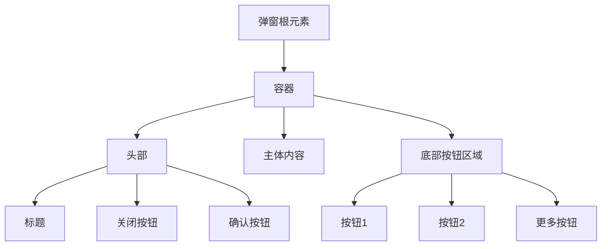

**Diagram sources**
- [index.ts](file://src/components/popups/index.ts#L84-L93)

## 动画与交互

### 打开/关闭动画

弹窗的打开和关闭动画通过CSS类名控制。当弹窗显示时，添加`active`类名；当弹窗隐藏时，添加`hiding`类名。这些类名触发CSS过渡效果，实现平滑的动画效果。

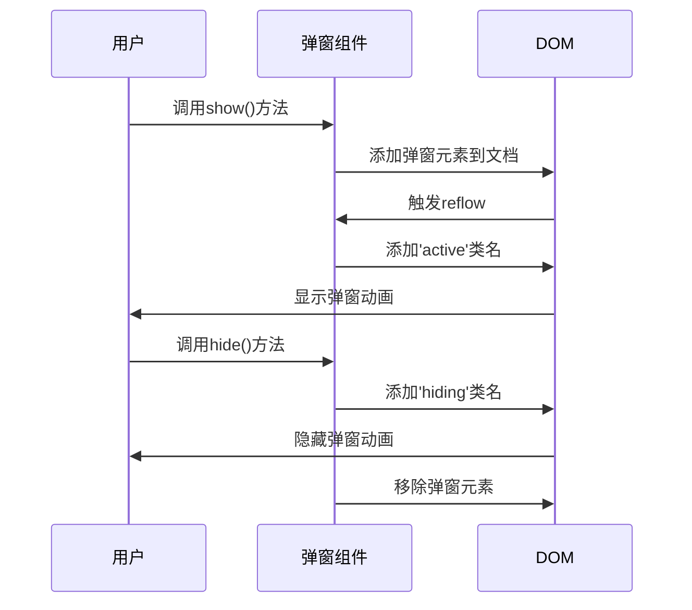

**Diagram sources**
- [index.ts](file://src/components/popups/index.ts#L329-L447)

### 遮罩层交互

遮罩层提供了点击外部区域关闭弹窗的功能。通过`overlayClosable`选项控制是否启用此功能。当用户点击遮罩层时，如果点击目标不是弹窗容器，则触发关闭操作。

```mermaid
flowchart TD
A[用户点击] --> B{点击目标}
B --> |是弹窗容器| C[不执行操作]
B --> |不是弹窗容器| D[调用hide()方法]
D --> E[关闭弹窗]
```

**Diagram sources**
- [index.ts](file://src/components/popups/index.ts#L184-L192)

### 焦点陷阱

弹窗组件实现了焦点陷阱功能，确保用户的键盘导航不会离开弹窗范围。当弹窗显示时，焦点被限制在弹窗内部的可聚焦元素上。

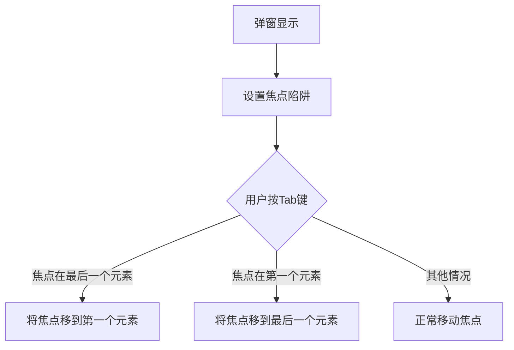

**Section sources**
- [index.ts](file://src/components/popups/index.ts#L355-L356)

### 键盘快捷键支持

弹窗组件支持键盘快捷键操作，特别是Enter键确认和Escape键取消。通过`confirmShortcutIsSendShortcut`选项可以配置确认快捷键。

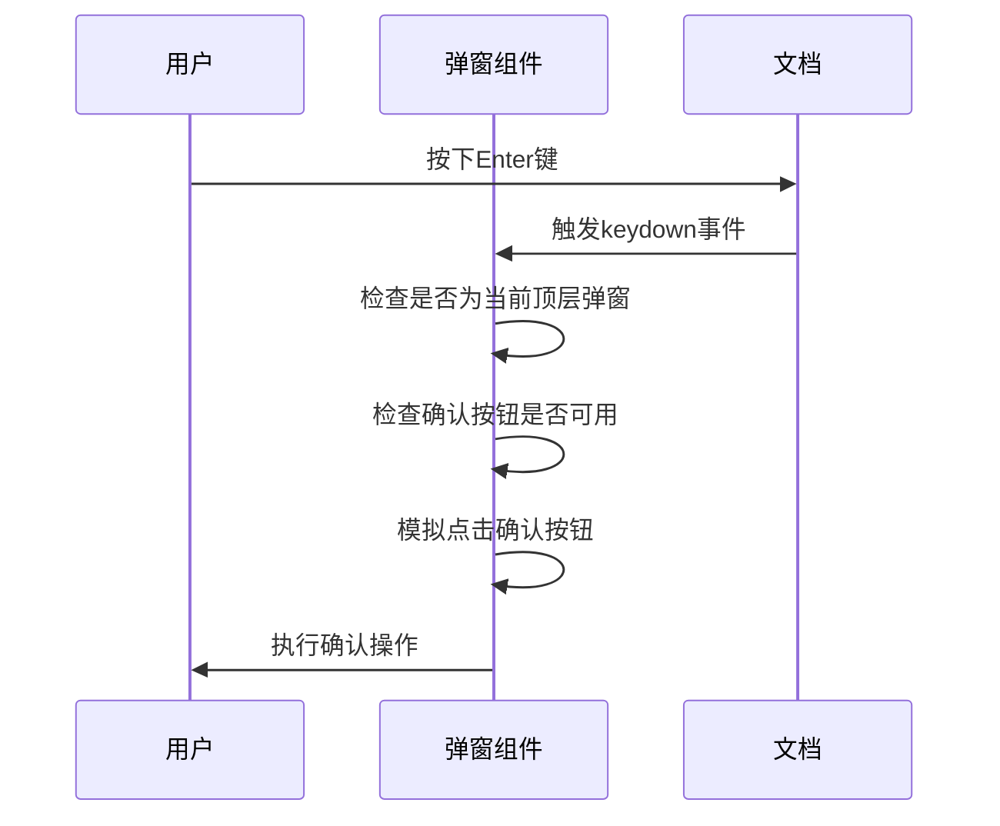

**Diagram sources**
- [index.ts](file://src/components/popups/index.ts#L369-L386)

## 弹窗类型与使用场景

### 确认对话框

确认对话框用于需要用户确认的操作，如删除消息、退出群组等。通过`confirmationPopup`函数创建，支持自定义按钮、复选框和输入字段。

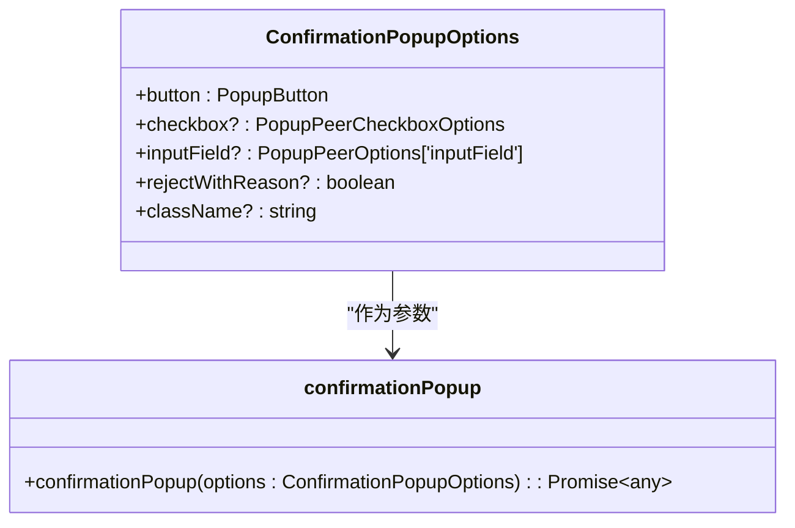

**Diagram sources**
- [confirmationPopup.ts](file://src/components/confirmationPopup.ts#L13-L51)

### 简单弹窗

简单弹窗是最基本的弹窗类型，用于显示信息或简单的操作选项。通过继承`PopupElement`基类并自定义内容即可创建。

**Section sources**
- [index.ts](file://src/components/popups/index.ts#L122-L126)

### 复选列表

复选列表弹窗用于创建待办事项列表，支持添加、删除和编辑任务项。该弹窗具有滚动区域和动态添加功能。

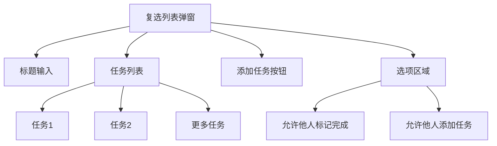

**Diagram sources**
- [checklist.tsx](file://src/components/popups/checklist.tsx#L53-L297)

### 日程安排

日程安排弹窗用于选择日期和时间，支持自定义确认按钮文本和"发送时在线"功能。

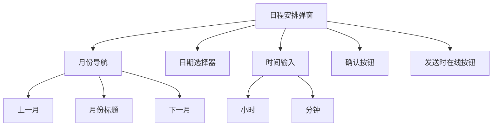

**Diagram sources**
- [schedule.ts](file://src/components/popups/schedule.ts#L35-L141)

## 嵌套弹窗与层级管理

### 弹窗栈管理

弹窗系统使用栈结构管理多个弹窗的显示顺序。当新弹窗打开时，将其推入栈顶；当弹窗关闭时，从栈中移除。

```mermaid
classDiagram
class PopupElement {
+static POPUPS : PopupElement[] = []
+static reAppend() : void
+static getPopups<T>(popupConstructor : PopupElementConstructable<T>) : T[]
+static createPopup<T, A>(ctor : {new(...args : A) : T}, ...args : A) : T
}
class NavigationItem {
+type : 'popup'
+onPop : () => boolean | void
}
PopupElement --> NavigationItem : "使用"
```

**Diagram sources**
- [index.ts](file://src/components/popups/index.ts#L81-L82)

### z-index层级控制

弹窗的z-index层级通过CSS的`z-depth-1`类名和DOM插入顺序共同控制。最新的弹窗总是显示在最上层。

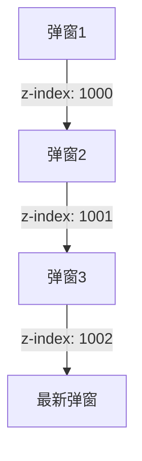

**Section sources**
- [index.ts](file://src/components/popups/index.ts#L126-L127)

## 无障碍访问支持

### 屏幕阅读器通知

弹窗组件通过适当的ARIA属性和语义化HTML元素确保屏幕阅读器能够正确识别和朗读弹窗内容。

**Section sources**
- [index.ts](file://src/components/popups/index.ts#L135-L144)

### 焦点管理

弹窗显示时，自动将焦点设置到合适的元素上（通常是第一个可聚焦元素或关闭按钮），并确保焦点在弹窗内部循环。

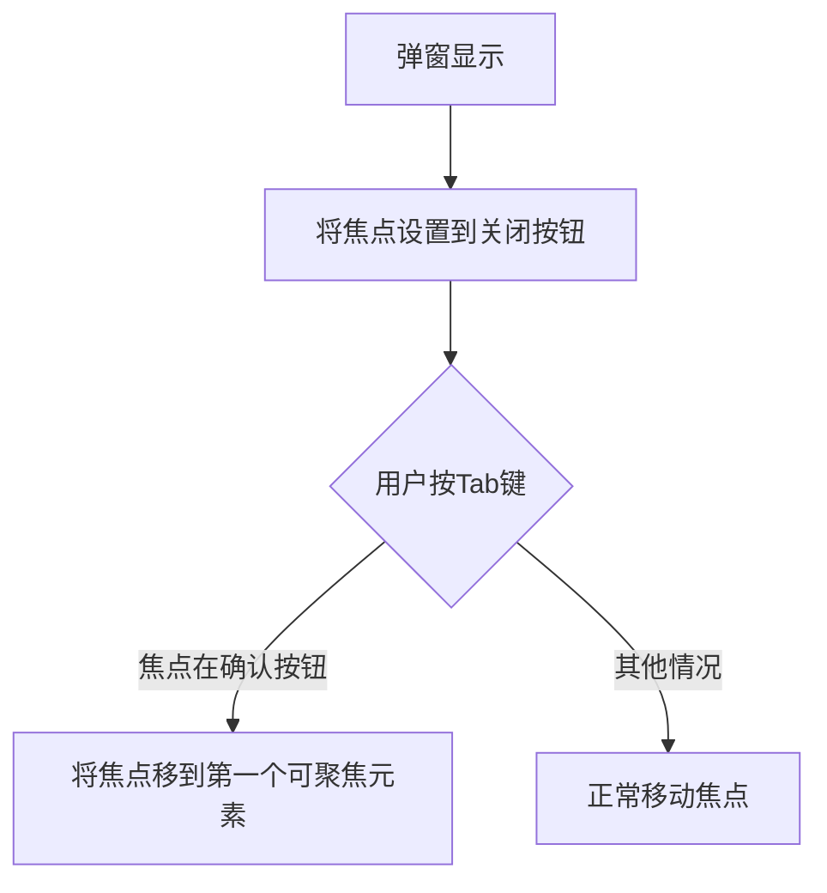

**Section sources**
- [index.ts](file://src/components/popups/index.ts#L355-L356)

## 主题与外观定制

### 主题支持

弹窗组件支持夜间模式，通过`night`属性和CSS类名`night`实现主题切换。

```mermaid
classDiagram
class PopupElement {
+night : boolean
+constructor(className : string, options : PopupOptions = {})
}
PopupElement --> overlayCounter : "监听"
overlayCounter --> PopupElement : "通知主题变化"
```

**Diagram sources**
- [index.ts](file://src/components/popups/index.ts#L128-L131)

### 外观定制

通过`className`参数可以为弹窗添加自定义CSS类名，从而实现外观的个性化定制。

**Section sources**
- [index.ts](file://src/components/popups/index.ts#L122-L125)

## 组件接口与事件机制

### Props接口

弹窗组件的主要配置选项通过`PopupOptions`接口定义，包括可关闭性、确认按钮、滚动区域等。

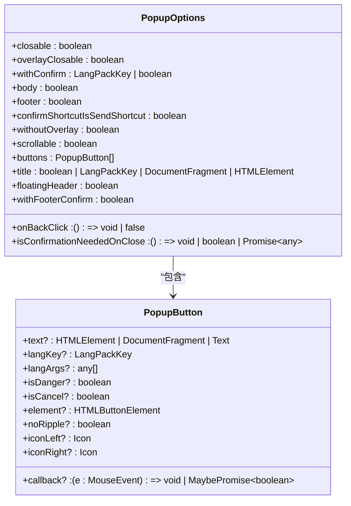

**Diagram sources**
- [index.ts](file://src/components/popups/index.ts#L44-L59)

### 事件处理机制

弹窗组件使用事件监听器模式处理用户交互，包括按钮点击、键盘事件和导航事件。

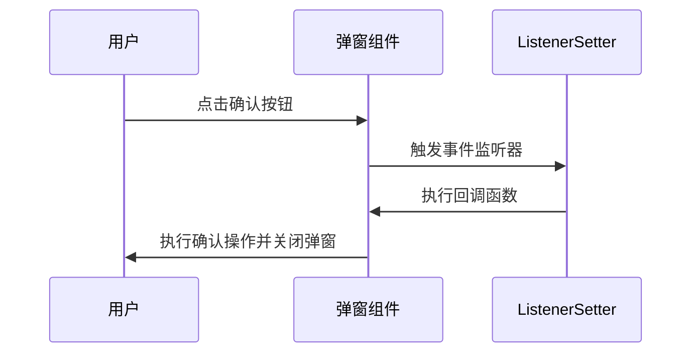

**Diagram sources**
- [index.ts](file://src/components/popups/index.ts#L281-L301)

### 状态管理

弹窗组件使用内部状态管理其显示状态、销毁状态和中间件状态，确保组件生命周期的正确管理。

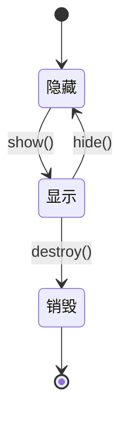

**Section sources**
- [index.ts](file://src/components/popups/index.ts#L117-L118)

## 结论

通用弹窗组件是Telegram Web客户端中一个功能丰富、设计精良的UI组件。它通过清晰的架构设计、完善的交互功能和良好的可扩展性，为各种模态对话框提供了统一的解决方案。组件支持多种弹窗类型，具备完整的动画效果、键盘快捷键支持和无障碍访问功能，同时提供了灵活的主题定制选项。通过继承`PopupElement`基类，开发者可以轻松创建满足特定需求的自定义弹窗，确保了代码的一致性和可维护性。