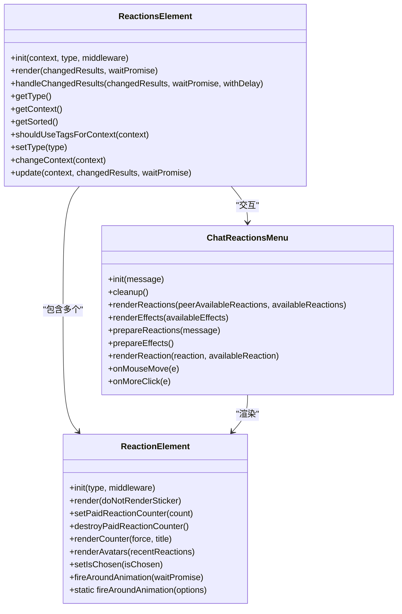
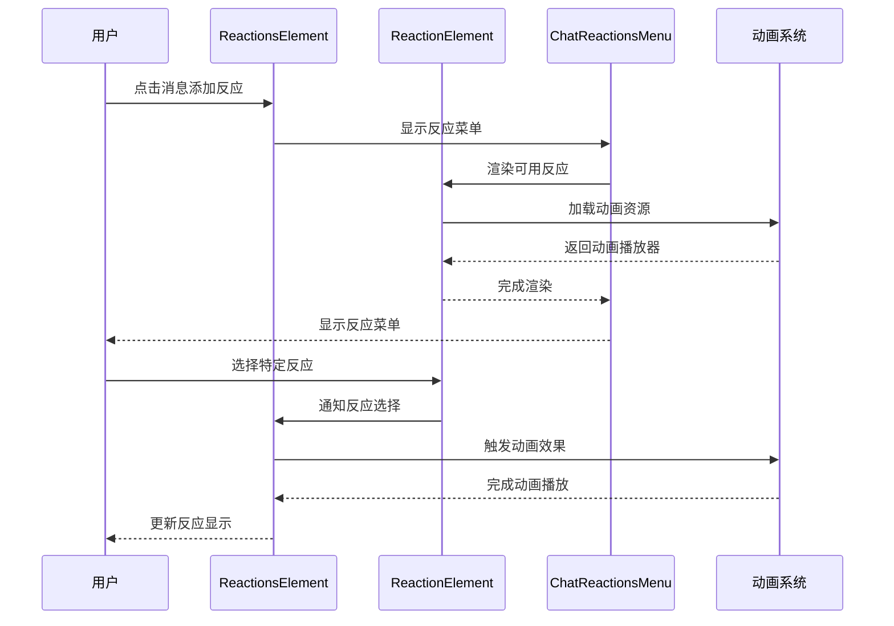
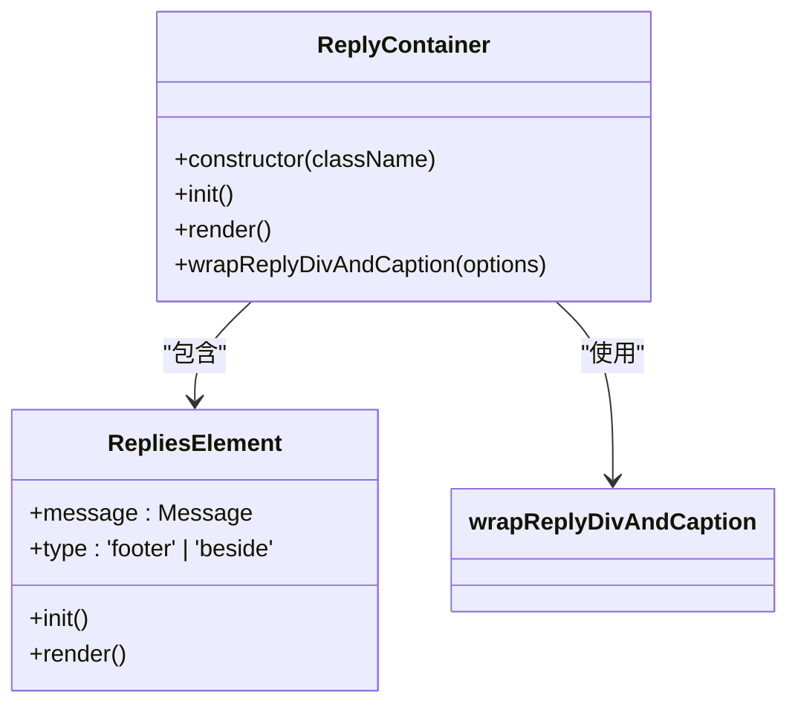
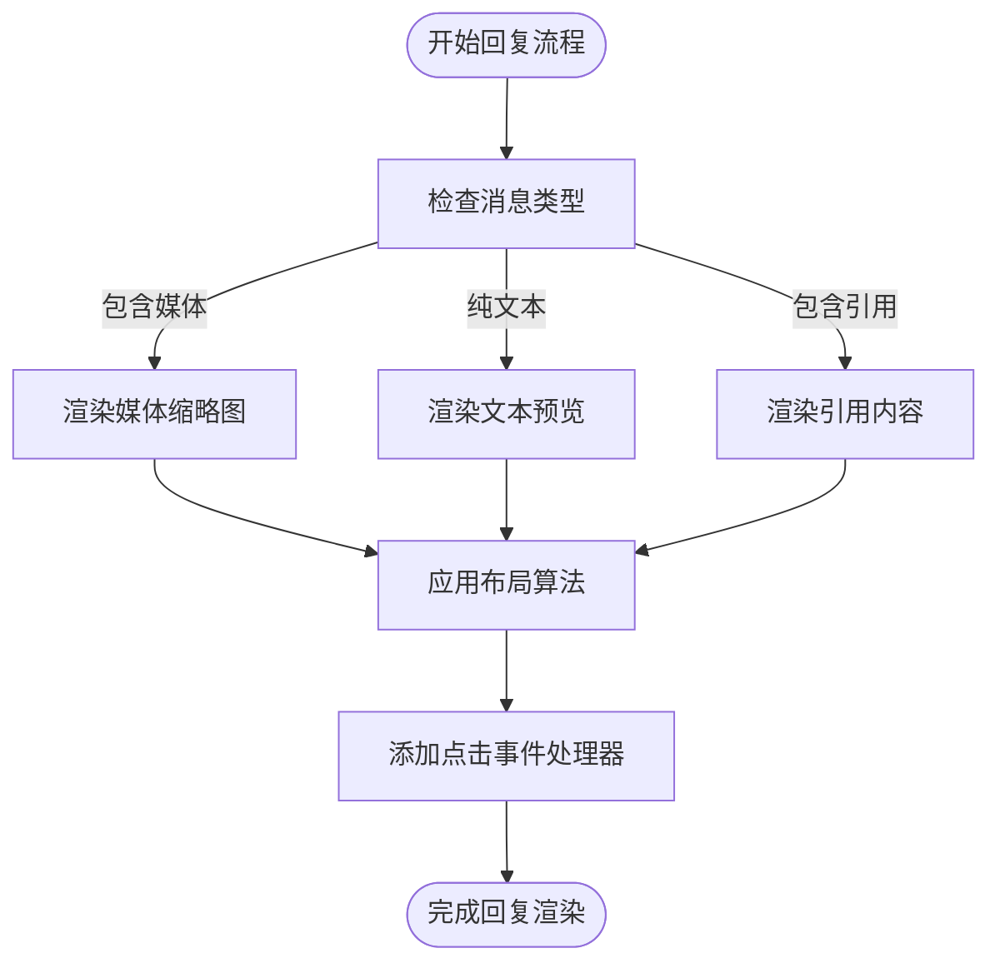
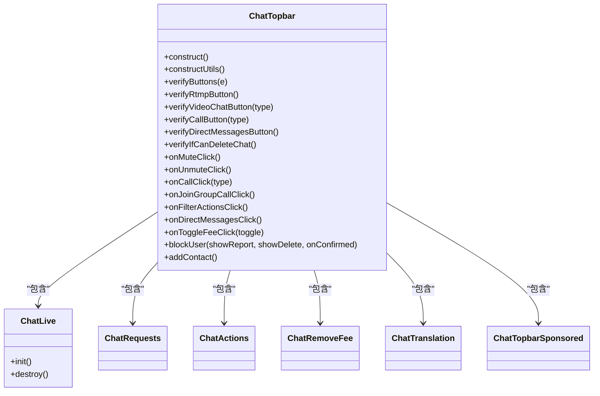
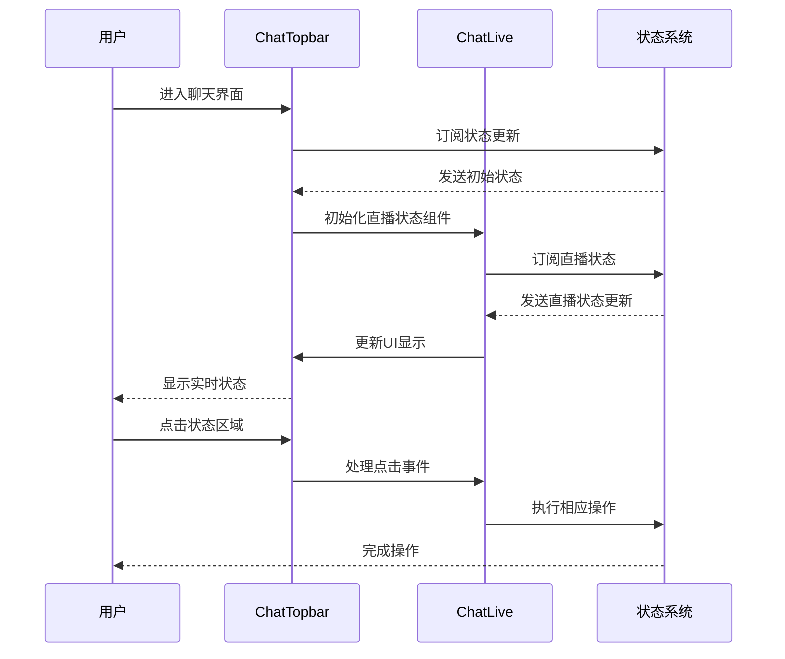
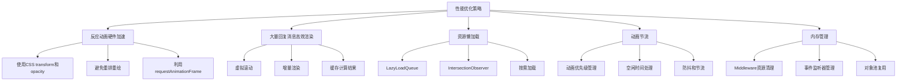
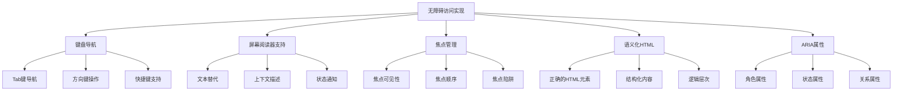

# 交互功能

<cite>
**本文档引用的文件**
- [reactions.ts](file://src/components/chat/reactions.ts)
- [reactionsMenu.ts](file://src/components/chat/reactionsMenu.ts)
- [reaction.ts](file://src/components/chat/reaction.ts)
- [replyContainer.ts](file://src/components/chat/replyContainer.ts)
- [replies.ts](file://src/components/chat/replies.ts)
- [topbar.ts](file://src/components/chat/topbar.ts)
- [topbarLive/container.tsx](file://src/components/chat/topbarLive/container.tsx)
- [topbarLive/topbarLive.tsx](file://src/components/chat/topbarLive/topbarLive.tsx)
- [emoticonsDropdown/index.ts](file://src/components/emoticonsDropdown/index.ts)
</cite>

## 目录
1. [简介](#简介)
2. [表情反应功能](#表情反应功能)
3. [消息回复功能](#消息回复功能)
4. [顶部栏交互功能](#顶部栏交互功能)
5. [性能优化策略](#性能优化策略)
6. [无障碍访问实现](#无障碍访问实现)
7. [结论](#结论)

## 简介
本文档详细介绍了Telegram Web客户端中的聊天交互功能，重点涵盖表情反应、消息回复和顶部栏状态显示三大核心功能。系统通过现代化的Web技术栈实现了流畅的用户体验，包括动画效果、实时状态更新和高效的渲染机制。文档将深入分析各功能的实现原理、交互逻辑和性能优化策略，为开发者提供全面的技术参考。

## 表情反应功能

表情反应功能允许用户通过点击快速添加反应，并支持查看反应详情。系统实现了常用表情推荐、自定义表情支持和动画效果等特性。

**Diagram sources**
- [reactions.ts](file://src/components/chat/reactions.ts#L68-L399)
- [reaction.ts](file://src/components/chat/reaction.ts#L255-L838)
- [reactionsMenu.ts](file://src/components/chat/reactionsMenu.ts#L60-L700)

表情反应的选择机制基于`ReactionsElement`和`ReactionElement`两个核心类。`ReactionsElement`负责管理一组反应的渲染和更新，而`ReactionElement`则代表单个反应的显示和交互。系统通过`ChatReactionsMenu`类实现反应菜单的交互逻辑，支持快速添加反应和查看反应详情。

**Diagram sources**
- [reactions.ts](file://src/components/chat/reactions.ts#L68-L399)
- [reaction.ts](file://src/components/chat/reaction.ts#L255-L838)
- [reactionsMenu.ts](file://src/components/chat/reactionsMenu.ts#L60-L700)

反应菜单的交互逻辑支持两种主要操作：快速添加常用反应和浏览更多反应。当用户长按消息时，会显示一个包含常用反应的快捷菜单；点击"更多"按钮则会打开完整的表情选择器。系统通过`middleware`机制管理组件的生命周期，确保在组件销毁时正确清理资源。

**Section sources**
- [reactions.ts](file://src/components/chat/reactions.ts#L1-L399)
- [reaction.ts](file://src/components/chat/reaction.ts#L1-L838)
- [reactionsMenu.ts](file://src/components/chat/reactionsMenu.ts#L1-L700)

## 消息回复功能

消息回复功能允许用户引用特定消息进行回复，并能点击跳转到原消息。系统通过`ReplyContainer`和`RepliesElement`两个核心组件实现回复功能。

**Diagram sources**
- [replyContainer.ts](file://src/components/chat/replyContainer.ts#L202-L234)
- [replies.ts](file://src/components/chat/replies.ts#L30-L157)

回复功能的实现基于`ReplyContainer`类，该类负责在消息气泡中嵌入回复信息。布局算法通过`wrapReplyDivAndCaption`函数实现，该函数根据消息类型和内容动态调整回复容器的布局。对于包含媒体的消息，系统会显示媒体缩略图；对于纯文本消息，则显示消息预览。

**Diagram sources**
- [replyContainer.ts](file://src/components/chat/replyContainer.ts#L29-L200)

系统通过`RepliesElement`类实现在消息底部显示回复统计信息。当消息被回复时，会在消息底部显示回复者的头像和回复数量。点击该区域可以跳转到回复对话。这种设计既节省了空间，又提供了直观的交互反馈。

**Section sources**
- [replyContainer.ts](file://src/components/chat/replyContainer.ts#L1-L234)
- [replies.ts](file://src/components/chat/replies.ts#L1-L157)

## 顶部栏交互功能

顶部栏提供实时状态显示，包括打字状态、录音状态和群组成员在线状态。`ChatTopbar`类是顶部栏功能的核心实现。

**Diagram sources**
- [topbar.ts](file://src/components/chat/topbar.ts#L85-L1636)
- [topbarLive/container.tsx](file://src/components/chat/topbarLive/container.tsx#L17-L133)

顶部栏的实时状态显示通过`ChatLive`组件实现。该组件使用Solid.js框架的响应式编程特性，实时监控直播状态并更新UI。当有新的直播开始时，顶部栏会显示"正在观看"人数和加入直播的按钮。

**Diagram sources**
- [topbar.ts](file://src/components/chat/topbar.ts#L85-L1636)
- [topbarLive/container.tsx](file://src/components/chat/topbarLive/container.tsx#L17-L133)
- [topbarLive/topbarLive.tsx](file://src/components/chat/topbarLive/topbarLive.tsx#L1-L52)

顶部栏还集成了多种交互功能，包括静音、呼叫、语音聊天、查看统计信息等。这些功能通过按钮菜单的形式组织，根据聊天类型和用户权限动态显示可用选项。系统使用`verify`函数检查每个按钮的显示条件，确保用户只能看到和操作他们有权使用的功能。

**Section sources**
- [topbar.ts](file://src/components/chat/topbar.ts#L1-L1636)
- [topbarLive/container.tsx](file://src/components/chat/topbarLive/container.tsx#L1-L133)
- [topbarLive/topbarLive.tsx](file://src/components/chat/topbarLive/topbarLive.tsx#L1-L52)

## 性能优化策略

系统实施了多项性能优化策略，确保在大量消息和复杂交互下的流畅体验。

**Diagram sources**
- [reactions.ts](file://src/components/chat/reactions.ts#L1-L399)
- [reaction.ts](file://src/components/chat/reaction.ts#L1-L838)
- [bubbles.ts](file://src/components/chat/bubbles.ts#L1-L10306)

反应动画的硬件加速通过使用CSS的`transform`和`opacity`属性实现，这些属性可以由GPU直接处理，避免了昂贵的重排和重绘操作。系统还利用`requestAnimationFrame`确保动画在浏览器的重绘周期中执行，提供平滑的视觉效果。

对于大量回复消息的高效渲染，系统采用了虚拟滚动和增量渲染技术。只有在视口内的消息才会被完全渲染，超出视口的消息会被简化显示或完全隐藏。这种策略大大减少了DOM节点的数量，提高了渲染性能。

**Section sources**
- [reactions.ts](file://src/components/chat/reactions.ts#L1-L399)
- [reaction.ts](file://src/components/chat/reaction.ts#L1-L838)
- [bubbles.ts](file://src/components/chat/bubbles.ts#L1-L10306)

## 无障碍访问实现

系统实现了全面的无障碍访问支持，确保所有交互功能都能通过键盘完成。

**Diagram sources**
- [topbar.ts](file://src/components/chat/topbar.ts#L85-L1636)
- [reactionsMenu.ts](file://src/components/chat/reactionsMenu.ts#L60-L700)
- [emoticonsDropdown/index.ts](file://src/components/emoticonsDropdown/index.ts#L99-L729)

键盘导航支持通过`attachClickEvent`和`cancelEvent`等工具函数实现，确保所有可点击元素都能通过键盘访问。系统还实现了焦点管理，确保在模态对话框打开时焦点不会逸出，并在关闭时正确恢复。

屏幕阅读器支持通过ARIA（Accessible Rich Internet Applications）属性实现，为交互元素提供语义化描述。例如，反应按钮会添加适当的ARIA标签，让屏幕阅读器用户了解当前可用的反应选项。

**Section sources**
- [topbar.ts](file://src/components/chat/topbar.ts#L1-L1636)
- [reactionsMenu.ts](file://src/components/chat/reactionsMenu.ts#L1-L700)
- [emoticonsDropdown/index.ts](file://src/components/emoticonsDropdown/index.ts#L1-L729)

## 结论
本文档详细介绍了Telegram Web客户端的聊天交互功能，涵盖了表情反应、消息回复和顶部栏状态显示三大核心功能。系统通过现代化的Web技术栈和精心设计的架构，实现了流畅的用户体验和高效的性能表现。通过深入分析各功能的实现原理和交互逻辑，为开发者提供了全面的技术参考，有助于理解和维护这一复杂的交互系统。