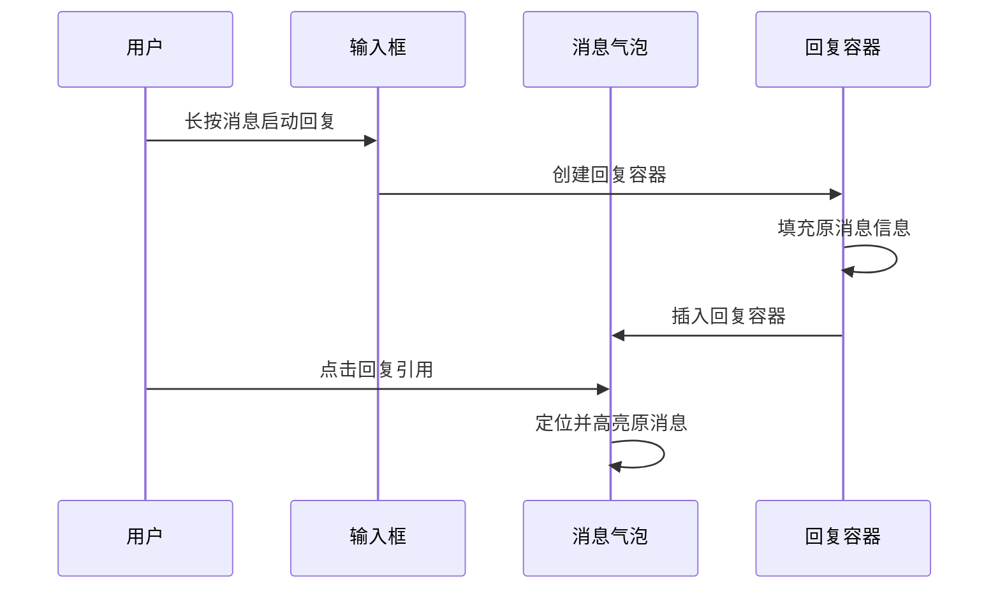
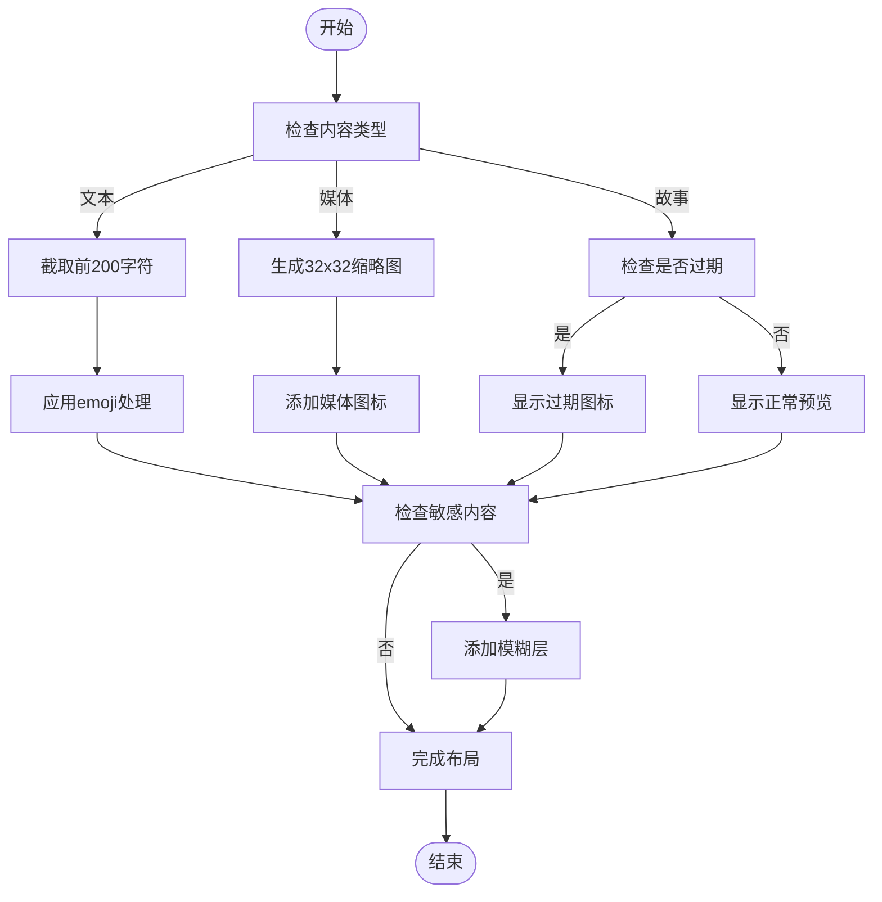
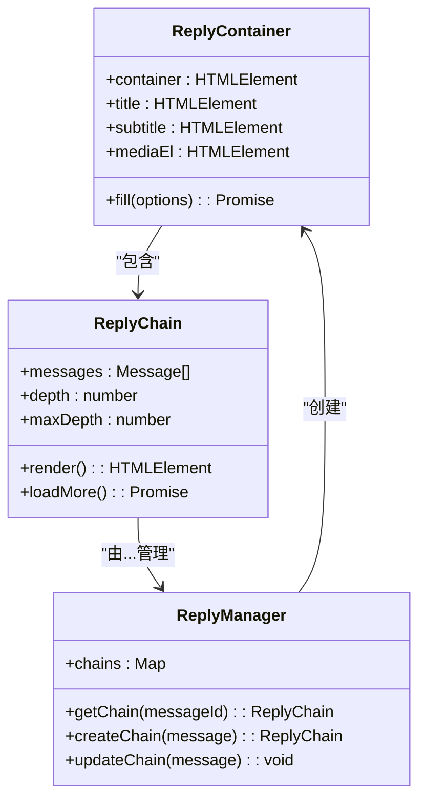
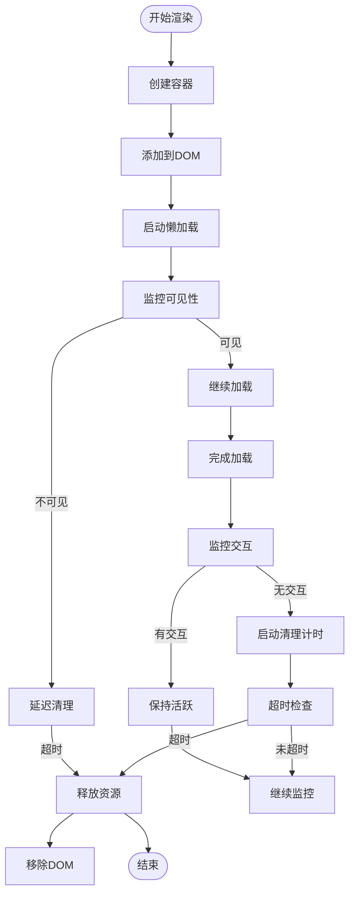
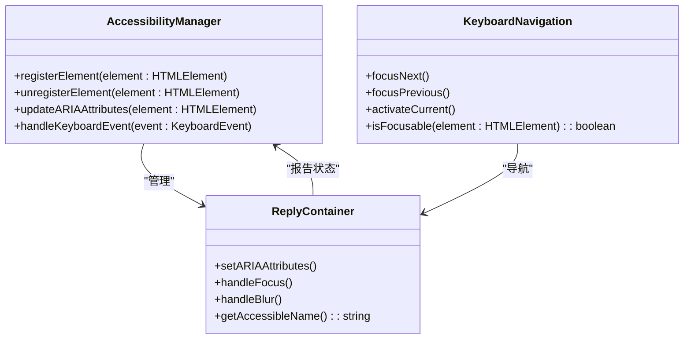
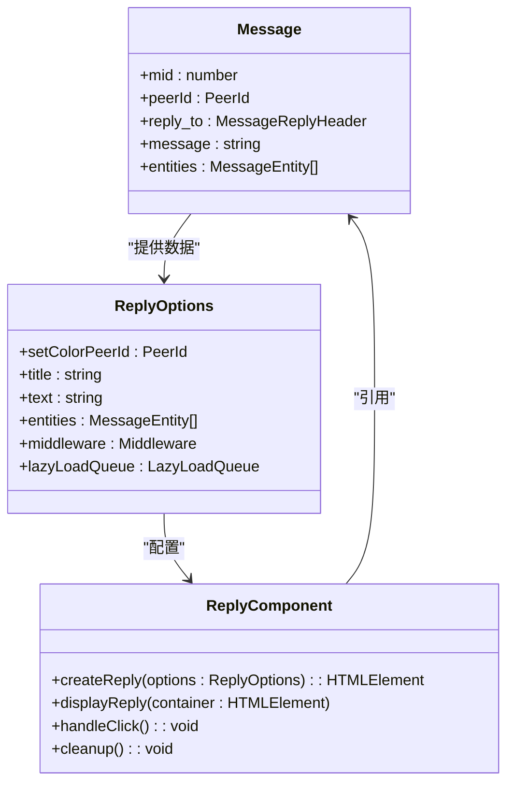

# 消息回复

<cite>
**本文档中引用的文件**  
- [replies.ts](file://src/components/chat/replies.ts)
- [replyContainer.ts](file://src/components/chat/replyContainer.ts)
- [reply.ts](file://src/components/wrappers/reply.ts)
- [messageRender.ts](file://src/components/chat/messageRender.ts)
- [input.ts](file://src/components/chat/input.ts)
- [bubbles.ts](file://src/components/chat/bubbles.ts)
- [_replyKeyboard.scss](file://src/scss/partials/_replyKeyboard.scss)
- [adminLogsResolver\reply.tsx](file://src/components/chat/bubbleParts/adminLogsResolver/reply.tsx)
</cite>

## 目录
1. [简介](#简介)
2. [核心组件](#核心组件)
3. [回复功能实现机制](#回复功能实现机制)
4. [回复容器布局算法](#回复容器布局算法)
5. [引用链处理](#引用链处理)
6. [性能优化策略](#性能优化策略)
7. [无障碍访问实现](#无障碍访问实现)
8. [代码示例](#代码示例)

## 简介
消息回复功能是即时通讯应用中的核心交互特性，允许用户对特定消息进行直接回应。本文档详细阐述了Telegram Web客户端中消息回复功能的技术实现，包括回复引用的显示、点击跳转、布局算法、多层引用处理、性能优化和无障碍访问等方面。

## 核心组件

消息回复功能由多个核心组件协同工作实现，主要包括回复容器、引用处理、布局管理等模块。这些组件共同构建了完整的回复体验。

**Section sources**
- [replies.ts](file://src/components/chat/replies.ts#L1-L157)
- [replyContainer.ts](file://src/components/chat/replyContainer.ts#L1-L234)
- [reply.ts](file://src/components/wrappers/reply.ts#L1-L123)

## 回复功能实现机制

消息回复功能的实现机制涉及多个技术层面，包括回复引用的显示、点击跳转到原消息的技术实现等。系统通过`ReplyContainer`类管理回复容器的创建和填充，利用`wrapReply`函数处理回复的包装逻辑。

当用户回复消息时，系统会创建一个包含原消息引用的回复容器，该容器包含发送者信息、消息预览和媒体缩略图。点击回复引用可以跳转到原消息位置，这一功能通过消息ID的映射和定位实现。

**Diagram sources**
- [input.ts](file://src/components/chat/input.ts#L533-L560)
- [replyContainer.ts](file://src/components/chat/replyContainer.ts#L202-L234)
- [messageRender.ts](file://src/components/chat/messageRender.ts#L344-L517)

**Section sources**
- [messageRender.ts](file://src/components/chat/messageRender.ts#L344-L517)
- [bubbles.ts](file://src/components/chat/bubbles.ts#L1341-L1368)

## 回复容器布局算法

回复容器的布局算法负责在消息气泡中嵌入回复信息并处理长文本截断。系统采用灵活的布局策略，根据内容类型自动调整布局。

对于文本消息，系统会截取前200个字符作为预览，并应用`limitSymbols`函数进行长度限制。对于媒体消息，系统会显示32x32像素的缩略图，并根据媒体类型显示相应的图标。

布局算法还处理了多种特殊情况，包括敏感内容标记、过期故事显示和媒体模糊处理。当回复包含敏感内容时，会添加模糊层保护用户隐私。

**Diagram sources**
- [replyContainer.ts](file://src/components/chat/replyContainer.ts#L29-L200)
- [wrappers/reply.ts](file://src/components/wrappers/reply.ts#L32-L121)

**Section sources**
- [replyContainer.ts](file://src/components/chat/replyContainer.ts#L29-L200)
- [wrappers/reply.ts](file://src/components/wrappers/reply.ts#L32-L121)

## 引用链处理

系统支持多层回复的显示和交互，通过引用链处理机制实现复杂的回复关系管理。每个回复消息都包含对原消息的引用信息，形成消息之间的链接关系。

引用链的处理包括循环引用检测、深度限制和性能优化。系统会跟踪回复的层级深度，避免无限嵌套导致的性能问题。同时，通过懒加载机制，只在需要时加载深层引用的内容。

对于引用链的显示，系统采用缩进和视觉区分的方式，使用户能够清晰地理解消息的回复关系。每增加一层回复，就会增加相应的缩进，形成树状结构的视觉效果。

**Diagram sources**
- [replies.ts](file://src/components/chat/replies.ts#L30-L157)
- [replyContainer.ts](file://src/components/chat/replyContainer.ts#L202-L234)

**Section sources**
- [replies.ts](file://src/components/chat/replies.ts#L30-L157)
- [wrappers/reply.ts](file://src/components/wrappers/reply.ts#L21-L31)

## 性能优化策略

针对大量回复消息的高效渲染和内存占用控制，系统实施了多项性能优化策略。这些策略确保在处理大量消息时仍能保持流畅的用户体验。

主要优化策略包括：
- **懒加载队列**：使用`LazyLoadQueue`管理媒体和内容的按需加载，减少初始渲染负担
- **中间件系统**：通过`Middleware`机制控制组件生命周期，及时清理不再需要的资源
- **Promise管理**：使用`loadPromises`数组跟踪异步加载任务，确保资源正确释放
- **DOM复用**：在更新回复内容时，保留并复用现有DOM元素的CSS类，减少重排重绘

系统还实现了智能的内存管理机制，当回复容器离开可视区域一定时间后，会自动释放相关资源，包括媒体加载器和事件监听器。

**Diagram sources**
- [replies.ts](file://src/components/chat/replies.ts#L38-L39)
- [replyContainer.ts](file://src/components/chat/replyContainer.ts#L48-L49)
- [messageRender.ts](file://src/components/chat/messageRender.ts#L338-L339)

**Section sources**
- [replies.ts](file://src/components/chat/replies.ts#L38-L39)
- [replyContainer.ts](file://src/components/chat/replyContainer.ts#L48-L49)
- [messageRender.ts](file://src/components/chat/messageRender.ts#L338-L339)

## 无障碍访问实现

为确保回复功能的键盘导航和屏幕阅读器兼容性，系统实现了全面的无障碍访问支持。这包括适当的ARIA标签、键盘焦点管理和语义化HTML结构。

回复容器实现了完整的键盘导航支持，用户可以通过Tab键在界面元素间移动，使用Enter键激活交互。每个可点击的回复引用都具有清晰的焦点指示，确保键盘用户能够准确识别当前焦点位置。

对于屏幕阅读器用户，系统提供了丰富的上下文信息，包括发送者名称、消息类型和时间戳。这些信息以适当的ARIA角色和属性暴露给辅助技术，使视障用户能够理解消息的上下文关系。

**Diagram sources**
- [replies.ts](file://src/components/chat/replies.ts#L30-L157)
- [replyContainer.ts](file://src/components/chat/replyContainer.ts#L202-L234)

**Section sources**
- [replies.ts](file://src/components/chat/replies.ts#L30-L157)
- [replyContainer.ts](file://src/components/chat/replyContainer.ts#L202-L234)

## 代码示例

以下代码示例展示了如何创建、显示和交互回复消息。这些示例基于实际的实现代码，展示了关键的API调用和配置选项。

**Diagram sources**
- [adminLogsResolver\reply.tsx](file://src/components/chat/bubbleParts/adminLogsResolver/reply.tsx#L7-L34)
- [reply.ts](file://src/components/wrappers/reply.ts#L32-L121)

**Section sources**
- [adminLogsResolver\reply.tsx](file://src/components/chat/bubbleParts/adminLogsResolver/reply.tsx#L7-L34)
- [reply.ts](file://src/components/wrappers/reply.ts#L32-L121)