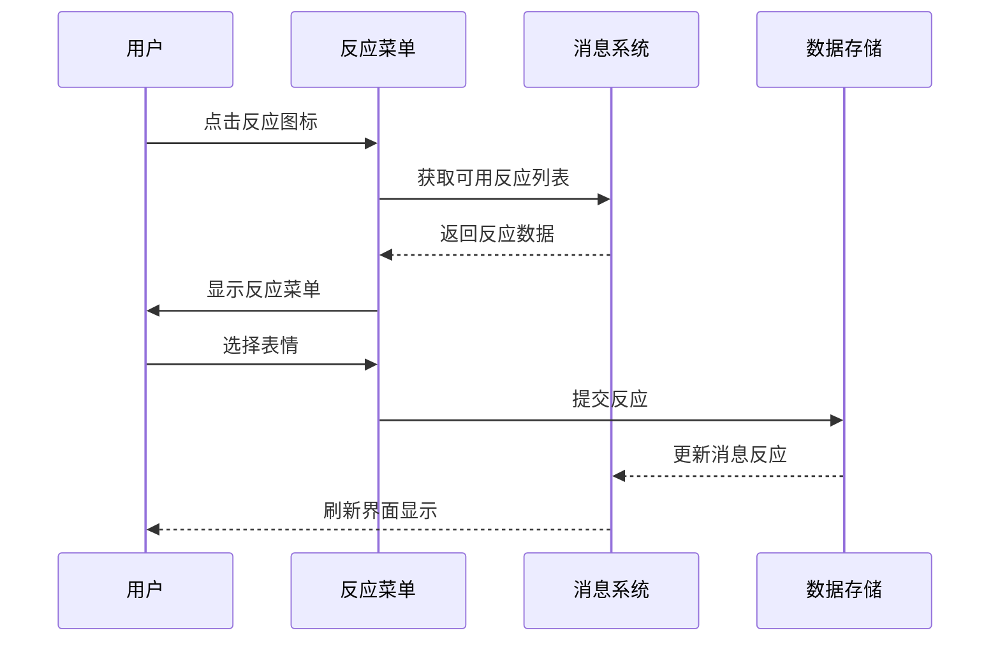
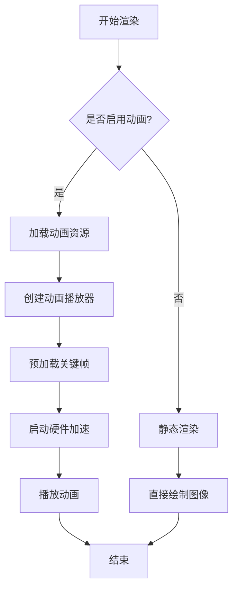
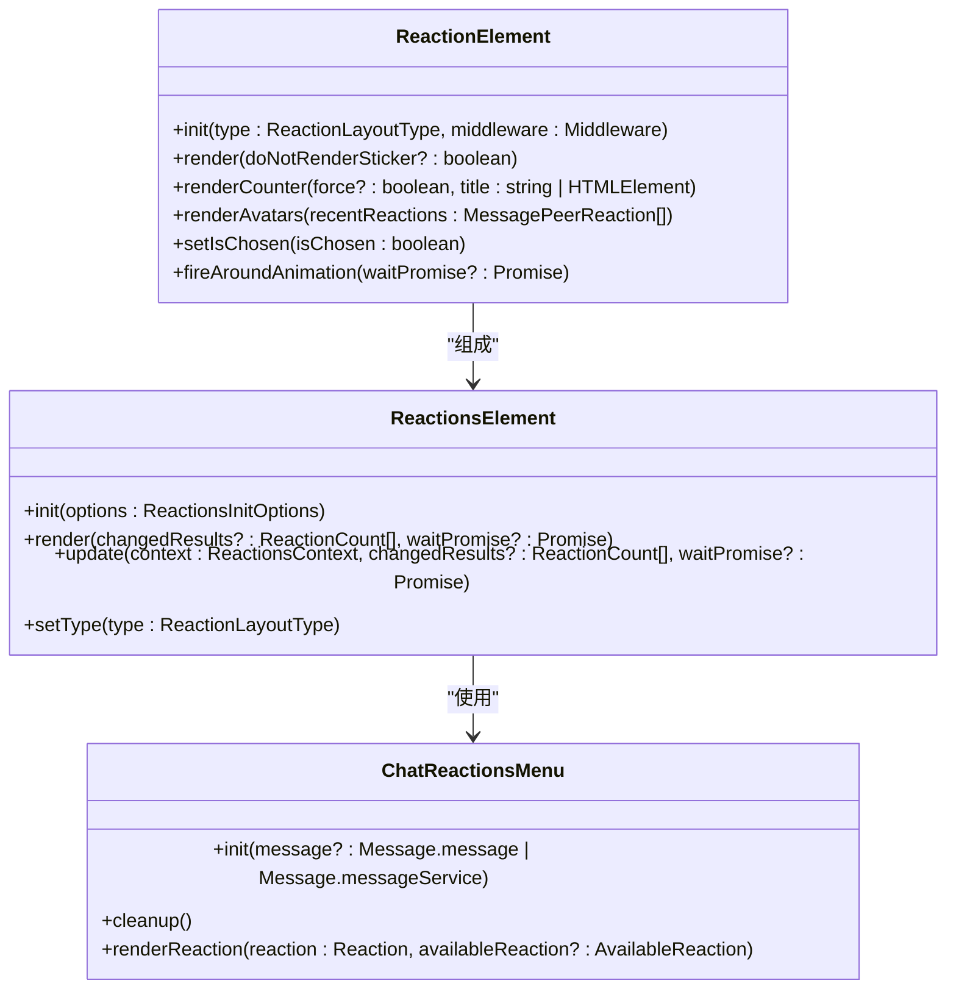

# 表情反应

<cite>
**本文档引用的文件**   
- [reaction.ts](file://src/components/chat/reaction.ts)
- [reactions.ts](file://src/components/chat/reactions.ts)
- [reactionsMenu.ts](file://src/components/chat/reactionsMenu.ts)
- [appReactionsManager.ts](file://src/lib/appManagers/appReactionsManager.ts)
- [reactedList.ts](file://src/components/popups/reactedList.ts)
- [availableReactionToReaction.ts](file://src/lib/appManagers/utils/reactions/availableReactionToReaction.ts)
- [reactionsEqual.ts](file://src/lib/appManagers/utils/reactions/reactionsEqual.ts)
</cite>

## 目录
1. [简介](#简介)
2. [表情反应选择机制](#表情反应选择机制)
3. [反应菜单交互逻辑](#反应菜单交互逻辑)
4. [反应数据存储与同步](#反应数据存储与同步)
5. [性能优化策略](#性能优化策略)
6. [无障碍访问实现](#无障碍访问实现)
7. [代码示例](#代码示例)
8. [结论](#结论)

## 简介
表情反应功能允许用户对消息添加表情符号反应，增强沟通的表达力。该功能包括常用表情推荐、自定义表情支持、动画效果展示等特性。用户可以通过点击反应菜单快速添加反应，或查看已有反应的详细信息。系统通过高效的存储和同步机制确保多设备间的数据一致性，并采用硬件加速和批量渲染等技术优化性能表现。同时，功能设计充分考虑了无障碍访问需求，确保所有用户都能方便地使用。

## 表情反应选择机制

表情反应选择机制基于用户的使用习惯和上下文环境智能推荐常用表情。系统维护一个最近使用和顶级反应的列表，优先展示高频使用的表情。对于自定义表情的支持，系统通过`CustomEmojiElement`组件实现，允许用户使用个人收藏的表情包。动画效果的实现依赖于`wrapStickerAnimation`函数，该函数负责加载和播放Lottie动画资源。

推荐算法根据用户的反应历史和消息上下文动态调整表情排序。当用户打开反应菜单时，系统会优先展示最近使用过的表情，然后是系统推荐的热门表情。对于付费表情，系统会特别标注并提供相应的解锁提示。

**Section sources**
- [reaction.ts](file://src/components/chat/reaction.ts#L1-L838)
- [reactions.ts](file://src/components/chat/reactions.ts#L1-L399)
- [appReactionsManager.ts](file://src/lib/appManagers/appReactionsManager.ts#L1-L200)

## 反应菜单交互逻辑

反应菜单的交互逻辑设计旨在提供流畅的用户体验。菜单支持水平和垂直两种布局模式，根据设备类型和屏幕尺寸自动选择最佳显示方式。在触摸设备上，菜单采用水平布局以适应手指操作；在桌面设备上，则使用垂直布局以节省水平空间。

快速添加反应功能通过`ChatReactionsMenu`类实现。当用户点击反应图标时，系统会创建一个包含常用表情的浮动菜单。用户可以通过鼠标悬停或触摸滑动来浏览不同表情，并通过点击完成选择。对于反应详情查看功能，系统提供了`PopupReactedList`组件，允许用户查看某个消息的所有反应及其发送者列表。



**Diagram sources **
- [reactionsMenu.ts](file://src/components/chat/reactionsMenu.ts#L1-L700)
- [reactedList.ts](file://src/components/popups/reactedList.ts#L1-L293)

**Section sources**
- [reactionsMenu.ts](file://src/components/chat/reactionsMenu.ts#L1-L700)
- [reactedList.ts](file://src/components/popups/reactedList.ts#L1-L293)

## 反应数据存储与同步

反应数据的存储结构设计为高效且可扩展的模式。每个消息的反应信息存储在`MessageReactions`对象中，包含反应计数、最近反应列表和顶级反应者等数据。系统使用`REACTIONS_ELEMENTS`映射来管理所有反应元素的实例，确保数据的一致性和完整性。

同步机制通过`AppReactionsManager`类实现，该类负责处理所有与反应相关的网络请求和数据更新。当用户添加或删除反应时，系统会立即向服务器发送更新请求，并在收到确认后更新本地缓存。对于多设备同步，系统采用基于时间戳的冲突解决策略，确保最新操作始终优先。

数据存储还支持离线模式，当网络连接不可用时，系统会将反应操作暂存于本地，待网络恢复后自动同步。这种设计保证了用户体验的连续性，即使在网络不稳定的情况下也能正常使用反应功能。

```mermaid
erDiagram
MESSAGE_REACTIONS {
string peerId PK
int mid PK
array results
array recent_reactions
array top_reactors
object pFlags
}
REACTION_COUNT {
object reaction PK
int count
int chosen_order
}
MESSAGE_PEER_REACTION {
object peer_id PK
object reaction
bool pFlags.unread
int date
}
MESSAGE_REACTIONS ||--o{ REACTION_COUNT : "包含"
MESSAGE_REACTIONS ||--o{ MESSAGE_PEER_REACTION : "包含"
```

**Diagram sources **
- [appReactionsManager.ts](file://src/lib/appManagers/appReactionsManager.ts#L67-L200)
- [reaction.ts](file://src/components/chat/reaction.ts#L9-L16)

## 性能优化策略

性能优化策略主要集中在动画效果的硬件加速、反应气泡的批量渲染和内存管理三个方面。系统通过`liteMode`检查来决定是否启用复杂的动画效果，确保在低端设备上也能流畅运行。

反应动画的硬件加速通过`wrapStickerAnimation`函数实现，该函数利用WebGL和Canvas API进行高效渲染。对于复杂的动画效果，系统会预先加载关键帧数据，并在播放时进行缓存，减少重复计算的开销。批量渲染技术通过`REACTIONS_ELEMENTS`映射实现，将多个反应气泡的渲染操作合并为单个绘制调用，显著提升了渲染效率。

内存管理方面，系统采用惰性加载和及时清理的策略。当反应元素不再可见时，系统会自动释放相关资源，包括动画播放器和图像缓存。对于自定义表情，系统使用`CustomEmojiRendererElement`进行集中管理，避免重复加载相同的表情资源。



**Diagram sources **
- [reaction.ts](file://src/components/chat/reaction.ts#L235-L253)
- [reactions.ts](file://src/components/chat/reactions.ts#L20-L25)

## 无障碍访问实现

无障碍访问实现确保反应功能能通过键盘导航和屏幕阅读器正确识别。系统为所有反应元素添加了适当的ARIA标签和键盘事件处理，使视障用户能够方便地使用该功能。

键盘导航支持通过Tab键在不同反应之间切换，并使用Enter键确认选择。屏幕阅读器可以正确识别每个反应的表情含义和计数值，提供清晰的语音反馈。对于动画效果，系统提供了关闭选项，避免对光敏感用户造成不适。

此外，系统还考虑了色盲用户的特殊需求，在表情设计时避免使用仅靠颜色区分的元素。所有交互操作都有明确的视觉反馈，确保用户能够清楚地了解当前状态。

**Section sources**
- [reaction.ts](file://src/components/chat/reaction.ts#L255-L838)
- [reactions.ts](file://src/components/chat/reactions.ts#L68-L399)

## 代码示例

以下代码示例展示了如何添加、删除和查看消息反应：



**Diagram sources **
- [reaction.ts](file://src/components/chat/reaction.ts#L255-L838)
- [reactions.ts](file://src/components/chat/reactions.ts#L68-L399)
- [reactionsMenu.ts](file://src/components/chat/reactionsMenu.ts#L60-L700)

## 结论

表情反应功能通过智能推荐算法、流畅的交互设计和高效的性能优化，为用户提供了一个丰富而直观的沟通工具。系统的数据存储和同步机制确保了多设备间的一致性，而无障碍访问的实现则让所有用户都能平等享受这一功能。未来可以进一步优化动画效果的资源占用，并增加更多个性化设置选项，以满足不同用户的需求。