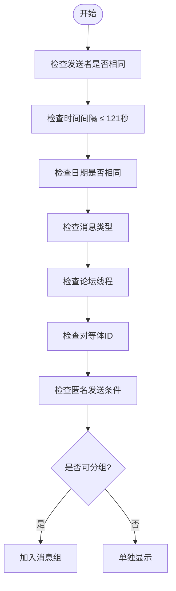
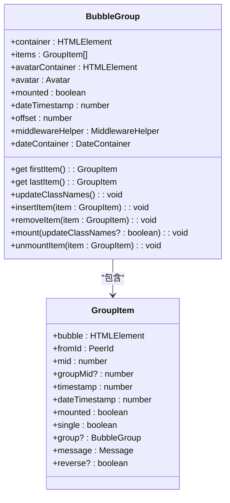
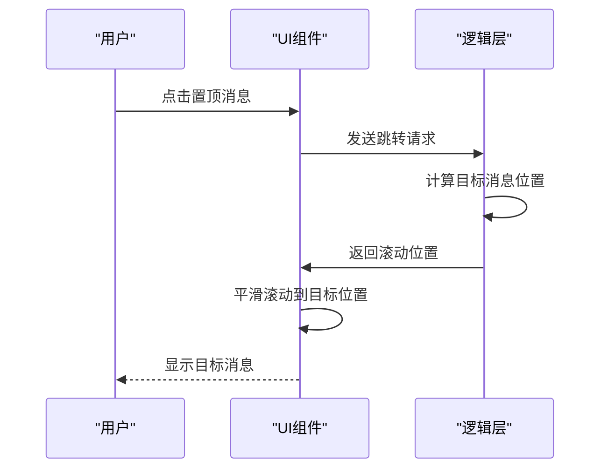
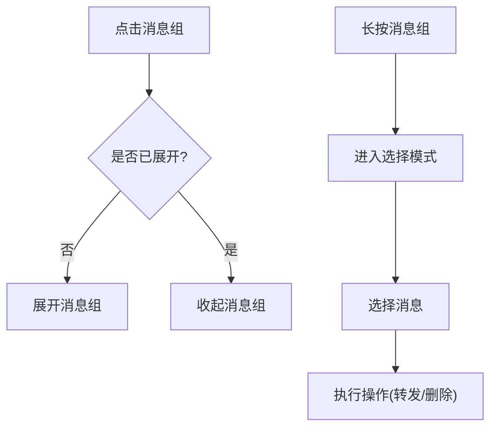
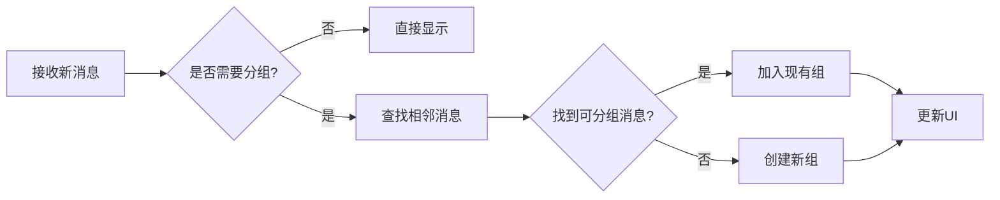

# 消息分组

<cite>
**本文档引用的文件**  
- [bubbleGroups.ts](file://src/components/chat/bubbleGroups.ts)
- [bubbles.ts](file://src/components/chat/bubbles.ts)
- [pinnedMessage.ts](file://src/components/chat/pinnedMessage.ts)
- [pinnedMessageBorder.ts](file://src/components/chat/pinnedMessageBorder.ts)
- [_chatPinned.scss](file://src/scss/partials/_chatPinned.scss)
</cite>

## 目录
1. [简介](#简介)
2. [消息分组判断逻辑](#消息分组判断逻辑)
3. [UI结构与布局算法](#ui结构与布局算法)
4. [置顶消息处理](#置顶消息处理)
5. [交互逻辑](#交互逻辑)
6. [不同场景下的表现](#不同场景下的表现)
7. [性能优化策略](#性能优化策略)
8. [无障碍访问实现](#无障碍访问实现)

## 简介
消息分组功能是Telegram Web客户端中的核心特性之一，旨在提升用户在聊天界面中的阅读体验。该功能通过将连续发送的消息聚合显示，减少了视觉干扰，使对话更加连贯和易于理解。本文档详细介绍了消息分组的实现机制，包括判断逻辑、UI结构、置顶消息处理、交互逻辑以及在不同场景下的表现。

**Section sources**
- [bubbleGroups.ts](file://src/components/chat/bubbleGroups.ts#L1-L882)

## 消息分组判断逻辑
消息分组的核心在于判断哪些消息可以被聚合在一起。系统通过以下条件来决定消息是否属于同一组：

- **发送者相同**：消息必须由同一用户发送。
- **时间间隔**：消息之间的时间间隔不超过121秒。
- **日期相同**：消息必须在同一天内发送。
- **消息类型**：仅普通消息和部分服务消息可以被分组，管理日志事件和验证机器人消息除外。
- **论坛线程**：在论坛或机器人论坛中，消息必须属于同一主题。
- **对等体ID**：消息必须属于同一对话或群组。
- **匿名发送**：对于匿名发送的消息，需满足特定条件。

这些条件在`canItemsBeGrouped`方法中实现，确保只有符合条件的消息才会被聚合。

**Diagram sources**
- [bubbleGroups.ts](file://src/components/chat/bubbleGroups.ts#L575-L598)

**Section sources**
- [bubbleGroups.ts](file://src/components/chat/bubbleGroups.ts#L575-L598)

## UI结构与布局算法
消息分组的UI结构设计旨在最大化信息密度同时保持清晰的视觉层次。每个消息组共享一个头像、用户名和时间戳，这些元素仅在组的第一个消息中显示。

### 布局算法
- **头像**：仅在消息组的第一个消息中显示，避免重复。
- **用户名**：仅在消息组的第一个消息中显示，后续消息隐藏。
- **时间戳**：仅在消息组的最后一个消息中显示，表示整个组的时间。
- **消息气泡**：消息气泡通过CSS类`is-group-first`、`is-group-last`和`is-group-middle`来区分其在组中的位置，从而实现圆角和边框的正确显示。

**Diagram sources**
- [bubbleGroups.ts](file://src/components/chat/bubbleGroups.ts#L64-L342)

**Section sources**
- [bubbleGroups.ts](file://src/components/chat/bubbleGroups.ts#L224-L243)

## 置顶消息处理
置顶消息在Telegram中具有特殊的地位，通常用于强调重要信息。系统通过以下方式处理置顶消息：

- **边框渲染**：使用SVG绘制特殊的边框，根据置顶消息的数量动态调整高度和间距。
- **标记显示**：在消息旁边显示“置顶”标记，提示用户该消息已被置顶。
- **点击跳转**：点击置顶消息会自动滚动到对应的消息位置，方便用户快速查看。

**Diagram sources**
- [pinnedMessage.ts](file://src/components/chat/pinnedMessage.ts#L33-L482)
- [pinnedMessageBorder.ts](file://src/components/chat/pinnedMessageBorder.ts#L1-L205)

**Section sources**
- [pinnedMessage.ts](file://src/components/chat/pinnedMessage.ts#L33-L482)
- [pinnedMessageBorder.ts](file://src/components/chat/pinnedMessageBorder.ts#L1-L205)

## 交互逻辑
消息分组的交互逻辑包括点击展开/收起和长按选择等操作：

- **点击消息组**：点击消息组可以展开或收起其中的消息，提供更详细的视图。
- **长按选择**：长按消息组可以进入选择模式，允许用户批量操作消息，如转发、删除等。

**Diagram sources**
- [bubbles.ts](file://src/components/chat/bubbles.ts#L5212-L5268)
- [selection.ts](file://src/components/chat/selection.ts#L766-L806)

**Section sources**
- [bubbles.ts](file://src/components/chat/bubbles.ts#L5212-L5268)
- [selection.ts](file://src/components/chat/selection.ts#L766-L806)

## 不同场景下的表现
消息分组功能在不同类型的聊天场景中表现出不同的特性：

- **普通聊天**：消息按发送者和时间间隔自然分组，提供流畅的对话体验。
- **群组对话**：考虑到多个用户的参与，分组逻辑更加严格，避免混淆。
- **频道消息**：由于频道消息通常由管理员发送，分组逻辑侧重于时间连续性而非发送者。

**Section sources**
- [bubbleGroups.ts](file://src/components/chat/bubbleGroups.ts#L575-L598)

## 性能优化策略
为了确保在大量消息场景下分组算法的高效执行，系统采用了以下优化策略：

- **缓存机制**：使用`itemsMap`和`itemsArr`缓存消息项，减少重复查找。
- **惰性加载**：仅在需要时加载消息内容，减少初始加载时间。
- **批量处理**：将多个消息的分组操作合并为一次批量处理，提高效率。

**Diagram sources**
- [bubbleGroups.ts](file://src/components/chat/bubbleGroups.ts#L750-L781)

**Section sources**
- [bubbleGroups.ts](file://src/components/chat/bubbleGroups.ts#L750-L781)

## 无障碍访问实现
为了确保屏幕阅读器能够正确理解消息组的层次结构，系统实现了以下无障碍访问特性：

- **ARIA标签**：为消息组容器添加适当的ARIA标签，如`role="group"`和`aria-label`。
- **语义化HTML**：使用语义化的HTML元素，如`<article>`和`<section>`，增强可访问性。
- **键盘导航**：支持键盘导航，允许用户通过键盘操作消息组。

**Section sources**
- [bubbleGroups.ts](file://src/components/chat/bubbleGroups.ts#L224-L243)
- [bubbles.ts](file://src/components/chat/bubbles.ts#L5212-L5268)