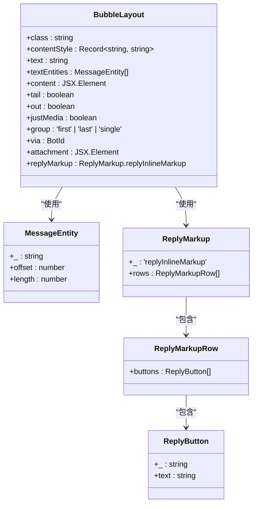
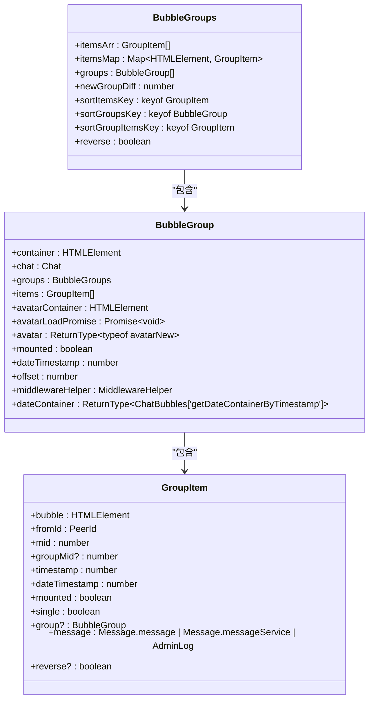
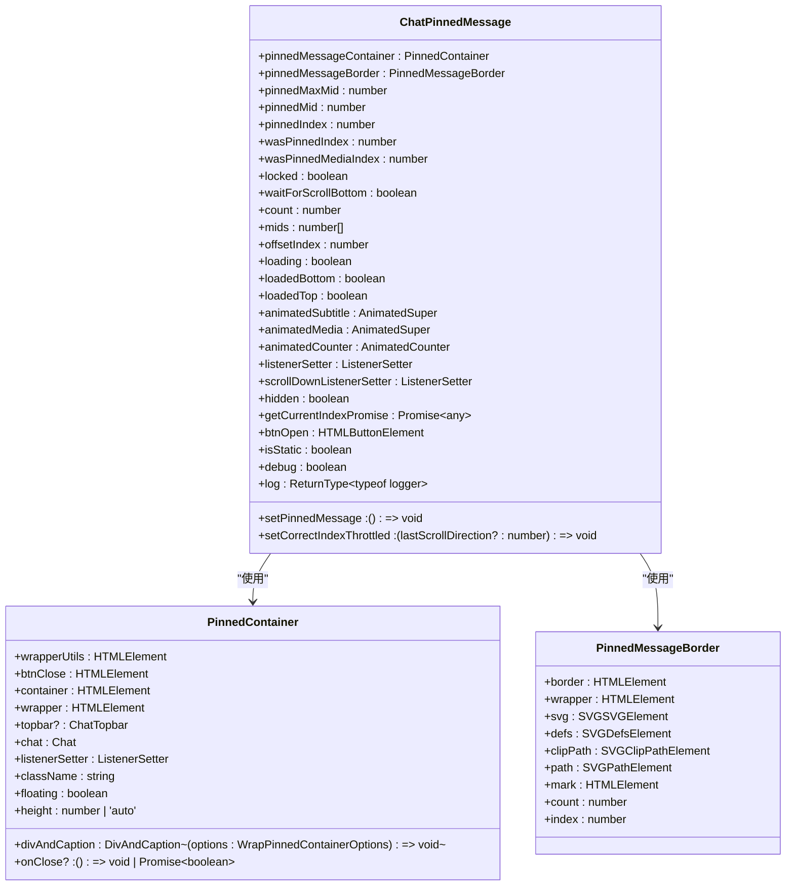
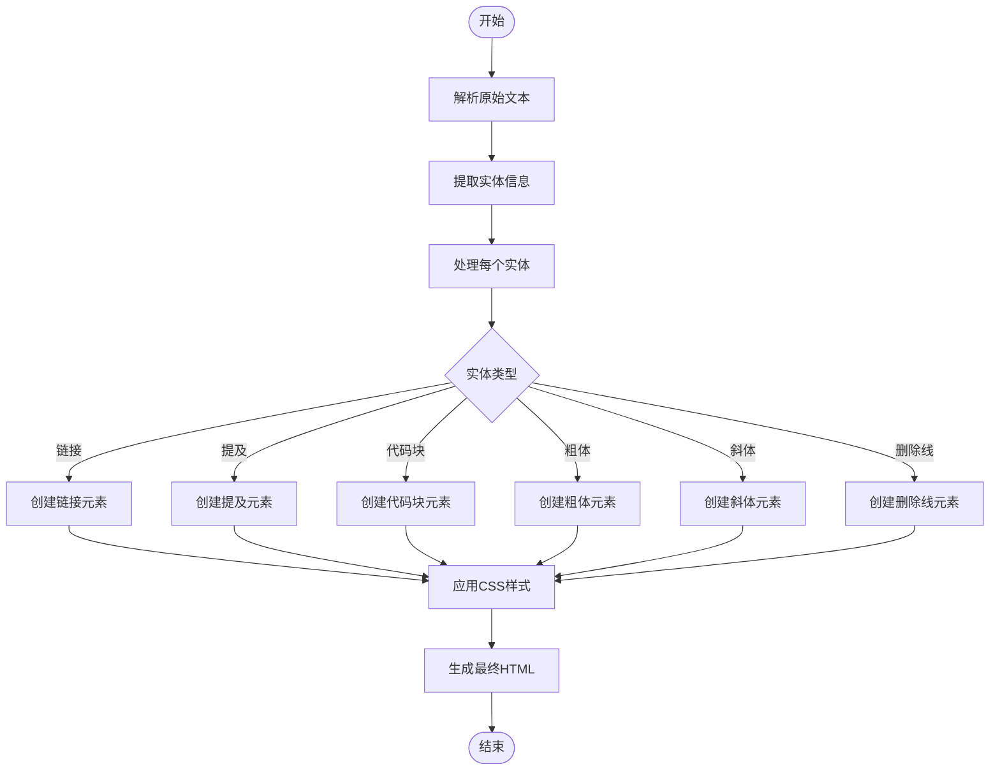
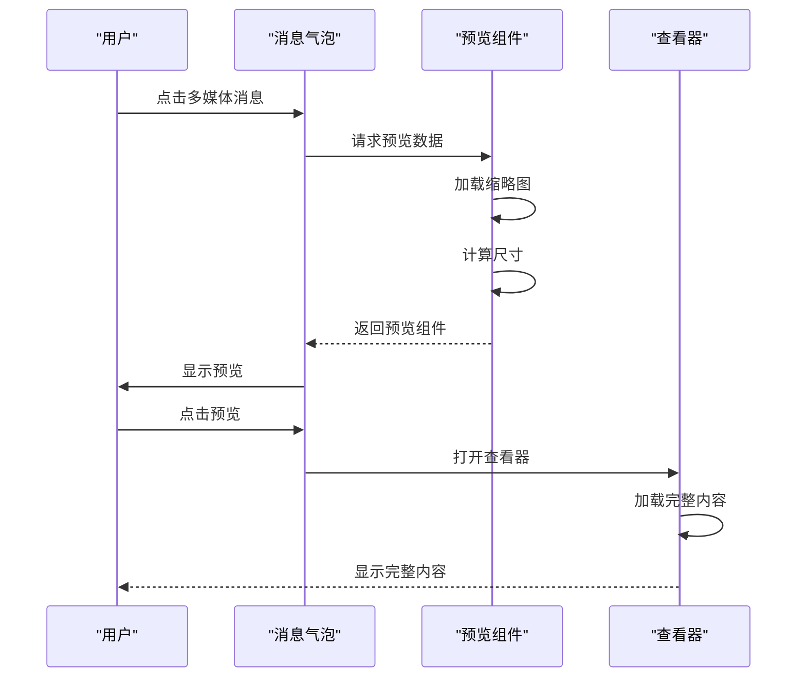
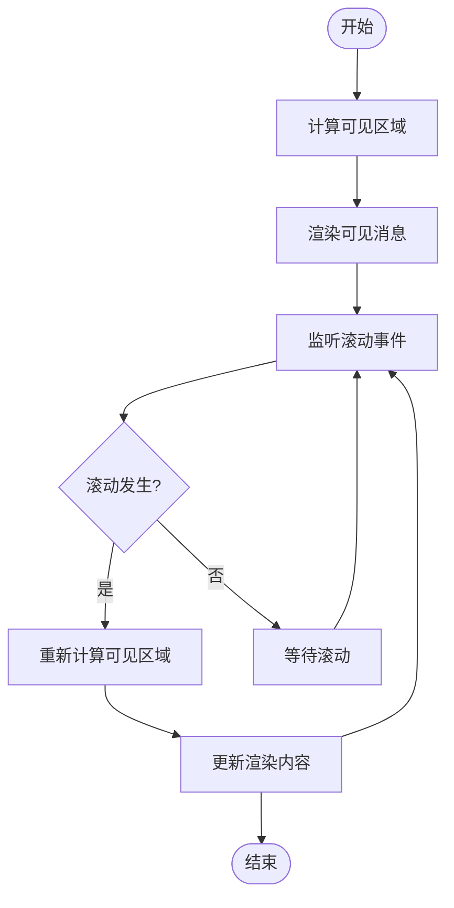
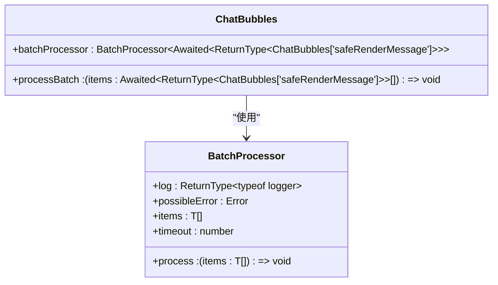
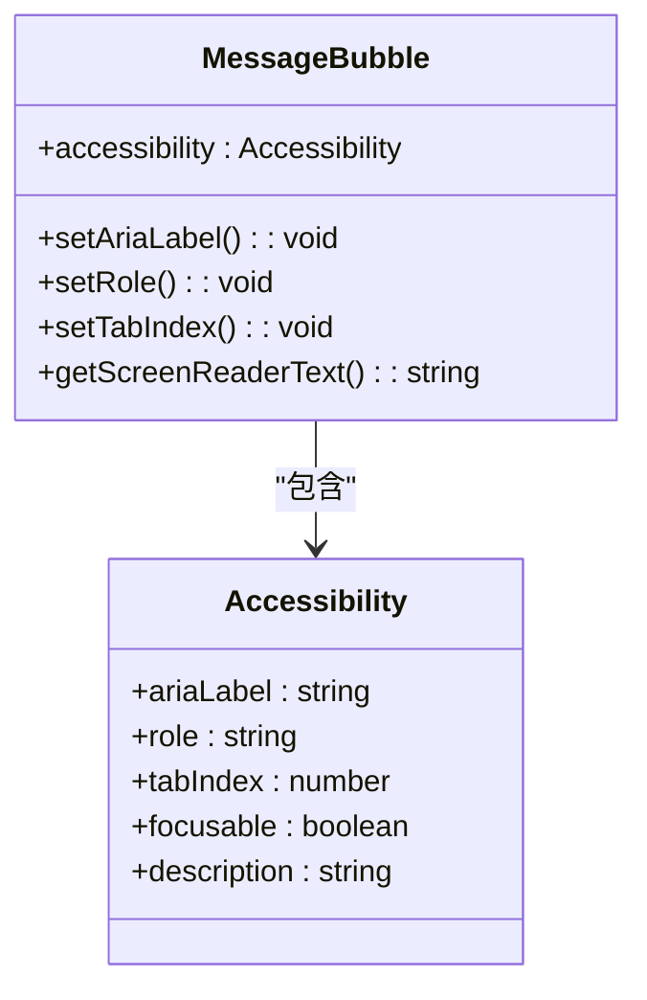

# 消息展示

<cite>
**本文档引用的文件**  
- [bubbleGroups.ts](file://src/components/chat/bubbleGroups.ts)
- [bubbles.ts](file://src/components/chat/bubbles.ts)
- [bubbleLayout.tsx](file://src/components/chat/bubbles/bubbleLayout.tsx)
- [minimalBubbleMessageContent.tsx](file://src/components/chat/bubbleParts/minimalBubbleMessageContent.tsx)
- [pinnedMessage.ts](file://src/components/chat/pinnedMessage.ts)
- [pinnedContainer.ts](file://src/components/chat/pinnedContainer.ts)
- [pinnedMessageBorder.ts](file://src/components/chat/pinnedMessageBorder.ts)
- [messageRender.ts](file://src/components/chat/messageRender.ts)
- [utils.ts](file://src/components/chat/utils.ts)
- [types.ts](file://src/components/chat/types.ts)
</cite>

## 目录
1. [简介](#简介)
2. [消息气泡实现机制](#消息气泡实现机制)
3. [消息组聚合逻辑](#消息组聚合逻辑)
4. [置顶消息样式与交互](#置顶消息样式与交互)
5. [富文本消息解析与渲染](#富文本消息解析与渲染)
6. [多媒体消息预览与展开](#多媒体消息预览与展开)
7. [性能优化策略](#性能优化策略)
8. [无障碍访问实现](#无障碍访问实现)
9. [结论](#结论)

## 简介

本文档详细介绍了消息展示组件的实现机制，重点涵盖消息气泡和消息组的布局算法、不同类型消息的渲染方式、消息聚合逻辑、置顶消息的特殊样式和交互行为、富文本消息的解析流程、多媒体消息的预览机制以及性能优化策略。文档还包含了无障碍访问的实现细节，确保所有用户都能有效使用消息功能。

## 消息气泡实现机制

消息气泡是消息展示的核心组件，负责渲染文本、图片、视频、文件等不同类型的消息内容。消息气泡的布局通过`BubbleLayout`组件实现，该组件根据消息类型和属性动态生成相应的HTML结构。

消息气泡的主要特性包括：
- **文本消息**：支持纯文本和富文本格式，包括链接、提及和代码块
- **媒体消息**：支持图片、视频、音频和文件的预览和播放
- **服务消息**：显示系统通知、状态更新等特殊消息
- **交互元素**：包含回复、转发、反应等操作按钮

消息气泡的样式通过CSS类名控制，根据消息的发送者、类型和状态应用不同的视觉效果。例如，发送方的消息会显示在右侧并带有特殊的背景色，而接收方的消息则显示在左侧。

**图表来源**
- [bubbleLayout.tsx](file://src/components/chat/bubbles/bubbleLayout.tsx#L24-L132)

**本节来源**
- [bubbleLayout.tsx](file://src/components/chat/bubbles/bubbleLayout.tsx#L1-L132)
- [bubbles.ts](file://src/components/chat/bubbles.ts#L1-L10306)

## 消息组聚合逻辑

消息组通过`BubbleGroups`类实现，该类负责将连续发送的消息合并显示以提升可读性。消息组的聚合逻辑基于以下条件：

1. **发送者相同**：消息必须由同一用户发送
2. **时间间隔**：消息之间的时间差不超过预设阈值（默认121秒）
3. **消息类型**：非服务消息且不包含特殊标记（如建议帖子）
4. **方向一致**：所有消息必须是发送或接收状态

消息组的实现包含以下关键组件：
- `BubbleGroup`：表示一个消息组，包含多个消息气泡
- `GroupItem`：表示组内的单个消息项
- `BubbleGroups`：管理所有消息组的容器类

消息组的聚合过程是动态的，当新消息到达或现有消息被编辑时，系统会重新评估消息组的结构。这种机制确保了消息展示的实时性和准确性。

**图表来源**
- [bubbleGroups.ts](file://src/components/chat/bubbleGroups.ts#L64-L882)

**本节来源**
- [bubbleGroups.ts](file://src/components/chat/bubbleGroups.ts#L1-L882)
- [bubbles.ts](file://src/components/chat/bubbles.ts#L1-L10306)

## 置顶消息样式与交互

置顶消息通过`ChatPinnedMessage`类实现，提供特殊的视觉样式和交互行为。置顶消息的显示包含一个边框标记，用于指示当前消息在所有置顶消息中的位置。

置顶消息边框的实现细节：
- **SVG路径**：使用SVG路径绘制多条垂直线段
- **动态高度**：根据置顶消息总数调整边框高度
- **滚动优化**：在大量置顶消息时显示滚动指示器

置顶消息的交互功能包括：
- **点击跳转**：点击置顶消息标题可跳转到对应消息位置
- **列表查看**：点击列表图标可查看所有置顶消息
- **取消置顶**：通过右键菜单或关闭按钮取消置顶状态

**图表来源**
- [pinnedMessage.ts](file://src/components/chat/pinnedMessage.ts#L33-L482)
- [pinnedContainer.ts](file://src/components/chat/pinnedContainer.ts#L30-L152)
- [pinnedMessageBorder.ts](file://src/components/chat/pinnedMessageBorder.ts#L15-L205)

**本节来源**
- [pinnedMessage.ts](file://src/components/chat/pinnedMessage.ts#L1-L482)
- [pinnedContainer.ts](file://src/components/chat/pinnedContainer.ts#L1-L152)
- [pinnedMessageBorder.ts](file://src/components/chat/pinnedMessageBorder.ts#L1-L205)

## 富文本消息解析与渲染

富文本消息的解析和渲染通过`wrapRichText`函数实现，支持多种格式化元素，包括链接、提及、代码块等。解析过程将原始文本和实体信息转换为带有适当样式的HTML元素。

支持的富文本格式包括：
- **链接**：自动识别URL并添加可点击链接
- **提及**：@用户名格式，点击可跳转到用户资料
- **代码块**：`` `代码` `` 格式，显示为等宽字体
- **粗体**：**文本** 格式，显示为加粗
- **斜体**：*文本* 格式，显示为斜体
- **删除线**：~~文本~~ 格式，显示为删除线

富文本解析器还支持嵌套格式，例如在代码块中包含链接。渲染过程确保了格式的正确性和可访问性，同时提供了良好的用户体验。

**图表来源**
- [messageRender.ts](file://src/components/chat/messageRender.ts#L1-L519)
- [bubbles.ts](file://src/components/chat/bubbles.ts#L1-L10306)

**本节来源**
- [messageRender.ts](file://src/components/chat/messageRender.ts#L1-L519)
- [bubbles.ts](file://src/components/chat/bubbles.ts#L1-L10306)

## 多媒体消息预览与展开

多媒体消息的预览和展开机制通过专门的包装器组件实现，支持图片、视频、音频和文件的预览。预览生成过程包括缩略图加载、尺寸计算和布局优化。

多媒体消息的主要特性：
- **图片预览**：显示缩略图，点击可查看原图
- **视频预览**：显示封面图和播放按钮，点击可播放
- **音频预览**：显示音频波形和播放控件
- **文件预览**：显示文件图标和基本信息

点击预览会触发展开机制，根据消息类型显示相应的详细视图。例如，图片会进入全屏查看模式，视频会开始播放，文件会显示下载选项。

**图表来源**
- [bubbles.ts](file://src/components/chat/bubbles.ts#L1-L10306)
- [wrappers](file://src/components/wrappers)

**本节来源**
- [bubbles.ts](file://src/components/chat/bubbles.ts#L1-L10306)
- [wrappers](file://src/components/wrappers)

## 性能优化策略

消息列表的性能优化通过多种策略实现，确保在大量消息情况下的流畅体验。主要优化策略包括虚拟滚动、懒加载和批处理。

### 虚拟滚动实现

虚拟滚动通过`DynamicVirtualList`组件实现，只渲染可见区域的消息，大大减少了DOM元素数量。滚动时动态更新可见区域的内容，保持高性能。

### 批处理优化

批处理通过`BatchProcessor`类实现，将多个消息渲染操作合并为一个批次处理，减少重排和重绘次数。

**图表来源**
- [bubbles.ts](file://src/components/chat/bubbles.ts#L1-L10306)
- [dynamicVirtualList](file://src/components/dynamicVirtualList)

**本节来源**
- [bubbles.ts](file://src/components/chat/bubbles.ts#L1-L10306)
- [dynamicVirtualList](file://src/components/dynamicVirtualList)

## 无障碍访问实现

无障碍访问通过多种技术实现，确保屏幕阅读器能够正确识别消息内容和发送者信息。主要实现包括：

1. **语义化HTML**：使用适当的HTML标签和ARIA属性
2. **键盘导航**：支持键盘操作所有消息功能
3. **屏幕阅读器优化**：提供清晰的消息描述
4. **高对比度模式**：支持视觉障碍用户的显示需求

消息气泡包含以下无障碍特性：
- `aria-label`：描述消息的发送者、时间和内容
- `role`属性：标识消息类型（如"article"）
- 键盘焦点管理：确保所有交互元素可键盘访问
- 语音输出优化：提供简洁明了的消息描述

**图表来源**
- [bubbles.ts](file://src/components/chat/bubbles.ts#L1-L10306)
- [utils](file://src/helpers)

**本节来源**
- [bubbles.ts](file://src/components/chat/bubbles.ts#L1-L10306)
- [utils](file://src/helpers)

## 结论

消息展示组件通过精心设计的架构和优化策略，实现了高效、可访问且用户友好的消息体验。消息气泡和消息组的实现机制确保了消息的清晰展示和良好可读性，而置顶消息、富文本和多媒体功能则丰富了消息的表达能力。性能优化策略保证了在大量消息情况下的流畅体验，无障碍访问实现则确保了所有用户都能平等使用消息功能。整体设计体现了对用户体验和技术性能的全面考虑。