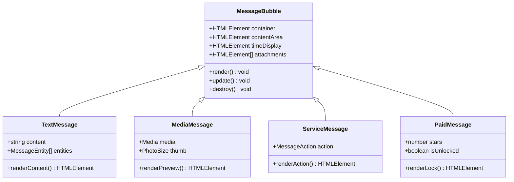
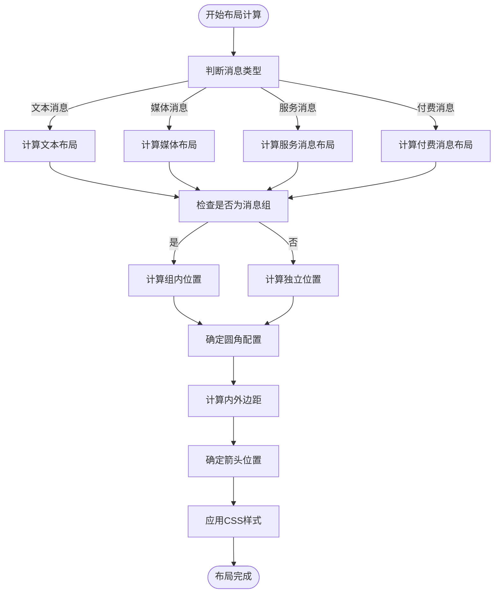
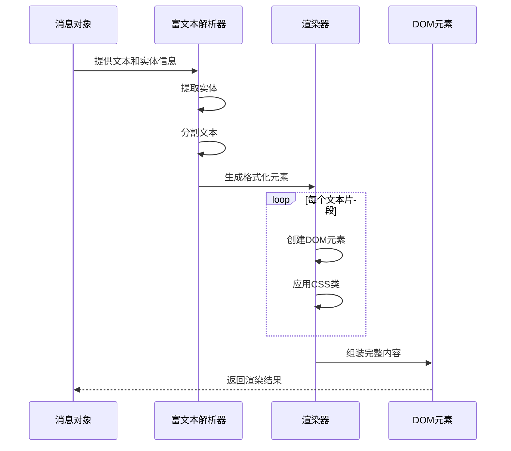
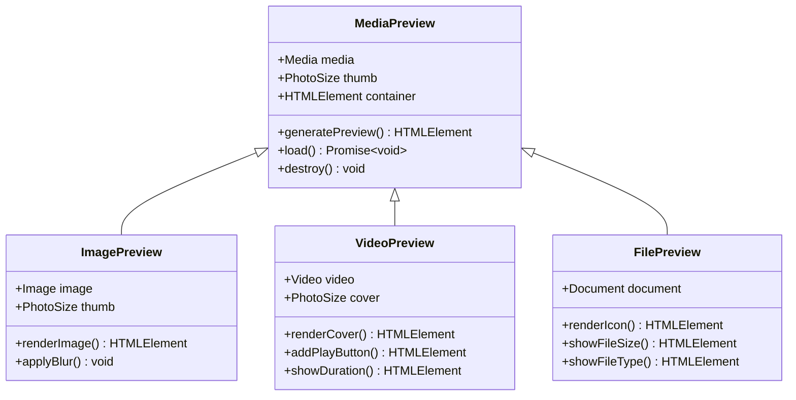
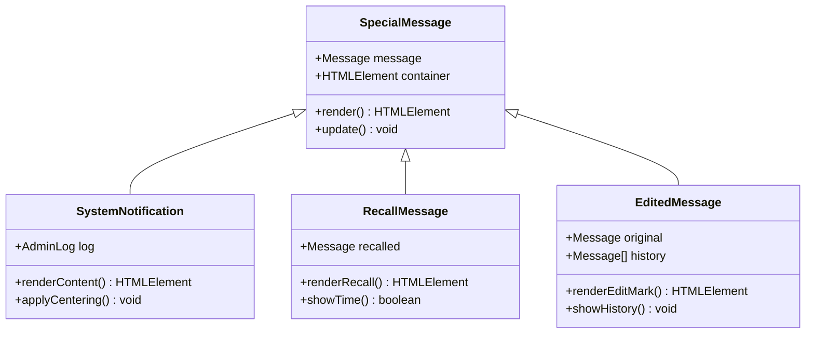

# 消息气泡

<cite>
**本文档引用文件**  
- [bubbles.ts](file://src/components/chat/bubbles.ts)
- [messageRender.ts](file://src/components/chat/messageRender.ts)
- [bubbleLayout.tsx](file://src/components/chat/bubbles/bubbleLayout.tsx)
- [service.tsx](file://src/components/chat/bubbles/service.tsx)
- [premiumGift.tsx](file://src/components/chat/bubbles/premiumGift.tsx)
- [starGift.tsx](file://src/components/chat/bubbles/starGift.tsx)
- [utils.ts](file://src/components/chat/utils.ts)
</cite>

## 目录
1. [简介](#简介)
2. [消息气泡类型](#消息气泡类型)
3. [UI结构与样式实现](#ui结构与样式实现)
4. [气泡布局算法](#气泡布局算法)
5. [富文本消息解析与渲染](#富文本消息解析与渲染)
6. [多媒体消息预览生成](#多媒体消息预览生成)
7. [特殊消息类型视觉表现](#特殊消息类型视觉表现)
8. [无障碍访问实现](#无障碍访问实现)
9. [性能优化策略](#性能优化策略)

## 简介
消息气泡组件是Telegram Web客户端中用于展示不同类型消息的核心UI元素。该组件负责渲染文本消息、媒体消息、服务消息、付费消息等多种类型的消息，并提供丰富的视觉效果和交互功能。消息气泡的设计遵循Telegram的视觉规范，确保在不同设备和屏幕尺寸上都能提供一致的用户体验。

**消息气泡组件**通过组合式架构实现，将不同功能拆分为独立的子组件，如气泡布局、时间显示、回复引用、反应表情等。这种设计模式提高了代码的可维护性和可扩展性，使得新增消息类型或修改现有功能变得更加容易。

## 消息气泡类型
消息气泡组件支持多种消息类型，每种类型都有其独特的视觉表现和交互行为。主要消息类型包括文本消息、媒体消息、服务消息和付费消息。

### 文本消息
文本消息是最基本的消息类型，用于显示纯文本内容。文本消息气泡包含发送者信息、消息内容、发送时间以及可能的编辑标记。文本消息支持多种格式化选项，包括链接、提及、代码块和表情符号。

### 媒体消息
媒体消息用于展示图片、视频、音频、文件等多媒体内容。媒体消息气泡通常包含缩略图或封面图，以及相关的元数据，如文件名、大小、时长等。对于图片和视频，还支持点击预览和全屏查看功能。

### 服务消息
服务消息用于显示系统通知、用户操作记录等非用户生成的内容。服务消息气泡采用特殊的视觉样式，以区别于普通消息。常见的服务消息包括用户加入/退出群组、消息被撤回、聊天主题更改等。

### 付费消息
付费消息是Telegram Stars功能的一部分，允许用户发送需要付费才能查看的消息。付费消息气泡包含明显的视觉标识，提示接收者需要支付一定数量的Stars才能查看完整内容。付费消息的设计旨在鼓励创作者获得经济回报，同时为用户提供有价值的内容。

**Section sources**
- [bubbles.ts](file://src/components/chat/bubbles.ts#L222-L243)
- [service.tsx](file://src/components/chat/bubbles/service.tsx#L8-L27)

## UI结构与样式实现
消息气泡的UI结构采用分层设计，由外层容器、内容区域、时间显示和附加元素组成。这种结构确保了消息气泡的灵活性和可扩展性。

### 外层容器
外层容器是消息气泡的根元素，负责定义气泡的整体布局和定位。容器根据消息的发送方向（发送或接收）应用不同的CSS类，以实现左右对齐效果。容器还包含用于生成气泡尾部的SVG元素，增强视觉识别度。

### 内容区域
内容区域包含消息的实际内容，如文本、媒体或服务消息描述。内容区域的样式根据消息类型和上下文动态调整。例如，文本消息的内容区域支持富文本渲染，而媒体消息的内容区域则专注于展示缩略图和元数据。

### 时间显示
时间显示组件位于消息气泡的右下角，显示消息的发送时间。对于已编辑的消息，还会显示"已编辑"标记。时间显示组件还支持查看消息的详细信息，如原始发送时间、转发来源等。

### 附加元素
附加元素包括回复引用、反应表情、转发标记等。这些元素根据消息的上下文动态添加到消息气泡中。例如，当消息包含回复时，会在内容区域上方显示回复引用；当消息收到反应时，会在时间显示下方显示反应表情。

**Diagram sources**
- [bubbleLayout.tsx](file://src/components/chat/bubbles/bubbleLayout.tsx#L24-L132)
- [bubbles.ts](file://src/components/chat/bubbles.ts#L442-L800)

## 气泡布局算法
消息气泡的布局算法负责计算气泡的形状、箭头位置、内外边距等视觉元素，确保在不同场景下都能提供最佳的视觉效果和用户体验。

### 气泡形状计算
气泡形状采用圆角矩形设计，根据消息的发送方向和相邻消息的类型动态调整圆角半径。算法通过分析消息序列，确定每个气泡的圆角配置：

- **单个消息**：四个角均为圆角
- **消息组首条**：根据发送方向，两个或三个角为圆角
- **消息组中间**：根据发送方向，两个角为圆角
- **消息组末条**：根据发送方向，两个或三个角为圆角

这种设计使得连续发送的消息能够形成视觉上的"气泡组"，提高消息的可读性和上下文关联性。

### 箭头位置计算
箭头（尾部）位置根据消息的发送方向和是否需要显示发送者名称来确定：

- **发送消息**：箭头位于右侧，靠近顶部
- **接收消息**：箭头位于左侧，靠近顶部
- **需要显示发送者名称**：箭头位置下移，为发送者名称留出空间

箭头采用SVG图形实现，确保在不同分辨率下都能保持清晰的视觉效果。

### 内外边距计算
内外边距的计算考虑了多种因素，包括消息类型、是否包含附件、是否为消息组成员等：

- **内边距**：根据内容类型和长度动态调整，确保内容与气泡边缘有足够的呼吸空间
- **外边距**：根据前后消息的类型和发送方向调整，避免视觉上的拥挤或断裂

**Diagram sources**
- [bubbleLayout.tsx](file://src/components/chat/bubbles/bubbleLayout.tsx#L24-L132)
- [utils.ts](file://src/components/chat/utils.ts#L31-L51)

## 富文本消息解析与渲染
富文本消息解析与渲染是消息气泡组件的核心功能之一，负责将包含格式化信息的文本内容正确显示为具有链接、提及、代码块、表情符号等元素的富文本。

### 富文本解析流程
富文本解析流程从原始文本和实体信息开始，经过多个处理阶段，最终生成可渲染的DOM结构：

1. **实体提取**：从消息实体数组中提取所有格式化信息，包括链接、提及、代码块、表情符号等
2. **文本分段**：根据实体位置将原始文本分割为多个片段，每个片段对应一种格式
3. **元素生成**：为每个文本片段生成相应的DOM元素，如链接使用`<a>`标签，代码块使用`<code>`标签
4. **样式应用**：为生成的DOM元素应用相应的CSS类，确保视觉效果符合Telegram的设计规范
5. **DOM组装**：将所有生成的DOM元素按顺序组装成完整的富文本内容

### 格式支持
消息气泡组件支持多种富文本格式，每种格式都有其特定的解析和渲染规则：

- **链接**：自动识别URL并转换为可点击的链接，支持http、https、tel、mailto等协议
- **提及**：识别@用户名并转换为指向相应用户的链接，点击后可跳转到用户资料
- **代码块**：支持行内代码和代码块，使用等宽字体和特殊背景色突出显示
- **表情符号**：支持Unicode表情符号和Telegram自定义表情符号，确保在不同平台上都能正确显示
- **粗体/斜体/下划线**：支持基本的文本格式化，使用相应的HTML标签实现

### 安全性考虑
在富文本渲染过程中，安全性是首要考虑的因素。组件采用以下措施防止XSS攻击：

- **HTML转义**：对所有用户输入的文本内容进行HTML转义，防止恶意脚本注入
- **标签过滤**：只允许安全的HTML标签和属性，移除可能带来安全风险的标签
- **链接验证**：对所有链接进行验证，确保只允许安全的协议和域名

**Diagram sources**
- [messageRender.ts](file://src/components/chat/messageRender.ts#L170-L319)
- [bubbles.ts](file://src/components/chat/bubbles.ts#L84-L85)

## 多媒体消息预览生成
多媒体消息预览生成机制负责处理图片缩略图、视频封面、文件图标等的显示，确保用户能够快速预览多媒体内容而无需完全加载。

### 图片缩略图处理
图片缩略图的生成和显示遵循以下流程：

1. **缩略图获取**：优先使用消息中包含的缩略图数据，如果不存在则从原始图片生成
2. **尺寸计算**：根据图片的宽高比和可用空间计算最佳显示尺寸，确保在不破坏布局的情况下最大化显示区域
3. **懒加载**：采用懒加载策略，只有当图片进入可视区域时才开始加载，减少初始页面加载时间
4. **占位符显示**：在图片加载完成前显示占位符，提供更好的用户体验

### 视频封面处理
视频封面的生成和显示具有以下特点：

- **封面提取**：从视频文件中提取第一帧作为封面，或使用消息中指定的封面图片
- **播放控件**：在封面叠加播放按钮，提示用户可以点击播放视频
- **时长显示**：在封面角落显示视频时长，帮助用户快速了解内容长度
- **预加载**：在用户悬停或接近视频时预加载部分视频数据，减少播放延迟

### 文件图标处理
文件图标的显示根据文件类型选择相应的图标：

- **文档文件**：使用文档图标，显示文件扩展名
- **压缩文件**：使用压缩包图标，显示压缩格式
- **可执行文件**：使用程序图标，显示安全警告
- **未知类型**：使用通用文件图标，显示文件扩展名

**Diagram sources**
- [bubbles.ts](file://src/components/chat/bubbles.ts#L111-L113)
- [messageRender.ts](file://src/components/chat/messageRender.ts#L27-L30)

## 特殊消息类型视觉表现
特殊消息类型包括系统通知、撤回消息、编辑标记等，这些消息具有独特的视觉表现和交互行为，以突出其特殊性质。

### 系统通知
系统通知用于显示聊天中的重要事件，如用户加入/退出群组、管理员操作、聊天设置更改等。系统通知采用居中显示的方式，使用特殊的背景色和图标来吸引用户注意。通知内容通常包含动态元素，如用户名、时间戳等，这些元素会根据实际数据动态更新。

### 撤回消息
撤回消息的视觉表现旨在清晰地传达消息已被删除的信息，同时保留一定的上下文。撤回消息显示为灰色背景的气泡，内容区域显示"此消息已被撤回"的提示文本。对于发送方，还可能显示撤回时间，帮助用户了解操作时机。

### 编辑标记
编辑标记用于提示消息已被修改。当用户查看消息详情时，可以查看编辑历史，包括每次编辑的时间和内容变化。编辑标记采用微妙的视觉提示，如"已编辑"标签，避免过度干扰主要消息内容。

### 其他特殊类型
其他特殊消息类型包括：

- **定时消息**：显示发送时间，提示消息将在未来某个时间发送
- **投票消息**：显示投票选项和实时统计，支持用户参与投票
- **地理位置**：显示地图缩略图，支持点击查看完整地图
- **联系人信息**：显示用户头像和基本信息，支持一键添加联系人

**Diagram sources**
- [service.tsx](file://src/components/chat/bubbles/service.tsx#L8-L27)
- [bubbles.ts](file://src/components/chat/bubbles.ts#L222-L243)

## 无障碍访问实现
无障碍访问实现确保屏幕阅读器能够正确识别消息内容、发送者和时间戳，为视障用户提供完整的使用体验。

### 语义化HTML
消息气泡组件采用语义化的HTML结构，使用适当的ARIA标签和属性：

- **角色定义**：为消息气泡定义`role="article"`，明确其作为独立内容单元的性质
- **标签关联**：使用`aria-labelledby`关联消息内容和发送者信息，帮助屏幕阅读器建立上下文
- **状态提示**：使用`aria-live`区域通知动态更新，如新消息到达、反应添加等

### 键盘导航
组件支持完整的键盘导航，确保用户无需鼠标即可操作：

- **焦点管理**：合理设置tabindex，确保焦点按逻辑顺序移动
- **快捷键支持**：提供常用的快捷键，如Enter查看消息、Ctrl+R回复等
- **焦点可见性**：确保焦点元素有明显的视觉提示，方便键盘用户定位

### 屏幕阅读器优化
针对屏幕阅读器进行了专门优化：

- **内容优先级**：确保最重要的信息（如消息内容）最先被读取
- **冗余信息过滤**：避免重复读取相同信息，如连续多条来自同一发送者的消息
- **上下文提示**：在适当位置添加上下文信息，如"新消息开始"、"消息组结束"等

**Section sources**
- [bubbles.ts](file://src/components/chat/bubbles.ts#L442-L800)
- [messageRender.ts](file://src/components/chat/messageRender.ts#L170-L319)

## 性能优化策略
性能优化策略确保消息气泡组件在处理大量消息时仍能保持流畅的用户体验。

### 懒加载
采用懒加载策略，只渲染可视区域内的消息：

- **虚拟滚动**：实现虚拟滚动容器，只创建和渲染当前可见的消息气泡
- **资源延迟加载**：图片、视频等资源在进入可视区域后再开始加载
- **组件延迟初始化**：复杂的组件（如反应表情选择器）在用户交互时才初始化

### 高效渲染
优化渲染流程，减少不必要的重绘和重排：

- **批量更新**：将多个DOM更新操作合并为一次，减少浏览器重排次数
- **CSS硬件加速**：合理使用transform和opacity等属性，利用GPU加速
- **事件委托**：使用事件委托减少事件监听器数量，提高事件处理效率

### 内存管理
有效的内存管理策略防止内存泄漏：

- **资源释放**：在组件销毁时及时释放所有资源，包括事件监听器、定时器等
- **缓存策略**：合理使用缓存，避免重复计算和请求
- **对象池**：对频繁创建和销毁的对象使用对象池，减少垃圾回收压力

**Section sources**
- [bubbles.ts](file://src/components/chat/bubbles.ts#L487-L493)
- [messageRender.ts](file://src/components/chat/messageRender.ts#L27-L30)