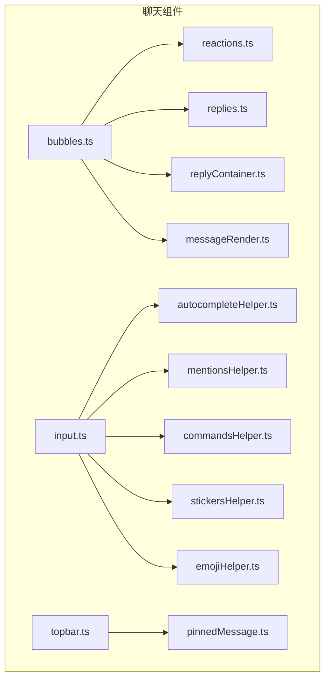
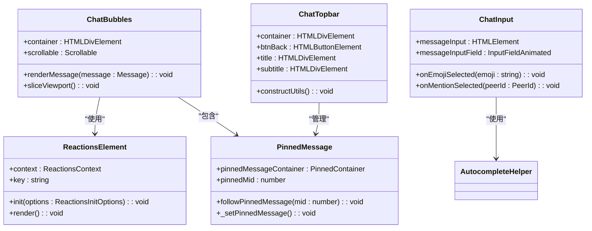
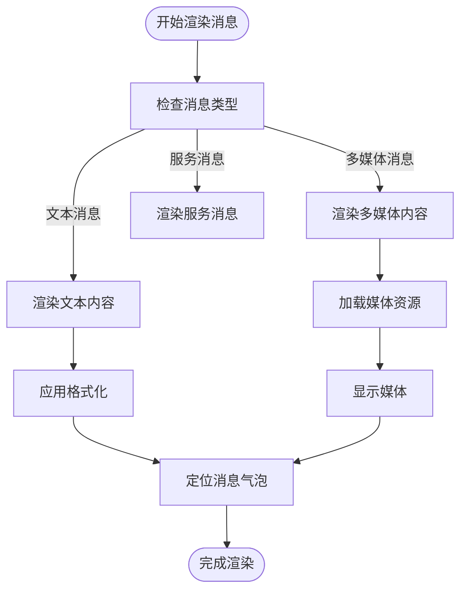
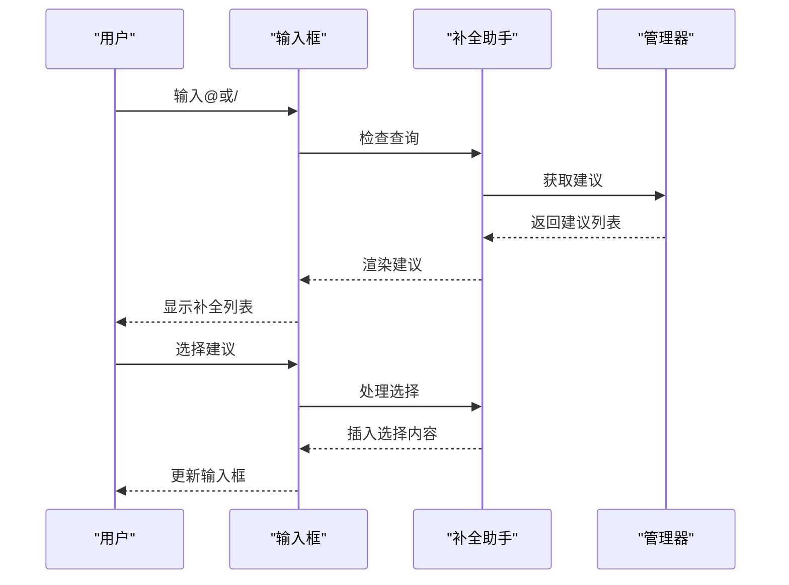
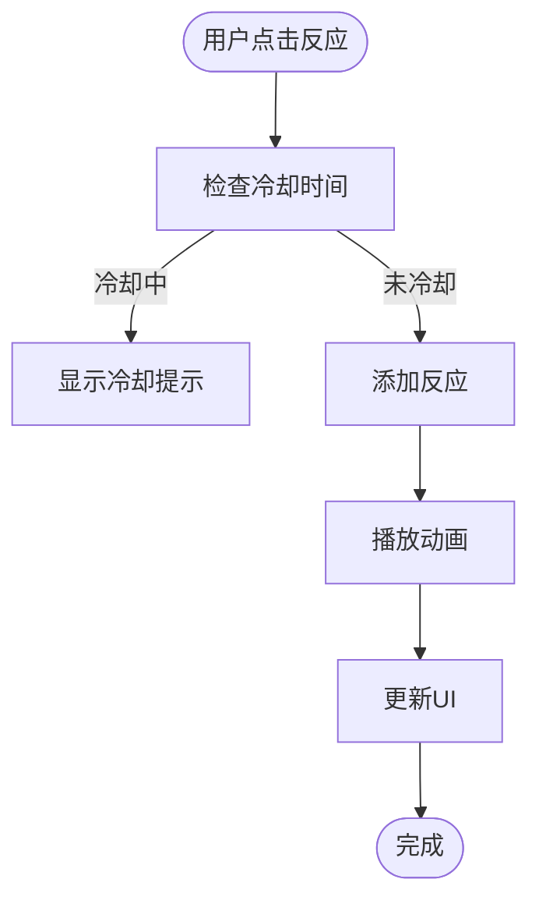

# 聊天专用组件

<cite>
**本文档引用的文件**   
- [types.ts](file://src/components/chat/types.ts)
- [input.ts](file://src/components/chat/input.ts)
- [topbar.ts](file://src/components/chat/topbar.ts)
- [reactions.ts](file://src/components/chat/reactions.ts)
- [pinnedMessage.ts](file://src/components/chat/pinnedMessage.ts)
- [bubbles.ts](file://src/components/chat/bubbles.ts)
- [autocompleteHelper.ts](file://src/components/chat/autocompleteHelper.ts)
- [mentionsHelper.ts](file://src/components/chat/mentionsHelper.ts)
- [commandsHelper.ts](file://src/components/chat/commandsHelper.ts)
- [replies.ts](file://src/components/chat/replies.ts)
- [replyContainer.ts](file://src/components/chat/replyContainer.ts)
- [stickersHelper.ts](file://src/components/chat/stickersHelper.ts)
- [emojiHelper.ts](file://src/components/chat/emojiHelper.ts)
- [messageRender.ts](file://src/components/chat/messageRender.ts)
</cite>

## 目录
1. [简介](#简介)
2. [项目结构](#项目结构)
3. [核心组件](#核心组件)
4. [架构概述](#架构概述)
5. [详细组件分析](#详细组件分析)
6. [依赖分析](#依赖分析)
7. [性能考虑](#性能考虑)
8. [故障排除指南](#故障排除指南)
9. [结论](#结论)

## 简介
本文档旨在全面介绍聊天界面专用组件，涵盖消息气泡、输入框、顶部栏、表情反应、回复引用、置顶消息、表情选择器和自动补全等核心功能。文档详细说明了各组件的实现机制、交互逻辑和性能优化策略，为开发者提供完整的开发参考。

## 项目结构
聊天专用组件主要位于 `src/components/chat` 目录下，包含多个子模块和工具类。核心组件包括消息气泡（bubbles）、输入框（input）、顶部栏（topbar）等，每个组件都有独立的文件和依赖关系。

**Diagram sources**
- [bubbles.ts](file://src/components/chat/bubbles.ts)
- [input.ts](file://src/components/chat/input.ts)
- [topbar.ts](file://src/components/chat/topbar.ts)

**Section sources**
- [bubbles.ts](file://src/components/chat/bubbles.ts)
- [input.ts](file://src/components/chat/input.ts)
- [topbar.ts](file://src/components/chat/topbar.ts)

## 核心组件
聊天界面的核心组件包括消息气泡、输入框、顶部栏等，这些组件共同构成了用户交互的基础。消息气泡负责显示消息内容，输入框处理用户输入，顶部栏提供实时状态和交互功能。

**Section sources**
- [bubbles.ts](file://src/components/chat/bubbles.ts)
- [input.ts](file://src/components/chat/input.ts)
- [topbar.ts](file://src/components/chat/topbar.ts)

## 架构概述
聊天界面采用模块化架构，各组件通过明确的接口进行通信。消息气泡组件负责渲染消息，输入框组件处理用户输入，顶部栏组件管理聊天状态。组件间通过事件和回调进行交互，确保系统的灵活性和可维护性。

**Diagram sources**
- [bubbles.ts](file://src/components/chat/bubbles.ts)
- [input.ts](file://src/components/chat/input.ts)
- [topbar.ts](file://src/components/chat/topbar.ts)
- [reactions.ts](file://src/components/chat/reactions.ts)
- [pinnedMessage.ts](file://src/components/chat/pinnedMessage.ts)

## 详细组件分析

### 消息气泡组件
消息气泡组件负责渲染和管理聊天消息的显示。它处理消息的布局、富文本渲染和多媒体集成，确保消息内容的正确展示。

#### 消息气泡布局算法
消息气泡采用自适应布局算法，根据消息内容和类型动态调整大小和位置。布局算法考虑了文本长度、多媒体内容和用户界面的响应性。

**Diagram sources**
- [bubbles.ts](file://src/components/chat/bubbles.ts)
- [messageRender.ts](file://src/components/chat/messageRender.ts)

#### 富文本渲染
消息气泡支持富文本渲染，包括链接、提及、表情符号等。富文本处理器将原始文本转换为HTML格式，确保内容的正确显示。

**Section sources**
- [bubbles.ts](file://src/components/chat/bubbles.ts)
- [messageRender.ts](file://src/components/chat/messageRender.ts)

#### 多媒体集成
消息气泡组件集成了多媒体支持，包括图片、视频、音频等。多媒体内容通过懒加载和预加载策略优化性能。

**Section sources**
- [bubbles.ts](file://src/components/chat/bubbles.ts)
- [messageRender.ts](file://src/components/chat/messageRender.ts)

### 输入框组件
输入框组件处理用户输入，支持提及(@)和命令(/)的自动补全机制。它提供了丰富的输入功能，提升用户体验。

#### 自动补全机制
输入框的自动补全机制通过监听用户输入，实时提供补全建议。机制支持提及和命令两种模式，分别处理用户和命令的补全。

**Diagram sources**
- [input.ts](file://src/components/chat/input.ts)
- [autocompleteHelper.ts](file://src/components/chat/autocompleteHelper.ts)
- [mentionsHelper.ts](file://src/components/chat/mentionsHelper.ts)
- [commandsHelper.ts](file://src/components/chat/commandsHelper.ts)

#### 提及和命令处理
输入框组件通过专门的助手类处理提及和命令。提及助手提供用户建议，命令助手提供命令建议，两者共享自动补全框架。

**Section sources**
- [input.ts](file://src/components/chat/input.ts)
- [mentionsHelper.ts](file://src/components/chat/mentionsHelper.ts)
- [commandsHelper.ts](file://src/components/chat/commandsHelper.ts)

### 顶部栏组件
顶部栏组件提供实时状态显示和交互功能，包括聊天标题、副标题和各种操作按钮。

#### 实时状态显示
顶部栏实时显示聊天状态，包括在线状态、打字状态等。状态信息通过事件系统更新，确保实时性。

**Section sources**
- [topbar.ts](file://src/components/chat/topbar.ts)

#### 交互功能
顶部栏提供多种交互功能，如返回、搜索、更多操作等。按钮通过事件监听器处理用户交互。

**Section sources**
- [topbar.ts](file://src/components/chat/topbar.ts)

### 表情反应组件
表情反应组件管理消息的表情反应，包括选择和动画效果。

#### 选择和动画效果
表情反应的选择通过点击触发，动画效果在反应添加时播放。动画通过预加载和缓存优化性能。

**Diagram sources**
- [reactions.ts](file://src/components/chat/reactions.ts)

**Section sources**
- [reactions.ts](file://src/components/chat/reactions.ts)

### 回复引用组件
回复引用组件管理消息的回复引用，包括层级显示和点击导航。

#### 层级显示
回复引用采用层级显示，清晰展示回复关系。层级通过缩进和视觉元素区分。

**Section sources**
- [replies.ts](file://src/components/chat/replies.ts)
- [replyContainer.ts](file://src/components/chat/replyContainer.ts)

#### 点击导航
点击回复引用可导航到原始消息。导航通过消息ID定位，确保准确跳转。

**Section sources**
- [replies.ts](file://src/components/chat/replies.ts)
- [replyContainer.ts](file://src/components/chat/replyContainer.ts)

### 置顶消息组件
置顶消息组件管理聊天中的置顶消息，提供快速访问和导航功能。

#### 置顶消息管理
置顶消息通过专门的容器管理，支持多条消息的滚动显示。管理器监听消息变化，实时更新UI。

**Section sources**
- [pinnedMessage.ts](file://src/components/chat/pinnedMessage.ts)

### 表情选择器组件
表情选择器组件提供表情符号的选择功能，支持静态和动态表情。

#### 表情选择
表情选择器通过标签页组织表情，支持搜索和分类浏览。选择器集成预加载机制，优化性能。

**Section sources**
- [emojiHelper.ts](file://src/components/chat/emojiHelper.ts)
- [stickersHelper.ts](file://src/components/chat/stickersHelper.ts)

## 依赖分析
聊天组件依赖多个内部和外部模块，包括消息管理器、用户管理器、媒体加载器等。依赖关系通过模块导入和事件系统管理。

```mermaid
graph TD
ChatBubbles --> AppMessagesManager
ChatBubbles --> AppUsersManager
ChatBubbles --> AppDocsManager
ChatInput --> AppMessagesManager
ChatInput --> AppUsersManager
ChatTopbar --> AppMessagesManager
ChatTopbar --> AppUsersManager
ChatReactions --> AppReactionsManager
ChatReplies --> AppMessagesManager
ChatPinnedMessage --> AppMessagesManager
ChatAutocompleteHelper --> AppUsersManager
ChatMentionsHelper --> AppUsersManager
ChatCommandsHelper --> AppUsersManager
ChatStickersHelper --> AppStickersManager
ChatEmojiHelper --> AppEmojiManager
ChatMessageRender --> AppMessagesManager
ChatMessageRender --> AppUsersManager
```

**Diagram sources**
- [bubbles.ts](file://src/components/chat/bubbles.ts)
- [input.ts](file://src/components/chat/input.ts)
- [topbar.ts](file://src/components/chat/topbar.ts)
- [reactions.ts](file://src/components/chat/reactions.ts)
- [replies.ts](file://src/components/chat/replies.ts)
- [pinnedMessage.ts](file://src/components/chat/pinnedMessage.ts)
- [autocompleteHelper.ts](file://src/components/chat/autocompleteHelper.ts)
- [mentionsHelper.ts](file://src/components/chat/mentionsHelper.ts)
- [commandsHelper.ts](file://src/components/chat/commandsHelper.ts)
- [stickersHelper.ts](file://src/components/chat/stickersHelper.ts)
- [emojiHelper.ts](file://src/components/chat/emojiHelper.ts)
- [messageRender.ts](file://src/components/chat/messageRender.ts)

**Section sources**
- [bubbles.ts](file://src/components/chat/bubbles.ts)
- [input.ts](file://src/components/chat/input.ts)
- [topbar.ts](file://src/components/chat/topbar.ts)
- [reactions.ts](file://src/components/chat/reactions.ts)
- [replies.ts](file://src/components/chat/replies.ts)
- [pinnedMessage.ts](file://src/components/chat/pinnedMessage.ts)
- [autocompleteHelper.ts](file://src/components/chat/autocompleteHelper.ts)
- [mentionsHelper.ts](file://src/components/chat/mentionsHelper.ts)
- [commandsHelper.ts](file://src/components/chat/commandsHelper.ts)
- [stickersHelper.ts](file://src/components/chat/stickersHelper.ts)
- [emojiHelper.ts](file://src/components/chat/emojiHelper.ts)
- [messageRender.ts](file://src/components/chat/messageRender.ts)

## 性能考虑
聊天界面通过多种策略优化性能，包括消息列表的虚拟滚动和表情包的懒加载。

### 虚拟滚动
消息列表采用虚拟滚动技术，只渲染可见区域的消息，大幅减少DOM节点数量，提升滚动性能。

**Section sources**
- [bubbles.ts](file://src/components/chat/bubbles.ts)

### 懒加载
表情包和多媒体内容采用懒加载策略，只在需要时加载资源，减少初始加载时间和内存占用。

**Section sources**
- [emojiHelper.ts](file://src/components/chat/emojiHelper.ts)
- [stickersHelper.ts](file://src/components/chat/stickersHelper.ts)
- [messageRender.ts](file://src/components/chat/messageRender.ts)

## 故障排除指南
本节提供常见问题的解决方案，帮助开发者快速定位和解决问题。

### 消息不显示
检查消息ID是否正确，确保消息已成功加载。查看网络请求，确认消息数据已获取。

**Section sources**
- [bubbles.ts](file://src/components/chat/bubbles.ts)

### 输入框无响应
检查输入框的事件监听器是否正确绑定，确保自动补全助手已初始化。

**Section sources**
- [input.ts](file://src/components/chat/input.ts)

## 结论
本文档全面介绍了聊天界面专用组件的设计和实现。通过模块化架构和优化策略，组件提供了高性能、可扩展的聊天功能。开发者可基于本文档快速理解和使用组件，构建高质量的聊天应用。