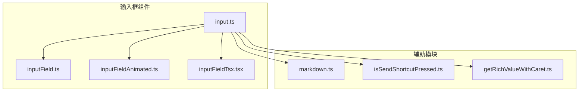
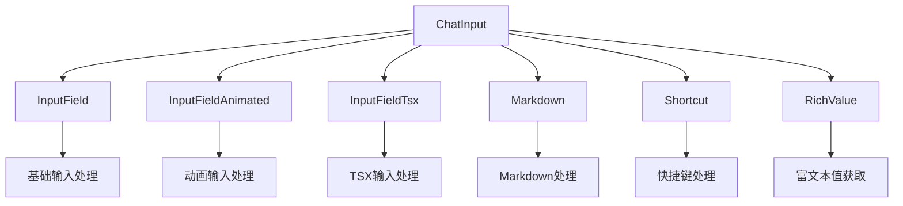
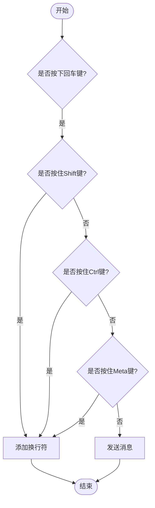
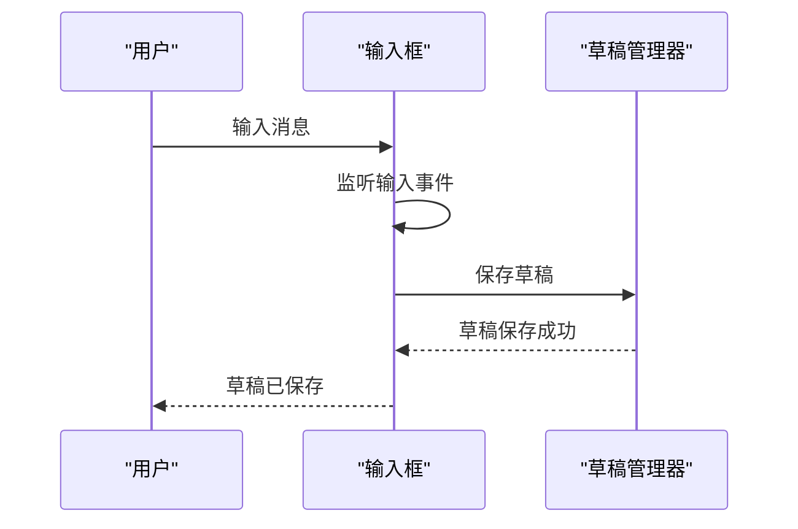
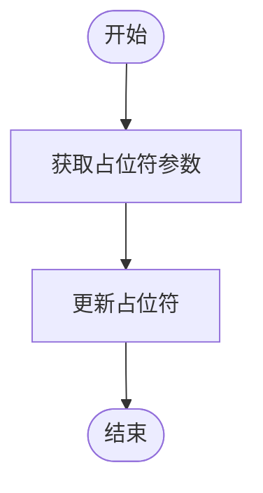

# 输入框组件

<cite>
**本文档引用的文件**   
- [input.ts](file://src/components/chat/input.ts)
- [inputField.ts](file://src/components/inputField.ts)
- [inputFieldAnimated.ts](file://src/components/inputFieldAnimated.ts)
- [inputFieldTsx.tsx](file://src/components/inputFieldTsx.tsx)
- [markdown.ts](file://src/helpers/dom/markdown.ts)
- [isSendShortcutPressed.ts](file://src/helpers/dom/isSendShortcutPressed.ts)
- [getRichValueWithCaret.ts](file://src/helpers/dom/getRichValueWithCaret.ts)
</cite>

## 目录
1. [简介](#简介)
2. [项目结构](#项目结构)
3. [核心组件](#核心组件)
4. [架构概述](#架构概述)
5. [详细组件分析](#详细组件分析)
6. [依赖分析](#依赖分析)
7. [性能考虑](#性能考虑)
8. [故障排除指南](#故障排除指南)
9. [结论](#结论)

## 简介
本文档详细介绍了Telegram Web客户端中聊天输入框组件的实现细节。该组件支持文本输入处理、富文本编辑、状态管理、UI样式和交互设计等多种功能，旨在为用户提供流畅的聊天体验。

## 项目结构
聊天输入框组件位于`src/components/chat/`目录下，主要由`input.ts`文件实现。该组件依赖于多个辅助模块，包括输入字段处理、富文本编辑、状态管理和UI交互等。



**Diagram sources**
- [input.ts](file://src/components/chat/input.ts)
- [inputField.ts](file://src/components/inputField.ts)
- [inputFieldAnimated.ts](file://src/components/inputFieldAnimated.ts)
- [inputFieldTsx.tsx](file://src/components/inputFieldTsx.tsx)
- [markdown.ts](file://src/helpers/dom/markdown.ts)
- [isSendShortcutPressed.ts](file://src/helpers/dom/isSendShortcutPressed.ts)
- [getRichValueWithCaret.ts](file://src/helpers/dom/getRichValueWithCaret.ts)

**Section sources**
- [input.ts](file://src/components/chat/input.ts)
- [inputField.ts](file://src/components/inputField.ts)

## 核心组件
聊天输入框组件的核心功能包括文本输入处理、富文本编辑、状态管理和UI交互。组件通过`ChatInput`类实现，支持多种输入模式和交互方式。

**Section sources**
- [input.ts](file://src/components/chat/input.ts)
- [inputField.ts](file://src/components/inputField.ts)

## 架构概述
聊天输入框组件采用模块化设计，将不同的功能分离到独立的模块中。这种设计使得组件易于维护和扩展。



**Diagram sources**
- [input.ts](file://src/components/chat/input.ts)
- [inputField.ts](file://src/components/inputField.ts)
- [inputFieldAnimated.ts](file://src/components/inputFieldAnimated.ts)
- [inputFieldTsx.tsx](file://src/components/inputFieldTsx.tsx)
- [markdown.ts](file://src/helpers/dom/markdown.ts)
- [isSendShortcutPressed.ts](file://src/helpers/dom/isSendShortcutPressed.ts)
- [getRichValueWithCaret.ts](file://src/helpers/dom/getRichValueWithCaret.ts)

## 详细组件分析
### 文本输入处理
聊天输入框组件支持多种文本输入处理机制，包括换行符处理、消息发送触发条件（回车键和Ctrl+回车键的区别）、输入内容的验证和清理。

#### 换行符处理
组件通过`isSendShortcutPressed`函数判断用户是否按下发送快捷键。如果用户按下回车键且未按住Shift、Ctrl或Meta键，则触发消息发送。



**Diagram sources**
- [isSendShortcutPressed.ts](file://src/helpers/dom/isSendShortcutPressed.ts)

#### 消息发送触发条件
组件支持两种消息发送触发条件：回车键和Ctrl+回车键。用户可以通过设置选择默认的发送方式。

**Section sources**
- [isSendShortcutPressed.ts](file://src/helpers/dom/isSendShortcutPressed.ts)

### 富文本编辑能力
聊天输入框组件支持富文本编辑，包括粗体、斜体、链接、代码块等Markdown格式的实时预览和编辑。

#### Markdown处理
组件通过`applyMarkdown`函数处理Markdown格式。用户可以通过快捷键或工具栏按钮应用不同的格式。

```mermaid
classDiagram
class MarkdownProcessor {
+applyMarkdown(type : string, href? : string)
+processCurrentFormatting(input : HTMLElement, toggling? : {type : string, active : boolean})
+resetCurrentFormatting()
+resetCurrentFontFormatting()
+resetLinkFormatting()
}
class InputField {
+input : HTMLElement
+onInputCallbacks : Array<() => void>
}
MarkdownProcessor --> InputField : "处理"
```

**Diagram sources**
- [markdown.ts](file://src/helpers/dom/markdown.ts)

### 状态管理
聊天输入框组件支持草稿保存、输入历史记录和多行编辑模式等状态管理功能。

#### 草稿保存
组件通过`saveDraft`函数保存用户的输入草稿。草稿信息包括消息内容、实体、回复信息和媒体信息。



**Diagram sources**
- [input.ts](file://src/components/chat/input.ts)

### UI样式和交互设计
聊天输入框组件具有丰富的UI样式和交互设计，包括占位符文本、输入字数统计、发送按钮状态变化等。

#### 占位符文本
组件通过`updateMessageInputPlaceholder`函数更新占位符文本。占位符文本根据当前聊天状态动态变化。



**Diagram sources**
- [input.ts](file://src/components/chat/input.ts)

## 依赖分析
聊天输入框组件依赖于多个模块，包括输入字段处理、富文本编辑、状态管理和UI交互等。这些模块通过明确的接口进行通信，确保组件的稳定性和可维护性。


**Diagram sources**
- [input.ts](file://src/components/chat/input.ts)
- [inputField.ts](file://src/components/inputField.ts)
- [inputFieldAnimated.ts](file://src/components/inputFieldAnimated.ts)
- [inputFieldTsx.tsx](file://src/components/inputFieldTsx.tsx)
- [markdown.ts](file://src/helpers/dom/markdown.ts)
- [isSendShortcutPressed.ts](file://src/helpers/dom/isSendShortcutPressed.ts)
- [getRichValueWithCaret.ts](file://src/helpers/dom/getRichValueWithCaret.ts)

## 性能考虑
为了提高性能，聊天输入框组件采用了多种优化策略，包括输入事件的节流处理、大量文本输入时的渲染优化等。

### 输入事件节流
组件通过`debounce`函数对输入事件进行节流处理，避免频繁触发事件导致性能下降。

**Section sources**
- [input.ts](file://src/components/chat/input.ts)

## 故障排除指南
### 输入框无法输入
如果输入框无法输入，可能是由于权限问题或组件未正确初始化。检查用户权限和组件初始化状态。

**Section sources**
- [input.ts](file://src/components/chat/input.ts)

## 结论
聊天输入框组件是Telegram Web客户端的核心功能之一，提供了丰富的文本输入和编辑功能。通过模块化设计和优化策略，组件实现了高性能和良好的用户体验。