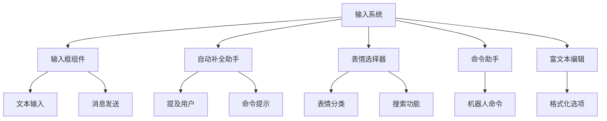
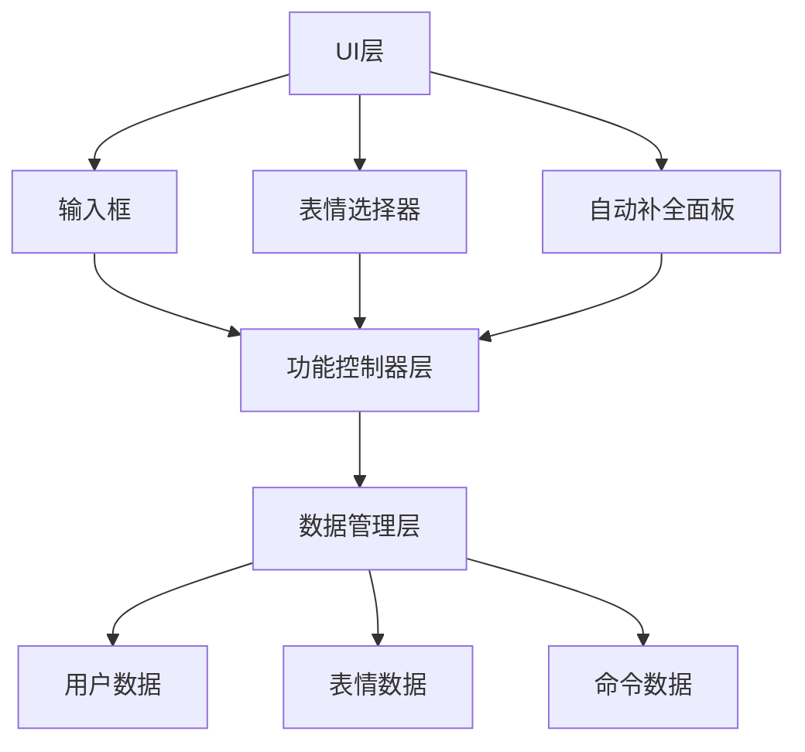
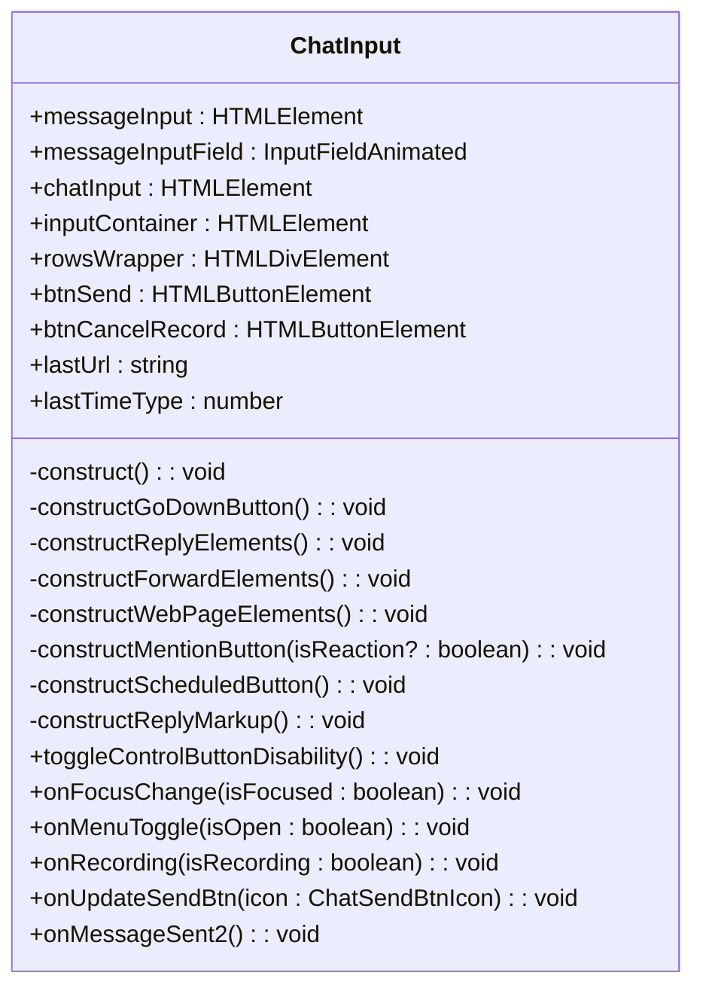
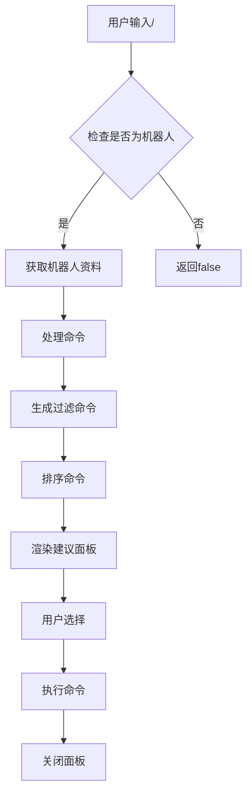
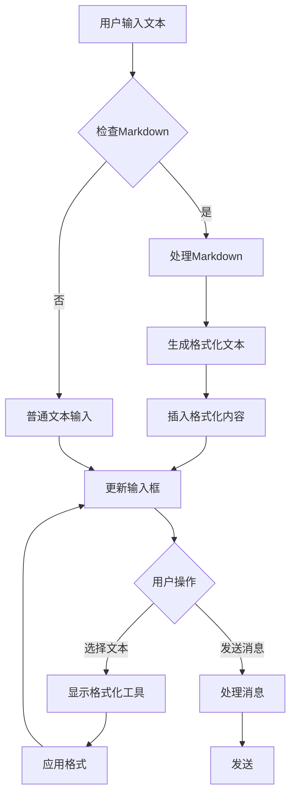
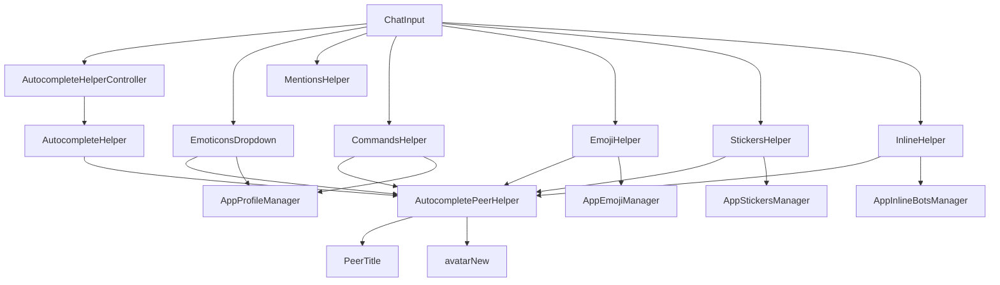
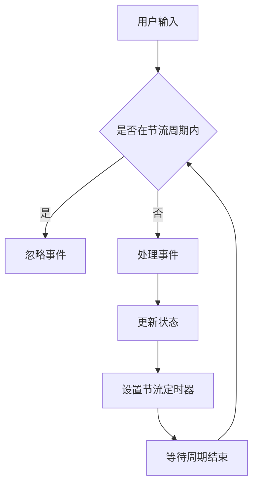
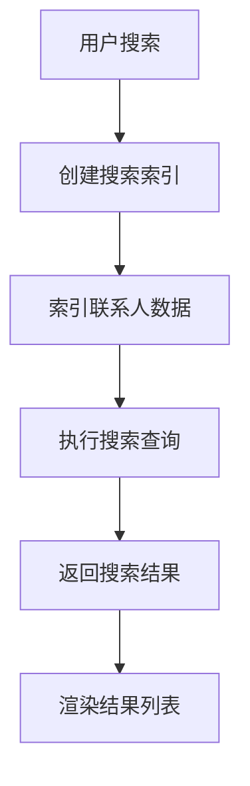

# 输入系统

<cite>
**本文档引用的文件**   
- [input.ts](file://src/components/chat/input.ts)
- [autocompleteHelper.ts](file://src/components/chat/autocompleteHelper.ts)
- [autocompleteHelperController.ts](file://src/components/chat/autocompleteHelperController.ts)
- [mentionsHelper.ts](file://src/components/chat/mentionsHelper.ts)
- [commandsHelper.ts](file://src/components/chat/commandsHelper.ts)
- [botCommands.ts](file://src/components/chat/botCommands.ts)
- [emoticonsDropdown/index.ts](file://src/components/emoticonsDropdown/index.ts)
- [emojiHelper.ts](file://src/components/chat/emojiHelper.ts)
- [stickersHelper.ts](file://src/components/chat/stickersHelper.ts)
- [inlineHelper.ts](file://src/components/chat/inlineHelper.ts)
- [autocompletePeerHelper.ts](file://src/components/chat/autocompletePeerHelper.ts)
</cite>

## 目录
1. [简介](#简介)
2. [项目结构](#项目结构)
3. [核心组件](#核心组件)
4. [架构概述](#架构概述)
5. [详细组件分析](#详细组件分析)
6. [依赖分析](#依赖分析)
7. [性能考虑](#性能考虑)
8. [故障排除指南](#故障排除指南)
9. [结论](#结论)

## 简介
本文档全面介绍了聊天输入系统的架构和功能，重点分析了输入框组件及其辅助功能。系统支持文本输入、换行、发送消息等基本操作，同时实现了智能自动补全助手、表情选择器、命令助手等高级功能。文档详细说明了富文本编辑能力、性能优化策略以及无障碍访问实现，为开发者提供了完整的系统理解和使用指南。

## 项目结构
聊天输入系统主要位于 `src/components/chat` 目录下，核心组件包括输入框、自动补全助手、表情选择器等。系统采用模块化设计，各功能组件相互协作，共同构建完整的输入体验。



**图表来源**
- [input.ts](file://src/components/chat/input.ts)
- [autocompleteHelper.ts](file://src/components/chat/autocompleteHelper.ts)
- [emoticonsDropdown/index.ts](file://src/components/emoticonsDropdown/index.ts)

**章节来源**
- [input.ts](file://src/components/chat/input.ts#L1-L800)
- [emoticonsDropdown/index.ts](file://src/components/emoticonsDropdown/index.ts#L1-L729)

## 核心组件
输入系统的核心组件包括输入框、自动补全控制器、表情选择器等。输入框组件负责处理所有用户输入操作，自动补全控制器管理各种智能提示功能，表情选择器提供丰富的表情和贴纸选择。这些组件通过事件驱动的方式协同工作，为用户提供流畅的输入体验。

**章节来源**
- [input.ts](file://src/components/chat/input.ts#L169-L417)
- [autocompleteHelperController.ts](file://src/components/chat/autocompleteHelperController.ts#L10-L50)
- [emoticonsDropdown/index.ts](file://src/components/emoticonsDropdown/index.ts#L97-L729)

## 架构概述
输入系统采用分层架构设计，上层为UI组件，中层为功能控制器，底层为数据管理。这种架构使得系统具有良好的可维护性和扩展性。



**图表来源**
- [input.ts](file://src/components/chat/input.ts)
- [autocompleteHelperController.ts](file://src/components/chat/autocompleteHelperController.ts)
- [emoticonsDropdown/index.ts](file://src/components/emoticonsDropdown/index.ts)

## 详细组件分析

### 输入框组件分析
输入框组件是整个输入系统的核心，负责处理所有用户输入操作。组件实现了文本输入、换行、发送消息等基本功能，同时支持富文本编辑。

#### 输入框类图


**图表来源**
- [input.ts](file://src/components/chat/input.ts#L169-L800)

**章节来源**
- [input.ts](file://src/components/chat/input.ts#L169-L800)

### 自动补全助手分析
自动补全助手系统由控制器和多个具体助手组成，实现了智能提示功能。

#### 自动补全助手类图
```mermaid
classDiagram
class AutocompleteHelperController {
-helpers : Set<AutocompleteHelper>
-middleware : Middleware
+toggleListNavigation(enabled : boolean) : void
+getMiddleware() : Middleware
+addHelper(helper : AutocompleteHelper) : void
+hideOtherHelpers(preserveHelper? : AutocompleteHelper) : void
}
class AutocompleteHelper {
-hidden : boolean
-container : HTMLElement
-list : HTMLElement
-resetTarget : () => void
-attach : () => void
-detach : () => void
-controller : AutocompleteHelperController
-listType : 'xy' | 'x' | 'y'
-onSelect : ListNavigationOptions['onSelect']
+toggle(hide? : boolean, fromController? : boolean, skipAnimation? : boolean) : void
+toggleListNavigation(enabled : boolean) : void
}
class AutocompletePeerHelper {
-scrollable : Scrollable
+render(data : {peerId : PeerId, name? : string, description? : string}[], middleware : Middleware, doNotShow? : boolean) : void
+static listElement(options : {className : string, peerId : PeerId, name? : string, description? : string, middleware : Middleware}) : HTMLElement
}
AutocompleteHelperController --> AutocompleteHelper : "管理"
AutocompleteHelper <|-- AutocompletePeerHelper : "继承"
AutocompletePeerHelper <|-- MentionsHelper : "继承"
AutocompletePeerHelper <|-- CommandsHelper : "继承"
AutocompletePeerHelper <|-- StickersHelper : "继承"
AutocompletePeerHelper <|-- EmojiHelper : "继承"
AutocompletePeerHelper <|-- InlineHelper : "继承"
```

**图表来源**
- [autocompleteHelperController.ts](file://src/components/chat/autocompleteHelperController.ts#L10-L50)
- [autocompleteHelper.ts](file://src/components/chat/autocompleteHelper.ts#L17-L168)
- [autocompletePeerHelper.ts](file://src/components/chat/autocompletePeerHelper.ts#L16-L133)

**章节来源**
- [autocompleteHelperController.ts](file://src/components/chat/autocompleteHelperController.ts#L10-L50)
- [autocompleteHelper.ts](file://src/components/chat/autocompleteHelper.ts#L17-L168)
- [autocompletePeerHelper.ts](file://src/components/chat/autocompletePeerHelper.ts#L16-L133)

### 提及用户功能分析
提及用户功能通过MentionsHelper实现，支持智能提示和快速选择。

#### 提及用户流程图
```mermaid
flowchart TD
A[用户输入@] --> B{检查查询}
B --> C[获取提及列表]
C --> D[过滤当前用户]
D --> E[获取用户信息]
E --> F[生成建议列表]
F --> G[渲染建议面板]
G --> H[用户选择]
H --> I[插入提及]
I --> J[关闭面板]
```

**图表来源**
- [mentionsHelper.ts](file://src/components/chat/mentionsHelper.ts#L14-L75)

**章节来源**
- [mentionsHelper.ts](file://src/components/chat/mentionsHelper.ts#L14-L75)

### 命令助手分析
命令助手通过CommandsHelper实现，支持机器人命令的智能提示。

#### 命令助手流程图


**图表来源**
- [commandsHelper.ts](file://src/components/chat/commandsHelper.ts#L60-L99)

**章节来源**
- [commandsHelper.ts](file://src/components/chat/commandsHelper.ts#L60-L99)

### 表情选择器分析
表情选择器系统由EmoticonsDropdown管理，提供表情、贴纸和GIF的选择功能。

#### 表情选择器类图
```mermaid
classDiagram
class EmoticonsDropdown {
-container : HTMLElement
-tabsEl : HTMLElement
-tabId : number
-tabs : {[id : number] : EmoticonsTab}
-searchButton : HTMLElement
-deleteBtn : HTMLElement
-selectTab : ReturnType<typeof horizontalMenu>
-savedRange : Range
-tabsToRender : EmoticonsTab[]
-managers : AppManagers
-rights : {[action in ChatRights]? : boolean}
-listenerSetter : ListenerSetter
-_chatInput : ChatInput
-textColor : string
-isStandalone : boolean
+canUseEmoji(emoji : AppEmoji, showToast? : boolean) : boolean
+get tab() : EmoticonsTab
+get chatInput() : ChatInput
+set chatInput(chatInput : ChatInput) : void
+get intersectionOptions() : IntersectionObserverInit
+setTextColor(textColor : string) : void
+getTab<T extends EmoticonsTab>(instance : EmoticonsTabConstructable<T>) : T
+init() : void
+getElement() : HTMLElement
+scrollTo(tab : EmoticonsTab, element : HTMLElement) : void
+onMediaClick(e : {target : EventTarget | Element}, clearDraft? : boolean, silent? : boolean, ignoreNoPremium? : boolean) : Promise<boolean>
+sendDocId(options : Parameters<ChatInput['sendMessageWithDocument']>[0]) : Promise<boolean>
+addLazyLoadQueueRepeat(lazyLoadQueue : LazyLoadQueueIntersector, processInvisibleDiv : (div : HTMLElement) => void, middleware : Middleware) : void
+getSavedRange() : Range
+destroy() : void
+hideAndDestroy() : Promise<void>
}
class EmojiTab {
+container : HTMLElement
+scrollable : Scrollable
+menuScroll : ScrollableX
+tabId : number
+init() : void
+onOpen() : void
+onOpened() : void
+onClose() : void
+onClosed() : void
}
class StickersTab {
+container : HTMLElement
+scrollable : Scrollable
+menuScroll : ScrollableX
+tabId : number
+init() : void
+onOpen() : void
+onOpened() : void
+onClose() : void
+onClosed() : void
}
class GifsTab {
+container : HTMLElement
+scrollable : Scrollable
+menuScroll : ScrollableX
+tabId : number
+init() : void
+onOpen() : void
+onOpened() : void
+onClose() : void
+onClosed() : void
}
EmoticonsDropdown --> EmojiTab : "包含"
EmoticonsDropdown --> StickersTab : "包含"
EmoticonsDropdown --> GifsTab : "包含"
```

**图表来源**
- [emoticonsDropdown/index.ts](file://src/components/emoticonsDropdown/index.ts#L97-L729)

**章节来源**
- [emoticonsDropdown/index.ts](file://src/components/emoticonsDropdown/index.ts#L97-L729)

### 富文本编辑分析
富文本编辑功能通过多个辅助组件实现，支持粗体、斜体、链接等格式化选项。

#### 富文本编辑流程图


**图表来源**
- [input.ts](file://src/components/chat/input.ts)
- [markdown.ts](file://src/helpers/dom/markdown.ts)

**章节来源**
- [input.ts](file://src/components/chat/input.ts#L115-L116)
- [htmlToSpan.ts](file://src/helpers/dom/htmlToSpan.ts)

## 依赖分析
输入系统各组件之间存在明确的依赖关系，通过控制器模式进行管理。



**图表来源**
- [input.ts](file://src/components/chat/input.ts)
- [autocompleteHelperController.ts](file://src/components/chat/autocompleteHelperController.ts)
- [emoticonsDropdown/index.ts](file://src/components/emoticonsDropdown/index.ts)

**章节来源**
- [input.ts](file://src/components/chat/input.ts#L7-L145)
- [autocompleteHelperController.ts](file://src/components/chat/autocompleteHelperController.ts#L7-L50)
- [emoticonsDropdown/index.ts](file://src/components/emoticonsDropdown/index.ts#L7-L47)

## 性能考虑
输入系统在性能方面进行了多项优化，确保在各种设备上都能流畅运行。

### 输入事件节流
系统使用节流和防抖技术处理输入事件，避免频繁触发导致性能问题。



**图表来源**
- [input.ts](file://src/components/chat/input.ts)
- [debounce.ts](file://src/helpers/schedulers/debounce.ts)

**章节来源**
- [input.ts](file://src/components/chat/input.ts#L54-L55)
- [throttle.ts](file://src/helpers/schedulers/throttle.ts)

### 大量联系人列表的快速搜索
系统使用搜索索引技术实现快速搜索，即使在大量联系人列表中也能快速找到目标。



**图表来源**
- [commandsHelper.ts](file://src/components/chat/commandsHelper.ts#L14-L58)
- [searchIndex.ts](file://src/lib/searchIndex.ts)

**章节来源**
- [commandsHelper.ts](file://src/components/chat/commandsHelper.ts#L14-L58)

## 故障排除指南
本节提供常见问题的解决方案和调试建议。

### 输入框无法获取焦点
**问题**: 输入框无法获取焦点，用户无法输入文本。
**解决方案**: 
1. 检查是否有其他元素阻止了焦点获取
2. 确认输入框没有被CSS样式隐藏
3. 检查JavaScript错误

### 自动补全助手不显示
**问题**: 输入@或/时，自动补全助手不显示。
**解决方案**:
1. 检查AutocompleteHelperController是否正确初始化
2. 确认相关助手是否已添加到控制器
3. 检查网络请求是否成功

### 表情选择器加载缓慢
**问题**: 表情选择器加载缓慢，影响用户体验。
**解决方案**:
1. 检查懒加载队列配置
2. 确认动画互交器是否正常工作
3. 优化表情数据加载策略

**章节来源**
- [input.ts](file://src/components/chat/input.ts)
- [autocompleteHelper.ts](file://src/components/chat/autocompleteHelper.ts)
- [emoticonsDropdown/index.ts](file://src/components/emoticonsDropdown/index.ts)

## 结论
聊天输入系统通过模块化设计和分层架构，实现了丰富而流畅的输入体验。系统核心组件包括输入框、自动补全助手、表情选择器等，各组件通过控制器模式协同工作。系统在性能优化和无障碍访问方面也做了充分考虑，确保在各种设备和使用场景下都能提供良好的用户体验。未来可以进一步优化搜索算法和增加更多富文本编辑功能，提升系统的整体性能和用户体验。