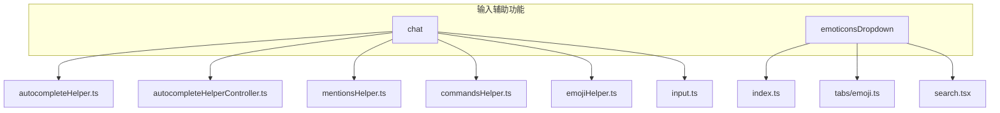
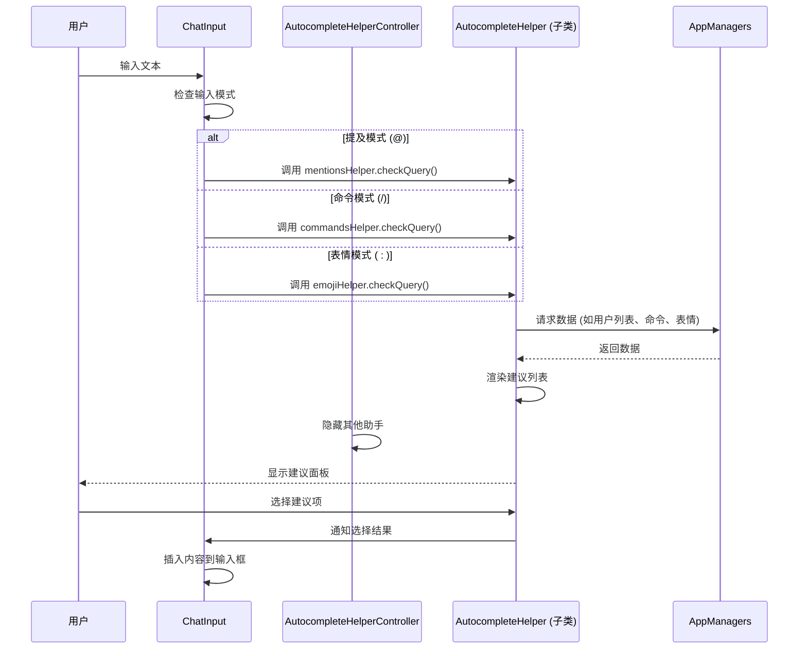
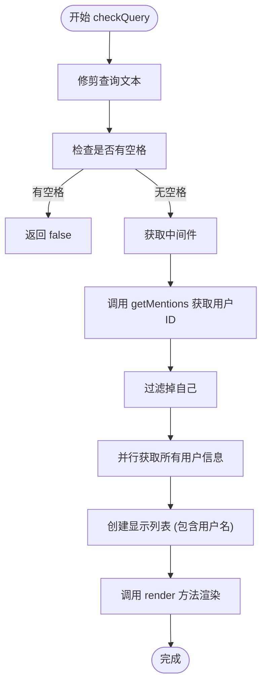
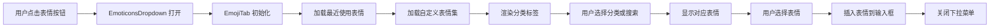
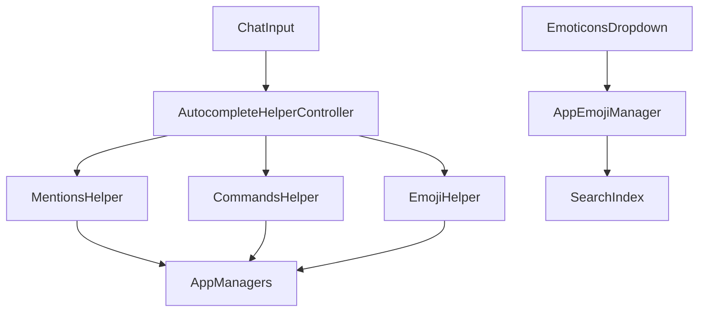

# 输入辅助功能

<cite>
**本文档引用的文件**   
- [autocompleteHelper.ts](file://src/components/chat/autocompleteHelper.ts)
- [autocompleteHelperController.ts](file://src/components/chat/autocompleteHelperController.ts)
- [botCommands.ts](file://src/components/chat/botCommands.ts)
- [emojiHelper.ts](file://src/components/chat/emojiHelper.ts)
- [emoticonsDropdown/index.ts](file://src/components/emoticonsDropdown/index.ts)
- [emoticonsDropdown/tabs/emoji.ts](file://src/components/emoticonsDropdown/tabs/emoji.ts)
- [mentionsHelper.ts](file://src/components/chat/mentionsHelper.ts)
- [autocompletePeerHelper.ts](file://src/components/chat/autocompletePeerHelper.ts)
- [commandsHelper.ts](file://src/components/chat/commandsHelper.ts)
- [input.ts](file://src/components/chat/input.ts)
- [emoticonsDropdown/search.tsx](file://src/components/emoticonsDropdown/search.tsx)
- [appEmojiManager.ts](file://src/lib/appManagers/appEmojiManager.ts)
</cite>

## 目录
1. [简介](#简介)
2. [项目结构](#项目结构)
3. [核心组件](#核心组件)
4. [架构概述](#架构概述)
5. [详细组件分析](#详细组件分析)
6. [依赖关系分析](#依赖关系分析)
7. [性能考虑](#性能考虑)
8. [故障排除指南](#故障排除指南)
9. [结论](#结论)

## 简介
本文档详细介绍了Telegram Web客户端中聊天输入辅助功能的实现机制，重点涵盖自动补全、命令提示和表情选择三大核心功能。文档深入分析了自动补全助手的智能提示机制，包括提及用户和命令的模糊搜索与快速定位；阐述了命令助手如何解析和显示机器人命令；解释了表情选择器的分类、搜索和最近使用记录管理；并记录了各辅助功能间的交互关系与性能优化策略。

## 项目结构
聊天输入辅助功能的代码主要分布在`src/components/chat`和`src/components/emoticonsDropdown`目录下。`chat`目录包含自动补全、提及、命令等核心逻辑，而`emoticonsDropdown`目录则负责表情、贴纸和GIF的选择界面。



**图表来源**
- [autocompleteHelper.ts](file://src/components/chat/autocompleteHelper.ts)
- [emoticonsDropdown/index.ts](file://src/components/emoticonsDropdown/index.ts)

**章节来源**
- [autocompleteHelper.ts](file://src/components/chat/autocompleteHelper.ts)
- [emoticonsDropdown/index.ts](file://src/components/emoticonsDropdown/index.ts)

## 核心组件
核心组件包括`AutocompleteHelper`（自动补全助手基类）、`AutocompleteHelperController`（控制器，管理多个助手）、`MentionsHelper`（提及助手）、`CommandsHelper`（命令助手）和`EmojiHelper`（表情助手）。这些组件共同协作，为用户提供流畅的输入体验。

**章节来源**
- [autocompleteHelper.ts](file://src/components/chat/autocompleteHelper.ts)
- [autocompleteHelperController.ts](file://src/components/chat/autocompleteHelperController.ts)
- [mentionsHelper.ts](file://src/components/chat/mentionsHelper.ts)
- [commandsHelper.ts](file://src/components/chat/commandsHelper.ts)
- [emojiHelper.ts](file://src/components/chat/emojiHelper.ts)

## 架构概述
系统采用分层架构，`ChatInput`作为入口点，通过`AutocompleteHelperController`协调多个`AutocompleteHelper`子类。当用户输入时，`ChatInput`会根据输入内容调用相应的助手（提及、命令或表情），这些助手负责获取数据、渲染列表并处理用户选择。



**图表来源**
- [input.ts](file://src/components/chat/input.ts)
- [autocompleteHelper.ts](file://src/components/chat/autocompleteHelper.ts)
- [mentionsHelper.ts](file://src/components/chat/mentionsHelper.ts)

## 详细组件分析

### 自动补全助手机制
自动补全功能由`AutocompleteHelper`基类和其子类（`MentionsHelper`, `CommandsHelper`, `EmojiHelper`）实现。`AutocompleteHelperController`负责管理这些助手，确保同一时间只有一个助手面板是可见的。

#### 类图
```mermaid
classDiagram
class AutocompleteHelper {
+hidden : boolean
+container : HTMLElement
+list : HTMLElement
+toggle(hide? : boolean)
+toggleListNavigation(enabled : boolean)
}
class AutocompleteHelperController {
-helpers : Set~AutocompleteHelper~
+addHelper(helper : AutocompleteHelper)
+hideOtherHelpers(preserveHelper? : AutocompleteHelper)
+getMiddleware() : Middleware
}
class AutocompletePeerHelper {
+render(data : {peerId : PeerId}[])
+static listElement(options) : HTMLElement
}
AutocompleteHelper <|-- AutocompletePeerHelper
AutocompletePeerHelper <|-- MentionsHelper
AutocompletePeerHelper <|-- CommandsHelper
AutocompleteHelper <|-- EmojiHelper
AutocompleteHelperController --> AutocompleteHelper : "管理"
```

**图表来源**
- [autocompleteHelper.ts](file://src/components/chat/autocompleteHelper.ts)
- [autocompleteHelperController.ts](file://src/components/chat/autocompleteHelperController.ts)
- [autocompletePeerHelper.ts](file://src/components/chat/autocompletePeerHelper.ts)

**章节来源**
- [autocompleteHelper.ts](file://src/components/chat/autocompleteHelper.ts)
- [autocompleteHelperController.ts](file://src/components/chat/autocompleteHelperController.ts)
- [autocompletePeerHelper.ts](file://src/components/chat/autocompletePeerHelper.ts)

### 提及与命令助手
`MentionsHelper`和`CommandsHelper`都继承自`AutocompletePeerHelper`，利用`getMentions`和`getProfileByPeerId`等API获取数据，并通过`render`方法将结果渲染到列表中。

#### 提及助手工作流程


**图表来源**
- [mentionsHelper.ts](file://src/components/chat/mentionsHelper.ts)
- [commandsHelper.ts](file://src/components/chat/commandsHelper.ts)

**章节来源**
- [mentionsHelper.ts](file://src/components/chat/mentionsHelper.ts)
- [commandsHelper.ts](file://src/components/chat/commandsHelper.ts)

### 表情选择器
表情选择器由`EmoticonsDropdown`类管理，它是一个包含多个标签页（表情、贴纸、GIF）的下拉菜单。`EmojiTab`负责处理表情标签页的逻辑，包括最近使用、分类和搜索。

#### 表情选择器数据流


**图表来源**
- [emoticonsDropdown/index.ts](file://src/components/emoticonsDropdown/index.ts)
- [emoticonsDropdown/tabs/emoji.ts](file://src/components/emoticonsDropdown/tabs/emoji.ts)

**章节来源**
- [emoticonsDropdown/index.ts](file://src/components/emoticonsDropdown/index.ts)
- [emoticonsDropdown/tabs/emoji.ts](file://src/components/emoticonsDropdown/tabs/emoji.ts)

## 依赖关系分析
各组件之间存在清晰的依赖关系。`ChatInput`依赖`AutocompleteHelperController`来管理所有助手。每个具体的助手（如`MentionsHelper`）依赖`AppManagers`来获取数据。`EmoticonsDropdown`则依赖`AppEmojiManager`来搜索和获取表情数据。



**图表来源**
- [input.ts](file://src/components/chat/input.ts)
- [autocompleteHelperController.ts](file://src/components/chat/autocompleteHelperController.ts)
- [appEmojiManager.ts](file://src/lib/appManagers/appEmojiManager.ts)

**章节来源**
- [input.ts](file://src/components/chat/input.ts)
- [autocompleteHelperController.ts](file://src/components/chat/autocompleteHelperController.ts)
- [appEmojiManager.ts](file://src/lib/appManagers/appEmojiManager.ts)

## 性能考虑
系统通过多种策略优化性能：
1.  **懒加载**: 表情和贴纸在可见时才加载。
2.  **缓存**: 使用`SearchIndex`对表情关键词进行索引，加速搜索。
3.  **中间件**: 使用`Middleware`机制在组件销毁时取消异步操作，避免内存泄漏。
4.  **节流**: 对输入事件进行节流处理，避免频繁触发搜索。

**章节来源**
- [emojiHelper.ts](file://src/components/chat/emojiHelper.ts)
- [appEmojiManager.ts](file://src/lib/appManagers/appEmojiManager.ts)
- [input.ts](file://src/components/chat/input.ts)

## 故障排除指南
- **助手不显示**: 检查`AutocompleteHelperController`是否正确管理了助手的显示/隐藏。
- **搜索无结果**: 确认`AppEmojiManager`已正确初始化并加载了关键词索引。
- **表情不渲染**: 检查`CustomEmojiRendererElement`是否正确创建并添加了自定义表情。
- **内存泄漏**: 确保所有异步操作都通过`Middleware`或`onCleanup`正确清理。

**章节来源**
- [autocompleteHelper.ts](file://src/components/chat/autocompleteHelper.ts)
- [appEmojiManager.ts](file://src/lib/appManagers/appEmojiManager.ts)
- [emojiHelper.ts](file://src/components/chat/emojiHelper.ts)

## 结论
Telegram Web客户端的输入辅助功能通过模块化和分层的设计，实现了高效、可维护的代码结构。`AutocompleteHelper`及其子类提供了灵活的扩展点，而`EmoticonsDropdown`则为表情、贴纸和GIF提供了一致的用户体验。通过合理的性能优化和依赖管理，该系统能够为用户提供快速、流畅的输入辅助体验。