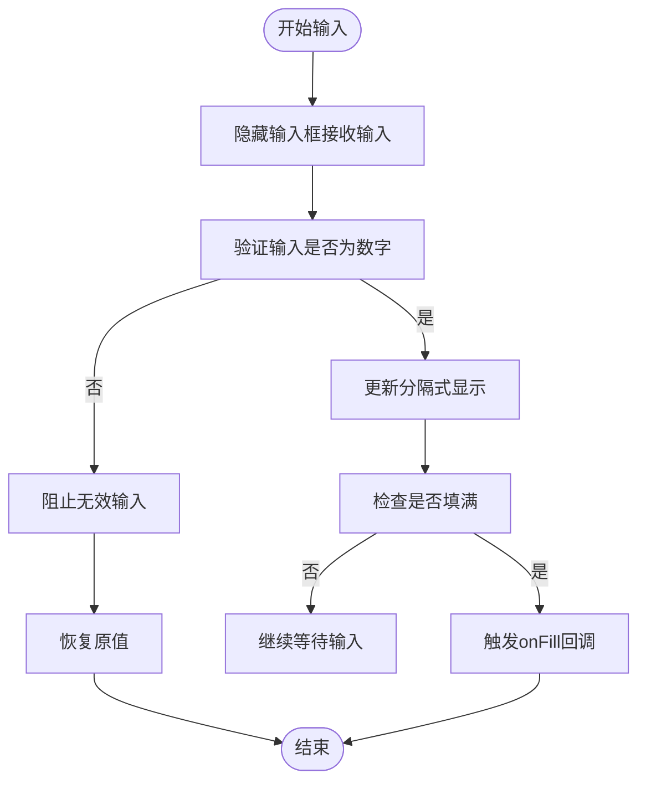
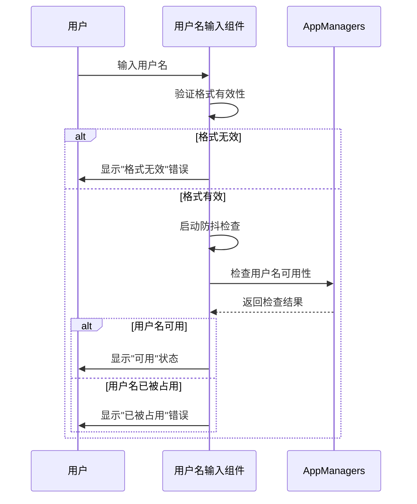
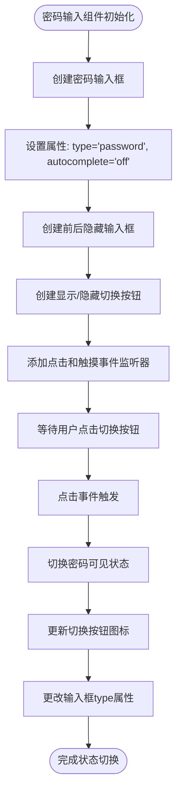

# 专用输入组件

<cite>
**本文档中引用的文件**  
- [codeInputField.tsx](file://src/components/codeInputField.tsx)
- [usernameInputField.ts](file://src/components/usernameInputField.ts)
- [countryInputField.ts](file://src/components/countryInputField.ts)
- [passwordInputField.ts](file://src/components/passwordInputField.ts)
- [inputField.ts](file://src/components/inputField.ts)
- [codeInputField.module.scss](file://src/components/codeInputField.module.scss)
</cite>

## 目录
1. [验证码输入组件](#验证码输入组件)
2. [用户名输入组件](#用户名输入组件)
3. [国家选择组件](#国家选择组件)
4. [密码输入组件](#密码输入组件)
5. [使用场景示例](#使用场景示例)
6. [移动端优化](#移动端优化)
7. [无障碍访问与国际化](#无障碍访问与国际化)

## 验证码输入组件

验证码输入组件实现了多字符分隔显示、自动焦点切换和粘贴处理功能。该组件通过隐藏的输入框接收用户输入，同时在视觉上将每个字符分隔显示在独立的数字框中，提供更好的用户体验。

组件支持自动粘贴功能，当用户粘贴验证码时，系统会自动提取数字并填充到相应位置。输入过程中，组件会智能处理光标位置和选区管理，确保用户在输入、删除和编辑时获得流畅的交互体验。



**图表来源**  
- [codeInputField.tsx](file://src/components/codeInputField.tsx#L65-L297)
- [codeInputField.module.scss](file://src/components/codeInputField.module.scss#L1-L112)

**章节来源**  
- [codeInputField.tsx](file://src/components/codeInputField.tsx#L13-L297)

## 用户名输入组件

用户名输入组件提供了实时验证机制、可用性检查和建议功能。组件继承自基础输入组件，并添加了专门针对用户名验证的逻辑。

当用户输入内容时，组件会立即进行格式验证，检查用户名是否符合有效规则。如果格式正确，系统会通过API调用检查用户名的可用性，并实时显示状态反馈。组件支持自定义头部文本（如@符号），并能正确处理输入值的获取和设置。



**图表来源**  
- [usernameInputField.ts](file://src/components/usernameInputField.ts#L14-L117)

**章节来源**  
- [usernameInputField.ts](file://src/components/usernameInputField.ts#L14-L117)

## 国家选择组件

国家选择组件实现了下拉菜单、搜索过滤和国旗图标显示功能。组件提供了一个可搜索的国家选择器，用户可以通过输入国家名称、ISO代码或首字母缩写来快速查找目标国家。

下拉菜单中每个国家选项都包含国旗emoji、国家名称和电话区号（可选）。组件支持键盘导航和回车键选择，提升了可访问性。搜索功能会实时过滤国家列表，当搜索结果唯一且用户按下回车键时，会自动选择该国家。

```mermaid
classDiagram
class CountryInputField {
+container : HTMLDivElement
+input : HTMLInputElement
+selectWrapper : HTMLDivElement
+liMap : Map<string, HTMLLIElement[]>
-lastCountrySelected : HelpCountry
-lastCountryCodeSelected : HelpCountryCode
+getSelected() : {country, code}
+hidePicker() : void
+selectCountryByTarget(target : HTMLElement) : void
+selectCountryByIso2(iso2 : string) : void
+override(country : HelpCountry, code : HelpCountryCode, countryName? : string) : void
}
class InputField {
+container : HTMLElement
+input : HTMLElement
+label : HTMLLabelElement
+placeholder : HTMLElement
+originalValue : string
+required : boolean
+validate : () => boolean
+allowStartingSpace : boolean
+value : string
+setValueSilently(value : any, fromSet? : boolean) : void
+setEmpty(empty? : boolean) : void
+isEmpty() : boolean
+isChanged() : boolean
+isValid() : boolean
+isValidToChange() : boolean
+setDraftValue(value : string, silent? : boolean) : void
+setOriginalValue(value : string, silent? : boolean) : void
+setState(state : InputState, label? : LangPackKey, labelOptions? : any[]) : void
+setError(label? : LangPackKey, labelOptions? : any[]) : void
+toggleForceFocus(enabled : boolean) : void
}
CountryInputField --|> InputField : 继承
```

**图表来源**  
- [countryInputField.ts](file://src/components/countryInputField.ts#L72-L312)

**章节来源**  
- [countryInputField.ts](file://src/components/countryInputField.ts#L72-L312)

## 密码输入组件

密码输入组件实现了安全特性，包括显示/隐藏切换、强度指示器和自动填充兼容性。组件通过添加视觉切换按钮，允许用户在查看和隐藏密码之间切换，提高了用户体验。

为了兼容浏览器的自动填充功能，组件在密码输入框前后添加了隐藏的"stealthy"输入框，这有助于浏览器正确识别和填充密码字段。显示/隐藏功能通过切换输入框的type属性实现，同时更新切换按钮的图标状态。



**图表来源**  
- [passwordInputField.ts](file://src/components/passwordInputField.ts#L11-L70)

**章节来源**  
- [passwordInputField.ts](file://src/components/passwordInputField.ts#L11-L70)

## 使用场景示例

专用输入组件在多种场景中发挥重要作用，包括双因素认证、注册表单和登录界面。

在双因素认证场景中，验证码输入组件提供安全的代码输入体验，确保用户能够准确输入收到的验证码。注册表单中，用户名输入组件实时验证用户名的可用性，避免用户提交后才发现用户名已被占用。登录界面则结合密码输入组件的安全特性和国家选择组件的本地化支持，为用户提供流畅的登录体验。

这些组件共同构成了应用的身份验证和用户注册流程的核心部分，确保了安全性、可用性和用户体验的平衡。

**章节来源**  
- [codeInputField.tsx](file://src/components/codeInputField.tsx#L13-L297)
- [usernameInputField.ts](file://src/components/usernameInputField.ts#L14-L117)
- [countryInputField.ts](file://src/components/countryInputField.ts#L72-L312)
- [passwordInputField.ts](file://src/components/passwordInputField.ts#L11-L70)

## 移动端优化

输入组件针对移动端进行了专门优化，包括键盘类型设置和自动大写处理。验证码输入组件设置inputmode="numeric"，确保移动设备显示数字键盘，简化用户输入过程。

电话号码输入组件设置type="tel"，同样触发数字键盘显示。这些优化减少了用户在移动设备上的输入难度，提高了表单填写效率。组件还处理了移动设备特有的输入行为，如iOS设备上的自动大写和输入预测功能，确保一致的用户体验。

**章节来源**  
- [codeInputField.tsx](file://src/components/codeInputField.tsx#L206)
- [telInputField.ts](file://src/components/telInputField.ts#L31)

## 无障碍访问与国际化

输入组件充分考虑了无障碍访问和国际化需求。所有组件都支持屏幕阅读器，通过适当的ARIA属性和语义化HTML结构，确保视觉障碍用户能够正常使用。

国际化方面，组件支持多语言界面，所有文本提示和错误消息都通过语言包系统进行管理。国家选择组件特别支持多语言国家名称显示，确保不同语言用户都能识别目标国家。这些特性共同确保了应用的全球可用性和包容性。

**章节来源**  
- [inputField.ts](file://src/components/inputField.ts#L23)
- [countryInputField.ts](file://src/components/countryInputField.ts#L15)
- [usernameInputField.ts](file://src/components/usernameInputField.ts#L9)