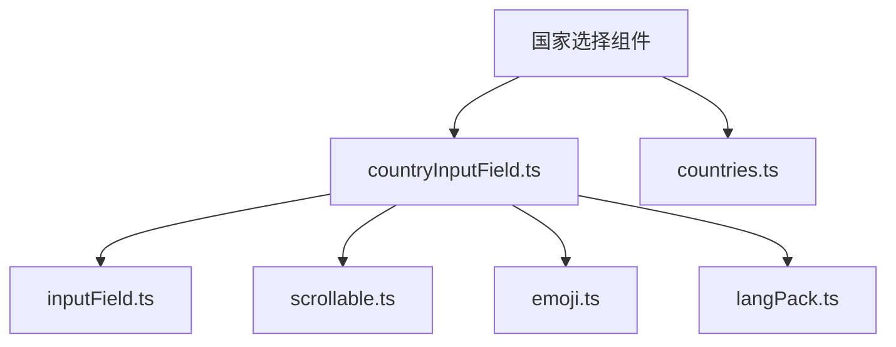
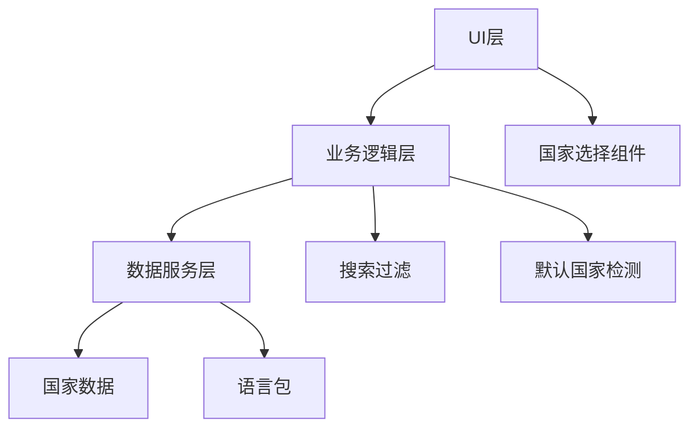
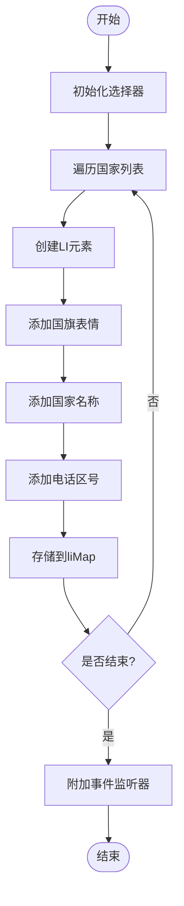
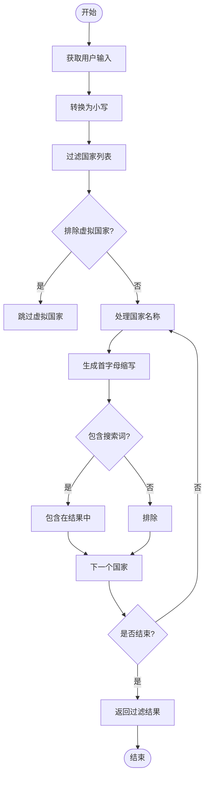
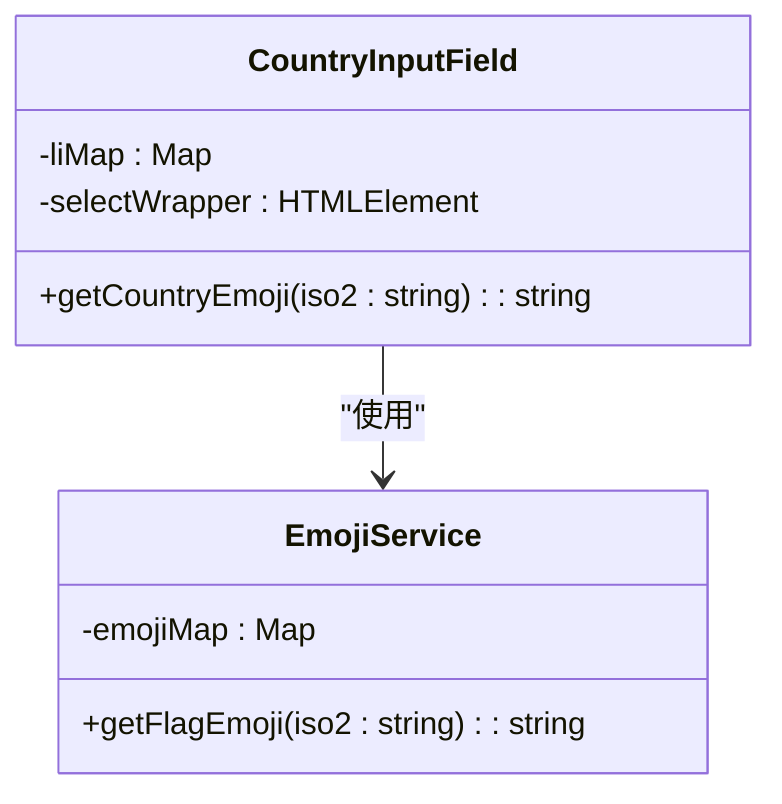
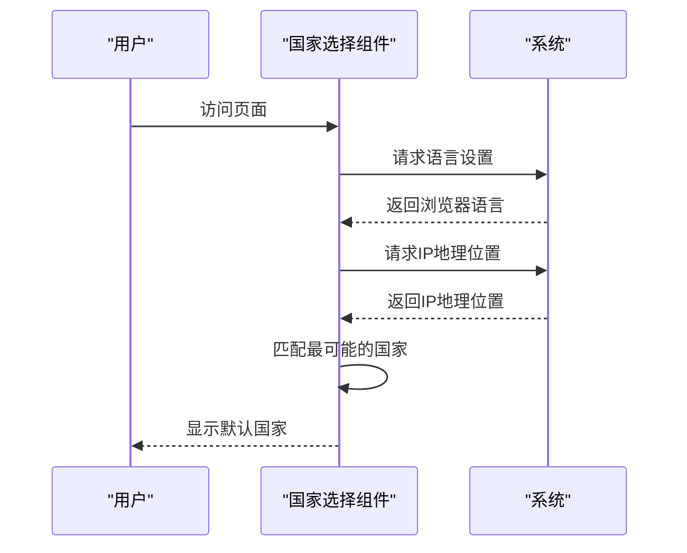
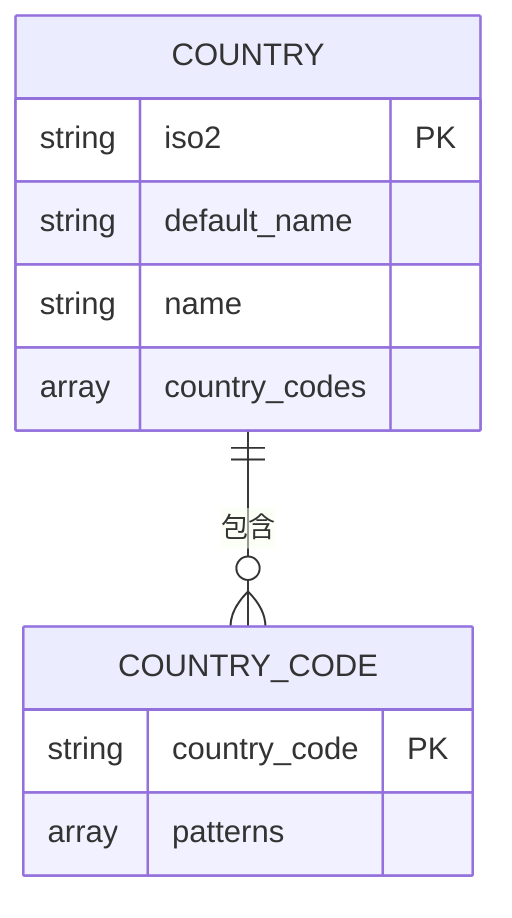
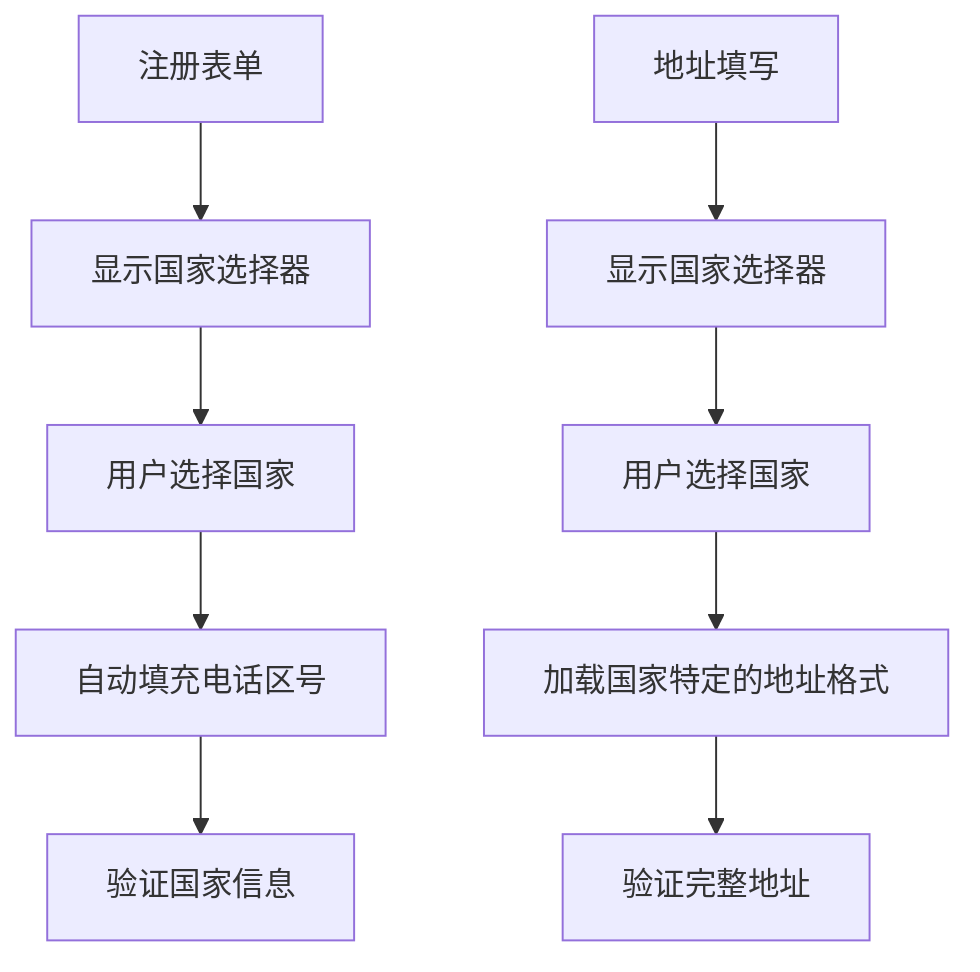
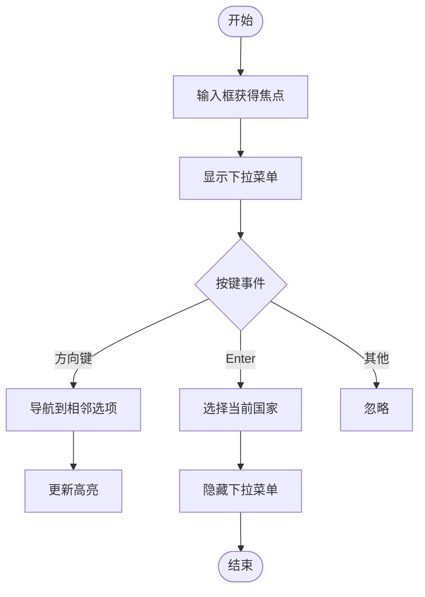
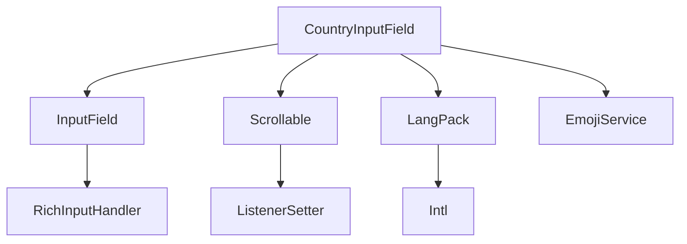

# 国家选择组件

<cite>
**本文档引用的文件**   
- [countryInputField.ts](file://src/components/countryInputField.ts)
- [countries.ts](file://src/countries.ts)
- [inputField.ts](file://src/components/inputField.ts)
- [scrollable.ts](file://src/components/scrollable.ts)
- [emoji.ts](file://src/vendor/emoji.ts)
- [langPack.ts](file://src/lib/langPack.ts)
</cite>

## 目录
1. [简介](#简介)
2. [项目结构](#项目结构)
3. [核心组件](#核心组件)
4. [架构概述](#架构概述)
5. [详细组件分析](#详细组件分析)
6. [依赖分析](#依赖分析)
7. [性能考虑](#性能考虑)
8. [故障排除指南](#故障排除指南)
9. [结论](#结论)

## 简介
国家选择组件是一个功能丰富的下拉选择器，允许用户从全球国家列表中选择其所在国家。该组件集成了搜索过滤、国旗图标显示、默认国家检测、无障碍访问支持等特性，为用户提供流畅的国家选择体验。组件基于TypeScript开发，采用模块化设计，与应用的国际化系统深度集成。

## 项目结构
国家选择组件位于`src/components`目录下，主要由`countryInputField.ts`文件实现。该组件依赖于`src/countries.ts`中的国家数据，以及`src/components/inputField.ts`和`src/components/scrollable.ts`等基础组件。整体结构清晰，职责分离明确。

**Diagram sources**
- [countryInputField.ts](file://src/components/countryInputField.ts)
- [countries.ts](file://src/countries.ts)

**Section sources**
- [countryInputField.ts](file://src/components/countryInputField.ts)
- [countries.ts](file://src/countries.ts)

## 核心组件
国家选择组件的核心是`CountryInputField`类，它继承自`InputField`基类，扩展了国家选择的特定功能。组件实现了下拉菜单的渲染、滚动性能优化、搜索过滤、国旗图标显示和默认国家检测等关键功能。

**Section sources**
- [countryInputField.ts](file://src/components/countryInputField.ts)
- [inputField.ts](file://src/components/inputField.ts)

## 架构概述
国家选择组件采用分层架构设计，上层为UI组件，中层为业务逻辑，底层为数据服务。组件通过事件驱动的方式与外部系统交互，确保了良好的解耦和可维护性。

**Diagram sources**
- [countryInputField.ts](file://src/components/countryInputField.ts)
- [countries.ts](file://src/countries.ts)
- [langPack.ts](file://src/lib/langPack.ts)

## 详细组件分析

### 下拉菜单实现
国家选择组件的下拉菜单实现采用了虚拟滚动技术，确保在包含大量国家选项时仍能保持流畅的滚动性能。菜单项的渲染通过`initSelect`方法完成，该方法遍历国家列表并为每个国家创建对应的DOM元素。

**Diagram sources**
- [countryInputField.ts](file://src/components/countryInputField.ts#L109-L161)

**Section sources**
- [countryInputField.ts](file://src/components/countryInputField.ts#L109-L161)

### 搜索过滤功能
搜索过滤功能允许用户通过输入国家名称快速定位目标国家。该功能通过`filterCountries`函数实现，支持对国家名称、默认名称和ISO代码的模糊匹配。搜索时还会考虑国家名称的首字母缩写，提高搜索的灵活性。

**Diagram sources**
- [countryInputField.ts](file://src/components/countryInputField.ts#L39-L65)

**Section sources**
- [countryInputField.ts](file://src/components/countryInputField.ts#L39-L65)

### 国旗图标显示
国旗图标通过Unicode表情符号实现，使用`getCountryEmoji`函数根据国家ISO代码生成对应的旗帜表情。图标资源管理简单高效，无需额外的图片资源加载，减少了网络请求。

**Diagram sources**
- [countryInputField.ts](file://src/components/countryInputField.ts#L117)
- [emoji.ts](file://src/vendor/emoji.ts)

**Section sources**
- [countryInputField.ts](file://src/components/countryInputField.ts#L117)
- [emoji.ts](file://src/vendor/emoji.ts)

### 默认国家检测
默认国家检测逻辑基于用户IP地址或浏览器语言设置。当用户首次访问时，系统会尝试根据这些信息自动选择最可能的国家，提升用户体验。此功能通过监听语言应用事件实现。

**Diagram sources**
- [countryInputField.ts](file://src/components/countryInputField.ts#L32-L34)
- [langPack.ts](file://src/lib/langPack.ts)

**Section sources**
- [countryInputField.ts](file://src/components/countryInputField.ts#L32-L34)
- [langPack.ts](file://src/lib/langPack.ts)

### 数据源管理
国家列表数据维护在`countries.ts`文件中，包含全球所有国家的ISO代码、名称和电话区号信息。数据更新机制通过语言包系统实现，确保国家列表能够随着应用语言包的更新而同步更新。

**Diagram sources**
- [countries.ts](file://src/countries.ts)

**Section sources**
- [countries.ts](file://src/countries.ts)

### 使用示例
国家选择组件广泛应用于注册表单和地址填写场景。在注册表单中，用户可以选择其所在国家以确定电话区号；在地址填写中，国家选择是完整地址信息的重要组成部分。

**Section sources**
- [countryInputField.ts](file://src/components/countryInputField.ts)

### 无障碍访问支持
组件充分考虑了键盘用户的使用需求，支持通过键盘导航浏览和选择国家。用户可以使用方向键在选项间移动，按Enter键确认选择，确保了良好的无障碍访问体验。

**Diagram sources**
- [countryInputField.ts](file://src/components/countryInputField.ts#L222-L253)

**Section sources**
- [countryInputField.ts](file://src/components/countryInputField.ts#L222-L253)

## 依赖分析
国家选择组件依赖于多个核心模块，包括输入字段基类、滚动容器、语言包系统和表情符号服务。这些依赖关系确保了组件功能的完整性和一致性。

**Diagram sources**
- [countryInputField.ts](file://src/components/countryInputField.ts)
- [inputField.ts](file://src/components/inputField.ts)
- [scrollable.ts](file://src/components/scrollable.ts)

**Section sources**
- [countryInputField.ts](file://src/components/countryInputField.ts)
- [inputField.ts](file://src/components/inputField.ts)
- [scrollable.ts](file://src/components/scrollable.ts)

## 性能考虑
国家选择组件在性能方面做了多项优化。首先，采用虚拟滚动技术避免了一次性渲染所有国家选项；其次，搜索过滤使用Set数据结构提高查找效率；最后，国旗表情符号的使用避免了额外的图片加载，减少了网络开销。

## 故障排除指南
常见问题包括下拉菜单无法显示、搜索功能失效和默认国家检测不准确。解决方案包括检查事件监听器是否正确绑定、验证国家数据是否完整加载以及确认浏览器语言设置是否正确。

**Section sources**
- [countryInputField.ts](file://src/components/countryInputField.ts)
- [countries.ts](file://src/countries.ts)

## 结论
国家选择组件是一个功能完善、性能优良的UI组件，通过合理的架构设计和优化策略，为用户提供了流畅的国家选择体验。组件的模块化设计使其易于维护和扩展，为应用的国际化支持提供了坚实的基础。