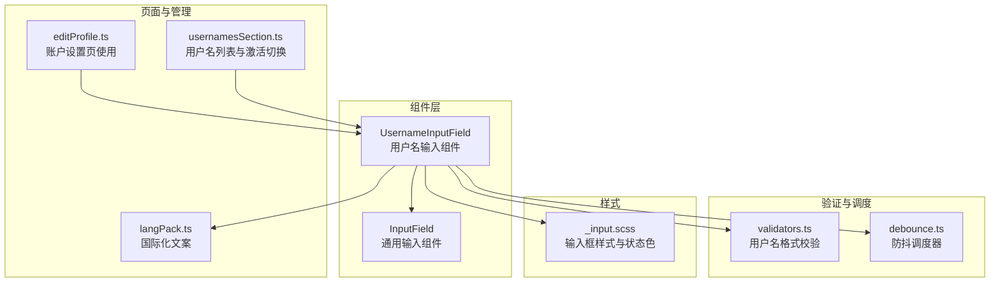
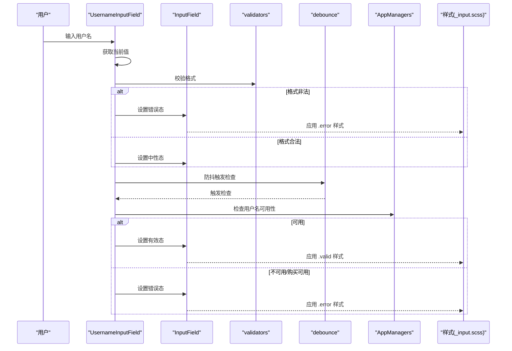
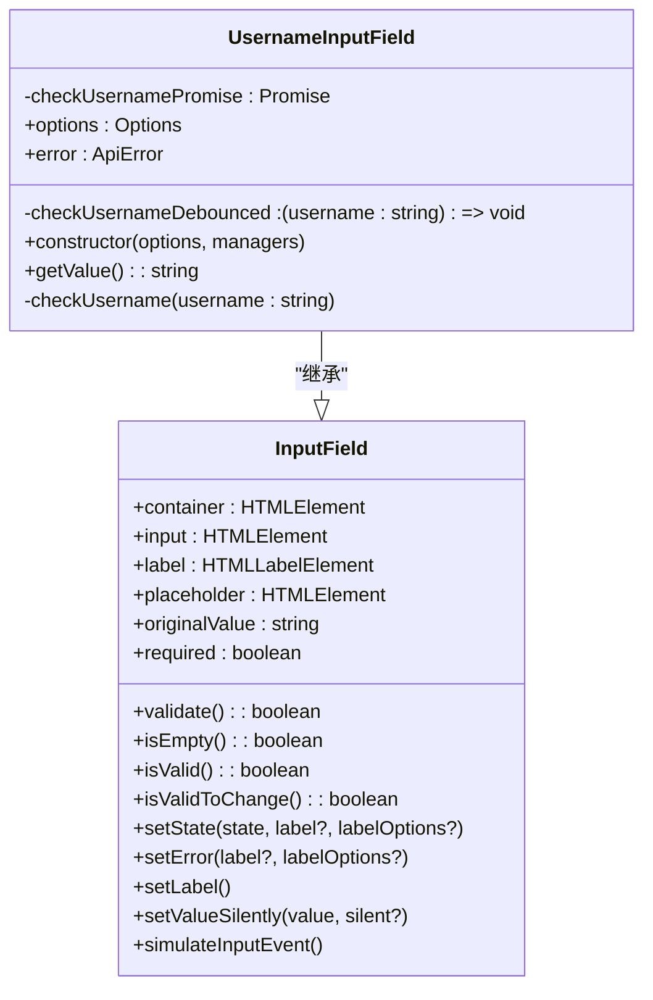
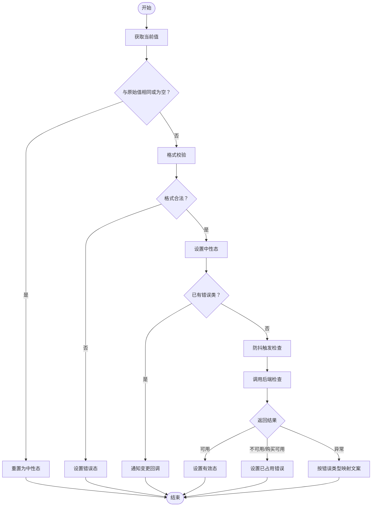
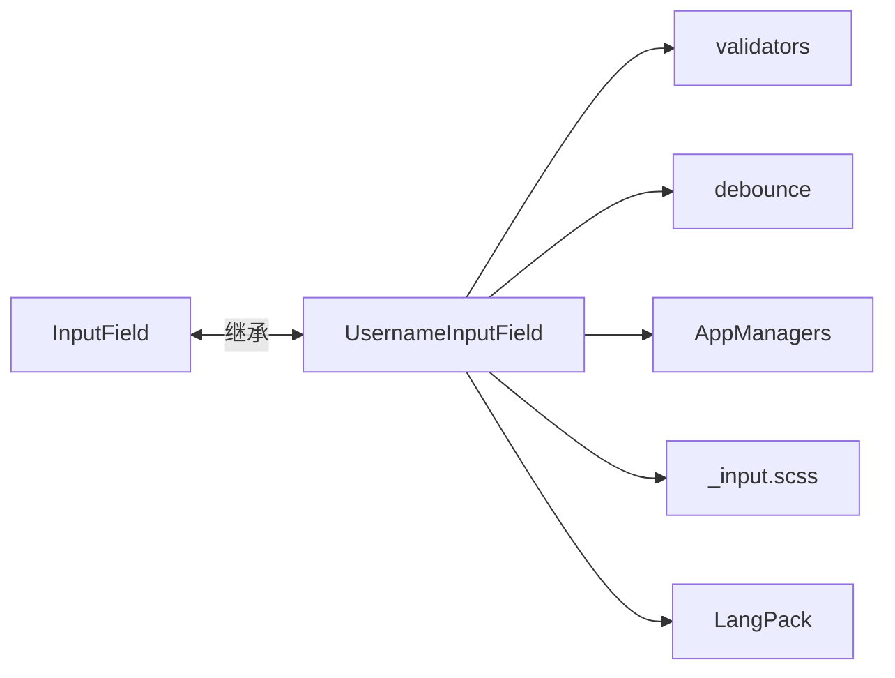

# 用户名输入组件

<cite>
**本文引用的文件**
- [usernameInputField.ts](file://src/components/usernameInputField.ts)
- [inputField.ts](file://src/components/inputField.ts)
- [validators.ts](file://src/lib/richTextProcessor/validators.ts)
- [debounce.ts](file://src/helpers/schedulers/debounce.ts)
- [editProfile.ts](file://src/components/sidebarLeft/tabs/editProfile.ts)
- [_input.scss](file://src/scss/partials/_input.scss)
- [usernamesSection.ts](file://src/components/usernamesSection.ts)
- [langPack.ts](file://src/lib/langPack.ts)
</cite>

## 目录
1. [简介](#简介)
2. [项目结构](#项目结构)
3. [核心组件](#核心组件)
4. [架构总览](#架构总览)
5. [详细组件分析](#详细组件分析)
6. [依赖关系分析](#依赖关系分析)
7. [性能考虑](#性能考虑)
8. [故障排查指南](#故障排查指南)
9. [结论](#结论)
10. [附录：使用示例与最佳实践](#附录使用示例与最佳实践)

## 简介
本文件系统化梳理“用户名输入组件”的实现与使用，覆盖以下关键能力：
- 实时验证：输入时进行格式校验与可用性校验
- 异步后端集成：对用户名是否被占用进行实时反馈
- 建议功能：在输入时提供可能的用户名建议（概念性说明）
- 错误状态视觉反馈：边框颜色、标签文案与错误提示
- 国际化支持：提示文案多语言适配
- 使用场景：注册表单与账户设置
- 性能优化：防抖策略降低 API 调用频率

## 项目结构
该组件位于 src/components 下，依赖通用输入组件、验证器、调度器与样式模块，并通过应用管理器与后端交互。

图表来源
- [usernameInputField.ts](file://src/components/usernameInputField.ts#L1-L117)
- [inputField.ts](file://src/components/inputField.ts#L363-L400)
- [validators.ts](file://src/lib/richTextProcessor/validators.ts#L1-L34)
- [debounce.ts](file://src/helpers/schedulers/debounce.ts#L1-L79)
- [_input.scss](file://src/scss/partials/_input.scss#L176-L203)
- [editProfile.ts](file://src/components/sidebarLeft/tabs/editProfile.ts#L150-L185)
- [usernamesSection.ts](file://src/components/usernamesSection.ts#L58-L120)
- [langPack.ts](file://src/lib/langPack.ts#L1-L200)

章节来源
- [usernameInputField.ts](file://src/components/usernameInputField.ts#L1-L117)
- [inputField.ts](file://src/components/inputField.ts#L363-L400)
- [validators.ts](file://src/lib/richTextProcessor/validators.ts#L1-L34)
- [debounce.ts](file://src/helpers/schedulers/debounce.ts#L1-L79)
- [_input.scss](file://src/scss/partials/_input.scss#L176-L203)
- [editProfile.ts](file://src/components/sidebarLeft/tabs/editProfile.ts#L150-L185)
- [usernamesSection.ts](file://src/components/usernamesSection.ts#L58-L120)
- [langPack.ts](file://src/lib/langPack.ts#L1-L200)

## 核心组件
- UsernameInputField：继承自 InputField，扩展用户名输入的实时校验与后端可用性检查。
- InputField：通用输入组件，提供输入状态、错误/有效态切换、标签文案更新等基础能力。
- validators：用户名格式校验规则。
- debounce：防抖调度器，用于限制高频输入触发的 API 请求。
- 样式：基于类名 error/valid 控制边框与标签颜色。
- 国际化：通过 LangPackKey 提供多语言文案键值。

章节来源
- [usernameInputField.ts](file://src/components/usernameInputField.ts#L14-L117)
- [inputField.ts](file://src/components/inputField.ts#L782-L800)
- [validators.ts](file://src/lib/richTextProcessor/validators.ts#L1-L34)
- [debounce.ts](file://src/helpers/schedulers/debounce.ts#L1-L79)
- [_input.scss](file://src/scss/partials/_input.scss#L176-L203)
- [langPack.ts](file://src/lib/langPack.ts#L1-L200)

## 架构总览
用户名输入组件的运行流程如下：
- 输入事件监听：捕获 input 事件，获取当前值
- 格式校验：使用 isUsernameValid 判断长度、首字符、字符集与尾下划线规则
- 状态更新：若格式不合法，设置错误态；否则回到中性态
- 防抖请求：对用户名可用性检查进行防抖
- 后端校验：根据 peerId 决定调用用户或群组的检查接口
- 结果反馈：可用则显示“可用”状态，不可用或购买可用则显示“已占用”，异常按类型映射为对应文案

图表来源
- [usernameInputField.ts](file://src/components/usernameInputField.ts#L36-L116)
- [inputField.ts](file://src/components/inputField.ts#L782-L800)
- [validators.ts](file://src/lib/richTextProcessor/validators.ts#L1-L34)
- [debounce.ts](file://src/helpers/schedulers/debounce.ts#L1-L79)
- [_input.scss](file://src/scss/partials/_input.scss#L176-L203)

## 详细组件分析

### 组件类图

图表来源
- [inputField.ts](file://src/components/inputField.ts#L456-L800)
- [usernameInputField.ts](file://src/components/usernameInputField.ts#L14-L117)

章节来源
- [inputField.ts](file://src/components/inputField.ts#L456-L800)
- [usernameInputField.ts](file://src/components/usernameInputField.ts#L14-L117)

### 输入时格式检查与可用性验证流程
- 格式检查：长度、首字符、字符集、尾下划线与连续下划线规则
- 可用性检查：防抖后调用后端接口，区分用户或群组场景
- 状态反馈：错误态与有效态分别映射到样式类与标签文案

图表来源
- [usernameInputField.ts](file://src/components/usernameInputField.ts#L36-L116)
- [validators.ts](file://src/lib/richTextProcessor/validators.ts#L1-L34)
- [debounce.ts](file://src/helpers/schedulers/debounce.ts#L1-L79)

章节来源
- [usernameInputField.ts](file://src/components/usernameInputField.ts#L36-L116)
- [validators.ts](file://src/lib/richTextProcessor/validators.ts#L1-L34)
- [debounce.ts](file://src/helpers/schedulers/debounce.ts#L1-L79)

### 与后端服务的异步验证集成
- 用户场景：调用用户检查接口
- 群组场景：调用群组检查接口
- 并发保护：避免旧请求覆盖新请求，确保最终一致性
- 错误映射：将特定错误类型映射为“已占用”或“无效”

章节来源
- [usernameInputField.ts](file://src/components/usernameInputField.ts#L74-L116)

### 建议功能实现（概念性说明）
- 当前实现未包含自动建议列表，但可基于输入值与后端建议接口扩展
- 建议流程：输入时发起建议查询，渲染候选列表，支持键盘/鼠标选择
- 注意事项：建议列表需与防抖策略协同，避免频繁请求；选择建议后应同步更新输入值并触发可用性检查

[本节为概念性说明，不直接分析具体源码文件]

### 错误状态的视觉反馈设计
- 错误态：边框与标签变为危险色
- 有效态：边框与标签变为成功色
- 中性态：默认样式
- 动画与过渡：样式层提供平滑过渡效果

章节来源
- [_input.scss](file://src/scss/partials/_input.scss#L176-L203)

### 国际化支持
- 文案键值：invalidText、takenText、availableText
- 渲染方式：通过 InputField 的 setState 与 setLabel 更新标签文案
- 多语言：LangPackKey 由 LangPack 提供，支持本地化字符串加载与应用

章节来源
- [usernameInputField.ts](file://src/components/usernameInputField.ts#L17-L25)
- [inputField.ts](file://src/components/inputField.ts#L782-L800)
- [langPack.ts](file://src/lib/langPack.ts#L1-L200)

## 依赖关系分析
- 组件耦合
  - UsernameInputField 依赖 InputField（继承）与 validators（格式校验）
  - 通过 debounce 降低 API 调用频率
  - 通过样式类控制视觉反馈
- 外部依赖
  - AppManagers：提供用户/群组检查接口
  - LangPack：提供多语言文案键值

图表来源
- [usernameInputField.ts](file://src/components/usernameInputField.ts#L14-L117)
- [inputField.ts](file://src/components/inputField.ts#L456-L800)
- [validators.ts](file://src/lib/richTextProcessor/validators.ts#L1-L34)
- [debounce.ts](file://src/helpers/schedulers/debounce.ts#L1-L79)
- [_input.scss](file://src/scss/partials/_input.scss#L176-L203)
- [langPack.ts](file://src/lib/langPack.ts#L1-L200)

章节来源
- [usernameInputField.ts](file://src/components/usernameInputField.ts#L14-L117)
- [inputField.ts](file://src/components/inputField.ts#L456-L800)
- [validators.ts](file://src/lib/richTextProcessor/validators.ts#L1-L34)
- [debounce.ts](file://src/helpers/schedulers/debounce.ts#L1-L79)
- [_input.scss](file://src/scss/partials/_input.scss#L176-L203)
- [langPack.ts](file://src/lib/langPack.ts#L1-L200)

## 性能考虑
- 防抖策略：默认 150ms，避免频繁触发后端检查
- 并发保护：同一时间仅保留最新一次检查请求，防止旧结果覆盖新结果
- 变更检测：仅在格式合法且值变化时触发检查
- 样式过渡：CSS 过渡减少频繁 DOM 操作带来的重排

章节来源
- [usernameInputField.ts](file://src/components/usernameInputField.ts#L34-L56)
- [usernameInputField.ts](file://src/components/usernameInputField.ts#L70-L116)
- [debounce.ts](file://src/helpers/schedulers/debounce.ts#L1-L79)
- [_input.scss](file://src/scss/partials/_input.scss#L176-L203)

## 故障排查指南
- 症状：输入后立即报错
  - 排查：确认输入值是否满足格式要求（长度、首字符、字符集、尾下划线）
  - 参考：格式校验逻辑
- 症状：后端检查无响应或频繁失败
  - 排查：检查防抖配置与并发保护是否生效；确认网络状态与接口可用性
  - 参考：防抖与并发保护实现
- 症状：错误文案未显示或显示不正确
  - 排查：确认 LangPackKey 是否正确传入；检查标签渲染逻辑
  - 参考：InputField 的 setState 与 setLabel
- 症状：样式未生效
  - 排查：确认 .error/.valid 类是否正确添加；检查样式优先级

章节来源
- [usernameInputField.ts](file://src/components/usernameInputField.ts#L36-L116)
- [inputField.ts](file://src/components/inputField.ts#L782-L800)
- [validators.ts](file://src/lib/richTextProcessor/validators.ts#L1-L34)
- [debounce.ts](file://src/helpers/schedulers/debounce.ts#L1-L79)
- [_input.scss](file://src/scss/partials/_input.scss#L176-L203)

## 结论
用户名输入组件通过“格式校验 + 防抖 + 后端可用性检查”的组合，实现了流畅的实时反馈体验。其继承自通用输入组件，复用状态管理与样式体系，具备良好的可维护性与扩展性。建议在需要时引入“用户名建议”功能，并保持与防抖策略的一致性，以进一步提升用户体验。

[本节为总结性内容，不直接分析具体源码文件]

## 附录：使用示例与最佳实践

### 使用示例
- 账户设置页（编辑资料）
  - 在编辑资料页面中，用户名输入组件作为独立输入项出现，onChange 会联动保存按钮状态与购买提示
  - 参考路径：[editProfile.ts](file://src/components/sidebarLeft/tabs/editProfile.ts#L150-L185)
- 用户名列表与激活切换
  - 用户名列表组件与用户名输入组件配合使用，支持激活/停用用户名链接
  - 参考路径：[usernamesSection.ts](file://src/components/usernamesSection.ts#L58-L120)

### 最佳实践
- 格式校验前置：在用户输入时即时反馈，减少无效请求
- 防抖参数权衡：根据网络状况调整防抖时长，兼顾体验与准确性
- 错误文案统一：通过 LangPackKey 管理文案，确保多语言一致
- 视觉反馈明确：错误态与有效态使用明显对比色，辅助用户理解状态
- 建议功能扩展：如需建议列表，建议与防抖结合，并在选择建议后重新触发可用性检查

章节来源
- [editProfile.ts](file://src/components/sidebarLeft/tabs/editProfile.ts#L150-L185)
- [usernamesSection.ts](file://src/components/usernamesSection.ts#L58-L120)
- [usernameInputField.ts](file://src/components/usernameInputField.ts#L17-L25)
- [inputField.ts](file://src/components/inputField.ts#L782-L800)
- [langPack.ts](file://src/lib/langPack.ts#L1-L200)