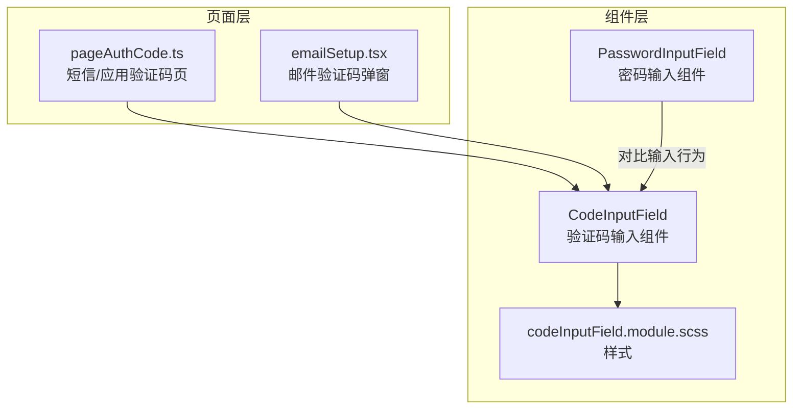
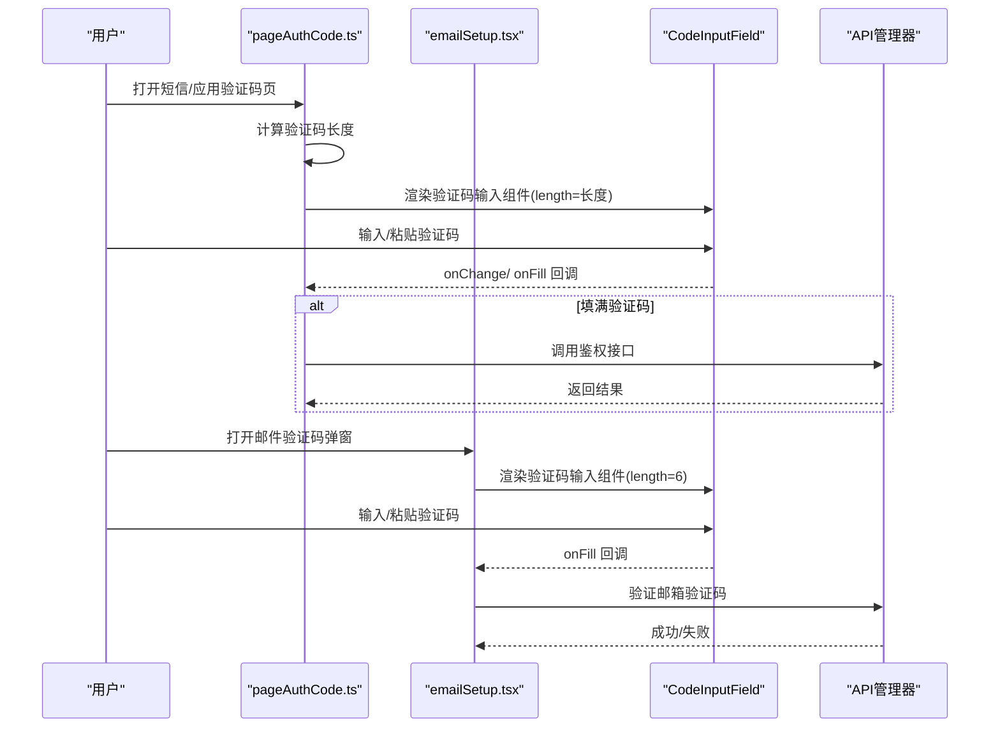
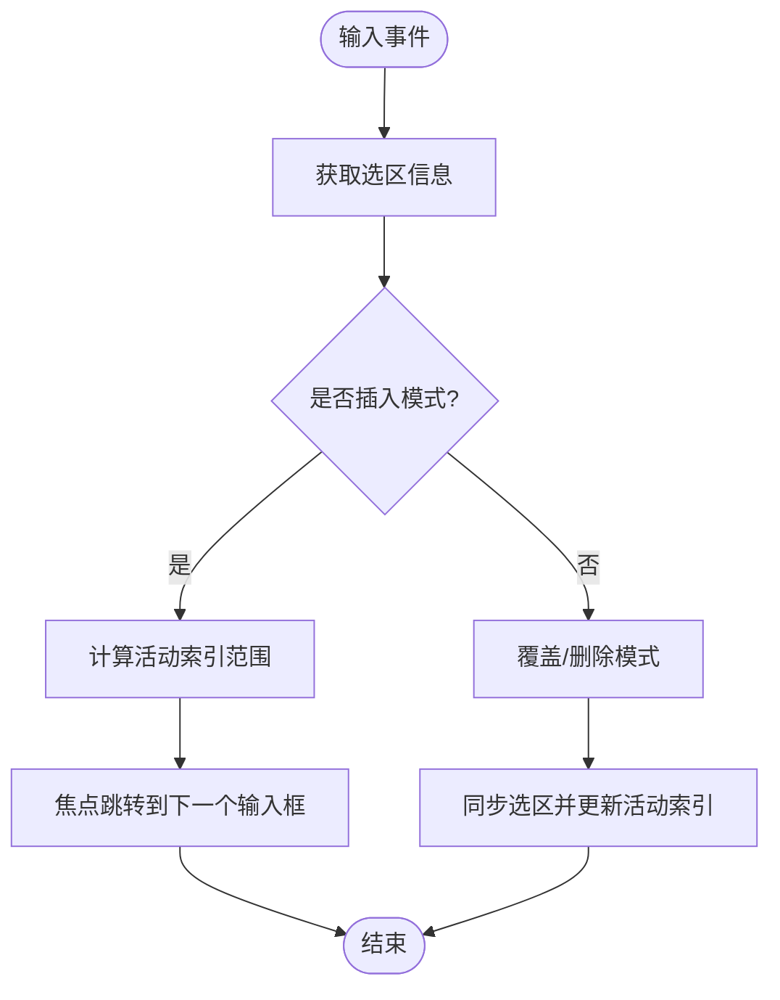
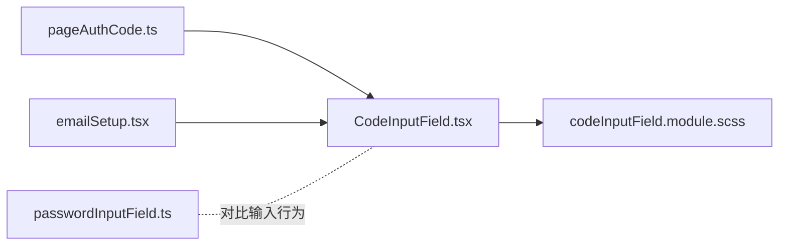

# 验证码输入组件

<cite>
**本文引用的文件**
- [src/components/codeInputField.tsx](file://src/components/codeInputField.tsx)
- [src/components/codeInputField.module.scss](file://src/components/codeInputField.module.scss)
- [src/pages/pageAuthCode.ts](file://src/pages/pageAuthCode.ts)
- [src/components/popups/emailSetup.tsx](file://src/components/popups/emailSetup.tsx)
- [src/components/passwordInputField.ts](file://src/components/passwordInputField.ts)
- [index.html](file://index.html)
</cite>

## 目录
1. [简介](#简介)
2. [项目结构](#项目结构)
3. [核心组件](#核心组件)
4. [架构总览](#架构总览)
5. [详细组件分析](#详细组件分析)
6. [依赖关系分析](#依赖关系分析)
7. [性能考量](#性能考量)
8. [故障排查指南](#故障排查指南)
9. [结论](#结论)
10. [附录](#附录)

## 简介
本文件系统化梳理“验证码输入组件”的实现与使用，重点覆盖以下方面：
- 多字符分隔显示：通过隐藏真实输入框并在其上方渲染等宽数字框，实现视觉上的分段显示与光标闪烁。
- 自动焦点切换：在输入过程中根据当前选择位置与插入状态，动态调整焦点到下一个输入框，提升连续输入体验。
- 粘贴处理：对粘贴内容进行过滤与截断，确保仅保留数字且不超过长度上限，并在填满时触发完成回调。
- 响应式设计：基于容器查询与媒体查询，适配小屏设备的紧凑布局。
- 无障碍访问：通过语义化输入属性、键盘事件与可见错误提示，保障键盘导航与屏幕阅读器可用性。
- 实际用例：双因素认证（短信/应用内）与邮件验证码验证流程。
- 可配置属性：输入框数量、字符类型限制、自动提交与错误态展示等。

## 项目结构
验证码输入组件位于组件层，配合页面与弹窗模块共同完成登录与验证流程：
- 组件层：验证码输入组件及其样式文件
- 页面层：登录验证码页与邮件验证码弹窗
- 输入辅助：密码输入组件（用于对比组件的通用输入行为）



图表来源
- [src/components/codeInputField.tsx](file://src/components/codeInputField.tsx#L1-L297)
- [src/components/codeInputField.module.scss](file://src/components/codeInputField.module.scss#L1-L112)
- [src/pages/pageAuthCode.ts](file://src/pages/pageAuthCode.ts#L1-L328)
- [src/components/popups/emailSetup.tsx](file://src/components/popups/emailSetup.tsx#L1-L380)
- [src/components/passwordInputField.ts](file://src/components/passwordInputField.ts#L1-L71)

章节来源
- [src/components/codeInputField.tsx](file://src/components/codeInputField.tsx#L1-L297)
- [src/components/codeInputField.module.scss](file://src/components/codeInputField.module.scss#L1-L112)
- [src/pages/pageAuthCode.ts](file://src/pages/pageAuthCode.ts#L1-L328)
- [src/components/popups/emailSetup.tsx](file://src/components/popups/emailSetup.tsx#L1-L380)
- [src/components/passwordInputField.ts](file://src/components/passwordInputField.ts#L1-L71)

## 核心组件
- 验证码输入组件（CodeInputField）
  - 提供等宽数字框的视觉分隔显示，隐藏真实输入框以实现精确控制。
  - 内置输入过滤、长度截断、选择同步与插入模式判断。
  - 暴露长度、值信号、错误态、禁用态以及变更/填满回调。
- 样式（codeInputField.module.scss）
  - 使用容器查询与媒体查询实现响应式布局。
  - 定义数字框边框、激活态、错误态、禁用态与光标动画。
- 页面与弹窗集成
  - 登录验证码页：根据发送方式动态确定验证码长度，并在填满时发起鉴权请求。
  - 邮件验证码弹窗：在第二步中使用验证码输入组件进行校验。

章节来源
- [src/components/codeInputField.tsx](file://src/components/codeInputField.tsx#L65-L296)
- [src/components/codeInputField.module.scss](file://src/components/codeInputField.module.scss#L1-L112)
- [src/pages/pageAuthCode.ts](file://src/pages/pageAuthCode.ts#L249-L316)
- [src/components/popups/emailSetup.tsx](file://src/components/popups/emailSetup.tsx#L238-L247)

## 架构总览
验证码输入组件在页面与弹窗中的调用流程如下：



图表来源
- [src/pages/pageAuthCode.ts](file://src/pages/pageAuthCode.ts#L249-L316)
- [src/components/popups/emailSetup.tsx](file://src/components/popups/emailSetup.tsx#L238-L247)
- [src/components/codeInputField.tsx](file://src/components/codeInputField.tsx#L232-L273)

## 详细组件分析

### 组件类与渲染逻辑
- 兼容包装类（CodeInputFieldCompat）
  - 将函数式组件封装为可实例化的类，便于在页面中以容器形式挂载与清理。
  - 对外暴露 error/disabled/value 的 setter 与 value getter，便于页面层控制状态。
- 函数式组件（CodeInputField）
  - 使用 SolidJS 信号与索引渲染，按 length 动态生成等宽数字框。
  - 通过透明输入框与绝对定位实现视觉分隔与光标控制。
  - 内部维护插入模式、选择范围与焦点状态，保证键盘导航与选择行为一致。

```mermaid
classDiagram
class CodeInputFieldCompat {
+container : HTMLDivElement
+input : HTMLInputElement
+options
+error
+disabled
+value
+cleanup()
}
class CodeInputField {
+props : {valueSignal, ref, class, length, onChange, onFill, error, disabled}
+render()
}
CodeInputFieldCompat --> CodeInputField : "创建并持有"
```

图表来源
- [src/components/codeInputField.tsx](file://src/components/codeInputField.tsx#L13-L63)
- [src/components/codeInputField.tsx](file://src/components/codeInputField.tsx#L65-L296)

章节来源
- [src/components/codeInputField.tsx](file://src/components/codeInputField.tsx#L13-L63)
- [src/components/codeInputField.tsx](file://src/components/codeInputField.tsx#L65-L296)

### 多字符分隔显示与布局
- 视觉分隔
  - 使用透明输入框作为底层输入通道，上方以 Index 渲染固定数量的数字框，每个数字框居中显示已输入字符。
  - 数字框采用等宽字体与等尺寸，确保对齐与视觉一致性。
- 间距控制
  - 通过容器的 gap 控制数字框之间的间距；在极窄容器下进一步缩小尺寸。
- 激活态与错误态
  - 当前活动数字框高亮边框；错误态下统一变为危险色；禁用态整体半透明并阻止交互。
- 光标与过渡
  - 插入模式下在当前索引处显示光标动画；字符进入时使用过渡动画避免闪烁。

章节来源
- [src/components/codeInputField.module.scss](file://src/components/codeInputField.module.scss#L1-L112)

### 自动焦点切换逻辑
- 选择同步
  - 监听文档 selectionchange 事件，结合输入框的选区信息，计算当前活动起止索引。
- 插入模式判断
  - 当输入值增长或处于末尾插入时，标记为插入模式；否则为覆盖模式。
- 导航方向
  - 根据 Shift 键状态与上次选择方向，决定向前或向后移动焦点。
- 行为要点
  - 在插入模式下，若当前索引等于长度，表示已填满，此时组件不主动跳转，而是等待外部 onFill 回调触发后续动作。
  - 在覆盖/删除模式下，组件会根据选择范围更新活动索引，保持视觉与逻辑一致。



图表来源
- [src/components/codeInputField.tsx](file://src/components/codeInputField.tsx#L189-L296)

章节来源
- [src/components/codeInputField.tsx](file://src/components/codeInputField.tsx#L189-L296)

### 粘贴处理与输入过滤
- 过滤规则
  - 仅允许数字字符；非数字字符会被移除。
  - 最终值会被截断至 length 上限。
- 无效输入保护
  - 若原始输入为空或最终值为空，或与旧值相同，将阻止默认行为并恢复原值与选区。
- 完成回调
  - 当最终值长度达到 length 时，触发 onFill 回调，交由上层决定下一步动作（如提交）。

章节来源
- [src/components/codeInputField.tsx](file://src/components/codeInputField.tsx#L232-L273)

### 响应式设计
- 容器查询
  - 在容器宽度小于等于阈值时，数字框尺寸自适应缩小，保证在小屏设备上仍有良好可读性。
- 媒体查询
  - 结合页面与弹窗的布局，确保在移动端与桌面端均能获得一致的输入体验。
- 视觉反馈
  - 错误态与禁用态通过颜色变量与透明度变化，增强可感知性。

章节来源
- [src/components/codeInputField.module.scss](file://src/components/codeInputField.module.scss#L90-L112)
- [src/pages/pageAuthCode.ts](file://src/pages/pageAuthCode.ts#L143-L177)
- [src/components/popups/emailSetup.tsx](file://src/components/popups/emailSetup.tsx#L218-L247)

### 无障碍访问支持
- 语义化输入属性
  - 使用 numeric 输入模式、one-time-code 自动补全、required、pattern 与 spellcheck 关闭，减少误输入。
- 键盘导航
  - 支持 Shift 选择、方向键导航与删除键；通过 selectionchange 与选区同步，确保键盘操作与视觉一致。
- 错误提示
  - 错误态通过样式与错误标签文本提示，配合屏幕阅读器朗读。
- 焦点管理
  - 页面与弹窗在首次加载时主动聚焦输入框，提升首屏可达性。

章节来源
- [src/components/codeInputField.tsx](file://src/components/codeInputField.tsx#L206-L231)
- [src/pages/pageAuthCode.ts](file://src/pages/pageAuthCode.ts#L318-L328)
- [src/components/popups/emailSetup.tsx](file://src/components/popups/emailSetup.tsx#L175-L181)

### 实际使用示例

#### 双因素认证（短信/应用内）
- 页面逻辑
  - 根据发送类型确定验证码长度；初始化验证码输入组件；监听 onChange 清理错误状态；监听 onFill 提交验证码。
  - 鉴权成功后进入主界面；失败时根据错误类型设置错误态并重新聚焦输入框。
- 关键路径
  - 初始化与长度设置：[渲染与长度设置](file://src/pages/pageAuthCode.ts#L249-L271)
  - 填满提交：[onFill 回调](file://src/pages/pageAuthCode.ts#L265-L267)
  - 错误处理与重置：[错误分支与重置](file://src/pages/pageAuthCode.ts#L89-L123)

章节来源
- [src/pages/pageAuthCode.ts](file://src/pages/pageAuthCode.ts#L249-L316)

#### 邮件验证码验证
- 弹窗逻辑
  - 第一步输入邮箱，第二步使用验证码输入组件进行验证；填满后调用验证接口。
  - 错误时清空输入并重新聚焦，避免闪烁。
- 关键路径
  - 渲染验证码输入组件：[组件渲染与长度](file://src/components/popups/emailSetup.tsx#L238-L247)
  - 填满提交：[onFill 回调](file://src/components/popups/emailSetup.tsx#L244-L245)
  - 错误处理与重置：[错误分支与重置](file://src/components/popups/emailSetup.tsx#L195-L214)

章节来源
- [src/components/popups/emailSetup.tsx](file://src/components/popups/emailSetup.tsx#L161-L247)

### 可配置属性
- 必填参数
  - length：验证码位数（由发送类型决定）
- 可选参数
  - valueSignal：双向绑定的值信号
  - onChange：每次值变化时回调
  - onFill：当值长度达到 length 时回调
  - error：错误态开关
  - disabled：禁用态开关
  - class/ref：附加样式与引用
- 与页面/弹窗的集成
  - 页面与弹窗通过传入 length、onChange、onFill 等参数，将业务逻辑与组件解耦。

章节来源
- [src/components/codeInputField.tsx](file://src/components/codeInputField.tsx#L21-L42)
- [src/components/codeInputField.tsx](file://src/components/codeInputField.tsx#L65-L96)
- [src/pages/pageAuthCode.ts](file://src/pages/pageAuthCode.ts#L258-L268)
- [src/components/popups/emailSetup.tsx](file://src/components/popups/emailSetup.tsx#L238-L247)

## 依赖关系分析
- 组件依赖
  - CodeInputField 依赖 SolidJS 的信号与索引渲染能力，以及过渡组件实现字符进入动画。
  - 样式依赖 CSS 变量与容器查询，实现主题与响应式适配。
- 页面与弹窗依赖
  - 页面与弹窗通过传参驱动组件行为，形成“数据驱动 UI”的模式。
- 输入辅助对比
  - PasswordInputField 提供密码可见性切换等通用输入行为，可与验证码组件在同一页面共存。



图表来源
- [src/components/codeInputField.tsx](file://src/components/codeInputField.tsx#L1-L297)
- [src/components/codeInputField.module.scss](file://src/components/codeInputField.module.scss#L1-L112)
- [src/pages/pageAuthCode.ts](file://src/pages/pageAuthCode.ts#L1-L328)
- [src/components/popups/emailSetup.tsx](file://src/components/popups/emailSetup.tsx#L1-L380)
- [src/components/passwordInputField.ts](file://src/components/passwordInputField.ts#L1-L71)

章节来源
- [src/components/codeInputField.tsx](file://src/components/codeInputField.tsx#L1-L297)
- [src/components/codeInputField.module.scss](file://src/components/codeInputField.module.scss#L1-L112)
- [src/pages/pageAuthCode.ts](file://src/pages/pageAuthCode.ts#L1-L328)
- [src/components/popups/emailSetup.tsx](file://src/components/popups/emailSetup.tsx#L1-L380)
- [src/components/passwordInputField.ts](file://src/components/passwordInputField.ts#L1-L71)

## 性能考量
- 渲染优化
  - 使用索引渲染与过渡组件，避免不必要的 DOM 更新；插入模式下的光标动画与字符进入动画在视觉上更流畅。
- 事件监听
  - selectionchange 事件在文档级别监听，需注意在组件卸载时清理相关副作用（组件内部已通过 SolidJS 生命周期管理）。
- 输入过滤
  - 在输入阶段即时过滤与截断，减少后续处理成本；对无效输入直接回滚，避免多次重渲染。

[本节为通用性能建议，不直接分析具体文件]

## 故障排查指南
- 输入无效字符
  - 症状：粘贴非数字或输入字母导致无反应。
  - 排查：确认输入过滤逻辑与 pattern 属性是否生效；检查 onInput 中的截断与回滚逻辑。
  - 参考路径：[输入过滤与截断](file://src/components/codeInputField.tsx#L232-L273)
- 填满未触发回调
  - 症状：输入完成后无自动提交。
  - 排查：确认 length 是否正确设置；检查 onFill 回调是否被上层消费。
  - 参考路径：[长度判定与回调](file://src/components/codeInputField.tsx#L266-L273)
- 错误态不显示
  - 症状：错误发生但无视觉提示。
  - 排查：确认 error 属性是否传递；检查样式中错误态类名是否应用。
  - 参考路径：[错误态样式](file://src/components/codeInputField.module.scss#L54-L61)
- 焦点未聚焦
  - 症状：页面加载后无法直接输入。
  - 排查：确认页面/弹窗是否在挂载后主动聚焦；检查禁用态与可见性。
  - 参考路径：[页面聚焦](file://src/pages/pageAuthCode.ts#L318-L328)、[弹窗聚焦](file://src/components/popups/emailSetup.tsx#L175-L181)

章节来源
- [src/components/codeInputField.tsx](file://src/components/codeInputField.tsx#L232-L273)
- [src/components/codeInputField.module.scss](file://src/components/codeInputField.module.scss#L54-L61)
- [src/pages/pageAuthCode.ts](file://src/pages/pageAuthCode.ts#L318-L328)
- [src/components/popups/emailSetup.tsx](file://src/components/popups/emailSetup.tsx#L175-L181)

## 结论
验证码输入组件通过“隐藏输入框 + 等宽数字框”的方式实现了清晰的视觉分隔与良好的键盘导航体验；内置的输入过滤、长度截断与选择同步机制，使得粘贴与连续输入更加稳定可靠；配合页面与弹窗的业务逻辑，能够无缝支持短信/应用内验证码与邮件验证码两大场景。同时，样式层的响应式与无障碍属性为跨设备与可访问性提供了基础保障。

[本节为总结性内容，不直接分析具体文件]

## 附录

### 可配置属性一览
- length：验证码位数（必填）
- valueSignal：值信号（可选）
- onChange：值变化回调（可选）
- onFill：填满回调（可选）
- error：错误态（可选）
- disabled：禁用态（可选）
- class/ref：样式与引用（可选）

章节来源
- [src/components/codeInputField.tsx](file://src/components/codeInputField.tsx#L21-L42)
- [src/components/codeInputField.tsx](file://src/components/codeInputField.tsx#L65-L96)

### 无障碍与视口元信息
- 视口与主题
  - 页面头部包含 viewport、theme-color 等元信息，有助于在移动端与 PWA 场景下获得一致体验。
- 无障碍属性
  - 组件使用 numeric 输入模式、one-time-code 自动补全、required 与 pattern，降低误输入风险；错误态与禁用态通过样式与文本提示增强可感知性。

章节来源
- [index.html](file://index.html#L1-L28)
- [src/components/codeInputField.tsx](file://src/components/codeInputField.tsx#L206-L231)