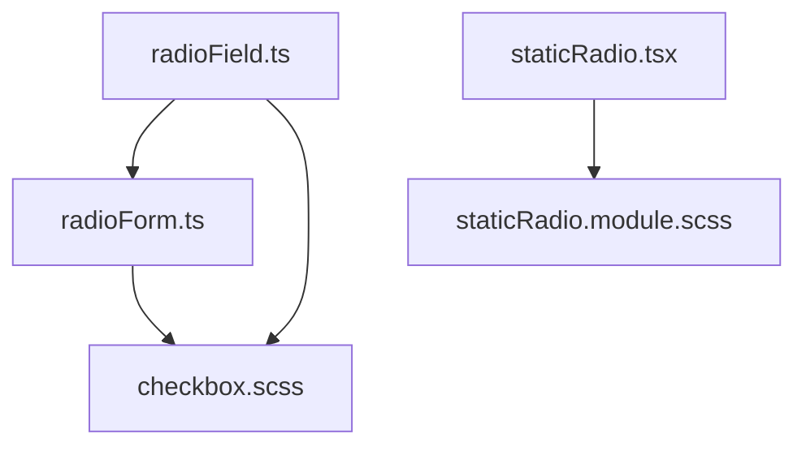
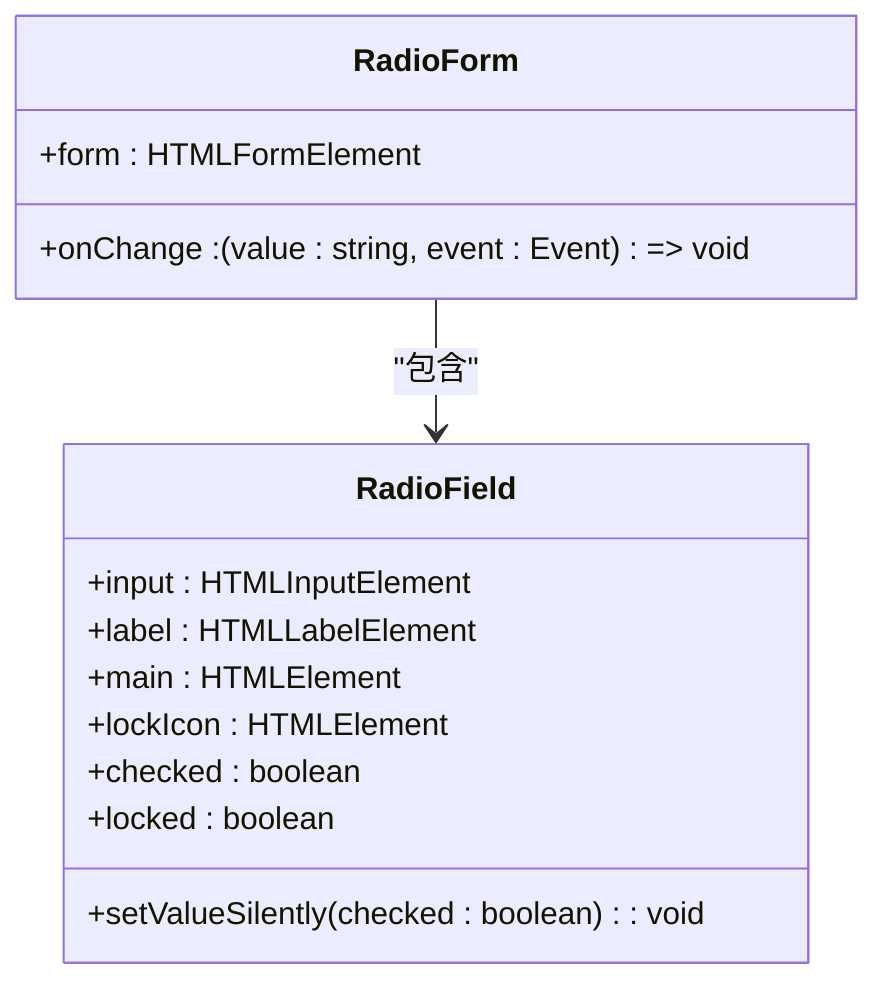
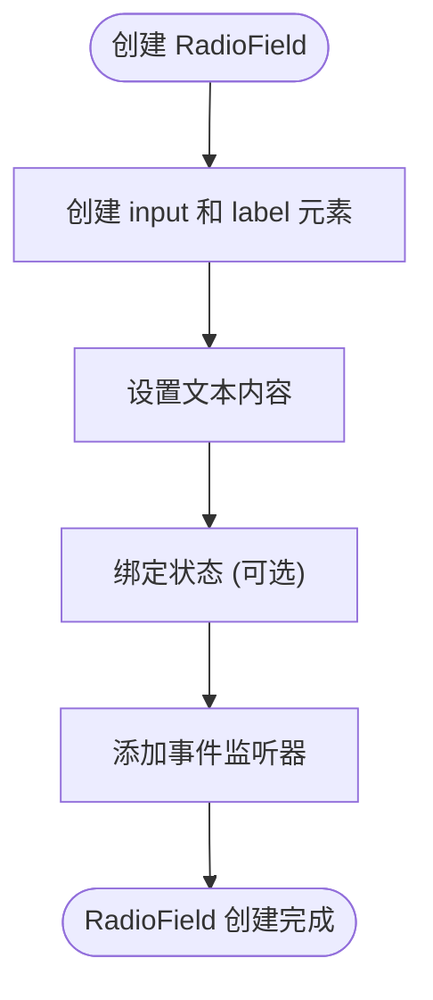
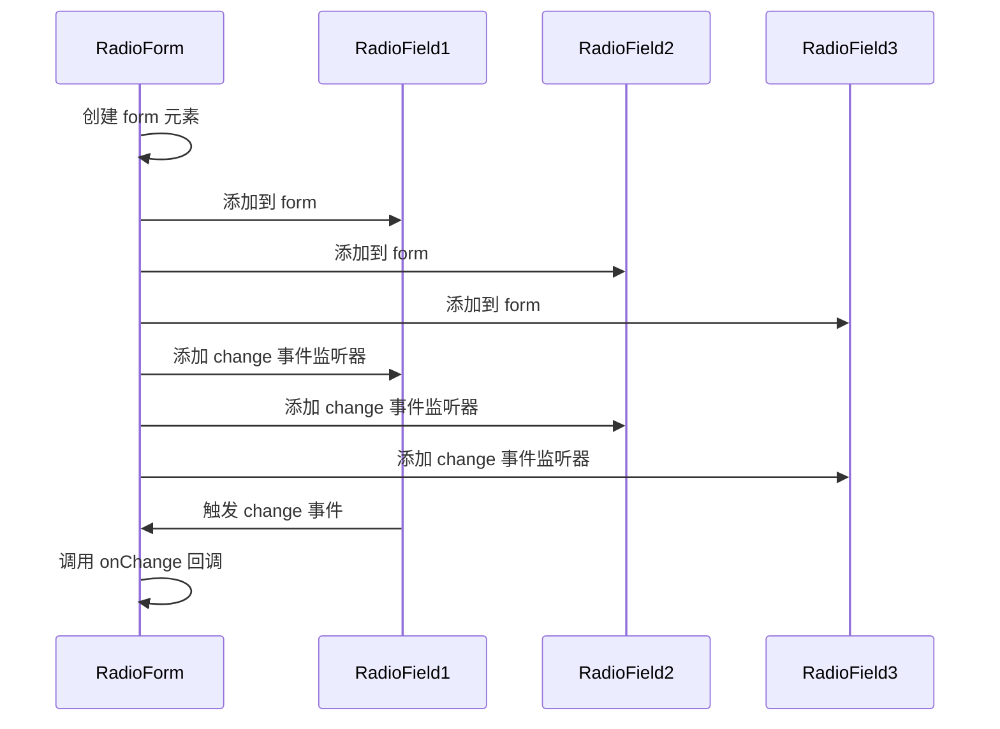
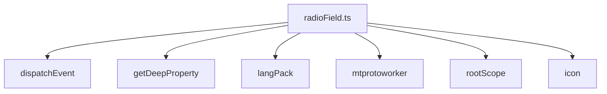

# 单选按钮组件

<cite>
**本文档中引用的文件**  
- [radioField.ts](file://src/components/radioField.ts)
- [radioForm.ts](file://src/components/radioForm.ts)
- [staticRadio.tsx](file://src/components/staticRadio.tsx)
- [staticRadio.module.scss](file://src/components/staticRadio.module.scss)
- [checkbox.scss](file://src/scss/partials/_checkbox.scss)
- [createPoll.ts](file://src/components/popups/createPoll.ts)
- [privacySection.ts](file://src/components/privacySection.ts)
</cite>

## 目录
1. [简介](#简介)
2. [项目结构](#项目结构)
3. [核心组件](#核心组件)
4. [架构概述](#架构概述)
5. [详细组件分析](#详细组件分析)
6. [依赖分析](#依赖分析)
7. [性能考虑](#性能考虑)
8. [故障排除指南](#故障排除指南)
9. [结论](#结论)
10. [附录](#附录)（如有必要）

## 简介
本文档详细介绍了单选按钮组件的实现机制，包括单选按钮组的互斥选择行为、值绑定逻辑、状态管理、视觉反馈以及表单容器的功能。文档还涵盖了无障碍访问实现、样式定制方法和实际使用示例。

## 项目结构
单选按钮组件主要由以下几个文件组成：
- `radioField.ts`：单选按钮字段组件，负责单个单选按钮的创建和管理。
- `radioForm.ts`：单选按钮表单容器组件，负责管理一组单选按钮的互斥选择行为。
- `staticRadio.tsx`：静态单选按钮组件，用于在SolidJS中渲染单选按钮。
- `staticRadio.module.scss`：单选按钮的样式定义。
- `checkbox.scss`：单选按钮的全局样式定义。



**图表来源**
- [radioField.ts](file://src/components/radioField.ts#L1-L114)
- [radioForm.ts](file://src/components/radioForm.ts#L1-L22)
- [staticRadio.tsx](file://src/components/staticRadio.tsx#L1-L26)
- [staticRadio.module.scss](file://src/components/staticRadio.module.scss#L1-L51)
- [checkbox.scss](file://src/scss/partials/_checkbox.scss#L171-L303)

**章节来源**
- [radioField.ts](file://src/components/radioField.ts#L1-L114)
- [radioForm.ts](file://src/components/radioForm.ts#L1-L22)
- [staticRadio.tsx](file://src/components/staticRadio.tsx#L1-L26)
- [staticRadio.module.scss](file://src/components/staticRadio.module.scss#L1-L51)
- [checkbox.scss](file://src/scss/partials/_checkbox.scss#L171-L303)

## 核心组件
单选按钮组件的核心功能由`RadioField`类和`RadioForm`函数实现。`RadioField`类负责创建和管理单个单选按钮，而`RadioForm`函数负责管理一组单选按钮的互斥选择行为。

**章节来源**
- [radioField.ts](file://src/components/radioField.ts#L14-L114)
- [radioForm.ts](file://src/components/radioForm.ts#L7-L21)

## 架构概述
单选按钮组件的架构分为两个层次：单个单选按钮和单选按钮组。单个单选按钮由`RadioField`类创建，包含一个`input`元素和一个`label`元素。单选按钮组由`RadioForm`函数创建，将多个单选按钮组合在一起，并确保它们的互斥选择行为。



**图表来源**
- [radioField.ts](file://src/components/radioField.ts#L14-L114)
- [radioForm.ts](file://src/components/radioForm.ts#L7-L21)

## 详细组件分析

### RadioField 分析
`RadioField`类是单选按钮组件的核心，负责创建和管理单个单选按钮。它提供了以下功能：
- 创建单选按钮的`input`和`label`元素。
- 支持通过`text`、`textElement`或`langKey`设置单选按钮的文本。
- 支持通过`stateKey`绑定单选按钮的状态。
- 提供`checked`和`locked`属性来管理单选按钮的状态。



**图表来源**
- [radioField.ts](file://src/components/radioField.ts#L14-L114)

**章节来源**
- [radioField.ts](file://src/components/radioField.ts#L14-L114)

### RadioForm 分析
`RadioForm`函数负责管理一组单选按钮的互斥选择行为。它将多个`RadioField`实例组合在一起，并确保它们的互斥选择行为。



**图表来源**
- [radioForm.ts](file://src/components/radioForm.ts#L7-L21)

**章节来源**
- [radioForm.ts](file://src/components/radioForm.ts#L7-L21)

## 依赖分析
单选按钮组件依赖于以下文件和模块：
- `../helpers/dom/dispatchEvent`：用于模拟事件。
- `../helpers/object/getDeepProperty`：用于获取对象的深层属性。
- `../lib/langPack`：用于国际化。
- `../lib/mtproto/mtprotoworker`：用于获取应用状态。
- `../lib/rootScope`：用于访问应用的根作用域。
- `./icon`：用于显示锁定图标。



**图表来源**
- [radioField.ts](file://src/components/radioField.ts#L7-L12)

**章节来源**
- [radioField.ts](file://src/components/radioField.ts#L7-L12)

## 性能考虑
单选按钮组件在性能方面有以下考虑：
- 使用`addEventListener`来添加事件监听器，避免重复添加。
- 使用`getDeepProperty`来获取对象的深层属性，避免不必要的对象遍历。
- 使用`simulateEvent`来模拟事件，避免直接操作DOM。

## 故障排除指南
在使用单选按钮组件时，可能会遇到以下问题：
- 单选按钮无法选中：检查`input`元素的`name`属性是否正确设置。
- 单选按钮状态未正确绑定：检查`stateKey`是否正确设置，并确保应用状态已正确初始化。
- 单选按钮样式不正确：检查`staticRadio.module.scss`和`checkbox.scss`文件是否正确加载。

**章节来源**
- [radioField.ts](file://src/components/radioField.ts#L1-L114)
- [radioForm.ts](file://src/components/radioForm.ts#L1-L22)
- [staticRadio.module.scss](file://src/components/staticRadio.module.scss#L1-L51)
- [checkbox.scss](file://src/scss/partials/_checkbox.scss#L171-L303)

## 结论
单选按钮组件通过`RadioField`类和`RadioForm`函数实现了单选按钮的创建和管理。它提供了丰富的功能，包括状态绑定、互斥选择行为和样式定制。通过合理的架构设计和性能优化，单选按钮组件能够满足各种使用场景的需求。

## 附录
### 使用示例
```typescript
// 创建单选按钮组
const radio1 = new RadioField({
  text: '选项1',
  name: 'options',
  value: '1'
});

const radio2 = new RadioField({
  text: '选项2',
  name: 'options',
  value: '2'
});

const radio3 = new RadioField({
  text: '选项3',
  name: 'options',
  value: '3'
});

// 创建单选按钮表单
const form = RadioForm([
  { container: radio1.label, input: radio1.input },
  { container: radio2.label, input: radio2.input },
  { container: radio3.label, input: radio3.input }
], (value) => {
  console.log('选中的值:', value);
});
```

**章节来源**
- [radioField.ts](file://src/components/radioField.ts#L1-L114)
- [radioForm.ts](file://src/components/radioForm.ts#L1-L22)